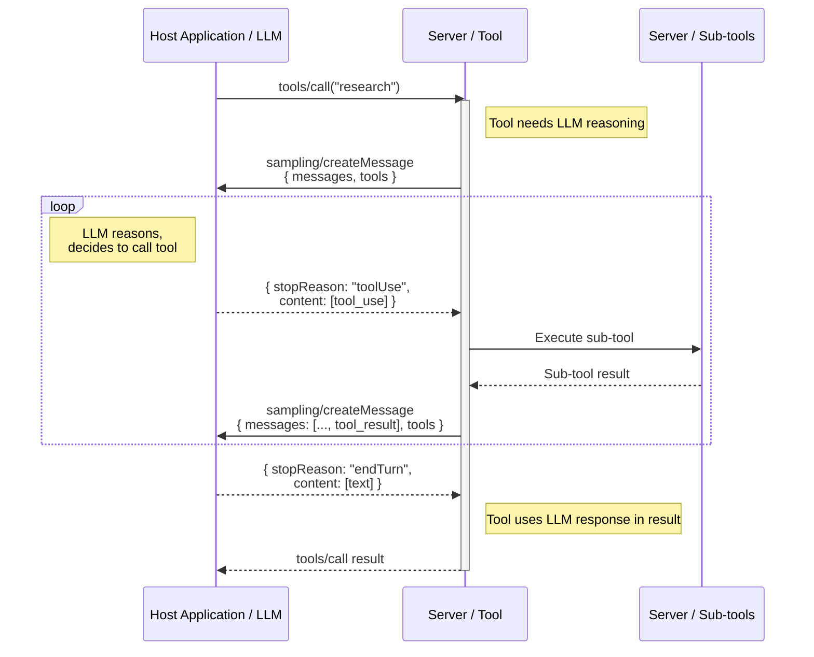

+++
date = "2025-12-12T12:00:00Z"
title = "Closing the Loop: Tool Support Comes to MCP Sampling"
description = "MCP Sampling now supports tool calls, enabling servers to become full agents that can research, iterate, and reason using the host application's LLM, no API keys required."
author = "Jonathan Hefner"
tags = ["sampling", "tools", "agentic"]
+++

Tool use transformed Large Language Models (LLMs) from text generators into agents that can take real-world actions. Before tools, asking an LLM about the weather would yield a plausible-sounding guess. With tools, it can actually look it up.

MCP extended that power across the entire ecosystem, becoming the standard way for AI agents to discover and use tools from any server. But there was an asymmetry in the architecture: while LLMs could act as agents, the tools they called couldn't. Even tools that used MCP's [sampling feature](https://modelcontextprotocol.io/specification/2025-11-25/client/sampling), which allows servers to request text completions from the host application's LLM, were limited to simple, one-shot text generation.

[Version `2025-11-25` of the MCP specification](https://modelcontextprotocol.io/specification/2025-11-25) has changed that thanks to [SEP-1577](https://github.com/modelcontextprotocol/modelcontextprotocol/issues/1577). Sampling now supports tool calling, which means tools themselves can now drive agentic workflows.

## The asymmetry in the architecture

Today's tool calls follow a simple pattern: an LLM reasons, invokes a tool, gets a result, and continues. This works well when tools are simple functions. But what if the tool _also_ needs to reason, in order to make decisions or coordinate steps?

MCP's sampling feature was designed for exactly this scenario: letting tools request LLM completions. But until now, sampling only supported simple text generation. A server could make multiple sampling calls and chain them together with code, but that code couldn't reason - it could only follow predetermined logic. The server could ask the LLM questions, but the LLM couldn't agentically investigate. This limited sampling to pre-tool-calling capabilities.

## What SEP-1577 adds

SEP-1577 introduces two new parameters to the `sampling/createMessage` request: `tools` and `toolChoice`. These allow a server to provide tool definitions when requesting a completion, and the LLM can then call those tools as part of its response.

```typescript
const result = await mcpServer.server.createMessage({
  messages: [
    {
      role: "user",
      content: {
        type: "text",
        text: "Research the latest developments in fusion energy and summarize the key breakthroughs.",
      },
    },
  ],
  tools: [
    {
      name: "web_search",
      description: "Search the web for current information",
      inputSchema: {
        type: "object",
        properties: {
          query: { type: "string", description: "Search query" },
        },
        required: ["query"],
      },
    },
  ],
  toolChoice: { mode: "auto" },
  maxTokens: 2000,
});
```

When the LLM decides to use a tool, it sends back a sampling response that has `stopReason: "toolUse"` and `tool_use` content blocks. The server then executes tools per the `tool_use` content blocks, and sends the results back in another sampling request. The LLM continues, potentially calling more tools, until it has everything it needs to give a final answer.

This is known as the **standard agentic loop**, but now it can happen _inside_ a tool implementation.

## How the loop works

Here's the complete flow:

1. A host application's LLM (the "outer" LLM) calls a tool on your server.
2. Your tool needs LLM capabilities to do its job, so it calls `sampling/createMessage` with the `tools` parameter.
3. The host application passes the sampling prompt and sampling tools list to a fresh instance of the LLM (the "inner" LLM).
4. The inner LLM reasons and decides to use one of the listed tools, so it returns `stopReason: "toolUse"`.
5. Your server executes the chosen tool, and calls `sampling/createMessage` again with the tool result.
6. Steps 4-5 repeat until the inner LLM returns `stopReason: "endTurn"`.
7. Your tool returns its result to the outer LLM.
8. The outer LLM can continue calling other tools, and each of those tools can potentially be agentic itself.



The key point is: the server drives the tool loop instead of the host application. The server decides which tools to offer, how to execute tool calls, and when the process is complete.

Here's a generic implementation of this pattern that you can adapt for your own tools using the [MCP TypeScript SDK](https://github.com/modelcontextprotocol/typescript-sdk):

```typescript
import { McpServer } from "@modelcontextprotocol/sdk/server/mcp.js";
import type {
  SamplingMessage,
  Tool,
  TextContent,
  ToolUseContent,
} from "@modelcontextprotocol/sdk/types.js";

async function agenticSampling(
  mcpServer: McpServer,
  messages: SamplingMessage[],
  tools: Tool[],
  maxIterations = 10,
): Promise<string> {
  const conversation = [...messages];

  for (let i = 0; i < maxIterations; i++) {
    const { content, stopReason } = await mcpServer.server.createMessage({
      messages: conversation,
      tools,
      toolChoice: { mode: "auto" },
      maxTokens: 4096,
    });

    const contentArray = Array.isArray(content) ? content : [content];

    conversation.push({ role: "assistant", content: contentArray });

    // Any stop reason other than "toolUse" means the LLM is done
    if (stopReason !== "toolUse") {
      return contentArray
        .filter((c): c is TextContent => c.type === "text")
        .map((c) => c.text)
        .join("");
    }

    // Execute tool calls and collect results
    const toolUses = contentArray.filter(
      (c): c is ToolUseContent => c.type === "tool_use",
    );

    const toolResults = await Promise.all(
      toolUses.map(async (toolUse) => ({
        type: "tool_result" as const,
        toolUseId: toolUse.id,
        content: [await executeTool(toolUse.name, toolUse.input)],
      })),
    );

    conversation.push({ role: "user", content: toolResults });
  }

  throw new Error("Max iterations reached");
}

async function executeTool(
  name: string,
  input: Record<string, unknown>,
): Promise<TextContent> {
  // Dispatch to your tool implementations...
}
```

## What this enables

Using sampling with tool calls, a tool can be as sophisticated as the agent that calls it. A few examples:

**Research tools** can search multiple sources, cross-reference what they find, and compile coherent summaries instead of just dumping raw search results for the outer agent to process.

**Code generation tools** can write code, run tests, observe failures, and iterate until the tests pass, returning verified working code instead of code that might not even run.

**Data analysis tools** can explore datasets, form hypotheses, run queries to test them, and produce insights, not just execute predetermined queries.

**Document processing tools** can read documents, extract information, and produce structured outputs, handling complexity internally through iterative reasoning.

The pattern extends naturally. Any tool that would benefit from reasoning, iteration, or multi-step workflows can now implement them directly.

## Capability negotiation

Not all clients will support tool use in sampling immediately. SEP-1577 adds a [`sampling.tools`](https://modelcontextprotocol.io/specification/2025-11-25/schema#clientcapabilities-sampling) capability flag so servers can detect support.

Servers should check for this capability flag when the client connects. If a tool requires sampling with tool calls, the simplest approach is to leave the tool out of `tools/list` when the capability isn't available. For tools that can still work with reduced functionality, consider implementing a fallback and mentioning the limitation in the tool's output so the outer LLM knows what's going on.

## A note on `includeContext`

SEP-1577 also soft-deprecates the `"thisServer"` and `"allServers"` values of the `includeContext` parameter. These values allowed servers to request conversation context from the current server or all connected servers, but their meaning was ambiguous and made it hard for clients to implement them consistently. This ambiguity contributed to low adoption of sampling overall.

## Getting started

SEP-1577 is part of MCP version `2025-11-25`. See the [sampling specification](https://modelcontextprotocol.io/specification/2025-11-25/client/sampling) for full protocol details.

SDK support is available in:

- **TypeScript SDK**: Version 1.23.0+ ([PR #1101](https://github.com/modelcontextprotocol/typescript-sdk/pull/1101))
- **Python SDK**: Version 1.23.0+ ([PR #1594](https://github.com/modelcontextprotocol/python-sdk/pull/1594))

To experiment with agentic sampling, update to an SDK version that includes these changes and ensure you're connecting to a client that advertises the `sampling.tools` capability.

## Acknowledgements

Thanks to [Olivier Chafik](https://github.com/ochafik) for authoring SEP-1577 and driving it through the proposal process, and to [Basil Hosmer](https://github.com/bhosmer-ant) for sponsoring the proposal. Thanks also to the community members who provided feedback during the review period.
