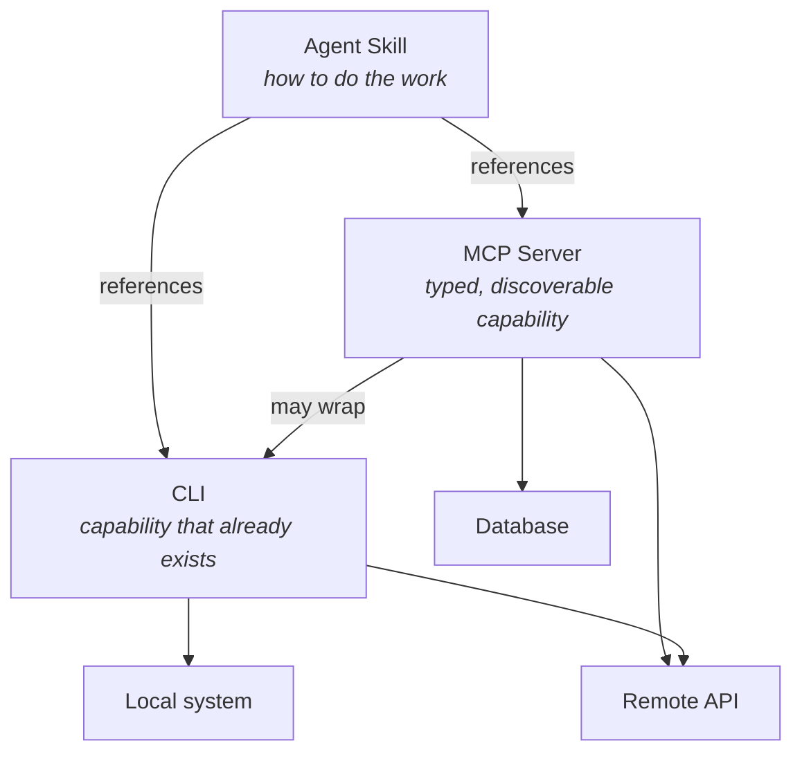

A question that comes up a lot, in Discord and in GitHub threads and in hallway conversations at conferences: _does my agent really need an MCP server if it can just run `gh`?_

It's a fair question. The answer is often "no, it doesn't" — and I say that as someone who spends most of his time on this protocol. But the question usually gets asked as though MCP, command-line tools, and Agent Skills are three horses in the same race. They aren't. They solve different problems, they sit at different layers, and in a lot of real systems you end up using all three at once.

This post tries to draw the lines clearly.

## What each of these actually is

**CLIs** are what's already on the machine. `git`, `gh`, `curl`, `jq`, `kubectl`, your company's internal tooling. The agent invokes them through a shell, reads whatever text comes back, and tries to make sense of it. There's no schema, no typed arguments, no capability negotiation. The tool doesn't know an agent is calling it, and the agent doesn't know what the tool can do until it tries.

That sounds like a criticism. It isn't. CLIs are everywhere, they're battle-tested, and they cost nothing to integrate. If the agent has a shell, it has access to decades of tooling that already works.

**Agent Skills** are folders of instructions and resources that an agent loads when they're relevant. A Skill doesn't give the agent a new capability — it teaches the agent how to use capabilities it already has. The contents are usually markdown files, maybe some reference scripts, maybe some example outputs. "When the user asks for a design document, use this template and put it in `docs/rfcs/`." "To cut a release, run these four commands in this order and check for this output between steps two and three."

Skills are workflow knowledge, packaged in a form an agent can load on demand. They're close to documentation, except the audience is a model rather than a person.

**MCP** is an integration protocol. A server exposes typed tools, resources, and prompts over JSON-RPC; a client discovers what's available through a capability handshake and presents it to the model. The [specification](https://modelcontextprotocol.io/specification/latest) covers structured arguments, OAuth-based authorization, subscriptions, progress notifications, and a handful of other things you need when the thing on the other end of the wire is software rather than a person.

The obvious cost is that someone has to build and run the server.

## They sit at different layers

If you arrange these three by what question they answer, the picture gets clearer:



A CLI is a capability. An MCP server is a capability with a contract on the front — schema, discovery, auth — so any MCP-aware host can use it without bespoke glue. A Skill is instructions layered on top of either one. They stack; they don't compete.

## Side by side

| Dimension                | CLI                         | Agent Skill                 | MCP Server                      |
| ------------------------ | --------------------------- | --------------------------- | ------------------------------- |
| What it provides         | Capability                  | Workflow knowledge          | Capability + contract           |
| Argument schema          | None (free-form argv)       | N/A — no execution surface  | JSON Schema per tool            |
| Discovery                | None — agent must know      | Agent reads a manifest      | `tools/list`, `resources/list`  |
| Auth                     | Whatever the binary does    | None — inherits the session | OAuth, per-user scoping         |
| Cross-client portability | High (if binary is present) | Low today (format varies)   | High — that's the point         |
| Distribution             | Package manager, `$PATH`    | Copy a folder               | Registry, remote URL, stdio     |
| Authoring cost           | Zero — it exists            | Low — write markdown        | Medium — build and run a server |
| Output structure         | Text, exit code             | N/A                         | Typed results, resource content |

No column wins. They're answering different questions. The useful exercise is figuring out which question you're actually asking.

## When to reach for which

Some heuristics that have held up for me.

**The tool already exists as a CLI, and you're the only one using it, in one environment.** Don't build anything. Let the agent call the binary. You are not obligated to put a protocol in front of `grep`.

**You're encoding _how_ to do something, not _what can be done_.** That's a Skill. "Deploy to staging" isn't a new capability — the agent already has `kubectl` and `gh`. What it lacks is the knowledge of which manifests to apply, what order, what to check between steps. Write it down.

**You need the same integration to work across multiple AI hosts.** You want Linear in Claude, in VS Code, in Cursor, in the internal tool your platform team built. MCP is the only one of the three that was designed for this. Write it once, any compliant host picks it up.

**You need real auth.** OAuth flows, per-user tokens, scoped permissions — MCP has this built into the protocol. CLIs handle auth in a hundred different ways and none of them were designed with a model in the loop. Skills don't handle auth at all; they inherit whatever the session has.

**You're shipping an integration as part of a product.** Customers don't want to install a binary and manage its config file. They want to paste a URL or click a button. MCP, especially now that [remote servers and the Registry](https://modelcontextprotocol.io/docs/concepts/registry) are stable.

**The job is a one-off script for your own machine.** Shell. You're done. Move on.

## They compose — that's the useful part

The framing that breaks most often is "pick one." In practice the interesting systems use all three.

### MCP server wrapping a CLI

A common and underrated pattern. You get a typed schema that the model can target reliably, and underneath you're shelling out to a binary that's been hardened by years of production use.

```typescript
server.tool(
  "open_pull_request",
  {
    title: z.string(),
    body: z.string(),
    base: z.string().default("main"),
    draft: z.boolean().default(false),
  },
  async ({ title, body, base, draft }) => {
    const args = [
      "pr",
      "create",
      "--title",
      title,
      "--body",
      body,
      "--base",
      base,
    ];
    if (draft) args.push("--draft");

    const { stdout } = await execFile("gh", args);
    return { content: [{ type: "text", text: stdout }] };
  },
);
```

On the wire this looks like any other MCP tool. The model gets a real schema — it knows `draft` is a boolean, not a string, and it won't invent a `--flag` that doesn't exist. Inside, it's the same `gh` the agent could have called directly. The MCP layer buys you discoverability and structure without reimplementing what GitHub already ships.

Compare that to the raw CLI path:

```text
> gh pr create --title "Fix auth timeout" --body "Closes #412" --base main
https://github.com/acme/widget/pull/732
```

Works fine. But the agent has to know `gh pr create` exists, guess at the flags, and parse a URL out of free-form text. Sometimes that's enough. Sometimes it isn't.

### Skill that leans on an MCP server

A Skill doesn't care whether the tools it references are CLIs, MCP tools, or a mix. It's describing a workflow, and workflows span layers.

```markdown
# Bug triage

When the user reports a bug from Slack:

1. Use the Linear MCP server's `create_issue` tool. Team is `ENG`, label is `triage`.
2. Paste the Slack permalink into the issue description.
3. If there's a stack trace, grep `src/` for the top frame and link the file in the issue.
4. Post the issue URL back to the Slack thread.
```

Step 1 is an MCP tool. Step 3 is a shell command. Step 4 might be either. The Skill is the glue that says "here's the shape of this task in this organization."

## Where MCP is more than you need

MCP gives you a typed contract, discovery, and real auth. Those are valuable when you're distributing an integration — and they're overhead when you aren't.

**A server is something to run.** A stdio process, or hosted infrastructure. When the alternative is a binary already sitting in `$PATH`, make sure the contract is actually buying you something before you take on the operational cost.

**Schema rewards a settled shape.** Typed arguments pay off once you know what you're building. Earlier than that — when you're still poking at a problem to find its edges — a shell and a binary iterate faster. Build the server once the interface has stopped moving.

**A protocol doesn't encode a process.** If the agent doesn't know that your deploys need a migration check first, schema won't teach it. That's what Skills and [server instructions](https://blog.modelcontextprotocol.io/posts/2025-11-03-using-server-instructions/) are for — and why the layers matter.

## The boring answer

Use what's already there. When you need to teach the agent a process, write a Skill. When you need the integration to travel — across hosts, across users, with real auth and a real contract — reach for MCP.

Most of the time you'll end up with a mix, and that's the system working as intended.
