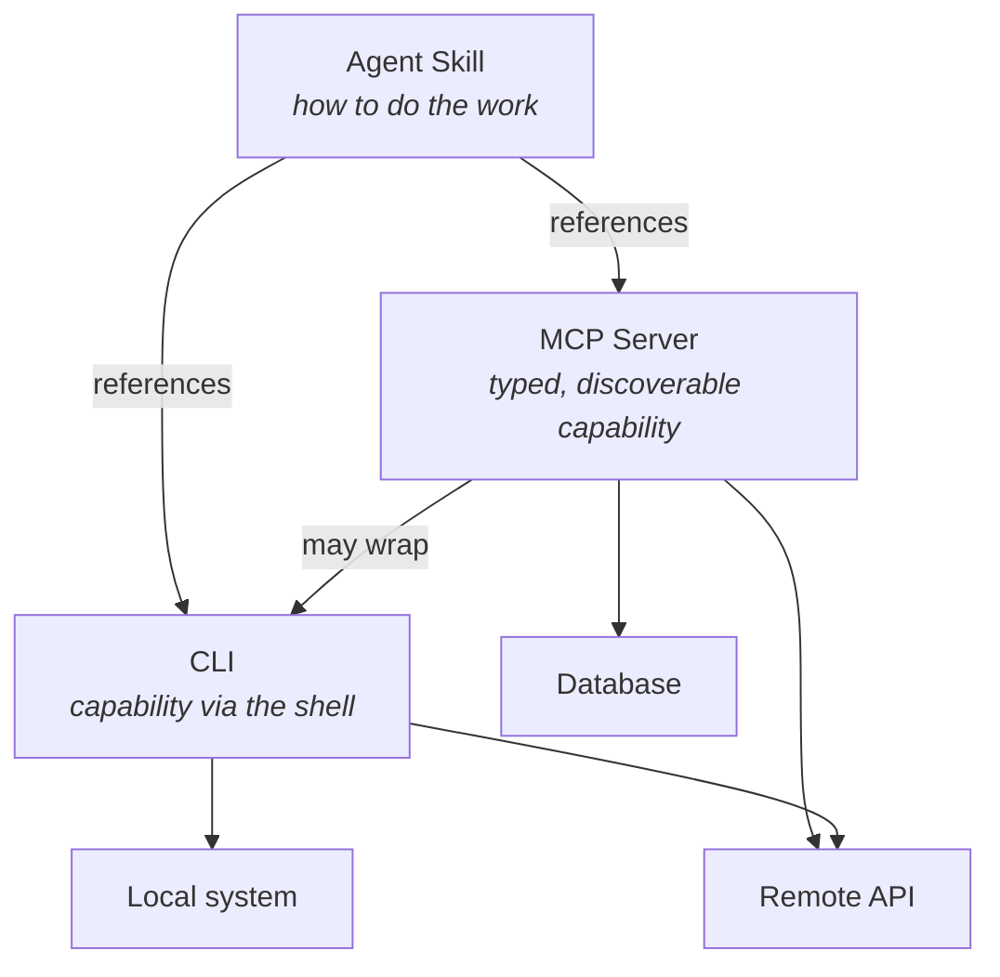

The best agent systems I've seen use CLIs, MCP, and Agent Skills together. All three, stacked.

That's not the framing most people start with. The usual question is _does my agent need an MCP server if it can just run `gh`?_ — and it treats them as alternatives. They're not. They're layers, each right for a different job.

Here's what each one is, when to reach for which, and how they stack in practice.

## What each of these actually is

**CLIs** you already know — `git`, `gh`, `curl`, `jq`, `kubectl`, whatever your team ships. Put the binary in `$PATH` and the agent can call it. That's the whole integration.

The interface is the shell. The agent runs a command, reads whatever text comes back, and figures it out. No schema, no typed arguments — the tool has no idea an agent is calling it, and the agent has no idea what the tool can do until it tries.

**[Agent Skills](https://agentskills.io)** are folders of instructions and resources that an agent loads when they're relevant. A Skill doesn't give the agent a new capability — it teaches the agent how to use capabilities it already has. The contents are usually Markdown files, maybe some reference scripts, maybe some example outputs. "When the user asks for a design document, use this template and put it in `docs/rfcs/`." "To cut a release, run these four commands in this order and check for this output between steps two and three."

Skills are workflow knowledge, packaged in a form an agent can load on demand. They're close to documentation, except the audience is a model rather than a person — which also means they're trusted like operator instructions, not read like inert docs. A Skill pulled from outside your organization carries the same supply-chain weight as an unvetted shell script, even if it's pure Markdown.

**MCP** is an integration protocol. A server exposes typed tools, resources, prompts, and other primitives over JSON-RPC; a client negotiates protocol capabilities at initialize, then discovers available tools and resources at runtime and presents them to the model. The [specification](https://modelcontextprotocol.io/specification/latest) covers structured arguments, OAuth-based authorization, subscriptions, progress notifications, and a handful of other things you need when the thing on the other end of the wire is software rather than a person.

That means building and running a server. Locally, a stdio process the host spawns per session; remotely, infrastructure you deploy and maintain. It's more work than writing Markdown or putting a binary in `$PATH` — and the return is an integration that travels to every MCP-aware host without being rewritten for each one.

## How they connect



Skills sit at the top — they don't execute anything themselves, they tell the agent which tools to call and how. MCP servers and CLIs are both things the agent calls: MCP with a typed contract in front, CLI through the shell. An MCP server can wrap a CLI when you want that contract in front of a binary that already works. Underneath, both reach the same places — remote APIs, databases, the local system.

## Side by side

| Dimension                | CLI                         | Agent Skill                 | MCP Server                      |
| ------------------------ | --------------------------- | --------------------------- | ------------------------------- |
| What it provides         | Capability                  | Workflow knowledge          | Capability + contract           |
| Argument schema          | None (free-form argv)       | N/A                         | JSON Schema per tool            |
| Discovery                | None — agent must know      | Agent reads a manifest      | `tools/list`, `resources/list`  |
| Auth                     | Whatever the binary does    | None — inherits the session | OAuth, per-user scoping (HTTP)  |
| Isolation / trust        | Foreign code, your machine  | Trusted as operator input   | Process or network boundary     |
| Cross-client portability | High (if binary is present) | High — cross-vendor spec    | High — protocol contract        |
| Cross-OS portability     | OS- and env-dependent       | Often OS-dependent          | Host-independent (HTTP)         |
| Host requirements        | Shell + filesystem          | Usually shell + filesystem  | An MCP client                   |
| Distribution             | Package manager, `$PATH`    | Copy a folder               | Registry, URL, package manager  |
| Authoring cost           | Zero — it exists            | Low — write Markdown        | Medium — build and run a server |
| Output structure         | Text, exit code             | N/A                         | Typed results, resource content |

Scan down each column and the trade-offs are clear enough. CLIs are the low-friction option — a package install away, zero authoring, no contract in front. Skills are the easiest thing to write and the only one that carries workflow knowledge. MCP brings the typed interface, the auth story, the cross-host contract — and the most work to stand up. Each is the right answer to a different question.

Worth saying plainly: the table is a feature matrix, not a decision tree. Which rows matter depends on what you're building and who needs to use it. Prototyping alone on a laptop, authoring cost dominates. Shipping an integration to customers, auth and distribution do. Encoding a team's workflow, the instructions matter more than the interface.

## When to reach for which

In practice the choice usually turns on a few things: whether the capability exists already, who else needs to use it, what security boundary you need, and how far it has to travel. The scenarios below each start from one of those.

**The tool already exists as a CLI, and you're the only one using it, in one environment.** Don't build anything. Let the agent call the binary. You are not obligated to put a protocol in front of `grep`.

**You're encoding _how_ to do something, not _what can be done_.** That's a Skill. "Deploy to staging" isn't a new capability — the agent already has `kubectl` and `gh`. What it lacks is the knowledge of which manifests to apply, what order, what to check between steps. Write it down.

**You need the same integration to work across multiple AI hosts.** You want Linear in Claude, in VS Code, in Cursor, in the internal tool your platform team built. Build an MCP server once and any compliant host picks it up — the server is the integration, nothing host-specific to write.

**You need a real security boundary.** OAuth flows, per-user tokens, scoped permissions — MCP's HTTP transport has these built in, and even a stdio server gives you a process boundary to hang policy on. Beyond auth, the server is the one place to enforce access rules, log what the model touched, and scope what it can reach. CLIs run as the agent with whatever privileges the agent has. Skills inherit the session wholesale.

**Your users aren't engineers.** CLIs assume someone who can install binaries, manage `$PATH`, and accept that every new tool runs with their local privileges. That works in a developer workflow. It's a non-starter for product users who aren't going to grant a local process full machine access every time they need new functionality. A remote MCP server is a URL — no install, no local trust surface — and the [Registry](https://modelcontextprotocol.io/registry/about) gives that URL somewhere to live.

**The job is a one-off script for your own machine.** The shell is the fastest path from intent to result. If nothing needs to travel, persist, or be handed to another team, there's no reason to reach past it.

**You're still finding the shape of the problem.** A typed schema pays off once the interface has stopped moving. Before that — while you're still poking at what the tool should even do — a shell and a binary iterate faster than a server and a contract. Build the MCP server once you know what you're building.

## Composing the layers

Most real systems don't stay on one layer. A Skill ends up orchestrating MCP tools alongside shell commands; an MCP server puts a typed contract in front of a CLI that already works. Here's what each of those looks like.

### Skill that leans on an MCP server

A Skill doesn't care whether the tools it references are CLIs, MCP tools, or a mix. It's describing a workflow, and workflows span layers.

```markdown
# Bug triage

When the user reports a bug from Slack:

1. Use the Linear MCP server's `create_issue` tool. Team is `ENG`, label is `triage`.
2. Paste the Slack permalink into the issue description.
3. If there's a stack trace, grep `src/` for the top frame and link the file in the issue.
4. Post the issue URL back to the Slack thread.
```

Step 1 is an MCP tool. Step 3 is a shell command. Step 4 might be either. The Skill is the glue that says "here's the shape of this task in this organization."

### MCP server wrapping a CLI

This pattern earns its keep when the CLI is something the model _hasn't_ seen — an internal tool, a bespoke script, something with a gnarly argument surface. You get a typed schema the model can target reliably, and underneath you're shelling out to a binary that already works.

```typescript
server.tool(
  "promote_build",
  {
    build_id: z.string(),
    environment: z.enum(["staging", "canary", "production"]),
    skip_smoke_tests: z.boolean().default(false),
  },
  async ({ build_id, environment, skip_smoke_tests }) => {
    const args = ["promote", "--build", build_id, "--env", environment];
    if (skip_smoke_tests) args.push("--skip-smoke");

    const { stdout, stderr } = await execFile("deployctl", args);
    return { content: [{ type: "text", text: stdout + stderr }] };
  },
);
```

The model gets a real schema — it knows `environment` is one of three strings, and it won't invent a `--flag` that doesn't exist on a tool it's never heard of. You also get one place to put auth and audit logging, rather than scattering credentials across every machine the agent runs on.

For something like `gh`, this is usually more ceremony than it's worth — the model already knows the flags, and the binary is everywhere. For your internal tooling, the calculus flips.

## Putting it together

Use what's already there. When you need to teach the agent a process, write a Skill. When you need the integration to travel — across hosts, across users, with a real security boundary and a real contract — reach for MCP. When the job is something a well-known CLI can already do, use the CLI. Most systems end up a mix, and that's the system working as intended.

A protocol gives you a contract; it doesn't teach the agent your workflow. A CLI gives you a capability; it doesn't make it discoverable. A Skill teaches the workflow; it doesn't execute anything on its own. Each layer does one thing well, and the boundary between them is getting more permeable by design — the [Skills Over MCP Interest Group](https://github.com/modelcontextprotocol/experimental-ext-skills) is working on exposing Skills as MCP resources, so a server can ship its tools and the workflow instructions for using them together.

To get started building, head to the [MCP documentation](https://modelcontextprotocol.io).
