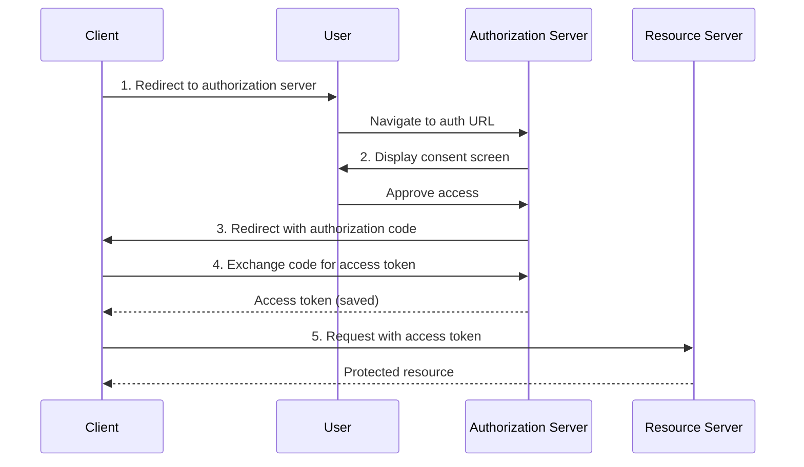

+++
date = '2025-07-22T10:00:00Z'
draft = true
title = 'Evolving OAuth Client Registration in the Model Context Protocol'
author = 'Paul Carleton (Core Maintainer)'
tags = ['security', 'authorization', 'announcement]
+++

The Model Context Protocol (MCP) has adopted OAuth 2.1 as the basis for its authorization framework. A key part of this flow is client registration. When it comes to clients and servers that don’t have a pre-existing relationship, there are 2 challenging areas today:

- Operational issues with managing client ID’s via Dynamic Client Registration (DCR)
- Preventing impersonation of desktop clients

If you're familiar with OAuth and the current state of client registration in MCP, skip to [Two Distinct Challenges in MCP Client Registration](#todo).

## Background on OAuth

A system implementing OAuth 2.1 should allow the user to grant a client access to a resource, and prevent attempts to trick the user into granting access to a client they didn't intend to (e.g. phishing).



The high level flow for OAuth is:

1. The client sends the user to an authorization server
2. The authorization server displays a consent screen to the user
3. If the user approves the client's access, the authorization server redirects the user back to the client with an access code
4. The client exchanges the access code for an access token, which it saves
5. The client uses the access token in subsequent requests to access the resource

As part of this flow, the server needs a few pieces of information about the client:

1. **Client name**: Human readable text to display in the consent screen to help the user decide whether they want to grant access.
2. **Redirect URL**: The destination to send the authorization code back to if the user consents.

In order to prevent a malicious client from tricking a user into granting access they didn't intend to grant, the authorization server must be able to trust the client information it has. For instance, if a malicious client could claim to be 'Claude Desktop' on the consent screen while actually being 'attacker.com', users might grant access thinking they're authorizing the legitimate Claude application.

## What We Want from Client Registration in MCP

In MCP, a common pattern is for a user to paste an MCP server URL into a client, and connect to it. This cuts against the typical OAuth pattern because it is the user selecting the resource server to connect to rather than the client developer. While pre-registration works well when the client and server have a pre-existing relationship, it breaks down when they don’t.

Let's lay out our goals for client registration, specifically for when a server and client don't have a pre-existing relationship:

1. **Clients**: Client developers don't need to go through a pre-registration flow and distribute a client ID for each additional connected server.
2. **Users**: Users don't need to go through a pre-registration flow and paste in client id with the server URL
3. **Server developers**:

- **Trust in Metadata**: Servers have a way to trust the metadata they associate with a client (e.g. name and redirect URL)
- **Single Client ID per App**: Servers can have a single client ID per client for users to revoke access or the server to revoke access
- **Selective Allow/Deny**: Servers can selectively allow or deny clients, without needing to coordinate with the client.
- **Database Management**: Servers do not need to handle an unbounded database or expiration flows

Currently, none of our existing approaches satisfies all these requirements. Pre-registration works great when clients and servers have an existing relationship, but requires too much effort for a dynamic setting. Dynamic Client Registration (DCR) reduces effort but creates operational headaches. Let's dig into why.

## Two Distinct Challenges in MCP Client Registration

After extensive discussion with implementers, we've identified that what initially seemed like competing solutions are actually addressing two orthogonal problems:

1. **Operational limitations** of Dynamic Client Registration in open environments
2. **Client identity and impersonation** risks across different deployment scenarios

Let's tackle each separately.

## **Challenge 1: Operational Limitations of Dynamic Client Registration**

### **The DCR Model Mismatch**

DCR’s design essentially takes the “pre-registration” OAuth flow and makes it available via an API. In fully open environments like MCP, DCR creates several operational headaches:

**For servers:**

- **Unbounded database growth**: Every registration creates a record with no natural expiry
- **Client expiry "black hole"**: There's no way to tell a client its ID is invalid without creating an open redirect vulnerability
- **Per-instance confusion**: Each user typically gets their own client ID even when using the same application (e.g., every Cursor user gets a different ID). Similarly, when a user views its authorized clients, it may see many registrations for the same client.
- **DoS vulnerability**: The `/register` endpoint is unauthenticated and writes to a database, requiring complex rate limiting

**For clients:**

- **Extra overhead**: Managing registration state and another secret beyond access/refresh tokens
- **No validity checking**: Can't verify if a client ID is still valid
- **Unclear lifecycle**: No guidance on when to re-register or update credentials

### **Solution: Client ID Metadata Documents (CIMD)**

Client ID Metadata Documents (described in [this draft RFC](https://www.ietf.org/archive/id/draft-looker-oauth-client-id-scheme-00.html) and implemented by Bluesky) elegantly sidestep these operational issues.

Instead of a registration step, clients use an HTTPS metadata URL as their client ID directly. The server fetches the metadata from the URL at authorization time:

```
sequenceDiagram
   participant Client
   participant AuthServer
   participant MetadataURL

   Client->>AuthServer: Authorization request
                        (client_id=https://app.com/oauth.json)
   AuthServer->>MetadataURL: GET https://app.com/oauth.json
   MetadataURL-->>AuthServer: {name: "App", redirect_uris: [...]}
   AuthServer->>Client: Show consent screen & continue flow
```

This addresses all the operational issues:

- **No database needed**: Servers fetch metadata on-demand (can cache for performance)
- **No expiry management**: The URL is the ID \- it doesn't expire
- **Natural per-app model**: One URL per application, not per user
- **No registration endpoint**: No unauthenticated write operations

The cost? Clients need to host a metadata document at an HTTPS URL. For web applications, this is trivial. For desktop applications, this typically means hosting on their backend infrastructure.

## **Challenge 2: Client Identity and Impersonation**

The second challenge is orthogonal to DCR vs CIMD \- it's about trusting that a client is who it claims to be. This problem exists regardless of how we handle registration.

### **The Trust Spectrum**

We can map impersonation scenarios on two axes: attacker cost and mitigation complexity.


**Low attacker cost / Low mitigation complexity: Domain-based attacks**

- **Attack**: Register `attacker.com/callback`, claim to be "Claude Desktop"
- **Cost**: Trick user into clicking a link and consenting
- **Mitigation**:
  - Restrict trusted domains/URLs
  - Show warnings for unknown domains
  - Works with both DCR and CIMD

**Medium attacker cost / Medium mitigation complexity: Localhost impersonation**

- **Attack**: Run malicious app on `localhost:8080`, impersonate legitimate client
- **Cost**: Trick user into running a malicious application (plus consenting for that app to have data access)
- **Problem**: Desktop apps can't hold secrets, hard to prove identity

**High attacker cost / High mitigation complexity: OS-attested applications**

- **Attack**: Get malicious app signed by OS vendor
- **Cost**: Extremely high \- requires compromising OS vendor processes
- **Mitigation**: OS-level attestation (future work)

### **Solution: Software Statements for Desktop Applications**

For the middle tier, localhost impersonation, we need software statements. This involves:

1. Client hosts a JSON Web Key Set (JWKS) on their backend
2. Client authenticates the user through their own flow
3. Backend issues a short-lived, signed JWT attesting to the client's identity
4. Client includes this JWT in the OAuth flow
5. Server verifies the JWT against the trusted JWKS

This dramatically raises the bar for impersonation. An attacker would need to:

- Compromise the client's backend infrastructure, or
- Successfully impersonate the client's authentication flow

Crucially, **software statements work with both DCR and CIMD**. They're not a competing solution \- they're a complementary security layer.

### **Future: OS-Level Attestation**

The strongest protection would be OS-level attestation, e.g. having MacOS, Windows, or Android attest that a piece of software is legitimate. This would make impersonation unreasonably expensive. While the exact way this ties into a software statement is yet to be prototyped, the general shape is evident: thread OS-level identity verification through to the OAuth flow.

## **The Complementary Path Forward**

We're not choosing between solutions. We're exploring complementary approaches for distinct problems:

**For operational issues**: Adding CIMD support in favor of DCR

- Keep DCR for backward compatibility
- Recommend CIMD for new implementations
- Both achieve the same authorization goal

**For trust issues**: Layering software statements on top

- Optional enhancement for both DCR and CIMD
- Required only when localhost impersonation is a concern
- Servers choose their required trust level

## **Security Considerations**

Both CIMD and software statements require servers to make outbound HTTPS requests, potentially to untrusted domains. Implementations must:

- Prevent SSRF attacks by blocking internal network access
- Implement timeouts and size limits
- Consider caching strategies for performance
- Validate response formats strictly

If we adopt these approaches, we’ll need good best practices and SDK support to help avoid vulnerabilities.

## **Next Steps**

Over the next few weeks, we'll be discussing both approaches in detail:

- [SEP-991: Client ID Metadata Documents](https://github.com/modelcontextprotocol/specification/discussions/991)
- [SEP-1032: Software Statements with DCR](https://github.com/modelcontextprotocol/specification/discussions/1032)

We intend to make a decision by the end of August.

Get involved: Join the conversation in [Discord](https://discord.gg/modelcontextprotocol) (the \#auth-wg-client-registration channel) or comment on the SEPs directly.
