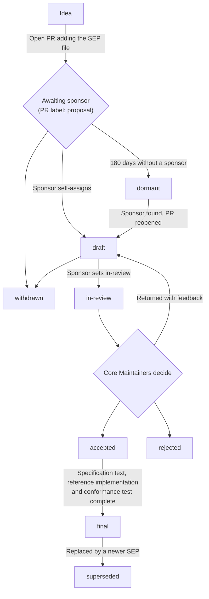

This page describes when a Specification Enhancement Proposal (SEP) is required and the procedure from pull request to Final. A SEP is a design document that gives a concise technical specification of a feature or process and its rationale. Its author is responsible for building consensus and recording dissenting opinions. [SEP-1850](/seps/1850-pr-based-sep-workflow) adopted the process and [SEP-2484](/seps/2484-conformance-tests-required-for-final-seps) the conformance gate. Changing either requires a Process SEP.

## When you need a SEP

Write a SEP for:

- A new, changed or removed protocol feature or method (a new RPC method such as `tools/execute`, a new capability negotiation field, a change to a transport)
- Any change that is not backward compatible
- A change to message formats or schema structure
- An interoperability convention supported outside the core specification
- A governance or process change
- Anything controversial or with several plausible designs, such as a change to how authorization works

Bug fixes, clarifications, editorial changes, new examples for existing features, schema fixes that do not change behavior, and tests go in an ordinary pull request. Amendments to the governance document itself follow the procedure in [SEP-2085](/seps/2085-governance-succession-and-amendment), not this process. If unsure, ask in [Discord](/community/communication#discord) first.

## SEP types

- Standards Track: a new protocol feature or implementation, or an interoperability standard supported outside the core specification.
- Informational: a design issue or guidance for the community, with no new feature.
- Process: a process surrounding MCP, or a change to one.
- Extensions Track: a protocol extension. It receives the same review and acceptance as Standards Track (see [Creating Extensions](/extensions/overview#creating-extensions) for the extension lifecycle).

## Before you write

Bring the idea to the working or interest group that covers the area first (see [Joining a group](/community/working-interest-groups#joining-a-group)). If no group fits, start a thread in [GitHub Discussions](https://github.com/modelcontextprotocol/modelcontextprotocol/discussions) or in `#general` on Discord, and if interest is sustained consider [forming a group](/community/working-interest-groups#forming-a-group). Check which [roadmap](/development/roadmap) priority area the idea serves, read the [design principles](/community/design-principles), and try the idea as an [extension](/extensions/overview) first where its shape allows. Build a prototype that meets the [Prototype Requirements](#prototype-requirements), then write the SEP.

A SEP that arrives without prior discussion usually sits at "awaiting sponsor". Specification changes are slow by design (see [Stability over velocity](/community/design-principles#stability-over-velocity)).

## Workflow

1. Copy [`seps/TEMPLATE.md`](https://github.com/modelcontextprotocol/modelcontextprotocol/blob/main/seps/TEMPLATE.md) to `seps/0000-<slug>.md` and fill it in.
2. Open a pull request against the [specification repository](https://github.com/modelcontextprotocol/modelcontextprotocol).
3. The SEP number is the PR number. Rename the file (PR #1850 becomes `seps/1850-<slug>.md`), update the header, and run `npm run generate:seps`, or the `check:seps` CI job fails.
4. The PR is labeled `proposal`, meaning awaiting sponsor. `proposal` is a PR label only; the `Status` header in the SEP stays unset.
5. A [sponsor](#sponsors) assigns themselves to the PR and sets `draft`. Review takes place in PR comments.
6. When the SEP is ready, the sponsor sets `in-review` and puts it on the Core Maintainer meeting agenda. The author and sponsor may present it.
7. Core Maintainers decide under [Review and acceptance](#review-and-acceptance). The sponsor records the outcome, `accepted` or `rejected`, on the PR and in the SEP header.
8. For an accepted SEP, the author adds to the same PR: the specification prose, the `schema.ts` changes with regenerated output (see [CONTRIBUTING.md](https://github.com/modelcontextprotocol/modelcontextprotocol/blob/main/CONTRIBUTING.md#schema-changes)), a changelog entry, and any required documentation edits (for a deprecation, the four edits under [Deprecating a Feature](/community/feature-lifecycle#deprecating-a-feature)). The reference implementation is completed where it lives: an SDK branch, a fork or a standalone repository (see [Prototype Requirements](#prototype-requirements)). For a Standards Track SEP with observable protocol behavior, the conformance scenario and `sep-NNNN.yaml` are merged (see [Conformance Test Requirement](#conformance-test-requirement)). SDK implementations are not required for Final.
9. The sponsor verifies these artifacts and sets `final`. The PR is then merged.

The eight `Status` values, also defined on the [SEP index](/seps):

| Status       | Meaning                                                                         | Set by                                      |
| ------------ | ------------------------------------------------------------------------------- | ------------------------------------------- |
| `draft`      | Has a sponsor, under informal review in PR comments                             | Sponsor                                     |
| `in-review`  | On the Core Maintainer agenda for formal review                                 | Sponsor                                     |
| `accepted`   | Approved, awaiting specification text, reference implementation and conformance | Sponsor, after the Core Maintainer decision |
| `rejected`   | Declined by Core Maintainers                                                    | Sponsor, after the Core Maintainer decision |
| `withdrawn`  | Withdrawn by the author                                                         | Author or sponsor                           |
| `final`      | All artifacts complete and the PR merged                                        | Sponsor                                     |
| `superseded` | Replaced by a newer SEP                                                         | Sponsor                                     |
| `dormant`    | No sponsor after 180 days, PR closed, may be revived                            | Automation, on behalf of Core Maintainers   |

Automation pings the author after 90 days without a sponsor and, after 180 days, marks the PR `dormant` and closes it. Dormant is not rejected: a dormant SEP is revived by finding a sponsor and reopening the PR, which returns it to `draft`.

## Sponsors

A sponsor is a Core Maintainer, a Maintainer, or a WG Lead for a SEP within that working group's scope.

To find one, look up the Maintainers for your area in [MAINTAINERS.md](https://github.com/modelcontextprotocol/modelcontextprotocol/blob/main/MAINTAINERS.md), post the PR with its prototype in the group's Discord channel, and tag at most two Maintainers on the PR. After two weeks with no response, ask in `#general`.

The sponsor reviews the proposal and requests changes, presents it with the author, verifies the Final artifacts, and makes every status change in the [Workflow](#workflow). That covers the `Status` field in the SEP file, which is canonical, and the matching PR label, which is for filtering. A sponsor without write access to the branch sets the field through the author. Authors do not edit `Status` or labels themselves; they ask their sponsor.

A WG Lead may also triage and close in-scope SEPs under [Leadership](/community/working-interest-groups#leadership), subject to appeal to Core Maintainers.

## Prototype Requirements

A SEP needs a working prototype before it can be accepted: an implementation in an official SDK as a branch or fork, a standalone proof of concept of the key mechanics, integration tests that exercise the proposed behavior, or a reference server or client. The prototype should show that the core functionality works as described and that the API design is practical and ergonomic, surface edge cases and implementation problems, and be runnable by reviewers from included setup instructions. Pseudocode alone, or a design document without code, is not sufficient. Production quality is not required.

## Review and acceptance

Core Maintainers review `in-review` SEPs at their meeting every two weeks under the [decision process](/community/governance#decision-process). The criteria are a working prototype, clear benefit to the MCP ecosystem, community support and consensus, and fit with the roadmap and the design principles. The outcome is `accepted`, `rejected`, or a return to `draft` with specific feedback recorded on the PR.

## Conformance Test Requirement

A Standards Track SEP that introduces or modifies observable protocol behavior cannot reach `final` until the [conformance repository](https://github.com/modelcontextprotocol/conformance) has:

- A scenario tagged with the SEP number, targeting the repository's draft spec-version tag.
- A traceability file, `sep-NNNN.yaml`, mapping every MUST, MUST NOT, SHOULD and SHOULD NOT in the SEP's Specification section to a check ID or to a documented exclusion, with a tracking issue where the exclusion is a framework gap.
- The scenario passing against the SEP's reference implementation.

Process SEPs, Informational SEPs, and Standards Track SEPs with no observable protocol behavior (documentation clarifications, schema annotations that do not change validation, implementation-hardening recommendations) are exempt.

Anyone may write the scenario: the SEP author, an SDK maintainer, or any other contributor. The sponsor confirms that it exists and that `sep-NNNN.yaml` covers every normative statement, and the conformance repository's maintainers review the scenario PR for technical correctness. Writing the scenario before Core Maintainer review is encouraged, not required. [SEP-2484](/seps/2484-conformance-tests-required-for-final-seps) defines the traceability format and the dispute process.

## After the decision

A rejected SEP may be revised against the recorded feedback and resubmitted, or answered with a competing SEP.

Before Final, raise problems on the SEP's PR. A Final SEP is a frozen record of the design as accepted. Where the specification has since diverged, the specification governs: report problems as issues against it, not as edits to the SEP.

A SEP is withdrawn at the author's request. The author or the sponsor sets `withdrawn`. A SEP that replaces an earlier one carries a `Supersedes:` line in its header, and the earlier SEP is set `superseded`.

Ownership of a SEP may pass to a new author when the original author no longer has time for it or cannot be reached. The original author stays on as co-author if they wish. Disagreement with the author's direction is not grounds for transfer. Write a competing SEP instead.

## Template and tooling

SEP files live in [`seps/`](https://github.com/modelcontextprotocol/modelcontextprotocol/tree/main/seps), and each file's git history is the record of the proposal. [`seps/TEMPLATE.md`](https://github.com/modelcontextprotocol/modelcontextprotocol/blob/main/seps/TEMPLATE.md) gives the structure: a preamble, then Abstract, Motivation, Specification, Rationale, Backward Compatibility, Security Implications and Reference Implementation. The Abstract is about 200 words. Insufficient Motivation is by itself grounds for rejection. The Specification must be detailed enough for independent, interoperable implementations. In the Rationale, record the alternatives considered, the objections raised and the evidence of consensus. Backward Compatibility is mandatory whenever the SEP introduces an incompatibility, and states its severity and the migration path. Security Implications are stated explicitly, including when there are none.

`npm run generate:seps` renders the files into `docs/seps/`, and `npm run check:seps` verifies that the rendered pages are current. For a worked example, see [SEP-2567](/seps/2567-sessionless-mcp), a recent Final Standards Track SEP.
