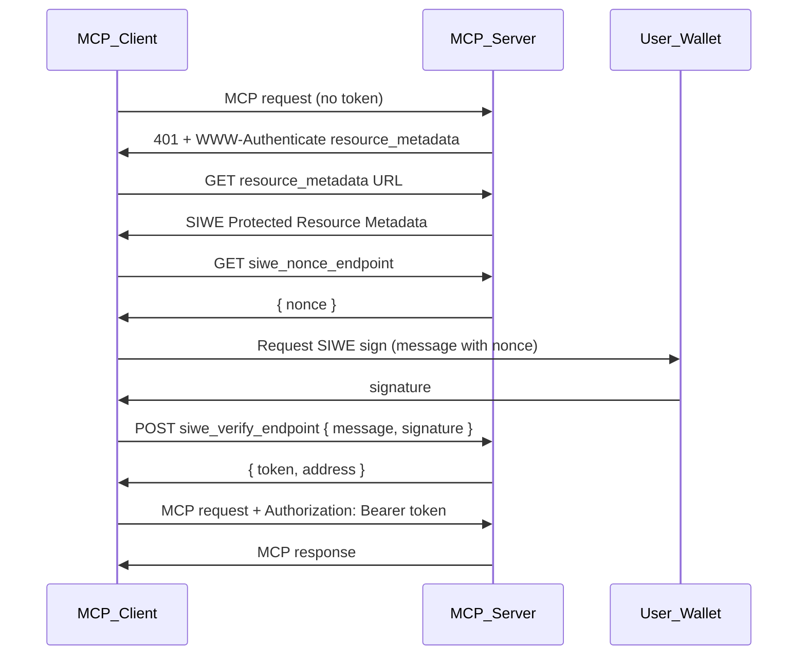

<div className="flex items-center gap-2 mb-4">
  <Badge color="gray" shape="pill">
    Draft
  </Badge>
  <Badge color="gray" shape="pill">
    Standards Track
  </Badge>
</div>

| Field         | Value                                                                           |
| ------------- | ------------------------------------------------------------------------------- |
| **SEP**       | 2245                                                                            |
| **Title**     | Sign-In with Ethereum (SIWE) for Model Context Protocol                         |
| **Status**    | Draft                                                                           |
| **Type**      | Standards Track                                                                 |
| **Created**   | 2025-02-13                                                                      |
| **Author(s)** | Nikko Ambroselli [@d3l33t](https://github.com/d3l33t)                           |
| **Sponsor**   | None (seeking sponsor)                                                          |
| **PR**        | [#2245](https://github.com/modelcontextprotocol/modelcontextprotocol/pull/2245) |

---

## Abstract

MCP authorization is OAuth-centric. Many MCP use cases involve Web3 users who authenticate via wallet signatures (Sign-In with Ethereum, SIWE) rather than OAuth. There is no standard way for MCP servers to advertise SIWE support or for clients to discover SIWE endpoints.

This SEP defines SIWE Protected Resource Metadata—a discovery format and flow that parallels [RFC 9728](https://datatracker.ietf.org/doc/html/rfc9728) (OAuth 2.0 Protected Resource Metadata), enabling MCP servers to advertise SIWE authentication and clients to obtain Bearer tokens via wallet signing. The scope is limited to HTTP-based MCP transports (Streamable HTTP); STDIO and other transports are out of scope.

## Motivation

The existing MCP authorization specification is built around OAuth 2.0 and OAuth 2.0 Protected Resource Metadata ([RFC 9728](https://datatracker.ietf.org/doc/html/rfc9728)). This works well for traditional identity providers (Google, GitHub, enterprise IdPs) but does not address Web3 users who authenticate via Ethereum wallet signatures.

Web3-native applications and MCP servers increasingly need to support users who:

- Authenticate via [EIP-4361: Sign-In with Ethereum](https://eips.ethereum.org/EIPS/eip-4361) (SIWE)
- Do not use OAuth identity providers
- Expect a "Sign in with wallet" flow instead of "Sign in with Google"

Without a standard discovery mechanism, MCP clients cannot reliably determine whether an MCP server supports SIWE or where to obtain nonces and verify signatures. This creates fragmentation and forces ad-hoc implementations. Defining SIWE Protected Resource Metadata—parallel to OAuth PRM—enables interoperable, discoverable SIWE support for MCP.

## Specification

### Roles

| Role           | Description                                                                         |
| -------------- | ----------------------------------------------------------------------------------- |
| MCP Server     | Protected resource requiring authentication; acts as SIWE verifier and token issuer |
| MCP Client     | Obtains SIWE session token on behalf of resource owner (user with wallet)           |
| Resource Owner | User who signs SIWE message with their Ethereum wallet                              |

### SIWE Protected Resource Metadata

Define a JSON metadata document (parallel to [RFC 9728 Section 2](https://datatracker.ietf.org/doc/html/rfc9728#section-2)) with the following parameters:

| Parameter              | Requirement | Description                                                                                  |
| ---------------------- | ----------- | -------------------------------------------------------------------------------------------- |
| `resource`             | REQUIRED    | Resource identifier (canonical URI of MCP server)                                            |
| `siwe_nonce_endpoint`  | REQUIRED    | URL for GET nonce (returns `{ "nonce": "<string>" }`)                                        |
| `siwe_verify_endpoint` | REQUIRED    | URL for POST verify (accepts `{ "message", "signature" }`, returns `{ "token", "address" }`) |
| `siwe_domain`          | REQUIRED    | Domain for SIWE message (e.g. `mcp.example.com` or `localhost:4000`)                         |
| `siwe_statement`       | OPTIONAL    | Statement for SIWE message (e.g. "Sign in to MCP Server")                                    |
| `siwe_chain_id`        | OPTIONAL    | Chain ID for SIWE (default 1)                                                                |
| `resource_name`        | RECOMMENDED | Human-readable name                                                                          |
| `scopes_supported`     | OPTIONAL    | For future scope binding (e.g. `["mcp:tools"]`)                                              |

**Design choice**: Use a distinct well-known path `/.well-known/siwe-protected-resource` to avoid overloading OAuth PRM and to allow servers to support both OAuth and SIWE (e.g. at different paths).

### Discovery Mechanisms

#### WWW-Authenticate Header

When an MCP server requires SIWE and receives an unauthenticated request, it **MUST** respond with:

```http
HTTP/1.1 401 Unauthorized
WWW-Authenticate: Bearer resource_metadata="https://mcp.example.com/.well-known/siwe-protected-resource"
```

The `resource_metadata` URL points to the SIWE Protected Resource Metadata document.

#### Well-Known URI

Metadata **MUST** be available at:

- **Root**: `https://{host}/.well-known/siwe-protected-resource`
- **Path-scoped**: `https://{host}/.well-known/siwe-protected-resource{/path}` (when MCP endpoint has path component)

Same construction rules as [RFC 9728 Section 3](https://datatracker.ietf.org/doc/html/rfc9728#section-3).

#### Client Discovery Requirements

MCP clients **MUST** support both mechanisms and use `resource_metadata` from `WWW-Authenticate` when present; otherwise construct well-known URIs.

### SIWE Authorization Flow



#### Step-by-Step Flow

1. **Initial request**: Client makes MCP request without `Authorization` header.
2. **401 response**: Server returns 401 with `WWW-Authenticate: Bearer resource_metadata="..."`.
3. **Fetch metadata**: Client fetches SIWE Protected Resource Metadata from `resource_metadata` URL.
4. **Validate metadata**: Client validates `resource` matches the MCP server URI.
5. **Get nonce**: Client sends GET to `siwe_nonce_endpoint`; server returns `{ "nonce": "<string>" }`.
6. **Build SIWE message**: Client constructs [EIP-4361](https://eips.ethereum.org/EIPS/eip-4361) message using `siwe_domain`, `siwe_statement`, `siwe_chain_id`, nonce, etc.
7. **User signs**: Client prompts user to sign message via wallet (e.g. `personal_sign`).
8. **Verify**: Client sends POST to `siwe_verify_endpoint` with `{ "message": "<EIP-4361 message>", "signature": "<hex signature>" }`.
9. **Token**: Server verifies SIWE, issues session token (JWT or opaque), returns `{ "token": "<session token>", "address": "<EIP-55 address>" }`.
10. **Authenticated requests**: Client sends `Authorization: Bearer <token>` on all subsequent MCP requests.

### Endpoint Specifications

#### Nonce Endpoint

- **Method**: GET
- **Response**: `{ "nonce": "<string>" }`
- **Requirements**: Nonce **MUST** be unique per request; **SHOULD** be short-lived (e.g. 5 min); **MAY** use cryptographically secure random.

#### Verify Endpoint

- **Method**: POST
- **Content-Type**: `application/json`
- **Request**: `{ "message": "<EIP-4361 message>", "signature": "<hex signature>" }`
- **Success (200)**: `{ "token": "<session token>", "address": "<EIP-55 address>" }`
- **Error (401)**: `{ "error": "<description>" }`
- **Requirements**: Server **MUST** verify message and signature per [EIP-4361](https://eips.ethereum.org/EIPS/eip-4361); **MUST** validate domain matches `siwe_domain`; **MUST** issue token bound to verified address.

### Token Usage

- Tokens **MUST** be sent as `Authorization: Bearer <token>` per [RFC 6750](https://datatracker.ietf.org/doc/html/rfc6750).
- Token format is implementation-defined (JWT recommended; payload **SHOULD** include `address` claim).
- Servers **MUST** validate tokens and extract principal (address) for request scoping.

### Coexistence with OAuth

MCP servers **MAY** support both OAuth and SIWE:

- **OAuth**: `/.well-known/oauth-protected-resource` with `authorization_servers`
- **SIWE**: `/.well-known/siwe-protected-resource` with `siwe_nonce_endpoint`, `siwe_verify_endpoint`

Clients **MAY** choose based on user context (e.g. "Sign in with wallet" vs "Sign in with Google"). The 401 `WWW-Authenticate` **MAY** include multiple challenges or a single `resource_metadata` that references a document listing both options (extension).

### Example Metadata Document

```json
{
  "resource": "https://mcp.example.com/mcp",
  "siwe_nonce_endpoint": "https://mcp.example.com/auth/nonce",
  "siwe_verify_endpoint": "https://mcp.example.com/auth/verify",
  "siwe_domain": "mcp.example.com",
  "siwe_statement": "Sign in to MCP Server",
  "siwe_chain_id": 1,
  "resource_name": "Example MCP Server",
  "scopes_supported": ["mcp:tools", "mcp:resources"]
}
```

## Rationale

### Why a Distinct Well-Known Path?

Using `/.well-known/siwe-protected-resource` instead of extending OAuth PRM allows:

- Servers to support both OAuth and SIWE without conflating metadata
- Clients to unambiguously detect SIWE support
- Clean separation of concerns between OAuth and SIWE flows

### Why Parallel to RFC 9728?

RFC 9728 establishes proven patterns for protected resource discovery (WWW-Authenticate, well-known URIs). Mirroring these patterns for SIWE reduces client implementation complexity and leverages familiar mechanisms.

### Why EIP-4361?

[EIP-4361: Sign-In with Ethereum](https://eips.ethereum.org/EIPS/eip-4361) is the de facto standard for wallet-based authentication in the Ethereum ecosystem. Adopting it ensures interoperability with existing SIWE libraries and wallet integrations.

### Alternatives Considered

- **Extending OAuth PRM**: Would require overloading the OAuth metadata schema and complicate servers that support both. Rejected in favor of a distinct path.
- **Custom discovery only**: Relying solely on custom headers or query params would fragment implementations. Well-known URIs provide a standard, cacheable discovery mechanism.

## Backward Compatibility

This SEP is fully backward-compatible. It adds a new, optional authorization mechanism. Existing OAuth-only MCP servers and clients are unaffected. Servers that add SIWE support do so at a new well-known path; clients that do not implement SIWE simply ignore it.

## Security Implications

- **Replay**: Nonce prevents replay; servers **MUST** reject reused nonces.
- **Domain binding**: SIWE message domain **MUST** match server's `siwe_domain` to prevent phishing.
- **Token storage**: Clients **SHOULD** store tokens securely; avoid `localStorage` for sensitive contexts.
- **HTTPS**: All endpoints **MUST** use HTTPS in production.
- **CORS**: Servers **SHOULD** set appropriate CORS for browser-based wallet flows.

## Reference Implementation

A reference implementation is required before this SEP reaches Final status. The prototype should demonstrate:

- An MCP server exposing `/.well-known/siwe-protected-resource` metadata
- Nonce and verify endpoints implementing the specified contract
- An MCP client discovering SIWE support and completing the flow
- Token issuance and validation

Include setup instructions so reviewers can run the prototype.
