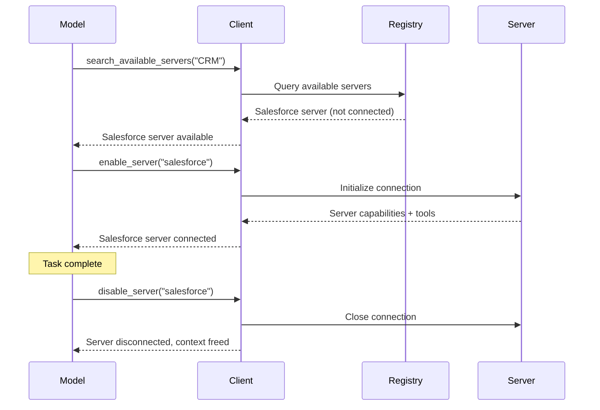
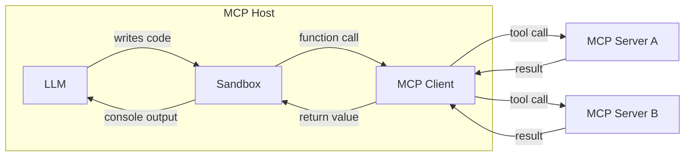

As agents connect to more MCP servers and accumulate access to hundreds or thousands of tools, naive approaches to tool management break down. Loading every tool definition into the model's context window upfront wastes tokens, increases latency, and degrades model performance. Passing large intermediate results through the model between sequential tool calls compounds the problem.

This section covers two complementary patterns that address these scaling challenges: **progressive discovery**, which controls _when_ tool definitions enter context, and **programmatic tool calling**, which controls _how_ tools are invoked.

### Avoiding context bloat using progressive discovery of Servers and Tools

Naive MCP clients load all tool definitions from all connected servers at the start of every conversation. For a handful of tools this is fine. But when a host has access to dozens of servers exposing hundreds of tools, those definitions alone can consume the majority of the context window before the user's message is even read.


Progressive discovery solves this by introducing a layered approach: the model starts with lightweight tools for _finding_ the right tools, then loads full definitions only for the ones it actually needs.

#### When to Use Progressive Discovery

Not every deployment needs progressive discovery. With roughly tens of tools, include full definitions in the system prompt — the token cost is manageable and the model benefits from immediate access. Once you reach hundreds of tools, switch to progressive discovery to avoid dominating the context window.

#### Choosing a Discovery Strategy

The core principle — start lightweight, load details on demand — can be implemented in a number of ways:

- **Search-based**: A `search_tools` meta-tool using keyword matching (BM25, regex). Simple and effective at moderate scale.
- **Embedding-based**: Vector-similarity retrieval over tool descriptions. Handles synonyms and semantic matching better.
- **Subagent-based**: A secondary model interaction selects tools for the task.
- **Hybrid**: Combine approaches — e.g., one-line category descriptions in the system prompt for orientation, with deeper discovery on demand.

Some model providers already offer built-in tool search — for example, [OpenAI](https://developers.openai.com/api/docs/guides/tools-tool-search) and [Anthropic](https://platform.claude.com/docs/en/agents-and-tools/tool-use/tool-search-tool) both support this natively. When available, you may prefer the platform's tool search over a custom implementation. Build your own when the provider doesn't offer one or when you need specialized retrieval logic (e.g., domain-specific ranking or access-control filtering).

The three-layer pattern below illustrates a custom search-based approach in detail, but the layered principle — catalog, inspect, execute — applies regardless of retrieval mechanism.

#### The Three-Layer Pattern

One well-proven implementation of progressive discovery uses a search-based, three-layer approach:

**Layer 1 — Catalog.** The client exposes a small number of meta-tools that let the model search and browse available capabilities. A `search_tools` tool accepts a natural-language query and returns a list of matching tool names with brief descriptions. This is analogous to browsing an API reference rather than reading every page.

```typescript
// The model calls a lightweight search tool
search_tools({ query: "update salesforce record" })

// Returns concise matches — names and one-line descriptions only
→ [
    { name: "salesforce.updateRecord", description: "Update fields on a Salesforce object" },
    { name: "salesforce.upsertRecord", description: "Insert or update based on external ID" }
  ]
```

**Layer 2 — Inspect.** Once the model identifies a relevant tool, it can request the full definition — input schema, output schema, and detailed documentation — for just that tool. This keeps the context focused.

```typescript
// The model inspects only the tool it needs
get_tool_details({ name: "salesforce.updateRecord" })

// Returns the complete schema for this single tool
→ {
    name: "salesforce.updateRecord",
    description: "Updates a record in Salesforce",
    inputSchema: {
      type: "object",
      properties: {
        objectType: { type: "string", description: "Salesforce object type" },
        recordId: { type: "string", description: "Record ID to update" },
        data: { type: "object", description: "Fields to update" }
      },
      required: ["objectType", "recordId", "data"]
    }
  }
```

**Layer 3 — Execute.** The model calls the tool with full knowledge of its interface, having loaded only the definitions it needed.

This search-based pattern reduces token usage from tool definitions dramatically in real-world deployments, while actually _improving_ tool selection accuracy — the model spends its attention on a few relevant tools rather than scanning hundreds of irrelevant ones. Other discovery strategies (embeddings, subagents, etc.) follow the same layered principle but substitute different retrieval mechanisms in the catalog layer.

#### Dynamic Server Management

Progressive discovery extends beyond individual tools to entire servers. Rather than connecting to every configured server at startup, a client can:

1. Maintain a **registry** of available servers and their high-level descriptions.
2. **Connect** to a server only when the model determines it needs that server's capabilities.
3. **Disconnect** servers that are no longer relevant to the current task, freeing context.



This pattern is particularly well-suited to general-purpose agents, where the user's intent is unknown at the outset. The agent begins with a minimal core of always-on servers and acquires new capabilities organically as the conversation progresses. When combined with agent skills, this approach becomes even more powerful: the client can introduce servers and tools as individual skills require them.

#### Implementation Guidelines

When implementing progressive discovery:

| Guideline                        | Rationale                                                                                          |
| -------------------------------- | -------------------------------------------------------------------------------------------------- |
| **Offer multiple detail levels** | Let the model choose between name-only, name-and-description, or full-schema responses.            |
| **Cache tool definitions**       | Once a tool definition is loaded, keep it available for the duration of the session.               |
| **Group tools by server**        | Present tools organized by their source server so the model can reason about related capabilities. |

### Programmatic Tool Calling / Code Mode

With direct tool calling, every tool invocation is a round trip: the model generates a tool call, the client executes it, and the full result flows back into the model's context. When a task requires chaining multiple tools — read a document, transform it, write it somewhere else — each intermediate result passes through the model, consuming tokens and adding latency even when the model has nothing meaningful to contribute at that step.

Programmatic tool calling (sometimes called "code mode") inverts this pattern. Instead of calling tools directly, the model writes code that calls tools. The code executes in a sandboxed environment, and only the final result returns to the model.


#### How It Works

The client converts MCP tool schemas into a programmatic API in a language the model can write — typically TypeScript or Python. These functions are available inside a sandboxed execution environment. When the model needs to use tools, it writes a script rather than making individual tool calls.

**Step 1 — Generate a programmatic API from MCP schemas.** The client reads each server's tool definitions and produces typed function stubs:

```typescript
// Auto-generated from the Logging MCP server's tool schema
interface LogEntry {
  timestamp: string;
  message: string;
  level: string;
}

declare function logging_getLogs(input: {
  level: "error" | "warn" | "info";
  since: number;
}): Promise<{ entries: LogEntry[] }>;

// Auto-generated from the Ticketing MCP server's tool schema
declare function ticketing_createIssue(input: {
  title: string;
  body?: string;
  priority: "low" | "medium" | "high";
}): Promise<{ issueId: string }>;
```

These function stubs are not standalone — the client must wire each stub so that calls inside the sandbox are intercepted and dispatched as `tools/call` requests to the appropriate MCP server. The sandbox itself has no direct access to servers; the client acts as the broker, adding authorization and routing each call.

Servers that define an [`outputSchema`](/specification/draft/server/tools#output-schema) on their tools improve the quality of generated APIs. When an output schema is present, the client can produce precise return types (like `LogEntry` above) instead of generic `any` types — giving the model type information that leads to more correct code with fewer errors.

When an output schema is absent, there are two fallback strategies:

- Use a generic type and move on. Accept any or string as the return type and handle the unstructured output downstream.
- Extract a typed result using a fast model. Pass the tool's output to a lightweight model like Claude Haiku or Gemini Flash with instructions to coerce it into a known type — for example, `extract(mcpTool('generic_tool', params), Model.AnthropicHaiku, ExpectedType)`, where `ExpectedType` is a type definition the model can target. If the conversion fails, the model can fall back to a generic string or surface an error.

**Step 2 — The model writes code against these APIs.** Rather than making separate tool calls with full results flowing through context between them, the model writes a single script. Consider a task like "find all error logs from the past hour and file a ticket for each unique error." With direct tool calling, thousands of log entries would flow through the model's context. With code, the model filters in the sandbox:

```typescript
// Model-generated code — executes in sandbox
const logs = await logging_getLogs({
  level: "error",
  since: Date.now() - 3600000,
});

// Filter and deduplicate inside the sandbox — not in the model's context
const uniqueErrors = new Map<string, LogEntry>();
for (const log of logs.entries) {
  if (!uniqueErrors.has(log.message)) {
    uniqueErrors.set(log.message, log);
  }
}

for (const [message, log] of uniqueErrors) {
  await ticketing_createIssue({
    title: `Error: ${message}`,
    body: `First seen: ${log.timestamp}\nOccurrences: ${
      logs.entries.filter((l) => l.message === message).length
    }`,
    priority: "high",
  });
}

console.log(
  `Filed ${uniqueErrors.size} tickets from ${logs.entries.length} error logs`,
);
```

**Step 3 — The sandbox executes the code.** Function calls inside the sandbox are intercepted and routed back to the appropriate MCP server through the client. The log data and ticket creation flow directly between servers without ever entering the model's context. Only the `console.log` output — a single summary line — returns to the model.

#### Choosing a Sandbox

The best sandbox depends on which language you want the model to write, your host application's language, and how much isolation you need. Here are some open-source options:

| Sandboxed language | Runtime / Library                                        | Host language | Approach                                                                                        |
| ------------------ | -------------------------------------------------------- | ------------- | ----------------------------------------------------------------------------------------------- |
| **JavaScript**     | [Deno](https://github.com/denoland/deno)                 | Rust / CLI    | V8-based runtime with fine-grained permissions. Can disable all permissions for full lockdown.  |
| **Python**         | [Monty](https://github.com/pydantic/monty)               | Rust          | Minimal, secure Python interpreter built for AI use cases. No I/O by default.                   |
| **TypeScript**     | [pctx](https://github.com/portofcontext/pctx)            | Python / Rust | Incorporates code mode concepts more explicitly as a library, as well as low level rust support |
| **Any (via Wasm)** | [Wasmtime](https://github.com/bytecodealliance/wasmtime) | Rust / C / Go | Compile any language to Wasm and run it with capability-based security.                         |

Regardless of sandbox, the integration pattern is the same: the client injects function stubs, intercepts calls, and dispatches them as underlying `tools/call` requests to MCP servers.

#### Why Code Is a Better Interface

LLMs have been trained on vast amounts of real-world code and are very capable when writing tool-calling programs against a code interface that models the MCP tools. This approach has several practical benefits:

| Benefit                 | Explanation                                                                                                                                                        |
| ----------------------- | ------------------------------------------------------------------------------------------------------------------------------------------------------------------ |
| **Data out of context** | Intermediate results flow between tools inside the sandbox. The model only sees what the code explicitly logs or returns, dramatically reducing token consumption. |
| **Batched execution**   | Multiple tool calls execute in a single round trip. A script that reads five files and writes a summary makes one trip to the model instead of eleven.             |
| **Native control flow** | Loops, conditionals, error handling, and retries are expressed in code rather than requiring multiple model turns to orchestrate.                                  |

#### Execution Architecture

A robust programmatic tool calling implementation has three components:



**The sandbox** runs model-generated code in an isolated environment with no direct network access. Its only interface to the outside world is through the generated function stubs, which route calls back to the client.

**The client** acts as a broker. It receives function calls from the sandbox, maps them to the correct MCP server, executes the tool call, and returns the result to the sandbox. Authorization tokens and credentials are held by the client and never exposed to the generated code.

**The model** sees only what the sandbox returns — typically the output of `console.log` statements or a final return value. This gives the model (and the client developer) precise control over what enters the context window.

#### Security Considerations

Programmatic tool calling introduces a code execution surface that requires careful sandboxing:

- **Network isolation**: The sandbox should have no direct network access. All external communication flows through the MCP client, which enforces authorization and access control.
- **No credential exposure**: API keys and tokens are held by the client, not passed into the sandbox. The generated code calls typed functions; the client adds authentication when forwarding to MCP servers.
- **Resource limits**: Set timeouts and memory limits on sandbox execution to prevent runaway scripts.
- **Output filtering**: Validate and truncate sandbox output before feeding it back to the model.

#### Combining Both Patterns

Progressive discovery and programmatic tool calling work well together. The model uses discovery tools to identify which tools it needs, loads their schemas, and then writes a single script that calls multiple tools in one execution pass. This combination minimizes both the token cost of tool definitions _and_ the token cost of tool results — keeping the model's context focused on reasoning rather than data shuttling.
