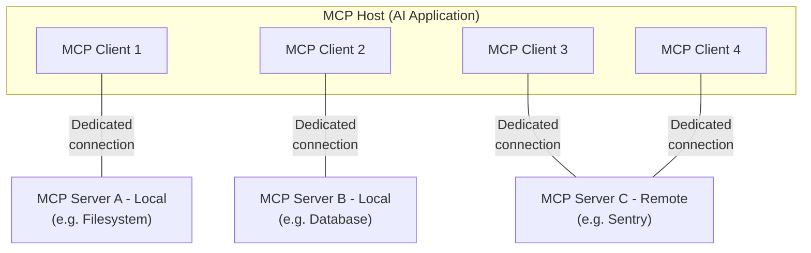

This overview of the Model Context Protocol (MCP) discusses its [scope](#scope) and [core concepts](#concepts-of-mcp), and provides an [example](#example) demonstrating each core concept.

Because MCP SDKs abstract away many concerns, most developers will likely find the [data layer protocol](#data-layer-protocol) section to be the most useful. It discusses how MCP servers can provide context to an AI application.

For specific implementation details, please refer to the documentation for your [language-specific SDK](/docs/draft/sdk).

## Scope

The Model Context Protocol includes the following projects:

- [MCP Specification](https://modelcontextprotocol.io/specification/latest): A specification of MCP that outlines the implementation requirements for clients and servers.
- [MCP SDKs](/docs/draft/sdk): SDKs for different programming languages that implement MCP.
- **MCP Development Tools**: Tools for developing MCP servers and clients, including the [MCP Inspector](https://github.com/modelcontextprotocol/inspector)
- [MCP Reference Server Implementations](https://github.com/modelcontextprotocol/servers): Reference implementations of MCP servers.

<Note>
  MCP focuses solely on the protocol for context exchange—it does not dictate
  how AI applications use LLMs or manage the provided context.
</Note>

## Concepts of MCP

### Participants

MCP follows a client-server architecture where an MCP host — an AI application like [Claude Code](https://www.anthropic.com/claude-code) or [Claude Desktop](https://www.claude.ai/download) — establishes connections to one or more MCP servers. The MCP host accomplishes this by creating one MCP client for each MCP server. Each MCP client maintains a dedicated connection with its corresponding MCP server.

Local MCP servers that use the STDIO transport typically serve a single MCP client, whereas remote MCP servers that use the Streamable HTTP transport will typically serve many MCP clients.

The key participants in the MCP architecture are:

- **MCP Host**: The AI application that coordinates and manages one or multiple MCP clients
- **MCP Client**: A component that maintains a connection to an MCP server and obtains context from an MCP server for the MCP host to use
- **MCP Server**: A program that provides context to MCP clients

**For example**: Visual Studio Code acts as an MCP host. When Visual Studio Code establishes a connection to an MCP server, such as the [Sentry MCP server](https://docs.sentry.io/product/sentry-mcp/), the Visual Studio Code runtime instantiates an MCP client object that maintains the connection to the Sentry MCP server.
When Visual Studio Code subsequently connects to another MCP server, such as the [local filesystem server](https://github.com/modelcontextprotocol/servers/tree/main/src/filesystem), the Visual Studio Code runtime instantiates an additional MCP client object to maintain this connection.



Note that **MCP server** refers to the program that serves context data, regardless of
where it runs. MCP servers can execute locally or remotely. For example, when
Claude Desktop launches the [filesystem
server](https://github.com/modelcontextprotocol/servers/tree/main/src/filesystem),
the server runs locally on the same machine because it uses the STDIO
transport. This is commonly referred to as a "local" MCP server. The official
[Sentry MCP server](https://docs.sentry.io/product/sentry-mcp/) runs on the
Sentry platform, and uses the Streamable HTTP transport. This is commonly
referred to as a "remote" MCP server.

### Layers

MCP consists of two layers:

- **Data layer**: Defines the JSON-RPC based protocol for client-server communication, including capability and version discovery, and core primitives, such as tools, resources, prompts and notifications.
- **Transport layer**: Defines the communication mechanisms and channels that enable data exchange between clients and servers, including transport-specific connection establishment, message framing, and authorization.

Conceptually the data layer is the inner layer, while the transport layer is the outer layer.

#### Data layer

The data layer implements a [JSON-RPC 2.0](https://www.jsonrpc.org/) based exchange protocol that defines the message structure and semantics.
This layer includes:

- **Discovery**: Lets clients query a server's supported protocol versions, capabilities, and identity through the `server/discover` request
- **Server features**: Enables servers to provide core functionality including tools for AI actions, resources for context data, and prompts for interaction templates from and to the client
- **Client features**: Enables servers to ask the client to sample from the host LLM, elicit input from the user, and log messages to the client
- **Utility features**: Supports additional capabilities like notifications for real-time updates and progress tracking for long-running operations

#### Transport layer

The transport layer manages communication channels and authentication between clients and servers. It handles connection establishment, message framing, and secure communication between MCP participants.

MCP supports two transport mechanisms:

- **Stdio transport**: Uses standard input/output streams for direct process communication between local processes on the same machine, providing optimal performance with no network overhead.
- **Streamable HTTP transport**: Uses HTTP POST for client-to-server messages with optional Server-Sent Events for streaming capabilities. This transport enables remote server communication and supports standard HTTP authentication methods including bearer tokens, API keys, and custom headers. MCP recommends using OAuth to obtain authentication tokens.

The transport layer abstracts communication details from the protocol layer, enabling the same JSON-RPC 2.0 message format across all transport mechanisms.

### Data Layer Protocol

A core part of MCP is defining the schema and semantics between MCP clients and MCP servers. Developers will likely find the data layer — in particular, the set of [primitives](#primitives) — to be the most interesting part of MCP. It is the part of MCP that defines the ways developers can share context from MCP servers to MCP clients.

MCP uses [JSON-RPC 2.0](https://www.jsonrpc.org/) as its underlying RPC protocol. Client and servers send requests to each other and respond accordingly. Notifications can be used when no response is required.

#### Statelessness and discovery

MCP is a <Tooltip tip="Every request contains all the information needed to process it, so servers infer nothing from previous requests">stateless protocol</Tooltip>. Every request carries the protocol version and the <Tooltip tip="Features and operations that a client or server supports, such as tools, resources, or prompts">capabilities</Tooltip> relevant to that request in its `_meta` field, so the server can process each request on its own. Clients should also identify themselves in the same field unless configured not to. Servers advertise their supported versions and capabilities through the mandatory [`server/discover`](/specification/draft/server/discover) request, which clients may send before any other request. Detailed information can be found in the [specification](/specification/draft/basic/index#statelessness), and the [example](#example) showcases the per-request metadata and the discovery sequence.

#### Primitives

MCP primitives are the most important concept within MCP. They define what clients and servers can offer each other. These primitives specify the types of contextual information that can be shared with AI applications and the range of actions that can be performed.

MCP defines three core primitives that _servers_ can expose:

- **Tools**: Executable functions that AI applications can invoke to perform actions (e.g., file operations, API calls, database queries)
- **Resources**: Data sources that provide contextual information to AI applications (e.g., file contents, database records, API responses)
- **Prompts**: Reusable templates that help structure interactions with language models (e.g., system prompts, few-shot examples)

Each primitive type has associated methods for discovery (`*/list`), retrieval (`*/get`), and in some cases, execution (`tools/call`).
MCP clients will use the `*/list` methods to discover available primitives. For example, a client can first list all available tools (`tools/list`) and then execute them. This design allows listings to be dynamic.

As a concrete example, consider an MCP server that provides context about a database. It can expose tools for querying the database, a resource that contains the schema of the database, and a prompt that includes few-shot examples for interacting with the tools.

For more details about server primitives see [server concepts](./server-concepts).

MCP also defines primitives that _clients_ can expose. These primitives allow MCP server authors to build richer interactions.

- **Sampling**: Allows servers to request language model completions from the client's AI application. This is useful when server authors want access to a language model, but want to stay model-independent and not include a language model SDK in their MCP server. They can use the `sampling/createMessage` method to request a language model completion from the client's AI application.
- **Elicitation**: Allows servers to request additional information from users. This is useful when server authors want to get more information from the user, or ask for confirmation of an action. They can use the `elicitation/create` method to request additional information from the user.
- **Logging**: Enables servers to send log messages to clients for debugging and monitoring purposes.

For more details about client primitives see [client concepts](./client-concepts).

Besides server and client primitives, the protocol offers cross-cutting utility primitives that augment how requests are executed:

- **Tasks (Experimental)**: Durable execution wrappers that enable deferred result retrieval and status tracking for MCP requests (e.g., expensive computations, workflow automation, batch processing, multi-step operations)

#### Notifications

The protocol supports real-time notifications to enable dynamic updates between servers and clients. For example, when a server's available tools change (such as when new functionality becomes available or existing tools are modified), the server can send tool update notifications to inform connected clients about these changes. Notifications are sent as JSON-RPC 2.0 notification messages (without expecting a response). Change notifications are opt-in: the client opens a long-lived [`subscriptions/listen`](/specification/draft/basic/patterns/subscriptions) stream naming the notification types it wants to receive, and the server delivers matching notifications on that stream.

## Example

### Data Layer

This section provides a step-by-step walkthrough of an MCP client-server interaction, focusing on the data layer protocol. We'll demonstrate discovery, tool operations, and notifications using JSON-RPC 2.0 messages.

<Steps>
<Step title="Discovery">

As described in the [statelessness and discovery](#statelessness-and-discovery) section, every MCP request carries the protocol version and client capabilities in its `_meta` field, and clients should also include their identity there. A client that wants to learn what a server supports before issuing other requests sends a `server/discover` request, which every server must implement.

<CodeGroup>
  ```json Discover Request
  {
    "jsonrpc": "2.0",
    "id": 1,
    "method": "server/discover",
    "params": {
      "_meta": {
        "io.modelcontextprotocol/protocolVersion": "2026-07-28",
        "io.modelcontextprotocol/clientInfo": {
          "name": "example-client",
          "version": "1.0.0"
        },
        "io.modelcontextprotocol/clientCapabilities": {
          "elicitation": {}
        }
      }
    }
  }
  ```
  ```json Discover Response
  {
    "jsonrpc": "2.0",
    "id": 1,
    "result": {
      "resultType": "complete",
      "supportedVersions": ["2026-07-28"],
      "capabilities": {
        "tools": {
          "listChanged": true
        },
        "resources": {}
      },
      "_meta": {
        "io.modelcontextprotocol/serverInfo": {
          "name": "example-server",
          "version": "1.0.0"
        }
      },
      "ttlMs": 3600000,
      "cacheScope": "public"
    }
  }
  ```
</CodeGroup>

#### Understanding the Discovery Exchange

The `_meta` fields and the discovery response together serve several purposes:

1. **Protocol Version Selection**: The `io.modelcontextprotocol/protocolVersion` field declares the version the client is speaking on this request, and `supportedVersions` in the response lists the versions the server accepts. If a server does not support the requested version, it rejects the request with an `UnsupportedProtocolVersionError` listing the versions it does support, and the client retries with a mutually supported version.

2. **Capability Discovery**: The client declares its capabilities in `io.modelcontextprotocol/clientCapabilities` on every request, and the server returns its own `capabilities` object from `server/discover`. This tells each party which [primitives](#primitives) the other can handle (tools, resources, prompts) and whether change [notifications](#notifications) are available, so unsupported operations are never attempted.

3. **Identity Exchange**: The `io.modelcontextprotocol/clientInfo` field in the request's `_meta` and the `io.modelcontextprotocol/serverInfo` field in the result's `_meta` provide identification and versioning information for debugging and compatibility purposes.

In this example, the exchange demonstrates how MCP capabilities are declared:

**Client Capabilities**:

- `"elicitation": {}` - The client declares it can gather additional input from the user when the server requests it

**Server Capabilities**:

- `"tools": {"listChanged": true}` - The server supports the tools primitive AND can send `notifications/tools/list_changed` when its tool list changes
- `"resources": {}` - The server also supports the resources primitive (can handle `resources/list` and `resources/read` methods)

Calling `server/discover` is optional. Because every request carries the same `_meta` fields, a client is free to send any request directly and handle a version error if one comes back. Discovery is a convenient way to fetch the server's identity, capabilities, and supported versions in a single request.

#### How This Works in AI Applications

The AI application's MCP client manager connects to configured servers and stores their discovered capabilities for later use. The application uses this information to determine which servers can provide specific types of functionality (tools, resources, prompts) and whether they support real-time updates.

```python Pseudo-code for AI application discovery
# Pseudo Code
async with stdio_client(server_config) as (read, write):
    async with Client(read, write) as client:
        discover_response = await client.discover()
        if discover_response.capabilities.tools:
            app.register_mcp_server(client, supports_tools=True)
        app.set_server_ready(client)
```

</Step>

<Step title="Tool Discovery (Primitives)">
The client can discover available tools by sending a `tools/list` request. This request is fundamental to MCP's tool discovery mechanism: it allows clients to understand what tools are available on the server before attempting to use them.

<CodeGroup>
  ```json Tools List Request
  {
    "jsonrpc": "2.0",
    "id": 2,
    "method": "tools/list",
    "params": {
      "_meta": {
        "io.modelcontextprotocol/protocolVersion": "2026-07-28",
        "io.modelcontextprotocol/clientInfo": {
          "name": "example-client",
          "version": "1.0.0"
        },
        "io.modelcontextprotocol/clientCapabilities": {
          "elicitation": {}
        }
      }
    }
  }
  ```
  ```json Tools List Response
  {
    "jsonrpc": "2.0",
    "id": 2,
    "result": {
      "resultType": "complete",
      "tools": [
        {
          "name": "calculator_arithmetic",
          "title": "Calculator",
          "description": "Perform mathematical calculations including basic arithmetic, trigonometric functions, and algebraic operations",
          "inputSchema": {
            "type": "object",
            "properties": {
              "expression": {
                "type": "string",
                "description": "Mathematical expression to evaluate (e.g., '2 + 3 * 4', 'sin(30)', 'sqrt(16)')"
              }
            },
            "required": ["expression"]
          }
        },
        {
          "name": "weather_current",
          "title": "Weather Information",
          "description": "Get current weather information for any location worldwide",
          "inputSchema": {
            "type": "object",
            "properties": {
              "location": {
                "type": "string",
                "description": "City name, address, or coordinates (latitude,longitude)"
              },
              "units": {
                "type": "string",
                "enum": ["metric", "imperial", "kelvin"],
                "description": "Temperature units to use in response",
                "default": "metric"
              }
            },
            "required": ["location"]
          }
        }
      ],
      "ttlMs": 3600000,
      "cacheScope": "public"
    }
  }
  ```
</CodeGroup>

#### Understanding the Tool Discovery Request

The `tools/list` request requires no parameters beyond the standard `_meta` fields that accompany every MCP request. It also accepts an optional `cursor` parameter for [pagination](/specification/draft/server/utilities/pagination), which the example above omits.

#### Understanding the Tool Discovery Response

The response contains a `tools` array that provides comprehensive metadata about each available tool. This array-based structure allows servers to expose multiple tools simultaneously while maintaining clear boundaries between different functionalities.

Each tool object in the response includes several key fields:

- **`name`**: A unique identifier for the tool within the server's namespace. This serves as the primary key for tool execution and should follow a clear naming pattern (e.g., `calculator_arithmetic` rather than just `calculate`)
- **`title`**: A human-readable display name for the tool that clients can show to users
- **`description`**: Detailed explanation of what the tool does and when to use it
- **`inputSchema`**: A JSON Schema that defines the expected input parameters, enabling type validation and providing clear documentation about required and optional parameters

The result also carries two caching hints: `ttlMs` tells the client how long it may reuse the listing before fetching it again, and `cacheScope` indicates whether the response may be cached publicly (shared across users and intermediaries) or only privately for the current user.

#### How This Works in AI Applications

The AI application fetches available tools from all connected MCP servers and combines them into a unified tool registry that the language model can access. This allows the LLM to understand what actions it can perform and automatically generates the appropriate tool calls during conversations.

```python Pseudo-code for AI application tool discovery
# Pseudo-code using MCP Python SDK patterns
available_tools = []
for client in app.mcp_clients():
    tools_response = await client.list_tools()
    available_tools.extend(tools_response.tools)
conversation.register_available_tools(available_tools)
```

Clients that federate many servers can use [progressive tool discovery](/docs/draft/develop/clients/client-best-practices#progressive-tool-discovery) rather than loading every tool upfront.

</Step>

<Step title="Tool Execution (Primitives)">
The client can now execute a tool using the `tools/call` method. This demonstrates how MCP primitives are used in practice: after discovering available tools, the client can invoke them with appropriate arguments.

#### Understanding the Tool Execution Request

The `tools/call` request follows a structured format that ensures type safety and clear communication between client and server. Note that we're using the proper tool name from the discovery response (`weather_current`) rather than a simplified name:

<CodeGroup>
  ```json Tool Call Request
  {
    "jsonrpc": "2.0",
    "id": 3,
    "method": "tools/call",
    "params": {
      "name": "weather_current",
      "arguments": {
        "location": "San Francisco",
        "units": "imperial"
      },
      "_meta": {
        "io.modelcontextprotocol/protocolVersion": "2026-07-28",
        "io.modelcontextprotocol/clientInfo": {
          "name": "example-client",
          "version": "1.0.0"
        },
        "io.modelcontextprotocol/clientCapabilities": {
          "elicitation": {}
        }
      }
    }
  }
  ```
  ```json Tool Call Response
  {
    "jsonrpc": "2.0",
    "id": 3,
    "result": {
      "resultType": "complete",
      "content": [
        {
          "type": "text",
          "text": "Current weather in San Francisco: 68°F, partly cloudy with light winds from the west at 8 mph. Humidity: 65%"
        }
      ]
    }
  }
  ```
</CodeGroup>

#### Key Elements of Tool Execution

The request structure includes several important components:

1. **`name`**: Must match exactly the tool name from the discovery response (`weather_current`). This ensures the server can correctly identify which tool to execute.

2. **`arguments`**: Contains the input parameters as defined by the tool's `inputSchema`. In this example:
   - `location`: "San Francisco" (required parameter)
   - `units`: "imperial" (optional parameter, defaults to "metric" if not specified)

3. **`_meta`**: Carries the standard per-request fields: the protocol version and client capabilities that every MCP request must include, plus the client's identity, which clients should include unless configured not to.

4. **JSON-RPC Structure**: Uses standard JSON-RPC 2.0 format with unique `id` for request-response correlation.

#### Understanding the Tool Execution Response

The response demonstrates MCP's flexible content system:

1. **`content` Array**: Tool responses return an array of content objects, allowing for rich, multi-format responses (text, images, resources, etc.)

2. **Content Types**: Each content object has a `type` field. In this example, `"type": "text"` indicates plain text content, but MCP supports various content types for different use cases.

3. **Structured Output**: The response provides actionable information that the AI application can use as context for language model interactions.

This execution pattern allows AI applications to dynamically invoke server functionality and receive structured responses that can be integrated into conversations with language models.

#### How This Works in AI Applications

When the language model decides to use a tool during a conversation, the AI application intercepts the tool call, routes it to the appropriate MCP server, executes it, and returns the results back to the LLM as part of the conversation flow. This enables the LLM to access real-time data and perform actions in the external world.

```python
# Pseudo-code for AI application tool execution
async def handle_tool_call(conversation, tool_name, arguments):
    client = app.find_mcp_client_for_tool(tool_name)
    result = await client.call_tool(tool_name, arguments)
    conversation.add_tool_result(result.content)
```

</Step>

<Step title="Real-time Updates (Notifications)">
MCP supports real-time notifications that enable servers to inform clients about changes without being polled for them. This demonstrates the notification system, a key feature that keeps clients synchronized and responsive.

#### Understanding Tool List Change Notifications

Change notifications are opt-in. The client opens a long-lived stream with a [`subscriptions/listen`](/specification/draft/basic/patterns/subscriptions) request that names the notification types it wants to receive:

```json Listen Request
{
  "jsonrpc": "2.0",
  "id": 4,
  "method": "subscriptions/listen",
  "params": {
    "_meta": {
      "io.modelcontextprotocol/protocolVersion": "2026-07-28",
      "io.modelcontextprotocol/clientInfo": {
        "name": "example-client",
        "version": "1.0.0"
      },
      "io.modelcontextprotocol/clientCapabilities": {
        "elicitation": {}
      }
    },
    "notifications": {
      "toolsListChanged": true
    }
  }
}
```

The server acknowledges the subscription with `notifications/subscriptions/acknowledged`, which is the first message carrying that subscription's ID in `_meta` (the server sends no other notification for that subscription before it). Its `notifications` field reflects the subset of the requested filter the server agreed to honor, with unsupported notification types omitted:

```json Acknowledgment
{
  "jsonrpc": "2.0",
  "method": "notifications/subscriptions/acknowledged",
  "params": {
    "_meta": {
      "io.modelcontextprotocol/subscriptionId": 4
    },
    "notifications": {
      "toolsListChanged": true
    }
  }
}
```

After the acknowledgment, when the server's available tools change (new functionality becomes available, existing tools are modified, or tools become temporarily unavailable), the server delivers a notification on that stream:

```json Notification
{
  "jsonrpc": "2.0",
  "method": "notifications/tools/list_changed",
  "params": {
    "_meta": {
      "io.modelcontextprotocol/subscriptionId": 4
    }
  }
}
```

#### Key Features of MCP Notifications

1. **No Response Required**: Notice there's no `id` field in the notification. This follows JSON-RPC 2.0 notification semantics where no response is expected or sent.

2. **Opt-In**: The server only delivers the notification types the client requested in its `subscriptions/listen` filter, and this particular notification is only available from servers that declared `"listChanged": true` in their tools capability (as shown in Step 1).

3. **Correlated**: Every notification on the stream carries `io.modelcontextprotocol/subscriptionId` in `_meta`, identifying the `subscriptions/listen` request that opened the stream.

4. **Event-Driven**: The server decides when to send notifications based on internal state changes, making MCP clients dynamic and responsive.

#### Client Response to Notifications

Upon receiving this notification, the client typically reacts by requesting the updated tool list. This creates a refresh cycle that keeps the client's understanding of available tools current:

```json Request
{
  "jsonrpc": "2.0",
  "id": 5,
  "method": "tools/list",
  "params": {
    "_meta": {
      "io.modelcontextprotocol/protocolVersion": "2026-07-28",
      "io.modelcontextprotocol/clientInfo": {
        "name": "example-client",
        "version": "1.0.0"
      },
      "io.modelcontextprotocol/clientCapabilities": {
        "elicitation": {}
      }
    }
  }
}
```

#### Why Notifications Matter

This notification system is crucial for several reasons:

1. **Dynamic Environments**: Tools may come and go based on server state, external dependencies, or user permissions
2. **Efficiency**: Clients don't need to poll for changes; they're notified when updates occur
3. **Consistency**: Ensures clients always have accurate information about available server capabilities
4. **Real-time Collaboration**: Enables responsive AI applications that can adapt to changing contexts

This notification pattern extends beyond tools to other MCP primitives, enabling comprehensive real-time synchronization between clients and servers.

#### How This Works in AI Applications

When the AI application receives a notification about changed tools, it immediately refreshes its tool registry and updates the LLM's available capabilities. This ensures that ongoing conversations always have access to the most current set of tools, and the LLM can dynamically adapt to new functionality as it becomes available.

```python
# Pseudo-code for AI application notification handling
async def handle_tools_changed_notification(client):
    tools_response = await client.list_tools()
    app.update_available_tools(client, tools_response.tools)
    if app.conversation.is_active():
        app.conversation.notify_llm_of_new_capabilities()
```

</Step>
</Steps>
