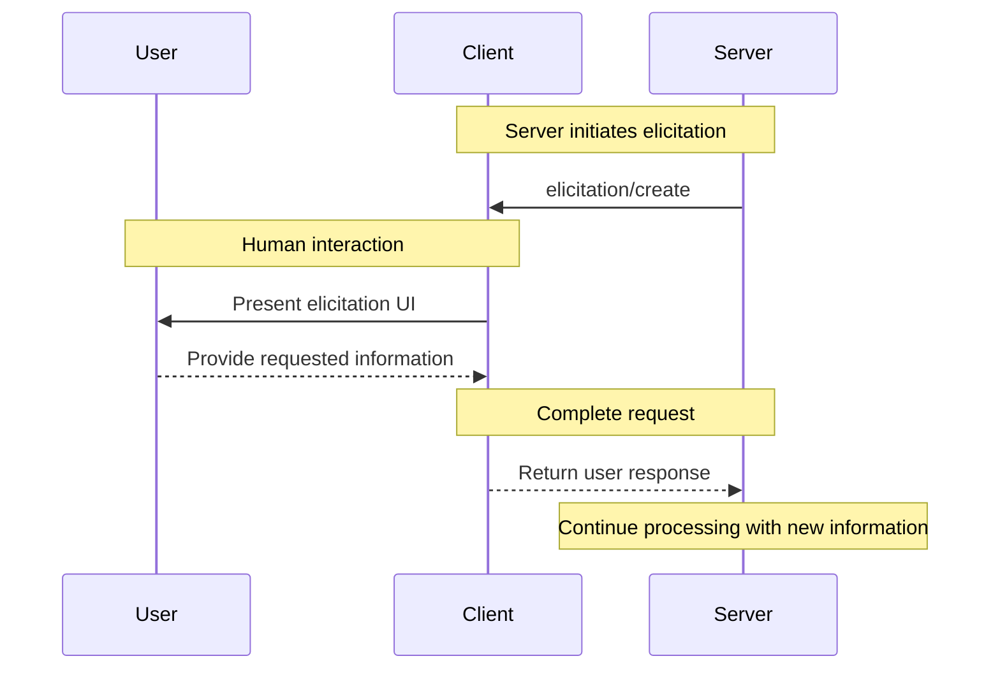
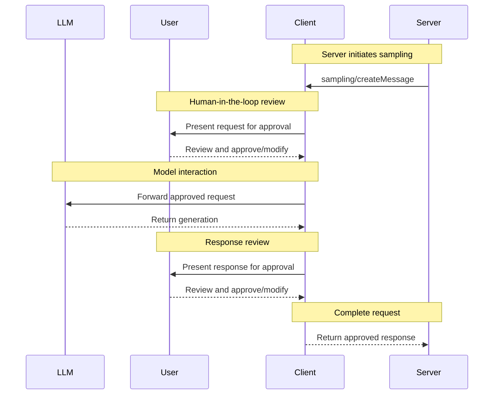
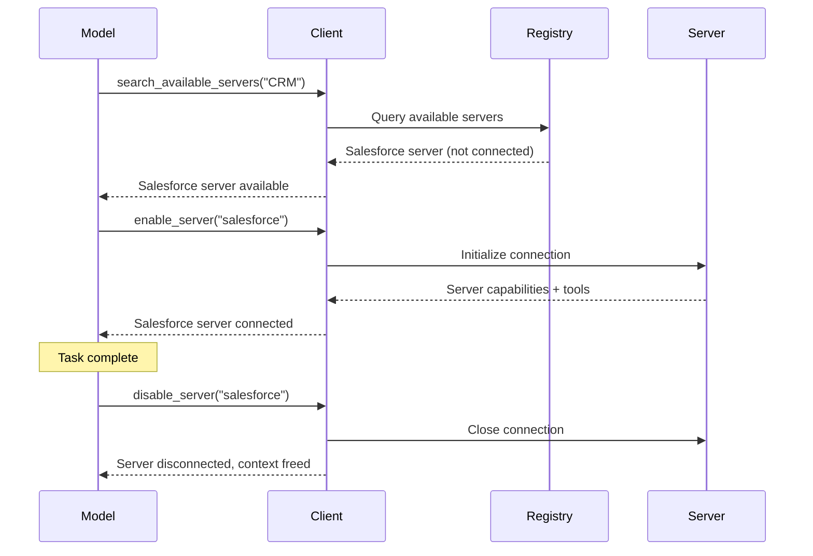
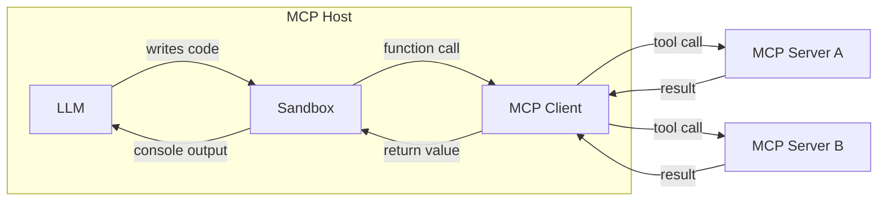

MCP clients are instantiated by host applications to communicate with particular MCP servers. The host application, like Claude.ai or an IDE, manages the overall user experience and coordinates multiple clients. Each client handles one direct communication with one server.

Understanding the distinction is important: the _host_ is the application users interact with, while _clients_ are the protocol-level components that enable server connections.

## Core Client Features

In addition to making use of context provided by servers, clients may provide several features to servers. These client features allow server authors to build richer interactions.

| Feature         | Explanation                                                                                                                                                                                       | Example                                                                                                                                |
| --------------- | ------------------------------------------------------------------------------------------------------------------------------------------------------------------------------------------------- | -------------------------------------------------------------------------------------------------------------------------------------- |
| **Elicitation** | Elicitation enables servers to request specific information from users during interactions, providing a structured way for servers to gather information on demand.                               | A server booking travel may ask for the user's preferences on airplane seats, room type or their contact number to finalise a booking. |
| **Roots**       | Roots allow clients to specify which directories servers should focus on, communicating intended scope through a coordination mechanism.                                                          | A server for booking travel may be given access to a specific directory, from which it can read a user's calendar.                     |
| **Sampling**    | Sampling allows servers to request LLM completions through the client, enabling an agentic workflow. This approach puts the client in complete control of user permissions and security measures. | A server for booking travel may send a list of flights to an LLM and request that the LLM pick the best flight for the user.           |

### Elicitation

Elicitation enables servers to request specific information from users during interactions, creating more dynamic and responsive workflows.

#### Overview

Elicitation provides a structured way for servers to gather necessary information on demand. Instead of requiring all information up front or failing when data is missing, servers can pause their operations to request specific inputs from users. This creates more flexible interactions where servers adapt to user needs rather than following rigid patterns.

**Elicitation flow:**



The flow enables dynamic information gathering. Servers can request specific data when needed, users provide information through appropriate UI, and servers continue processing with the newly acquired context.

**Elicitation components example:**

```typescript
{
  method: "elicitation/requestInput",
  params: {
    message: "Please confirm your Barcelona vacation booking details:",
    schema: {
      type: "object",
      properties: {
        confirmBooking: {
          type: "boolean",
          description: "Confirm the booking (Flights + Hotel = $3,000)"
        },
        seatPreference: {
          type: "string",
          enum: ["window", "aisle", "no preference"],
          description: "Preferred seat type for flights"
        },
        roomType: {
          type: "string",
          enum: ["sea view", "city view", "garden view"],
          description: "Preferred room type at hotel"
        },
        travelInsurance: {
          type: "boolean",
          default: false,
          description: "Add travel insurance ($150)"
        }
      },
      required: ["confirmBooking"]
    }
  }
}
```

#### Example: Holiday Booking Approval

A travel booking server demonstrates elicitation's power through the final booking confirmation process. When a user has selected their ideal vacation package to Barcelona, the server needs to gather final approval and any missing details before proceeding.

The server elicits booking confirmation with a structured request that includes the trip summary (Barcelona flights June 15-22, beachfront hotel, total $3,000) and fields for any additional preferences—such as seat selection, room type, or travel insurance options.

As the booking progresses, the server elicits contact information needed to complete the reservation. It might ask for traveler details for flight bookings, special requests for the hotel, or emergency contact information.

#### User Interaction Model

Elicitation interactions are designed to be clear, contextual, and respectful of user autonomy:

**Request presentation**: Clients display elicitation requests with clear context about which server is asking, why the information is needed, and how it will be used. The request message explains the purpose while the schema provides structure and validation.

**Response options**: Users can provide the requested information through appropriate UI controls (text fields, dropdowns, checkboxes), decline to provide information with optional explanation, or cancel the entire operation. Clients validate responses against the provided schema before returning them to servers.

**Privacy considerations**: Elicitation never requests passwords or API keys. Clients warn about suspicious requests and let users review data before sending.

### Roots

Roots define filesystem boundaries for server operations, allowing clients to specify which directories servers should focus on.

#### Overview

Roots are a mechanism for clients to communicate filesystem access boundaries to servers. They consist of file URIs that indicate directories where servers can operate, helping servers understand the scope of available files and folders. While roots communicate intended boundaries, they do not enforce security restrictions. Actual security must be enforced at the operating system level, via file permissions and/or sandboxing.

**Root structure:**

```json
{
  "uri": "file:///Users/agent/travel-planning",
  "name": "Travel Planning Workspace"
}
```

Roots are exclusively filesystem paths and always use the `file://` URI scheme. They help servers understand project boundaries, workspace organization, and accessible directories. The roots list can be updated dynamically as users work with different projects or folders, with servers receiving notifications through `roots/list_changed` when boundaries change.

#### Example: Travel Planning Workspace

A travel agent working with multiple client trips benefits from roots to organize filesystem access. Consider a workspace with different directories for various aspects of travel planning.

The client provides filesystem roots to the travel planning server:

- `file:///Users/agent/travel-planning` - Main workspace containing all travel files
- `file:///Users/agent/travel-templates` - Reusable itinerary templates and resources
- `file:///Users/agent/client-documents` - Client passports and travel documents

When the agent creates a Barcelona itinerary, well-behaved servers respect these boundaries—accessing templates, saving the new itinerary, and referencing client documents within the specified roots. Servers typically access files within roots by using relative paths from the root directories or by utilizing file search tools that respect the root boundaries.

If the agent opens an archive folder like `file:///Users/agent/archive/2023-trips`, the client updates the roots list via `roots/list_changed`.

For a complete implementation of a server that respects roots, see the [filesystem server](https://github.com/modelcontextprotocol/servers/tree/main/src/filesystem) in the official servers repository.

#### Design Philosophy

Roots serve as a coordination mechanism between clients and servers, not a security boundary. The specification requires that servers "SHOULD respect root boundaries," and not that they "MUST enforce" them, because servers run code the client cannot control.

Roots work best when servers are trusted or vetted, users understand their advisory nature, and the goal is preventing accidents rather than stopping malicious behavior. They excel at context scoping (telling servers where to focus), accident prevention (helping well-behaved servers stay in bounds), and workflow organization (such as managing project boundaries automatically).

#### User Interaction Model

Roots are typically managed automatically by host applications based on user actions, though some applications may expose manual root management:

**Automatic root detection**: When users open folders, clients automatically expose them as roots. Opening a travel workspace allows the client to expose that directory as a root, helping servers understand which itineraries and documents are in scope for the current work.

**Manual root configuration**: Advanced users can specify roots through configuration. For example, adding `/travel-templates` for reusable resources while excluding directories with financial records.

### Sampling

Sampling allows servers to request language model completions through the client, enabling agentic behaviors while maintaining security and user control.

#### Overview

Sampling enables servers to perform AI-dependent tasks without directly integrating with or paying for AI models. Instead, servers can request that the client—which already has AI model access—handle these tasks on their behalf. This approach puts the client in complete control of user permissions and security measures. Because sampling requests occur within the context of other operations—like a tool analyzing data—and are processed as separate model calls, they maintain clear boundaries between different contexts, allowing for more efficient use of the context window.

**Sampling flow:**



The flow ensures security through multiple human-in-the-loop checkpoints. Users review and can modify both the initial request and the generated response before it returns to the server.

**Request parameters example:**

```typescript
{
  messages: [
    {
      role: "user",
      content: "Analyze these flight options and recommend the best choice:\n" +
               "[47 flights with prices, times, airlines, and layovers]\n" +
               "User preferences: morning departure, max 1 layover"
    }
  ],
  modelPreferences: {
    hints: [{
      name: "claude-sonnet-4-20250514"  // Suggested model
    }],
    costPriority: 0.3,      // Less concerned about API cost
    speedPriority: 0.2,     // Can wait for thorough analysis
    intelligencePriority: 0.9  // Need complex trade-off evaluation
  },
  systemPrompt: "You are a travel expert helping users find the best flights based on their preferences",
  maxTokens: 1500
}
```

#### Example: Flight Analysis Tool

Consider a travel booking server with a tool called `findBestFlight` that uses sampling to analyze available flights and recommend the optimal choice. When a user asks "Book me the best flight to Barcelona next month," the tool needs AI assistance to evaluate complex trade-offs.

The tool queries airline APIs and gathers 47 flight options. It then requests AI assistance to analyze these options: "Analyze these flight options and recommend the best choice: [47 flights with prices, times, airlines, and layovers] User preferences: morning departure, max 1 layover."

The client initiates the sampling request, allowing the AI to evaluate trade-offs—like cheaper red-eye flights versus convenient morning departures. The tool uses this analysis to present the top three recommendations.

#### User Interaction Model

While not a requirement, sampling is designed to allow human-in-the-loop control. Users can maintain oversight through several mechanisms:

**Approval controls**: Sampling requests may require explicit user consent. Clients can show what the server wants to analyze and why. Users can approve, deny, or modify requests.

**Transparency features**: Clients can display the exact prompt, model selection, and token limits, allowing users to review AI responses before they return to the server.

**Configuration options**: Users can set model preferences, configure auto-approval for trusted operations, or require approval for everything. Clients may provide options to redact sensitive information.

**Security considerations**: Both clients and servers must handle sensitive data appropriately during sampling. Clients should implement rate limiting and validate all message content. The human-in-the-loop design ensures that server-initiated AI interactions cannot compromise security or access sensitive data without explicit user consent.

## Client Best Practices

As agents connect to more MCP servers and accumulate access to hundreds or thousands of tools, naive approaches to tool management break down. Loading every tool definition into the model's context window upfront wastes tokens, increases latency, and degrades model performance. Passing large intermediate results through the model between sequential tool calls compounds the problem.

This section covers two complementary patterns that address these scaling challenges: **progressive discovery**, which controls _when_ tool definitions enter context, and **programmatic tool calling**, which controls _how_ tools are invoked.

### Avoiding context bloat using progressive discovery of Servers and Tools

Naive MCP clients load all tool definitions from all connected servers at the start of every conversation. For a handful of tools this is fine. But when a host has access to dozens of servers exposing hundreds of tools, those definitions alone can consume the majority of the context window before the user's message is even read.


Progressive discovery solves this by introducing a layered approach: the model starts with lightweight tools for _finding_ the right tools, then loads full definitions only for the ones it actually needs.

#### When to Use Progressive Discovery

Not every deployment needs progressive discovery. With roughly tens of tools, include full definitions in the system prompt — the token cost is manageable and the model benefits from immediate access. Once you reach hundreds of tools, switch to progressive discovery to avoid dominating the context window.

#### Choosing a Discovery Strategy

The core principle — start lightweight, load details on demand — can be implemented in a number of ways:

- **Search-based**: A `search_tools` meta-tool using keyword matching (BM25, regex). Simple and effective at moderate scale.
- **Embedding-based**: Vector-similarity retrieval over tool descriptions. Handles synonyms and semantic matching better.
- **Subagent-based**: A secondary model interaction selects tools for the task.
- **Hybrid**: Combine approaches — e.g., one-line category descriptions in the system prompt for orientation, with deeper discovery on demand.

Some model providers already offer built-in tool search — for example, [OpenAI](https://developers.openai.com/api/docs/guides/tools-tool-search) and [Anthropic](https://platform.claude.com/docs/en/agents-and-tools/tool-use/tool-search-tool) both support this natively. When available, you may prefer the platform's tool search over a custom implementation. Build your own when the provider doesn't offer one or when you need specialized retrieval logic (e.g., domain-specific ranking or access-control filtering).

The three-layer pattern below illustrates a custom search-based approach in detail, but the layered principle — catalog, inspect, execute — applies regardless of retrieval mechanism.

#### The Three-Layer Pattern

One well-proven implementation of progressive discovery uses a search-based, three-layer approach:

**Layer 1 — Catalog.** The client exposes a small number of meta-tools that let the model search and browse available capabilities. A `search_tools` tool accepts a natural-language query and returns a list of matching tool names with brief descriptions. This is analogous to browsing an API reference rather than reading every page.

```typescript
// The model calls a lightweight search tool
search_tools({ query: "update salesforce record" })

// Returns concise matches — names and one-line descriptions only
→ [
    { name: "salesforce.updateRecord", description: "Update fields on a Salesforce object" },
    { name: "salesforce.upsertRecord", description: "Insert or update based on external ID" }
  ]
```

**Layer 2 — Inspect.** Once the model identifies a relevant tool, it can request the full definition — input schema, output schema, and detailed documentation — for just that tool. This keeps the context focused.

```typescript
// The model inspects only the tool it needs
get_tool_details({ name: "salesforce.updateRecord" })

// Returns the complete schema for this single tool
→ {
    name: "salesforce.updateRecord",
    description: "Updates a record in Salesforce",
    inputSchema: {
      type: "object",
      properties: {
        objectType: { type: "string", description: "Salesforce object type" },
        recordId: { type: "string", description: "Record ID to update" },
        data: { type: "object", description: "Fields to update" }
      },
      required: ["objectType", "recordId", "data"]
    }
  }
```

**Layer 3 — Execute.** The model calls the tool with full knowledge of its interface, having loaded only the definitions it needed.

This search-based pattern reduces token usage from tool definitions dramatically in real-world deployments, while actually _improving_ tool selection accuracy — the model spends its attention on a few relevant tools rather than scanning hundreds of irrelevant ones. Other discovery strategies (embeddings, subagents, etc.) follow the same layered principle but substitute different retrieval mechanisms in the catalog layer.

#### Dynamic Server Management

Progressive discovery extends beyond individual tools to entire servers. Rather than connecting to every configured server at startup, a client can:

1. Maintain a **registry** of available servers and their high-level descriptions.
2. **Connect** to a server only when the model determines it needs that server's capabilities.
3. **Disconnect** servers that are no longer relevant to the current task, freeing context.



This pattern is particularly well-suited to general-purpose agents, where the user's intent is unknown at the outset. The agent begins with a minimal core of always-on servers and acquires new capabilities organically as the conversation progresses. When combined with agent skills, this approach becomes even more powerful: the client can introduce servers and tools as individual skills require them.

#### Implementation Guidelines

When implementing progressive discovery:

| Guideline                        | Rationale                                                                                          |
| -------------------------------- | -------------------------------------------------------------------------------------------------- |
| **Offer multiple detail levels** | Let the model choose between name-only, name-and-description, or full-schema responses.            |
| **Cache tool definitions**       | Once a tool definition is loaded, keep it available for the duration of the session.               |
| **Group tools by server**        | Present tools organized by their source server so the model can reason about related capabilities. |

### Programmatic Tool Calling / Code Mode

With direct tool calling, every tool invocation is a round trip: the model generates a tool call, the client executes it, and the full result flows back into the model's context. When a task requires chaining multiple tools — read a document, transform it, write it somewhere else — each intermediate result passes through the model, consuming tokens and adding latency even when the model has nothing meaningful to contribute at that step.

Programmatic tool calling (sometimes called "code mode") inverts this pattern. Instead of calling tools directly, the model writes code that calls tools. The code executes in a sandboxed environment, and only the final result returns to the model.


#### How It Works

The client converts MCP tool schemas into a programmatic API in a language the model can write — typically TypeScript or Python. These functions are available inside a sandboxed execution environment. When the model needs to use tools, it writes a script rather than making individual tool calls.

**Step 1 — Generate a programmatic API from MCP schemas.** The client reads each server's tool definitions and produces typed function stubs:

```typescript
// Auto-generated from the Logging MCP server's tool schema
interface LogEntry {
  timestamp: string;
  message: string;
  level: string;
}

declare function logging_getLogs(input: {
  level: "error" | "warn" | "info";
  since: number;
}): Promise<{ entries: LogEntry[] }>;

// Auto-generated from the Ticketing MCP server's tool schema
declare function ticketing_createIssue(input: {
  title: string;
  body?: string;
  priority: "low" | "medium" | "high";
}): Promise<{ issueId: string }>;
```

These function stubs are not standalone — the client must wire each stub so that calls inside the sandbox are intercepted and dispatched as `tools/call` requests to the appropriate MCP server. The sandbox itself has no direct access to servers; the client acts as the broker, adding authorization and routing each call.

Servers that define an [`outputSchema`](/specification/draft/server/tools#output-schema) on their tools improve the quality of generated APIs. When an output schema is present, the client can produce precise return types (like `LogEntry` above) instead of generic `any` types — giving the model type information that leads to more correct code with fewer errors.

When an output schema is absent, there are two fallback strategies:

- Use a generic type and move on. Accept any or string as the return type and handle the unstructured output downstream.
- Extract a typed result using a fast model. Pass the tool's output to a lightweight model like Claude Haiku or Gemini Flash with instructions to coerce it into a known type — for example, `extract(mcpTool('generic_tool', params), Model.AnthropicHaiku, ExpectedType)`, where `ExpectedType` is a type definition the model can target. If the conversion fails, the model can fall back to a generic string or surface an error.

**Step 2 — The model writes code against these APIs.** Rather than making separate tool calls with full results flowing through context between them, the model writes a single script. Consider a task like "find all error logs from the past hour and file a ticket for each unique error." With direct tool calling, thousands of log entries would flow through the model's context. With code, the model filters in the sandbox:

```typescript
// Model-generated code — executes in sandbox
const logs = await logging_getLogs({
  level: "error",
  since: Date.now() - 3600000,
});

// Filter and deduplicate inside the sandbox — not in the model's context
const uniqueErrors = new Map<string, LogEntry>();
for (const log of logs.entries) {
  if (!uniqueErrors.has(log.message)) {
    uniqueErrors.set(log.message, log);
  }
}

for (const [message, log] of uniqueErrors) {
  await ticketing_createIssue({
    title: `Error: ${message}`,
    body: `First seen: ${log.timestamp}\nOccurrences: ${
      logs.entries.filter((l) => l.message === message).length
    }`,
    priority: "high",
  });
}

console.log(
  `Filed ${uniqueErrors.size} tickets from ${logs.entries.length} error logs`,
);
```

**Step 3 — The sandbox executes the code.** Function calls inside the sandbox are intercepted and routed back to the appropriate MCP server through the client. The log data and ticket creation flow directly between servers without ever entering the model's context. Only the `console.log` output — a single summary line — returns to the model.

#### Choosing a Sandbox

The best sandbox depends on which language you want the model to write, your host application's language, and how much isolation you need. Here are some open-source options:

| Sandboxed language | Runtime / Library                                        | Host language | Approach                                                                                        |
| ------------------ | -------------------------------------------------------- | ------------- | ----------------------------------------------------------------------------------------------- |
| **JavaScript**     | [Deno](https://github.com/denoland/deno)                 | Rust / CLI    | V8-based runtime with fine-grained permissions. Can disable all permissions for full lockdown.  |
| **Python**         | [Monty](https://github.com/pydantic/monty)               | Rust          | Minimal, secure Python interpreter built for AI use cases. No I/O by default.                   |
| **TypeScript**     | [pctx](https://github.com/portofcontext/pctx)            | Python / Rust | Incorporates code mode concepts more explicitly as a library, as well as low level rust support |
| **Any (via Wasm)** | [Wasmtime](https://github.com/bytecodealliance/wasmtime) | Rust / C / Go | Compile any language to Wasm and run it with capability-based security.                         |

Regardless of sandbox, the integration pattern is the same: the client injects function stubs, intercepts calls, and dispatches them as underlying `tools/call` requests to MCP servers.

#### Why Code Is a Better Interface

LLMs have been trained on vast amounts of real-world code and are very capable when writing tool-calling programs against a code interface that models the MCP tools. This approach has several practical benefits:

| Benefit                 | Explanation                                                                                                                                                        |
| ----------------------- | ------------------------------------------------------------------------------------------------------------------------------------------------------------------ |
| **Data out of context** | Intermediate results flow between tools inside the sandbox. The model only sees what the code explicitly logs or returns, dramatically reducing token consumption. |
| **Batched execution**   | Multiple tool calls execute in a single round trip. A script that reads five files and writes a summary makes one trip to the model instead of eleven.             |
| **Native control flow** | Loops, conditionals, error handling, and retries are expressed in code rather than requiring multiple model turns to orchestrate.                                  |

#### Execution Architecture

A robust programmatic tool calling implementation has three components:



**The sandbox** runs model-generated code in an isolated environment with no direct network access. Its only interface to the outside world is through the generated function stubs, which route calls back to the client.

**The client** acts as a broker. It receives function calls from the sandbox, maps them to the correct MCP server, executes the tool call, and returns the result to the sandbox. Authorization tokens and credentials are held by the client and never exposed to the generated code.

**The model** sees only what the sandbox returns — typically the output of `console.log` statements or a final return value. This gives the model (and the client developer) precise control over what enters the context window.

#### Security Considerations

Programmatic tool calling introduces a code execution surface that requires careful sandboxing:

- **Network isolation**: The sandbox should have no direct network access. All external communication flows through the MCP client, which enforces authorization and access control.
- **No credential exposure**: API keys and tokens are held by the client, not passed into the sandbox. The generated code calls typed functions; the client adds authentication when forwarding to MCP servers.
- **Resource limits**: Set timeouts and memory limits on sandbox execution to prevent runaway scripts.
- **Output filtering**: Validate and truncate sandbox output before feeding it back to the model.

#### Combining Both Patterns

Progressive discovery and programmatic tool calling work well together. The model uses discovery tools to identify which tools it needs, loads their schemas, and then writes a single script that calls multiple tools in one execution pass. This combination minimizes both the token cost of tool definitions _and_ the token cost of tool results — keeping the model's context focused on reasoning rather than data shuttling.
