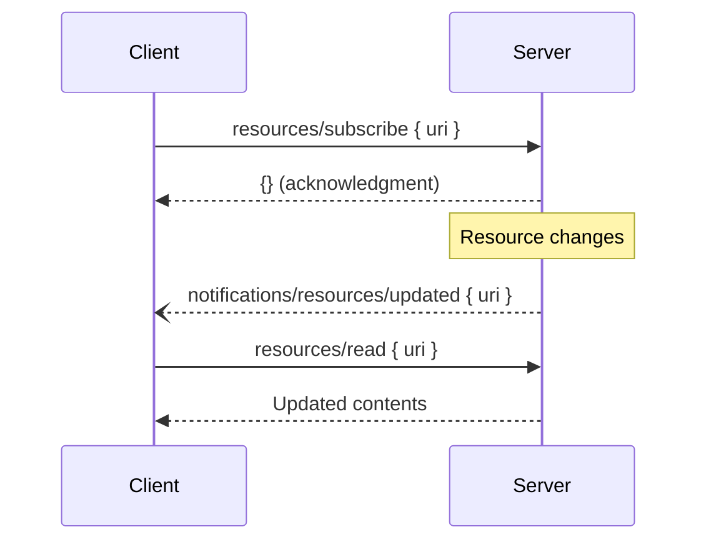
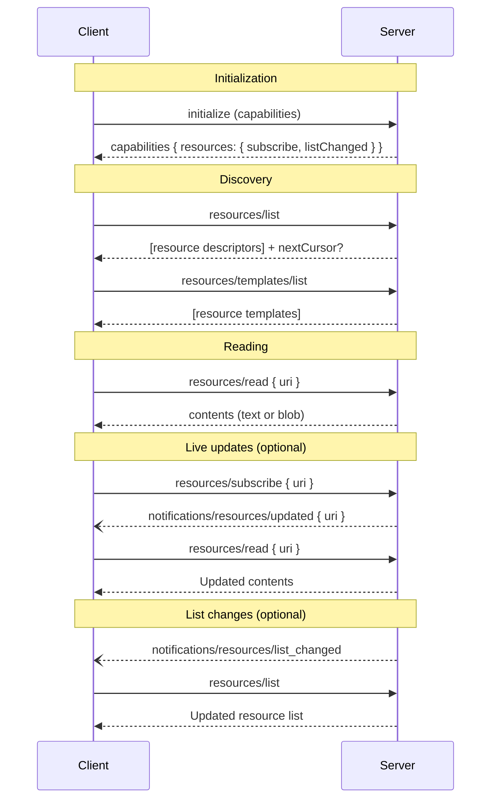

Resources are one of the three core server-side primitives in MCP (alongside [Tools](/docs/learn/server-concepts#tools) and [Prompts](/docs/learn/server-concepts#prompts)). Where tools are _model-controlled_ executable functions and prompts are _user-controlled_ templates, resources are **application-controlled** data sources. The host application decides when to fetch resources, which ones to surface, and how to incorporate their contents as context for the model.

This guide walks through the full lifecycle of MCP resources: what they are, the common use cases they unlock, how the protocol messages work, and the advanced features—templates, subscriptions, annotations, and pagination—that make resources powerful in production.

For the full normative specification, see [Resources (specification)](/specification/latest/server/resources).

## What is a resource?

A resource is any piece of data a server wants to share with a client. Each resource is uniquely identified by a **URI** (following [RFC 3986](https://datatracker.ietf.org/doc/html/rfc3986)) and can carry either UTF-8 text or base64-encoded binary content.

```json
{
  "uri": "file:///project/README.md",
  "name": "README.md",
  "title": "Project Documentation",
  "description": "Main project readme",
  "mimeType": "text/markdown"
}
```

Resources are **read-only** from the protocol's perspective: clients may only read them. Any mutation must go through a Tool.

### Resources vs. tools

| Dimension         | Resource                                     | Tool                     |
| ----------------- | -------------------------------------------- | ------------------------ |
| Control           | Application-controlled                       | Model-controlled         |
| Side effects      | None (read-only)                             | May have side effects    |
| Invocation        | Explicit client fetch                        | LLM decides when to call |
| Discovery         | `resources/list`, `resources/templates/list` | `tools/list`             |
| Retrieval         | `resources/read`                             | `tools/call`             |
| Real-time updates | Subscriptions + notifications                | N/A                      |

## Common use cases

Resources shine whenever you need to supply **context** rather than perform an **action**. Some illustrative examples:

| Use case               | URI example                            | MIME type          |
| ---------------------- | -------------------------------------- | ------------------ |
| Source files           | `file:///src/main.py`                  | `text/x-python`    |
| Database schema        | `db://mydb/schema`                     | `application/json` |
| Git history for a file | `git://repo/log?path=src/app.ts`       | `text/plain`       |
| API documentation      | `https://api.example.com/openapi.json` | `application/json` |
| Dashboard screenshot   | `screen://dashboard/overview`          | `image/png`        |
| Knowledge base article | `kb://articles/onboarding-guide`       | `text/markdown`    |
| Live metrics snapshot  | `metrics://services/api/p99-latency`   | `application/json` |
| Calendar availability  | `calendar://events/2025`               | `application/json` |

The key insight: if your AI application needs to **understand** something before acting on it, a resource is usually the right primitive.

## Capabilities

Before a server can serve resources, it must advertise the `resources` capability during the initialization handshake:

```json
{
  "capabilities": {
    "resources": {
      "subscribe": true,
      "listChanged": true
    }
  }
}
```

Both `subscribe` and `listChanged` are optional. Servers can support any combination:

| Configuration                                             | Meaning                                               |
| --------------------------------------------------------- | ----------------------------------------------------- |
| `"resources": {}`                                         | Basic read/list only—no live updates                  |
| `"resources": { "subscribe": true }`                      | Per-resource change subscriptions supported           |
| `"resources": { "listChanged": true }`                    | Server notifies when the resource list itself changes |
| `"resources": { "subscribe": true, "listChanged": true }` | Both features enabled                                 |

## Protocol messages

### Listing resources

Clients discover available resources with `resources/list`. The response includes an array of resource descriptors:

```json
// Request
{
  "jsonrpc": "2.0",
  "id": 1,
  "method": "resources/list"
}

// Response
{
  "jsonrpc": "2.0",
  "id": 1,
  "result": {
    "resources": [
      {
        "uri": "file:///project/src/main.rs",
        "name": "main.rs",
        "title": "Application Entry Point",
        "description": "Primary Rust source file",
        "mimeType": "text/x-rust"
      }
    ],
    "nextCursor": "next-page-cursor"
  }
}
```

Each resource descriptor carries:

| Field         | Required | Description                                         |
| ------------- | -------- | --------------------------------------------------- |
| `uri`         | Yes      | Unique identifier (RFC 3986 URI)                    |
| `name`        | Yes      | Machine-friendly name used internally               |
| `title`       | No       | Human-readable display name                         |
| `description` | No       | Short prose description for users and AI            |
| `mimeType`    | No       | MIME type hint for the resource contents            |
| `size`        | No       | Size in bytes (useful for large binary resources)   |
| `icons`       | No       | Array of icons for display in host UIs              |
| `annotations` | No       | Hints for audience, priority, and modification time |

### Reading resources

To fetch a resource's contents, clients use `resources/read`:

```json
// Request
{
  "jsonrpc": "2.0",
  "id": 2,
  "method": "resources/read",
  "params": {
    "uri": "file:///project/src/main.rs"
  }
}

// Response (text)
{
  "jsonrpc": "2.0",
  "id": 2,
  "result": {
    "contents": [
      {
        "uri": "file:///project/src/main.rs",
        "mimeType": "text/x-rust",
        "text": "fn main() {\n    println!(\"Hello, world!\");\n}"
      }
    ]
  }
}
```

For binary data, use the `blob` field instead of `text`:

```json
{
  "uri": "file:///assets/logo.png",
  "mimeType": "image/png",
  "blob": "<base64-encoded bytes>"
}
```

A single `resources/read` response can return **multiple content items** — useful when a URI maps to a directory or a multi-part document.

### Error handling

When a resource cannot be found or read, the server returns a standard JSON-RPC error:

```json
{
  "jsonrpc": "2.0",
  "id": 5,
  "error": {
    "code": -32002,
    "message": "Resource not found",
    "data": { "uri": "file:///nonexistent.txt" }
  }
}
```

Standard error codes:

| Code     | Meaning            |
| -------- | ------------------ |
| `-32002` | Resource not found |
| `-32603` | Internal error     |

## Advanced features

### Resource templates

Static URIs cover many cases, but real-world servers often expose families of parameterized resources. **Resource templates** let servers describe these patterns using [RFC 6570 URI Templates](https://datatracker.ietf.org/doc/html/rfc6570):

```json
// Request
{
  "jsonrpc": "2.0",
  "id": 3,
  "method": "resources/templates/list"
}

// Response
{
  "jsonrpc": "2.0",
  "id": 3,
  "result": {
    "resourceTemplates": [
      {
        "uriTemplate": "git://{repo}/commit/{sha}",
        "name": "git-commit",
        "title": "Git Commit",
        "description": "Full diff and metadata for a single git commit",
        "mimeType": "text/plain"
      },
      {
        "uriTemplate": "db://{database}/table/{table}",
        "name": "db-table-schema",
        "title": "Database Table Schema",
        "description": "Column definitions and indexes for a specific table",
        "mimeType": "application/json"
      }
    ]
  }
}
```

To read a resource from a template, the client expands the template and calls `resources/read` with the resulting URI:

```json
{
  "jsonrpc": "2.0",
  "id": 4,
  "method": "resources/read",
  "params": {
    "uri": "db://production/table/orders"
  }
}
```

#### Parameter completion

Template parameters can be auto-completed via the [completion API](/specification/latest/server/utilities/completion). When a user begins typing a template parameter, the client can call `completion/complete` to fetch suggestions:

```json
// Completion request for the {table} parameter
{
  "jsonrpc": "2.0",
  "id": 10,
  "method": "completion/complete",
  "params": {
    "ref": { "type": "ref/resource", "uri": "db://production/table/{table}" },
    "argument": { "name": "table", "value": "ord" }
  }
}

// Completion response
{
  "jsonrpc": "2.0",
  "id": 10,
  "result": {
    "completion": {
      "values": ["orders", "order_items", "order_history"],
      "hasMore": false
    }
  }
}
```

This bridges the gap between the open-ended URI template scheme and guided, discoverable UX in host applications.

### Subscriptions

For resources that change over time—open files, live dashboards, database records—clients can subscribe to receive notifications whenever a resource is updated:



**Subscribe request:**

```json
{
  "jsonrpc": "2.0",
  "id": 5,
  "method": "resources/subscribe",
  "params": {
    "uri": "file:///project/src/main.rs"
  }
}
```

**Update notification (server → client):**

```json
{
  "jsonrpc": "2.0",
  "method": "notifications/resources/updated",
  "params": {
    "uri": "file:///project/src/main.rs"
  }
}
```

The notification only signals that the resource has changed; the client must issue a fresh `resources/read` to retrieve the new content. This keeps the protocol simple while allowing servers full control over what changed.

To stop receiving notifications, clients send an unsubscribe request:

```json
{
  "jsonrpc": "2.0",
  "id": 6,
  "method": "resources/unsubscribe",
  "params": {
    "uri": "file:///project/src/main.rs"
  }
}
```

### List-changed notifications

A separate notification covers the case where the _set_ of available resources changes—for example, when a new file is created or a database table is dropped. Servers that declare `listChanged: true` should emit this notification:

```json
{
  "jsonrpc": "2.0",
  "method": "notifications/resources/list_changed"
}
```

Upon receiving this notification, clients typically refresh their resource list with a new `resources/list` call.

### Pagination

Resource lists can grow large. The `resources/list` and `resources/templates/list` operations both support cursor-based pagination using an opaque `cursor` token:

```json
// First page
{ "jsonrpc": "2.0", "id": 1, "method": "resources/list" }

// Server response (more pages available)
{
  "jsonrpc": "2.0",
  "id": 1,
  "result": {
    "resources": [ /* ... first page ... */ ],
    "nextCursor": "eyJwYWdlIjogMn0="
  }
}

// Next page — pass the cursor back
{
  "jsonrpc": "2.0",
  "id": 2,
  "method": "resources/list",
  "params": { "cursor": "eyJwYWdlIjogMn0=" }
}
```

When `nextCursor` is absent from the response, the client has reached the last page. See [Pagination](/specification/latest/server/utilities/pagination) for full details.

### Annotations

Annotations let servers attach hints to resources so that clients can make smarter decisions about how to use them:

```json
{
  "uri": "file:///project/README.md",
  "name": "README.md",
  "title": "Project Documentation",
  "mimeType": "text/markdown",
  "annotations": {
    "audience": ["user", "assistant"],
    "priority": 0.8,
    "lastModified": "2025-01-12T15:00:58Z"
  }
}
```

| Annotation     | Type            | Description                                                        |
| -------------- | --------------- | ------------------------------------------------------------------ |
| `audience`     | `string[]`      | Who the resource is intended for: `"user"`, `"assistant"`, or both |
| `priority`     | `number` (0–1)  | Importance; `1.0` = essential, `0.0` = entirely optional           |
| `lastModified` | ISO 8601 string | When the resource was last modified                                |

Common client behaviors driven by annotations:

- **Context budget management**: When the total context size would exceed model limits, clients include only high-`priority` resources first.
- **Audience filtering**: Resources with `"audience": ["user"]` might be displayed in the UI but not automatically injected into the model's context.
- **Sorting by recency**: Clients can surface the most recently modified resources when relevance is time-sensitive.

Annotations are **hints**, not enforced constraints. Clients are free to ignore them.

## URI schemes

The protocol defines a few standard schemes and leaves the door open for custom ones.

| Scheme     | Intended use                                                                                                         |
| ---------- | -------------------------------------------------------------------------------------------------------------------- |
| `file://`  | Filesystem-like resources. The resource need not map to a real filesystem path.                                      |
| `https://` | Web resources the client can fetch independently. Prefer a custom scheme when the server itself fetches the content. |
| `git://`   | Git version control integration.                                                                                     |
| Custom     | Any RFC 3986-compliant scheme (e.g., `db://`, `metrics://`, `kb://`).                                                |

<Note>
  Use `https://` only when the client can fetch the resource directly from the
  web without going through the MCP server. For all other web-fetched content,
  use a custom scheme.
</Note>

## Embedded resources in prompts

Resources are not limited to the `resources/*` methods. Servers can embed resource content directly inside prompt messages, allowing prompts to seamlessly incorporate server-managed content like documentation or code samples:

```json
{
  "role": "user",
  "content": [
    {
      "type": "resource",
      "resource": {
        "uri": "file:///project/src/app.ts",
        "mimeType": "text/typescript",
        "text": "import express from 'express';\n..."
      }
    }
  ]
}
```

An embedded resource must include a valid URI, the appropriate MIME type, and either `text` or `blob` content. See [Prompts](/specification/latest/server/prompts) for details.

## Security considerations

When implementing resource servers, keep these points in mind:

1. **Validate all URIs** before attempting to resolve them. Reject malformed or unexpected schemes.
2. **Prevent path traversal** for `file://` resources—normalize paths and enforce a root boundary.
3. **Apply access controls** appropriate to the sensitivity of the resource. Not every connected client should access every resource.
4. **Encode binary data correctly** using standard base64 in the `blob` field.
5. **Avoid exposing internal details** (file system layout, database internals) through error messages.

See [Security best practices](/docs/tutorials/security/security_best_practices) for broader MCP security guidance.

## Full message flow

The diagram below shows the complete lifecycle from capability negotiation through subscriptions and live updates:



## Summary

Resources give MCP servers a first-class mechanism for sharing context:

- **Direct resources** expose fixed URIs for specific data items.
- **Resource templates** expose parameterized URI patterns for families of related data.
- **Subscriptions** enable real-time push notifications when resources change.
- **Pagination** keeps large catalogs manageable.
- **Annotations** let servers hint at audience, priority, and freshness so clients can make smart context decisions.

Together these features make resources well-suited for anything from simple file serving to live system telemetry, giving AI applications the rich situational awareness they need to act effectively.
