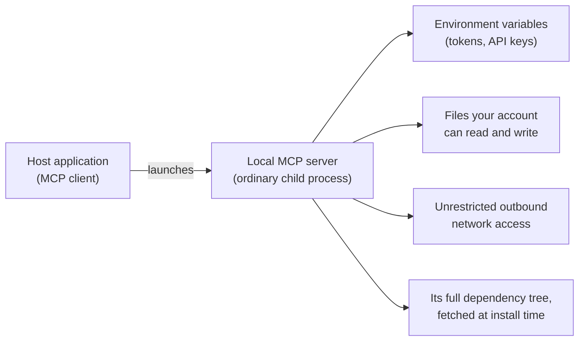

Most MCP security documentation covers the protocol threat model: OAuth flows,
token handling, session hijacking, and confused deputy attacks. For those, see
[Authorization](/docs/tutorials/security/authorization) and
[Security Best Practices](/docs/tutorials/security/security_best_practices).

This guide covers a different threat model: **your machine**. When you run an
MCP server locally, you download code from the internet and run it as a child
process of your user account. That process inherits your environment
variables, can read anything your account can read — SSH keys, cloud
credentials, browser profiles, your home directory — and can open outbound
network connections to anywhere. None of that is governed by the protocol.
It is governed by how you run the process.

<Note>
  **Scope**: this guide is about servers running on a machine you (or your
  organization's users) control — a laptop or workstation, typically launched
  over stdio. Deploying and hardening remote or hosted servers is a different
  topic with different controls.
</Note>

<Tip>
  **If you do one thing after reading this**: open your client's MCP
  configuration, remove the servers you no longer use, and make sure you know
  where each remaining one comes from and that its version is pinned. Everything
  else in this guide builds on knowing what you are actually running.
</Tip>

## What a Local Server Can Touch

A local MCP server is not a plugin running inside a sandbox the protocol
provides. It is an ordinary operating system process, launched by your host
application, with all the access that implies:

Clients that offer one-click installation are required to show you the exact
command before it runs
([SEP-1024](/seps/1024-mcp-client-security-requirements-for-local-server-)),
but a consent dialog only helps if you know what to look for. That is what
the rest of this guide is about.

### The stdio Trust Model

Most local servers use the stdio transport: your client spawns the server as
a subprocess, and the two communicate over stdin and stdout. That design
carries an assumption worth stating plainly: **the client and a stdio server
share one trust domain.** They run side by side with the same privileges,
and neither the protocol nor the SDKs defend one against the other — a
server already has code execution on your machine by virtue of being
launched, so there is no boundary between the two processes for a transport
to enforce.

Two practical consequences:

- Your real security decisions happen **before launch**: what you install
  (provenance) and how you run it (isolation). The stdio transport is not a
  sandbox.
- If you run a server at reduced privilege, that boundary is yours to
  enforce — a container, sandbox, or VM, as described below.

The trust domain is also cumulative. Every server you configure shares the
same model context, so a malicious server can influence how the agent uses
the tools of every other server. Each install extends the surface all the
others are exposed to.

### Threats This Guide Addresses

1. **A malicious server.** Typosquatted package names, lookalike
   repositories, or an abandoned project taken over by a new publisher. The
   "server" works as advertised while also exfiltrating your environment or
   files.
2. **An overcollecting server.** A legitimate server that collects more than
   its job requires: environment variables, files, or network traffic it has
   no reason to touch. Prompt injection in untrusted content can steer an
   honest server into the same overreach, using whatever access it was
   given.
3. **A compromised dependency.** The server author is honest, but one of the
   packages in its dependency tree was compromised in a supply chain attack.
4. **A poisoned tool catalog.** Tool names and descriptions are instructions
   your model reads. A server can hide directives in them that steer the
   agent — including how it uses _other_ servers' tools — without the
   poisoned tool ever being invoked (often called tool poisoning, or tool
   shadowing when it targets another server's tools). Definitions are not
   fixed at install time either: a server can quietly change them after you
   approved it (a rug pull), so a one-time consent dialog and package
   pinning do not cover this surface.
5. **A vulnerable server or bridge.** A legitimate, unmodified component can
   still be the way in. Local bridges that connect stdio clients to remote
   servers have had critical flaws triggered by nothing more than connecting
   to a malicious endpoint, and local developer tools listening on a port
   have been exploited directly from a web page.

Out of scope: attackers with physical access to your machine, targeted
nation-state attacks, and protocol-level attacks (see the linked documents
above).

The mitigations below follow one principle: **treat a third-party local
server as untrusted code with exactly the privileges you hand it — and hand
it as few as possible.** Each section gives a baseline, an optional "going
further" step, and a default if you are unsure.

## Check Provenance Before You Install

A listing on a registry is not an endorsement. Docker Hub, ghcr.io, npm,
PyPI, and NuGet will host almost anything, and a package being popular or
well-named guarantees neither that it is safe nor that it is current. Even
curated MCP catalogs describe their own vetting as best-effort: curation
reduces risk, it does not take on accountability for what you run.

Before installing a server:

- **Identify the publisher.** Can you tie the package to a source repository
  and a real maintainer or organization? Does the repository show recent,
  plausible activity?
- **Verify the exact package name.** Typosquatting is the cheapest attack
  available. Confirm you are installing the package the documentation
  actually refers to, not a lookalike.
- **Pin the version.** Install a specific version rather than `latest`, so
  a compromised future release does not walk onto your machine through an
  auto-update. Pair the pin with a deliberate update habit: when a security
  advisory lands for something you pinned, the pin is what keeps you
  vulnerable.
- **Prefer artifacts with provenance metadata.** Signed artifacts, build
  attestations, and SBOMs (software bills of materials) let you verify who
  built the artifact and what is inside it — including which MCP SDK and
  version it uses, which matters when a vulnerability is announced in one.

**Going further**: verify signatures and attestations rather than just
noting their presence (for example with Sigstore tooling or your registry's
attestation verification), and generate your own SBOM from the artifact (for
example with Syft or Trivy) instead of trusting the published one. Some
registries and runtimes can verify signatures at launch time rather than
only at install, turning provenance from a one-time check into a standing
one.

**If unsure**: only install servers whose source code you can read and whose
publisher you can identify, and pin the exact version.

## Treat Tool Definitions as Untrusted Input

Installing a server is not the last trust decision. At runtime, the server
sends your client its tool names and descriptions, and the model reads them
as instructions — an injection surface that install-time review does not
cover.

- **Read the tool list before you rely on a server.** Most clients can show
  each tool's description. If a description contains instructions that have
  nothing to do with the tool's job, remove the server.
- **Prefer clients that pin tool definitions.** Some clients record tool
  definitions when you first approve a server and ask again when they
  change. The protocol does not require this, so it is a property worth
  choosing a client for.
- **Keep the roster small.** Because all configured servers share the
  model's context, every server you add extends the surface the others are
  exposed to.

**If unsure**: install few servers, skim their tool descriptions once, and
favor a client that re-prompts when a tool definition changes.

## Run Servers in an Isolated Environment

Process isolation is the single highest-leverage mitigation in this guide.
It turns "this server can read my SSH keys" into "this server can read an
empty directory", and it protects you even when provenance checks fail —
against all three threats above at once.

- **Baseline**: run third-party servers inside a container (for example with
  Docker or Podman) with no volume mounts beyond what the server needs.
  Stdio transport works unchanged: the client talks to the container's stdin
  and stdout exactly as it would to a bare process.
- **Alternatives**: a lightweight virtual machine dedicated to development
  work, or your operating system's process-sandboxing facilities. Some
  MCP-focused runtimes and client integrations will wrap servers in
  containers for you; the pattern matters more than the tool.

A container is not an impenetrable boundary, but it removes the default
access to your environment, your files, and your keychain — which is what
the common attacks rely on.

**Going further**: run servers under a microVM or in a separate user
account, and combine isolation with the network controls below so the
sandbox also cannot exfiltrate what little it can see.

**If unsure**: run every third-party server in a container with nothing
mounted except the directory it is meant to work on.

## Isolate Credentials

A locally launched server inherits the environment of whatever launched it.
If your shell profile exports cloud credentials and API tokens globally,
every server you run can read all of them.

- **Pass secrets per server, not globally.** Use the per-server environment
  configuration in your client's config file rather than exporting secrets
  in your shell profile, so each server sees only its own credentials.
- **Scope tokens narrowly.** Issue each server its own token with the
  smallest scope that works (for example a fine-grained access token limited
  to one repository, not your account-wide token), so a leak is contained
  and revocable.
- **Keep long-lived secrets out of plaintext config.** Client configuration
  files are a known, predictable location on disk. Prefer your operating
  system's secret store (such as macOS Keychain, Windows Credential Manager,
  or the freedesktop Secret Service on Linux) where your client supports
  referencing it.
- **Remember files count too.** `~/.ssh`, `~/.aws`, and similar directories
  are credentials on disk. Process isolation (above) is what actually keeps
  them out of a server's reach.

**Going further**: use short-lived credentials issued at launch time by a
secrets manager or broker instead of static tokens, and rotate anything a
server held if you decide to remove that server.

**If unsure**: give each server its own narrowly scoped token via its
per-server config, and never reuse a personal broad-scope token across
servers.

## Limit Filesystem Access

Many useful servers legitimately need file access. The question is how much.

- **Grant the narrowest root that works.** Configure filesystem-oriented
  servers with a specific project directory — never your home directory. The
  protocol's [roots](/docs/learn/client-concepts#roots) feature exists
  precisely so clients can communicate these boundaries to servers.
- **Prefer read-only.** If the server's job is to read code or documents,
  mount or grant the directory read-only.
- **Be suspicious of breadth.** A server that asks for a broad root
  directory to do a narrow job is overreaching. Grant a narrower directory,
  or pick a different server.

<Warning>
  Roots and configuration-level allowlists are **cooperative boundaries**: a
  well-behaved server respects them, but nothing in the protocol stops a
  malicious or compromised one from reading whatever the process can reach.
  Treat them as guardrails for honest servers. Enforcement comes from the
  isolation layer above — a sandbox or container where the allowed directory is
  the only filesystem that exists.
</Warning>

**Going further**: combine allowlists with isolation, so the only filesystem
the server can even see is the mount you chose.

**If unsure**: grant access to a single project directory, read-only.

## Control Network Egress

Exfiltration needs an exit. A local process normally has unrestricted
outbound access, which turns any overcollection or compromise into data
loss.

- **Know where a server should be talking.** A server that wraps one API has
  a short, predictable set of destinations. Traffic anywhere else is a
  signal worth investigating.
- **Deny network where none is needed.** Servers that operate purely on
  local files or tools need no network at all — with containers this is one
  flag (`--network=none`).
- **Filter what remains.** For servers that do need egress, an
  outbound-filtering firewall or an egress proxy with a domain allowlist
  restricts them to their expected destinations and logs the attempts that
  fall outside it.

<Note>
  Egress is not the only network concern. Local MCP plumbing that listens on a
  port — bridges to remote servers, development tools, locally hosted HTTP
  servers — is reachable by other local processes and, through your browser, by
  websites. Binding to 127.0.0.1 is not an authentication boundary: such
  components need real authentication and origin validation, and they need
  prompt updates when advisories land.
</Note>

**Going further**: give each server its own egress allowlist via a proxy,
and alert on destinations outside it — unexpected egress is often the first
observable sign that something on this page has gone wrong.

**If unsure**: run servers with no network access unless they demonstrably
need it, and know which destinations the rest are expected to reach.

## Managing Local Servers Across an Organization

If you are an IT, security, or platform administrator, the sections above
are your building blocks, but your problem is different: many machines, many
users, servers installed without your involvement. Two facts shape
everything:

1. **Local MCP servers are ordinary software installed by your users.** The
   protocol cannot inventory, patch, or contain processes on machines it
   does not manage. This is endpoint and software governance — your existing
   responsibility, with a new package type.
2. **You will not be asked first.** Assume users install servers the same
   way they install editor extensions.

A workable starting posture:

- **Define approved sources.** Publish a short allowlist of vetted servers
  (with pinned versions) and the criteria a new server must meet to join it:
  identifiable publisher, readable source, provenance metadata, an SBOM.
  Make the approved path easier than the unapproved one.
- **Set a default runtime posture.** Decide and document how servers run on
  managed machines — for example, "third-party servers run in containers
  with no home-directory mounts" — rather than leaving isolation to each
  user's initiative.
- **Deploy centrally where local access is not required.** A server that
  only wraps a SaaS API does not need to run on every laptop; a centrally
  managed remote deployment gives you one instance to patch, audit, and
  control instead of hundreds.
- **Inventory continuously.** Client configuration files live in known
  locations on each platform. Your endpoint management tooling can collect
  them, giving you a live answer to "who is running what, at which version,
  from which source."
- **Keep an audit trail.** Where your tooling supports it, log MCP activity
  on managed machines — which server, which tool, when — so an incident
  review can reconstruct what a compromised or overreaching server actually
  did instead of guessing from its permissions.
- **Plan for the fleet incident.** When a widely used local server (or the
  SDK inside it) turns out to be vulnerable, you need to: find every
  instance (the inventory above), block its egress at the proxy or firewall
  while you respond, rotate every credential those configs passed to it, and
  push the fixed, pinned version through your approved channel. SBOMs are
  what let you answer "which of our machines run something built on the
  affected SDK version" in minutes instead of days.
- **Mind your regulatory context.** Software supply chain regulation (for
  example the EU Cyber Resilience Act) increasingly expects exactly these
  practices — SBOMs, update processes, and vulnerability handling — so the
  work above often does double duty.

**If unsure**: start with an inventory of client configurations across your
fleet plus a short allowlist of approved servers, and treat everything
outside both as you would any unapproved software.

## Checklist

For your own machine:

- I know every server in my client's configuration, and I removed the
  ones I don't use
- Each server came from an identifiable publisher, and its version is
  pinned
- Third-party servers run isolated (container, sandbox, or VM), not as
  bare processes
- Each server gets only its own narrowly scoped credentials via
  per-server config — nothing inherited from my shell, nothing reused
- Filesystem access is limited to specific directories, read-only where
  possible
- Servers without a network need run with egress disabled; the rest have
  a known list of destinations
- I have skimmed each server's tool descriptions, and my client re-prompts
  when a tool definition changes

For a fleet:

- We maintain an allowlist of approved servers with published acceptance
  criteria
- We continuously inventory MCP client configurations on managed
  machines
- We have a documented default isolation posture for local servers
- We keep audit logs of MCP activity on managed machines
- We can block a specific server's egress and rotate its credentials
  across the fleet

## Next Steps

<CardGroup cols={2}>
  <Card
    title="Security Best Practices"
    icon="shield"
    href="/docs/tutorials/security/security_best_practices"
  >
    The protocol threat model: confused deputy, token passthrough, and session
    hijacking
  </Card>
  <Card
    title="Authorization"
    icon="key"
    href="/docs/tutorials/security/authorization"
  >
    How OAuth-based authorization works for remote MCP servers
  </Card>
  <Card
    title="SEP-1024"
    icon="file-shield"
    href="/seps/1024-mcp-client-security-requirements-for-local-server-"
  >
    Client security requirements for local server installation consent
  </Card>
  <Card
    title="Connect to local servers"
    icon="plug"
    href="/docs/develop/connect-local-servers"
  >
    Set up local servers in your client — the workflow this guide secures
  </Card>
</CardGroup>
