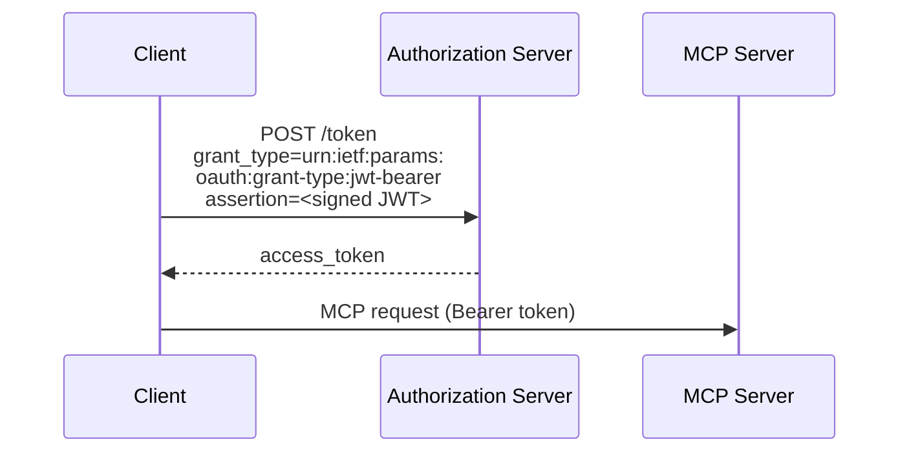

The OAuth Client Credentials extension (`io.modelcontextprotocol/oauth-client-credentials`) adds support for the [OAuth 2.0 client credentials flow](https://datatracker.ietf.org/doc/html/rfc6749#section-4.4) to MCP. This enables automated systems to connect to MCP servers without interactive user authorization.

<Card
  title="Specification"
  icon="file-lines"
  href="https://github.com/modelcontextprotocol/ext-auth/blob/main/specification/draft/oauth-client-credentials.mdx"
>
  Full technical specification for the OAuth Client Credentials extension.
</Card>

## What it is

The standard MCP authorization flow requires a user to interactively approve access — a browser opens, the user logs in, and grants permission. That works well for humans, but breaks down when there's no user present.

The OAuth Client Credentials extension solves this by letting a client authenticate using application-level credentials (a client ID and secret, or a signed JWT assertion) rather than delegated user credentials. The client proves its identity directly to the authorization server, which issues an access token without requiring a browser redirect or user interaction.

## When to use it

Use OAuth Client Credentials when:

- **Background services** need to call MCP tools on a schedule or in response to events, without a user present
- **CI/CD pipelines** invoke MCP servers as part of automated build, test, or deployment workflows
- **Server-to-server integrations** connect two backend systems where there's no end user involved
- **Daemon processes** or long-running workers need persistent access to MCP resources

If your integration has a human user who should explicitly authorize access, use the standard MCP authorization flow instead.

## How it works

The extension supports two credential formats:

### JWT Bearer Assertions (recommended)

Defined in [RFC 7523](https://datatracker.ietf.org/doc/html/rfc7523), JWT Bearer Assertions let the client sign a token with its private key and present it as proof of identity. The authorization server validates the signature using the client's registered public key.



The JWT assertion typically includes:

- `iss`: Client ID (the issuer)
- `sub`: Client ID (subject being authenticated)
- `aud`: Authorization server token endpoint URL
- `exp`: Expiration time
- `iat`: Issued-at time

### Client Secrets

For simpler deployments, the extension also supports the standard client credentials flow using a `client_id` and `client_secret`:

```
POST /token
Content-Type: application/x-www-form-urlencoded

grant_type=client_credentials
&client_id=my-service
&client_secret=s3cr3t
&scope=mcp:read mcp:write
```

JWT assertions are preferred because they avoid transmitting long-lived secrets and support stronger cryptographic guarantees.

## Implementation guide

### For MCP clients

To use the OAuth Client Credentials extension, your client must:

1. **Declare support** in the `initialize` request capabilities:

   ```json
   {
     "capabilities": {
       "extensions": {
         "io.modelcontextprotocol/oauth-client-credentials": {}
       }
     }
   }
   ```

2. **Obtain an access token** from the authorization server using the client credentials grant before connecting to the MCP server.

3. **Include the token** in the `Authorization` header of HTTP requests to the MCP server:

   ```
   Authorization: Bearer <access_token>
   ```

4. **Handle token refresh** — client credentials tokens typically have shorter lifetimes than user-delegated tokens. Implement token refresh logic to obtain a new token before expiry.

### For MCP servers

To accept client credentials tokens, your server must:

1. **Validate the token** on each request by verifying the JWT signature and claims against your authorization server's public keys (usually via a JWKS endpoint).

2. **Check scopes** — ensure the token includes the required scopes for the requested operation.

3. **Advertise support** in the `initialize` response (optional but recommended for discoverability):

   ```json
   {
     "capabilities": {
       "extensions": {
         "io.modelcontextprotocol/oauth-client-credentials": {}
       }
     }
   }
   ```

## SDK examples

The official MCP SDKs provide built-in support for client credentials authentication. Both handle token acquisition and refresh automatically.

### Using a client secret

<Tabs>
<Tab title="TypeScript">

```typescript
import {
  Client,
  ClientCredentialsProvider,
  StreamableHTTPClientTransport,
} from "@modelcontextprotocol/client";

const provider = new ClientCredentialsProvider({
  clientId: "my-service",
  clientSecret: "s3cr3t",
});

const client = new Client(
  { name: "my-service", version: "1.0.0" },
  { capabilities: {} }
);

const transport = new StreamableHTTPClientTransport(
  new URL("https://mcp.example.com/mcp"),
  { authProvider: provider }
);

await client.connect(transport);

// Use the client
const tools = await client.listTools();
console.log(
  "Available tools:",
  tools.tools.map((t) => t.name)
);

await transport.close();
```

</Tab>
<Tab title="Python">

```python
from mcp.client.auth.extensions.client_credentials import (
    ClientCredentialsOAuthProvider,
)
from mcp.client.streamable_http import streamablehttp_client
from mcp import ClientSession

provider = ClientCredentialsOAuthProvider(
    server_url="https://mcp.example.com/mcp",
    client_id="my-service",
    client_secret="s3cr3t",
    scopes="read write",
)

async with streamablehttp_client(
    "https://mcp.example.com/mcp",
    auth_provider=provider,
) as (read_stream, write_stream, _):
    async with ClientSession(read_stream, write_stream) as session:
        await session.initialize()

        # Use the client
        tools = await session.list_tools()
        print("Available tools:", [t.name for t in tools.tools])
```

</Tab>
</Tabs>

### Using a JWT private key

<Tabs>
<Tab title="TypeScript">

```typescript
import {
  Client,
  PrivateKeyJwtProvider,
  StreamableHTTPClientTransport,
} from "@modelcontextprotocol/client";

const provider = new PrivateKeyJwtProvider({
  clientId: "my-service",
  privateKey: process.env.CLIENT_PRIVATE_KEY_PEM,
  algorithm: "RS256",
});

const client = new Client(
  { name: "my-service", version: "1.0.0" },
  { capabilities: {} }
);

const transport = new StreamableHTTPClientTransport(
  new URL("https://mcp.example.com/mcp"),
  { authProvider: provider }
);

await client.connect(transport);

// Use the client
const tools = await client.listTools();
console.log(
  "Available tools:",
  tools.tools.map((t) => t.name)
);

await transport.close();
```

</Tab>
<Tab title="Python">

```python
from mcp.client.auth.extensions.client_credentials import (
    PrivateKeyJWTOAuthProvider,
    SignedJWTParameters,
)
from mcp.client.streamable_http import streamablehttp_client
from mcp import ClientSession

# Create a signed JWT assertion provider from key parameters
jwt_params = SignedJWTParameters(
    issuer="my-service",
    subject="my-service",
    signing_key=open("private_key.pem").read(),
    signing_algorithm="RS256",
    lifetime_seconds=300,
)

provider = PrivateKeyJWTOAuthProvider(
    server_url="https://mcp.example.com/mcp",
    client_id="my-service",
    assertion_provider=jwt_params.create_assertion_provider(),
    scopes="read write",
)

async with streamablehttp_client(
    "https://mcp.example.com/mcp",
    auth_provider=provider,
) as (read_stream, write_stream, _):
    async with ClientSession(read_stream, write_stream) as session:
        await session.initialize()

        # Use the client
        tools = await session.list_tools()
        print("Available tools:", [t.name for t in tools.tools])
```

</Tab>
</Tabs>

## Client support

<Note>

Support for this extension varies by client. Extensions are opt-in and never active by default.

</Note>

Check the [client matrix](/extensions/client-matrix) for current implementation status across MCP clients.

## Related resources

<CardGroup cols={2}>
  <Card
    title="ext-auth repository"
    icon="github"
    href="https://github.com/modelcontextprotocol/ext-auth"
  >
    Source code and reference implementations
  </Card>
  <Card
    title="Full specification"
    icon="file-lines"
    href="https://github.com/modelcontextprotocol/ext-auth/blob/main/specification/draft/oauth-client-credentials.mdx"
  >
    Technical specification with normative requirements
  </Card>
  <Card
    title="RFC 6749 — Client Credentials Grant"
    icon="link"
    href="https://datatracker.ietf.org/doc/html/rfc6749#section-4.4"
  >
    The underlying OAuth 2.0 specification
  </Card>
  <Card
    title="RFC 7523 — JWT Bearer Assertions"
    icon="link"
    href="https://datatracker.ietf.org/doc/html/rfc7523"
  >
    JWT assertion format specification
  </Card>
</CardGroup>
