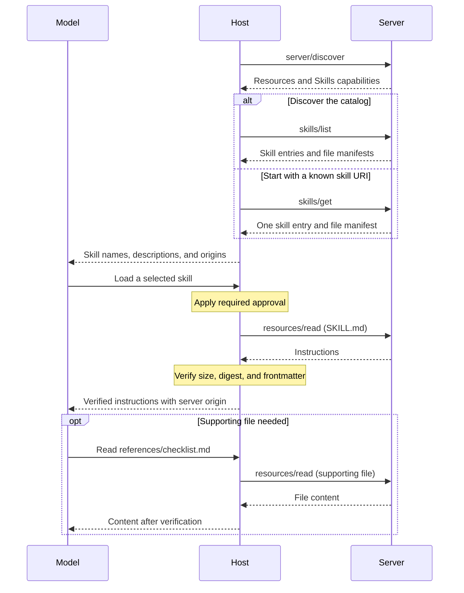

The [ext-skills repository](https://github.com/modelcontextprotocol/ext-skills)
contains the specification for Skills over MCP.

<Card
  title="modelcontextprotocol/ext-skills"
  icon="github"
  href="https://github.com/modelcontextprotocol/ext-skills"
>
  Specification and documentation for Skills over MCP.
</Card>

Tools describe individual operations. Skills provide the instructions for using
those operations together: a workflow, the decisions along the way, and any
supporting reference material. Skills over MCP lets servers publish those
instructions alongside their tools, so agents can discover and read them through
the same MCP server.

A skill is a directory containing a `SKILL.md` file and optional supporting
files, following the [Agent Skills specification](https://agentskills.io/specification).
This extension defines discovery and retrieval over MCP.

## How Skills work

The host discovers skill metadata, makes relevant skills available to the model
or user, and loads instructions when a skill is selected. Supporting files are
read only when needed. This keeps workflows with the service that maintains them
without loading every file into model context.

Reading `SKILL.md` in a resource browser does not activate a skill. The host's
skill-loading path verifies the content and applies any required user approval
before loading it into model context.



## Capabilities

Servers advertise the extension alongside their `resources` capability in
`server/discover`:

```json
{
  "capabilities": {
    "resources": {},
    "extensions": {
      "io.modelcontextprotocol/skills": {
        "directoryRead": true
      }
    }
  }
}
```

The extension requires `skills/list` and `skills/get`; files use the existing
`resources/read` method. `directoryRead` is optional and defaults to `false`.
An empty extension object advertises support without directory browsing. Clients
call these extension methods only after observing the corresponding capability.

<Note>
  These examples use protocol revision `2026-07-28` or later. For brevity,
  requests omit the required [request
  metadata](/specification/draft/basic/index#meta).
</Note>

## Discovering skills

### Listing skills

Call `skills/list` to build a registry without fetching file contents:

<CodeGroup>
```json Request
{
  "jsonrpc": "2.0",
  "id": 1,
  "method": "skills/list",
  "params": {}
}
```

```json Response
{
  "jsonrpc": "2.0",
  "id": 1,
  "result": {
    "resultType": "complete",
    "skills": [
      {
        "uri": "skill://code-review/SKILL.md",
        "frontmatter": {
          "name": "code-review",
          "description": "Review code using the team's checklist."
        },
        "resources": [
          {
            "uri": "skill://code-review/SKILL.md",
            "digest": "sha256:d2489d6c182e8df9c178563ff9f2eac7998a0c1bb1278c52a7fd5306e4259160",
            "size": 149
          },
          {
            "uri": "skill://code-review/references/checklist.md",
            "digest": "sha256:dbab2de7bf7db9cc95cb6ce681c3690b26184db39f75b958a0287ca6d9e24e20",
            "size": 65
          }
        ]
      }
    ],
    "ttlMs": 300000,
    "cacheScope": "public"
  }
}
```

</CodeGroup>

Each entry contains:

| Field         | Meaning                                                                      |
| ------------- | ---------------------------------------------------------------------------- |
| `uri`         | The resource URI of the skill's `SKILL.md`.                                  |
| `frontmatter` | All YAML frontmatter fields, unchanged, including `name` and `description`.  |
| `resources`   | Every file's URI, SHA-256 digest, and byte size, or `"dynamic"` (see below). |

The manifest includes `SKILL.md` and every supporting file. A listed entry is
complete; no `skills/get` call is needed to fill it in. If a response includes
`nextCursor`, pass it as `params.cursor` to retrieve the next page.
`resultType: "complete"`, `ttlMs`, and `cacheScope` are required on list and
get results. The [cache fields](/specification/draft/server/utilities/caching)
describe freshness and sharing, not content integrity.

A skill is identified by **server identity and URI together**. Names are labels
and can collide. Keep registries, approvals, and caches scoped to the originating
server. `skill://` is the recommended scheme; other schemes are supported.
A URI scheme alone does not establish that a resource is a skill.

### Getting a skill by URI

A user, another skill, or server instructions may supply a skill URI directly:

```json
{
  "jsonrpc": "2.0",
  "id": 2,
  "method": "skills/get",
  "params": {
    "uri": "skill://code-review/SKILL.md"
  }
}
```

The response contains the same entry under `result.skill`, alongside
`resultType: "complete"`, `ttlMs`, and `cacheScope`. This also refreshes a
single skill after it changes.

Servers may return empty or partial catalogs, but must answer `skills/get` for
every skill they serve. Clients must support loading by URI even when a skill
does not appear in a listing.

## Reading instructions and supporting files

When loading the example skill, read its `SKILL.md` using
[`resources/read`](/specification/draft/server/resources#reading-resources):

<CodeGroup>
```json Request
{
  "jsonrpc": "2.0",
  "id": 3,
  "method": "resources/read",
  "params": {
    "uri": "skill://code-review/SKILL.md"
  }
}
```

```json Response
{
  "jsonrpc": "2.0",
  "id": 3,
  "result": {
    "resultType": "complete",
    "contents": [
      {
        "uri": "skill://code-review/SKILL.md",
        "mimeType": "text/markdown",
        "text": "---\nname: code-review\ndescription: Review code using the team's checklist.\n---\n\n# Code review\n\nRead `references/checklist.md`, then review the diff.\n"
      }
    ],
    "ttlMs": 300000,
    "cacheScope": "public"
  }
}
```

</CodeGroup>

The file begins with YAML frontmatter containing `name` and `description`.
Its parent directory's final path segment matches `name`.

Resolve `references/checklist.md` relative to the skill's root:
`skill://code-review/references/checklist.md`. Read it from the same server
with another `resources/read` request when needed. Its example content is:

```markdown
# Review checklist

Check correctness, tests, and compatibility.
```

Both example files end with a newline; their digests and sizes match the manifest.
Do not prefetch files on connection, listing, or approval. Approval can bind to
the manifest without downloading its files.

## Verification and updates

For a skill with a manifest, the host holds that entry while the skill's
instructions remain in model context. Before using a retrieved file:

1. Check that its URI appears in the held manifest.
2. Verify its raw byte size and SHA-256 digest.
3. For `SKILL.md`, parse the YAML frontmatter and compare every field with the
   entry's `frontmatter`.

On any mismatch, do not use the content. Refresh the entry with `skills/get`.
Persisted approval binds to the complete set of file URIs and digests; a changed,
added, or removed file revokes that approval and requires approval again before
loading or executing.

Cache verified files on demand. Disk caches must either prevent modification by
the model, its tools, or other users and keep files immutable, or verify cached
bytes on every access. Keep them outside filesystem-skill discovery paths and
preserve their MCP origin, including after a restart.

<Note>
  Digests establish consistency with the server's manifest, not trust in its
  content. For generated content without stable digests, an entry uses
  `"resources": "dynamic"`. Hosts may decline these skills. If accepted,
  frontmatter still needs verification, and persisted approval cannot cover
  arbitrary future content.
</Note>

## Optional directory browsing

With `directoryRead: true`, clients can list a directory's direct children:

<CodeGroup>
```json Request
{
  "jsonrpc": "2.0",
  "id": 4,
  "method": "resources/directory/read",
  "params": {
    "uri": "skill://code-review/references"
  }
}
```

```json Response
{
  "jsonrpc": "2.0",
  "id": 4,
  "result": {
    "resultType": "complete",
    "resources": [
      {
        "uri": "skill://code-review/references/checklist.md",
        "name": "checklist.md",
        "mimeType": "text/markdown"
      }
    ]
  }
}
```

</CodeGroup>

Directory URIs have no trailing slash. Child directories use
`mimeType: "inode/directory"`; descend with another request. Results support
`cursor` / `nextCursor` pagination and are not recursive.

For static skills, the manifest already enumerates files and can answer
directory queries locally. Directory browsing helps with dynamic skills or
other resource trees. A live listing does not extend a held manifest: newly
listed files must not be exposed as part of the skill until its entry is
refreshed and any required approval obtained again.

## Implementation requirements

### For MCP servers

- Serve valid Agent Skills and implement the declared methods, including base
  Resources support. Preserve all frontmatter fields and publish complete manifests
  computed from the exact bytes served.
- Support direct lookup independently of catalog enumeration. Return one whole
  skill entry per item; do not split its manifest across pages.
- If advertising `directoryRead`, support every directory in the served skill
  namespaces.
- Aim to stay within the portable limits: **512 files and 16 MiB per skill**,
  including `SKILL.md`.

### For MCP clients and hosts

- Support skills up to those limits, namespace them by server and URI, and
  prevent same-named skills from silently replacing one another.
- Tag loaded content with its originating server. Bind resource reads to that
  server using a host-assigned label; cross-server reads require explicit
  per-call approval naming both servers.
- Treat content as untrusted input. Local code execution and permission grants
  such as `allowed-tools` require explicit per-skill user approval.
- Reading a nested `SKILL.md` as supporting content does not activate it or its
  frontmatter. Activating it separately requires fresh user consent.

See the [security requirements](https://github.com/modelcontextprotocol/ext-skills/blob/main/specification/stable/skills.mdx#security-considerations)
for the full approval, origin, and cache rules.

### Errors

| Condition                                       | Handling                                      |
| ----------------------------------------------- | --------------------------------------------- |
| Unknown skill/file, or invalid directory URI    | JSON-RPC `-32602` (Invalid params).           |
| Internal server failure                         | JSON-RPC `-32603` (Internal error).           |
| Digest, size, frontmatter, or manifest mismatch | Host rejects content and refreshes the entry. |

Verification failures are host-side conditions, not new protocol error codes.
If directory browsing is not advertised, clients must not call it.

## Client support

See the [client matrix](/extensions/client-matrix) for Skills support and links
to implementation documentation.

## Specification

The full specification is in the [ext-skills repository](https://github.com/modelcontextprotocol/ext-skills/blob/main/specification/stable/skills.mdx).
Development is coordinated by the [Skills Over MCP Working Group](/community/working-groups/skills-over-mcp).
