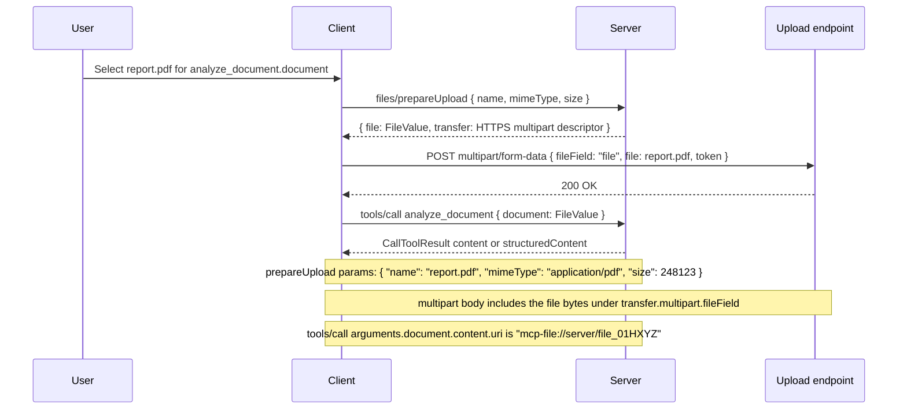

# SEP-0000: File Objects and Transfer

- **Status**: Draft
- **Type**: Standards Track
- **Created**: 2026-04-20
- **Author(s)**: Casey Chow (@caseychow)
- **Sponsor**: None
- **PR**: https://github.com/modelcontextprotocol/modelcontextprotocol/pull/0000

## Abstract

This SEP proposes a first-class MCP contract for file inputs and outputs. It
introduces typed file values, a shared payload model for inline or referenced file
content, capability negotiation for file transfer modes, and control-plane methods for
preparing uploads and resolving downloads. The goal is to let clients and servers
exchange files for tool calls and elicitation flows without assuming a mounted local
filesystem.

Under this proposal, tools and elicitation forms can explicitly declare which fields are
file-valued. Clients can gather files through native pickers, app-owned storage, browser
uploads, or local filesystems. Servers can receive `FileValue` objects during
`tools/call` and return `FileValue` objects in tool results or resource reads. Actual
bytes are transferred either out-of-band through negotiated upload/download endpoints or
inline as text/base64 when both parties explicitly support bounded inline transfer.

## Motivation

MCP currently has partial building blocks for file-like workflows, but no clean,
standardized end-to-end story for "the user gives a file to a tool" or "a tool returns a
file to the user":

- `resources/read` and `ContentBlock` support server-to-client retrieval patterns, but
  they do not define an out-of-band file transfer path for large or sensitive content.
- Tool arguments are arbitrary JSON, which has led implementations toward ad hoc file
  parameter conventions, hosted-storage handles, or inline `base64`.

This gap creates several ecosystem problems:

- File upload contracts differ between clients, gateways, and servers.
- Inline `base64` becomes the de facto fallback, even for large or sensitive files.
- User experience depends on harness-specific argument rewriting rather than protocol
  semantics.
- Server authors cannot reliably declare "this tool takes a file" in a way that works
  across local and hosted environments.

The design target for this SEP is a minimal interoperable baseline:

- A server can declare that a tool argument or elicitation field is a file.
- A client can supply that file in an efficient and secure way.
- A server can return a file in a result without forcing bytes into the model-visible
  contract.

## Goals

### File Input/Output Declaration and Representation

- Let servers declare file-valued inputs explicitly through metadata adjacent to tool and
  elicitation schemas.
- Standardize the representation of file-valued inputs so clients can bind files before
  `tools/call` without harness-specific parameter rewriting.
- Standardize the representation of file-valued outputs so generated or transformed
  artifacts can be downloaded, opened, saved, or reused predictably.
- Keep file identity and metadata in the JSON-RPC control plane while allowing file
  bytes to move through a separate transfer path.

### File Transfer Mechanism Negotiation

- Standardize file upload and download in a way that supports both inline text/base64
  payloads and negotiated out-of-band HTTP upload, including multipart form uploads.
- Allow both inline text/base64 transfer and out-of-band HTTP transfer as interoperable
  options, so implementations can choose based on file size, sensitivity, environment,
  and UX.

### Non-Functional

- Preserve compatibility with stateless MCP directions under discussion, especially
  work to remove mandatory initialization/session coupling and to support multi
  round-trip request flows without assuming long-lived server-side session state. This
  goal is aligned with [SEP-2575](https://github.com/modelcontextprotocol/modelcontextprotocol/pull/2575)
  and [SEP-2322](https://github.com/modelcontextprotocol/modelcontextprotocol/pull/2322).
- Support file exchange in hosted, browser-based, local, and gateway-mediated
  environments.
- Preserve compatibility with existing MCP primitives such as `tools/call`,
  `elicitation/create`, `resources/read`, and `ResourceLink` where they are useful.
- Avoid requiring any specific backing store, filesystem model, upload service, or
  deployment topology.

## Non-Goals

- Making inline `base64` transport the primary protocol contract for files.
- Standardizing one universal storage backend, object store, or artifact service.
- Solving every artifact lifecycle concern in v1, such as retention, version history,
  sharing, or cross-session persistence semantics.
- Replacing resource-oriented workflows where `resources/read` or `ResourceLink` are
  already the right abstraction.

## Specification

### 1. Design Principles

This SEP defines the following principles:

1. Generic MCP file support **MUST** work across hosted, browser-based, local, and
   gateway-mediated environments.
2. Raw bytes **MUST** only be sent inline when both parties explicitly negotiate inline
   transfer support.
3. Clients **MAY** source files from local filesystems, browser uploads, app-owned
   storage, cloud drives, or any other user-mediated surface.
4. File collection **SHOULD** usually happen before the main request is sent, rather
   than through a follow-up elicitation or URL-mode loop.
5. File-valued inputs **SHOULD** be declared through a sidecar map adjacent to the
   relevant schema so the schema continues to describe the value shape.

### 2. Capabilities

Clients that support file objects declare a new `files` capability during initialization:

```json
{
  "capabilities": {
    "files": {
      "input": true,
      "output": true,
      "transports": ["https"]
    }
  }
}
```

Capability fields:

- `input`: the client can provide file-valued inputs to tools or elicitation forms.
- `output`: the client can receive file-valued outputs from tool results.
- `transports`: supported out-of-band transport families. This SEP initially defines
  `https`, including multipart form uploads.

### 3. Existing and New Shapes

This proposal intentionally reuses existing MCP envelopes where they already define the
right protocol surface:

- `tools/call` continues to carry tool arguments in `params.arguments`.
- `CallToolResult.content` continues to use `ContentBlock[]`.
- `structuredContent` remains the structured tool-result channel.
- `resources/read` continues to return resource contents keyed by resource `uri`.
- `elicitation/create` form mode continues to use `requestedSchema` and form response
  content.

This SEP adds new file-specific shapes and threads them through those existing surfaces:

- `FileInputDescriptor` and `FileInputMap`: sidecar declarations for file-valued fields.
- `FilePayload`: a shared payload union for inline text, inline base64 bytes, or a file
  URI.
- `FileValue`: the value shape used for file-valued tool arguments, elicitation
  responses, structured tool output, and file content blocks.
- `FileContent`: a new `ContentBlock` variant that wraps a `FileValue`.
- `FileResourceContents`: a new `resources/read` resource-content variant for
  file-backed resources.
- `FileTransferDescriptor`: the upload/download descriptor for the out-of-band data
  plane.
- `files/prepareUpload` and `files/getDownload`: control-plane methods for resolving
  upload and download transfer descriptors.

### 4. File Values and Payloads

This SEP introduces a `FileValue` shape: a file-valued input or output with display
metadata and one payload.

The payload is one of:

- inline text, using `text`;
- inline base64 bytes, using `blob`;
- an out-of-band file URI, using `uri`.

A `FileValue` wraps optional file metadata around a payload:

```json
{
  "type": "file",
  "name": "tiny.txt",
  "mimeType": "text/plain",
  "size": 12,
  "content": {
    "text": "Hello world!"
  }
}
```

Binary inline content uses `blob`:

```json
{
  "type": "file",
  "name": "tiny.bin",
  "mimeType": "application/octet-stream",
  "size": 12,
  "content": {
    "blob": "SGVsbG8gd29ybGQh"
  }
}
```

Out-of-band content uses `uri`:

```json
{
  "type": "file",
  "name": "report.pdf",
  "mimeType": "application/pdf",
  "size": 248123,
  "content": {
    "uri": "mcp-file://server/file_01HXYZ"
  }
}
```

The `uri` payload identifies a file handle, but does not imply the file is available via
`resources/read`.

#### URI Namespaces

This SEP uses URIs for both resources and files, but they have different resolution
contracts.

A resource URI identifies resource contents and is resolved through `resources/read`. A
file URI identifies a file transfer handle and is resolved through `files/getDownload`,
or through the upload descriptor returned by `files/prepareUpload`.

Implementations **SHOULD** use distinct URI schemes or authorities for resource URIs and
file URIs. Examples in this SEP use `mcp-resource:` for resource URIs and `mcp-file:`
for file URIs.

Clients **MUST NOT** assume that a file URI can be passed to `resources/read`. Servers
**MUST NOT** require clients to treat file URIs as resources.

Rules:

- Inline binary transfer **MUST** use base64 in the `blob` field.
- Clients and servers **SHOULD** choose between inline and out-of-band transfer based on
  file size, sensitivity, environment, and user experience.
- Clients **MAY** decide whether to send a file inline or via out-of-band upload.
- Servers **MUST** validate and either accept or reject file values using their normal
  request validation rules.

In pseudocode:

```ts
type FilePayload = { text: string } | { blob: string } | { uri: string };

interface FileValue {
  type: "file";
  name?: string;
  mimeType?: string;
  size?: number;
  content: FilePayload;
}
```

### 5. Declaring File-Valued Inputs

Tools and elicitation forms declare file-valued fields with a sidecar map keyed by field
name. The sidecar identifies which existing schema properties should be treated as file
inputs, while the schema itself continues to describe the value shape.

This SEP expects the long-term protocol shape to be explicit sidecar fields:

- `inputFiles` on `Tool`, containing the tool's actual file input declarations.
- `requestedFiles` on form-mode elicitation requests, containing the actual file fields
  requested from the user.

Until those fields are standardized, implementations **MAY** carry the same maps in
`_meta` under the following reserved keys:

- `modelcontextprotocol.io/fileInputs` for tool input fields.
- `modelcontextprotocol.io/requestedFiles` for elicitation form fields.

A tool with a single file input can be declared as:

```json
{
  "name": "analyze_document",
  "inputSchema": {
    "type": "object",
    "properties": {
      "document": {
        "type": "object",
        "description": "The document to analyze."
      }
    },
    "required": ["document"]
  },
  "_meta": {
    "modelcontextprotocol.io/fileInputs": {
      "document": {
        "accept": ["application/pdf"],
        "maxFileSize": 10485760
      }
    }
  }
}
```

For multiple files:

```json
{
  "name": "compare_documents",
  "inputSchema": {
    "type": "object",
    "properties": {
      "documents": {
        "type": "array",
        "items": {
          "type": "object"
        },
        "minItems": 2
      }
    },
    "required": ["documents"]
  },
  "_meta": {
    "modelcontextprotocol.io/fileInputs": {
      "documents": {
        "accept": ["application/pdf", "text/plain"],
        "maxFileSize": 10485760
      }
    }
  }
}
```

Elicitation requests use the same descriptor shape:

```json
{
  "method": "elicitation/create",
  "params": {
    "mode": "form",
    "message": "Select a document to analyze.",
    "requestedSchema": {
      "type": "object",
      "properties": {
        "document": {
          "type": "object",
          "title": "Document"
        }
      },
      "required": ["document"]
    },
    "_meta": {
      "modelcontextprotocol.io/requestedFiles": {
        "document": {
          "accept": ["application/pdf"],
          "maxFileSize": 10485760
        }
      }
    }
  }
}
```

Each sidecar entry **MUST** name a property that exists in the associated schema. The
referenced schema property **MUST** describe either a single `FileValue` value or an array
whose items are `FileValue` values.

File input descriptors MAY include:

- `accept`: a list of MIME types or file extensions.
- `maxFileSize`: maximum size in bytes for each individual file.
- `purpose`: human-readable guidance for the user.

Clients that do not support file inputs **MUST** reject tools or elicitation requests
that require file-valued fields unless another interoperable non-file path is available.

### 6. Upload Negotiation

Before sending a client-originated file in `tools/call` or as the result of an
elicitation flow, the client calls `files/prepareUpload`:

```json
{
  "jsonrpc": "2.0",
  "id": 10,
  "method": "files/prepareUpload",
  "params": {
    "name": "report.pdf",
    "mimeType": "application/pdf",
    "size": 248123
  }
}
```

The server responds with an upload descriptor:

```json
{
  "jsonrpc": "2.0",
  "id": 10,
  "result": {
    "file": {
      "type": "file",
      "name": "report.pdf",
      "mimeType": "application/pdf",
      "size": 248123,
      "content": {
        "uri": "mcp-file://server/file_01HXYZ"
      }
    },
    "transfer": {
      "transport": "https",
      "method": "POST",
      "url": "https://upload.example.com/...",
      "headers": {
        "Content-Type": "multipart/form-data"
      },
      "multipart": {
        "fileField": "file",
        "fields": {
          "token": "abc123"
        }
      },
      "expiresAt": "2026-04-20T18:30:00Z"
    }
  }
}
```

The client uploads bytes out-of-band using the provided descriptor, then passes the
returned `FileValue` in `tools/call` or the elicitation result.

If inline transfer is used instead, the client **MAY** skip `files/prepareUpload` and
send a `FileValue` whose payload contains `text` or `blob`.

#### Tool Call Upload Lifecycle

The full out-of-band upload lifecycle for a tool call is:



### 7. Tool Invocation with Files

After upload preparation, clients pass `FileValue` objects in `tools/call` arguments:

```json
{
  "jsonrpc": "2.0",
  "id": 11,
  "method": "tools/call",
  "params": {
    "name": "analyze_document",
    "arguments": {
      "document": {
        "type": "file",
        "name": "report.pdf",
        "mimeType": "application/pdf",
        "size": 248123,
        "content": {
          "uri": "mcp-file://server/file_01HXYZ"
        }
      }
    }
  }
}
```

Servers **MUST** treat file arguments as `FileValue` objects whose URI payloads are
resolved through the upload contract, not as local filesystem paths or storage-specific
handles.

### 8. File Outputs

Tool results may return `FileValue` objects in either `structuredContent` or a new
`content` item of type `file`:

```json
{
  "type": "file",
  "file": {
    "type": "file",
    "name": "annotated-report.pdf",
    "mimeType": "application/pdf",
    "size": 252001,
    "content": {
      "uri": "mcp-file://server/file_01HYZA"
    }
  }
}
```

Clients resolve generated files through `files/getDownload`:

```json
{
  "jsonrpc": "2.0",
  "id": 12,
  "method": "files/getDownload",
  "params": {
    "uri": "mcp-file://server/file_01HYZA"
  }
}
```

The server responds with a download descriptor:

```json
{
  "jsonrpc": "2.0",
  "id": 12,
  "result": {
    "transport": "https",
    "method": "GET",
    "url": "https://download.example.com/...",
    "expiresAt": "2026-04-20T18:45:00Z"
  }
}
```

This method is the standard way to resolve generated files. Servers **MAY** also return
`ResourceLink` objects for resource-oriented workflows, but file output interoperability
defined by this SEP **MUST NOT** require `resources/read`.

File URI lifetime is server-defined. This SEP does not define how long a file URI
remains resolvable, whether a URI can be resolved more than once, or whether file URIs
are scoped to a request, task, session, user, or server. Servers
**MUST** reject expired, unauthorized, or unknown file URIs with an appropriate
JSON-RPC error. Clients **MUST** treat file URIs as revocable and be prepared for
`files/getDownload` to fail even if the URI was previously returned by the server.

### 9. Resource Reads

`resources/read` keeps its existing `TextResourceContents` and `BlobResourceContents`
shapes. This SEP adds an optional `FileResourceContents` variant for resources whose
bytes should be transferred out-of-band:

```json
{
  "uri": "mcp-resource://reports/monthly.pdf",
  "mimeType": "application/pdf",
  "content": {
    "uri": "mcp-file://server/file_01HYZA"
  }
}
```

Clients resolve file-backed resource contents through `files/getDownload` in the same
way they resolve generated file outputs from tool calls. This avoids requiring large or
sensitive resource bytes to be returned inline through JSON-RPC.

### 10. Error Handling

Implementations **SHOULD** use standard JSON-RPC errors with the following guidance:

- `-32601` when `files/prepareUpload` or `files/getDownload` is not supported.
- `-32602` when a file object is malformed or violates declared constraints such as
  `accept` or `maxFileSize`.
- `-32603` for internal failures resolving upload or download descriptors.

Servers **SHOULD** include machine-readable details when rejecting a file, such as:

```json
{
  "reason": "maxFileSizeExceeded",
  "maxFileSize": 10485760,
  "actualSize": 24812345
}
```

## Rationale

### Why Sidecar Declarations

File-ness is an affordance over an input field, not the whole schema for that field. A
sidecar map lets the schema continue to describe the value the server expects while giving
clients enough metadata to render file selection UX, validate obvious constraints, and
bind selected files before `tools/call`.

This also keeps the proposal compatible with the direction of SEP-2356: `inputFiles` is
the actual file-input declaration surface, and `requestedFiles` is its elicitation
counterpart. Using `_meta` as the interim carrier lets implementations experiment with
that real sidecar shape before MCP standardizes dedicated top-level fields.

### Why File Objects Instead of Bare URIs

Bare URIs overfit to storage topology. A typed file object gives the protocol a stable,
model-visible unit that can survive different backing implementations:

- local filesystems;
- hosted upload buckets;
- application-managed artifacts;
- transient gateway handles;
- inline small-file fallback.

### Why Separate Control Plane from Data Plane

The main design trap is forcing both file identity and file bytes through the same JSON
payload. Splitting these concerns keeps MCP aligned with JSON-RPC control flow while
letting implementations choose practical transport mechanisms for bytes.

### Why Not Default to Elicitation

File-specific elicitation and URL-mode flows are still useful as fallback UX, but they
should not be the default path because in the common case the client can bind the file
before `tools/call`, avoiding an unnecessary extra round trip.

### Why Standardize Download Resolution

`ResourceLink` is useful, but it is not enough by itself for generic file output. Tool
authors need a predictable answer to "how does this generated file become downloadable or
storable?" A dedicated `files/getDownload` method makes that path explicit.

## Backward Compatibility

This proposal is additive.

- Existing `resources/read` text and blob resource-content shapes continue to work
  unchanged.
- Existing `ResourceLink` workflows continue to work unchanged.
- Existing tools that accept ad hoc string or object inputs for files may continue to do
  so, though they would not automatically gain interoperability from this SEP.

If adopted, implementations may gradually migrate from custom file argument conventions
to the standard file value and payload model defined here.

## Security Implications

This SEP introduces important security considerations:

- Upload and download descriptors are bearer-style capabilities and **MUST** be scoped,
  time-limited, and transport-protected.
- Clients **MUST** not follow untrusted upload or download descriptors over insecure
  transports unless explicitly negotiated by a future SEP.
- Servers **MUST** validate MIME type, size, and file content according to their own
  policy rather than trusting client metadata.
- Clients **SHOULD** surface the source and destination context for file transfers so
  users understand where bytes are going.
- Inline transfer increases the risk of oversized payloads and accidental sensitive-data
  exposure in logs or transcripts; implementations **SHOULD** keep inline limits
  bounded.

## Performance Implications

The main performance impact is positive:

- large files no longer need to be base64-encoded into JSON-RPC messages;
- intermediaries and servers avoid parsing oversized request bodies for file content;
- clients can use storage-native upload and download paths.

This SEP does add one control-plane round trip for upload or download negotiation, but
that tradeoff is preferable to making every file transfer inline.

## Testing Plan

Conforming implementations should test at least:

- upload preparation followed by successful `tools/call` with a `FileValue`;
- generated file output followed by successful `files/getDownload`;
- rejection of malformed file objects;
- rejection of inline files that violate server validation or policy;
- user-driven file selection from non-filesystem sources such as browser upload surfaces.

## Alternatives Considered

### 1. Standardize inline `data:` URIs as the primary representation

Rejected because it couples control-plane semantics to raw-byte transport, scales poorly,
and encourages large model-visible payloads; this SEP still allows inline base64, but
not as the only or primary representation.

### 2. Use `resources/read` and `ResourceLink` as the entire file contract

Partially viable for server-originated outputs, and this SEP does integrate file-backed
resource contents with `resources/read`. However, these primitives are not sufficient for
client-to-server ingress. Uploads need an explicit negotiation and authorization story.

### 3. Leave file parameters entirely implementation-defined

Rejected because it preserves the current interoperability gap.

## Open Questions

- Should the stable sidecar fields be named `inputFiles` and `requestedFiles`, matching
  SEP-2356, while updating their value contract to `FileValue` instead of URI strings?
- Should `files/prepareUpload` require support for both raw-body and multipart HTTP
  uploads in v1, or allow servers to advertise only one?
- Should `files/getDownload` optionally return metadata for save/open/display affordances
  beyond the descriptor itself?
- Should generated files be representable both as `file` content items and as structured
  content references, or should MCP pick only one normative result shape?
- Should future work define a first-class client-owned artifact store distinct from
  existing resource-oriented workflows?

## Related Work

- [PR #2356](https://github.com/modelcontextprotocol/modelcontextprotocol/pull/2356):
  an existing MCP proposal for declarative file inputs in tools and elicitation. This SEP
  adopts its sidecar-declaration model while changing the value representation from inline
  RFC 2397 `data:` URIs to `FileValue` objects.
- OpenAI `openai/fileParams`: prior art for declaratively identifying which tool
  parameters are file-valued. Unlike `openai/fileParams`, this SEP's `fileInputs` map is
  intended to be the actual MCP file-input declaration, with `_meta` used only as a
  provisional placement until a first-class sidecar field is standardized.
