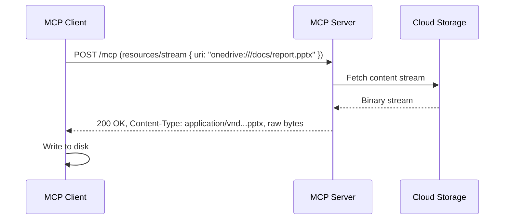
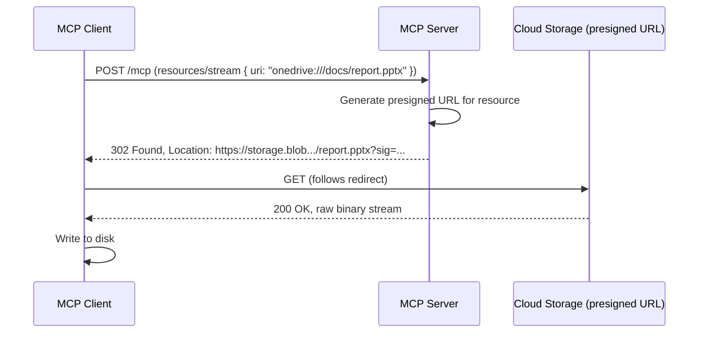
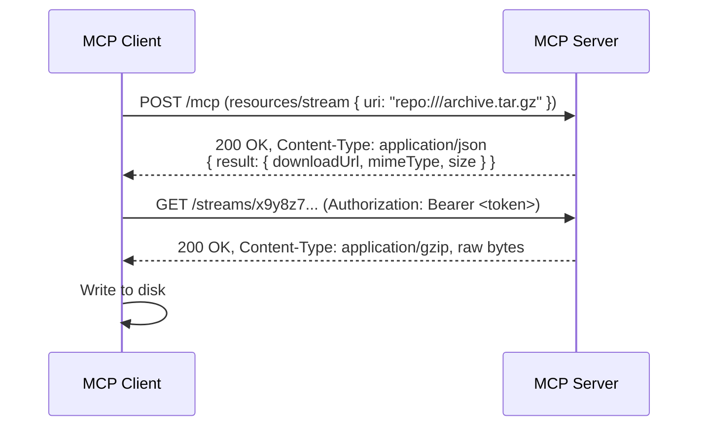
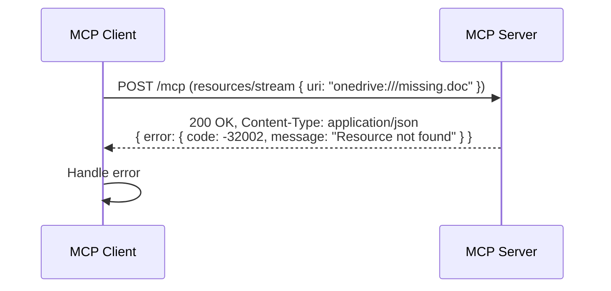

<div className="flex items-center gap-2 mb-4">
  <Badge color="gray" shape="pill">
    Draft
  </Badge>
  <Badge color="gray" shape="pill">
    Standards Track
  </Badge>
</div>

| Field         | Value                                                                           |
| ------------- | ------------------------------------------------------------------------------- |
| **SEP**       | 2532                                                                            |
| **Title**     | Resource Streaming for Binary Content Delivery                                  |
| **Status**    | Draft                                                                           |
| **Type**      | Standards Track                                                                 |
| **Created**   | 2026-04-07                                                                      |
| **Author(s)** | Patrick Rodgers ([@patrick-rodgers](https://github.com/patrick-rodgers))        |
| **Sponsor**   | None (seeking sponsor)                                                          |
| **PR**        | [#2532](https://github.com/modelcontextprotocol/modelcontextprotocol/pull/2532) |

---

## Abstract

This SEP proposes adding a new `resources/stream` method to the Model Context Protocol, enabling servers to deliver resource content as raw binary HTTP streams rather than base64-encoded JSON-RPC payloads. The client sends a standard JSON-RPC request; the server responds with stream metadata including a `downloadUrl`. The client then performs a standard HTTP GET against that URL — using the MCP session's authorization credentials — and receives raw binary bytes with no JSON-RPC envelope, no base64 encoding, and no intermediary framing.

This mirrors established patterns in cloud APIs (e.g., Microsoft Graph's `/content` endpoint returning a redirect to a binary download stream) and leverages HTTP's native capabilities for chunked transfer, range requests, and content negotiation.

Both servers and clients opt into streaming support through capability negotiation, ensuring full backward compatibility. Existing `resources/read` behavior remains unchanged for context-window-oriented content delivery. This SEP is scoped to HTTP-based remote transports; stdio transport is explicitly out of scope.

## Motivation

### The Base64 Scaling Problem

The current `resources/read` method returns content as either `text` (UTF-8 string) or `blob` (base64-encoded binary) within a JSON-RPC response envelope. This design works well for small resources destined for a language model's context window, but creates significant problems at scale:

1. **Memory pressure**: Base64 encoding inflates content by ~33%. The server must hold the entire encoded payload in memory to construct a valid JSON-RPC response. For a remote server hosting thousands of concurrent users reading multi-megabyte files (e.g., OneDrive documents, GitHub repository archives, SharePoint assets), this means gigabytes of unnecessary memory overhead.

2. **No streaming semantics**: JSON-RPC responses must be complete before delivery. A 50MB PDF must be fully base64-encoded, wrapped in JSON, and buffered before a single byte reaches the client. This creates latency spikes and timeout risks.

3. **Context window waste**: When a client needs a file's bytes (to save to disk, upload elsewhere, or pass to a tool), routing those bytes through base64 → JSON → parse → decode is pure overhead. The content was never intended for the LLM.

4. **Transport mismatch**: Modern transports (Streamable HTTP, WebSocket) natively support binary streaming, but MCP forces all content through a text-based JSON-RPC envelope regardless of transport capabilities.

### Real-World Use Cases Blocked Today

The following scenarios are impractical or broken with `resources/read` alone:

- **Cloud file storage** (OneDrive, SharePoint, Google Drive, S3): Files range from kilobytes to gigabytes. Encoding a 100MB PowerPoint as base64 in a JSON-RPC response is not viable for remote servers at scale. (See [#527](https://github.com/modelcontextprotocol/modelcontextprotocol/issues/527) — _"Base64 in JSON RPC will not scale for file content"_)

- **Repository content** (GitHub, GitLab): Repository archives, large binaries, and media assets need to be delivered to clients for local caching or forwarding. GitHub's MCP server team has identified this as a scaling concern for remote servers at high concurrency. ([#527 comments](https://github.com/modelcontextprotocol/modelcontextprotocol/issues/527#issuecomment-2923386315))

- **Document processing pipelines**: A client may read a PDF resource from one MCP server and upload it to another (OCR service, document converter). The bytes never need LLM context — they're piped between servers. Today, the bytes are needlessly base64-encoded, JSON-wrapped, parsed, and decoded in the middle.

- **Local file synchronization**: An IDE client may want to download resources to the local filesystem for editing, diffing, or version control. Streaming to disk is natural; buffering the entire file as a JSON string is not.

### Why Not Out-of-Band Downloads?

Previous proposals (PR [#607](https://github.com/modelcontextprotocol/modelcontextprotocol/pull/607) `uriScope`/`supportsDirectRead`, download URLs) solve this by exiting the protocol — the server provides a URL and the client fetches directly via HTTP. These approaches have merit but also significant limitations:

1. **Servers must become HTTP file servers**: Not every MCP server can host download endpoints. Servers behind NAT or in containers may not be directly reachable for arbitrary HTTP requests.

2. **Auth fragmentation**: Direct download URLs require separate auth handling (presigned URLs, token forwarding, OAuth token passing). MCP already has an auth model; ad-hoc exit from the protocol means reimplementing it.

3. **Network topology assumptions**: The server doesn't know the client's network capabilities. A `supportsDirectRead: true` resource with an internal URL may be unreachable from the client's network. ([connor4312 on PR #607](https://github.com/modelcontextprotocol/modelcontextprotocol/pull/607#issuecomment-2923371406))

4. **Loss of protocol guarantees**: Progress reporting, cancellation, error handling, and subscription semantics all exist within MCP. Fully out-of-band downloads lose these.

`resources/stream` addresses these concerns by keeping the _negotiation_ within the protocol (capabilities, auth, error handling) while delegating _byte delivery_ to HTTP — the transport that already does this well. The server provides a `downloadUrl` scoped to the MCP session; the client fetches it with the session's credentials. Auth stays unified, the server controls the URL lifecycle, and protocol-level error handling covers the negotiation phase.

### Scope

This SEP is scoped to **HTTP-based remote transports** (Streamable HTTP, and future transports such as WebSocket with HTTP sidecar). The stdio transport is explicitly out of scope — it is designed for local server communication where large binary file transfer is typically handled through filesystem access. A future SEP may address stdio binary framing if demand warrants it.

### Community Signal

This problem has been raised repeatedly across the MCP specification repository:

| Issue                                                                              | Title                                              | Signal                                                   |
| ---------------------------------------------------------------------------------- | -------------------------------------------------- | -------------------------------------------------------- |
| [#527](https://github.com/modelcontextprotocol/modelcontextprotocol/issues/527)    | Base64 in JSON RPC will not scale for file content | Core issue; 15+ comments, GitHub + OneDrive contributors |
| [#117](https://github.com/modelcontextprotocol/modelcontextprotocol/issues/117)    | Streaming tool use results                         | 49 upvotes, opened by MCP co-creator                     |
| [#155](https://github.com/modelcontextprotocol/modelcontextprotocol/issues/155)    | Passing attachments (resources) to MCP servers     | Foundational use case, led to SEP-1306 → SEP-2356        |
| [PR #607](https://github.com/modelcontextprotocol/modelcontextprotocol/pull/607)   | Add Resource.uriScope to enable direct reads       | Closed, "needs a SEP"                                    |
| [SEP-2356](https://github.com/modelcontextprotocol/modelcontextprotocol/pull/2356) | File input support for tools and elicitation       | Covers client→server; this SEP covers server→client      |

connor4312 (VS Code MCP) noted on PR #607:

> _"The main concern just becomes memory usage, which I think could be better solved with **streamed reads**."_

This SEP is the formal proposal for that streamed read mechanism.

## Specification

### 1. Capability Declaration

#### Server Capability

Servers that support resource streaming MUST declare the `stream` sub-capability within `resources`:

```json
{
  "capabilities": {
    "resources": {
      "stream": true,
      "subscribe": true,
      "listChanged": true
    }
  }
}
```

The `stream` capability is independent of and additive to existing resource capabilities. A server MAY support any combination:

```json
{ "capabilities": { "resources": { "stream": true } } }
```

```json
{ "capabilities": { "resources": { "subscribe": true } } }
```

```json
{
  "capabilities": {
    "resources": { "stream": true, "subscribe": true, "listChanged": true }
  }
}
```

#### Client Capability

Clients that can consume resource streams MUST declare the `resourceStreaming` capability:

```json
{
  "capabilities": {
    "resourceStreaming": {
      "maxStreamSize": 1073741824
    }
  }
}
```

- `maxStreamSize` (optional): Maximum byte size the client is willing to accept in a single stream. Servers SHOULD respect this limit and return an error if the resource exceeds it.

Servers MUST NOT send `resources/stream` responses to clients that did not declare `resourceStreaming` support.

### 2. Resource Metadata Extension

Resources that support streaming MAY indicate this via the existing resource object returned by `resources/list`:

```json
{
  "uri": "onedrive:///documents/quarterly-report.pptx",
  "name": "quarterly-report.pptx",
  "title": "Q1 2026 Quarterly Report",
  "mimeType": "application/vnd.openxmlformats-officedocument.presentationml.presentation",
  "size": 15728640,
  "annotations": {
    "audience": ["user"],
    "priority": 0.6
  },
  "streamable": true
}
```

The `streamable` field (boolean, optional, default `false`) indicates that the server supports `resources/stream` for this specific resource. This allows servers to selectively offer streaming for resources where it is appropriate (large binaries) while continuing to serve small text resources exclusively via `resources/read`.

If a server declares the `stream` capability, it SHOULD set `streamable: true` on resources where streaming is the preferred delivery mechanism.

### 3. The `resources/stream` Method

#### Request

```json
{
  "jsonrpc": "2.0",
  "id": 1,
  "method": "resources/stream",
  "params": {
    "uri": "onedrive:///documents/quarterly-report.pptx"
  }
}
```

The request is a standard JSON-RPC call, identical in shape to `resources/read`. The method name itself is the signal that the client expects raw binary delivery rather than a base64-encoded JSON-RPC payload.

#### Response: Direct Binary Stream (Primary Mode)

This SEP extends the Streamable HTTP transport to allow a third response Content-Type for `resources/stream` requests specifically. Today, the transport spec requires servers to return either `Content-Type: application/json` or `Content-Type: text/event-stream`. For `resources/stream`, the server MAY also respond with the resource's actual media type and immediately begin streaming raw bytes:

```http
HTTP/1.1 200 OK
Content-Type: application/vnd.openxmlformats-officedocument.presentationml.presentation
Content-Length: 15728640
Content-Disposition: attachment; filename="quarterly-report.pptx"
MCP-Resource-Uri: onedrive:///documents/quarterly-report.pptx

<raw binary bytes>
```

**That's it.** No JSON-RPC response envelope. No base64 encoding. No SSE framing. The server validates the request, resolves the resource, and starts pumping bytes — exactly like Microsoft Graph's `/content` endpoint or any standard HTTP file download.

The client knows it called `resources/stream`, so it inspects the response `Content-Type` to determine what it received:

- **`application/json`** → A JSON-RPC error response (resource not found, stream not supported, etc.). Parse as JSON-RPC and handle the error.
- **Any other Content-Type** → Raw binary stream. The Content-Type is the resource's MIME type. Write to disk, pipe to a consumer, or forward to another service.

This is the same content negotiation pattern used broadly in HTTP APIs — the caller knows to expect either an error payload or the content itself.

**Required response headers for binary streams:**

| Header                | Requirement | Purpose                                                                                                |
| --------------------- | ----------- | ------------------------------------------------------------------------------------------------------ |
| `Content-Type`        | MUST        | The resource's MIME type. Clients use this to determine file handling.                                 |
| `Content-Length`      | SHOULD      | Total size in bytes. Enables progress display and `maxStreamSize` enforcement before streaming begins. |
| `Content-Disposition` | SHOULD      | Suggested filename via `attachment; filename="..."`.                                                   |
| `MCP-Resource-Uri`    | MUST        | The canonical MCP resource URI. Allows the client to correlate the stream to the original request.     |

**Client behavior for direct binary streams:**

1. Clients MUST check the response `Content-Type` before processing the body.
2. If `Content-Type` is `application/json`, the client MUST parse the body as a JSON-RPC error response.
3. For any other `Content-Type`, the client MUST consume the body as raw binary.
4. Clients MUST enforce their declared `maxStreamSize` limit. If `Content-Length` exceeds it, or if bytes received exceed it, abort the download.
5. Clients SHOULD stream the body to disk or a consumer incrementally — NOT buffer the entire response in memory.
6. Clients MUST NOT inject the raw binary content into the LLM context window. The use of `resources/stream` (rather than `resources/read`) signals that this content is intended for file-level operations, not token consumption.

#### Response: Redirect Mode (Alternative)

Servers MAY respond with an HTTP redirect instead of streaming bytes directly. This is useful when the content is hosted in external storage (e.g., CDN, S3, Azure Blob) and the server wants to avoid proxying the bytes:

```http
HTTP/1.1 302 Found
Location: https://storage.blob.core.windows.net/container/quarterly-report.pptx?sv=2024-05-04&sig=...
MCP-Resource-Uri: onedrive:///documents/quarterly-report.pptx
```

The client follows the redirect transparently and receives the raw binary stream from the storage endpoint.

This enables a pattern identical to Microsoft Graph:

- `GET /me/drive/items/{id}/content` → `302` → presigned blob URL → raw bytes

**Requirements for redirect mode:**

1. Servers MUST include the `MCP-Resource-Uri` header on the redirect response.
2. The redirect target URL SHOULD be self-authenticating (e.g., presigned URL with embedded signature) so that the client does not need to forward MCP session credentials to a third-party storage endpoint.
3. If the redirect target requires authentication, the server MUST document the expected auth mechanism.
4. Redirect target URLs SHOULD be time-limited (e.g., valid for 5-15 minutes).
5. Clients MUST handle HTTP 302 and 307 redirects transparently.

#### Response: Download URL Mode (Alternative)

For servers that cannot respond with binary directly on the MCP endpoint (e.g., architectural constraints, load balancer limitations), the server MAY respond with a JSON-RPC result containing a `downloadUrl`:

```json
{
  "jsonrpc": "2.0",
  "id": 1,
  "result": {
    "uri": "onedrive:///documents/quarterly-report.pptx",
    "mimeType": "application/vnd.openxmlformats-officedocument.presentationml.presentation",
    "size": 15728640,
    "downloadUrl": "https://mcp-server.example.com/streams/a1b2c3d4-e5f6-7890-abcd-ef1234567890"
  }
}
```

The client detects this mode because `Content-Type: application/json` with a `result` (not an `error`) indicates a metadata response. The client then performs a separate HTTP GET to the `downloadUrl` with session credentials.

**Requirements for `downloadUrl` mode:**

1. The `downloadUrl` MUST use HTTPS.
2. The URL MUST be scoped to the authenticated MCP session and SHOULD be single-use or time-limited.
3. Clients MUST include the MCP session's authorization credentials when fetching the `downloadUrl`, unless it is self-authenticating.
4. The `downloadUrl` endpoint returns raw binary with the same headers as the direct binary stream mode.

This mode adds a round trip but may be necessary for servers that share a single HTTP endpoint for all MCP traffic and cannot return non-JSON responses on it.

#### Response Mode Summary

The client handles all three modes through a simple Content-Type check on the response to its `resources/stream` POST:

| Response Content-Type                        | Body                    | Client Action                                  |
| -------------------------------------------- | ----------------------- | ---------------------------------------------- |
| Resource MIME type (e.g., `application/pdf`) | Raw binary bytes        | Stream to disk / consumer                      |
| Redirect (302/307)                           | Empty (Location header) | Follow redirect, stream the target             |
| `application/json` with `error`              | JSON-RPC error          | Handle error (not found, not streamable, etc.) |
| `application/json` with `result.downloadUrl` | JSON-RPC metadata       | GET the `downloadUrl`, stream the result       |

Servers SHOULD prefer direct binary streaming or redirect mode for simplicity and efficiency. The `downloadUrl` mode exists as a fallback for constrained server architectures.

#### Example Flows

**Flow 1: Direct binary stream (preferred — like Graph `/contentStream`)**



**Flow 2: Redirect to storage (like Graph `/content` → 302)**



**Flow 3: Download URL fallback**



**Flow 4: Error**



#### Error Handling

Errors during the `resources/stream` request use standard JSON-RPC errors returned as `Content-Type: application/json`:

| Code     | Message              | Meaning                                            |
| -------- | -------------------- | -------------------------------------------------- |
| `-32002` | Resource not found   | The requested URI does not exist                   |
| `-32003` | Stream not supported | Server doesn't support streaming for this resource |
| `-32004` | Resource too large   | Resource exceeds client's `maxStreamSize`          |
| `-32603` | Internal error       | Server-side failure preparing the stream           |

Example:

```json
{
  "jsonrpc": "2.0",
  "id": 1,
  "error": {
    "code": -32003,
    "message": "Stream not supported",
    "data": {
      "uri": "file:///small-config.json",
      "suggestion": "Use resources/read for this resource"
    }
  }
}
```

Errors during the binary stream itself (after bytes have started flowing) manifest as HTTP-level failures:

- The connection may drop (client treats as incomplete transfer)
- The server may send fewer bytes than `Content-Length` promised (client detects and retries or discards)

For download URL mode, errors at the download endpoint use standard HTTP status codes:

| HTTP Status | Meaning                                    |
| ----------- | ------------------------------------------ |
| `200`       | Success — binary stream follows            |
| `206`       | Partial content (range request)            |
| `401`       | Session credentials invalid or expired     |
| `404`       | Download URL not found or already consumed |
| `410`       | Download URL expired                       |
| `500`       | Server error during content delivery       |

Clients SHOULD treat download failures as retriable. If the URL returns `410 Gone`, the client MAY re-issue the `resources/stream` JSON-RPC request to obtain a fresh URL.

### 4. Transport Considerations

#### Streamable HTTP Transport Extension

This SEP proposes a targeted extension to the Streamable HTTP transport specification. Currently, the spec states:

> _"If the body is a JSON-RPC request, the server MUST either return `Content-Type: text/event-stream`, to initiate an SSE stream, or `Content-Type: application/json`, to return one JSON object."_

For `resources/stream` requests **only**, this SEP adds a third permitted response type:

> For requests with method `resources/stream`, the server MAY additionally respond with any `Content-Type` matching the resource's MIME type, delivering the raw binary content directly in the HTTP response body.

This extension is narrowly scoped — it applies only to `resources/stream`, not to any other JSON-RPC method. All other MCP methods continue to use `application/json` or `text/event-stream` exclusively.

**Why this is safe:**

- The client explicitly called `resources/stream`, so it already expects non-JSON responses.
- The client checks `Content-Type` before parsing the body — `application/json` means error/metadata, anything else means binary.
- Existing MCP methods are unaffected.
- Clients that don't support `resources/stream` (i.e., didn't declare `resourceStreaming`) will never call it, so they never encounter a binary response.

#### Streamable HTTP (Primary Target)

The Streamable HTTP transport is the natural fit for `resources/stream`. The interaction cleanly maps to HTTP semantics:

- **Request**: Standard JSON-RPC POST to the MCP endpoint (same as any other MCP method)
- **Success response**: HTTP 200 with the resource's Content-Type and raw binary body, OR HTTP 302/307 redirect to storage
- **Error response**: HTTP 200 with `Content-Type: application/json` containing a JSON-RPC error
- **Metadata response**: HTTP 200 with `Content-Type: application/json` containing a JSON-RPC result with `downloadUrl` (fallback mode)

This leverages HTTP's native capabilities — chunked transfer encoding, `Content-Length`, `Content-Disposition`, range requests, redirects, CDN caching — without reinventing any of them inside JSON-RPC.

The server's MCP endpoint and any redirect targets MAY be on different origins. When different origins are used, the server is responsible for ensuring the target is accessible to the client and properly authenticated (e.g., via presigned URLs).

#### WebSocket Transport

For WebSocket-based MCP connections, the JSON-RPC request and response flow over the WebSocket. Since WebSocket frames cannot carry HTTP-style headers, `resources/stream` over WebSocket MUST use the download URL mode: the server returns a JSON-RPC result with a `downloadUrl`, and the client performs a separate HTTP GET.

This is deliberate — using a separate HTTP request:

- Avoids blocking the WebSocket connection for the duration of a large download
- Allows the server to delegate to CDN/storage without proxying through the WebSocket
- Keeps the WebSocket free for concurrent JSON-RPC messages

#### stdio Transport

The stdio transport is **out of scope** for this SEP. `resources/stream` is designed for remote server scenarios where HTTP is available for binary content delivery. Local stdio-based servers typically have direct filesystem access, making binary streaming over the protocol unnecessary.

A future SEP may propose binary framing for stdio if demand warrants it. Servers using stdio transport SHOULD NOT declare the `stream` capability.

### 5. Interaction with Existing Features

#### Relationship to `resources/read`

`resources/stream` does NOT replace `resources/read`. The two methods serve different purposes:

| Aspect               | `resources/read`                   | `resources/stream`                                    |
| -------------------- | ---------------------------------- | ----------------------------------------------------- |
| **Primary use**      | Content for LLM context window     | Raw bytes for files, processing, storage              |
| **Response**         | JSON-RPC with inline `text`/`blob` | Direct binary HTTP response (or redirect/downloadUrl) |
| **Content encoding** | UTF-8 text or base64 blob          | Raw binary — no encoding overhead                     |
| **Content size**     | Small to medium (fits in memory)   | Any size (streamed to disk)                           |
| **Client intent**    | "Give me content to reason about"  | "Give me bytes to save/forward"                       |
| **Transport**        | Always JSON-RPC                    | HTTP binary response on same MCP endpoint             |

Servers that support both MUST continue responding to `resources/read` for all resources. A client MAY use either method for any `streamable` resource — for example, a client might `resources/read` a PDF to extract text for the LLM, or `resources/stream` the same PDF to save it to disk.

#### Subscriptions

Resource subscriptions (`resources/subscribe`, `notifications/resources/updated`) work identically for streamable resources. When a subscribed resource changes, the client receives the update notification and may choose to re-read via `resources/read` or re-stream via `resources/stream`.

#### Resource Templates

Resource templates (`resources/templates/list`) MAY include `streamable: true` in the template definition to indicate that instantiated resources support streaming.

### 6. Error Handling

Error handling for `resources/stream` is covered in detail in [Section 3, Error Handling](#error-handling). In summary:

- **Protocol-level errors** (resource not found, stream not supported, too large): Returned as `Content-Type: application/json` JSON-RPC error responses on the same POST request.
- **HTTP-level errors** (download URL expired, auth failure): Standard HTTP status codes on the download request (for download URL mode) or on the binary response itself.
- **Transfer-level errors** (connection drop, incomplete transfer): Detected by comparing bytes received against `Content-Length`. Clients SHOULD retry.

## Rationale

### Why a New Method Instead of Extending `resources/read`?

Adding streaming as a parameter to `resources/read` (e.g., `"stream": true`) was considered but rejected because:

1. **Semantic clarity**: The method name itself communicates intent. Clients and servers can route, log, and handle the two methods differently without inspecting parameters.

2. **Backward compatibility**: Existing `resources/read` handlers don't need modification. New method = new handler.

3. **Transport optimization**: Transports can specialize their handling. A Streamable HTTP transport can return a binary response for `resources/stream` while continuing to return JSON for `resources/read`, without conditional logic per-request.

4. **SDK ergonomics**: `client.readResource(uri)` returns content for the LLM. `client.streamResource(uri)` returns a readable stream / file handle. Clean separation.

### Why Not Just Download URLs?

Previous proposals (PR #607, `supportsDirectRead`) suggested adding download URLs as a property on the resource object itself, with the client fetching directly. This SEP takes a different approach: the `downloadUrl` is returned as part of a `resources/stream` JSON-RPC response, not as a static resource property.

This distinction matters because:

- **Dynamic URL generation**: The server creates the download URL at request time, scoped to the session and time-limited. A static `downloadUrl` on a resource listing would require either long-lived URLs (security risk) or constant re-generation (complexity).
- **Auth consistency**: The client already has session credentials from the MCP connection. The `resources/stream` method specifies exactly how those credentials flow to the download — no need for presigned URL infrastructure.
- **Protocol-level error handling**: If the resource can't be streamed (not found, too large, not streamable), the server returns a JSON-RPC error before the client attempts any download. With static download URLs, errors only surface at HTTP fetch time.
- **Explicit intent**: The client calling `resources/stream` tells the server "I want binary bytes, prepare a download for me." The server can provision appropriately (e.g., request a download URL from Graph API, generate a presigned URL, set up a proxy). With static URLs, the server has to speculatively prepare download paths for all resources.

### Why Capability Negotiation on Both Sides?

Both server and client must opt in because:

- **Server**: Not all resources are streamable (e.g., dynamically computed text). The server knows which resources support streaming.
- **Client**: Not all clients can handle binary streams (e.g., a simple chatbot UI has no filesystem). The client knows its consumption capabilities.

Without both sides opting in, you'd get servers sending binary data to clients that can't handle it, or clients requesting streams from servers that can only produce JSON.

### Alternatives Considered

1. **`supportsDirectRead` / `uriScope` (PR #607)**: Static download URL as a resource property. Problems: URL lifecycle management, auth fragmentation, no error handling before fetch. This SEP's dynamic `downloadUrl` via `resources/stream` solves all three.

2. **Binary framing within JSON-RPC**: Streaming base64-chunked data as JSON-RPC notifications. Retains encoding overhead, adds protocol complexity (stream IDs, chunk sequencing, completion signals). We considered this for stdio support but concluded it's better left to a future SEP.

3. **SSE binary events**: Delivering binary content as SSE `data:` fields (base64 encoded) on the existing Streamable HTTP connection. Same encoding overhead as `resources/read`, blocks the SSE connection for the duration of the download, prevents concurrent messages.

4. **New transport-level primitive**: A generic binary channel in the transport layer. Too broad, too disruptive, requires changes to every transport and SDK. `resources/stream` is a protocol-level method that works with existing HTTP infrastructure.

5. **Multipart JSON-RPC responses**: Non-standard, breaks existing JSON-RPC libraries, limited ecosystem support.

## Backward Compatibility

This SEP introduces no backward incompatibilities.

- `resources/read` remains unchanged and MUST continue to work for all resources.
- The `stream` capability is opt-in for both servers and clients.
- Servers that don't declare `stream` in their capabilities will never receive `resources/stream` requests (well-behaved clients check capabilities).
- Clients that don't declare `resourceStreaming` will never receive stream data.
- The `streamable` field on resources defaults to `false` and is ignored by clients that don't understand it.
- Existing transports, SDKs, and implementations require zero changes to continue functioning.

Migration path: Implementations adopt streaming incrementally. A server can start by marking a few large-file resources as `streamable: true`. Clients can add streaming support when they're ready. There is no flag day.

## Security Implications

### New Attack Surfaces

1. **Resource exhaustion via large downloads**: A malicious server could attempt to overwhelm a client with an unbounded stream. **Mitigation**: Client's `maxStreamSize` capability sets an upper bound. Clients MUST enforce this limit — checking `Content-Length` before streaming begins and aborting if bytes received exceed the limit.

2. **Download URL abuse**: If download URLs are predictable or long-lived, an attacker could access resource content. **Mitigation**: Download URLs MUST be cryptographically unguessable (e.g., containing a UUID v4 or HMAC-signed token), session-scoped, and time-limited. Servers SHOULD make URLs single-use.

3. **Open redirect via `downloadUrl`**: A compromised or malicious server could return a `downloadUrl` pointing to an attacker-controlled endpoint. **Mitigation**: Clients SHOULD validate that the `downloadUrl` origin matches the MCP server's origin or a set of trusted origins. Clients MUST apply the same TLS verification to the download as to the MCP connection.

4. **Incomplete download exploitation**: A client might act on partially downloaded content (e.g., a truncated archive). **Mitigation**: Clients SHOULD verify `Content-Length` matches bytes received. Servers MAY include integrity metadata (e.g., `ETag`, checksum headers) in the download response.

### Privacy Considerations

- Download content has the same privacy characteristics as `resources/read` content — it is accessed using the same session credentials.
- The `downloadUrl` exposes content via an HTTP endpoint. The URL MUST be session-scoped and time-limited to prevent unauthorized access.
- Download URLs MUST NOT encode or leak information about the resource content, user identity, or server state in their path or query parameters (beyond what is necessary for routing).

### Transport Security

- The `downloadUrl` MUST use HTTPS/TLS.
- Clients MUST include the MCP session's authorization credentials when fetching the `downloadUrl`, unless the URL is self-authenticating (e.g., contains a cryptographic signature in its query parameters, as with presigned URLs).
- Servers SHOULD set appropriate cache-control headers (`Cache-Control: no-store`) on download responses to prevent sensitive content from being cached by intermediaries.

## Reference Implementation

> **Note**: A reference implementation is required before this SEP can reach "Final" status. The following describes the planned implementation approach.

### Planned Implementation

1. **TypeScript SDK**: Fork of `@modelcontextprotocol/sdk` adding:
   - `StreamableResource` type extending `Resource` with `streamable` field
   - `client.streamResource(uri)` method that returns `{ downloadUrl, mimeType, size }` and provides a helper to fetch the binary stream as a `ReadableStream<Uint8Array>`
   - Server-side `server.setStreamHandler()` for registering stream providers that return download URLs
   - Streamable HTTP transport integration

2. **Proof-of-Concept Server**: MCP server for OneDrive/SharePoint file access demonstrating:
   - `resources/stream` returning Graph API download URLs (mirroring `/content` → 302 pattern)
   - Progress reporting for multi-megabyte files via `Content-Length` and client-side tracking
   - Fallback to `resources/read` for small text files

3. **Proof-of-Concept Client**: CLI client demonstrating:
   - Stream-to-disk for large resources via HTTP GET to `downloadUrl`
   - Progress bar display using `Content-Length` headers
   - `maxStreamSize` enforcement

## Performance Implications

| Scenario                    | `resources/read`        | `resources/stream` (direct) | `resources/stream` (redirect)  |
| --------------------------- | ----------------------- | --------------------------- | ------------------------------ |
| 1MB text file               | ~1.33MB JSON payload    | ~1MB raw HTTP response      | ~1MB from storage              |
| 50MB binary file            | ~67MB JSON, full buffer | ~50MB chunked HTTP          | ~50MB from CDN                 |
| 500MB archive               | Likely OOM or timeout   | ~500MB chunked HTTP         | ~500MB from storage            |
| Server memory (per request) | Full payload in memory  | Constant (pipe-through)     | Near zero (redirect)           |
| Round trips                 | 1                       | 1                           | 1 (POST) + 1 (redirect follow) |

Key wins:

- **Peak memory**: From O(file_size) to O(chunk_size) for the server
- **Time to first byte**: Immediate (no need to buffer entire file)
- **Transport efficiency**: Raw binary over HTTP avoids 33% base64 overhead

## Open Questions

1. **Transport spec amendment process**: This SEP proposes extending the Streamable HTTP transport to allow binary Content-Types for `resources/stream` responses. Should this be a standalone transport amendment, or is it acceptable as part of this SEP? Current thinking: include it here since the extension is narrowly scoped to a single method.

2. **Resume support**: Should the spec define a mechanism for resuming interrupted streams (e.g., `Accept-Ranges` / `Range` headers on the binary response)? Current thinking: Servers SHOULD support range requests, but this SEP does not mandate it. HTTP range requests are well-understood and servers can adopt them without protocol-level specification.

3. **Relationship to streaming tool results (#117)**: This SEP addresses resource streaming specifically. Should tool results have an analogous mechanism for returning binary content? Current thinking: Yes, but as a separate SEP. The patterns established here (binary HTTP response, Content-Type switching) could be reused.

4. **`Accept` header from client**: Should the client include an additional value in the `Accept` header when POSTing a `resources/stream` request (e.g., `Accept: application/json, */*`) to signal willingness to receive binary? Current thinking: Yes, the client SHOULD include `*/*` or the expected MIME type in `Accept`, in addition to `application/json`. This gives standard HTTP intermediaries correct caching/routing signals.

5. **Concurrent stream limits**: Should there be a capability for clients to declare how many concurrent streams they support? Current thinking: Out of scope. Clients can manage their own concurrency. Servers can rate-limit download endpoints independently.

## Acknowledgments

- **@SamMorrowDrums** — Original issue [#527](https://github.com/modelcontextprotocol/modelcontextprotocol/issues/527) identifying the base64 scaling problem from the GitHub MCP server perspective
- **@jonathanhefner** — `supportsDirectRead` / `uriScope` proposal in [PR #607](https://github.com/modelcontextprotocol/modelcontextprotocol/pull/607), which shaped the out-of-band download approach incorporated here
- **@connor4312** — Key insight that _"memory usage could be better solved with streamed reads"_ and critical review of network topology assumptions
- **@LucaButBoring** — Sequence diagram and dual-path (in-protocol + direct download) architecture thinking
- **@jspahrsummers** — Original streaming tool results issue [#117](https://github.com/modelcontextprotocol/modelcontextprotocol/issues/117)
- **@localden** — Binary elicitation work ([SEP-1306](https://github.com/modelcontextprotocol/modelcontextprotocol/issues/1306)) exploring upload patterns that inform the bidirectional story
