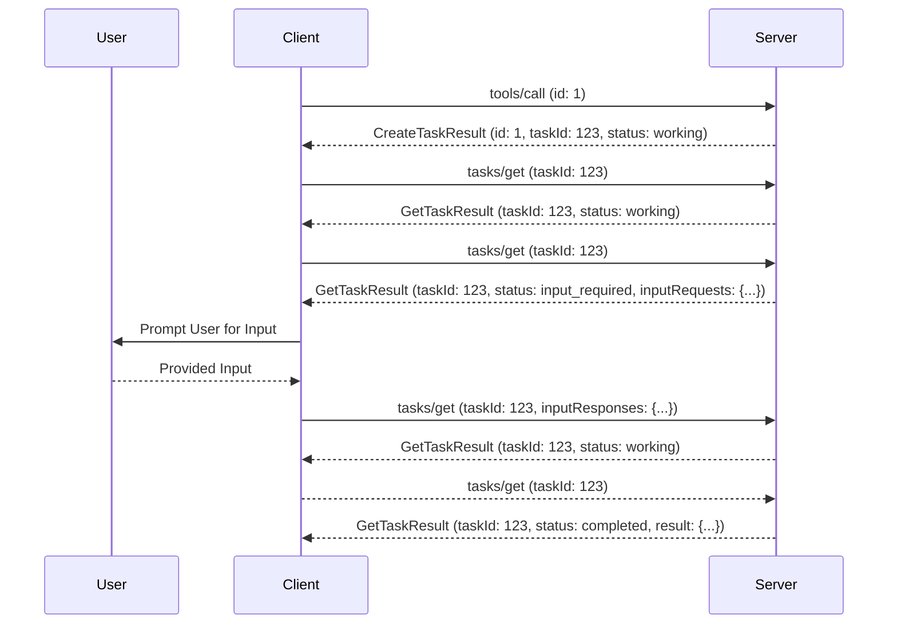

<div className="flex items-center gap-2 mb-4">
  <Badge color="gray" shape="pill">
    Draft
  </Badge>
  <Badge color="gray" shape="pill">
    Standards Track
  </Badge>
</div>

| Field         | Value                                                                                                                          |
| ------------- | ------------------------------------------------------------------------------------------------------------------------------ |
| **SEP**       | 2557                                                                                                                           |
| **Title**     | Adapt Tasks for Stateless & Sessionless Protocol                                                                               |
| **Status**    | Draft                                                                                                                          |
| **Type**      | Standards Track                                                                                                                |
| **Created**   | 2026-04-12                                                                                                                     |
| **Author(s)** | Luca Chang ([@LucaButBoring](https://github.com/LucaButBoring)), Caitie McCaffrey ([@CaitieM20](https://github.com/CaitieM20)) |
| **Sponsor**   | Caitie McCaffrey ([@CaitieM20](https://github.com/CaitieM20))                                                                  |
| **PR**        | [#2557](https://github.com/modelcontextprotocol/modelcontextprotocol/pull/2557)                                                |

---

## Abstract

This SEP incorporates changes into `Tasks` necessary following the acceptance of:

- [SEP-2260: Require Server requests to be associated with a Client request](./2260-Require-Server-requests-to-be-associated-with-Client-requests.md)
- [SEP-2322: Multi Round-Trip Requests](https://github.com/modelcontextprotocol/modelcontextprotocol/pull/2322)
- [SEP-2243: Http Standardization](https://github.com/modelcontextprotocol/modelcontextprotocol/pull/2243)
- [SEP-2567: Sessionless MCP via Explicit State Handles](https://github.com/modelcontextprotocol/modelcontextprotocol/pull/2567).

It also proposes a simplification of [tasks](https://modelcontextprotocol.io/specification/2025-11-25/basic/utilities/tasks) based on feedback since the initial experimental release.

This SEP DOES NOT move Tasks out of Experimentation status.

## Motivation

A number of changes are necessary in the `Tasks` feature to support the upcoming changes to the spec listed in the SEPs above, and to address issues identified since the initial experimental release of `Tasks` in the `2025-11-25` specification release.

### Changes to support upcoming SEPs

A number of changes are necessay to support the upcoming changes to the spec listed in the SEPs above.

<b>[SEP-2260]</b> disallows unsolicited server-to-client requests, which
invalidates the concept of client tasks for elicitation and sampling operations.
This proposal removes client-hosted tasks & their associated capabiliteis since
these scenarios are no longer supported.

<b>[SEP-2567]</b> removes sessions from the protocol, which was the only defined
scope for `tasks/list`. This proposal removes `tasks/list` methods and
capabilities since there is no clear way to scope a list of tasks between a
server and a client.

<b>[SEP-2322]</b> introduces a new flow for how the server requests more input
from the client, i.e. `elicitations`, `sampling`, and `roots`. SEP-2322
leverages the existing `input_required` task status to signal when the server
needs more information. The client then makes a request to `tasks/result` to
retrieve the `IncompleteResult` which contains the server's request for more
information. The current specification requires the client to make this
`tasks/result` request in a blocking manner, which is unintuitive and has led to
implementation issues. We identified that we would need to make a breaking
change to `tasks/result` during SEP-2322 discussions, but decided redesigning
tasks would be a scope expansion that would derail MRTR discussion. This
proposal simplifies this flow by inlining the `IncompleteResult` into the
`tasks/get` response when the task is in an `input_required` state, eliminating
the need for a separate blocking request and improving the intuitiveness of the
flow.

Given the difficulty of implementing the MRTR changes in Tasks as the spec currently stands, we believe that simplifying the Tasks flow by collapsing several methods into `tasks/get` is necessary and is also proposed here.

<b>[SEP-2243]</b> introduces standard headers in the Streamable HTTP Transport
to facilitate more efficient routing. Routing on `TaskId` is also desirable
since there is often state associated with a specific Task that needs to be
consistently routed to the same server instance. This proposal requires that the
`Mcp-Name` header MUST be set to the value of `params.taskId` by the client when
making `tasks/get` and `tasks/cancel` requests over the Streamable HTTP
Transport.

### Lessons Learned from Implementation & Usage Feedback

`Tasks` were introduced in an experimental state in the `2025-11-25` specification release, serving as an alternate execution mode for certain request types (tool calls, elicitation, and sampling) to enable polling for the result of a task-augmented operation.

#### Current Task Flow Overview

This is done according to the following process, using tool calls as an example:

1. Check the receiver's task capabilities for the request type. If the capability is not present, the receiver does not support tasks.
1. Invoke `tools/list` to retrieve the tool list, then check `execution.taskSupport` on the appropriate tool to determine if the tool supports tasks.
1. The client issues a `tools/call` request to the server, declaring the `task` parameter with a desired task TTL to indicate that the server should create a task to represent that work.
1. The server returns a `CreateTaskResult` with the task info for the client to look up the result later. This contains a suggested polling interval that the client should follow to avoid overwhelming the server.
1. The client polls `tasks/get` repeatedly according to the suggested polling interval.
1. If the task status is ever `input_required` during this phase, the client prematurely issues a `tasks/result` call to the server, which is expected to block until the task result is available:
   1. The server sends some request message to the client concurrently with this premature request. In stdio, this is effectively meaningless, but in Streamable HTTP, this allows the server to open an SSE side channel to send that pending request on.
   1. The client receives the request and sends a response, according to the standard conventions of the transport in use. This is completely disconnected from the (still-ongoing) `tasks/result` call.
   1. Once the server receives the result it needs, it transitions the task back to the `working` status.
1. Once the task status is `completed`, the client issues a `tasks/result` call to retrieve the final result.
   1. If the client still has an active `tasks/result` call from a prior `input_required` status, it will receive the result as the result to that open request.

#### Current Task Flow Problems

The current flow has a number of problems:

1. `tasks/result` is overloaded and calling it to retrieve server requests when in the `input_required` status is unintuitive.
2. `tasks/result` is expected to block until the task is completed if called prematurely. This has led to [implementation issues](https://github.com/modelcontextprotocol/java-sdk/pull/755#issuecomment-3806079033). Requires long lived persistent connections, which many clients & servers do not want to implement. This problem still exists even with MRTR.
3. The flow is inefficient. Clients must make multiple calls to `tasks/get` to check on the status and then to `tasks/result` to retrieve the final result or required input.

Task Creation also has a number of issues since it is client-directed instead of being server-directed.Today the client must declare that it wants a task to be created by including the `task` field in the request. This creates several issues:

1. It requires requestors to explicitly check the capabilities of receivers. This introduces an unnecessary state contract that may be violated during mid-session deployments under the Streamable HTTP transport, and also raises concerns about the capability exchange growing in payload size indefinitely as more methods are supported.
2. It requires a tool-specific behavior carveout which gets pushed onto the client to navigate. Related to this, it forces clients to cache a `tools/list` call prior to making any task-augmented tool call.
3. It requires host application developers to explicitly choose to opt into task support from request to request, rather than relying on a single, consistent request construction path for all protocol operations.
4. It creates unnecessary burden on server developers to handle both the task and non-task flow for the same tool call. Most Tools will either return a `Task` or not, no use case has emerged where a server would want to return a `Task` for some calls and not others for the same tool, so this flexibility is unnecessary.

## Specification

To support the new SEPs and solve the issues outlined above we propose the follwoing changes to the `Tasks` specification:

1. Removes Features made obsolete by upcoming SEPs.
2. Task Creation is determined by the Server.
3. Servers MUST support `task/cancel` operation.
4. Removal of Task Capabilities that are no longer necessary.
5. Simplified Task Polling Flow which consolidates all polling onto the `tasks/get` method.

### Remove features made obsolete by upcoming SEPs

1. We will remove the concept of client-hosted tasks (Sampling & Elicitation), as SEP-2260 disallows unsolicited server-to-client requests
2. We will remove the optional `tasks/list` operation, as SEP-2567 removes sessions which was the only defined scope for listing tasks between a server and a client. We may expand task support to additional client-to-server request types in the future, and implementors are still advised against implementing tasks as a tool-specific protocol operation.

### Task Creation Changes

Tasks will no longer be an optional capability, but will instead become a standard part of the protocol that servers MAY choose to implement. If a Tool returns a Task, Servers MUST declare `execution.tasksupport` on the tool definition.

Clients MUST understand Tasks, however they are not required to implement the polling workflow and leverage tools with `execution.taskSupport`. Clients MAY choose to filter out tools with `execution.taskSupport` declared.

1. We will remove the `tasks` capability declaration on both the client and the server.
1. Servers MAY return `CreateTaskResult` or a `CallToolResult`in response to `CallToolRequest`.
1. Servers SHOULD ignore the `task` field if it is present in a `CallToolRequest`.
1. If a server returns a `CreateTaskResult`, it MUST support the `tasks/get` and `tasks/cancel` methods to allow clients to poll for the result and cancel the task if desired.

### Task Cancel Changes

We propose aligning Task Cancellation with the Cooperative Cancellation model. In this model the requestor The requestor signals intent, but the worker decides when or if to honor it. This alligns `tasks/cancel with the cancellation pattern used in `notifications/cancelled`, where clients can always send a cancellation request, but servers can choose how to handle it. This also aligns Tasks with how Cancellation Tokens are handled in most async/concurrent programming languages including Go, Python, C#, TypeScript, etc...

In the specification this means:

Servers MUST support the `task/cancel` operation. A server MAY choose to ignore cancellation requests if its incapable or unwilling to offer cancellation of that Task.

### Task Capabilities Changes

This SEP Removes all capabilities related to Tasks.

- SEP-2567 makes `tasks/list` impossible to support.
- SEP-2260 disallows unsolicited server-to-client requests, which invalidates the concept of client tasks for elicitation and sampling operations.
- This SEP makes Tasks a standard part of the protocol, and not a negotiated capability.
- This SEP Makes `tasks/cancel` required to be supported, even if a server does not wish to support tasks.

The below table summarizes the changes to the task-related capabilities:

| Role   | Capability                              | Status  | Description                                      |
| ------ | --------------------------------------- | ------- | ------------------------------------------------ |
| Server | `tasks.requests.tools.call`             | removed | part of core protocol not an optional capability |
| Server | `tasks.cancel`                          | removed | `tasks/cancel` is required                       |
| Server | `tasks.list`                            | removed | no longer supported SEP-2567                     |
| Client | `tasks.requests.sampling.createMessage` | removed | no longer supported SEP-2260                     |
| Client | `tasks.requests.elicitation.create`     | removed | no longer supported SEP-2260                     |
| Client | `tasks.cancel`                          | removed | no longer needed, no client tasks                |
| Client | `tasks.list`                            | removed | no longer supported SEP-2567                     |

### Task Flow Change

We propose simplifying the Task Flow into two methods: `tasks/get` and `tasks/cancel`.

- The `tasks/get` methods will handle retrieving task statuses and results simultaneously, and will additionally act as the carrier for receiver-to-requestor requests for the purposes of SEP-2322: Multi Round-Trip Requests. This simplifies the flow and allows for polling or streaming updates on a single endpoint. Moreover this more closely matches Long Running Operation APIs where there is a single endpoint that is polled for the status of an operation.
- The `tasks/cancel` method will be required and a separate endpoint.

Below is an example of the new Task Flow.



We will make the following changes to the specification to support this.

1. We will remove the requirement that requestors react to the input_required status by prematurely invoking tasks/result to side-channel requests on an SSE stream in the Streamable HTTP transport.
2. We will inline the final task result or error into the Task shape, bringing that into tasks/get and all notifications by extension.
3. We will inline outstanding server-to-client requests into a new inputRequests field on GetTaskResult, akin to the field of the same name used in SEP-2322.
4. We will inline mid-task client-to-server results into a new inputResponses field on GetTaskRequest, akin to the field of the same name used in SEP-2322.
5. We will remove the tasks/result method.
6. We will update error handling to remove the notion that a task can be failed due to non-JSON-RPC errors such as a tool result with isError: true to maintain a strong separation between protocol-level faults and application-level faults.

```diff
-For failures, the `error` field **MUST** contain the JSON-RPC error that occurred during execution, or the task **MAY** use `status: "failed"` with a `statusMessage` for tool results with `isError: true`.
+For failures, the `error` field **MUST** contain the JSON-RPC error that occurred during execution. The `failed` status **MUST NOT** be used to represent non-JSON-RPC errors, such as a tool result that completed with with `isError: true`.
```

#### task/get Specification

We will add the following language to the specification to define the new flow and the expected behavior of `tasks/get`:

Upon receiving a `tasks/get` request with `inputResponses`, the server MUST process the provided responses and update the task state accordingly. The server MAY choose to transition the task back to `working` status if it determines that the provided input is sufficient to continue processing.

Upon receiving a `tasks/get` request, the server MUST check the status of the task and respond accordingly:

1. if the status is `working` the server MUST return a a `Task` object with status `working`.
2. if the status is `input_required` the server MUST return a `Task` object with status `input_required` and an `inputRequests` field defined in [SEP-2322: Multi Round-Trip Requests](https://github.com/modelcontextprotocol/modelcontextprotocol/pull/2322). The `inputRequests` field MUST contain all outstanding requests from the server to the client that need to be fulfilled before the task can proceed.
3. if the status is `completed` the server MUST return a `Task` object with status `completed` and a `result` field containing the final result of the task.
4. if the status is `cancelled` the server MUST return a `Task` object with status `cancelled`.
5. if the status is `failed` the server MUST return a `Task` object with status `failed` and the error that occurred during execution.

The below section contains example responses for each of the above cases.

<b>Status: Working</b>

```json
{
  "jsonrpc": "2.0",
  "id": 1,
  "resultType": "task",
  "result": {
    "taskId": "786512e2-9e0d-44bd-8f29-789f320fe840",
    "status": "working",
    "statusMessage": "The operation is in progress.",
    "createdAt": "2025-11-25T10:30:00Z",
    "lastUpdatedAt": "2025-11-25T10:40:00Z",
    "ttl": 60000,
    "pollInterval": 5000
  }
}
```

<b>Status: Completed</b>

```json
{
  "jsonrpc": "2.0",
  "id": 1,
  "resultType": "task",
  "result": {
    "taskId": "786512e2-9e0d-44bd-8f29-789f320fe840",
    "status": "completed",
    "statusMessage": "The operation has completed successfully.",
    "createdAt": "2025-11-25T10:30:00Z",
    "lastUpdatedAt": "2025-11-25T10:40:00Z",
    "ttl": 60000,
    "pollInterval": 5000,
    "result": {
      "content": [
        {
          "type": "text",
          "text": "Current weather in New York:\nTemperature: 72°F\nConditions: Partly cloudy"
        }
      ],
      "isError": false
    }
  }
}
```

<b>Status: Failed</b>

```json
{
  "jsonrpc": "2.0",
  "id": 1,
  "resultType": "task",
  "result": {
    "taskId": "786512e2-9e0d-44bd-8f29-789f320fe840",
    "status": "failed",
    "statusMessage": "Tool execution failed: API rate limit exceeded",
    "createdAt": "2025-11-25T10:30:00Z",
    "lastUpdatedAt": "2025-11-25T10:40:00Z",
    "ttl": 30000,
    "error": {
      "code": -32603,
      "message": "API rate limit exceeded"
    }
  }
}
```

<b>Status: Cancelled</b>

```json
{
  "jsonrpc": "2.0",
  "id": 6,
  "resultType": "task",
  "result": {
    "taskId": "786512e2-9e0d-44bd-8f29-789f320fe840",
    "status": "cancelled",
    "statusMessage": "The task was cancelled by request.",
    "createdAt": "2025-11-25T10:30:00Z",
    "lastUpdatedAt": "2025-11-25T10:40:00Z",
    "ttl": 30000,
    "pollInterval": 5000
  }
}
```

<b> Status: input_required</b>

```json
{
  "jsonrpc": "2.0",
  "id": 1,
  "resultType": "task",
  "result": {
    "taskId": "786512e2-9e0d-44bd-8f29-789f320fe840",
    "status": "input_required",
    "statusMessage": "The operation requires additional input.",
    "createdAt": "2025-11-25T10:30:00Z",
    "lastUpdatedAt": "2025-11-25T10:40:00Z",
    "ttl": 60000,
    "pollInterval": 5000,
    "inputRequests": {
      "github_login": {
        "method": "elicitation/create",
        "params": {
          "mode": "form",
          "message": "Please provide your GitHub username",
          "requestedSchema": {
            "type": "object",
            "properties": {
              "name": {
                "type": "string"
              }
            },
            "required": ["name"]
          }
        }
      }
    }
  }
}
```

### Task Schema Changes

The `Task` schema defining the task metadata gains an optional `requestState` (see SEP-2322). We additionally introduce new derived types that inline `result`/`error`/`inputRequests`, to be used by `tasks/get` and `notifications/tasks/status`. This allows us to avoid introducing redundant/bloated fields in `CreateTaskResult`.

```typescript
interface Task {
  // Existing fields...
  /**
   * Optional field containing request state passed back from the server to the client (see SEP-2322).
   */
  requestState?: string;
}

interface InputRequiredTask extends Task {
  status: "input_required";
  /**
   * Field containing the InputRequests that specify the additional information needed from the client. Present
   * only when task status is `input_required` (see SEP-2322).
   */
  inputRequests: InputRequests;
}

interface CompletedTask extends Task {
  status: "completed";
  /**
   * The final result of the task. Present only when status is "completed".
   * The structure matches the result type of the original request.
   * For example, a {@link CallToolRequest | tools/call} task would return the {@link CallToolResult} structure.
   */
  result: JSONObject;
}

interface FailedTask extends Task {
  status: "failed";
  /**
   * The error that caused the task to fail. Present only when status is "failed".
   */
  error: JSONObject;
}

type DetailedTask = Task | InputRequiredTask | CompletedTask | FailedTask;
```

#### Client Requests for `task/get`

```typescript
interface GetTaskRequest extends JSONRPCRequest {
  method "tasks/get";
  params: {
    /**
     * The task identifier to query.
     */
    taskId: string;
    /**
     * Optional field to allow the client to respond to a server's request for more information
     * when the task is in `input_required` state (see SEP-2322).
     */
    inputResponses?: InputResponses;
    /**
     * Optional field containing request state passed to the server from the client (see SEP-2322).
     */
    requestState?: string;
  };
}
```

#### Server Response for `task/get`

```typescript
type GetTaskResult = Result & DetailedTask;

type TaskStatusNotificationParams = NotificationParams & DetailedTask;
```

#### `ResultType`

The ResultType field was introduced in [SEP-2322: Multi Round-Trip Requests](https://github.com/modelcontextprotocol/modelcontextprotocol/pull/2322) to handle polymorphic results. `Tasks` has the same issue where a server may return a `CallToolResult` or a `CreateTaskResult`. To address this, we propose the addition of the `task` ResultType to indicate that a Response contains a `Task` object.

```typescript
type ResultType = "complete" | "incomplete" | "task";
```

For backwards compatibility ResultType is inferred by default to be `complete`. Therefore all calls which return a `Task` (i.e.`task/get`, `task/cancel`) calls must set `task` as the ResultType moving forward.

Below (collapsed) is the full JSON example of a tool call with an unsolicited task-augmentation that matches the diagram above:

### Example Task Flow

Consider a simple tool call, `hello_world`, requiring an elicitation for the user to provide their name. The tool itself takes no arguments.

To invoke this tool, the client makes a `CallToolRequest` as follows:

```json
{
  "jsonrpc": "2.0",
  "id": 2,
  "method": "tools/call",
  "params": {
    "name": "hello_world",
    "arguments": {}
  }
}
```

The server determines (via bespoke logic) that it wants to create a task to represent this work, and it immediately returns a `CreateTaskResult`:

```json
{
  "jsonrpc": "2.0",
  "id": 2,
  "resultType": "task",
  "result": {
    "task": {
      "taskId": "786512e2-9e0d-44bd-8f29-789f320fe840",
      "status": "working",
      "createdAt": "2025-11-25T10:30:00Z",
      "lastUpdatedAt": "2025-11-25T10:50:00Z",
      "ttl": 30000,
      "pollInterval": 5000
    }
  }
}
```

Once the client receives the `CreateTaskResult`, it begins polling `tasks/get`:

```json
{
  "jsonrpc": "2.0",
  "id": 3,
  "method": "tasks/get",
  "params": {
    "taskId": "786512e2-9e0d-44bd-8f29-789f320fe840"
  }
}
```

On each request while the task is in a `"working"` status, the server returns a regular task response:

```json
{
  "jsonrpc": "2.0",
  "id": 3,
  "resultType": "task",
  "result": {
    "taskId": "786512e2-9e0d-44bd-8f29-789f320fe840",
    "status": "working",
    "createdAt": "2025-11-25T10:30:00Z",
    "lastUpdatedAt": "2025-11-25T10:50:00Z",
    "ttl": 30000,
    "pollInterval": 5000
  }
}
```

Eventually, the server reaches the point at which it needs to send an elicitation to the user. It sets the task status to `"input_required"` to signal this, and may additionally provide a `requestState` if it so chooses. On the next `tasks/get` request from the client, the server sends the elicitation payload via the `inputRequests` field. Note that, unlike in [SEP-2322](https://github.com/modelcontextprotocol/modelcontextprotocol/pull/2322), the standard task status result is still returned. The updated task polling flow should be thought of as distinct from the MRTR flow, despite sharing many characteristics.

```json
{
  "jsonrpc": "2.0",
  "id": 4,
  "method": "tasks/get",
  "params": {
    "taskId": "786512e2-9e0d-44bd-8f29-789f320fe840"
  }
}
```

```json
{
  "id": 4,
  "jsonrpc": "2.0",
  "resultType": "task",
  "result": {
    "taskId": "786512e2-9e0d-44bd-8f29-789f320fe840",
    "status": "input_required",
    "createdAt": "2025-11-25T10:30:00Z",
    "lastUpdatedAt": "2025-11-25T10:50:00Z",
    "ttl": 30000,
    "pollInterval": 5000,
    "inputRequests": {
      "name": {
        "method": "elicitation/create",
        "params": {
          "mode": "form",
          "message": "Please enter your name.",
          "requestedSchema": {
            "type": "object",
            "properties": {
              "name": { "type": "string" }
            },
            "required": ["name"]
          }
        }
      }
    },
    "requestState": "foo"
  }
}
```

For thoroughness, let's consider a case where the client happens to poll `tasks/get` again _before_ the user has fulfilled the elicitation request. As `inputRequests` is effectively a point-in-time snapshot of all outstanding server-to-client requests associated with the task, the server includes the same request again, despite the client having already seen this information (the client is advised to deduplicate `inputRequests` with the same key for UX purposes):

```json
{
  "jsonrpc": "2.0",
  "id": 5,
  "method": "tasks/get",
  "params": {
    "taskId": "786512e2-9e0d-44bd-8f29-789f320fe840",
    "requestState": "foo"
  }
}
```

```json
{
  "id": 5,
  "jsonrpc": "2.0",
  "resultType": "task",
  "result": {
    "taskId": "786512e2-9e0d-44bd-8f29-789f320fe840",
    "status": "input_required",
    "createdAt": "2025-11-25T10:30:00Z",
    "lastUpdatedAt": "2025-11-25T10:50:00Z",
    "ttl": 30000,
    "pollInterval": 5000,
    "inputRequests": {
      "name": {
        "method": "elicitation/create",
        "params": {
          "mode": "form",
          "message": "Please enter your name.",
          "requestedSchema": {
            "type": "object",
            "properties": {
              "name": { "type": "string" }
            },
            "required": ["name"]
          }
        }
      }
    },
    "requestState": "foo"
  }
}
```

The user enters their name, and the client makes a new `tasks/get` request with the satisfied information:

```json
{
  "jsonrpc": "2.0",
  "id": 6,
  "method": "tasks/get",
  "params": {
    "taskId": "786512e2-9e0d-44bd-8f29-789f320fe840",
    "inputResponses": {
      "name": {
        "action": "accept",
        "content": {
          "input": "Luca"
        }
      }
    },
    "requestState": "foo"
  }
}
```

With the elicitation fulfilled and no other outstanding requests to send, the server moves the task back into the `"working"` status:

```json
{
  "jsonrpc": "2.0",
  "id": 6,
  "result": {
    "taskId": "786512e2-9e0d-44bd-8f29-789f320fe840",
    "status": "working",
    "createdAt": "2025-11-25T10:30:00Z",
    "lastUpdatedAt": "2025-11-25T10:50:00Z",
    "ttl": 30000,
    "pollInterval": 5000
  }
}
```

Eventually, the server completes the request, so it stores the final `CallToolResult` and moves the task into the `"completed"` status. On the next `tasks/get` request, the server sends the final tool result inlined into the task object:

```json
{
  "jsonrpc": "2.0",
  "id": 7,
  "method": "tasks/get",
  "params": {
    "taskId": "786512e2-9e0d-44bd-8f29-789f320fe840"
  }
}
```

```json
{
  "jsonrpc": "2.0",
  "id": 7,
  "resultType": "task",
  "result": {
    "taskId": "786512e2-9e0d-44bd-8f29-789f320fe840",
    "status": "completed",
    "createdAt": "2025-11-25T10:30:00Z",
    "lastUpdatedAt": "2025-11-25T10:50:00Z",
    "ttl": 30000,
    "pollInterval": 5000,
    "result": {
      "content": [
        {
          "type": "text",
          "text": "Hello, Luca!"
        }
      ],
      "isError": false
    }
  }
}
```

### HTTP Streamable Transport Headers

[SEP-2243](https://github.com/modelcontextprotocol/modelcontextprotocol/pull/2243) introduces standard headers in the Streamable HTTP Transport to facilitate more efficient routing. Routing on `TaskId` is also desirable since there is often state associated with a specific Task that needs to be consistently routed to the same server instance. SEP-2243 requires that all requests and notifications declare an `Mcp-Method` header.

We will extend this with semantics for the `tasks/get` and `tasks/cancel` requests, requiring that the `Mcp-Name` header MUST be set to the value of `params.taskId` by the client when making `tasks/get` and `tasks/cancel` requests over the Streamable HTTP Transport.

## Rationale

### Removing `tasks/result`

Removing `tasks/result` was the logical conclusion of this proposal after inlining the result/error into `tasks/get`. As an alternative, we could have left `tasks/get` unchanged and left `tasks/result` in solely as a method for late result retrieval. This would have incentivized using `tasks/get` as a general method of retrieving the task state and result simultaneously, rendering `tasks/result` obsolete regardless.

Furthermore, the greatest flaw of `tasks/result` today is its blocking requirement, and leaving that in place would leave the general implementation headache of dealing with that unsolved. If we chose to instead remove the blocking requirement in favor of an "incomplete" error, we could get away with leaving `tasks/result` in place in a deprecated state, but then we would have been making a breaking change to it anyways.

### Removing `tasks/list`

Given that tasks are intended to be bound to their creator in some way (the current specification is that they should be bound to the "authorization context" if possible), removing `tasks/list` avoids complications where that context is not well-defined. As a specific example: If a task ID is unique and resistant to guessing, but does not have a "user" associated with it, the server running that task knows subsequent requests containing that task ID are owned by the caller. However, it does not know if two separate tasks with different IDs are from the same caller unless it can correlate them via some additional property (e.g. some variety of session state).

As a second point, we assert that all common use cases for `tasks/list` can in fact be satisfied by the client application, similarly to the argument for removing sessions posed in [SEP-2567: Sessionless MCP via Explicit State Handles](https://github.com/modelcontextprotocol/modelcontextprotocol/pull/2567). An end-user application that needs to retain a list of tasks associated with a conversation can store task IDs it receives alongside its own persisted conversation state; one that wishes to maintain a list of tasks to reference across conversations can aggregate that list on its own.

### Removing Client-Hosted Tasks

Under [SEP-1686](./1686-tasks.md), clients could optionally offer their own task-hosting support on elicitation and sampling operations; this was not foreseen as particularly useful in its own right, but rather was intended to avoid coupling tasks to the assumptions imposed by tool calls (specifically, to remove any incentive to adding tool-specific requirements to tasks themselves). However, as of [SEP-2260](./2260-Require-Server-requests-to-be-associated-with-Client-requests.md), task-augmented elicitation and sampling are conceptually invalid. Put simply, SEP-2260 disallows unsolicited server-to-client requests; any server-to-client request must be bounded by a client-to-server request with a longer request lifetime to facilitate scalable deployment of SSE streams. Tasks explicitly decouple the _operation lifetime_ from the _request lifetime_, meaning that it is not possible for a server to poll a client under the updated specification language; _every_ polling request is unsolicited.

As a direct consequence of that change, all server-to-client task requests are rendered invalid, hence the removal of client-hosted tasks altogether. We could have chosen to maintain that functionality for possible future use, but this would have created a maintenance burden with no corresponding benefits for the ecosystem at large.

### Unsolicited Tasks vs. Immediate Results

An [alternative proposal](https://github.com/modelcontextprotocol/modelcontextprotocol/pull/1905) would have handled the immediate result case individually, and with slightly different preconditions: _If_ tasks are supported, _and_ the client supports immediate task results, _then_ servers may return a regular result in response to a task-augmented request. That version of immediate results looked like a better option at the time, as it implied no breaking changes on top of the initial tasks specification.

However, as we look to [move away](https://blog.modelcontextprotocol.io/posts/2025-12-19-mcp-transport-future/) from stateful protocol interactions and given the current experimental state of tasks in general, it seems worth proposing a somewhat more radical change that reduces the complexity of the overall specification and makes tasks more "native" to MCP at this time. In particular, the choice to allow unsolicited tasks (in _addition_ to immediate results) means promoting tasks to a first-class concept intended for all persistent operations, as opposed to being a parallel and somewhat specialized concept.

This happens to align with the proposed [SEP-2322](https://github.com/modelcontextprotocol/modelcontextprotocol/pull/2322), but the two are not coupled with one another.

### Waiting for Consistency

In the updated "Task Support and Handling" section under "​Behavior Requirements", the following new requirement is introduced:

> Receivers **MUST NOT** return a `CreateTaskResult` unless and until a `tasks/get` request would return that task; that is, in eventually-consistent systems, receivers **MUST** wait for consistency.

This addition is intended to avoid speculative `tasks/get` requests from requestors that would otherwise not know if a task has silently been dropped or if it simply has not been created yet. While this does increase latency costs in distributed systems that did not already behave this way, explicitly introducing this requirement simplifies client implementations and eliminates a source of undefined behavior.

This also aligns with Long Running Operation APIs in general, which typically require that once an operation is acknowledged, it must be findable via the polling endpoint.

## Backward Compatibility

### `tasks/result`

The removal of `tasks/result` is not backwards-compatible. At a protocol level, this is handled according to the protocol version. Under the `2025-11-25` protocol version, `tasks/result` **MUST** be supported if the `tasks` capability is advertised, but under subsequent protocol versions, requests **MUST** be rejected with a `-32601` (Method Not Found) error.

### Unsolicited Tasks

The following adjustments related to unsolicited tasks are breaking changes:

1. We will allow `CreateTaskResult` to be returned in response to `CallToolRequest` when no `task` field is present in the client request.
1. We will allow `CallToolResult` to be returned in response to `CallToolRequest` even when the `task` field is present in the request.

At a protocol level, this should be handled according to the protocol version. Under the `2025-11-25` protocol version, these cases **SHOULD** be handled as malformed responses, but under subsequent protocol versions, they **MUST** be treated as valid per the updated specification language.

### On Polymorphism

In [SEP-1686](./1686-tasks.md), we explicitly chose not to introduce support for unsolicitated task creation, as this would have required all implementations to break all method contracts by allowing `CreateTaskResult` to be returned in addition to the non-task result shape. This proposal explicitly rejects that argument, opting to consider `CreateTaskResult` as something akin to a JSON-RPC error, which already needed to be handled in the standard result path. Implementations already needed to branch response handling for error response shapes - `CreateTaskResult` is different in that rather than being a different JSON-RPC envelope shape, it is a different subset shape of a JSON-RPC result.

Fortunately for the proposal author, `CreateTaskResult` also happens to be a unique result shape, as it is the only MCP result with a single `result.task` key. This enables implementations to predictably handle this difference internally at the deserialization layer without necessarily exposing it to SDK consumers. The following (non-binding) implementation approach is suggested to support this:

1. All existing API surfaces should remain unchanged - that is, if a `client.callTool()` method is written to return `CallToolResult`, that method contract should not be altered to return a union of `CallToolResult` and `CreateTaskResult`.
1. Internally, if such a request returns `CreateTaskResult`, follow the standard task polling semantics of the current specification.
1. Gradually introduce new methods that surface the polling flow to SDK consumers as needed.

## Security Implications

This change does not introduce any new security implications.

## Reference Implementation

To be provided.
