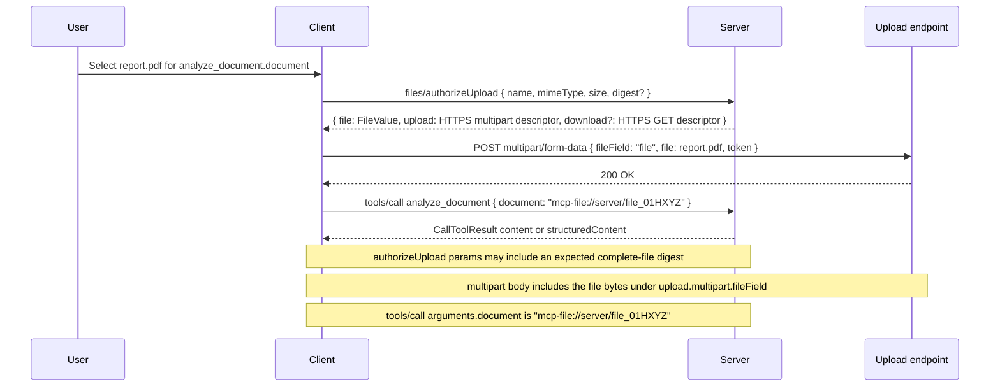

<div className="flex items-center gap-2 mb-4">
  <Badge color="gray" shape="pill">
    Draft
  </Badge>
  <Badge color="gray" shape="pill">
    Standards Track
  </Badge>
</div>

| Field         | Value                                                                           |
| ------------- | ------------------------------------------------------------------------------- |
| **SEP**       | 2631                                                                            |
| **Title**     | File Objects and Transfer                                                       |
| **Status**    | Draft                                                                           |
| **Type**      | Standards Track                                                                 |
| **Created**   | 2026-04-20                                                                      |
| **Author(s)** | Casey Chow ([@caseychow](https://github.com/caseychow))                         |
| **Sponsor**   | None                                                                            |
| **PR**        | [#2631](https://github.com/modelcontextprotocol/modelcontextprotocol/pull/2631) |

---

## Abstract

This SEP extends [SEP-2356](https://github.com/modelcontextprotocol/modelcontextprotocol/pull/2356)
with out-of-band file transfer and generated file outputs. SEP-2356 defines
`x-mcp-file`, an inline JSON Schema extension keyword for declaring file-valued fields,
and uses URI strings, including RFC 2397 `data:` URIs, as the baseline input value while
keeping URL-mode elicitation as the complementary path for server-controlled large-file
flows. This SEP adds file-transfer URIs, capability negotiation for transfer modes, and
control-plane methods for preparing uploads and resolving downloads. It also defines
content integrity metadata for transferred files.

Under this proposal, clients can still satisfy SEP-2356 file inputs with `data:` URIs.
When inline transfer is undesirable, clients can instead prepare an upload, receive a
file URI, upload bytes out of band, and pass that file URI string in the same file-valued
tool argument or elicitation response field. Servers can also return file URI metadata in
tool results or resource reads so generated artifacts can be downloaded without forcing
bytes through JSON-RPC.

## Motivation

MCP currently has partial building blocks for file-like workflows, but no clean,
standardized end-to-end story for "the user gives a file to a tool" or "a tool returns a
file to the user":

- `resources/read` and `ContentBlock` support server-to-client retrieval patterns, but
  they do not define an out-of-band file transfer path for large or sensitive content.
- SEP-2356 defines declarative file inputs and inline `data:` URI values, but not
  upload negotiation, generated file outputs, or download resolution.
- Tool arguments are arbitrary JSON, which has led implementations toward ad hoc file
  parameter conventions, hosted-storage handles, or inline `base64`.

This gap creates several ecosystem problems:

- File upload contracts differ between clients, gateways, and servers.
- Inline `base64` becomes the de facto fallback, even for large or sensitive files.
- User experience depends on harness-specific argument rewriting rather than protocol
  semantics.
- Server authors cannot reliably declare "this tool takes a file" in a way that works
  across local and hosted environments.

The design target for this SEP is a minimal interoperable baseline:

- A server can use SEP-2356 declarations to identify file-valued tool arguments and
  elicitation fields.
- A client can supply those files either as inline `data:` URIs or as negotiated file
  URI strings.
- A server can return a file in a result without forcing bytes into the model-visible
  contract.

## Goals

### File Input/Output Declaration and Representation

- Reuse SEP-2356 `x-mcp-file` declarations for file-valued tool and elicitation inputs.
- Extend the SEP-2356 URI-string input contract with out-of-band file URI values.
- Standardize the representation of file-valued outputs so generated or transformed
  artifacts can be downloaded, opened, saved, or reused predictably.
- Keep file identity and metadata in the JSON-RPC control plane while allowing file
  bytes to move through a separate transfer path.

### File Transfer Mechanism Negotiation

- Standardize file upload and download in a way that supports both SEP-2356 inline
  `data:` URI values and negotiated out-of-band HTTP upload, including multipart form
  uploads.
- Allow both inline `data:` URI transfer and out-of-band HTTP transfer as interoperable
  options, with per-input transfer mode control when a server needs to require one.
- Verify optional content integrity metadata for uploaded or downloaded files when it is
  provided.

### Non-Functional

- Preserve compatibility with stateless MCP directions under discussion, especially
  work to remove mandatory initialization/session coupling and to support multi
  round-trip request flows without assuming long-lived server-side session state. This
  goal is aligned with [SEP-2575](https://github.com/modelcontextprotocol/modelcontextprotocol/pull/2575)
  and [SEP-2322](https://github.com/modelcontextprotocol/modelcontextprotocol/pull/2322).
- Support file exchange in hosted, browser-based, local, and gateway-mediated
  environments.
- Preserve compatibility with existing MCP primitives such as `tools/call`,
  `elicitation/create`, `resources/read`, and `ResourceLink` where they are useful.
- Avoid requiring any specific backing store, filesystem model, upload service, or
  deployment topology.

## Non-Goals

- Making inline `base64` transport the primary protocol contract for files.
- Standardizing one universal storage backend, object store, or artifact service.
- Solving every artifact lifecycle concern in v1, such as retention, version history,
  sharing, or cross-session persistence semantics.

## Specification

### 1. Design Principles

This SEP defines the following principles:

1. Generic MCP file support **MUST** work across hosted, browser-based, local, and
   gateway-mediated environments.
2. File-valued inputs **MUST** preserve SEP-2356's URI-string value contract.
3. Clients **MAY** source files from local filesystems, browser uploads, app-owned
   storage, cloud drives, or any other user-mediated surface.
4. File collection **SHOULD** happen before the main request is sent when practical, while
   preserving URL-mode elicitation as a fallback when inline or negotiated upload is not
   appropriate.
5. File-valued inputs **SHOULD** be declared through SEP-2356 `x-mcp-file` annotations
   on URI string schema properties.
6. A usable file URI **MUST** identify one immutable byte sequence for its usable
   lifetime. Changed bytes require a new file URI.

### 2. Capabilities

Clients that support out-of-band file transfer declare a new `files` capability during
initialization:

```json
{
  "capabilities": {
    "files": {
      "upload": true,
      "download": true,
      "transports": ["https"]
    }
  }
}
```

Capability fields:

- `upload`: the client can upload file bytes out-of-band and use file URI values for
  SEP-2356 file-valued inputs.
- `download`: the client can download file-valued outputs out-of-band.
- `transports`: supported out-of-band transport families. This SEP initially defines
  `https`, including multipart form uploads.

### 3. Existing and New Shapes

This proposal intentionally reuses existing MCP envelopes where they already define the
right protocol surface:

- `tools/call` continues to carry tool arguments in `params.arguments`.
- `CallToolResult.content` continues to use `ContentBlock[]`.
- `structuredContent` remains the structured tool-result channel.
- `resources/read` continues to return resource contents keyed by resource `uri`.
- `elicitation/create` form mode continues to use `requestedSchema` and form response
  content.

SEP-2356 defines this input declaration shape, which this SEP reuses:

- `x-mcp-file`: an inline JSON Schema extension keyword whose value is a
  `FileInputDescriptor`.

This SEP adds new file-transfer and output shapes and threads them through existing
surfaces:

- file URI strings: an out-of-band value mode for SEP-2356 `x-mcp-file` fields.
- `FileValue`: metadata for generated or returned files identified by file URI.
- `FileDigest`: content integrity metadata for a complete file byte sequence.
- `AuthorizedFile`: a shared parent result shape for `files/authorize*` methods that
  carries a `FileValue` plus an optional eager download authorization.
- `FileContent`: a new `ContentBlock` variant that wraps a `FileValue`.
- `FileResourceContents`: a new `resources/read` resource-content variant for
  file-backed resources.
- `FileTransferDescriptor`: the upload/download descriptor for the out-of-band data
  plane.
- `files/authorizeUpload` and `files/authorizeDownload`: control-plane methods for resolving
  upload and download transfer descriptors.

### 4. File Input Values and File Outputs

SEP-2356 file inputs remain URI strings. A file-valued tool argument or elicitation
response field contains either:

- a `data:` URI as defined by SEP-2356; or
- a file URI prepared through `files/authorizeUpload`.

Inline input continues to use SEP-2356's RFC 2397 `data:` URI form:

```json
"data:text/plain;base64,SGVsbG8gd29ybGQh"
```

Out-of-band input uses a file URI string:

```json
"mcp-file://server/file_01HXYZ"
```

For generated files and file content blocks, this SEP introduces `FileValue`: file URI
plus optional display and integrity metadata.

```json
{
  "uri": "mcp-file://server/file_01HYZA",
  "name": "report.pdf",
  "mimeType": "application/pdf",
  "size": 248123,
  "digest": {
    "algorithm": "sha-256",
    "value": "uU0nuZNNPgilLlLX2n2r-sSE7-N6U4D6ZVe-_rYh2sU"
  }
}
```

`files/authorize*` methods return an `AuthorizedFile` parent shape that carries the
stable `FileValue` in parallel with any eager download authorization:

```json
{
  "file": {
    "uri": "mcp-file://server/file_01HYZA",
    "name": "report.pdf",
    "mimeType": "application/pdf",
    "size": 248123,
    "digest": {
      "algorithm": "sha-256",
      "value": "uU0nuZNNPgilLlLX2n2r-sSE7-N6U4D6ZVe-_rYh2sU"
    }
  },
  "download": {
    "transport": "https",
    "method": "GET",
    "url": "https://download.example.com/...",
    "expiresAt": "2026-04-20T18:45:00Z"
  }
}
```

The `uri` identifies a file handle, but does not imply the file is available via
`resources/read`.

#### URI Namespaces

This SEP uses URIs for both resources and files, but they have different resolution
contracts.

A resource URI identifies resource contents and is resolved through `resources/read`. A
file URI identifies a file transfer handle and is resolved through `files/authorizeDownload`,
or through the upload descriptor returned by `files/authorizeUpload`.

Implementations **SHOULD** use distinct URI schemes or authorities for resource URIs and
file URIs. Examples in this SEP use `mcp-resource:` for resource URIs and `mcp-file:`
for file URIs.

Clients **MUST NOT** assume that a file URI can be passed to `resources/read`. Servers
**MUST NOT** require clients to treat file URIs as resources.

Rules:

- Inline input transfer **MUST** use SEP-2356 `data:` URIs.
- Out-of-band input transfer **MUST** use file URI strings prepared through
  `files/authorizeUpload`.
- Clients **MAY** decide whether to send a file as a `data:` URI or via out-of-band
  upload when the field's `transferModes` is omitted.
- Clients **MUST** use one of the listed modes when `transferModes` is present.
- Clients **MUST** use a `data:` URI when `transferModes` is `["inline"]`.
- Clients **MUST** use `files/authorizeUpload` and send the returned file URI when
  `transferModes` is `["upload"]`.
- Servers that returned a file URI from `files/authorizeUpload` **MUST** accept that URI in
  an `x-mcp-file` field where they would otherwise accept a `data:` URI, subject to the
  same declared `accept` and `maxSize` constraints.
- Servers **MUST** validate and either accept or reject file URI values using their normal
  request validation rules.

In pseudocode:

```ts
type FileInputValue = string; // data: URI or file URI

interface FileValue {
  uri: string;
  name?: string;
  mimeType?: string;
  size?: number;
  digest?: FileDigest;
}

interface FileDigest {
  algorithm: string;
  value: string; // base64url without padding
}

interface AuthorizedFile {
  file: FileValue;
  download?: FileTransferDescriptor;
}
```

Implementations that produce or verify digests **MUST** support `sha-256`. A digest
describes the complete immutable byte sequence identified by the file URI.

### 5. Declaring File-Valued Inputs

Tools and elicitation forms declare file-valued fields using SEP-2356's `x-mcp-file`
keyword on URI string schema properties. The keyword identifies which schema properties
should be treated as file inputs while preserving the value shape as a URI string.

A tool with a single file input can be declared as:

```json
{
  "name": "analyze_document",
  "inputSchema": {
    "type": "object",
    "properties": {
      "document": {
        "type": "string",
        "format": "uri",
        "description": "The document to analyze.",
        "x-mcp-file": {
          "accept": ["application/pdf"],
          "maxSize": 10485760,
          "transferModes": ["inline", "upload"]
        }
      }
    },
    "required": ["document"]
  }
}
```

For multiple files:

```json
{
  "name": "compare_documents",
  "inputSchema": {
    "type": "object",
    "properties": {
      "documents": {
        "type": "array",
        "items": {
          "type": "string",
          "format": "uri",
          "x-mcp-file": {
            "accept": ["application/pdf", "text/plain"],
            "maxSize": 10485760,
            "transferModes": ["upload"]
          }
        },
        "minItems": 2
      }
    },
    "required": ["documents"]
  }
}
```

Elicitation requests use the same descriptor shape:

```json
{
  "method": "elicitation/create",
  "params": {
    "mode": "form",
    "message": "Select a document to analyze.",
    "requestedSchema": {
      "type": "object",
      "properties": {
        "document": {
          "type": "string",
          "format": "uri",
          "title": "Document",
          "x-mcp-file": {
            "accept": ["application/pdf"],
            "maxSize": 10485760,
            "transferModes": ["inline", "upload"]
          }
        }
      },
      "required": ["document"]
    }
  }
}
```

This SEP supports elicitation by allowing the eventual value for an `x-mcp-file` field to
be either a SEP-2356 `data:` URI or, when out-of-band transfer is used, a file URI
prepared through `files/authorizeUpload`. It does not add a new elicitation mode or change
the surrounding elicitation control flow.

`x-mcp-file` **MUST** appear only where SEP-2356 allows it: on a URI string schema
property. On the tool surface, array items can carry `x-mcp-file` because
`Tool.inputSchema` is general JSON Schema. On the elicitation surface, file inputs are
single URI string fields unless the elicitation schema is separately extended to support
arrays.

File input descriptors MAY include:

- `accept`: a list of MIME types or dot-prefixed file extensions. As in SEP-2356,
  extension entries are picker hints only; server-side validation compares the media type
  portion of the submitted URI value.
- `maxSize`: maximum accepted size in bytes for each individual file. For inline `data:`
  URI values this is the decoded byte size; for file URI values this is the uploaded file
  byte size enforced during upload negotiation and subsequent request validation.
- `transferModes`: optional list of allowed transfer modes for the field. If omitted,
  the client can choose any supported mode. `"inline"` allows a `data:` URI. `"upload"`
  allows `files/authorizeUpload` and a file URI.

As in the latest SEP-2356 draft, filenames are not carried in a `name=` parameter on the
`data:` URI. Servers that need the original filename **SHOULD** declare a separate string
field for it.

Clients that do not support any allowed transfer mode **MUST** reject tools or
elicitation requests that require file-valued fields unless another interoperable
non-file path is available.

### 6. Upload Negotiation

When a client chooses out-of-band transfer for a file in `tools/call` or elicitation, it
calls `files/authorizeUpload`. The client **SHOULD** include the expected digest when it
already knows it:

```json
{
  "jsonrpc": "2.0",
  "id": 10,
  "method": "files/authorizeUpload",
  "params": {
    "name": "report.pdf",
    "mimeType": "application/pdf",
    "size": 248123,
    "digest": {
      "algorithm": "sha-256",
      "value": "uU0nuZNNPgilLlLX2n2r-sSE7-N6U4D6ZVe-_rYh2sU"
    }
  }
}
```

The server responds with an upload authorization:

```json
{
  "jsonrpc": "2.0",
  "id": 10,
  "result": {
    "file": {
      "uri": "mcp-file://server/file_01HXYZ",
      "name": "report.pdf",
      "mimeType": "application/pdf",
      "size": 248123,
      "digest": {
        "algorithm": "sha-256",
        "value": "uU0nuZNNPgilLlLX2n2r-sSE7-N6U4D6ZVe-_rYh2sU"
      }
    },
    "upload": {
      "transport": "https",
      "method": "POST",
      "url": "https://upload.example.com/...",
      "headers": {
        "Content-Type": "multipart/form-data"
      },
      "multipart": {
        "fileField": "file",
        "fields": {
          "token": "abc123"
        }
      },
      "expiresAt": "2026-04-20T18:30:00Z"
    }
  }
}
```

The client uploads bytes out-of-band using the provided descriptor, then passes the
returned file URI string in `tools/call` or the elicitation result. When a digest was
provided during authorization, the server **MUST** reject a completed upload whose bytes
do not match it. If the server returns a `digest` in the `file` metadata, that digest is
authoritative for the resulting file URI.

If inline transfer is allowed and used instead, the client **MAY** skip
`files/authorizeUpload` and send a SEP-2356 `data:` URI string. If the field declares
`transferModes: ["upload"]`, the client **MUST NOT** use this inline shortcut.

#### Tool Call Upload Lifecycle

The full out-of-band upload lifecycle for a tool call is:



### 7. Tool Invocation with Files

After upload preparation, clients pass file URI strings in SEP-2356 file-valued
`tools/call` arguments:

```json
{
  "jsonrpc": "2.0",
  "id": 11,
  "method": "tools/call",
  "params": {
    "name": "analyze_document",
    "arguments": {
      "document": "mcp-file://server/file_01HXYZ"
    }
  }
}
```

Servers **MUST** treat file arguments as URI strings whose file URI values are resolved
through the upload contract, not as local filesystem paths or storage-specific handles.

### 8. File Outputs

Tool results may return `FileValue` objects in either `structuredContent` or a new
`content` item of type `file`:

```json
{
  "type": "file",
  "file": {
    "uri": "mcp-file://server/file_01HYZA",
    "name": "annotated-report.pdf",
    "mimeType": "application/pdf",
    "size": 252001,
    "digest": {
      "algorithm": "sha-256",
      "value": "g_o9GvJ2c3BIHqS_oQYV-a8bW4FSYd9_gF9Eav8F8BA"
    }
  }
}
```

Clients **MUST** verify the received byte count and digest when those values are present
on a file they download.

Clients authorize generated files for download through `files/authorizeDownload`:

```json
{
  "jsonrpc": "2.0",
  "id": 12,
  "method": "files/authorizeDownload",
  "params": {
    "uri": "mcp-file://server/file_01HYZA"
  }
}
```

The server responds with an `AuthorizedFile` that includes the stable file reference and a
download descriptor in parallel:

```json
{
  "jsonrpc": "2.0",
  "id": 12,
  "result": {
    "file": {
      "uri": "mcp-file://server/file_01HYZA",
      "name": "annotated-report.pdf",
      "mimeType": "application/pdf",
      "size": 252001,
      "digest": {
        "algorithm": "sha-256",
        "value": "g_o9GvJ2c3BIHqS_oQYV-a8bW4FSYd9_gF9Eav8F8BA"
      }
    },
    "download": {
      "transport": "https",
      "method": "GET",
      "url": "https://download.example.com/...",
      "expiresAt": "2026-04-20T18:45:00Z"
    }
  }
}
```

This method is the standard way to resolve generated files and the canonical refresh path
for eager download authorizations. Servers **MAY** also return `ResourceLink` objects
for resource-oriented workflows, but file output interoperability defined by this SEP
**MUST NOT** require `resources/read`. The optional resource-read integration in the next
section is only for resources whose contents are file-backed; it is not required for
tool-result file outputs.

File URI lifetime is server-defined. This SEP does not define how long a file URI
remains resolvable, whether a URI can be resolved more than once, or whether file URIs
are scoped to a request, task, session, user, or server. Servers
**MUST** reject expired, unauthorized, or unknown file URIs with an appropriate
JSON-RPC error. Clients **MUST** treat file URIs and eager download authorizations as
revocable and be prepared for `files/authorizeDownload` to fail even if the URI or a
previous download descriptor was previously returned by the server.

### 9. Resource Reads

`resources/read` keeps its existing `TextResourceContents` and `BlobResourceContents`
shapes. This SEP adds an optional `FileResourceContents` variant for resources whose
bytes should be transferred out-of-band:

```json
{
  "uri": "mcp-resource://reports/monthly.pdf",
  "mimeType": "application/pdf",
  "content": {
    "uri": "mcp-file://server/file_01HYZA"
  }
}
```

Clients resolve file-backed resource contents through `files/authorizeDownload` in the same
way they resolve generated file outputs from tool calls. This avoids requiring large or
sensitive resource bytes to be returned inline through JSON-RPC.

### 10. Error Handling

Implementations **SHOULD** use standard JSON-RPC errors with the following guidance:

- `-32601` when `files/authorizeUpload` or `files/authorizeDownload` is not supported.
- `-32602` when a file URI is malformed or violates declared constraints such as
  `accept` or `maxSize`.
- `-32603` for internal failures resolving upload or download descriptors.

Servers **SHOULD** distinguish digest mismatches from other upload validation failures
when they reject an authorized upload whose bytes do not match the declared digest.

Servers **SHOULD** include machine-readable details when rejecting a file, such as:

```json
{
  "reason": "maxSizeExceeded",
  "maxSize": 10485760,
  "actualSize": 24812345
}
```

## Rationale

### Why Reuse `x-mcp-file`

SEP-2356 moved file input declaration into the schema through `x-mcp-file`, an
`x-mcp-*` extension keyword on URI string fields. This SEP follows that model rather
than introducing a second declaration channel.

File transfer does not need to change which argument is file-valued. It only broadens
the URI values that may satisfy that field. A SEP-2356-only client sends a `data:` URI;
a client that also supports this SEP may send a server-issued file URI after
`files/authorizeUpload`.

Keeping declaration in `x-mcp-file` also avoids drift between parallel declaration
channels. The file affordance, file selection constraints, and value schema remain
visible at the same point in the input schema, while this SEP focuses on transfer
mechanics.

### Why Amend `maxSize`

SEP-2356 introduced `maxSize` for the decoded size of inline `data:` values. Once an
`x-mcp-file` field can also be satisfied by a prepared file URI, the same limit should
remain the server's declared per-file acceptance limit rather than becoming an
inline-only hint.

For `data:` URI values, implementations compare `maxSize` against decoded bytes. For
file URI values, servers enforce the same limit during upload negotiation and when
validating the eventual `tools/call` argument or elicitation response.

### Why Add `transferModes`

Letting the client choose the transfer mode is useful for many inputs, but not all of
them. Some servers need to require out-of-band upload to avoid large inline payloads,
accidental transcript or log exposure, or harness behavior that rewrites file inputs into
base64. Other servers may prefer inline `data:` URIs for small, lightweight files where
an upload negotiation round trip would be unnecessary.

`transferModes` keeps that policy with the file input declaration. Omitting it preserves
client choice; listing one or more modes lets a server constrain the value shape it can
safely and efficiently handle while leaving room for future transfer modes.

This remains compatible with SEP-2356's host-side rules for inline values, including the
case where a host chooses to forward a model-supplied `data:` URI verbatim under its
existing approval policy.

### Why URI Strings, Not `FileValue`, for Inputs

Using URI strings for inputs preserves SEP-2356 compatibility. A server that declares a
file input through SEP-2356 receives a URI string whether the client chose inline `data:`
transfer or out-of-band upload. This avoids a split where the same file-valued argument is
a string for SEP-2356 clients but an object for SEP-2631 clients.

For out-of-band uploads, metadata is exchanged during `files/authorizeUpload`. The server
returns a stable `FileValue` there so the client has the file reference and display
metadata, and can optionally include an eager download authorization in parallel. The
eventual `tools/call` or elicitation response only needs to carry the URI string.

### Why Separate File and Resource URI Namespaces

Resource URIs and file URIs have different resolution contracts. Resource URIs are
resolved through `resources/read`; file URIs are transfer handles resolved through
`files/authorizeDownload` or the upload descriptor returned by `files/authorizeUpload`.

Keeping those namespaces distinct prevents clients from accidentally treating a
short-lived transfer capability as a model-readable resource, and prevents servers from
requiring file-transfer implementations to expose resources only to move bytes.

### Why File Values for Outputs

Generated files often need display metadata in addition to a URI. A `FileValue` gives the
protocol a stable, model-visible output unit that can survive different backing
implementations:

- local filesystems;
- hosted upload buckets;
- application-managed artifacts;
- transient gateway handles;
- generated artifacts with display names and MIME types.

Keeping eager download authorization in a shared `AuthorizedFile` parent for the
`files/authorize*` methods preserves that separation. `FileValue` stays a stable,
transport-agnostic reference that tools and resources can return directly, while the RPC
results can expose upload and download authorizations in parallel sibling fields.

### Why Separate Control Plane from Data Plane

The main design trap is forcing both file identity and file bytes through the same JSON
payload. Splitting these concerns keeps MCP aligned with JSON-RPC control flow while
letting implementations choose practical transport mechanisms for bytes.

### Why Not Default to Elicitation

File-specific elicitation and URL-mode flows are still useful as fallback UX, but they
should not be the default path because in the common case the client can bind the file
before `tools/call`, avoiding an unnecessary extra round trip.

This SEP therefore complements, rather than replaces, SEP-2356's recommendation to use
URL-mode elicitation when the server needs a large-file or server-controlled upload flow.

### Why Standardize Download Resolution

`ResourceLink` is useful, but it is not enough by itself for generic file output. Tool
authors need a predictable answer to "how does this generated file become downloadable or
storable?" A dedicated `files/authorizeDownload` method makes that path explicit.

## Backward Compatibility

This proposal is additive.

- Existing `resources/read` text and blob resource-content shapes continue to work
  unchanged.
- Existing `ResourceLink` workflows continue to work unchanged.
- Existing tools that accept ad hoc string or object inputs for files may continue to do
  so, though they would not automatically gain interoperability from this SEP.

If adopted, implementations may gradually migrate from custom file argument conventions
to the standard SEP-2356 declaration model and file URI transfer model defined here.

## Security Implications

This SEP introduces important security considerations:

- Upload and download descriptors are bearer-style capabilities and **MUST** be scoped,
  time-limited, and transport-protected.
- Clients **MUST** not follow untrusted upload or download descriptors over insecure
  transports unless explicitly negotiated by a future SEP.
- Servers **MUST** validate MIME type, size, and file content according to their own
  policy rather than trusting client metadata.
- Clients **SHOULD** surface the source and destination context for file transfers so
  users understand where bytes are going.
- Hosts that forward a model-supplied inline `data:` URI under SEP-2356 rules **MUST NOT**
  rewrite it into a local-file upload or substitute other bytes for it.
- Inline transfer increases the risk of oversized payloads and accidental sensitive-data
  exposure in logs or transcripts; implementations **SHOULD** keep inline limits
  bounded.

## Performance Implications

The main performance impact is positive:

- large files no longer need to be encoded into inline `data:` URIs inside JSON-RPC
  messages;
- intermediaries and servers avoid parsing oversized request bodies for file content;
- clients can use storage-native upload and download paths.

This SEP does add one control-plane round trip for upload or download negotiation, but
that tradeoff is preferable to making every file transfer inline.

## Testing Plan

Conforming implementations should test at least:

- upload preparation followed by successful `tools/call` with a file URI string;
- generated file output followed by successful `files/authorizeDownload`;
- rejection of malformed file URI values;
- rejection of inline files that violate server validation or policy;
- user-driven file selection from non-filesystem sources such as browser upload surfaces.

## Alternatives Considered

### 1. Use only inline `data:` URIs

Rejected as the whole transfer story because it couples control-plane semantics to
raw-byte transport, scales poorly, and encourages large model-visible payloads. This SEP
keeps SEP-2356 `data:` URIs as the baseline representation while adding file URIs for
out-of-band transfer.

### 2. Use `resources/read` and `ResourceLink` as the entire file contract

Partially viable for server-originated outputs, and this SEP does integrate file-backed
resource contents with `resources/read`. However, these primitives are not sufficient for
client-to-server ingress. Uploads need an explicit negotiation and authorization story.

### 3. Leave file parameters entirely implementation-defined

Rejected because it preserves the current interoperability gap.

## Open Questions

- Should `files/authorizeUpload` require support for both raw-body and multipart HTTP
  uploads in v1, or allow servers to advertise only one?
- Should generated files be representable both as `file` content items and as structured
  content references, or should MCP pick only one normative result shape?
- Should future work define a first-class client-owned artifact store distinct from
  existing resource-oriented workflows?

## Related Work

- [PR #2356](https://github.com/modelcontextprotocol/modelcontextprotocol/pull/2356):
  an existing MCP proposal for declarative file inputs in tools and elicitation. This SEP
  builds on its `x-mcp-file` declaration model and URI-string input value contract by
  adding negotiated file URI transfer and generated file outputs.
- OpenAI `openai/fileParams`: prior art for declaratively identifying which tool
  parameters are file-valued. Unlike `openai/fileParams`, SEP-2356's `x-mcp-file`
  keyword is intended to be the actual MCP file-input declaration rather than an
  app-specific parameter rewriting hint.
