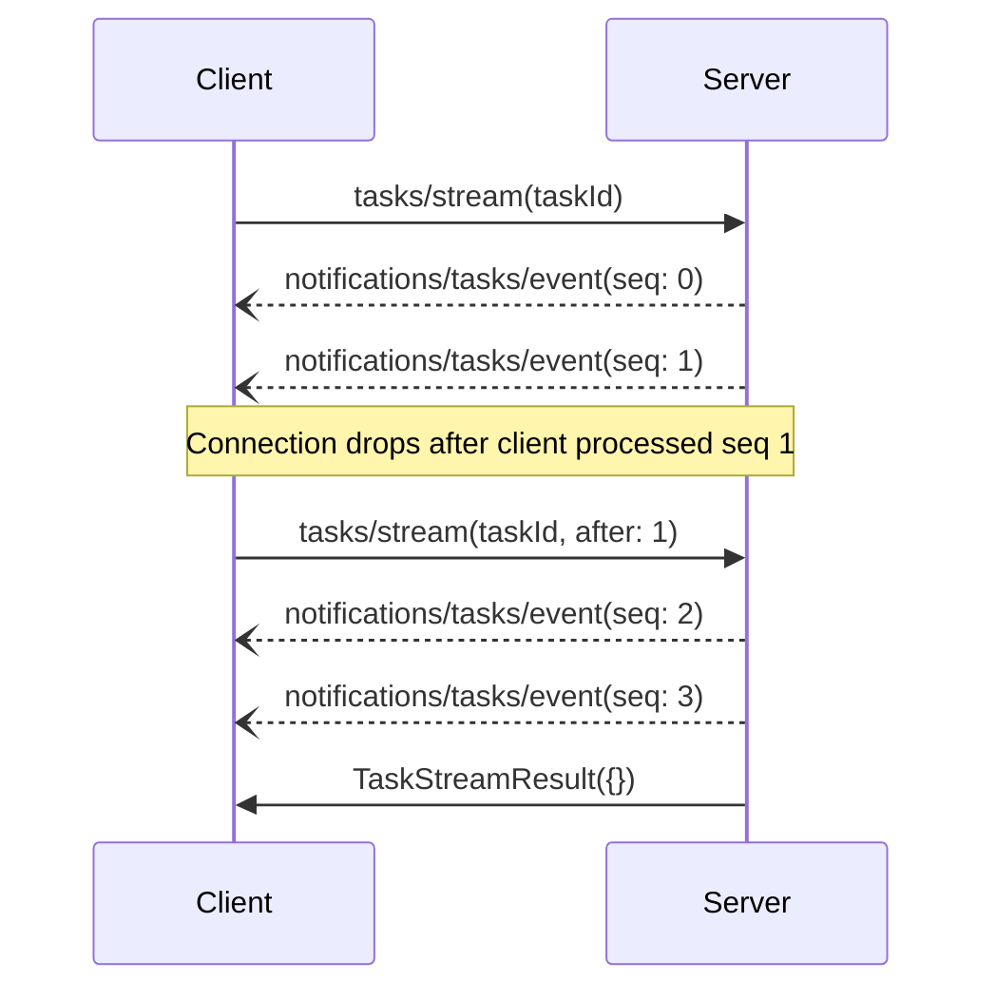

<div className="flex items-center gap-2 mb-4">
  <Badge color="gray" shape="pill">
    Draft
  </Badge>
  <Badge color="gray" shape="pill">
    Extensions Track
  </Badge>
</div>

| Field         | Value                                                                           |
| ------------- | ------------------------------------------------------------------------------- |
| **SEP**       | 2694                                                                            |
| **Title**     | Resumable Task Event Streams                                                    |
| **Status**    | Draft                                                                           |
| **Type**      | Extensions Track                                                                |
| **Created**   | 2026-05-06                                                                      |
| **Author(s)** | Ryan Nowak ([@rynowak](https://github.com/rynowak))                             |
| **Sponsor**   | None (seeking sponsor)                                                          |
| **PR**        | [#2694](https://github.com/modelcontextprotocol/modelcontextprotocol/pull/2694) |

---

## Abstract

This SEP extends MCP Tasks with a minimal, resumable event stream for long-running task execution. It defines one request, `tasks/stream`, that starts or resumes streaming for a task. The server delivers events as `notifications/tasks/event` notifications on the same connection used by that `tasks/stream` request. Each task event has a task-scoped sequence number, task ID, event type, and JSON payload.

This proposal builds on existing task work. SEP-1686 defines durable task status and result retrieval, but not an interoperable event timeline for intermediate execution. SEP-2679 proposes a focused and useful push-based partial result notification for incremental content delivery. This SEP addresses a broader task-event use case where clients need to resume from a specific stream position and receive implementation-defined event types beyond partial content. SEP-2669 proposes task interaction methods (`tasks/steer`, `tasks/pause`, and `tasks/resume`), which let clients influence running tasks but do not define a replayable task-observability channel.

Resumable task event streams make task execution observable across reconnects, late joins, agent-to-agent delegation, subagent orchestration, tool traces, artifacts, and rich execution timelines without requiring every server to invent a custom polling or notification protocol.

Two requirements distinguish this proposal from prior partial-result and streaming work:

1. **Resumability**: clients can resume after a specific task event sequence number.
2. **Extensibility**: servers can emit vendor-prefixed task event types with arbitrary JSON object payloads, including and beyond partial result content.

## Motivation

Tasks are intended to support long-running work that may outlive a single request/response cycle. For agentic workloads, the final task result is often not enough. Clients need to observe what happened while the task was running: assistant deltas, intermediate messages, tool calls, tool results, spawned subtasks, artifacts, status transitions, checkpoints, and domain-specific milestones.

Without a standard event stream, implementations choose between incomplete alternatives:

1. Send only the final `tasks/result`, losing all intermediate context and real-time UX.
2. Use `tasks/get` polling, which exposes coarse status but not a detailed execution timeline.
3. Emit ad hoc notifications that are fire-and-forget and cannot be replayed after reconnect.
4. Split observability into custom tools or resources, forcing models and host applications to learn server-specific conventions.

This is particularly limiting for agent-to-agent systems. A parent agent may delegate a task to a specialist agent, disconnect, reconnect later, and need to recover exactly what it missed. A human user may join a running task late and need the retained execution history. A client may pause or steer a task using SEP-2669's interaction methods and still need to observe the resulting status transitions, accepted feedback, and resumed work. A hosted MCP deployment may need to stream execution traces to multiple clients while enforcing explicit retention and replay limits.

### Relationship to SEP-2679

SEP-2679 proposes `notifications/tasks/partial`, with `taskId`, `content`, and an incrementing `seq`. That is a useful additive primitive for incremental output and improves real-time UX for tasks that produce partial content. This SEP is complementary: it uses the same intuition that task execution should be observable while it is running, but applies it to a replayable task event stream.

The main difference is scope. SEP-2679's `seq` supports ordering, duplicate detection, and gap detection for partial content notifications. This SEP uses the same simple sequence-number model as the resume cursor by letting the client call `tasks/stream` with `after`, which gives the server a place to replay retained events or return `events_gone`.

SEP-2679 also models each partial as `ContentBlock[]`, which is a good fit for incremental content. This SEP uses an event envelope so the same stream can also represent first-class execution events such as tool calls, tool results, subtask lifecycle changes, model usage, artifacts, checkpoints, pause/resume transitions, or vendor-specific timeline entries.

The two proposals could be aligned if SEP-2679's partial-content stream grows to address the requirements this SEP treats as necessary for many task scenarios: extensibility beyond partial content and best-effort reconnection through an explicit resume request. In that case, SEP-2679's focused partial-content payload could become one well-defined event shape carried by a more general task event stream.

This SEP can carry SEP-2679-style partial content as a prefixed, implementation-defined event in a broader task event stream:

```json
{
  "seq": 42,
  "taskId": "task-123",
  "type": "com.example.content.partial",
  "payload": {
    "content": [
      {
        "type": "text",
        "text": "partial text"
      }
    ]
  }
}
```

### Why SEP-2669 is complementary

SEP-2669 adds `tasks/steer`, `tasks/pause`, and `tasks/resume`. Those methods let clients affect task execution, but they do not define how clients observe the detailed consequences of those interactions. A task that is paused, steered, and resumed should be able to expose a replayable event timeline showing the relevant status changes and subsequent work.

This SEP does not change the semantics of SEP-2669. Instead, it provides the observability channel that lets clients reconnect, catch up, and correlate interaction methods with task execution history.

### Relationship to prior proposals

Several prior proposals explored adjacent streaming, partial-result, and resumability problems. This SEP keeps the parts that are useful for task event streams while deliberately avoiding broader changes that are not required for this proposal.

| Proposal                                                                                                                                                                                                                                         | What it proposed                                                                                                       | Relationship to this SEP                                                                                                                                                                 |
| ------------------------------------------------------------------------------------------------------------------------------------------------------------------------------------------------------------------------------------------------ | ---------------------------------------------------------------------------------------------------------------------- | ---------------------------------------------------------------------------------------------------------------------------------------------------------------------------------------- |
| [SEP-2679: Task streaming partial results](https://github.com/modelcontextprotocol/modelcontextprotocol/pull/2679)                                                                                                                               | Push `notifications/tasks/partial` with `taskId`, `ContentBlock[]`, and `seq`.                                         | This SEP builds on the value of partial content streaming by adding a client-controlled resume cursor and allowing implementations to carry equivalent payloads as prefixed task events. |
| [SEP-1905: Task Result Streaming and Immediate Result Acceptance](https://github.com/modelcontextprotocol/modelcontextprotocol/pull/1905)                                                                                                        | Adds response modes (`immediate`, `task`, `streaming`), `partial-content`, `seqNr`, and resume through `tasks/result`. | This SEP keeps the need for ordered replay, but avoids response-mode negotiation, multiple delivery mechanisms, and changes to `tasks/result`.                                           |
| [SEP-2509: task output snapshots](https://github.com/modelcontextprotocol/modelcontextprotocol/pull/2509) and [issue #2452](https://github.com/modelcontextprotocol/modelcontextprotocol/issues/2452)                                            | Pull-based `tasks/read` snapshots of in-progress output, especially logs and build/test output.                        | Snapshot reads are useful but solve a different pull use case. This SEP defines push delivery plus replay for event history.                                                             |
| [SEP-383](https://github.com/modelcontextprotocol/modelcontextprotocol/pull/383) and [SEP-776](https://github.com/modelcontextprotocol/modelcontextprotocol/pull/776)                                                                            | Partial results via progress notifications or multiple JSON-RPC responses.                                             | This SEP avoids overloading progress notifications or JSON-RPC response cardinality. Task events are explicit notifications tied to `tasks/stream`.                                      |
| [SEP-899](https://github.com/modelcontextprotocol/modelcontextprotocol/pull/899) and [SEP-925](https://github.com/modelcontextprotocol/modelcontextprotocol/pull/925)                                                                            | Generic transport-agnostic resumable streams or requests.                                                              | This SEP keeps cursor-based resume as a data-layer concern, but scopes it narrowly to task event streams.                                                                                |
| [SEP-1699](./1699-support-sse-polling-via-server-side-disconnect.md), [SEP-1858](https://github.com/modelcontextprotocol/modelcontextprotocol/pull/1858), and [SEP-2322](https://github.com/modelcontextprotocol/modelcontextprotocol/pull/2322) | Transport and multi-round-trip request flow changes for Streamable HTTP and server-to-client interactions.             | This SEP relies on same-connection delivery from a client request, aligning with request-associated message constraints rather than adding unsolicited push.                             |
| [SEP-2532: Resource Streaming](https://github.com/modelcontextprotocol/modelcontextprotocol/pull/2532)                                                                                                                                           | `resources/stream` for efficient binary resource delivery.                                                             | Binary resource transfer should remain separate. Task events may reference artifacts or resources instead of embedding large binary payloads.                                            |
| [SEP-2268: Subtasks](https://github.com/modelcontextprotocol/modelcontextprotocol/pull/2268)                                                                                                                                                     | Nested tasks with parent/child relationships and independent subtask results.                                          | Subtasks complement task event streams; subtask lifecycle can be represented as task events without requiring nested tasks for every event.                                              |

## Specification

This SEP defines two protocol messages:

| Message                     | Purpose                                                               |
| --------------------------- | --------------------------------------------------------------------- |
| `tasks/stream`              | Client request that starts or resumes streaming events for a task     |
| `notifications/tasks/event` | Server notification that delivers each task event on that same stream |

Clients that call `tasks/stream` against a receiver that does not support task event streams receive `-32601` (Method not found). If Tasks are negotiated through capabilities, implementations MAY advertise this support as an `eventStreams` sub-capability of Tasks, but the interoperable protocol surface is the `tasks/stream` method itself.

### Task Event

A task event is an immutable entry in a task's event stream.

```typescript
interface TaskEvent {
  /**
   * Monotonically increasing sequence number for this task's event stream.
   */
  seq: number;

  /**
   * The task this event belongs to.
   */
  taskId: string;

  /**
   * Event type discriminator.
   */
  type: string;

  /**
   * Event payload. The schema is defined by the event type.
   */
  payload: { [key: string]: unknown };

  /**
   * Standard MCP metadata. Task events related to a task MUST include
   * io.modelcontextprotocol/related-task with the same taskId.
   */
  _meta?: { [key: string]: unknown };
}
```

Sequence numbers are scoped to a single task. The first event in a task stream MUST use `seq: 0`, and each subsequent event for that task MUST increment by exactly 1. Servers MUST deliver events in sequence order.

Event payloads MUST be JSON objects. This SEP does not standardize event type names or payload schemas. Event type strings that are not prefixed by a vendor- or implementation-controlled namespace are reserved for future MCP standardization and MUST NOT be emitted by implementations unless defined by a future MCP standard. Implementation-defined event types MUST use a vendor-specific prefix, preferably reverse-DNS, for example `com.example.review.comment`.

### `tasks/stream`

Clients start or resume a task event stream by sending `tasks/stream`.

#### Request

```typescript
interface TaskStreamRequest {
  method: "tasks/stream";
  params: {
    /**
     * The task whose events should be streamed.
     */
    taskId: string;

    /**
     * Exclusive resume cursor. When provided, the server sends retained events
     * with seq greater than this value, then continues with live events.
     *
     * When omitted, the server starts with the earliest retained event for the
     * task, then continues with live events.
     *
     * Must be a non-negative integer.
     */
    after?: integer;
  };
}
```

#### Response

The `tasks/stream` request remains active while the stream is open. The receiver sends task events as `notifications/tasks/event` notifications on the same connection. When the receiver closes the stream normally, it returns an empty result:

```typescript
type TaskStreamResult = EmptyResult;
```

Receivers MAY close a stream before a task reaches a terminal state. Clients MAY call `tasks/stream` again using the latest fully processed sequence number as `after`.

A receiver MUST allow at most one active `tasks/stream` request per task per connection. If a client sends a second `tasks/stream` for a task that already has an active stream on the same connection, the receiver MUST return `-32602` (Invalid params). Clients that want to change the cursor SHOULD cancel the active stream first, then open a new one.

Clients cancel an active stream with the normal MCP cancellation mechanism for the `tasks/stream` request. Cancellation stops event delivery but does not cancel the underlying task. Clients that want to cancel the task itself use the task cancellation mechanism.

### `notifications/tasks/event`

Receivers deliver task events with `notifications/tasks/event`. These notifications are the delivery channel for an active `tasks/stream` request and are sent on the same connection.

```json
{
  "jsonrpc": "2.0",
  "method": "notifications/tasks/event",
  "params": {
    "seq": 42,
    "taskId": "task-123",
    "type": "com.example.content.partial",
    "payload": {
      "content": [
        {
          "type": "text",
          "text": "partial text"
        }
      ]
    },
    "_meta": {
      "io.modelcontextprotocol/related-task": {
        "taskId": "task-123"
      }
    }
  }
}
```

Receivers MUST include `io.modelcontextprotocol/related-task` metadata on task event notifications. The metadata task ID MUST match `params.taskId`.

Task event notifications that are intended to be resumable MUST be sent in response to an active `tasks/stream` request. Receivers MAY define additional best-effort notifications, but clients MUST NOT rely on unsolicited notifications for replay or resume semantics.

### Resume and Replay Semantics

The `after` parameter MUST be a non-negative integer. Receivers MUST return `-32602` (Invalid params) if `after` is negative, not an integer, or otherwise not a valid sequence number value.

When a client supplies a valid `after`, the receiver MUST do one of the following:

1. Deliver retained events with `seq` greater than the supplied value, then continue with live events. If the receiver has no retained events with `seq` greater than the supplied value and the task has reached a terminal state, the receiver MUST return `TaskStreamResult` immediately with no event notifications.
2. Return an `events_gone` error if events after the supplied sequence number are no longer retained.

If `after` is omitted, the receiver MUST start at the earliest event it still retains for the task, then continue with live events. If no events are retained and the task still exists, the receiver starts with future live events. If no events are retained and the task has reached a terminal state, the receiver MUST return `TaskStreamResult` immediately.

Receivers MUST NOT silently skip retained events after the requested cursor. If the receiver cannot provide a gap-free stream after the cursor, it MUST return `events_gone`.

Clients SHOULD persist the latest sequence number only after fully processing that event. On reconnect, clients SHOULD pass that sequence number as `after`. Clients MUST tolerate duplicate delivery after reconnect and SHOULD de-duplicate events by `(taskId, seq)`.

#### `events_gone` error

When a cursor is too old to resume, receivers return a JSON-RPC error using the implementation-defined server error range:

```json
{
  "jsonrpc": "2.0",
  "id": 10,
  "error": {
    "code": -32010,
    "message": "Task events are no longer available",
    "data": {
      "reason": "events_gone",
      "taskId": "task-123",
      "earliestSeq": 100
    }
  }
}
```

The `earliestSeq` field tells the client the oldest event the receiver still retains. Clients can use this to decide how to recover: call `tasks/stream` with `after` set to `earliestSeq - 1` to resume from the earliest retained event, or call `tasks/stream` without `after` to receive all retained events from the beginning. Clients that require a gap-free history MAY treat the gap as a fatal error and report it to the user instead of resuming.

For Streamable HTTP transports that expose stream-resume semantics through HTTP status codes, an implementation MAY map this condition to HTTP 410 at the transport layer, but the data-layer error reason remains `events_gone`.

### Event Retention

Receivers MAY impose retention limits on task events. Receivers SHOULD retain task events for at least as long as the task remains retrievable, but this SEP does not require indefinite event retention.

Receivers SHOULD document:

| Retention property      | Description                                      |
| ----------------------- | ------------------------------------------------ |
| Maximum event age       | How long events are retained after creation      |
| Maximum events per task | How many events may be retained for a task       |
| Terminal retention      | How long events remain after terminal task state |
| Payload size limits     | Maximum payload size per event                   |

Receivers MAY drop old events according to their retention policy. Once a receiver drops an event needed to resume a stream, it MUST return `events_gone` for clients that resume from before the retained range.

### Event Types

This SEP standardizes the event envelope and replay contract. Standard event type names and payload schemas are out of scope for this proposal.

Event type strings that are not prefixed by a vendor- or implementation-controlled namespace are reserved for future MCP standardization. Implementations MUST NOT emit unprefixed event types such as `content.partial`, `task.status`, or `tool.started` unless those names are defined by a future MCP standard.

Implementation-defined event types MUST use a vendor-specific prefix, preferably reverse-DNS, for example `com.example.content.partial`, `com.example.task.status`, or `com.example.review.comment`. The owner of that prefix defines the event payload schema and compatibility rules.

This keeps the base stream interoperable without prematurely standardizing an event vocabulary. The stream envelope, sequence numbers, resume cursor, and retention contract are interoperable across implementations. Event payload semantics are not — two implementations that both support `tasks/stream` can deliver and replay each other's events, but cannot interpret event payloads without shared knowledge of the vendor-prefixed event types. Future SEPs can define standard unprefixed event types or shared payload schemas once there is enough implementation experience.

### Relationship to `subscriptions/listen` (SEP-2575)

SEP-2575 introduces `subscriptions/listen` as the general-purpose mechanism for receiving notifications. Clients POST a `subscriptions/listen` request declaring which notification types they want, and the server delivers matching notifications on that stream. `subscriptions/listen` is explicitly non-resumable: if the connection drops, missed notifications are lost and the client must re-subscribe from scratch. SEP-2575 states that workloads needing durability or resumability should use the tasks primitive instead.

This SEP positions `tasks/stream` as the resumable delivery channel that `subscriptions/listen` deliberately defers to. The two serve different reliability tiers:

- **`subscriptions/listen`** delivers best-effort, fire-and-forget notifications including `notifications/tasks/status` for lightweight task status changes. No replay, no sequence numbers, no retention.
- **`tasks/stream`** delivers resumable, sequenced task event history via `notifications/tasks/event`. Clients can reconnect with `after` and catch up on missed events within the receiver's retention window.

A client that only needs to know whether a task is still running can subscribe to `notifications/tasks/status` through `subscriptions/listen`. A client that needs the full execution timeline — tool calls, intermediate results, subagent lifecycle, artifacts — opens a `tasks/stream`. Both can be active simultaneously for the same task.

This SEP does not modify `subscriptions/listen` or change how `notifications/tasks/status` is delivered. The two mechanisms are complementary: `subscriptions/listen` handles general notification fan-out, while `tasks/stream` handles task-scoped durable delivery with replay.

### Relationship to Task Status Notifications

Existing or proposed task status notifications remain useful for lightweight status updates. Task event streams provide a stronger replay contract. A receiver that emits both `notifications/tasks/status` and `notifications/tasks/event` SHOULD ensure status event entries are consistent with the task status visible through `tasks/get`.

If SEP-2669 is accepted, receivers SHOULD emit task events for externally visible pause and resume transitions when task event streams are enabled. This SEP does not require a specific payload shape for those events.

### Relationship to Progress Notifications

Existing `notifications/progress` remains the right mechanism for best-effort scalar progress on an in-progress MCP request. It is intentionally lightweight: the client supplies a `progressToken`, the receiver may send progress updates, and each update contains a numeric `progress`, optional `total`, and optional message.

Task event streams serve a different purpose. They provide a replayable task history with sequence numbers, retention semantics, and implementation-defined JSON payloads. Progress notifications do not provide a resume cursor, replay contract, retained history, arbitrary payload schemas, or late-join behavior.

This SEP does not change the semantics of `notifications/progress`. Implementations MAY continue to emit progress notifications for request-local UX, including for a `tasks/stream` request if a client supplies a `progressToken`. Such progress notifications MUST NOT be treated as task event records and do not affect task event `seq` values.

A receiver that emits both progress notifications and task event streams SHOULD keep them consistent, but they need not be one-to-one. For example, progress can report coarse completion percentage while prefixed task events describe the detailed task timeline.

### Message Flow



## Rationale

### Why client-initiated stream?

Pure unsolicited notifications cannot be resumable because the client has nowhere to provide its desired stream position. A client-initiated request gives the client an explicit cursor field and gives the server a clear point to validate retention, replay retained events, or return `events_gone`.

### Why sequence numbers?

Task event streams use sequence numbers because they are simple, deterministic, and easy for clients to validate. They let clients detect duplicate events, missing events, and out-of-order delivery without understanding any server-specific cursor format.

Clients only need two operations: persist the last processed `seq` and provide it back as `after`. Servers can still map sequence numbers to internal log offsets, database IDs, or message broker cursors privately.

### Why a generic event envelope?

`ContentBlock[]` is output-oriented and works well for partial text or content chunks. Task execution timelines also need to represent non-output events. A generic event envelope supports partial content, tool traces, artifacts, status transitions, subagent lifecycle, and implementation-specific events without requiring a protocol schema change for every new event kind.

Task event payloads are intentionally arbitrary JSON objects. Common event types can be standardized later in separate SEPs, but the core stream must allow servers to carry domain-specific data such as build phases, test results, agent planning steps, UI cards, artifact descriptors, model usage, or vendor-specific execution traces without waiting for the base protocol schema to change.

### Why not use resources?

Servers can expose task logs or traces as resources, but that is a convention rather than a task protocol. Clients would need to discover which resources are task event streams, how to correlate them with tasks, how to page through them, and how to resume from a position. A task-specific event stream standardizes those semantics directly.

### Why not rely on transport-layer resume?

Transport-layer resume can recover bytes or SSE events for a connection, but task event replay is a data-layer concern. The same task event cursor must work across transports and across reconnects where the transport session may be gone. The client wants to resume a task stream after a task event sequence number, not merely after a transport frame.

### Lessons incorporated from prior proposals

This SEP intentionally preserves several lessons from earlier work:

1. **Keep final results canonical**: as in SEP-2679, streaming events do not replace the final task result.
2. **Make resume explicit**: as in the resumable stream/request proposals, the client must have a concrete cursor it can present after reconnect.
3. **Avoid multiple JSON-RPC responses for one request**: prior partial-result proposals showed this is tempting but hard to reconcile with standard JSON-RPC clients.
4. **Do not overload progress**: progress remains useful for lightweight status, while task events carry replayable task history.
5. **Bound retention**: servers need explicit retention limits and a clear `events_gone` failure mode.
6. **Keep large binary data out of events**: resource streaming proposals show that large binary transfer needs its own mechanism; task events should reference artifacts/resources when payloads would be large.
7. **Preserve extensibility**: content-specific schemas are valuable for content events, while agent execution timelines also need an extensible envelope for non-content events. This SEP standardizes that envelope while leaving individual event type schemas to implementation-defined prefixes or future SEPs.

## Backward Compatibility

This SEP is additive.

- Existing task clients and servers continue to work unchanged.
- Servers that do not support `tasks/stream` return `-32601`.
- Clients that do not open task event streams receive no new required messages.
- Existing `tasks/get` and task lifecycle semantics are unchanged.
- SEP-2679-style partial result notifications can coexist with this SEP. Implementations may support both during migration.
- SEP-2669 task interaction methods are unchanged. This SEP only provides an optional event timeline that can describe their visible effects.

## Security Implications

Task event streams can expose detailed execution history, intermediate data, tool arguments, tool results, artifacts, and user feedback. Implementations MUST apply the same authorization checks to `tasks/stream` that they apply to `tasks/get`.

Receivers SHOULD bind task event streams to the same session, tenant, and authentication context as the task. A client that cannot access a task MUST NOT be allowed to stream its events.

Receivers SHOULD treat event payloads as untrusted data. Clients MUST NOT execute event payloads as code. Clients that render event payloads SHOULD apply the same sanitization and content-security policy they use for tool results and resources.

Receivers SHOULD enforce limits on:

| Limit                         | Reason                                     |
| ----------------------------- | ------------------------------------------ |
| Concurrent streams per client | Prevent denial of service                  |
| Event payload size            | Prevent memory and bandwidth exhaustion    |
| Event retention duration      | Limit sensitive data persistence           |
| Events retained per task      | Bound storage growth                       |
| Resume attempts               | Detect brute-force task or cursor guessing |

Receivers SHOULD avoid retaining sensitive event payloads longer than necessary. Clients SHOULD request deletion of tasks and associated event history when retained data is no longer needed.

## Open Questions

1. Should the `events_gone` error code be standardized across MCP, or is the `data.reason` field sufficient?
2. How should multiple clients streaming the same task interact with server retention policies and backpressure?
3. If SEP-2679 is accepted first, should `notifications/tasks/partial` remain a separate convenience notification alongside prefixed task events?
4. This SEP positions `tasks/stream` as complementary to `subscriptions/listen` (SEP-2575), serving a different reliability tier. An alternative design would integrate task event streaming into `subscriptions/listen` itself, for example by adding resume cursor and retention semantics to subscription streams when scoped to a specific task. Should task event streaming remain a separate `tasks/stream` request, or should it be folded into `subscriptions/listen` with task-scoped resume extensions?
