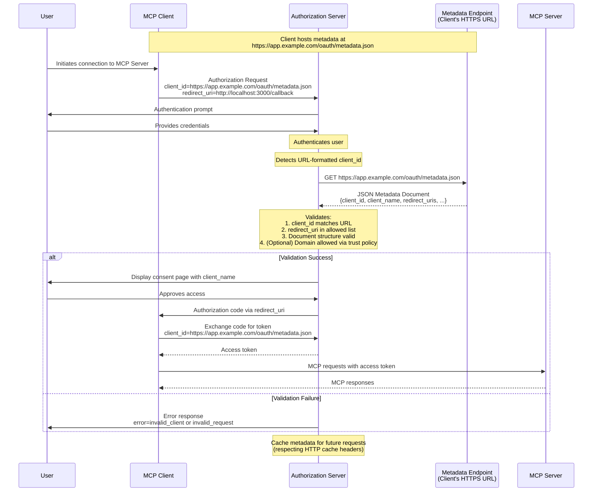

<div id="enable-section-numbers" />

MCP clients and authorization servers **SHOULD** support OAuth Client ID Metadata Documents as specified in
[OAuth Client ID Metadata Document](https://datatracker.ietf.org/doc/html/draft-ietf-oauth-client-id-metadata-document-00).
This approach enables clients to use HTTPS URLs as client identifiers, where the URL points to a JSON document
containing client metadata. This addresses the common MCP scenario where servers and clients have
no pre-existing relationship.

## Implementation Requirements

MCP implementations supporting Client ID Metadata Documents **MUST** follow the requirements specified in
[OAuth Client ID Metadata Document](https://datatracker.ietf.org/doc/html/draft-ietf-oauth-client-id-metadata-document-00).
Key requirements include:

**For MCP Clients:**

- Clients **MUST** host their metadata document at an HTTPS URL following RFC requirements
- The `client_id` URL **MUST** use the "https" scheme and contain a path component, e.g. `https://example.com/client.json`
- The metadata document **MUST** include at least the following properties: `client_id`, `client_name`, `redirect_uris`
- Clients **MUST** ensure the `client_id` value in the metadata matches the document URL exactly
- Clients **MAY** use `private_key_jwt` for client authentication (e.g., for requests to the token endpoint) with appropriate JWKS configuration as described in [Section 6.2 of Client ID Metadata Document](https://www.ietf.org/archive/id/draft-ietf-oauth-client-id-metadata-document-00.html#section-6.2)

**For Authorization Servers:**

- **SHOULD** fetch metadata documents when encountering URL-formatted client_ids
- **MUST** validate that the fetched document's `client_id` matches the URL exactly
- **SHOULD** cache metadata respecting HTTP cache headers
- **MUST** validate redirect URIs presented in an authorization request against those in the metadata document
- **MUST** validate the document structure is valid JSON and contains required fields
- **SHOULD** follow the security considerations in [Section 6 of Client ID Metadata Document](https://www.ietf.org/archive/id/draft-ietf-oauth-client-id-metadata-document-00.html#section-6)

## Example Metadata Document

```json
{
  "client_id": "https://app.example.com/oauth/client-metadata.json",
  "client_name": "Example MCP Client",
  "client_uri": "https://app.example.com",
  "logo_uri": "https://app.example.com/logo.png",
  "redirect_uris": [
    "http://127.0.0.1:3000/callback",
    "http://localhost:3000/callback"
  ],
  "grant_types": ["authorization_code"],
  "response_types": ["code"],
  "token_endpoint_auth_method": "none"
}
```

## Client ID Metadata Documents Flow

The following diagram illustrates the complete flow when using Client ID Metadata Documents:



## Discovery

Authorization servers advertise that they support clients using Client ID Metadata Documents by including the following property in their OAuth Authorization Server metadata:

```json
{
  "client_id_metadata_document_supported": true
}
```

MCP clients **SHOULD** check for this capability and **MAY** fall back to
[Dynamic Client Registration](/specification/draft/basic/authorization/dynamic-client-registration)
or pre-registration if unavailable.
