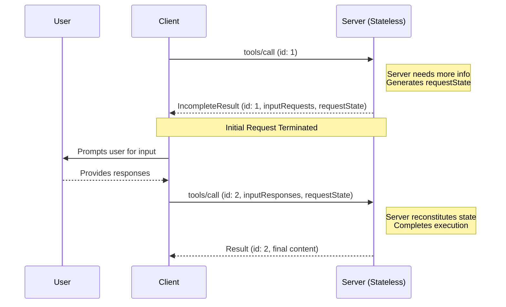
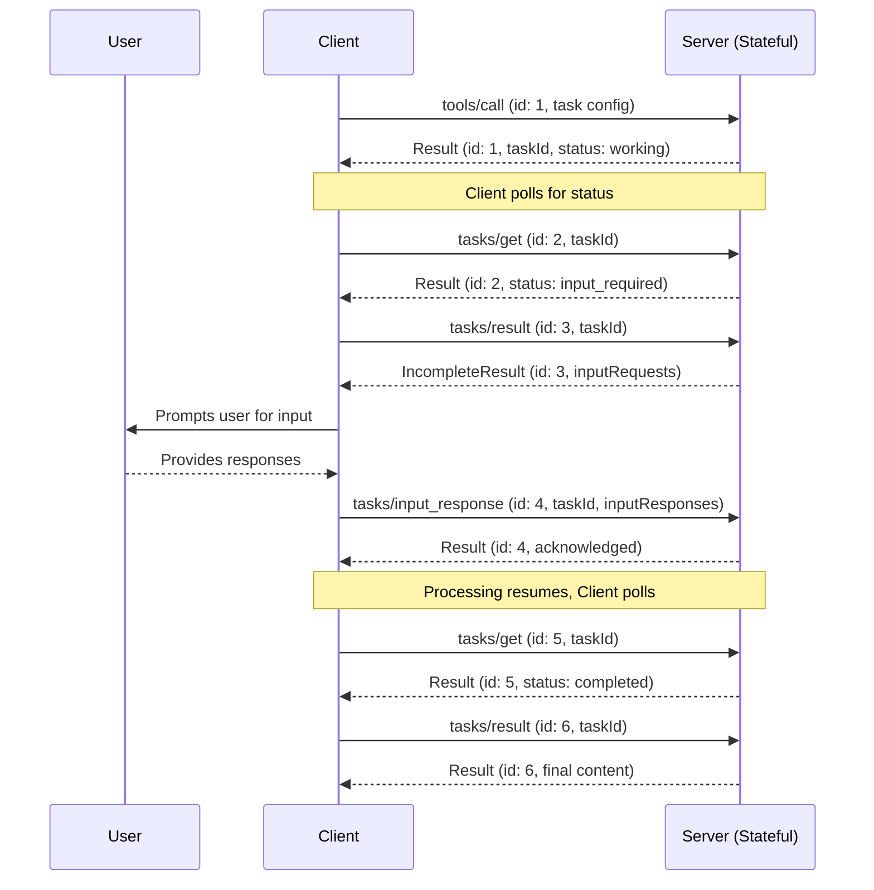

<div id="enable-section-numbers" />

The Model Context Protocol consists of several key components that work together:

- **Base Protocol**: Core JSON-RPC message types
- **Lifecycle Management**: Connection initialization, capability negotiation, and
  session control
- **Authorization**: Authentication and authorization framework for HTTP-based transports
- **Server Features**: Resources, prompts, and tools exposed by servers
- **Client Features**: Sampling and root directory lists provided by clients
- **Utilities**: Cross-cutting concerns like logging and argument completion

All implementations **MUST** support the base protocol and lifecycle management
components. Other components **MAY** be implemented based on the specific needs of the
application.

These protocol layers establish clear separation of concerns while enabling rich
interactions between clients and servers. The modular design allows implementations to
support exactly the features they need.

## Messages

All messages between MCP clients and servers **MUST** follow the
[JSON-RPC 2.0](https://www.jsonrpc.org/specification) specification. The protocol defines
these types of messages:

### Requests

[Requests](/specification/draft/schema#jsonrpcrequest) are sent from the client to the server or vice versa, to initiate an operation.

```typescript
{
  jsonrpc: "2.0";
  id: string | number;
  method: string;
  params?: {
    [key: string]: unknown;
  };
}
```

- Requests **MUST** include a string or integer ID.
- Unlike base JSON-RPC, the ID **MUST NOT** be `null`.
- The request ID **MUST NOT** have been previously used by the requestor within the same
  session.

### Responses

Responses are sent in reply to requests, containing either the result or error of the operation.

#### Result Responses

[Result responses](/specification/draft/schema#jsonrpcresultresponse) are sent when the operation completes successfully.

```typescript
{
  jsonrpc: "2.0";
  id: string | number;
  result: {
    [key: string]: unknown;
  };
  resultType: string;
}
```

- Result responses **MUST** include the same ID as the request they correspond to.
- Result responses **MUST** include a `result` field.
- The `result` **MAY** follow any JSON object structure.
- The `resultType` field **MUST** be included to indicate the type of the result. If no `resultType` is specified, "complete" should be assumed.

##### ResultType
The `resultType` field in a result response indicates the type of the result being returned. MCP supports poly-morphic result types, 
allowing servers to return different structures based on the outcome of the request. The `resultType` field is a string that clients
can use to determine how to parse and handle the `result` object.

- A `resultType` of `"complete"` the request completed successfully and the result contains the final content.
- A `resultType` of `"incomplete"` the request is incomplete and more information is needed to process the request. The result contains an `IncompleteResult` object with additional information needed.
- If `resultType` is not specified, clients **MUST** assume a default value of `"complete"` for backwards compatibility.

#### Error Responses

[Error responses](/specification/draft/schema#jsonrpcerrorresponse) are sent when the operation fails or encounters an error.

```typescript
{
  jsonrpc: "2.0";
  id?: string | number;
  error: {
    code: number;
    message: string;
    data?: unknown;
  }
}
```

- Error responses **MUST** include the same ID as the request they correspond to (except in error cases where the ID could not be read due a malformed request).
- Error responses **MUST** include an `error` field with a `code` and `message`.
- Error codes **MUST** be integers.

### Notifications

[Notifications](/specification/draft/schema#jsonrpcnotification) are sent from the client to the server or vice versa, as a one-way message.
The receiver **MUST NOT** send a response.

```typescript
{
  jsonrpc: "2.0";
  method: string;
  params?: {
    [key: string]: unknown;
  };
}
```

- Notifications **MUST NOT** include an ID.

## Auth

MCP provides an [Authorization](/specification/draft/basic/authorization) framework for use with HTTP.
Implementations using an HTTP-based transport **SHOULD** conform to this specification,
whereas implementations using STDIO transport **SHOULD NOT** follow this specification,
and instead retrieve credentials from the environment.

Additionally, clients and servers **MAY** negotiate their own custom authentication and
authorization strategies.

For further discussions and contributions to the evolution of MCP's auth mechanisms, join
us in
[GitHub Discussions](https://github.com/modelcontextprotocol/specification/discussions)
to help shape the future of the protocol!

## Schema

The full specification of the protocol is defined as a
[TypeScript schema](https://github.com/modelcontextprotocol/specification/blob/main/schema/draft/schema.ts).
This is the source of truth for all protocol messages and structures.

There is also a
[JSON Schema](https://github.com/modelcontextprotocol/specification/blob/main/schema/draft/schema.json),
which is automatically generated from the TypeScript source of truth, for use with
various automated tooling.

## JSON Schema Usage

The Model Context Protocol uses JSON Schema for validation throughout the protocol. This section clarifies how JSON Schema should be used within MCP messages.

### Schema Dialect

MCP supports JSON Schema with the following rules:

1. **Default dialect**: When a schema does not include a `$schema` field, it defaults to [JSON Schema 2020-12](https://json-schema.org/draft/2020-12/schema)
1. **Explicit dialect**: Schemas MAY include a `$schema` field to specify a different dialect
1. **Supported dialects**: Implementations MUST support at least 2020-12 and SHOULD document which additional dialects they support
1. **Recommendation**: Implementors are RECOMMENDED to use JSON Schema 2020-12.

### Example Usage

#### Default dialect (2020-12):

```json
{
  "type": "object",
  "properties": {
    "name": { "type": "string" },
    "age": { "type": "integer", "minimum": 0 }
  },
  "required": ["name"]
}
```

#### Explicit dialect (draft-07):

```json
{
  "$schema": "http://json-schema.org/draft-07/schema#",
  "type": "object",
  "properties": {
    "name": { "type": "string" },
    "age": { "type": "integer", "minimum": 0 }
  },
  "required": ["name"]
}
```

### Implementation Requirements

- Clients and servers **MUST** support JSON Schema 2020-12 for schemas without an explicit `$schema` field
- Clients and servers **MUST** validate schemas according to their declared or default dialect. They **MUST** handle unsupported dialects gracefully by returning an appropriate error indicating the dialect is not supported.
- Clients and servers **SHOULD** document which schema dialects they support

### Schema Validation

- Schemas **MUST** be valid according to their declared or default dialect

## General fields

### `_meta`

The `_meta` property/parameter is reserved by MCP to allow clients and servers
to attach additional metadata to their interactions.

Certain key names are reserved by MCP for protocol-level metadata, as specified below;
implementations MUST NOT make assumptions about values at these keys.

Additionally, definitions in the [schema](https://github.com/modelcontextprotocol/specification/blob/main/schema/draft/schema.ts)
may reserve particular names for purpose-specific metadata, as declared in those definitions.

**Key name format:** valid `_meta` key names have two segments: an optional **prefix**, and a **name**.

**Prefix:**

- If specified, MUST be a series of labels separated by dots (`.`), followed by a slash (`/`).
  - Labels MUST start with a letter and end with a letter or digit; interior characters can be letters, digits, or hyphens (`-`).
  - Implementations SHOULD use reverse DNS notation (e.g., `com.example/` rather than `example.com/`).
- Any prefix where the second label is `modelcontextprotocol` or `mcp` is **reserved** for MCP use.
  - For example: `io.modelcontextprotocol/`, `dev.mcp/`, `org.modelcontextprotocol.api/`, and `com.mcp.tools/` are all reserved.
  - However, `com.example.mcp/` is NOT reserved, as the second label is `example`.

**Name:**

- Unless empty, MUST begin and end with an alphanumeric character (`[a-z0-9A-Z]`).
- MAY contain hyphens (`-`), underscores (`_`), dots (`.`), and alphanumerics in between.

**OpenTelemetry trace context:**

As an exception to the prefix requirement above, the keys `traceparent`, `tracestate`, and
`baggage` are reserved for [OpenTelemetry](https://opentelemetry.io/) trace context propagation.
When present, their values MUST follow [W3C Trace Context](https://www.w3.org/TR/trace-context/)
and [W3C Baggage](https://www.w3.org/TR/baggage/) formats respectively.

This exception exists to maintain compatibility with existing implementations and
[OpenTelemetry semantic conventions for MCP](https://opentelemetry.io/docs/specs/semconv/gen-ai/mcp/).

Non-normative example of trace context in `_meta`:

```json
{
  "jsonrpc": "2.0",
  "id": 2,
  "method": "tools/call",
  "params": {
    "name": "get_weather",
    "arguments": {
      "location": "New York"
    },
    "_meta": {
      "traceparent": "00-0af7651916cd43dd8448eb211c80319c-00f067aa0ba902b7-01"
    }
  }
}
```

### `icons`

The `icons` property provides a standardized way for servers to expose visual identifiers for their resources, tools, prompts, and implementations. Icons enhance user interfaces by providing visual context and improving the discoverability of available functionality.

Icons are represented as an array of `Icon` objects, where each icon includes:

- `src`: A URI pointing to the icon resource (required). This can be:
  - An HTTP/HTTPS URL pointing to an image file
  - A data URI with base64-encoded image data
- `mimeType`: Optional MIME type if the server's type is missing or generic
- `sizes`: Optional array of size specifications (e.g., `["48x48"]`, `["any"]` for scalable formats like SVG, or `["48x48", "96x96"]` for multiple sizes)
- `theme`: Optional theme preference (`light` or `dark`) for the icon background

**Required MIME type support:**

Clients that support rendering icons **MUST** support at least the following MIME types:

- `image/png` - PNG images (safe, universal compatibility)
- `image/jpeg` (and `image/jpg`) - JPEG images (safe, universal compatibility)

Clients that support rendering icons **SHOULD** also support:

- `image/svg+xml` - SVG images (scalable but requires security precautions as noted below)
- `image/webp` - WebP images (modern, efficient format)

**Security considerations:**

Consumers of icon metadata **MUST** take appropriate security precautions when handling icons to prevent compromise:

- Treat icon metadata and icon bytes as untrusted inputs and defend against network, privacy, and parsing risks.
- Ensure that the icon URI is either a HTTPS or `data:` URI. Clients **MUST** reject icon URIs that use unsafe schemes and redirects, such as `javascript:`, `file:`, `ftp:`, `ws:`, or local app URI schemes.
  - Disallow scheme changes and redirects to hosts on different origins.
- Be resilient against resource exhaustion attacks stemming from oversized images, large dimensions, or excessive frames (e.g., in GIFs).
  - Consumers **MAY** set limits for image and content size.
- Fetch icons without credentials. Do not send cookies, `Authorization` headers, or client credentials.
- Verify that icon URIs are from the same origin as the server. This minimizes the risk of exposing data or tracking information to third-parties.
- Exercise caution when fetching and rendering icons as the payload **MAY** contain executable content (e.g., SVG with [embedded JavaScript](https://www.w3.org/TR/SVG11/script.html) or [extended capabilities](https://www.w3.org/TR/SVG11/extend.html)).
  - Consumers **MAY** choose to disallow specific file types or otherwise sanitize icon files before rendering.
- Validate MIME types and file contents before rendering. Treat the MIME type information as advisory. Detect content type via magic bytes; reject on mismatch or unknown types.
  - Maintain a strict allowlist of image types.

**Usage:**

Icons can be attached to:

- `Implementation`: Visual identifier for the MCP server/client implementation
- `Tool`: Visual representation of the tool's functionality
- `Prompt`: Icon to display alongside prompt templates
- `Resource`: Visual indicator for different resource types

Multiple icons can be provided to support different display contexts and resolutions. Clients should select the most appropriate icon based on their UI requirements.

## Multi Round-Trip Requests

MCP supports **multi round-trip requests**, a mechanism that allows servers to request additional information from the client (e.g., via [elicitation](/specification/draft/client/elicitation), [sampling](/specification/draft/client/sampling), or [roots](/specification/draft/client/roots)) in the context of a client-initiated request, without requiring shared server-side state or stateful load balancing.

This mechanism supports two workflows:

- **Ephemeral workflow**: The server remains stateless across round trips. State is carried by the client via opaque `requestState` tokens. This is optimized for horizontally scaled, load-balanced deployments.
- **Persistent workflow**: The server maintains state via [Tasks](/specification/draft/basic/utilities/tasks). This supports long-running operations where the server needs to accumulate state across interactions.

### Core Types

#### InputRequests

An [`InputRequests`](/specification/draft/schema#inputrequests) object is a map of server-initiated requests that the client must fulfill. Keys are server-assigned string identifiers; values are request objects (e.g., [`ElicitRequest`](/specification/draft/schema#elicitrequest), [`CreateMessageRequest`](/specification/draft/schema#createmessagerequest), or [`ListRootsRequest`](/specification/draft/schema#listrootsrequest)).

```json
{
  "github_login": {
    "method": "elicitation/create",
    "params": {
      "mode": "form",
      "message": "Please provide your GitHub username",
      "requestedSchema": {
        "type": "object",
        "properties": {
          "name": { "type": "string" }
        },
        "required": ["name"]
      }
    }
  },
  "capital_of_france": {
    "method": "sampling/createMessage",
    "params": {
      "messages": [
        {
          "role": "user",
          "content": {
            "type": "text",
            "text": "What is the capital of France?"
          }
        }
      ],
      "systemPrompt": "You are a helpful assistant.",
      "maxTokens": 100
    }
  }
}
```

#### InputResponses

An [`InputResponses`](/specification/draft/schema#inputresponses) object is a map of client responses to the server-initiated requests. Keys correspond to the keys in the `InputRequests` map; values are the client's result for each request (e.g., [`ElicitResult`](/specification/draft/schema#elicitresult), [`CreateMessageResult`](/specification/draft/schema#createmessageresult), or [`ListRootsResult`](/specification/draft/schema#listrootsresult)).

```json
{
  "github_login": {
    "action": "accept",
    "content": {
      "name": "octocat"
    }
  },
  "capital_of_france": {
    "role": "assistant",
    "content": {
      "type": "text",
      "text": "The capital of France is Paris."
    },
    "model": "claude-3-sonnet-20240307",
    "stopReason": "endTurn"
  }
}
```

#### IncompleteResult

An [`IncompleteResult`](/specification/draft/schema#incompleteresult) is a result with `resultType` set to `"incomplete"`, indicating that additional input is needed before the request can be completed. At least one of `inputRequests` or `requestState` **MUST** be present.

- `inputRequests` _(optional)_: An [`InputRequests`](/specification/draft/schema#inputrequests) map of server-initiated requests that the client must fulfill.
- `requestState` _(optional)_: An opaque string meaningful only to the server. Clients **MUST NOT** inspect, parse, modify, or make any assumptions about its contents.

### Supported Requests

Servers **MAY** send `IncompleteResult` responses on the following client requests:

| Client Request                                                                | Supports IncompleteResult |
| ----------------------------------------------------------------------------- | ------------------------- |
| [`prompts/get`](/specification/draft/server/prompts#getting-a-prompt)         | Yes                       |
| [`resources/read`](/specification/draft/server/resources#reading-resources)   | Yes                       |
| [`tools/call`](/specification/draft/server/tools#calling-tools)               | Yes                       |
| [`tasks/result`](/specification/draft/basic/utilities/tasks#retrieving-task-results) | Yes                 |

Servers **MUST NOT** send `IncompleteResult` responses on any other client requests, including but not limited to:

| Client Request              | Supports IncompleteResult |
| --------------------------- | ------------------------- |
| `ping`                      | No                        |
| `initialize`                | No                        |
| `completion/complete`       | No                        |
| `logging/setLevel`          | No                        |
| `prompts/list`              | No                        |
| `resources/list`            | No                        |
| `resources/templates/list`  | No                        |
| `resources/subscribe`       | No                        |
| `resources/unsubscribe`     | No                        |
| `tools/list`                | No                        |
| `tasks/get`                 | No                        |
| `tasks/list`                | No                        |
| `tasks/cancel`              | No                        |
| `tasks/input_response`      | No                        |

### Ephemeral Workflow

The ephemeral workflow allows servers to request additional information without maintaining any server-side state. The server encodes any needed context into the `requestState` field, which the client echoes back on retry.



The requests in each step are completely independent: the server processing the retry does not need any information beyond what is directly present in the retry request.

#### Server Requirements (Ephemeral)

1. Servers **MAY** respond to any [supported client request](#supported-requests) with an `IncompleteResult`. This response **MAY** be sent either as a standalone response or as the final message on an SSE stream. If using an SSE stream, servers **MUST NOT** send any message on the stream after the `IncompleteResult`.
1. The `IncompleteResult` **MAY** include an `inputRequests` field.
1. The `IncompleteResult` **MAY** include a `requestState` field. If specified, this field is an opaque string meaningful only to the server. Servers are free to encode the state in any format (e.g., plain JSON, base64-encoded JSON, encrypted JWT, serialized binary).
1. If a request contains a `requestState` field, servers **MUST** always validate that state, as the client is an untrusted intermediary.
   - If tampering is a concern, servers **SHOULD** encrypt the `requestState` field using an encryption algorithm of their choice (e.g., AES-GCM or a signed JWT) to ensure both confidentiality and integrity.
   - If the request state contains data specific to the original user, the server **MUST** use a mechanism to cryptographically bind the data to the original user and **MUST** verify that the `requestState` sent by the client is associated with the currently authenticated user.
   - Servers using plaintext state **MUST** treat the decoded values as untrusted input and validate them the same way they would validate any client-supplied data.

#### Client Requirements (Ephemeral)

1. If a client receives an `IncompleteResult` that contains the `inputRequests` field, the client **MUST** construct the requested input before retrying the original request. If the `IncompleteResult` does _not_ contain the `inputRequests` field, the client **MAY** retry the original request immediately.
1. If an `IncompleteResult` contains the `requestState` field, the client **MUST** echo back the exact value of that field when retrying the original request. Clients **MUST NOT** inspect, parse, modify, or make any assumptions about the `requestState` contents. If the `IncompleteResult` does not contain a `requestState` field, the client **MUST NOT** include one in the retry.
1. The JSON-RPC `id` **MUST** be different between the initial request and the retry, as they are independent requests.
1. Both the `inputRequests` and `requestState` fields affect only the client's retry of the original request. They **MUST NOT** be used for any other request that the client may be sending in parallel.

### Persistent Workflow

For long-running operations that require server-side state, the persistent workflow leverages [Tasks](/specification/draft/basic/utilities/tasks). The `input_required` task status indicates that additional information is needed.



#### Server Requirements (Persistent)

1. Servers **MAY** respond to `tasks/get` by indicating that the task is in status `input_required`.
1. Servers **MUST** include an `inputRequests` field in the `tasks/result` response when the task is in status `input_required`.

#### Client Requirements (Persistent)

1. When `tasks/get` shows status `input_required`, clients **MUST** call `tasks/result` to get the input requests.
1. Clients **SHOULD** construct the results of those requests and call [`tasks/input_response`](/specification/draft/basic/utilities/tasks#providing-input-for-tasks) with the input responses.
1. Clients **MAY** choose not to fulfill the input requests, in which case they can cancel the task.

### Transitioning Between Workflows

A tool implementation **MAY** start using the ephemeral workflow and then switch to the persistent workflow by creating a task once it has the information needed to begin processing. This avoids requiring the server to store state until it actually has enough information to start.

However, once a tool implementation returns a task, it has committed to storing state on the server side for the duration of the task. There is no way to transition back to the ephemeral workflow. All subsequent interactions **MUST** be performed via the Tasks API.

### Error Handling

Servers **SHOULD** validate that the data provided by the client is a valid `InputResponses` object and that the information inside can be correctly parsed. Protocol errors (malformed JSON, invalid schema, internal server errors) **SHOULD** return a JSON-RPC error response with an appropriate error code and message.

If additional, unexpected parameters are provided in the `InputResponses` object, the server **SHOULD** ignore any information it does not recognize or need.

If the client fails to send all the information requested in a previous `InputRequests`, and the missing information is necessary for the server to process the request, the server **SHOULD** respond with a new `IncompleteResult` requesting the missing information again, rather than returning an error.

### Security Considerations

Because `requestState` passes through the client, malicious or compromised clients could attempt to modify it to alter server behavior, bypass authorization checks, or corrupt server logic. Servers **MUST** validate request state as described in the [server requirements](#server-requirements-ephemeral) above.
