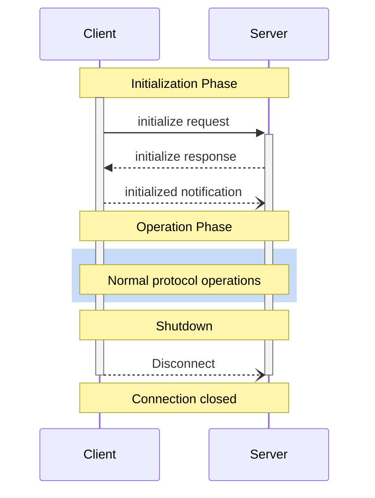

<div id="enable-section-numbers" />

<Info>**Protocol Revision**: draft</Info>

The Model Context Protocol (MCP) defines a rigorous lifecycle for client-server
connections that ensures proper capability negotiation and state management.

1. **Initialization**: Capability negotiation and protocol version agreement
2. **Operation**: Normal protocol communication
3. **Shutdown**: Graceful termination of the connection



## Lifecycle Phases

### Initialization

The initialization phase **MUST** be the first interaction between client and server.
During this phase, the client and server:

- Establish protocol version compatibility
- Exchange and negotiate capabilities
- Share implementation details

The client **MUST** initiate this phase by sending an `initialize` request containing:

- Protocol version supported
- Client capabilities
- Client implementation information

```json
{
  "jsonrpc": "2.0",
  "id": 1,
  "method": "initialize",
  "params": {
    "protocolVersion": "2024-11-05",
    "capabilities": {
      "roots": {
        "listChanged": true
      },
      "sampling": {},
      "elicitation": {}
    },
    "clientInfo": {
      "name": "ExampleClient",
      "title": "Example Client Display Name",
      "version": "1.0.0",
      "icons": [
        {
          "src": "https://example.com/icon.png",
          "mimeType": "image/png",
          "sizes": ["48x48"]
        }
      ],
      "websiteUrl": "https://example.com"
    }
  }
}
```

The server **MUST** respond with its own capabilities and information:

```json
{
  "jsonrpc": "2.0",
  "id": 1,
  "result": {
    "protocolVersion": "2024-11-05",
    "capabilities": {
      "logging": {},
      "prompts": {
        "listChanged": true
      },
      "resources": {
        "subscribe": true,
        "listChanged": true
      },
      "tools": {
        "listChanged": true
      }
    },
    "serverInfo": {
      "name": "ExampleServer",
      "title": "Example Server Display Name",
      "version": "1.0.0",
      "icons": [
        {
          "src": "https://example.com/server-icon.svg",
          "mimeType": "image/svg+xml",
          "sizes": ["any"]
        }
      ],
      "websiteUrl": "https://example.com/server"
    },
    "instructions": "Optional instructions for the client"
  }
}
```

After successful initialization, the client **MUST** send an `initialized` notification
to indicate it is ready to begin normal operations:

```json
{
  "jsonrpc": "2.0",
  "method": "notifications/initialized"
}
```

- The client **SHOULD NOT** send requests other than
  [pings](/specification/draft/basic/utilities/ping) before the server has responded to the
  `initialize` request.
- The server **SHOULD NOT** send requests other than
  [pings](/specification/draft/basic/utilities/ping) and
  [logging](/specification/draft/server/utilities/logging) before receiving the `initialized`
  notification.

#### Version Negotiation

In the `initialize` request, the client **MUST** send a protocol version it supports.
This **SHOULD** be the _latest_ version supported by the client.

If the server supports the requested protocol version, it **MUST** respond with the same
version. Otherwise, the server **MUST** respond with another protocol version it
supports. This **SHOULD** be the _latest_ version supported by the server.

If the client does not support the version in the server's response, it **SHOULD**
disconnect.

<Note>
If using HTTP, the client **MUST** include the `MCP-Protocol-Version:
<protocol-version>` HTTP header on all subsequent requests to the MCP
server.
For details, see [the Protocol Version Header section in Transports](/specification/draft/basic/transports#protocol-version-header).
</Note>

#### Capability Negotiation

Client and server capabilities establish which optional protocol features will be
available during the session.

Key capabilities include:

| Category | Capability     | Description                                                                          |
| -------- | -------------- | ------------------------------------------------------------------------------------ |
| Client   | `roots`        | Ability to provide filesystem [roots](/specification/draft/client/roots)             |
| Client   | `sampling`     | Support for LLM [sampling](/specification/draft/client/sampling) requests            |
| Client   | `elicitation`  | Support for server [elicitation](/specification/draft/client/elicitation) requests   |
| Client   | `experimental` | Describes support for non-standard experimental features                             |
| Server   | `prompts`      | Offers [prompt templates](/specification/draft/server/prompts)                       |
| Server   | `resources`    | Provides readable [resources](/specification/draft/server/resources)                 |
| Server   | `tools`        | Exposes callable [tools](/specification/draft/server/tools)                          |
| Server   | `logging`      | Emits structured [log messages](/specification/draft/server/utilities/logging)       |
| Server   | `completions`  | Supports argument [autocompletion](/specification/draft/server/utilities/completion) |
| Server   | `experimental` | Describes support for non-standard experimental features                             |

Capability objects can describe sub-capabilities like:

- `listChanged`: Support for list change notifications (for prompts, resources, and
  tools)
- `subscribe`: Support for subscribing to individual items' changes (resources only)

#### Configuration Schema Declaration

Servers can optionally declare their configuration requirements during initialization by including a `configurationSchema` field in the `InitializeResult`. This enables clients to detect and assist with missing configuration before attempting tool execution.

**Purpose**

Configuration schema declaration solves several critical usability issues:

1. **Chicken-and-egg Problem**: Clients must successfully connect to discover tools, but servers often fail to start without proper configuration
2. **Poor User Experience**: Users only discover missing configuration after connection failures with cryptic error messages
3. **Fragmented Documentation**: Configuration requirements are scattered across READMEs and error messages
4. **No Programmatic Discovery**: Clients cannot automatically detect or assist with configuration setup

**Schema Structure**

The `configurationSchema` field contains three optional arrays:

- `environmentVariables`: Environment variables needed by the server
- `arguments`: Command-line arguments required for stdio servers
- `other`: Other configuration (files, URLs, etc.)

Each parameter declaration includes:

| Field | Type | Required | Description |
|-------|------|----------|-------------|
| `name` | string | ✓ | Unique identifier (e.g., "GITHUB_TOKEN", "allowed-directory") |
| `description` | string | ✓ | Human-readable explanation of the parameter |
| `type` | string | ✓ | One of: "string", "number", "boolean", "path", "url" |
| `required` | boolean | ✓ | Whether this parameter is required |
| `sensitive` | boolean |  | Whether this contains sensitive data (passwords, API keys) |
| `default` | string\|number\|boolean |  | Default value if not provided |
| `multiple` | boolean |  | Whether multiple values are allowed |
| `pattern` | string |  | Validation regex for string parameters |
| `examples` | string[] |  | Example values to guide users |

**Example: Filesystem Server**

A filesystem server that requires directory paths as command-line arguments:

```json
{
  "protocolVersion": "2025-06-18",
  "serverInfo": {
    "name": "filesystem",
    "version": "1.0.0"
  },
  "capabilities": {},
  "configurationSchema": {
    "arguments": [
      {
        "name": "allowed-directory",
        "description": "Directory path that the server is allowed to access",
        "type": "path",
        "required": true,
        "multiple": true,
        "examples": ["/home/user/projects", "/tmp"]
      }
    ]
  }
}
```

**Example: GitHub Server**

An API-based server that requires an authentication token:

```json
{
  "protocolVersion": "2025-06-18",
  "serverInfo": {
    "name": "github",
    "version": "1.0.0"
  },
  "capabilities": {},
  "configurationSchema": {
    "environmentVariables": [
      {
        "name": "GITHUB_TOKEN",
        "description": "GitHub personal access token with repo permissions",
        "type": "string",
        "required": true,
        "sensitive": true,
        "pattern": "^ghp_[a-zA-Z0-9]{36}$"
      }
    ]
  }
}
```

**Benefits**

For **server developers**:
- Self-documenting configuration
- Better error messages from clients
- Programmatic validation

For **client developers**:
- Proactive configuration detection
- Build setup wizards and configuration tools
- Better user experience

For **end users**:
- Clear guidance on what's needed upfront
- Interactive setup assistance
- Fewer connection failures

The `configurationSchema` field is **optional** and **fully backward compatible** - servers that don't provide it continue to work as before.

### Operation

During the operation phase, the client and server exchange messages according to the
negotiated capabilities.

Both parties **MUST**:

- Respect the negotiated protocol version
- Only use capabilities that were successfully negotiated

### Shutdown

During the shutdown phase, one side (usually the client) cleanly terminates the protocol
connection. No specific shutdown messages are defined—instead, the underlying transport
mechanism should be used to signal connection termination:

#### stdio

For the stdio [transport](/specification/draft/basic/transports), the client **SHOULD** initiate
shutdown by:

1. First, closing the input stream to the child process (the server)
2. Waiting for the server to exit, or sending `SIGTERM` if the server does not exit
   within a reasonable time
3. Sending `SIGKILL` if the server does not exit within a reasonable time after `SIGTERM`

The server **MAY** initiate shutdown by closing its output stream to the client and
exiting.

#### HTTP

For HTTP [transports](/specification/draft/basic/transports), shutdown is indicated by closing the
associated HTTP connection(s).

## Timeouts

Implementations **SHOULD** establish timeouts for all sent requests, to prevent hung
connections and resource exhaustion. When the request has not received a success or error
response within the timeout period, the sender **SHOULD** issue a [cancellation
notification](/specification/draft/basic/utilities/cancellation) for that request and stop waiting for
a response.

SDKs and other middleware **SHOULD** allow these timeouts to be configured on a
per-request basis.

Implementations **MAY** choose to reset the timeout clock when receiving a [progress
notification](/specification/draft/basic/utilities/progress) corresponding to the request, as this
implies that work is actually happening. However, implementations **SHOULD** always
enforce a maximum timeout, regardless of progress notifications, to limit the impact of a
misbehaving client or server.

## Error Handling

Implementations **SHOULD** be prepared to handle these error cases:

- Protocol version mismatch
- Failure to negotiate required capabilities
- Request [timeouts](#timeouts)

Example initialization error:

```json
{
  "jsonrpc": "2.0",
  "id": 1,
  "error": {
    "code": -32602,
    "message": "Unsupported protocol version",
    "data": {
      "supported": ["2024-11-05"],
      "requested": "1.0.0"
    }
  }
}
```
