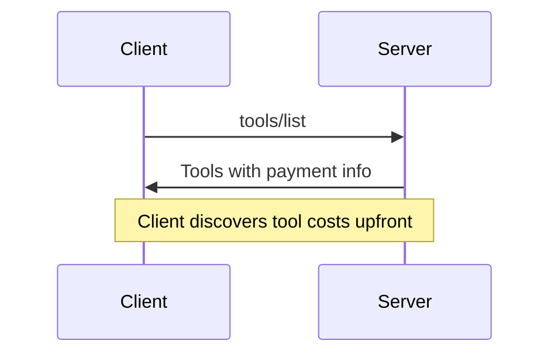
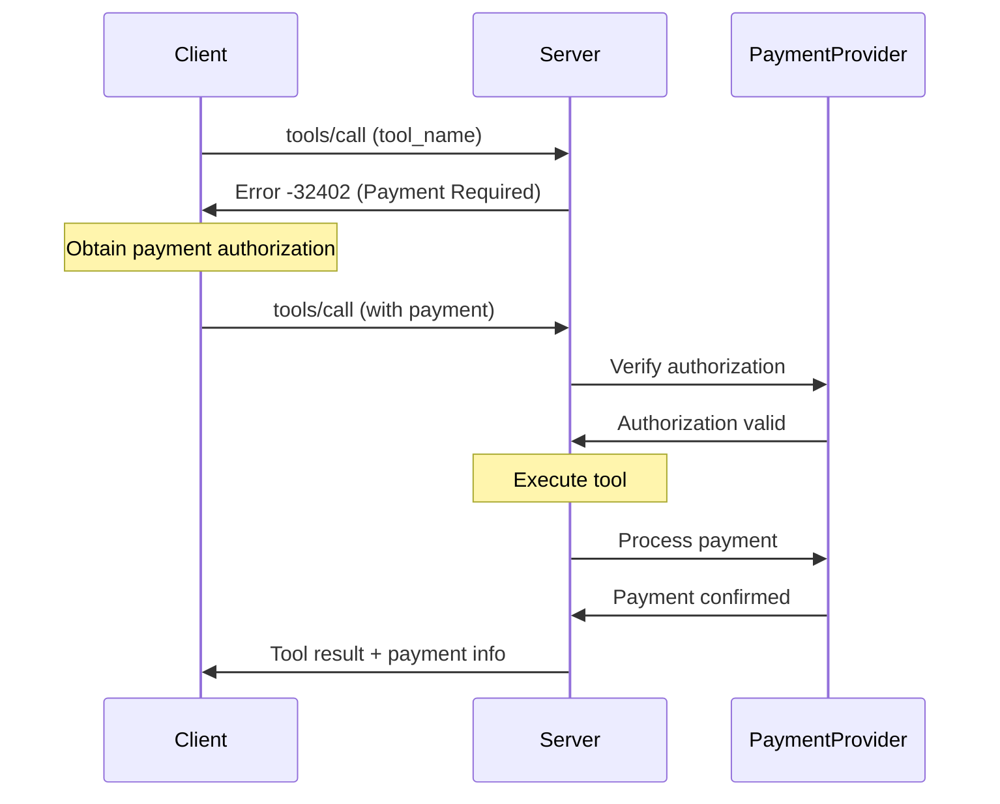
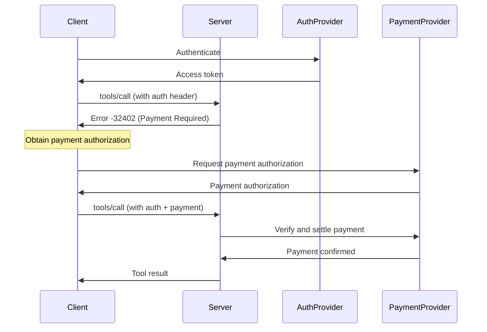

<div id="enable-section-numbers" />

<Info>**Protocol Revision**: draft</Info>

## Introduction

### Purpose and Scope

The Model Context Protocol provides payment capabilities to enable MCP servers to monetize their tools. Any tool can request payment for its invocation, allowing server developers to charge for computational resources, API access, data retrieval, or any other service provided through MCP tools. This specification defines how MCP servers handle payment requests for tool invocations using various payment protocols.

### Protocol Requirements

Payment handling is **OPTIONAL** for MCP implementations.

### Standards Compliance

This payment mechanism is based on the following specifications:

- HTTP/1.1 Status Code 402 Payment Required ([RFC 9110 Section 15.5.3](https://datatracker.ietf.org/doc/html/rfc9110#section-15.5.3))

### Supported Payment Protocols

This specification defines support for:

- **X402 Protocol v2**: Blockchain-based payment protocol ([X402 Specification v2](https://github.com/coinbase/x402/blob/main/specs/x402-specification-v2.md))

Additional payment protocols **MAY** be added in future versions.

## Overview

The MCP payment specification extends the core protocol to support:

1. **Payment Discovery**: MCP servers can advertise supported payment protocols and their capabilities
2. **Payment Challenges**: Servers can request payment using error responses for tool invocations
3. **Payment Processing**: Integration with protocol-specific payment providers for verification
4. **Tool Invocation with Payment**: Clients include payment information in tool calls using the `payment` field

## Terminology

This specification uses the following terms:

- **Payment Protocol**: A standardized method for handling payments (e.g., X402 for blockchain, traditional processors for fiat)
- **Payment Provider**: A service that verifies and processes payments according to a specific protocol (e.g., blockchain payment providers, payment gateways like Stripe, digital wallets)
- **Payment Challenge**: A server response requesting payment before tool execution, returned as error code `-32402`

## Capabilities

Servers that support payments **MAY** declare the `payment` capability during [initialization](/specification/draft/basic/lifecycle#initialization):

```json
{
  "capabilities": {
    "payment": {
      "protocols": ["x402"]
    }
  }
}
```

The `protocols` field lists the payment protocols supported by the server. Each protocol identifier corresponds to a specific payment protocol (e.g., `"x402"` for X402 Protocol v2).

Declaring the `payment` capability is **OPTIONAL**. Clients can discover payment support by examining the `payment` field in tool definitions from `tools/list`. However, declaring this capability provides clients with upfront knowledge of payment support and available protocols before fetching the full tool list.

Clients **SHOULD** check for payment support by either:

1. Checking the `payment` capability during initialization, OR
2. Examining tool definitions for the presence of `payment` fields

Servers **MUST** include payment information in tool definitions regardless of whether they declare the `payment` capability.

## Payment Discovery

### Tool-Based Payment Information

MCP servers that support payments **MUST** include payment information directly in the tool definitions returned by `tools/list`.

### Tools List with Payment Information

When a server declares the `payment` capability, tools that require payment **MUST** include a `payment` array in their definition:

**Request:**

```json
{
  "jsonrpc": "2.0",
  "id": 1,
  "method": "tools/list"
}
```

**Response:**

```json
{
  "jsonrpc": "2.0",
  "id": 1,
  "result": {
    "tools": [
      {
        "name": "get_premium_weather",
        "description": "Get detailed weather analysis with forecasts ($0.01)",
        "inputSchema": {
          "type": "object",
          "properties": {
            "location": { "type": "string" }
          },
          "required": ["location"]
        },
        "payment": [
          {
            "protocol": "x402",
            "paymentRequired": {
              /* X402 payment configuration - see X402 Payment Requirements Example below */
            }
          }
        ]
      }
    ]
  }
}
```

### Payment Option Structure

Each payment option in the `payment` array includes:

- **protocol**: Payment protocol identifier (e.g., "x402", "future_protocol")
- **paymentRequired**: Protocol-specific payment configuration
  - For X402: Contains the X402 payment requirements (x402Version, accepts array, etc.)
  - For other protocols: Protocol-specific configuration format

### Multiple Payment Options

Tools can accept multiple payment protocols by including multiple entries in the `payment` array:

```json
{
  "name": "get_premium_weather",
  "payment": [
    {
      "protocol": "protocol1",
      "paymentRequired": {
        /* protocol1-specific config */
      }
    },
    {
      "protocol": "protocol2",
      "paymentRequired": {
        /* protocol2-specific config */
      }
    }
  ]
}
```

## Message Flow

### Payment Discovery Flow



### Payment Challenge and Completion Flow



### Combined Authorization and Payment Flow



<Note>
  The payment flow is protocol-agnostic. Different payment protocols may use
  different payment providers (e.g., blockchain payment providers for crypto,
  traditional payment processors for fiat, digital wallets) and different
  authorization mechanisms, but the high-level flow remains the same.
</Note>

### Payment Protocol Extensibility

The MCP payment specification is designed to support diverse payment methods:

**Cryptocurrency Payments (e.g., X402)**:

- Blockchain-based protocols for on-chain transactions
- Smart contract interactions
- Signature-based authorization
- On-chain verification

**Fiat Currency Payments**:

- Traditional payment processors (credit cards, bank transfers)
- Digital payment platforms (PayPal, Stripe, etc.)
- OAuth-based authorization flows
- API-based confirmation

**Hybrid and Future Payment Methods**:

- Stablecoins and tokenized fiat
- Central bank digital currencies (CBDCs)
- Subscription and usage-based billing models
- Micropayment channels and layer-2 solutions

Each payment protocol defines its own:

- Authorization format in the `paymentInput` field
- Payment result information in the `paymentOutput` field
- Verification and processing procedures with payment providers
- Security and compliance requirements

The `PaymentProvider` participant in the flows above represents any payment verification and processing system, whether it's a blockchain payment provider for crypto, traditional payment gateway for fiat, or future payment infrastructure.

## Payment Challenge Flow

### Payment Required Error Response

When an MCP server requires payment for a tool invocation, it **MUST** return error code `-32402` (Payment Required). The error response **SHOULD** include the same payment information that was advertised in the tool's `payment` field from `tools/list`.

#### Tool Invocation Payment Challenge

When a client calls a tool that requires payment without providing payment authorization:

**Request:**

```json
{
  "jsonrpc": "2.0",
  "id": 1,
  "method": "tools/call",
  "params": {
    "name": "get_premium_weather",
    "arguments": {
      "location": "New York"
    }
  }
}
```

**Response:**

```json
{
  "jsonrpc": "2.0",
  "id": 1,
  "error": {
    "code": -32402,
    "message": "Payment Required",
    "data": {
      "payment": [
        {
          "protocol": "x402",
          "paymentRequired": {
            /* Same structure as in tools/list - see X402 Payment Requirements Example */
          }
        }
      ]
    }
  }
}
```

The error response includes:

- **code**: `-32402` (unique error code for payment required)
- **payment**: Array of payment options with the same structure as in `tools/list`
  - **payment[].protocol**: Indicates which payment protocol to use (e.g., "x402", "future_protocol")
  - **payment[].paymentRequired**: Protocol-specific payment information (matches the tool's `payment` field from `tools/list`)

<Note>
  The `payment` field structure in error responses is identical to the structure
  in `tools/list`. This allows clients to prepare for payment before invoking
  the tool, or handle the payment challenge if they didn't check the tool
  definition first.
</Note>

<Warning>
  **Source of Truth**: If there are any discrepancies between the payment
  amounts or requirements advertised in `tools/list` and those returned in the
  `-32402` error response, the error response **MUST** be treated as the
  authoritative source of truth. The payment information in `tools/list` is
  primarily for LLM context to help agents make informed decisions about tool
  selection, while the error response contains the actual payment requirements
  that must be satisfied for tool execution.
</Warning>

#### X402 Payment Requirements Example

For X402 protocol, the `paymentRequired` object follows the X402 specification format:

```json
{
  "x402Version": 2,
  "error": "PAYMENT-SIGNATURE header is required",
  "resource": {
    "url": "https://api.example.com/premium-data",
    "description": "Access to premium market data",
    "mimeType": "application/json"
  },
  "accepts": [
    {
      "scheme": "exact",
      "network": "eip155:84532",
      "amount": "10000",
      "asset": "0x036CbD53842c5426634e7929541eC2318f3dCF7e",
      "payTo": "0x209693Bc6afc0C5328bA36FaF03C514EF312287C",
      "maxTimeoutSeconds": 60,
      "extra": {
        "name": "USDC",
        "version": "2"
      }
    }
  ],
  "extensions": {}
}
```

This structure includes:

- **x402Version**: Protocol version (currently 2)
- **error**: Human-readable error message
- **resource**: The resource requiring payment
- **accepts**: Array of acceptable payment schemes
- **extensions**: Optional protocol extensions

## Payment Protocols

### X402 Protocol

The X402 protocol v2 is the first payment protocol supported by this specification.

**X402 v2 Overview**: X402 is an open payment standard that enables clients to pay for external resources using blockchain-based transactions. The protocol defines standardized message formats and payment flows.

For complete X402 protocol details, including:

- Payment scheme specifications (exact, deferred, etc.)
- Network-specific implementations (EVM, Solana)
- Payment Provider interface requirements
- Security considerations and replay attack prevention
- Discovery APIs and Bazaar integration

Please refer to the [X402 Protocol Specification v2](https://github.com/coinbase/x402/blob/main/specs/x402-specification-v2.md).

**MCP Integration**: When using X402 with MCP:

1. **Tool Payment Configuration**: Include X402 payment requirements in the tool's `payment` field
2. **Payment Request Structure**: Use the X402 `PaymentPayload` schema in the `payment.paymentInput.authorization` field
3. **Payment Response**: Return X402 payment result data in the `payment.paymentOutput` field

The X402 specification is the source of truth for all X402-specific structures, validation rules, and processing procedures.

### Future Payment Protocols

Additional payment protocols can be supported in future versions of this specification. This could include:

- Traditional payment processors
- Other blockchain-based payment protocols
- Digital wallet systems
- Subscription-based payment models

Each protocol will define its own structure for the `paymentInfo` field and payment authorization format.

#### Client Behavior for Unrecognized Protocols

When a client encounters a payment option with an unrecognized protocol identifier, it **SHOULD**:

1. **Skip the Unrecognized Protocol**: Continue processing other payment options in the array that it does support
2. **Fallback Handling**: If no recognized protocols are available:
   - **SHOULD NOT** attempt to invoke the tool without payment
   - **MAY** inform the user that the tool requires payment via unsupported protocols
   - **MAY** provide information about the unrecognized protocol identifiers to help users understand what's needed
3. **Forward Compatibility**: Preserve unrecognized protocol information when displaying payment requirements to users, as they may have external means to satisfy the payment

This approach ensures graceful degradation and forward compatibility as new payment protocols are introduced.

**Example**: If a tool offers `["x402", "future_protocol"]` and the client only supports `"x402"`, it should use X402. If it supports neither, it should inform the user rather than attempting the tool call.

## Client Payment Handling

### Payment Flow Steps

When an MCP client discovers a tool with payment requirements or receives a payment required error, it **SHOULD** follow these steps:

1. **Check Tool Definition**: Review the `payment` field in the tool definition from `tools/list` to understand payment requirements upfront
2. **Parse Payment Information**: Extract payment details for the selected protocol
3. **Process Payment**: Handle the selected payment method according to the specified protocol
4. **Invoke Tool with Payment**: Include payment authorization in the `payment` field when calling the tool

### Proactive Payment Handling

Clients **SHOULD** check for payment requirements before invoking a tool:

```json
// Tool definition from tools/list shows payment required
{
  "name": "get_premium_weather",
  "description": "Get detailed weather analysis ($0.01)",
  "payment": [
    {
      "protocol": "x402",
      "paymentRequired": {
        /* payment requirement */
      }
    }
  ]
}
```

When a tool has a `payment` field, clients can:

- Display the cost to the user before invocation
- Process payment proactively
- Allow LLMs to factor in costs when selecting tools

### Reactive Payment Handling

If a client invokes a tool without checking for payment requirements, the server will return a payment required error (-32402). The client should then process the payment and retry with the `payment` field.

### Payment Processing

Payment processing varies by protocol. Clients **MUST** implement protocol-specific handling based on the `protocol` field in the payment required error.

#### X402 Payment Processing

For X402 payments, clients **SHOULD**:

1. Display the payment information (address, amount, network) to the user
2. Provide QR codes for easy mobile wallet scanning
3. Handle payment according to the specific X402 scheme
4. Obtain payment authorization (signature and authorization data for the exact scheme)

#### Other Payment Protocols

Future payment protocols will define their own processing requirements and user interaction patterns.

### Payment Hook Interface

MCP clients **SHOULD** provide a payment hook interface to enable custom payment integration and allow client builders to integrate their preferred payment methods:

```typescript
type PaymentOption = {
  protocol: string;
  paymentRequired: unknown;
};

type PaymentSelection =
  | { type: "abort" }
  | { type: "select"; protocol: string };

interface PaymentHooks {
  /**
   * Called when a tool requires payment.
   * Allows selection of preferred payment protocol or aborting the operation.
   */
  onPaymentRequested(
    toolName: string,
    paymentOptions: PaymentOption[],
  ): Promise<PaymentSelection>;

  /**
   * Called when payment processing fails.
   * Allows error handling, retry logic, or fallback strategies.
   */
  onPaymentError(
    toolName: string,
    protocol: string,
    error: unknown,
  ): Promise<void>;

  /**
   * Called when payment is successfully processed.
   * Useful for audit logging, spend tracking, and analytics.
   */
  onPaymentSuccess(
    toolName: string,
    protocol: string,
    paymentResult: unknown,
  ): Promise<void>;
}
```

This hook-based approach enables:

- **Protocol Selection**: Choose between multiple payment options based on user preferences or balance
- **Error Handling**: Implement custom retry logic or fallback strategies
- **Spend Tracking**: Maintain audit logs and track total spending across tools
- **User Experience**: Provide custom UI for payment confirmation and status updates

### Tool Invocation with Payment

After payment completion, clients **MUST** include payment information in the `payment` field when retrying the tool invocation. This approach is transport-agnostic and works with HTTP, STDIO, and other transports.

#### Payment Request Structure

The `payment` field in tool call parameters includes:

- **protocol**: Payment protocol identifier (e.g., "x402")
- **paymentInput**: Protocol-specific payment authorization data
  - For X402: Contains the payment authorization with signature and transaction details
  - For other protocols: Protocol-specific authorization format

#### X402 Payment Request Example

**Request with X402 Payment:**

```json
{
  "jsonrpc": "2.0",
  "id": 1,
  "method": "tools/call",
  "params": {
    "name": "get_weather",
    "arguments": {
      "location": "New York"
    },
    "payment": {
      "protocol": "x402",
      "paymentInput": {
        "authorization": {
          "x402Version": 2,
          "resource": {
            "url": "mcp://tool/get_weather",
            "description": "Premium weather data tool",
            "mimeType": "application/json"
          },
          "accepted": {
            "scheme": "exact",
            "network": "eip155:84532",
            "amount": "10000",
            "asset": "0x036CbD53842c5426634e7929541eC2318f3dCF7e",
            "payTo": "0x209693Bc6afc0C5328bA36FaF03C514EF312287C",
            "maxTimeoutSeconds": 60,
            "extra": {
              "name": "USDC",
              "version": "2"
            }
          },
          "payload": {
            "signature": "0x2d6a7588d6acca505cbf0d9a4a227e0c52c6c34008c8e8986a1283259764173608a2ce6496642e377d6da8dbbf5836e9bd15092f9ecab05ded3d6293af148b571c",
            "authorization": {
              "from": "0x857b06519E91e3A54538791bDbb0E22373e36b66",
              "to": "0x209693Bc6afc0C5328bA36FaF03C514EF312287C",
              "value": "10000",
              "validAfter": "1740672089",
              "validBefore": "1740672154",
              "nonce": "0xf3746613c2d920b5fdabc0856f2aeb2d4f88ee6037b8cc5d04a71a4462f13480"
            }
          },
          "extensions": {}
        }
      }
    }
  }
}
```

#### Payment Response Structure

For successful tool executions with payment, servers **MAY** include a `payment` field in the result:

- **protocol**: Payment protocol identifier (matches the request)
- **paymentOutput**: Protocol-specific payment result data
  - For X402: Contains transaction details (success, transaction hash, network, payer)
  - For other protocols: Protocol-specific result format

#### X402 Payment Response Example

**Successful Response with X402 Payment:**

```json
{
  "jsonrpc": "2.0",
  "id": 1,
  "result": {
    "content": [
      {
        "type": "text",
        "text": "The current weather in New York is 72°F with clear skies."
      }
    ],
    "isError": false,
    "payment": {
      "protocol": "x402",
      "paymentOutput": {
        "result": {
          "success": true,
          "transaction": "0x1234567890abcdef1234567890abcdef1234567890abcdef1234567890abcdef",
          "network": "eip155:84532",
          "payer": "0x14cE5605DD37502755D6308Bfef5B99363327D4b"
        }
      }
    }
  }
}
```

## Server Payment Implementation

### Payment Provider Integration

MCP servers **MUST** integrate with protocol-specific payment providers for payment verification. The integration approach depends on the chosen payment protocol.

**General Integration Steps**:

1. **Provider Registration**: Register with a payment provider that supports your chosen protocol(s)
2. **Payment Challenge Generation**: Create payment challenges according to protocol specifications
3. **Payment Verification**: Verify payment completion through the provider's APIs
4. **Tool Access Control**: Grant tool access based on provider confirmation

**Protocol-Specific Examples**:

#### X402 (Blockchain) Integration

For X402 blockchain payments, servers integrate with X402-compliant payment providers:

- Register with an X402-compliant payment provider
- Use payment provider APIs to generate payment challenges with signatures
- Verify transactions through payment provider verification endpoints
- Confirm transaction hashes and payment status

#### Traditional Payment Processor Integration

For fiat currency payments, servers integrate with payment gateways:

- Register with payment processors (e.g., Stripe, PayPal, traditional banks)
- Generate payment intents or authorization requests via processor APIs
- Verify payment completion through webhook callbacks or API polling
- Confirm payment IDs and payment status

#### Future Protocol Integration

Additional payment protocols will define their own provider integration requirements based on their specific authorization and processing mechanisms.

### Payment Verification Flow

When a client includes payment information in the `payment` field:

1. **Parse Payment Data**: Extract payment details from the `payment` field according to the protocol specification
2. **Protocol Identification**: Determine which payment protocol was used from the `protocol` field
3. **Provider Verification**: Query the appropriate payment provider to verify payment completion
4. **Access Decision**: Grant or deny tool access based on provider response
5. **Tool Execution**: Execute the requested tool if payment is verified

### Payment Request Processing

Servers **MUST** parse the `payment` field according to the specific protocol used. Each protocol defines its own request structure and processing requirements.

#### X402 Payment Request Processing

For X402 payments, servers process the `payment.paymentInput.authorization` field (see [Tool Invocation with Payment](#tool-invocation-with-payment) for full example):

X402 processing steps:

- Extract payment data from `payment.paymentInput.authorization`
- Verify protocol matches "x402"
- Verify `resource` matches the tool being invoked
- Extract `accepted` payment scheme
- Verify `payload` contains valid authorization (signature, authorization data)
- Use X402 payment provider to verify payment completion
- Confirm amount and recipient match original requirements

#### Other Protocol Payment Request Processing

Future payment protocols will define their own request structures and processing requirements.

## Error Handling

### Payment Required Error (-32402)

When a tool requires payment, servers **MUST** return error code `-32402` with structured payment information:

```json
{
  "jsonrpc": "2.0",
  "id": 1,
  "error": {
    "code": -32402,
    "message": "Payment required",
    "data": {
      "payment": [
        {
          "protocol": "x402",
          "paymentRequired": {
            // Protocol-specific payment requirements
          }
        }
      ]
    }
  }
}
```

This error code is used for both:

- **Initial payment challenge**: Tool invoked without payment
- **Payment processing failed**: Payment processing failed (insufficient funds, network error, etc.)

### Resource Identification

Payment-related resources **SHOULD** use MCP-specific URI schemes for clear identification:

- **Tools**: `mcp://tool/{tool_name}`
- **Resources**: `mcp://resource/{resource_name}`
- **Prompts**: `mcp://prompt/{prompt_name}`

This provides consistent resource identification across payment contexts and enables clear audit trails.

#### MCP URI Format Semantics

The `mcp://` URI scheme is used to uniquely identify MCP resources in payment contexts. The format follows these conventions:

**Structure**: `mcp://{resource_type}/{resource_identifier}`

**Components**:

- **Scheme**: Always `mcp://` (lowercase)
- **Resource Type**: One of `tool`, `resource`, or `prompt` (lowercase)
- **Resource Identifier**: The exact name of the MCP resource as defined in the server's capabilities
  - For tools: The `name` field from the tool definition
  - For resources: The resource URI or identifier
  - For prompts: The `name` field from the prompt definition

**Properties**:

- URIs are **case-sensitive** and must match the exact resource names
- URIs are **opaque identifiers** - they do not imply network locations or retrieval mechanisms
- URIs **MUST** be stable across payment transactions for the same resource
- URIs are used for payment authorization and audit purposes, not for resource access

**Examples**:

```
mcp://tool/get_premium_weather
mcp://resource/database_access
mcp://prompt/code_review_template
```

**Usage in Payment Protocols**:

- X402 protocol uses these URIs in the `resource.url` field for payment authorization
- Payment payment providers may use these URIs for transaction tracking and verification
- Servers should include these URIs in payment-related error responses for clarity

## Security Considerations

### Payment Security

MCP implementations **MUST** follow protocol-specific security best practices:

1. **Secure Communication**: All payment communications **MUST** use HTTPS
2. **Payment Provider Trust**: Only integrate with trusted, protocol-compliant payment providers
3. **Payment Validation**: Verify all payment authorizations through the designated payment provider
4. **Audit Logging**: Log all payment transactions for security and complianceing\*\*: Maintain comprehensive logs of all payment activities

### Protocol-Specific Security Models

#### X402 Security Model

The X402 protocol provides security through:

1. **Signature Verification**: Payment schemes use signature-based verification
2. **Payment Provider Mediation**: Trusted payment providers handle payment verification
3. **Time-Limited Challenges**: Payment challenges include expiration times
4. **Scheme-Specific Security**: Each X402 scheme implements appropriate security measures

#### Other Protocol Security

Future payment protocols will define their own security models and requirements.

### Privacy Protection

Implementations **MUST** protect user privacy:

1. **Data Minimization**: Collect only necessary payment information as defined by the protocol
2. **Payment Provider Privacy**: Rely on payment provider privacy policies for payment data
3. **Local Data Handling**: Minimize local storage of payment-related information
4. **Compliance**: Follow applicable privacy regulations

## Integration with Authorization

### Combined Authorization and Payment

MCP servers **MAY** combine authorization and payment requirements. In such cases:

1. **Authentication First**: Verify user identity before requesting payment
2. **Payment Per Invocation**: Each tool call may require separate payment verification
3. **Unified Error Handling**: Provide clear error messages for both auth and payment failures

When combining OAuth with payments, clients include both authorization headers (for HTTP transport) and the `payment` field in the tool call. See [Tool Invocation with Payment](#tool-invocation-with-payment) for the payment field structure.

## Payment Response

### Payment Response Communication

After processing a payment and executing the requested tool, servers **SHOULD** include payment information in the response to provide confirmation and audit trail details.

### Payment Response Format

For successful tool executions with payment, servers **MAY** include a `payment` field in the result with protocol-specific payment data.

For X402, the response includes transaction details (see [Tool Invocation with Payment](#tool-invocation-with-payment) for full example). The `paymentOutput.result` object includes:

- **success**: Boolean indicating payment success
- **transaction**: Transaction identifier (e.g., blockchain hash)
- **network**: Network where payment was processed
- **payer**: Payment sender identifier
- **amount**, **asset**: Optional payment details
- **errorReason**: Required when success is false

Future payment protocols will define their own response structures within `payment.paymentOutput`.

## Compliance and Legal Considerations

### Protocol Compliance

MCP implementations **MUST** comply with the requirements of their chosen payment protocols:

#### X402 Protocol Compliance

For X402 implementations:

1. **Scheme Compliance**: Follow X402 specifications for supported payment schemes
2. **Payment Provider Integration**: Use only X402-compliant payment providers
3. **Protocol Versioning**: Clearly specify supported X402 protocol versions
4. **Interoperability**: Ensure compatibility with other X402 implementations

#### Other Protocol Compliance

Future payment protocols will define their own compliance requirements.

### Terms of Service

Servers offering paid tools **SHOULD** provide clear terms of service including:

1. **Pricing Information**: Clear, upfront pricing for tool access
2. **Payment Terms**: Conditions for tool access and payment requirements
3. **Service Availability**: Uptime guarantees for paid tools
4. **Protocol Compliance**: Reference to supported payment protocol compliance

## References

- [HTTP/1.1 Status Code 402](https://datatracker.ietf.org/doc/html/rfc9110#section-15.5.3)
- [X402 Protocol Specification v2](https://github.com/coinbase/x402/blob/main/specs/x402-specification-v2.md)
- [X402 Exact Scheme Specification](https://github.com/coinbase/x402/blob/main/specs/schemes/exact/scheme_exact.md)
