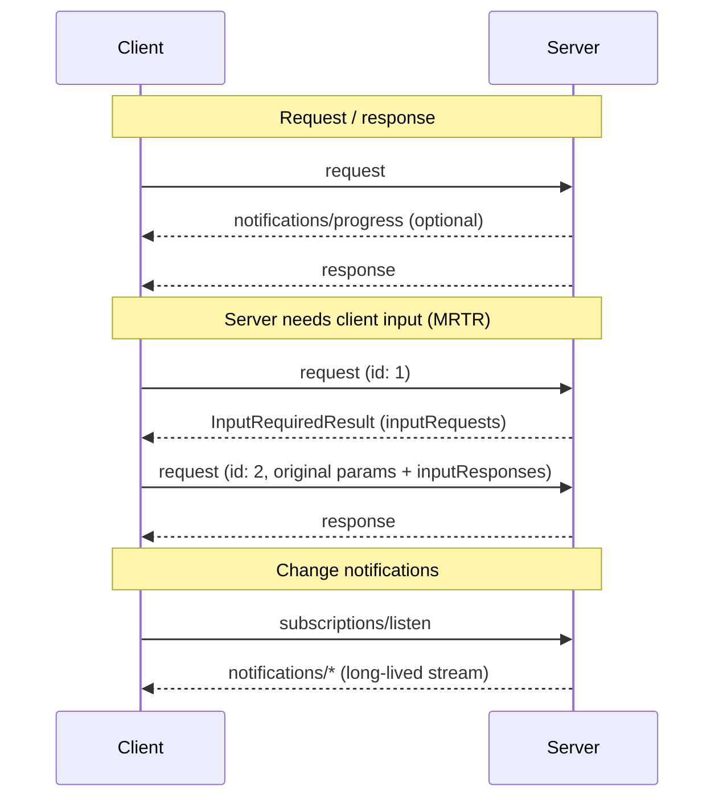

MCP uses JSON-RPC to encode messages. JSON-RPC messages **MUST** be UTF-8
encoded.

Protocol semantics are identical on every transport. A transport is a
**binding**: it defines how messages are framed and delivered, how request
metadata is carried, and how cancellation and termination are signaled —
never what the messages mean. This page describes the transport-independent
model; the binding pages specify the details for each standard transport:

1. [stdio](/specification/draft/basic/transports/stdio) — newline-delimited
   messages over the standard streams of a client-launched subprocess.
2. [Streamable HTTP](/specification/draft/basic/transports/streamable-http) —
   each message is an HTTP POST to a single MCP endpoint; replies arrive as
   a JSON object or a request-scoped SSE stream.

It is also possible for clients and servers to implement
[custom transports](#custom-transports) in a pluggable fashion.

## Message Flow

Every interaction begins with the client. On any transport:

- The **client** sends JSON-RPC _requests_ and _notifications_.
- The **server** sends back, for each client request: the JSON-RPC
  _response_ (a result or error), optionally preceded by _notifications_
  scoped to that request (such as
  [`notifications/progress`](/specification/draft/basic/utilities/progress)
  or
  [`notifications/message`](/specification/draft/server/utilities/logging)).

Servers **MUST NOT** initiate JSON-RPC requests on any transport, and
clients never send JSON-RPC responses. The two flows that historically
required a server-initiated channel are instead expressed as client-initiated
requests:

- **Server-to-client interactions** (sampling, elicitation, roots): the
  server replies to the client's request with an
  [`InputRequiredResult`](/specification/draft/basic/transports/mrtr#inputrequiredresult)
  and the client retries the request with the matching `inputResponses`. See
  [Multi Round-Trip Requests](/specification/draft/basic/transports/mrtr).
- **Change notifications** (list changes, resource updates): the client opts
  in by sending a
  [`subscriptions/listen`](/specification/draft/basic/utilities/subscriptions)
  request, whose reply is a long-lived stream of the requested notification
  types. The stream's state is scoped to the request, not to the connection
  underneath: if the underlying channel is lost, the client re-issues the
  request.

## Request Metadata

All protocol metadata travels in the message body: every request carries its
protocol version, client identity, and client capabilities in
[`_meta.io.modelcontextprotocol/*`](/specification/draft/basic/index#meta)
fields. No transport requires connection state to interpret a request.

A binding **MAY** additionally mirror selected body fields into envelope
metadata — the Streamable HTTP transport mirrors them into
[HTTP headers](/specification/draft/basic/transports/streamable-http#request-metadata)
so that intermediaries can route and inspect requests without parsing the
body. The body remains the source of truth; bindings that mirror metadata
define how mismatches are rejected.

## Cancellation

Each binding defines how a client abandons an in-flight request: on stdio
the client sends a `notifications/cancelled` notification; on Streamable
HTTP it closes the request's response stream. The protocol-level rules are
the same everywhere — see
[Cancellation](/specification/draft/basic/utilities/cancellation).

## Backward Compatibility

Earlier protocol revisions established a connection-scoped session with an
`initialize` handshake and allowed servers to initiate JSON-RPC requests.
Clients and servers that interoperate with those revisions detect the
counterpart's era and fall back as described in
[Lifecycle: Backward Compatibility](/specification/draft/basic/lifecycle#backward-compatibility-with-initialization-based-versions),
which includes a compatibility matrix for implementors. Each binding page
describes its transport-specific detection mechanics.

## Custom Transports

Clients and servers **MAY** implement additional custom transport mechanisms
to suit their specific needs. The protocol is transport-agnostic and can be
implemented over any communication channel that supports bidirectional
message exchange.

Implementers who choose to support custom transports **MUST** preserve the
JSON-RPC message format, the client-initiated [message flow](#message-flow),
and the per-request metadata model. Custom transports **SHOULD** document
their connection establishment, message framing, and cancellation patterns
to aid interoperability.

Custom transports that run over a reliable bidirectional byte stream (e.g.,
Unix domain sockets or TCP) **SHOULD** reuse the
[stdio framing](/specification/draft/basic/transports/stdio) rather than
defining a new one — the stdio binding is just newline-delimited JSON-RPC
over a byte stream, and only its process-lifecycle rules are specific to
standard streams.
