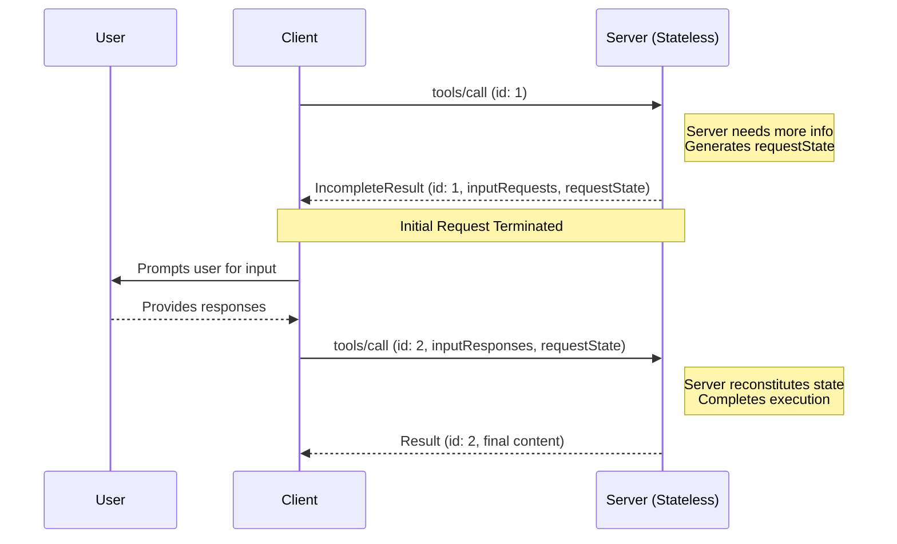
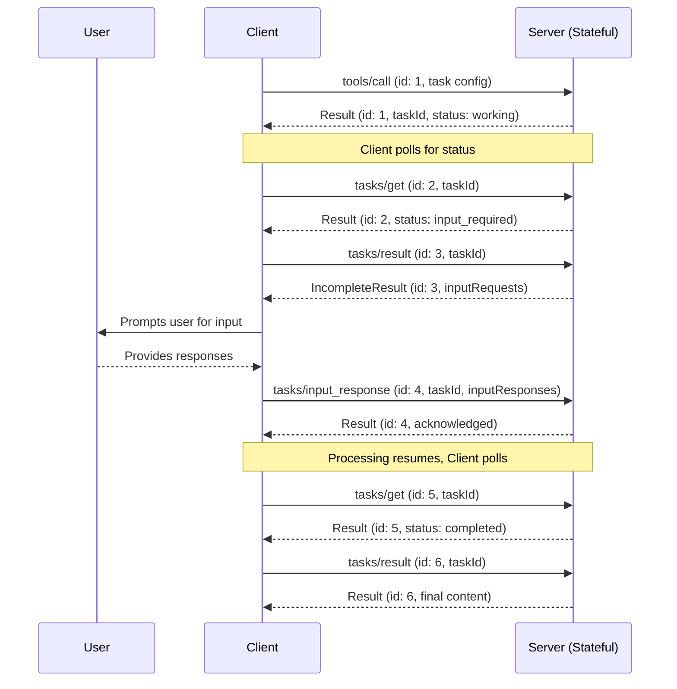

<div id="enable-section-numbers" />


<Note>
Multi Round-Trip Requests (MRTR) was introduced in 2026-06-30 of the MCP specification. 
This replaces the previous approach of sending server-initiated rquests. 
Servers **MUST** send server-to-client requests (such as
`roots/list`, `sampling/createMessage`, or `elicitation/create`) using the MRTR pattern.
The previous pattern of server-initiated requests is no longer supported. This is a breaking change.
</Note>


## Multi Round-Trip Requests
The Model Context Protocol (MCP) defines several ways for servers to request additional information
from users during the processing of client requests (such as
`roots/list`, `sampling/createMessage`, or `elicitation/create`). The **multi round-trip requests** pattern
provides a standardized way to handle these server-requests without requiring a shared storage layer across 
server instances or requiring stateful load balancing.

### Core Types

#### InputRequests

An [`InputRequests`](/specification/draft/schema#inputrequests) object is a map of server-client requests. 
Keys are server-assigned string identifiers; 
values are request objects (e.g., [`ElicitRequest`](/specification/draft/schema#elicitrequest), [`CreateMessageRequest`](/specification/draft/schema#createmessagerequest), or [`ListRootsRequest`](/specification/draft/schema#listrootsrequest)).

```json
{
  "github_login": {
    "method": "elicitation/create",
    "params": {
      "mode": "form",
      "message": "Please provide your GitHub username",
      "requestedSchema": {
        "type": "object",
        "properties": {
          "name": { "type": "string" }
        },
        "required": ["name"]
      }
    }
  },
  "capital_of_france": {
    "method": "sampling/createMessage",
    "params": {
      "messages": [
        {
          "role": "user",
          "content": {
            "type": "text",
            "text": "What is the capital of France?"
          }
        }
      ],
      "systemPrompt": "You are a helpful assistant.",
      "maxTokens": 100
    }
  }
}
```

#### InputResponses

An [`InputResponses`](/specification/draft/schema#inputresponses) object is a map of client responses to the server requests. 
Keys correspond to the keys in the `InputRequests` map; values are the client's result for each request (e.g., [`ElicitResult`](/specification/draft/schema#elicitresult), [`CreateMessageResult`](/specification/draft/schema#createmessageresult), or [`ListRootsResult`](/specification/draft/schema#listrootsresult)).

```json
{
  "github_login": {
    "action": "accept",
    "content": {
      "name": "octocat"
    }
  },
  "capital_of_france": {
    "role": "assistant",
    "content": {
      "type": "text",
      "text": "The capital of France is Paris."
    },
    "model": "claude-3-sonnet-20240307",
    "stopReason": "endTurn"
  }
}
```

#### IncompleteResult

An [`IncompleteResult`](/specification/draft/schema#incompleteresult) is a type of [`Result`](https://modelcontextprotocol.io/specification/2025-11-25/basic#responses), 
indicating that additional input is needed before the request can be completed. 

- `inputRequests` _(optional)_: An [`InputRequests`](/specification/draft/schema#inputrequests) map of server-initiated requests that the client must fulfill.
- `requestState` _(optional)_: An opaque string meaningful only to the server. Clients **MUST NOT** inspect, parse, modify, or make any assumptions about its contents.

```json
{
    "jsonrpc": "2.0",
    "id": 1,
    "requestState": "opaque-server-state-string",
    "result": {
        "resultType": "incomplete",
        "inputRequests": {
            // Elicitation request.
            "github_login": {
                "method": "elicitation/create",
                "params": {
                "mode": "form",
                "message": "Please provide your GitHub username",
                "requestedSchema": {
                    "type": "object",
                    "properties": {
                        "name": {"type": "string" }
                    },
                    "required": ["name"]
                }
                }
            },
            // Sampling request.
            "capital_of_france" : {
                "method": "sampling/createMessage",
                "params": {
                    "messages": [{
                        "role": "user",
                        "content": {
                            "type": "text",
                            "text": "What is the capital of France?"
                        }
                    }],
                    "modelPreferences": {
                        "hints": [{"name": "claude-3-sonnet"}],
                        "intelligencePriority": 0.8,
                        "speedPriority": 0.5
                    },
                    "systemPrompt": "You are a helpful assistant.",
                    "maxTokens": 100
                }
            }
        }
    }
}
```

### Supported Requests

Servers **MAY** send `IncompleteResult` responses on the following client requests:

| Client Request                                                                | Supports IncompleteResult |
| ----------------------------------------------------------------------------- | ------------------------- |
| [`prompts/get`](/specification/draft/server/prompts#getting-a-prompt)         | Yes                       |
| [`resources/read`](/specification/draft/server/resources#reading-resources)   | Yes                       |
| [`tools/call`](/specification/draft/server/tools#calling-tools)               | Yes                       |
| [`tasks/result`](/specification/draft/basic/utilities/tasks#retrieving-task-results) | Yes                 |

Servers **MUST NOT** send `IncompleteResult` responses on any other client requests, including but not limited to:

| Client Request              | Supports IncompleteResult |
| --------------------------- | ------------------------- |
| `ping`                      | No                        |
| `initialize`                | No                        |
| `completion/complete`       | No                        |
| `logging/setLevel`          | No                        |
| `prompts/list`              | No                        |
| `resources/list`            | No                        |
| `resources/templates/list`  | No                        |
| `resources/subscribe`       | No                        |
| `resources/unsubscribe`     | No                        |
| `tools/list`                | No                        |
| `tasks/get`                 | No                        |
| `tasks/list`                | No                        |
| `tasks/cancel`              | No                        |
| `tasks/input_response`      | No                        |

### Basic Workflow

The basic workflow describes how a server can request additional input from the client as part of a client-server request. 
In this example we use `tools/call` as the client request, but the same pattern applies to any of the supported requests listed above.

Notably  it allows servers to request additional information without maintaining any server-side state. 
The server encodes any needed context into the `requestState` field, which the client echoes back on retry.



Note that the requests in each step are completely independent: the server processing the retry does not need any information beyond 
what is directly present in the retry request.

#### Server Requirements (Basic Workflow)

1. Servers **MAY** respond to any [supported client request](#supported-requests) with an `IncompleteResult`. 
    This response **MAY** be sent either as a standalone response or as the final message on an SSE stream. 
    If using an SSE stream, servers **MUST NOT** send any message on the stream after the `IncompleteResult`.
1. The `IncompleteResult` **MAY** include an `inputRequests` field.
1. The `IncompleteResult` **MAY** include a `requestState` field. If specified, this field is an opaque string meaningful only to the server. Servers are free to encode the state in any format (e.g., plain JSON, base64-encoded JSON, encrypted JWT, serialized binary).
1. If a request contains a `requestState` field, servers **MUST** always validate that state, as the client is an untrusted intermediary.
   - If tampering is a concern, servers **SHOULD** encrypt the `requestState` field using an encryption algorithm of their choice (e.g., AES-GCM or a signed JWT) to ensure both confidentiality and integrity.
   - If the request state contains data specific to the original user, the server **MUST** use a mechanism to cryptographically bind the data to the original user and **MUST** verify that the `requestState` sent by the client is associated with the currently authenticated user.
   - Servers using plaintext state **MUST** treat the decoded values as untrusted input and validate them the same way they would validate any client-supplied data.
1. Servers **MUST** include at least one of `inputRequests` or `requestState` in every `IncompleteResult` response.
1. Servers **MUST NOT** send an `inputRequests` that the client has not declared support for in its capabilities. For example, if a client does not declare support for `elicitation`, the server **MUST NOT** include any `elicitation/create` requests in the `inputRequests` field.
1. Servers **MUST NOT** assume that clients will fulfill the `inputRequests` or retry the original request. Servers **MAY** choose to return an `IncompleteResult` multiple times in response to the same original request if they want to repeatedly prompt the user for information until they have what they need to complete the request.

#### Client Requirements (Basic Workflow)

1. If a client receives an `IncompleteResult` that contains the `inputRequests` field, the client **MUST** construct the requested
 inputs before retrying the original request. If the `IncompleteResult` does _not_ contain the `inputRequests` field, 
 the client **MAY** retry the original request immediately.
1. If an `IncompleteResult` contains the `requestState` field, the client **MUST** echo back the exact value of that field when retrying the original request. 
    Clients **MUST NOT** inspect, parse, modify, or make any assumptions about the `requestState` contents. If the `IncompleteResult` does not contain a `requestState` field, the client **MUST NOT** include one in the retry.
1. The JSON-RPC `id` **MUST** be different between the initial request and the retry, as they are independent requests.
1. Both the `inputRequests` and `requestState` fields affect only the client's retry of the original request. They **MUST NOT** be used for any other request that the client may be sending in parallel.

### Tasks Workflow

For long-running operations that require server-side state, the persistent workflow leverages [Tasks](/specification/draft/basic/utilities/tasks). The `input_required` task status indicates that additional information is needed.



#### Server Requirements (Persistent)

1. Servers **MAY** respond to `tasks/get` by indicating that the task is in status `input_required`.
1. Servers **MUST** include an `inputRequests` field in the `tasks/result` response when the task is in status `input_required`.

#### Client Requirements (Persistent)

1. When `tasks/get` shows status `input_required`, clients **MUST** call `tasks/result` to get the input requests.
1. Clients **SHOULD** construct the results of those requests and call [`tasks/input_response`](/specification/draft/basic/utilities/tasks#providing-input-for-tasks) with the input responses.
1. Clients **MAY** choose not to fulfill the input requests, in which case they can cancel the task.

### Transitioning Between Workflows

A tool implementation **MAY** start using the ephemeral workflow and then switch to the persistent workflow by creating a task once it has the information needed to begin processing. This avoids requiring the server to store state until it actually has enough information to start.

However, once a tool implementation returns a task, it has committed to storing state on the server side for the duration of the task. There is no way to transition back to the ephemeral workflow. All subsequent interactions **MUST** be performed via the Tasks API.

### Error Handling

Servers **SHOULD** validate that the data provided by the client is a valid `InputResponses` object and that the information inside can be correctly parsed. Protocol errors (malformed JSON, invalid schema, internal server errors) **SHOULD** return a JSON-RPC error response with an appropriate error code and message.

If additional, unexpected parameters are provided in the `InputResponses` object, the server **SHOULD** ignore any information it does not recognize or need.

If the client fails to send all the information requested in a previous `InputRequests`, and the missing information is necessary for the server to process the request, the server **SHOULD** respond with a new `IncompleteResult` requesting the missing information again, rather than returning an error.

### Security Considerations

Because `requestState` passes through the client, malicious or compromised clients could attempt to modify it to alter server behavior, bypass authorization checks, or corrupt server logic. Servers **MUST** validate request state as described in the [server requirements](#server-requirements-ephemeral) above.
