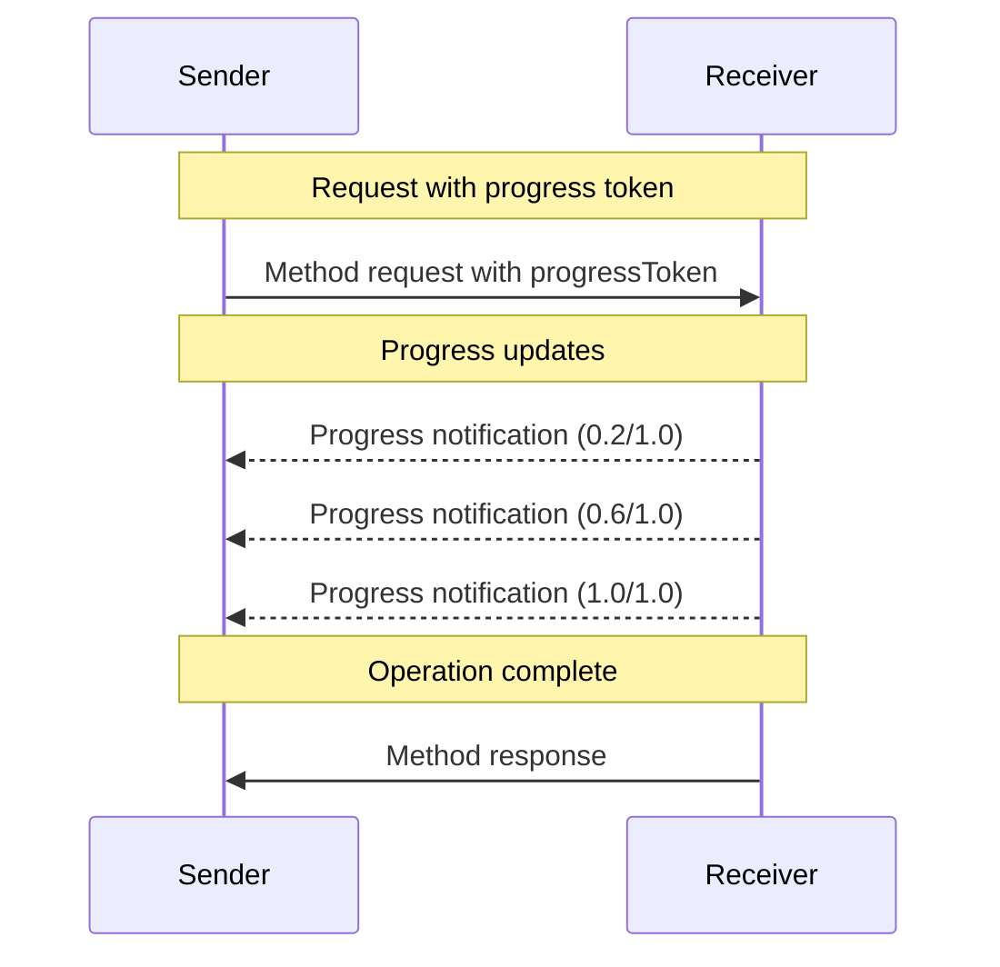

<div id="enable-section-numbers" />

The Model Context Protocol (MCP) supports optional progress tracking for long-running
operations through notification messages. Either side can send progress notifications to
provide updates about operation status.

## Progress Flow

When a party wants to _receive_ progress updates for a request, it includes a
`progressToken` in the request metadata.

- Progress tokens **MUST** be a string or integer value
- Progress tokens can be chosen by the sender using any means, but **MUST** be unique
  across all active requests.

```json
{
  "jsonrpc": "2.0",
  "id": 1,
  "method": "some_method",
  "params": {
    "_meta": {
      "progressToken": "abc123"
    }
  }
}
```

The receiver **MAY** then send progress notifications containing:

- The original progress token
- The current progress value so far
- An optional "total" value
- An optional "message" value
- An optional structured "content" value

```json
{
  "jsonrpc": "2.0",
  "method": "notifications/progress",
  "params": {
    "progressToken": "abc123",
    "progress": 50,
    "total": 100,
    "message": "Calling retrieval tool",
    "content": {
      "event": "tool_call",
      "text": "Calling retrieval tool",
      "actor": {
        "kind": "agent",
        "name": "catalog-assistant"
      },
      "data": {
        "toolName": "get_metadata",
        "input": {
          "productId": "ABC"
        }
      }
    }
  }
}
```

- The `progress` value **MUST** increase with each notification, even if the total is
  unknown.
- The `progress` and the `total` values **MAY** be floating point.
- The `message` field **SHOULD** provide relevant human readable progress information.
- The `content` field **MAY** provide machine-readable structured progress details.
- If both `message` and `content.text` are present, they **SHOULD** be semantically
  aligned.
+
+### Structured Progress Content
+
+The optional `content` field allows senders to attach structured metadata to a progress
+notification without requiring receivers to parse free-form text.
+
+A minimal interoperable `content` shape includes:
+
+- `event`: a machine-readable string describing the kind of progress event
+- `text`: optional human-readable text associated with the event
+- `actor`: optional metadata describing the actor responsible for the event
+- `data`: optional event-specific structured payload
+
+For tool-oriented progress events, `content.data` may include fields such as:
+
+- `toolName`
+- `input`
+- `output`
+
+For example:
+
+- `tool_call` may include `toolName` and `input`
+- `tool_result` may include `toolName` and `output`

## Behavior Requirements

1. Progress notifications **MUST** only reference tokens that:
   - Were provided in an active request
   - Are associated with an in-progress operation

2. Receivers of progress requests **MAY**:
   - Choose not to send any progress notifications
   - Send notifications at whatever frequency they deem appropriate
   - Omit the total value if unknown

3. For [task-augmented requests](./tasks), the `progressToken` provided in the original request **MUST** continue to be used for progress notifications throughout the task's lifetime, even after the `CreateTaskResult` has been returned. The progress token remains valid and associated with the task until the task reaches a terminal status.
   - Progress notifications for tasks **MUST** use the same `progressToken` that was provided in the initial task-augmented request
   - Progress notifications for tasks **MUST** stop after the task reaches a terminal status (`completed`, `failed`, or `cancelled`)



## Implementation Notes

- Senders and receivers **SHOULD** track active progress tokens
- Both parties **SHOULD** implement rate limiting to prevent flooding
- Progress notifications **MUST** stop after completion
