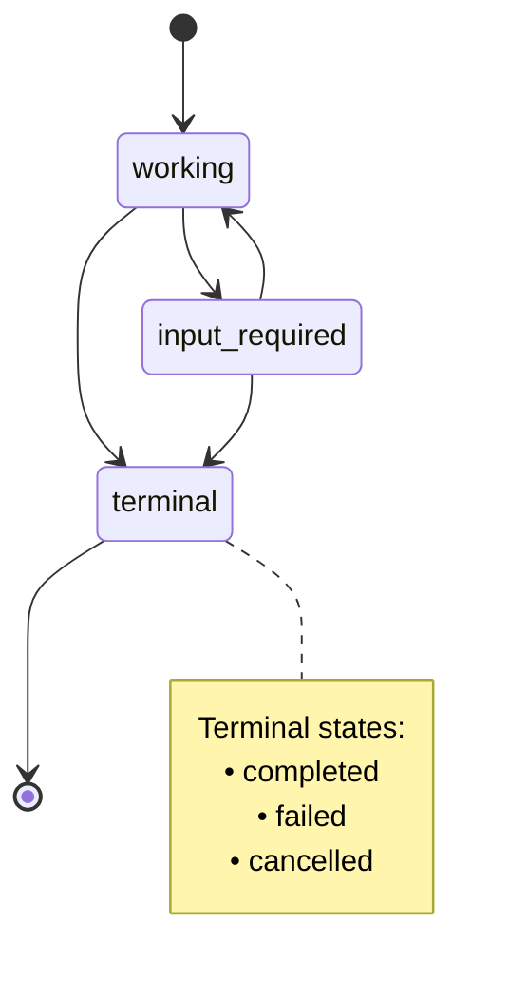
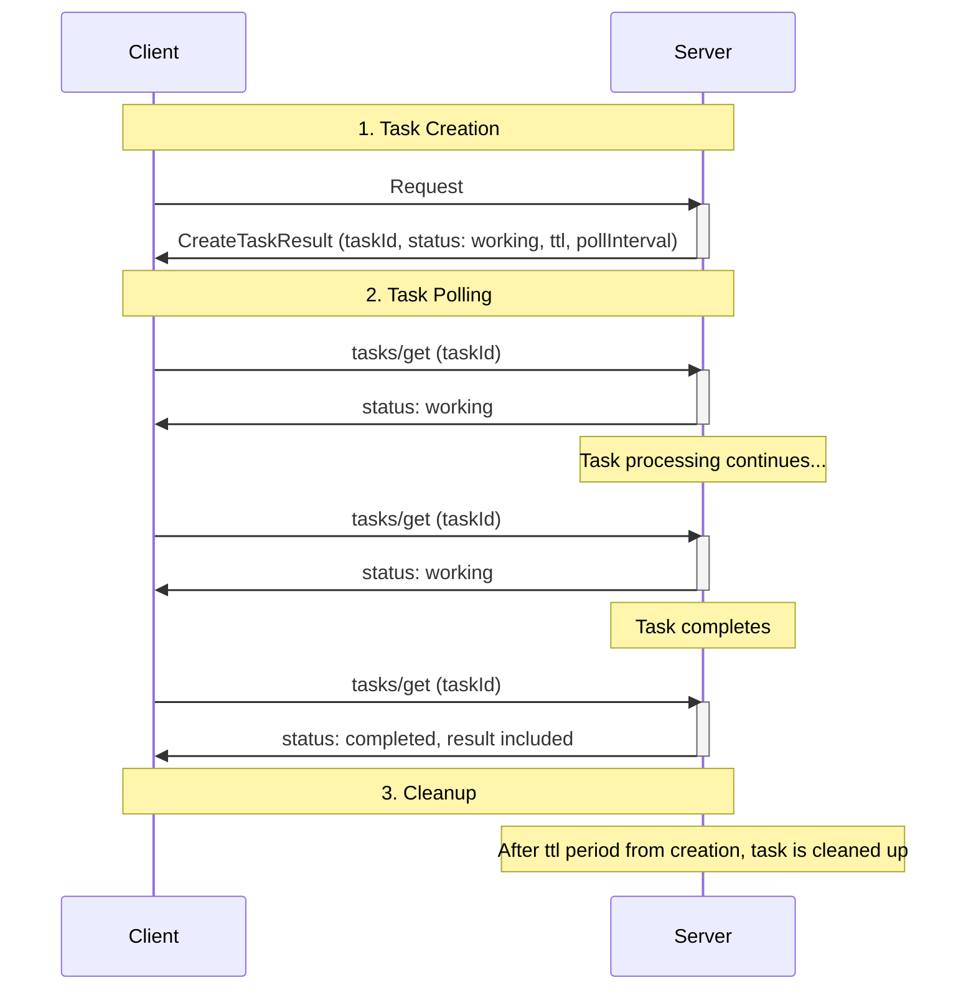
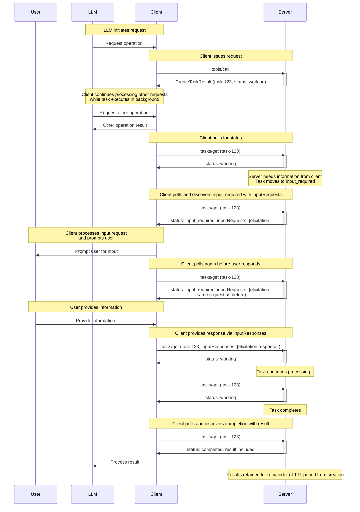

<div id="enable-section-numbers" />

<Note>

Tasks were introduced in version 2025-11-25 of the MCP specification and are currently considered **experimental**.
The design and behavior of tasks may evolve in future protocol versions.

</Note>

The Model Context Protocol (MCP) allows clients to augment their requests with **tasks**. Tasks are durable state machines that carry information about the underlying execution state of the request they wrap, and are intended for client polling and deferred result retrieval. Each task is uniquely identifiable by a server-generated **task ID**.

Tasks are useful for representing expensive computations and batch processing requests, and integrate seamlessly with external job APIs.

## User Interaction Model

Tasks are designed to support **server-directed execution** - servers decide when to create tasks for expensive or long-running operations, while clients are responsible for polling for results. This approach ensures deterministic response handling and enables sophisticated patterns such as dispatching concurrent requests, which only the client has sufficient context to orchestrate.

Implementations are free to expose tasks through any interface pattern that suits their needs — the protocol itself does not mandate any specific user interaction model.

## Capabilities

Task support requires no capability negotiation. Tasks are a standard part of the protocol that servers **MAY** choose to implement. Servers **MAY** return `CreateTaskResult` for any request without declaring a capability, and clients **MUST** be prepared to handle tasks regardless of declared capabilities.

All servers **MUST** implement the `tasks/get` and `tasks/cancel` methods. Servers that have not created any tasks will simply return an error for unknown task IDs.

### Supported Methods

The following methods support task-augmented execution:

- `tools/call`

## Protocol Messages

### Creating Tasks

Task-augmented requests follow a two-phase response pattern that differs from normal requests:

- **Normal requests**: The server processes the request and returns the actual operation result directly.
- **Task-augmented requests**: The server accepts the request and immediately returns a [`CreateTaskResult`](/specification/draft/schema#createtaskresult) containing task data. The actual operation result becomes available later through `tasks/get` after the task completes.

Whether a task is created in response to a request is subject to the server's implementation; clients **MUST** be prepared to handle either case. Servers **MAY** return a `CreateTaskResult` in response to any request that supports task-augmentation.

**Request:**

```json
{
  "jsonrpc": "2.0",
  "id": 1,
  "method": "tools/call",
  "params": {
    "name": "get_weather",
    "arguments": {
      "city": "New York"
    }
  }
}
```

**Response:**

```json
{
  "jsonrpc": "2.0",
  "id": 1,
  "result": {
    "resultType": "task",
    "task": {
      "taskId": "786512e2-9e0d-44bd-8f29-789f320fe840",
      "status": "working",
      "statusMessage": "The operation is now in progress.",
      "createdAt": "2025-11-25T10:30:00Z",
      "lastUpdatedAt": "2025-11-25T10:40:00Z",
      "ttl": 60,
      "pollInterval": 5000
    }
  }
}
```

When a server accepts a task-augmented request, it returns a `CreateTaskResult` containing task data. The response does not include the actual operation result. The actual result (e.g., tool result for `tools/call`) becomes available only through `tasks/get` after the task completes.

<Note>

When a task is created in response to a `tools/call` request, host applications may wish to return control to the model while the task is executing. This allows the model to continue processing other requests or perform additional work while waiting for the task to complete.

To support this pattern, servers can provide an optional `io.modelcontextprotocol/model-immediate-response` key in the `_meta` field of the `CreateTaskResult`. The value of this key should be a string intended to be passed as an immediate tool result to the model.
If a server does not provide this field, the host application can fall back to its own predefined message.

This guidance is non-binding and is provisional logic intended to account for the specific use case. This behavior may be formalized or modified as part of `CreateTaskResult` in future protocol versions.

</Note>

### Getting Tasks

<Note>

In the Streamable HTTP (SSE) transport, clients **MAY** disconnect from an SSE stream opened by the server in response to a `tasks/get` request at any time.

While this note is not prescriptive regarding the specific usage of SSE streams, all implementations **MUST** continue to comply with the existing [Streamable HTTP transport specification](../transports#sending-messages-to-the-server).

</Note>

Clients poll for task completion by sending [`tasks/get`](/specification/draft/schema#tasks%2Fget) requests.
Clients **SHOULD** respect the `pollInterval` provided in responses when determining polling frequency.

Clients **SHOULD** continue polling until the task reaches a terminal status (`completed`, `failed`, or `cancelled`), or until encountering the [`input_required`](#input-required-status) status.

#### Basic Polling

**Request:**

```json
{
  "jsonrpc": "2.0",
  "id": 3,
  "method": "tasks/get",
  "params": {
    "taskId": "786512e2-9e0d-44bd-8f29-789f320fe840"
  }
}
```

**Response (Working):**

```json
{
  "jsonrpc": "2.0",
  "id": 3,
  "result": {
    "resultType": "task",
    "taskId": "786512e2-9e0d-44bd-8f29-789f320fe840",
    "status": "working",
    "statusMessage": "The operation is now in progress.",
    "createdAt": "2025-11-25T10:30:00Z",
    "lastUpdatedAt": "2025-11-25T10:40:00Z",
    "ttl": 30,
    "pollInterval": 5000
  }
}
```

#### Retrieving Task Results

When a task reaches a terminal status (`completed`, `failed`, or `cancelled`), the `tasks/get` response includes the final result or error inlined into the `Task` object. The `result` field contains what the underlying request would have returned (e.g., `CallToolResult` for `tools/call`), and the `error` field contains any JSON-RPC error that occurred during execution.

**Response (Completed with Result):**

```json
{
  "jsonrpc": "2.0",
  "id": 4,
  "result": {
    "resultType": "task",
    "taskId": "786512e2-9e0d-44bd-8f29-789f320fe840",
    "status": "completed",
    "createdAt": "2025-11-25T10:30:00Z",
    "lastUpdatedAt": "2025-11-25T10:50:00Z",
    "ttl": 30,
    "pollInterval": 5000,
    "result": {
      "content": [
        {
          "type": "text",
          "text": "Current weather in New York:\nTemperature: 72°F\nConditions: Partly cloudy"
        }
      ],
      "isError": false
    }
  }
}
```

**Response (Failed with Error):**

```json
{
  "jsonrpc": "2.0",
  "id": 5,
  "result": {
    "resultType": "task",
    "taskId": "786512e2-9e0d-44bd-8f29-789f320fe840",
    "status": "failed",
    "statusMessage": "Tool execution failed: API rate limit exceeded",
    "createdAt": "2025-11-25T10:30:00Z",
    "lastUpdatedAt": "2025-11-25T10:40:00Z",
    "ttl": 30,
    "error": {
      "code": -32603,
      "message": "API rate limit exceeded"
    }
  }
}
```

#### Input Requests and Responses

When a task requires input from the client (indicated by the `input_required` status), the server includes outstanding requests in the `inputRequests` field of the `tasks/get` response. The client provides responses via the `inputResponses` field in subsequent `tasks/get` requests.

**Response (Input Required):**

```json
{
  "jsonrpc": "2.0",
  "id": 6,
  "result": {
    "resultType": "task",
    "taskId": "786512e2-9e0d-44bd-8f29-789f320fe840",
    "status": "input_required",
    "createdAt": "2025-11-25T10:30:00Z",
    "lastUpdatedAt": "2025-11-25T10:45:00Z",
    "ttl": 30,
    "pollInterval": 5000,
    "inputRequests": {
      "elicit-name": {
        "method": "elicitation/create",
        "params": {
          "mode": "form",
          "message": "Please enter your name.",
          "requestedSchema": {
            "type": "object",
            "properties": {
              "name": { "type": "string" }
            },
            "required": ["name"]
          }
        }
      }
    }
  }
}
```

**Request (With Input Response):**

```json
{
  "jsonrpc": "2.0",
  "id": 7,
  "method": "tasks/get",
  "params": {
    "taskId": "786512e2-9e0d-44bd-8f29-789f320fe840",
    "inputResponses": {
      "elicit-name": {
        "action": "accept",
        "content": {
          "input": "John Doe"
        }
      }
    }
  }
}
```

The `inputRequests` field represents a point-in-time snapshot of all outstanding server-to-client requests. If the client polls again before providing responses, the same requests will be included in subsequent responses. Clients **SHOULD** deduplicate requests with the same key for UX purposes.

#### Request State Management

Servers **MAY** set an optional `requestState` string on any `Task` object to pass opaque routing or state information back to the client. When a client receives a `Task` with a `requestState` value, it **MUST** echo back the exact value of that field in the `requestState` field of subsequent `tasks/get` and `tasks/cancel` requests for the same task. The server can use this echoed value to recover routing context or session state without maintaining per-task server-side session data, enabling stateless, load-balanced deployments.

**Response (with requestState):**

```json
{
  "jsonrpc": "2.0",
  "id": 6,
  "result": {
    "resultType": "task",
    "taskId": "786512e2-9e0d-44bd-8f29-789f320fe840",
    "status": "input_required",
    "createdAt": "2025-11-25T10:30:00Z",
    "lastUpdatedAt": "2025-11-25T10:45:00Z",
    "ttl": 30,
    "pollInterval": 5000,
    "requestState": "eyJzZXJ2ZXJJZCI6ICJub2RlLTQyIn0=",
    "inputRequests": {
      "elicit-name": {
        "method": "elicitation/create",
        "params": {
          "message": "Please enter your name.",
          "requestedSchema": {
            "type": "object",
            "properties": { "name": { "type": "string" } },
            "required": ["name"]
          }
        }
      }
    }
  }
}
```

**Follow-up Request (echoing requestState):**

```json
{
  "jsonrpc": "2.0",
  "id": 7,
  "method": "tasks/get",
  "params": {
    "taskId": "786512e2-9e0d-44bd-8f29-789f320fe840",
    "requestState": "eyJzZXJ2ZXJJZCI6ICJub2RlLTQyIn0=",
    "inputResponses": {
      "elicit-name": {
        "action": "accept",
        "content": { "input": "Jane Doe" }
      }
    }
  }
}
```

**`tasks/cancel` Request (echoing requestState):**

```json
{
  "jsonrpc": "2.0",
  "id": 7,
  "method": "tasks/cancel",
  "params": {
    "taskId": "786512e2-9e0d-44bd-8f29-789f320fe840",
    "requestState": "eyJzZXJ2ZXJJZCI6ICJub2RlLTQyIn0="
  }
}
```

The `requestState` value is opaque to the client — clients **MUST NOT** inspect, parse, modify, or make assumptions about its contents. Servers **MAY** return a different `requestState` value on each `tasks/get` and `tasks/cancel` response; clients **MUST** always use the most recently received value in their next request. If no `requestState` is present in the server's response, the client **MUST NOT** include it in the next request. Servers that include `requestState` **SHOULD** encrypt it to protect confidentiality and integrity, and **MUST** validate any received `requestState` before acting on it.

Upon receiving a `notifications/tasks/status` notification for a task status update, clients **MUST** update their tracked `requestState` value with any value provided in the notification, as they would do with a standard response.

### Task Status Notification

When a task status changes, servers **MAY** send a [`notifications/tasks/status`](/specification/draft/schema#notifications%2Ftasks%2Fstatus) notification to inform the client of the change. This notification includes the full task state.

**Notification:**

```json
{
  "jsonrpc": "2.0",
  "method": "notifications/tasks/status",
  "params": {
    "taskId": "786512e2-9e0d-44bd-8f29-789f320fe840",
    "status": "completed",
    "createdAt": "2025-11-25T10:30:00Z",
    "lastUpdatedAt": "2025-11-25T10:50:00Z",
    "ttl": 60,
    "pollInterval": 5000,
    "result": {
      "content": [
        {
          "type": "text",
          "text": "Operation completed successfully."
        }
      ],
      "isError": false
    }
  }
}
```

The notification includes the full [`Task`](/specification/draft/schema#task) object, including the updated `status`, `statusMessage` (if present), and `result` or `error` fields when the task reaches a terminal status. This allows clients to access the complete task state and final results without making an additional `tasks/get` request.

Clients **MUST NOT** rely on receiving this notification, as it is optional. Servers are not required to send status notifications and may choose to only send them for certain status transitions. Clients **SHOULD** continue to poll via `tasks/get` to ensure they receive status updates.

In Streamable HTTP, if a server sends this notification, it **MUST** send it on an SSE stream associated with a `tasks/get` request.

### Cancelling Tasks

To explicitly cancel a task, clients can send a [`tasks/cancel`](/specification/draft/schema#tasks%2Fcancel) request.

All servers that return `CreateTaskResult` **MUST** support the `tasks/cancel` method. This aligns tasks with the cooperative cancellation model used elsewhere in the protocol (e.g., `notifications/cancelled`): the requestor signals intent, but the worker decides whether to honor it.

Servers **MAY** choose to ignore cancellation requests if they are incapable or unwilling to cancel a specific task. In such cases, the task continues executing and eventually reaches a terminal status (`completed` or `failed`).

**Request:**

```json
{
  "jsonrpc": "2.0",
  "id": 6,
  "method": "tasks/cancel",
  "params": {
    "taskId": "786512e2-9e0d-44bd-8f29-789f320fe840"
  }
}
```

**Response (Successful Cancellation):**

```json
{
  "jsonrpc": "2.0",
  "id": 6,
  "result": {
    "taskId": "786512e2-9e0d-44bd-8f29-789f320fe840",
    "status": "cancelled",
    "statusMessage": "The task was cancelled by request.",
    "createdAt": "2025-11-25T10:30:00Z",
    "lastUpdatedAt": "2025-11-25T10:40:00Z",
    "ttl": 30,
    "pollInterval": 5000
  }
}
```

**Response (Cancellation Not Supported):**

```json
{
  "jsonrpc": "2.0",
  "id": 6,
  "error": {
    "code": -32603,
    "message": "Task cancellation is not supported for this operation"
  }
}
```

## Behavior Requirements

These requirements apply to all parties that support receiving task-augmented requests.

### Task Support and Handling

1. Servers **MAY** return `CreateTaskResult` for any request that supports task-augmentation. This result **SHOULD** be returned as soon as possible after accepting the task.
1. Clients **MUST** be prepared to handle `CreateTaskResult` responses for any request, and **MUST** support the polling workflow via `tasks/get` to retrieve task results.
1. Servers **MAY** return an immediate result (e.g., `CallToolResult`) even in response to requests it previously created a task for, choosing to complete the operation immediately instead.
1. Servers **MUST NOT** return a `CreateTaskResult` unless and until a `tasks/get` request would successfully return that task. In eventually-consistent systems, servers **MUST** wait for consistency before returning `CreateTaskResult` to avoid speculative `tasks/get` requests that cannot find the task.

<Note>

Task support is independent of capability negotiation. Servers may create tasks regardless of declared capabilities. Tasks are a standard part of the protocol, not a tool-specific operation, though task support may initially be most common for tool calls.

</Note>

### Task Data Shapes

The protocol distinguishes between two representations of task data:

1. **Base task data** (`Task`): Contains task metadata only — `taskId`, `status`, `statusMessage`, `createdAt`, `lastUpdatedAt`, `ttl`, and `pollInterval`. This shape is used by `CreateTaskResult`, which **MUST NOT** include `result`, `error`, or `inputRequests` fields.
1. **Detailed task data** (`DetailedTask`): Extends the base task data with status-specific fields. This shape is used by `tasks/get` responses and `notifications/tasks/status` notifications:
   - When `status` is `"completed"`: **MUST** include a `result` field containing the final result of the underlying request.
   - When `status` is `"failed"`: **MUST** include an `error` field containing the JSON-RPC error.
   - When `status` is `"input_required"`: **MUST** include an `inputRequests` field containing outstanding server-to-client requests.
   - When `status` is `"working"` or `"cancelled"`: No additional fields are required.

This separation ensures that `CreateTaskResult` remains lightweight, while `tasks/get` provides the full task state including inlined results and pending requests.

### Task ID Requirements

1. Task IDs **MUST** be a string value.
1. Task IDs **MUST** be generated by the server when creating a task.
1. Task IDs **MUST** be unique among all tasks controlled by the server.

### Task Status Lifecycle

1. Tasks **MUST** begin in the `working` status when created.
1. Servers **MUST** only transition tasks through the following valid paths:
   1. From `working`: may move to `input_required`, `completed`, `failed`, or `cancelled`
   1. From `input_required`: may move to `working`, `completed`, `failed`, or `cancelled`
   1. Tasks with a `completed`, `failed`, or `cancelled` status are in a terminal state and **MUST NOT** transition to any other status

**Task Status State Diagram:**



### Input Required Status

1. When the task server has messages for the client that are necessary to complete the task, the server **SHOULD** move the task to the `input_required` status.
1. The server **MUST** include outstanding server-to-client requests in the `inputRequests` field of the `tasks/get` response when in `input_required` status.
1. The `inputRequests` field **MUST** contain all outstanding requests from the server to the client that need to be fulfilled before the task can proceed.
1. When the client encounters the `input_required` status, it **SHOULD** provide responses via the `inputResponses` field in subsequent `tasks/get` requests.
1. Upon receiving a `tasks/get` request with `inputResponses`, the server **MUST** process the provided responses and update the task state accordingly.
1. The server **MAY** transition the task back to `working` status if the provided input is sufficient to continue processing.
1. The `inputRequests` field represents a point-in-time snapshot of all outstanding requests. If the client polls again before providing all responses, the same requests will be included in subsequent `tasks/get` responses.

### TTL and Resource Management

1. Servers **MUST** include a `createdAt` [ISO 8601](https://datatracker.ietf.org/doc/html/rfc3339#section-5)-formatted timestamp in all task responses to indicate when the task was created.
1. Servers **MUST** include a `lastUpdatedAt` [ISO 8601](https://datatracker.ietf.org/doc/html/rfc3339#section-5)-formatted timestamp in all task responses to indicate when the task was last updated.
1. Servers **MUST** include a `ttl` duration (or `null` for unlimited) in `tasks/get` responses.
1. After a task's `ttl` lifetime has elapsed, servers **MAY** delete the task and its results, regardless of the task status.
1. Servers **MAY** include a `pollInterval` value (in milliseconds) in `tasks/get` responses to suggest polling intervals. Clients **SHOULD** respect this value when provided.

### Result Retrieval

1. When a task reaches a terminal status (`completed`, `failed`, or `cancelled`), servers **MUST** inline the final result or error into the `Task` object returned by `tasks/get`.
1. For successful completion, the `result` field **MUST** contain what the underlying request would have returned (e.g., `CallToolResult` for `tools/call`).
1. Servers **MUST** include the `result` or `error` field in `notifications/tasks/status` notifications when notifying about terminal status transitions.

### Result Type Discrimination

To enable clients to distinguish between different response types without inspecting the entire payload, task-returning methods use the `resultType` field on the JSON-RPC response envelope:

1. All methods that return a `Task` object (`tasks/get`, `tasks/cancel`) **MUST** set the `resultType` field to `"task"` on the JSON-RPC response.
1. Methods that return `CreateTaskResult` (such as task-augmented `tools/call` requests) **SHOULD** set the `resultType` field to `"task"` to indicate a task was created instead of an immediate result.
1. Clients **MAY** use the `resultType` field for polymorphic result handling, allowing them to quickly determine whether a response contains a task or an immediate result.
1. If `resultType` is not specified, it defaults to `"complete"`.

**Example: tasks/get response with resultType**

```json
{
  "jsonrpc": "2.0",
  "id": 3,
  "result": {
    "resultType": "task",
    "taskId": "786512e2-9e0d-44bd-8f29-789f820fe840",
    "status": "working",
    "createdAt": "2025-11-25T10:30:00Z",
    "lastUpdatedAt": "2025-11-25T10:50:00Z",
    "ttl": 30,
    "pollInterval": 5000
  }
}
```

### Associating Task-Related Messages

1. All requests, notifications, and responses related to a task **MUST** include the `io.modelcontextprotocol/related-task` key in their `_meta` field, with the value set to an object with a `taskId` matching the associated task ID.
   1. For example, an elicitation that a task-augmented tool call depends on **MUST** share the same related task ID with that tool call's task.
1. For the `tasks/get` and `tasks/cancel` operations, the `taskId` parameter in the request **MUST** be used as the source of truth for identifying the target task. Clients **SHOULD NOT** include `io.modelcontextprotocol/related-task` metadata in these requests, and servers **MUST** ignore such metadata if present in favor of the RPC method parameter.
1. For the `tasks/get` and `tasks/cancel` operations, servers **SHOULD NOT** include `io.modelcontextprotocol/related-task` metadata in the result messages, as the `taskId` is already present in the response structure.

### Task Notifications

1. Servers **MAY** send `notifications/tasks/status` notifications when a task's status changes.
1. Clients **MUST NOT** rely on receiving the `notifications/tasks/status` notification, as it is optional.
1. When sent, the `notifications/tasks/status` notification **SHOULD NOT** include the `io.modelcontextprotocol/related-task` metadata, as the task ID is already present in the notification parameters.

### Task Progress Notifications

Task-augmented requests support progress notifications as defined in the [progress](./progress) specification. The `progressToken` provided in the initial request remains valid throughout the task lifetime.

### Task Cancellation

1. All servers that return `CreateTaskResult` **MUST** support the `tasks/cancel` operation, even if they are incapable or unwilling to actually cancel tasks.
1. Servers **MAY** choose to ignore cancellation requests if they are incapable or unwilling to cancel a specific task. In such cases, the task continues executing and eventually reaches a terminal status (`completed` or `failed`).
1. Servers **MUST** reject cancellation requests for tasks already in a terminal status (`completed`, `failed`, or `cancelled`) with error code `-32602` (Invalid params).
1. Upon receiving a valid cancellation request for a non-terminal task, servers that choose to honor the cancellation **SHOULD** attempt to stop the task execution and transition the task to `cancelled` status.
1. Once a task is cancelled, it **MUST** remain in `cancelled` status even if execution continues to completion or fails.
1. The `tasks/cancel` operation does not define deletion behavior. However, servers **MAY** delete cancelled tasks at their discretion at any time, including immediately after cancellation or after the task `ttl` expires.
1. Clients **SHOULD NOT** rely on cancelled tasks being retained for any specific duration and should retrieve any needed information before cancelling.

## Message Flow

### Basic Task Lifecycle

This diagram shows the task-augmented request flow for a `tools/call` request. The server chooses whether or not to handle the operation as a task according to its own implementation details.



### Task-Augmented Tool Call With Input Required



### Task Cancellation Flow


## Data Types

### Task

A task represents the execution state of a request. The task state includes:

- `taskId`: Unique identifier for the task
- `status`: Current state of the task execution
- `statusMessage`: Optional human-readable message describing the current state (can be present for any status, including error details for failed tasks)
- `createdAt`: ISO 8601 timestamp when the task was created
- `ttl`: Time in integer seconds from creation before task may be deleted
- `pollInterval`: Suggested time in milliseconds between status checks
- `lastUpdatedAt`: ISO 8601 timestamp when the task status was last updated
- `result`: Optional field containing the final result when the task reaches a terminal status (e.g., `CallToolResult` for tool calls)
- `error`: Optional field containing a JSON-RPC error if the task failed
- `requestState`: Optional opaque string set by the server for stateless routing or state management. Clients **MUST** echo this value back exactly in subsequent `tasks/get` and `tasks/cancel` requests (see [Request State Management](#request-state-management)).

### Task Status

Tasks can be in one of the following states:

- `working`: The request is currently being processed.
- `input_required`: The server needs input from the client. The `tasks/get` response will include outstanding requests in the `inputRequests` field, and the client should provide responses via the `inputResponses` field in subsequent `tasks/get` requests.
- `completed`: The request completed successfully and results are available in the `result` field. This includes tool calls that returned results with `isError: true`.
- `failed`: The request failed due to a JSON-RPC error during execution. The task will include the `error` field with the JSON-RPC error details. This status **MUST NOT** be used for non-JSON-RPC errors.
- `cancelled`: The request was cancelled before completion.

### Related Task Metadata

All requests, responses, and notifications associated with a task **MUST** include the `io.modelcontextprotocol/related-task` key in `_meta`:

```json
{
  "io.modelcontextprotocol/related-task": {
    "taskId": "786512e2-9e0d-44bd-8f29-789f320fe840"
  }
}
```

This associates messages with their originating task across the entire request lifecycle.

For the `tasks/get` and `tasks/cancel` operations, clients and servers **SHOULD NOT** include this metadata in their messages, as the `taskId` is already present in the message structure.

## Error Handling

Tasks use two error reporting mechanisms:

1. **Protocol Errors**: Standard JSON-RPC errors for protocol-level issues
1. **Task Execution Errors**: Errors in the underlying request execution, reported through task status

### Protocol Errors

Servers **MUST** return standard JSON-RPC errors for the following protocol error cases:

- Invalid or nonexistent `taskId` in `tasks/get` or `tasks/cancel`: `-32602` (Invalid params)
- Attempt to cancel a task already in a terminal status: `-32602` (Invalid params)
- Internal errors: `-32603` (Internal error)

Servers **SHOULD** provide informative error messages to describe the cause of errors.

**Example: Task not found**

```json
{
  "jsonrpc": "2.0",
  "id": 70,
  "error": {
    "code": -32602,
    "message": "Failed to retrieve task: Task not found"
  }
}
```

**Example: Task expired**

```json
{
  "jsonrpc": "2.0",
  "id": 71,
  "error": {
    "code": -32602,
    "message": "Failed to retrieve task: Task has expired"
  }
}
```

<Note>

Servers are not required to retain tasks indefinitely. It is compliant behavior for a server to return an error stating the task cannot be found if it has purged an expired task.

</Note>

**Example: Task cancellation rejected (already terminal)**

```json
{
  "jsonrpc": "2.0",
  "id": 74,
  "error": {
    "code": -32602,
    "message": "Cannot cancel task: already in terminal status 'completed'"
  }
}
```

### Task Execution Errors

When the underlying request encounters a JSON-RPC protocol error during execution, the task moves to the `failed` status. The `tasks/get` response **SHOULD** include a `statusMessage` field with diagnostic information about the failure, and **MUST** include the `error` field with the JSON-RPC error.

The `failed` status **MUST NOT** be used to represent non-JSON-RPC errors, such as a tool result that completed with `isError: true`. Application-level errors **MUST** use the `completed` status with the error details in the `result` field. This maintains a strong separation between protocol-level faults (which use the `failed` status) and application-level faults (which are returned as `completed` results with `isError: true`).

**Example: Task with JSON-RPC execution error**

```json
{
  "jsonrpc": "2.0",
  "id": 4,
  "result": {
    "resultType": "task",
    "taskId": "786512e2-9e0d-44bd-8f29-789f820fe840",
    "status": "failed",
    "createdAt": "2025-11-25T10:30:00Z",
    "lastUpdatedAt": "2025-11-25T10:40:00Z",
    "ttl": 30,
    "statusMessage": "Tool execution failed: API rate limit exceeded",
    "error": {
      "code": -32603,
      "message": "API rate limit exceeded"
    }
  }
}
```

**Example: Tool call completed with application error (isError: true)**

For tool calls that complete successfully at the protocol level but return an application-level error (indicated by `isError: true` in the tool result), the task reaches `completed` status with the tool result in the `result` field:

```json
{
  "jsonrpc": "2.0",
  "id": 5,
  "result": {
    "resultType": "task",
    "taskId": "786512e2-9e0d-44bd-8f29-789f820fe840",
    "status": "completed",
    "createdAt": "2025-11-25T10:30:00Z",
    "lastUpdatedAt": "2025-11-25T10:40:00Z",
    "ttl": 30,
    "result": {
      "content": [
        {
          "type": "text",
          "text": "Failed to process request: invalid input"
        }
      ],
      "isError": true
    }
  }
}
```

The `tasks/get` endpoint returns exactly what the underlying request would have returned:

- If the underlying request resulted in a JSON-RPC error, the task uses `failed` status and the `error` field **MUST** contain that JSON-RPC error.
- If the request completed with a result (even if `isError: true` for tool results), the task uses `completed` status and the `result` field **MUST** contain that result.

## Transport Considerations

### Streamable HTTP Headers

When using the [Streamable HTTP transport](/specification/draft/basic/transports#streamable-http), clients **MUST** set the `Mcp-Name` header to the value of `params.taskId` when making `tasks/get` and `tasks/cancel` requests. This enables infrastructure to route task-related requests to the correct server instance, as tasks often involve server-side state that must be consistently co-located.

This requirement extends the standard headers defined in [SEP-2243](https://github.com/modelcontextprotocol/modelcontextprotocol/pull/2243), which requires all requests and notifications to declare an `Mcp-Method` header.

## Security Considerations

### Task Isolation and Access Control

Task IDs are the primary mechanism for accessing task state and results. Without proper access controls, any party that can guess or obtain a task ID could potentially access sensitive information or manipulate tasks they did not create.

When an authorization context is provided, servers **MUST** bind tasks to said context.

Context-binding is not practical for all applications. Some MCP servers operate in environments without authorization, such as single-user tools, or use transports that don't support authorization.
In these scenarios, servers **SHOULD** document this limitation clearly, as task results may be accessible to any client that can guess the task ID.
If context-binding is unavailable, servers **MUST** generate cryptographically secure task IDs with enough entropy to prevent guessing and should consider using shorter TTL durations to reduce the exposure window.

If context-binding is available, servers **MUST** reject `tasks/get` and `tasks/cancel` requests for tasks that do not belong to the same authorization context as the client.

Additionally, servers **SHOULD** implement rate limiting on task operations to prevent denial-of-service and enumeration attacks.

### Resource Management

1. Servers **SHOULD**:
   1. Enforce limits on concurrent tasks per client
   1. Clean up expired tasks promptly to free resources
   1. Document maximum concurrent tasks per client
   1. Implement monitoring and alerting for resource usage

### Audit and Logging

1. Servers **SHOULD**:
   1. Log task creation, completion, and retrieval events for audit purposes
   1. Include auth context in logs when available
   1. Monitor for suspicious patterns (e.g., many failed task lookups, excessive polling)
1. Clients **SHOULD**:
   1. Log task lifecycle events for debugging and audit purposes
   1. Track task IDs and their associated operations
