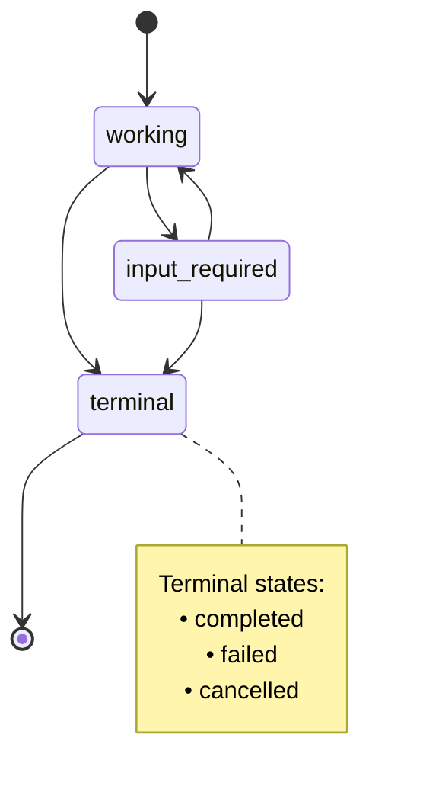
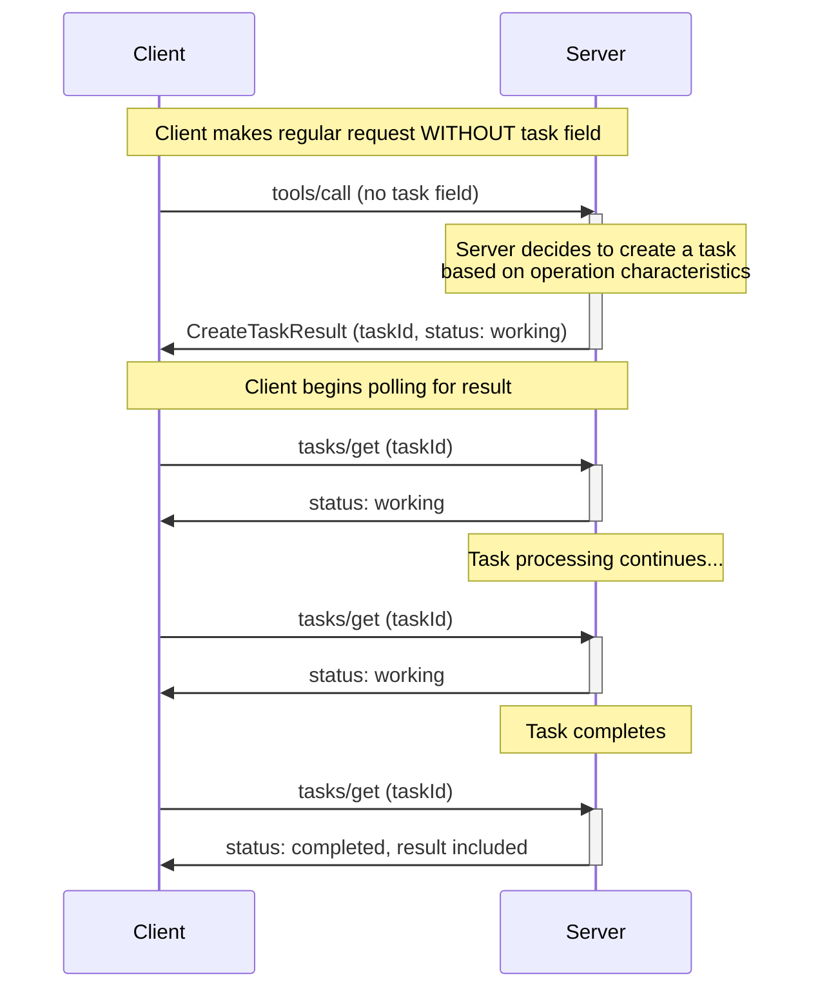
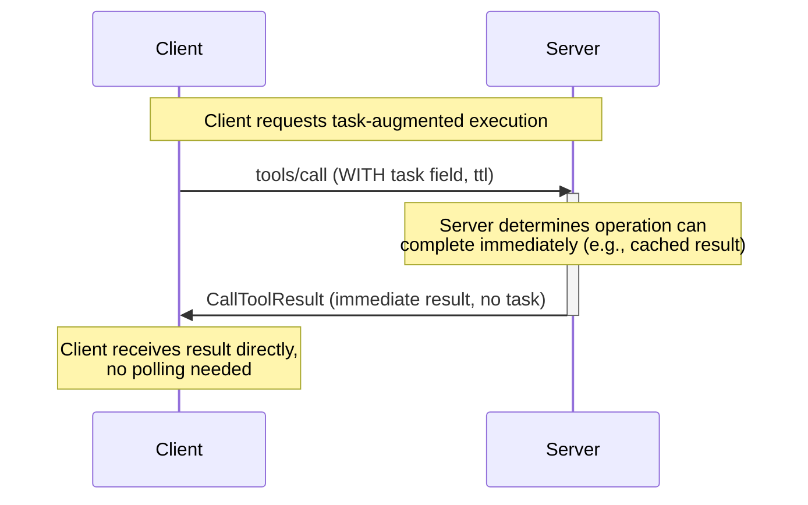
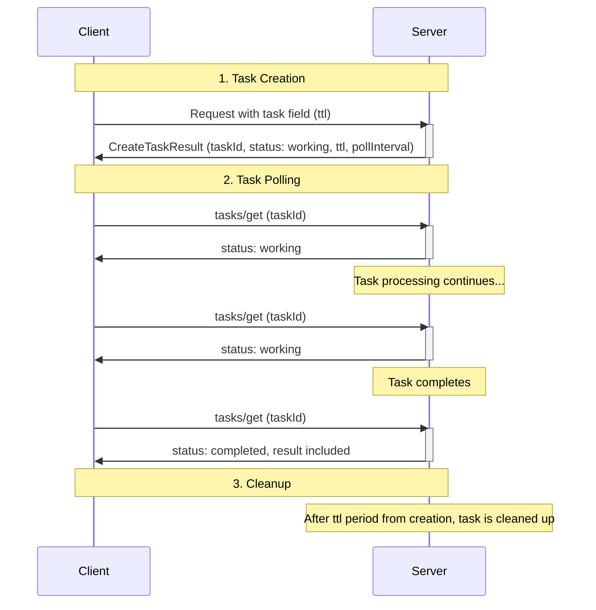
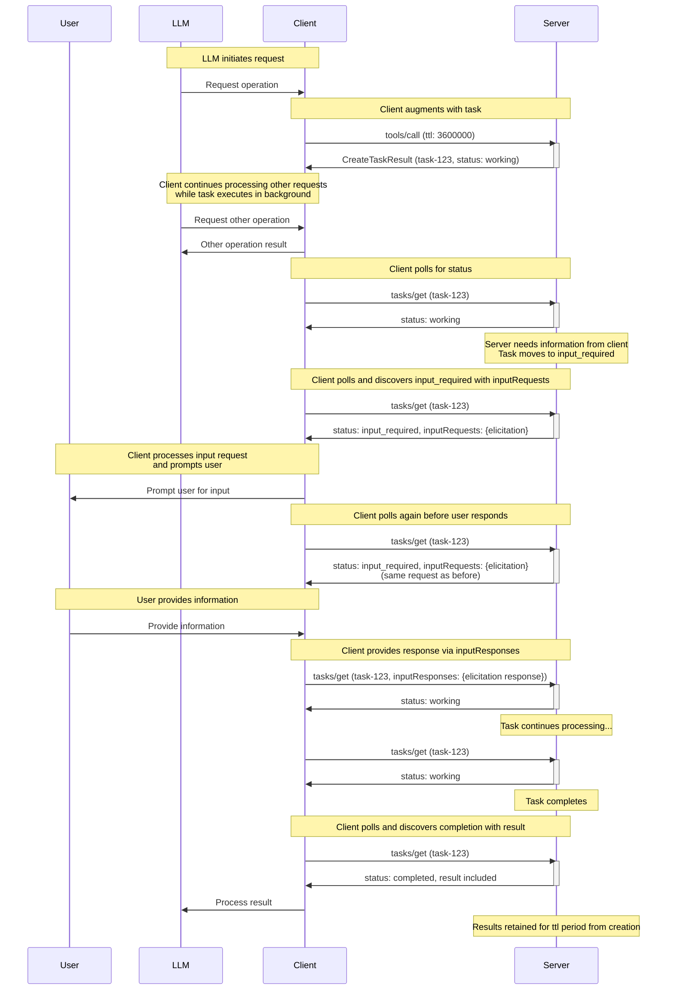
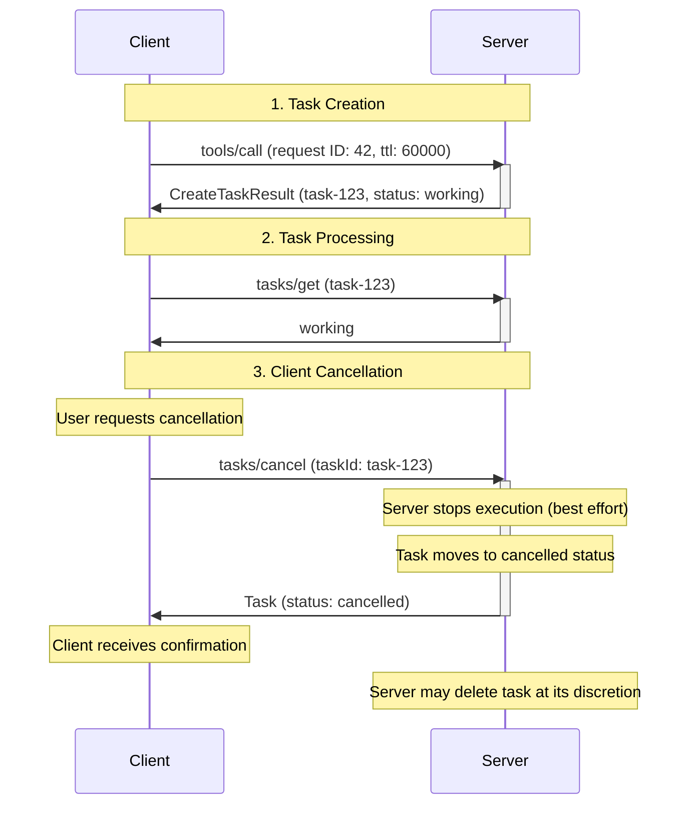

<div id="enable-section-numbers" />

<Note>

Tasks were introduced in version 2025-11-25 of the MCP specification and are currently considered **experimental**.
The design and behavior of tasks may evolve in future protocol versions.

</Note>

The Model Context Protocol (MCP) allows clients to augment their requests with **tasks**. Tasks are durable state machines that carry information about the underlying execution state of the request they wrap, and are intended for client polling and deferred result retrieval. Each task is uniquely identifiable by a server-generated **task ID**.

Tasks are useful for representing expensive computations and batch processing requests, and integrate seamlessly with external job APIs.

## User Interaction Model

Tasks are designed to be **client-driven** - clients are responsible for augmenting requests with tasks and for polling for the results of those tasks; meanwhile, servers tightly control which requests (if any) support task-based execution and manages the lifecycles of those tasks.

This client-driven approach ensures deterministic response handling and enables sophisticated patterns such as dispatching concurrent requests, which only the client has sufficient context to orchestrate.

Implementations are free to expose tasks through any interface pattern that suits their needs — the protocol itself does not mandate any specific user interaction model.

## Capabilities

Servers that support task-augmented requests **MUST** declare a `tasks` capability during initialization. The `tasks` capability is structured by request category, with boolean properties indicating which specific request types support task augmentation.

<Note type="warning">

The `tasks.cancel` and `tasks.requests.tools.call` capability declarations are deprecated. Servers **MAY** return `CreateTaskResult` for any request regardless of declared capabilities.

</Note>

### Server Capabilities

Servers declare if they support tasks, and if so, which server-side requests can be augmented with tasks.

| Capability                  | Description                                                                         |
| --------------------------- | ----------------------------------------------------------------------------------- |
| `tasks.list`                | Server supports the `tasks/list` operation                                          |
| `tasks.cancel`              | **Deprecated** - Server supports the `tasks/cancel` operation (now always required) |
| `tasks.requests.tools.call` | **Deprecated** - Server supports task-augmented `tools/call` requests               |

```json
{
  "capabilities": {
    "tasks": {
      "list": {},
      "cancel": {},
      "requests": {
        "tools": {
          "call": {}
        }
      }
    }
  }
}
```

<Note type="warning">

The `Tool.execution.taskSupport` field is deprecated. Servers **MAY** return tasks for any tool call regardless of this field's value.

</Note>

## Protocol Messages

### Creating Tasks

Task-augmented requests follow a two-phase response pattern that differs from normal requests:

- **Normal requests**: The server processes the request and returns the actual operation result directly.
- **Task-augmented requests**: The server accepts the request and immediately returns a [`CreateTaskResult`](/specification/draft/schema#createtaskresult) containing task data. The actual operation result becomes available later through `tasks/get` after the task completes.

Whether a task is created in response to a request is subject to the server's implementation; clients **MUST** be prepared to handle either case. Servers **MAY** return a `CreateTaskResult` for any request, whether or not the client included the `task` field. Servers **MAY** also return an immediate result even when the `task` field is present.

To create a task, clients send a request with the `task` field included in the request params. Clients **MAY** include a `ttl` value indicating the desired task lifetime duration (in milliseconds) since its creation.

**Request:**

```json
{
  "jsonrpc": "2.0",
  "id": 1,
  "method": "tools/call",
  "params": {
    "name": "get_weather",
    "arguments": {
      "city": "New York"
    },
    "task": {
      "ttl": 60000
    }
  }
}
```

**Response:**

```json
{
  "jsonrpc": "2.0",
  "id": 1,
  "result": {
    "task": {
      "taskId": "786512e2-9e0d-44bd-8f29-789f320fe840",
      "status": "working",
      "statusMessage": "The operation is now in progress.",
      "createdAt": "2025-11-25T10:30:00Z",
      "lastUpdatedAt": "2025-11-25T10:40:00Z",
      "ttl": 60000,
      "pollInterval": 5000
    }
  }
}
```

When a server accepts a task-augmented request, it returns a `CreateTaskResult` containing task data. The response does not include the actual operation result. The actual result (e.g., tool result for `tools/call`) becomes available only through `tasks/get` after the task completes.

<Note>

When a task is created in response to a `tools/call` request, host applications may wish to return control to the model while the task is executing. This allows the model to continue processing other requests or perform additional work while waiting for the task to complete.

To support this pattern, servers can provide an optional `io.modelcontextprotocol/model-immediate-response` key in the `_meta` field of the `CreateTaskResult`. The value of this key should be a string intended to be passed as an immediate tool result to the model.
If a server does not provide this field, the host application can fall back to its own predefined message.

This guidance is non-binding and is provisional logic intended to account for the specific use case. This behavior may be formalized or modified as part of `CreateTaskResult` in future protocol versions.

</Note>

### Getting Tasks

<Note>

In the Streamable HTTP (SSE) transport, clients **MAY** disconnect from an SSE stream opened by the server in response to a `tasks/get` request at any time.

While this note is not prescriptive regarding the specific usage of SSE streams, all implementations **MUST** continue to comply with the existing [Streamable HTTP transport specification](../transports#sending-messages-to-the-server).

</Note>

Clients poll for task completion by sending [`tasks/get`](/specification/draft/schema#tasks%2Fget) requests.
Clients **SHOULD** respect the `pollInterval` provided in responses when determining polling frequency.

Clients **SHOULD** continue polling until the task reaches a terminal status (`completed`, `failed`, or `cancelled`), or until encountering the [`input_required`](#input-required-status) status.

#### Basic Polling

**Request:**

```json
{
  "jsonrpc": "2.0",
  "id": 3,
  "method": "tasks/get",
  "params": {
    "taskId": "786512e2-9e0d-44bd-8f29-789f320fe840"
  }
}
```

**Response (Working):**

```json
{
  "jsonrpc": "2.0",
  "id": 3,
  "result": {
    "taskId": "786512e2-9e0d-44bd-8f29-789f320fe840",
    "status": "working",
    "statusMessage": "The operation is now in progress.",
    "createdAt": "2025-11-25T10:30:00Z",
    "lastUpdatedAt": "2025-11-25T10:40:00Z",
    "ttl": 30000,
    "pollInterval": 5000
  }
}
```

#### Retrieving Task Results

When a task reaches a terminal status (`completed`, `failed`, or `cancelled`), the `tasks/get` response includes the final result or error inlined into the `Task` object. The `result` field contains what the underlying request would have returned (e.g., `CallToolResult` for `tools/call`), and the `error` field contains any JSON-RPC error that occurred during execution.

**Response (Completed with Result):**

```json
{
  "jsonrpc": "2.0",
  "id": 4,
  "result": {
    "taskId": "786512e2-9e0d-44bd-8f29-789f320fe840",
    "status": "completed",
    "createdAt": "2025-11-25T10:30:00Z",
    "lastUpdatedAt": "2025-11-25T10:50:00Z",
    "ttl": 30000,
    "pollInterval": 5000,
    "result": {
      "content": [
        {
          "type": "text",
          "text": "Current weather in New York:\nTemperature: 72°F\nConditions: Partly cloudy"
        }
      ],
      "isError": false
    }
  }
}
```

**Response (Failed with Error):**

```json
{
  "jsonrpc": "2.0",
  "id": 5,
  "result": {
    "taskId": "786512e2-9e0d-44bd-8f29-789f320fe840",
    "status": "failed",
    "statusMessage": "Tool execution failed: API rate limit exceeded",
    "createdAt": "2025-11-25T10:30:00Z",
    "lastUpdatedAt": "2025-11-25T10:40:00Z",
    "ttl": 30000,
    "error": {
      "code": -32603,
      "message": "API rate limit exceeded"
    }
  }
}
```

#### Input Requests and Responses

When a task requires input from the client (indicated by the `input_required` status), the server includes outstanding requests in the `inputRequests` field of the `tasks/get` response. The client provides responses via the `inputResponses` field in subsequent `tasks/get` requests.

**Response (Input Required):**

```json
{
  "jsonrpc": "2.0",
  "id": 6,
  "result": {
    "taskId": "786512e2-9e0d-44bd-8f29-789f320fe840",
    "status": "input_required",
    "createdAt": "2025-11-25T10:30:00Z",
    "lastUpdatedAt": "2025-11-25T10:45:00Z",
    "ttl": 30000,
    "pollInterval": 5000,
    "inputRequests": {
      "elicit-name": {
        "method": "elicitation/create",
        "params": {
          "mode": "form",
          "message": "Please enter your name.",
          "requestedSchema": {
            "type": "object",
            "properties": {
              "name": { "type": "string" }
            },
            "required": ["name"]
          }
        }
      }
    }
  }
}
```

**Request (With Input Response):**

```json
{
  "jsonrpc": "2.0",
  "id": 7,
  "method": "tasks/get",
  "params": {
    "taskId": "786512e2-9e0d-44bd-8f29-789f320fe840",
    "inputResponses": {
      "elicit-name": {
        "action": "accept",
        "content": {
          "input": "John Doe"
        }
      }
    }
  }
}
```

The `inputRequests` field represents a point-in-time snapshot of all outstanding server-to-client requests. If the client polls again before providing responses, the same requests will be included in subsequent responses. Clients **SHOULD** deduplicate requests with the same key for UX purposes.

### Task Status Notification

When a task status changes, servers **MAY** send a [`notifications/tasks/status`](/specification/draft/schema#notifications%2Ftasks%2Fstatus) notification to inform the client of the change. This notification includes the full task state.

**Notification:**

```json
{
  "jsonrpc": "2.0",
  "method": "notifications/tasks/status",
  "params": {
    "taskId": "786512e2-9e0d-44bd-8f29-789f320fe840",
    "status": "completed",
    "createdAt": "2025-11-25T10:30:00Z",
    "lastUpdatedAt": "2025-11-25T10:50:00Z",
    "ttl": 60000,
    "pollInterval": 5000,
    "result": {
      "content": [
        {
          "type": "text",
          "text": "Operation completed successfully."
        }
      ],
      "isError": false
    }
  }
}
```

The notification includes the full [`Task`](/specification/draft/schema#task) object, including the updated `status`, `statusMessage` (if present), and `result` or `error` fields when the task reaches a terminal status. This allows clients to access the complete task state and final results without making an additional `tasks/get` request.

Clients **MUST NOT** rely on receiving this notifications, as it is optional. Servers are not required to send status notifications and may choose to only send them for certain status transitions. Clients **SHOULD** continue to poll via `tasks/get` to ensure they receive status updates.

### Listing Tasks

To retrieve a list of tasks, clients can send a [`tasks/list`](/specification/draft/schema#tasks%2Flist) request. This operation supports pagination.

**Request:**

```json
{
  "jsonrpc": "2.0",
  "id": 5,
  "method": "tasks/list",
  "params": {
    "cursor": "optional-cursor-value"
  }
}
```

**Response:**

```json
{
  "jsonrpc": "2.0",
  "id": 5,
  "result": {
    "tasks": [
      {
        "taskId": "786512e2-9e0d-44bd-8f29-789f320fe840",
        "status": "working",
        "createdAt": "2025-11-25T10:30:00Z",
        "lastUpdatedAt": "2025-11-25T10:40:00Z",
        "ttl": 30000,
        "pollInterval": 5000
      },
      {
        "taskId": "abc123-def456-ghi789",
        "status": "completed",
        "createdAt": "2025-11-25T09:15:00Z",
        "lastUpdatedAt": "2025-11-25T10:40:00Z",
        "ttl": 60000
      }
    ],
    "nextCursor": "next-page-cursor"
  }
}
```

### Cancelling Tasks

To explicitly cancel a task, clients can send a [`tasks/cancel`](/specification/draft/schema#tasks%2Fcancel) request.

All servers that support tasks **MUST** support the `tasks/cancel` method, even if they are incapable of or unwilling to offer actual task cancellation. Servers that cannot cancel tasks **SHOULD** return an error indicating that cancellation is not supported for the specific task, similar to how `notifications/cancelled` must be accepted but may not result in actual cancellation.

**Request:**

```json
{
  "jsonrpc": "2.0",
  "id": 6,
  "method": "tasks/cancel",
  "params": {
    "taskId": "786512e2-9e0d-44bd-8f29-789f320fe840"
  }
}
```

**Response (Successful Cancellation):**

```json
{
  "jsonrpc": "2.0",
  "id": 6,
  "result": {
    "taskId": "786512e2-9e0d-44bd-8f29-789f320fe840",
    "status": "cancelled",
    "statusMessage": "The task was cancelled by request.",
    "createdAt": "2025-11-25T10:30:00Z",
    "lastUpdatedAt": "2025-11-25T10:40:00Z",
    "ttl": 30000,
    "pollInterval": 5000
  }
}
```

**Response (Cancellation Not Supported):**

```json
{
  "jsonrpc": "2.0",
  "id": 6,
  "error": {
    "code": -32603,
    "message": "Task cancellation is not supported for this operation"
  }
}
```

## Behavior Requirements

These requirements apply to all parties that support receiving task-augmented requests.

### Task Support and Handling

1. Servers **MAY** return `CreateTaskResult` for any request, regardless of whether the client included a `task` field or whether task capabilities were declared. This result **SHOULD** be returned as soon as possible after accepting the task.
1. Clients **MUST** be prepared to handle `CreateTaskResult` responses for any request.
1. Servers **MAY** return an immediate result (e.g., `CallToolResult`) even when the client included a `task` field, choosing to complete the operation immediately rather than creating a task. Servers that do not wish to create a task **MUST** ignore the `task` field in the request.
1. Servers **MUST NOT** return a `CreateTaskResult` unless and until a `tasks/get` request would successfully return that task. In eventually-consistent systems, servers **MUST** wait for consistency before returning `CreateTaskResult` to avoid speculative `tasks/get` requests that cannot find the task.

<Note>

Task support is independent of capability negotiation. Servers may create tasks regardless of declared capabilities. Implementors are advised not to treat tasks as a tool-specific protocol operation, as task support may be expanded to additional request types in the future.

</Note>

### Task ID Requirements

1. Task IDs **MUST** be a string value.
1. Task IDs **MUST** be generated by the server when creating a task.
1. Task IDs **MUST** be unique among all tasks controlled by the server.

### Task Status Lifecycle

1. Tasks **MUST** begin in the `working` status when created.
1. Servers **MUST** only transition tasks through the following valid paths:
   1. From `working`: may move to `input_required`, `completed`, `failed`, or `cancelled`
   1. From `input_required`: may move to `working`, `completed`, `failed`, or `cancelled`
   1. Tasks with a `completed`, `failed`, or `cancelled` status are in a terminal state and **MUST NOT** transition to any other status

**Task Status State Diagram:**



### Input Required Status

1. When the task server has messages for the client that are necessary to complete the task, the server **SHOULD** move the task to the `input_required` status.
1. The server **MUST** include outstanding server-to-client requests in the `inputRequests` field of the `tasks/get` response when in `input_required` status.
1. When the client encounters the `input_required` status, it **SHOULD** provide responses via the `inputResponses` field in subsequent `tasks/get` requests.
1. The `inputRequests` field represents a point-in-time snapshot of all outstanding requests. If the client polls again before providing all responses, the same requests will be included in subsequent `tasks/get` responses.
1. When the server receives all required input, the task **SHOULD** transition out of `input_required` status (typically back to `working`).

### TTL and Resource Management

1. Servers **MUST** include a `createdAt` [ISO 8601](https://datatracker.ietf.org/doc/html/rfc3339#section-5)-formatted timestamp in all task responses to indicate when the task was created.
1. Servers **MUST** include a `lastUpdatedAt` [ISO 8601](https://datatracker.ietf.org/doc/html/rfc3339#section-5)-formatted timestamp in all task responses to indicate when the task was last updated.
1. Servers **MAY** override the requested `ttl` duration.
1. Servers **MUST** include the actual `ttl` duration (or `null` for unlimited) in `tasks/get` responses.
1. After a task's `ttl` lifetime has elapsed, servers **MAY** delete the task and its results, regardless of the task status.
1. Servers **MAY** include a `pollInterval` value (in milliseconds) in `tasks/get` responses to suggest polling intervals. Clients **SHOULD** respect this value when provided.

### Result Retrieval

1. When a task reaches a terminal status (`completed`, `failed`, or `cancelled`), servers **MUST** inline the final result or error into the `Task` object returned by `tasks/get`.
1. For successful completion, the `result` field **MUST** contain what the underlying request would have returned (e.g., `CallToolResult` for `tools/call`).
1. For failures, the `error` field **MUST** contain the JSON-RPC error that occurred during execution, or the task **MAY** use `status: "failed"` with a `statusMessage` for tool results with `isError: true`.
1. Servers **MUST** include the `result` or `error` field in `notifications/tasks/status` notifications when notifying about terminal status transitions.

### Associating Task-Related Messages

1. All requests, notifications, and responses related to a task **MUST** include the `io.modelcontextprotocol/related-task` key in their `_meta` field, with the value set to an object with a `taskId` matching the associated task ID.
   1. For example, an elicitation that a task-augmented tool call depends on **MUST** share the same related task ID with that tool call's task.
1. For the `tasks/get`, `tasks/list`, and `tasks/cancel` operations, the `taskId` parameter in the request **MUST** be used as the source of truth for identifying the target task. Clients **SHOULD NOT** include `io.modelcontextprotocol/related-task` metadata in these requests, and servers **MUST** ignore such metadata if present in favor of the RPC method parameter.
1. For the `tasks/get`, `tasks/list`, and `tasks/cancel` operations, servers **SHOULD NOT** include `io.modelcontextprotocol/related-task` metadata in the result messages, as the `taskId` is already present in the response structure.

### Task Notifications

1. Servers **MAY** send `notifications/tasks/status` notifications when a task's status changes.
1. Clients **MUST NOT** rely on receiving the `notifications/tasks/status` notification, as it is optional.
1. When sent, the `notifications/tasks/status` notification **SHOULD NOT** include the `io.modelcontextprotocol/related-task` metadata, as the task ID is already present in the notification parameters.

### Task Progress Notifications

Task-augmented requests support progress notifications as defined in the [progress](./progress) specification. The `progressToken` provided in the initial request remains valid throughout the task lifetime.

### Task Listing

1. Servers **SHOULD** use cursor-based pagination to limit the number of tasks returned in a single response.
1. Servers **MUST** include a `nextCursor` in the response if more tasks are available.
1. Clients **MUST** treat cursors as opaque tokens and not attempt to parse or modify them.
1. If a task is retrievable via `tasks/get` for a client, it **MUST** be retrievable via `tasks/list` for that client.

### Task Cancellation

1. Servers **MUST** reject cancellation requests for tasks already in a terminal status (`completed`, `failed`, or `cancelled`) with error code `-32602` (Invalid params).
1. Upon receiving a valid cancellation request, servers **SHOULD** attempt to stop the task execution and **MUST** transition the task to `cancelled` status before sending the response.
1. Once a task is cancelled, it **MUST** remain in `cancelled` status even if execution continues to completion or fails.
1. The `tasks/cancel` operation does not define deletion behavior. However, servers **MAY** delete cancelled tasks at their discretion at any time, including immediately after cancellation or after the task `ttl` expires.
1. Clients **SHOULD NOT** rely on cancelled tasks being retained for any specific duration and should retrieve any needed information before cancelling.

## Message Flow

### Unsolicited Task Creation

This diagram shows a server returning a task even when the client did not request one. The server chooses to handle the operation as a task based on its own logic.



### Immediate Result Despite Task Request

This diagram shows a server returning an immediate result even when the client explicitly requested task-augmented execution. The server chooses to complete the operation immediately rather than creating a task.



### Basic Task Lifecycle



### Task-Augmented Tool Call With Input Required



### Task Cancellation Flow



## Data Types

### Task

A task represents the execution state of a request. The task state includes:

- `taskId`: Unique identifier for the task
- `status`: Current state of the task execution
- `statusMessage`: Optional human-readable message describing the current state (can be present for any status, including error details for failed tasks)
- `createdAt`: ISO 8601 timestamp when the task was created
- `ttl`: Time in milliseconds from creation before task may be deleted
- `pollInterval`: Suggested time in milliseconds between status checks
- `lastUpdatedAt`: ISO 8601 timestamp when the task status was last updated
- `result`: Optional field containing the final result when the task reaches a terminal status (e.g., `CallToolResult` for tool calls)
- `error`: Optional field containing a JSON-RPC error if the task failed

### Task Status

Tasks can be in one of the following states:

- `working`: The request is currently being processed.
- `input_required`: The server needs input from the client. The `tasks/get` response will include outstanding requests in the `inputRequests` field, and the client should provide responses via the `inputResponses` field in subsequent `tasks/get` requests.
- `completed`: The request completed successfully and results are available in the `result` field.
- `failed`: The associated request did not complete successfully. The task will include either the `error` field (for JSON-RPC errors) or the `result` field with `isError: true` (for tool call errors).
- `cancelled`: The request was cancelled before completion.

### Task Parameters

When augmenting a request with task execution, the `task` field is included in the request parameters:

```json
{
  "task": {
    "ttl": 60000
  }
}
```

Fields:

- `ttl` (number, optional): Requested duration in milliseconds to retain task from creation

### Related Task Metadata

All requests, responses, and notifications associated with a task **MUST** include the `io.modelcontextprotocol/related-task` key in `_meta`:

```json
{
  "io.modelcontextprotocol/related-task": {
    "taskId": "786512e2-9e0d-44bd-8f29-789f320fe840"
  }
}
```

This associates messages with their originating task across the entire request lifecycle.

For the `tasks/get`, `tasks/list`, and `tasks/cancel` operations, clients and servers **SHOULD NOT** include this metadata in their messages, as the `taskId` is already present in the message structure.

## Error Handling

Tasks use two error reporting mechanisms:

1. **Protocol Errors**: Standard JSON-RPC errors for protocol-level issues
1. **Task Execution Errors**: Errors in the underlying request execution, reported through task status

### Protocol Errors

Servers **MUST** return standard JSON-RPC errors for the following protocol error cases:

- Invalid or nonexistent `taskId` in `tasks/get` or `tasks/cancel`: `-32602` (Invalid params)
- Invalid or nonexistent cursor in `tasks/list`: `-32602` (Invalid params)
- Attempt to cancel a task already in a terminal status: `-32602` (Invalid params)
- Internal errors: `-32603` (Internal error)

Servers **SHOULD** provide informative error messages to describe the cause of errors.

**Example: Task not found**

```json
{
  "jsonrpc": "2.0",
  "id": 70,
  "error": {
    "code": -32602,
    "message": "Failed to retrieve task: Task not found"
  }
}
```

**Example: Task expired**

```json
{
  "jsonrpc": "2.0",
  "id": 71,
  "error": {
    "code": -32602,
    "message": "Failed to retrieve task: Task has expired"
  }
}
```

<Note>

Servers are not required to retain tasks indefinitely. It is compliant behavior for a server to return an error stating the task cannot be found if it has purged an expired task.

</Note>

**Example: Task cancellation rejected (already terminal)**

```json
{
  "jsonrpc": "2.0",
  "id": 74,
  "error": {
    "code": -32602,
    "message": "Cannot cancel task: already in terminal status 'completed'"
  }
}
```

### Task Execution Errors

When the underlying request does not complete successfully, the task moves to the `failed` status. This includes JSON-RPC protocol errors during request execution, or for tool calls specifically, when the tool result has `isError` set to true. The `tasks/get` response **SHOULD** include a `statusMessage` field with diagnostic information about the failure, and **MUST** include either the `result` field (for tool errors with `isError: true`) or the `error` field (for JSON-RPC errors).

**Example: Task with execution error (JSON-RPC error)**

```json
{
  "jsonrpc": "2.0",
  "id": 4,
  "result": {
    "taskId": "786512e2-9e0d-44bd-8f29-789f820fe840",
    "status": "failed",
    "createdAt": "2025-11-25T10:30:00Z",
    "lastUpdatedAt": "2025-11-25T10:40:00Z",
    "ttl": 30000,
    "statusMessage": "Tool execution failed: API rate limit exceeded",
    "error": {
      "code": -32603,
      "message": "API rate limit exceeded"
    }
  }
}
```

**Example: Task with tool error (isError: true)**

```json
{
  "jsonrpc": "2.0",
  "id": 5,
  "result": {
    "taskId": "786512e2-9e0d-44bd-8f29-789f820fe840",
    "status": "failed",
    "createdAt": "2025-11-25T10:30:00Z",
    "lastUpdatedAt": "2025-11-25T10:40:00Z",
    "ttl": 30000,
    "result": {
      "content": [
        {
          "type": "text",
          "text": "Failed to process request: invalid input"
        }
      ],
      "isError": true
    }
  }
}
```

For tasks that wrap tool call requests, when the tool result has `isError` set to `true`, the task should reach `failed` status and include the tool result in the `result` field.

The `tasks/get` endpoint returns exactly what the underlying request would have returned:

- If the underlying request resulted in a JSON-RPC error, the `error` field **MUST** contain that JSON-RPC error.
- If the request completed with a result, the `result` field **MUST** contain that result (even if `isError: true` for tool results).

## Security Considerations

### Task Isolation and Access Control

Task IDs are the primary mechanism for accessing task state and results. Without proper access controls, any party that can guess or obtain a task ID could potentially access sensitive information or manipulate tasks they did not create.

When an authorization context is provided, servers **MUST** bind tasks to said context.

Context-binding is not practical for all applications. Some MCP servers operate in environments without authorization, such as single-user tools, or use transports that don't support authorization.
In these scenarios, servers **SHOULD** document this limitation clearly, as task results may be accessible to any client that can guess the task ID.
If context-binding is unavailable, servers **MUST** generate cryptographically secure task IDs with enough entropy to prevent guessing and should consider using shorter TTL durations to reduce the exposure window.
Furthermore, servers that cannot identify clients **SHOULD NOT** declare the `tasks.list` capability, as listing tasks would expose task metadata to any client regardless of task ID entropy.

If context-binding is available, servers **MUST** reject `tasks/get` and `tasks/cancel` requests for tasks that do not belong to the same authorization context as the client. For `tasks/list` requests, servers **MUST** ensure the returned task list includes only tasks associated with the client's authorization context.

Additionally, servers **SHOULD** implement rate limiting on task operations to prevent denial-of-service and enumeration attacks.

### Resource Management

1. Servers **SHOULD**:
   1. Enforce limits on concurrent tasks per client
   1. Enforce maximum `ttl` durations to prevent indefinite resource retention
   1. Clean up expired tasks promptly to free resources
   1. Document maximum supported `ttl` duration
   1. Document maximum concurrent tasks per client
   1. Implement monitoring and alerting for resource usage

### Audit and Logging

1. Servers **SHOULD**:
   1. Log task creation, completion, and retrieval events for audit purposes
   1. Include auth context in logs when available
   1. Monitor for suspicious patterns (e.g., many failed task lookups, excessive polling)
1. Clients **SHOULD**:
   1. Log task lifecycle events for debugging and audit purposes
   1. Track task IDs and their associated operations
