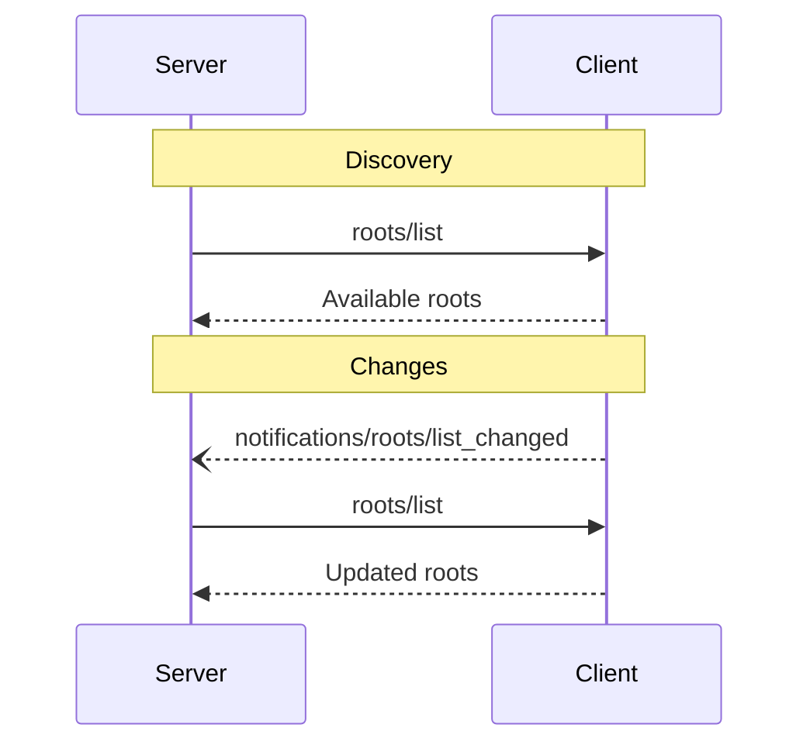

<div id="enable-section-numbers" />

<Info>**Protocol Revision**: draft</Info>

The Model Context Protocol (MCP) provides a standardized way for clients to broker filesystem operations for servers through client-mediated filesystem access. Instead of servers accessing filesystems directly, MCP clients execute filesystem operations on behalf of servers, providing secure, scoped access with user consent and centralized coordination.

## MCP Client-Brokered Filesystem Access

MCP clients act as filesystem brokers, executing operations requested by servers on the local filesystem. This approach provides several key benefits:

- **Security**: All filesystem access is mediated by the client/host with explicit user consent
- **Transport Agnostic**: Uses existing MCP JSON-RPC transport (stdio/HTTP) without additional channels
- **Centralized Control**: MCP host can coordinate concurrent access across multiple servers
- **Minimal Complexity**: No proxy setup, WebSocket connections, or separate authentication required
- **Unified Experience**: Consistent filesystem access patterns for both local and remote servers

## User Interaction Model

Filesystem access in MCP requires explicit user consent and boundary definition. Clients typically provide interfaces for:

- Selecting root directories that servers can access
- Approving filesystem operations on a per-server basis
- Monitoring and auditing filesystem activity
- Managing concurrent access across multiple servers

MCP hosts are responsible for coordinating filesystem operations when multiple clients request access to the same files, though the specific coordination mechanisms are implementation-dependent.

## Capabilities

Clients that support filesystem brokering **MUST** declare the `roots` capability during
[initialization](/specification/draft/basic/lifecycle#initialization):

```json
{
  "capabilities": {
    "roots": {
      "listChanged": true,
      "filesystemBrokering": true
    }
  }
}
```

- `listChanged` indicates whether the client will emit notifications when the list of roots changes.
- `filesystemBrokering` indicates whether the client supports executing filesystem operations on behalf of servers.

Servers that require filesystem access should check the client's `filesystemBrokering` capability and make `fs.*` requests as needed. No server capability declaration is required.

## Protocol Messages

### Listing Roots

To retrieve roots, servers send a `roots/list` request:

**Request:**

```json
{
  "jsonrpc": "2.0",
  "id": 1,
  "method": "roots/list"
}
```

**Response:**

```json
{
  "jsonrpc": "2.0",
  "id": 1,
  "result": {
    "roots": [
      {
        "uri": "file:///home/user/projects/myproject",
        "name": "My Project"
      }
    ]
  }
}
```

### Root List Changes

When roots change, clients that support `listChanged` **MUST** send a notification:

```json
{
  "jsonrpc": "2.0",
  "method": "notifications/roots/list_changed"
}
```

## Message Flow



## Data Types

### Root

A root definition includes:

- `uri`: Unique identifier for the root. This **MUST** be a `file://` URI in the current
  specification.
- `name`: Optional human-readable name for display purposes.

Example roots for different use cases:

#### Project Directory

```json
{
  "uri": "file:///home/user/projects/myproject",
  "name": "My Project"
}
```

#### Multiple Repositories

```json
[
  {
    "uri": "file:///home/user/repos/frontend",
    "name": "Frontend Repository"
  },
  {
    "uri": "file:///home/user/repos/backend",
    "name": "Backend Repository"
  }
]
```

## Error Handling

Clients **SHOULD** return standard JSON-RPC errors for common failure cases:

- Client does not support roots: `-32601` (Method not found)
- Internal errors: `-32603`

Example error:

```json
{
  "jsonrpc": "2.0",
  "id": 1,
  "error": {
    "code": -32601,
    "message": "Roots not supported",
    "data": {
      "reason": "Client does not have roots capability"
    }
  }
}
```

## Brokered Filesystem Operations

### Overview

Servers request filesystem operations through standard MCP JSON-RPC methods that begin with `fs.`. The MCP client receives these requests and executes the corresponding filesystem operations on the local machine, returning results through the same transport.

### User Consent Flow

Before executing filesystem operations, servers **MUST** request explicit user consent:

```json
{
  "jsonrpc": "2.0",
  "method": "files/consent",
  "params": {
    "message": "Server requests access to project files for analysis",
    "requestedPaths": ["/home/user/project", "/home/user/config.json"]
  },
  "id": 1
}
```

Clients **MUST** respond with user approval status:

```json
{
  "jsonrpc": "2.0",
  "result": {
    "granted": true,
    "approvedPaths": ["/home/user/project"]
  },
  "id": 1
}
```

### Brokered File Methods

Servers use standard JSON-RPC methods for filesystem operations. All methods are prefixed with `files/` and executed by the client:

#### File Reading

```json
{
  "jsonrpc": "2.0",
  "method": "files/read",
  "params": {
    "path": "project/src/main.py",
    "encoding": "utf-8",
    "offset": 0,
    "length": 1048576
  },
  "id": 1
}
```

Response:

```json
{
  "jsonrpc": "2.0",
  "result": {
    "content": "# Python file contents...",
    "size": 1234,
    "mimeType": "text/x-python"
  },
  "id": 1
}
```

#### File Writing

```json
{
  "jsonrpc": "2.0",
  "method": "files/write",
  "params": {
    "path": "project/output.txt",
    "content": "Hello, World!",
    "encoding": "utf-8",
    "create": true
  },
  "id": 2
}
```

#### Directory Listing

```json
{
  "jsonrpc": "2.0",
  "method": "files/list",
  "params": {
    "path": "project/src",
    "recursive": false,
    "includeHidden": false
  },
  "id": 3
}
```

#### File Operations

```json
{
  "jsonrpc": "2.0",
  "method": "files/create",
  "params": {
    "path": "project/new_directory",
    "type": "directory"
  },
  "id": 4
}
```

```json
{
  "jsonrpc": "2.0",
  "method": "files/delete",
  "params": {
    "path": "project/temp_file.txt"
  },
  "id": 5
}
```

```json
{
  "jsonrpc": "2.0",
  "method": "files/rename",
  "params": {
    "oldPath": "project/old_name.txt",
    "newPath": "project/new_name.txt"
  },
  "id": 6
}
```

#### File Watching

```json
{
  "jsonrpc": "2.0",
  "method": "files/watch",
  "params": {
    "path": "project/src",
    "recursive": true,
    "events": ["modified", "created", "deleted"]
  },
  "id": 7
}
```

The client sends notifications for file changes:

```json
{
  "jsonrpc": "2.0",
  "method": "notifications/files/changed",
  "params": {
    "path": "project/src/main.py",
    "event": "modified",
    "timestamp": "2025-10-30T15:30:00Z"
  }
}
```

### File Locking

The filesystem operations support optional file locking to prevent concurrent access conflicts. Locks are exclusive per file and automatically released when operations complete unless `keepLocked` is set to `true`.

#### Persistent Locking

File operations can maintain locks beyond completion:

```json
{
  "jsonrpc": "2.0",
  "method": "files/read",
  "params": {
    "path": "project/config.json",
    "keepLocked": true
  },
  "id": 8
}
```

The response includes a lock identifier:

```json
{
  "jsonrpc": "2.0",
  "result": {
    "content": "{ \"version\": \"1.0\" }",
    "size": 18,
    "mimeType": "application/json",
    "lockId": "lock_abc123def456"
  },
  "id": 8
}
```

#### Lock Release

Explicitly release a lock when no longer needed:

```json
{
  "jsonrpc": "2.0",
  "method": "files/unlock",
  "params": {
    "lockId": "lock_abc123def456"
  },
  "id": 9
}
```

#### Lock Conflicts

If a file is already locked, operations return an immediate error:

```json
{
  "jsonrpc": "2.0",
  "id": 10,
  "error": {
    "code": -32100,
    "message": "File is locked",
    "data": {
      "path": "project/config.json",
      "lockId": "lock_abc123def456",
      "lockedBy": "previous_operation"
    }
  }
}
```

### Supported Operations

| Method         | Description                              | Binary Support | Locking Support |
| -------------- | ---------------------------------------- | -------------- | --------------- |
| `files/read`   | Read file contents with chunking support | Yes (base64)   | Yes             |
| `files/write`  | Write file contents with streaming       | Yes (base64)   | Yes             |
| `files/list`   | List directory contents                  | N/A            | No              |
| `files/create` | Create files or directories              | N/A            | Yes             |
| `files/delete` | Remove files or directories              | N/A            | Yes             |
| `files/rename` | Move/rename files or directories         | N/A            | Yes             |
| `files/watch`  | Monitor filesystem changes               | N/A            | No              |
| `files/unlock` | Release an exclusive file lock           | N/A            | N/A             |

### Error Codes

| Code                   | Meaning                          |
| ---------------------- | -------------------------------- |
| `FILE_NOT_FOUND`       | Path does not exist              |
| `PERMISSION_DENIED`    | Access denied or outside root    |
| `INVALID_PATH`         | Malformed or unsafe path         |
| `IO_ERROR`             | Filesystem operation failed      |
| `TIMEOUT`              | Operation timed out              |
| `FILE_LOCKED`          | File is locked by another operation (-32100) |
| `CONCURRENCY_CONFLICT` | File locked by concurrent access |
| `QUOTA_EXCEEDED`       | Operation exceeds size limits    |

### Constraints and Limits

- **Path Scoping**: All paths **MUST** be relative to approved roots
- **Chunk Size**: Default 1MB for file operations, configurable
- **Timeouts**: 60 seconds default, extensible for large operations
- **Rate Limiting**: Clients MAY implement rate limiting and abuse prevention
- **Binary Data**: Use base64 encoding for binary content in small files
- **Large Files**: Use chunked operations with offset/length parameters

## Security Considerations

### Path Validation and Scoping

- **Root Confinement**: All operations MUST be confined to explicitly approved root directories
- **Path Traversal**: Clients MUST prevent directory traversal attacks (e.g., `../`, symbolic link escaping)
- **Absolute Paths**: Clients MUST reject absolute paths that fall outside approved roots
- **Canonicalization**: All paths MUST be canonicalized before validation

### Access Control and Permissions

- **User Consent**: All filesystem access MUST require explicit user approval
- **Granular Permissions**: Users SHOULD be able to approve specific directories rather than blanket access
- **Read-Only Mode**: Clients MAY offer read-only access as a safer default option
- **Revocation**: Users MUST be able to revoke filesystem access at any time during operation

### Transport Security

- **Existing Security**: Filesystem operations inherit the security properties of the MCP transport
- **No Additional Channels**: Eliminates security complexity of separate WebSocket connections
- **Authentication**: Uses existing MCP session authentication and authorization
- **Encryption**: Benefits from existing transport encryption (HTTPS, secure stdio)

### Concurrency and State Management

- **Host Coordination**: The MCP host coordinates filesystem access across multiple servers
- **Conflict Detection**: Clients SHOULD detect and handle concurrent file modifications
- **Atomic Operations**: File writes SHOULD be atomic when possible
- **Lock Management**: Clients MAY implement file locking to prevent corruption

### Rate Limiting and Abuse Prevention

- **Request Throttling**: Clients SHOULD implement rate limiting for filesystem operations
- **Size Limits**: Clients SHOULD enforce reasonable limits on file sizes and operation counts
- **Operation Timeouts**: All filesystem operations MUST have defined timeouts
- **Resource Monitoring**: Clients SHOULD monitor CPU and disk usage during operations

### Audit and Logging

- **Access Logs**: Clients SHOULD log all filesystem operations for security audit
- **User Notifications**: Users SHOULD receive notifications about active filesystem access
- **Error Logging**: Failed operations and security violations MUST be logged
- **Privacy**: Logs SHOULD avoid exposing sensitive file contents or paths

## Implementation Guidelines

### Client Implementation

Clients implementing brokered filesystem access **SHOULD**:

1. **User Consent Management**:
   - Present clear consent dialogs for filesystem access requests
   - Show the specific paths being requested and their purpose
   - Allow users to approve, deny, or modify requested paths
   - Provide ongoing visibility into active filesystem sessions

2. **Request Processing**:
   - Validate all `fs.*` method calls before execution
   - Canonicalize and sandbox all file paths within approved roots
   - Implement proper error handling and user-friendly error messages
   - Support chunked operations for large files

3. **Security Controls**:
   - Enforce strict path validation and root confinement
   - Implement rate limiting and abuse detection
   - Log filesystem operations for audit purposes
   - Provide mechanisms for users to revoke access

4. **MCP Host Coordination**:
   - Coordinate concurrent filesystem access across multiple MCP servers
   - Handle file locking and conflict resolution as appropriate
   - Maintain session state for active filesystem operations

### Server Implementation

Servers using brokered filesystem access **SHOULD**:

1. **Capability Negotiation**:
   - Advertise `filesystemBrokering: true` capability during initialization
   - Check for client `filesystemBrokering` capability before making `fs.*` requests
   - Handle capability negotiation failures gracefully

2. **Request Management**:
   - Request user consent before making filesystem operations
   - Use appropriate `fs.*` methods with proper parameters
   - Handle filesystem errors and network timeouts appropriately
   - Respect client-imposed rate limits and timeouts

3. **Path Handling**:
   - Use relative paths within approved root directories
   - Avoid absolute paths and directory traversal attempts
   - Handle path canonicalization differences across systems
   - Cache filesystem state appropriately while respecting concurrent changes
