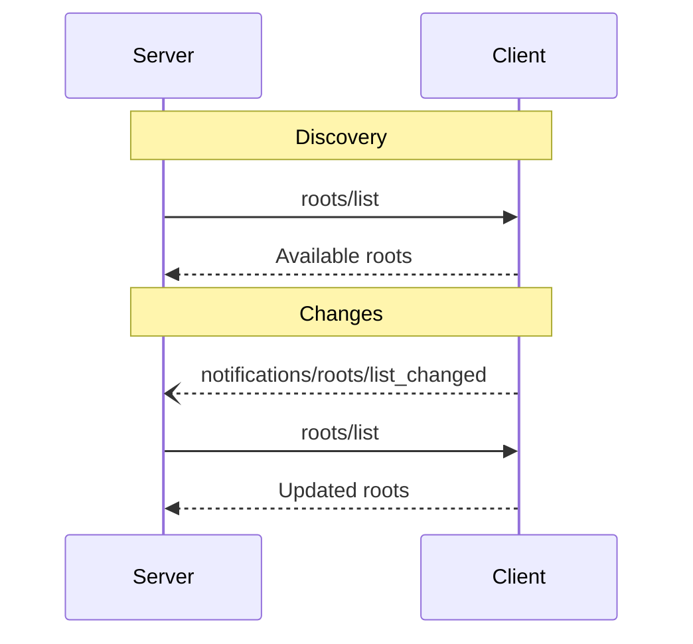

<div id="enable-section-numbers" />

<Info>**Protocol Revision**: draft</Info>

The Model Context Protocol (MCP) provides a standardized way for clients to expose
filesystem "roots" to servers. Roots define the boundaries of where servers can operate
within the filesystem, allowing them to understand which directories and files they have
access to. Servers can request the list of roots from supporting clients and receive
notifications when that list changes.

## User Interaction Model

Roots in MCP are typically exposed through workspace or project configuration interfaces.

For example, implementations could offer a workspace/project picker that allows users to
select directories and files the server should have access to. This can be combined with
automatic workspace detection from version control systems or project files.

However, implementations are free to expose roots through any interface pattern that
suits their needs&mdash;the protocol itself does not mandate any specific user
interaction model.

## Capabilities

Clients that support roots **MUST** declare the `roots` capability during
[initialization](/specification/draft/basic/lifecycle#initialization):

```json
{
  "capabilities": {
    "roots": {
      "listChanged": true,
      "remoteProxy": true
    }
  }
}
```

- `listChanged` indicates whether the client will emit notifications when the list of roots changes.
- `remoteProxy` indicates whether the client supports providing remote filesystem access to servers via WebSocket proxy connections.

Servers that require remote filesystem access **MUST** declare the `remoteProxySupported` capability:

```json
{
  "capabilities": {
    "roots": {
      "remoteProxySupported": true
    }
  }
}
```

## Protocol Messages

### Listing Roots

To retrieve roots, servers send a `roots/list` request:

**Request:**

```json
{
  "jsonrpc": "2.0",
  "id": 1,
  "method": "roots/list"
}
```

**Response:**

```json
{
  "jsonrpc": "2.0",
  "id": 1,
  "result": {
    "roots": [
      {
        "uri": "file:///home/user/projects/myproject",
        "name": "My Project"
      }
    ]
  }
}
```

### Root List Changes

When roots change, clients that support `listChanged` **MUST** send a notification:

```json
{
  "jsonrpc": "2.0",
  "method": "notifications/roots/list_changed"
}
```

## Message Flow


```mermaid
sequenceDiagram
    participant Server
    participant Client

    Note over Server,Client: Discovery
    Server->>Client: roots/list
    Client-->>Server: Available roots

    Note over Server,Client: Changes
    Client--)Server: notifications/roots/list_changed
    Server->>Client: roots/list
    Client-->>Server: Updated roots
```

## Data Types

### Root

A root definition includes:

- `uri`: Unique identifier for the root. This **MUST** be a `file://` URI in the current
  specification.
- `name`: Optional human-readable name for display purposes.

Example roots for different use cases:

#### Project Directory

```json
{
  "uri": "file:///home/user/projects/myproject",
  "name": "My Project"
}
```

#### Multiple Repositories

```json
[
  {
    "uri": "file:///home/user/repos/frontend",
    "name": "Frontend Repository"
  },
  {
    "uri": "file:///home/user/repos/backend",
    "name": "Backend Repository"
  }
]
```

## Error Handling

Clients **SHOULD** return standard JSON-RPC errors for common failure cases:

- Client does not support roots: `-32601` (Method not found)
- Internal errors: `-32603`

Example error:

```json
{
  "jsonrpc": "2.0",
  "id": 1,
  "error": {
    "code": -32601,
    "message": "Roots not supported",
    "data": {
      "reason": "Client does not have roots capability"
    }
  }
}
```

## Remote Filesystem Access

### Overview

For remote MCP servers (connected via HTTP/SSE transport), clients can provide filesystem access through a WebSocket proxy mechanism. This allows remote servers to use standard filesystem APIs while maintaining security and user consent.

### Capability Requirements

- Clients **MUST** advertise `remoteProxy: true` to support remote filesystem access
- Servers **MUST** advertise `remoteProxySupported: true` if they require filesystem access over remote connections
- If a server requires filesystem access but the client does not support `remoteProxy`, the server **MUST** return error `-32603` during initialization

### User Consent Flow

Before establishing a proxy connection, servers **MUST** request explicit user consent:

```json
{
  "jsonrpc": "2.0",
  "method": "request_filesystem_consent",
  "params": {
    "root": "file:///home/user/project",
    "reason": "Access project files for analysis"
  },
  "id": 1
}
```

Clients **MUST** respond with user approval status:

```json
{
  "jsonrpc": "2.0",
  "result": {
    "approved": true,
    "root": "file:///home/user/project"
  },
  "id": 1
}
```

### Proxy Connection Establishment

After consent, the server provides proxy connection details via a `setup_filesystem_proxy` request:

**Server Request:**

```json
{
  "jsonrpc": "2.0",
  "method": "setup_filesystem_proxy",
  "params": {
    "proxyUrl": "wss://server.example.com/proxy",
    "clientId": "client_12345",
    "token": "eyJhbGciOiJIUzI1NiIsInR5cCI6IkpXVCJ9...",
    "expiresAt": "2025-10-24T15:30:00Z"
  },
  "id": 2
}
```

**Client Response:**

```json
{
  "jsonrpc": "2.0",
  "result": {
    "connected": true,
    "proxyId": "proxy_67890"
  },
  "id": 2
}
```

The client then initiates the WebSocket connection:

1. Client connects to `wss://server.example.com/proxy?client_id=client_12345&token=eyJhbGciOiJIUzI1NiIsInR5cCI6IkpXVCJ9...`
2. Server validates credentials and accepts connection
3. Proxy protocol begins operating

### Proxy Protocol Messages

The WebSocket proxy uses JSON messages for filesystem operations:

**Server Request Format:**

```json
{
  "type": "fs_request",
  "request_id": "<uuid>",
  "action": "read|write|list|create|delete|rename|watch",
  "path": "relative/path/from/root",
  "options": {}
}
```

**Client Response Format:**

```json
{
  "type": "fs_response",
  "request_id": "<uuid>",
  "status": "success|error",
  "data": "<response_data>",
  "error_code": "<error_type>",
  "error_message": "<error_description>"
}
```

**File Change Events:**

```json
{
  "type": "fs_event",
  "path": "relative/path/from/root",
  "event": "modified|created|deleted"
}
```

### Supported Operations

- **read**: Read file contents (supports chunking for large files)
- **write**: Write file contents (supports streaming)
- **list**: List directory contents
- **create**: Create files or directories
- **delete**: Remove files or directories
- **rename**: Move/rename files or directories
- **watch**: Monitor filesystem changes

### Error Codes

| Code                | Meaning                       |
| ------------------- | ----------------------------- |
| `FILE_NOT_FOUND`    | Path does not exist           |
| `PERMISSION_DENIED` | Access denied or outside root |
| `INVALID_PATH`      | Malformed path                |
| `IO_ERROR`          | Filesystem operation failed   |
| `TIMEOUT`           | Operation timed out           |

### Constraints

- **Path Scoping**: All paths **MUST** be relative to the approved root
- **Chunk Size**: Default 1MB for file operations
- **Timeouts**: 60 seconds base timeout, extensible for large files
- **Retries**: Up to 3 retries with exponential backoff

## Security Considerations

1. Clients **MUST**:
   - Only expose roots with appropriate permissions
   - Validate all root URIs to prevent path traversal
   - Implement proper access controls
   - Monitor root accessibility
   - Obtain explicit user consent before establishing proxy connections
   - Validate all proxy requests against approved root boundaries
   - Use TLS for all proxy connections
   - Implement rate limiting and abuse prevention

2. Servers **SHOULD**:
   - Handle cases where roots become unavailable
   - Respect root boundaries during operations
   - Validate all paths against provided roots
   - Use short-lived authentication tokens for proxy connections
   - Implement proper error handling for remote filesystem failures
   - Fail fast with error `-32603` if remote filesystem access is required but unsupported

## Implementation Guidelines

1. Clients **SHOULD**:
   - Prompt users for consent before exposing roots to servers
   - Provide clear user interfaces for root management
   - Validate root accessibility before exposing
   - Monitor for root changes

2. Servers **SHOULD**:
   - Check for roots capability before usage
   - Handle root list changes gracefully
   - Respect root boundaries in operations
   - Cache root information appropriately
