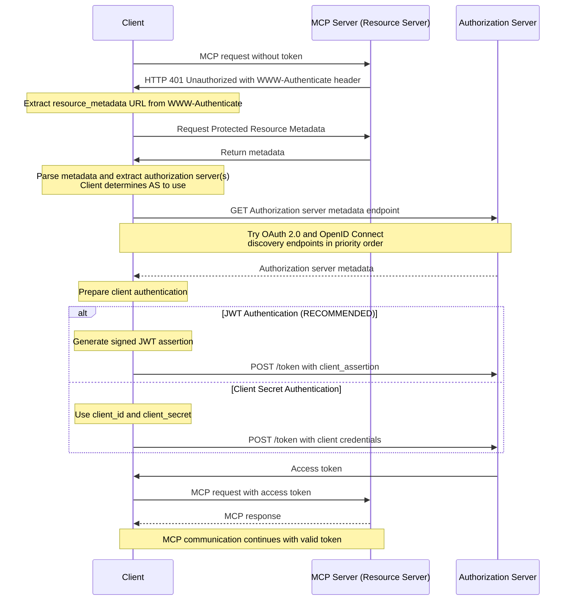

<div id="enable-section-numbers" />

<Info>**Protocol Revision**: draft</Info>

## Introduction

### Purpose and Scope

This extension defines OAuth 2.1 Client Credentials flow support for the Model
Context Protocol, enabling machine-to-machine authentication without user
interaction. This extension builds upon the baseline authorization requirements
defined in the main [Authorization specification](../basic/authorization.mdx).

### Extension Requirements

This extension is **OPTIONAL** for MCP implementations. When adopted:

- Implementations **MUST** conform to all requirements specified in this
  extension
- Implementations **MUST** also conform to the baseline authorization
  requirements
- This extension is specifically designed for HTTP-based transports

### Standards Compliance

This extension is based on the following established specifications:

- OAuth 2.1 IETF DRAFT
  ([draft-ietf-oauth-v2-1-13](https://datatracker.ietf.org/doc/html/draft-ietf-oauth-v2-1-13))
- OAuth 2.0 Authorization Server Metadata
  ([RFC8414](https://datatracker.ietf.org/doc/html/rfc8414))
- OAuth 2.0 Protected Resource Metadata
  ([RFC9728](https://datatracker.ietf.org/doc/html/rfc9728))
- JSON Web Token (JWT) Profile for OAuth 2.0 Client Authentication and
  Authorization Grants
  ([RFC7523](https://datatracker.ietf.org/doc/html/rfc7523))

## Client Credentials Flow

### Overview

The Client Credentials flow enables machine-to-machine authentication without
user interaction. This flow requires pre-registered client credentials, which
are typically established out-of-band through administrative channels. Dynamic
Client Registration is not used in this flow.

### Client Authentication Methods

Clients **MUST** authenticate using one of these methods:

- JWT Authentication (RECOMMENDED)
  - Clients use JWT Authentication as defined in
    [RFC 7523 Section 2.2](https://datatracker.ietf.org/doc/html/rfc7523#section-2.2).
- Client Secret
  - Clients use a Client Secret transmitted in the request content as defined
    in
    [OAuth 2.1 Section 2.4.1](https://www.ietf.org/archive/id/draft-ietf-oauth-v2-1-13.html#name-client-secret)

### Server Metadata Requirements

When supporting the client credentials flow, Authorization Server metadata
**MUST** include the following fields:

- `token_endpoint_auth_methods_supported`: **MUST** include at least one of:
  - `"private_key_jwt"`
  - `"client_secret_basic"`
- `token_endpoint_auth_signing_alg_values_supported`: Required when supporting
  JWT authentication

### Flow Steps

The complete Client Credentials flow proceeds as follows:



### Examples

The following examples illustrate both client authentication methods:

#### JWT Authentication Example

```
POST /token HTTP/1.1
Host: auth.example.com
Content-Type: application/x-www-form-urlencoded

grant_type=client_credentials
&client_assertion_type=urn%3Aietf%3Aparams%3Aoauth%3Aclient-assertion-type%3Ajwt-bearer
&client_assertion=eyJhbGciOiJSUzI1NiIsImtpZCI6IjIyIn0.
     eyJpc3Mi[...omitted for brevity...].
     cC4hiUPo[...omitted for brevity...]
&resource=https%3A%2F%2Fmcp.example.com
&scope=mcp%3Aread
```

> **Note:** The `client_id` parameter is omitted from the request body as
> [RFC 7523 Section 3](https://datatracker.ietf.org/doc/html/rfc7523#section-3)
> specifies that client identification is conveyed through the `sub` claim
> within the JWT assertion.

#### Client Secret Authentication Example

```
POST /token HTTP/1.1
Host: auth.example.com
Content-Type: application/x-www-form-urlencoded

grant_type=client_credentials
&client_id=s6BhdRkqt3
&client_secret=7Fjfp0ZBr1KtDRbnfVdmIw
&resource=https%3A%2F%2Fmcp.example.com
&scope=mcp%3Aread
```

## Security Considerations

Implementations adopting this extension **MUST** follow OAuth 2.1 security best
practices as laid out in
[OAuth 2.1 Section 7. "Security Considerations"](https://datatracker.ietf.org/doc/html/draft-ietf-oauth-v2-1-13#name-security-considerations),
with particular attention to:

- Client authentication security
- Token storage and handling
- Communication security requirements
- Client credential protection

For detailed security guidance specific to client credentials flows, refer to
[RFC 7523 Section 5 "Security Considerations"](https://datatracker.ietf.org/doc/html/rfc7523#section-5).
