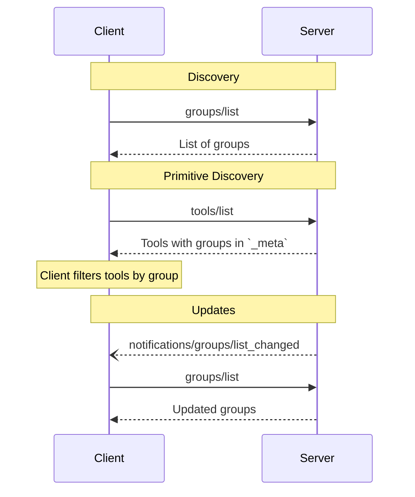

<div id="enable-section-numbers" />

<Info>**Protocol Revision**: draft</Info>

The Model Context Protocol (MCP) allows servers to organize primitives (tools, prompts, resources,
resource templates, tasks, and groups themselves) into named collections called groups. Groups provide a natural
abstraction for organizing primitives by functional areas, use cases, or access control boundaries.

## User Interaction Model

Groups in MCP are designed to be **application-controlled**, meaning that clients and hosts can
use groups to filter and organize which primitives are presented to language models.

Common use cases include:

- **Client-side Filtering**: Present only relevant primitives based on user context
- **Simplified Instructions**: Reduce cognitive load on LLMs by showing focused subsets
- **Access Control**: Enable permission boundaries at the group level
- **Progressive Disclosure**: Allow clients to present primitives in manageable subsets

Implementations are free to use groups through any interface pattern that suits their
needs&mdash;the protocol itself does not mandate any specific user interaction model.

## Capabilities

Servers that support groups **MUST** declare the `groups` capability:

```json
{
  "capabilities": {
    "groups": {
      "listChanged": true
    }
  }
}
```

`listChanged` indicates whether the server will emit notifications when the list of
available groups changes.

## Protocol Messages

### Listing Groups

To discover available groups, clients send a `groups/list` request. This operation supports
[pagination](/specification/draft/server/utilities/pagination).

**Request:**

```json
{
  "jsonrpc": "2.0",
  "id": 1,
  "method": "groups/list",
  "params": {
    "cursor": "optional-cursor-value"
  }
}
```

**Response:**

```json
{
  "jsonrpc": "2.0",
  "id": 1,
  "result": {
    "groups": [
      {
        "name": "user-management",
        "title": "User Management Tools",
        "description": "Tools used for managing user accounts within the system."
      },
      {
        "name": "mapping",
        "title": "Geospatial Mapping Tools",
        "description": "Tools for map rendering and spatial analysis.",
        "icons": [
          {
            "src": "https://example.com/mapping-icon.png",
            "mimeType": "image/png",
            "sizes": ["48x48"]
          }
        ]
      }
    ],
    "nextCursor": "next-page-cursor"
  }
}
```

### List Changed Notification

When the list of available groups changes, or when any group's metadata (such as
`title`, `description`, or `icons`) is modified, servers that declared the `listChanged`
capability **SHOULD** send a notification:

```json
{
  "jsonrpc": "2.0",
  "method": "notifications/groups/list_changed"
}
```

## Primitive Group Membership

Primitives indicate their group membership using the reserved `_meta` key
`io.modelcontextprotocol/groups`. The value is an array of group names:

```json
{
  "name": "create_user",
  "description": "Creates a new user account",
  "inputSchema": {
    "type": "object",
    "properties": {
      "username": { "type": "string" }
    }
  },
  "_meta": {
    "io.modelcontextprotocol/groups": ["user-management", "admin"]
  }
}
```

This approach allows:

- **Multi-group Membership**: A primitive can belong to multiple groups
- **Nested Groups**: Groups themselves can belong to other groups
- **Flexible Organization**: Group structure is not limited to strict hierarchies

### Nested Groups

Groups can be nested by having a group reference other groups in its `_meta`:

```json
{
  "name": "email",
  "title": "Email Tools",
  "description": "Tools for composing and sending emails.",
  "_meta": {
    "io.modelcontextprotocol/groups": ["productivity"]
  }
}
```

In this example, the `email` group is a member of the `productivity` group,
creating a hierarchy.

### Membership Changed Notifications

When primitives change their group membership, servers **SHOULD** use the appropriate
primitive-specific notification:

- Tools: `notifications/tools/list_changed`
- Prompts: `notifications/prompts/list_changed`
- Resources: `notifications/resources/list_changed`
- Resource Templates: `notifications/resources/list_changed`
- Tasks: `notifications/tasks/status`
- Groups: `notifications/groups/list_changed`

Clients receiving these notifications can re-fetch the primitive lists to discover
updated group memberships.

## Message Flow



## Data Types

### Group

A group definition includes:

- `name`: Unique identifier for the group
- `title`: Optional human-readable name of the group for display purposes
- `description`: Human-readable description of the group's purpose
- `icons`: Optional array of icons for display in user interfaces
- `annotations`: Optional additional group information
- `_meta`: Optional metadata, including group membership for nested groups

#### Group Names

TBD: Maybe similar to tool names?
