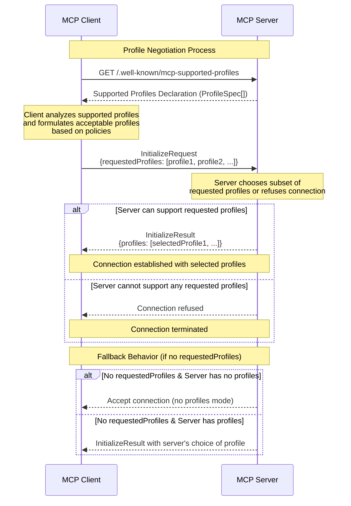

<div id="enable-section-numbers" />

<Info>**Protocol Revision**: draft</Info>

The Model Context Protocol enables the definition of a collection of behaviors and properties as Profiles. Standard Profiles are available through the Model Context Protocol, and anyone may define custom Profiles. MCP Servers can declare the profiles they support. MCP Clients can discover which profiles an MCP Server supports, request the use of specific profiles, and negotiate mutually agreed profiles to use within a session with the MCP Server.

## Why MCP Servers Need Profiles
As the Model Context Protocol ecosystem grows, organizations need assurances on the behavioral characteristics such as performance, resource consumption constraints, data residency, service levels, and security of any MCP Server. MCP Servers may also offer different levels of service to different types of customers, and MCP clients may need to act accordingly.

### The Challenge:
When an MCP client encounters a new server, it has no upfront knowledge of that server's behavioral guarantees, security posture, or operational characteristics. This uncertainty prevents organizations from being able to enforce certain policies for their use of MCP, and for consumer facing services that act as MCP Clients from complying with required regulation or adjusting behavior based on the user's relationship with the MCP Server.

### Profiles as Contracts:
Server profiles act as behavioral contracts between MCP Clients and MCP Servers. Just as USB devices declare their class (storage, audio, input device) to ensure proper driver selection, MCP Servers can declare their profiles to communicate their capabilities and constraints before any connection is established. This enables:

- **Predictable Integration**: Clients can make informed decisions about which Servers to connect with based on the Client's requirements, or how to communicate based on the Server's requirements.
- **Security Assurance**: Organizations can mandate specific security profiles across all their MCP deployments.
- **Simplified Development**: Developers can build against shared profile specifications rather than having to make their own choices for the same behaviors or properties.

Without profiles, the MCP ecosystem risks becoming a maze of implementation choices where each Server behaves differently. Profiles provide the standardization layer that enables large scale organizational deployments, and / or compliance to consumer regulations.

### Examples
#### Organizational Use
Say the following profiles are specified:
- High Security Profile: Which defines certain constraints on bearer tokens, and specifies audit requirements
- GDPR Profile: Which defines data residency requirements and data deletion requirements for users who are accessing from certain countries

An organization can now implement a policy that all of its MCP Clients must use the High Security Profile with any MCP Server, and when an MCP Client is acting interactively on behalf of a user accessing from certain countries, it must use the GDPR Profile with any MCP Server.

#### Consumer Use
Say an MCP Server specifies that "premium users" have access to higher limits in their tool usage, whereas other users will have a lower limit. The MCP Server defines its own custom "Premium Profile" to indicate this difference. An MCP Client can adjust their use of the Server's tools based on the Profile it is able to use with the Server.

## Profile Specification
Each Profile has a specification document that describes the profile in detail. The profile specification is a document written using best practices prescribed in [RFC 2119](https://datatracker.ietf.org/doc/html/rfc2119) that unambiguously specifies the characteristics of a profile.

### Profile Specification URL

A profile specification is available at the URL that is used to uniquely identify the profile. For example:

```
https://mycompany.com/mycustomprofile-1.0
```

OR

```
https://modelcontextprotocol.io/specification/2025-06-18/server/standard-profiles/minimum-authorization-profile
```

### Standard and Custom Profiles
- Standard profiles are governed by the Model Context Protocol and stored in the "Standard Profiles" folder in the Server section of this specification. Standard profiles always have the profile specification URL prefix:
  ```
  https://modelcontextprotocol.io/specification/<version>/server/standard-profiles/
  ```
- Any profiles available outside of the standard profiles location are called Custom Profiles.
- Custom Profiles may be common to many MCP Servers, or they may be specific to a single MCP Server.
- MCP Servers may simultaneously support a mix of standard and custom profiles.

### Profile Modification and Versioning
Once made available, Profiles MUST NOT be changed. In order to make changes to a Profile, the author MUST create a new version of the Profile, with its own Profile Specification URL.

## Declaring Supported Profiles
An MCP Server makes it possible for Clients to discover the profiles it supports as follows:

### ProfileSpec Object

A ProfileSpec object has the following fields:

- The location of the profile specification
- The minimum MCP version required to use that profile.

```TypeScript
interface ProfileSpec {
  "profileURL": string; 
  // The unique URL identifying the profile,
  // which is also location where the profile is specified.

  "minMcpVersion": string;
  // this is the date in YYYY-MM-DD format that identifies the MCP version.
}
```

### Supported Profiles Declaration
The profiles supported by an MCP Server are available through the Supported Profiles Declaration JSON format document that is an array of `ProfileSpec` objects:

```TypeScript
[ ProfileSpec, ProfileSpec, ...]
```

### Well-known URL
The Supported Profiles Declaration is made available by an MCP Server at its "well-known" location, as described in [RFC8615](https://datatracker.ietf.org/doc/html/rfc8615). The file name for the MCP Supported Profiles Declaration document is: `mcp-supported-profiles`. The well-known URL for the MCP Supported Profiles Declaration is obtained by inserting the path:

```
/.well-known/mcp-supported-profiles
```

between the Authority component (as defined in [Section 3.2 of RFC 3986](https://datatracker.ietf.org/doc/html/rfc3986#section-3.2)) and any Path component (as defined in [Section 3.3 of RFC 3986](https://datatracker.ietf.org/doc/html/rfc3986#section-3.3)) of the MCP Server's URL.

#### Examples:
- If an MCP server is located at: `https://mymcpserver.mycompany.com`, then the supported profiles declaration document is at: `https://mymcpserver.mycompany.com/.well-known/mcp-supported-profiles`.
- If an MCP server is located at: `https://mycompany.com/mymcpserver`, then the supported profiles declaration document is at: `https://mycompany.com/.well-known/mcp-supported-profiles/mymcpserver`.

### Backward compatibility
If the Supported Profiles Declaration resource does not exist on the MCP Server, or if the document returned is empty, then the Client MUST assume that the MCP Server does not support Profiles.

## Profile Discovery
Before connecting to an MCP Server, an MCP Client MAY fetch the Server’s Well Known URL to understand which profiles the server supports (if any).

## Initialization With Profiles
The MCP Client makes an `InitializeRequest` based on its knowledge of which (if any) profiles the MCP Server supports.

### Requested Profiles

The `InitializeRequest` object has an optional `requestedProfiles` field, whose value is an array of profile specification URLs.

```TypeScript
interface InitializeRequest extends Request {
  method: "initialize";
  params: {
    protocolVersion: string;
    capabilities: ClientCapabilities;
    clientInfo: Implementation;
    requestedProfiles?: string[];  // Optional field to request specific profiles.
  };
}
```

If the Client has no opinion of which profile to use, it omits the `requestedProfiles` field from the `InitializeRequest`. Otherwise, the Client specifies one or more profiles in the value `requestedProfiles` field of the `InitializeRequest` it sends to the MCP Server. The order of the profiles in the array is the Client's order of preference of profiles.

### Selected Profiles

The `InitializeResult` interface has an optional `profiles` field:

```TypeScript
interface InitializeResult extends Result {
  protocolVersion: string;
  capabilities: ServerCapabilities;
  serverInfo: Implementation;
  instructions?: string;
  profiles?: string[];  // When present, this field specifies the list of selected profiles.
}
```

The value of the `profiles` field is an array of one or more Profile Specification URLs of the selected Profiles. If the MCP Server has a Supported Profiles Declaration, then the MCP Server MUST have the `profiles` field in the `InitializeResult`, and its value MUST have at least one array element. If the MCP Server does not have a Supported Profiles Declaration, then the `InitializeResult` MUST NOT have a `profiles` field.

## Profile Negotiation

The following diagram outlines the negotiation flow that is described below the diagram:


1. The Client discovers the profiles supported by an MCP Server, optionally by performing a `HTTP GET` on the MCP Server's well-known Supported Profiles Declaration URL.
1. Based on its policies, the Client formulates the list of acceptable profiles and their order of preference.
1. The Client sends the `InitializeRequest` with `requestedProfiles` value with all profiles it could use in this specific instance, in the order of the Client's preference.
1. The server MUST choose a subset of the requested profiles, and include them in the `InitializeResult` response in the `profiles` field.
1. If the server cannot support any of the `requestedProfiles` values, it MUST refuse the connection.

### Fallback Behavior

If the client does not specify a requestedProfiles value in the InitializeRequest, then:

- If the Server did not declare any profiles at its Well Known URL, it accepts the InitializeRequest, as a Server that does not support Profiles would be expected to behave.
- If the Server declared profiles in its Well Known URL, then the server uses a profile of its choice.
