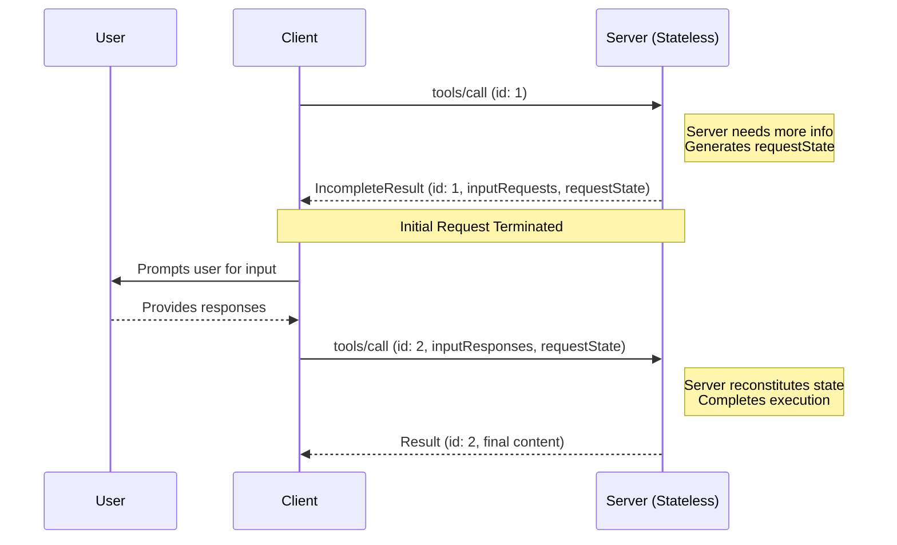

<div id="enable-section-numbers" />

<Note>
Incomplete Responses were introduced in 2026-06-30 of the MCP specification. 
This replaces the previous approach of sending server-initiated rquests. 
Servers **MUST** send server-to-client requests (such as
`roots/list`, `sampling/createMessage`, or `elicitation/create`) using Incomplete Responses.
The previous pattern of server-initiated requests is no longer supported. This is a breaking change.
</Note>

The Model Context Protocol (MCP) defines several ways for servers to request additional information
from users during the processing of client requests (such as
`roots/list`, `sampling/createMessage`, or `elicitation/create`). 

An IncompleteResponse provides a standardized way to handle server-requests without requiring a shared storage layer shared across server instances or requiring stateful load balancing.


# Protocol Messages

## Incomplete Result
`Incomplete Result` is a new `Result` type that the server uses to indicate that it needs more
 information to process a client request. This result contains a set of one or more server-initiated 
 requests, `inputRequests`, to be sent to the client.

 `inputRequests` is a map of server-client requests. Each request has a unique key (e.g., `github_login` or `capital_of_france`) 
 and specifies the type of server-client request via the `method` field (e.g., `elicitation/create` or `sampling/createMessage` or `list/roots`) 
 along with the necessary `params` for that request.

 `Incomplete Result` can be though of as a recoverable error type. It is a way for a Server to signal
 that the client should retry the request with additional information.

 - the server **MUST** create a unique key for each server-client request in inputRequests.
 - each value in the `inputRequests` map **MUST** include a `method` field that specifies the type
  of server-client request and **MUST** include additional fields that match the parameters of that request type.
- the server **MUST** set the `resultType` field to `incomplete` to indicate that this is an Incomplete Result.

```json
{
    "jsonrpc": "2.0",
    "id": 1,
    "result": {
        "resultType": "incomplete",
        "inputRequests": {
            // Elicitation request.
            "github_login": {
                "method": "elicitation/create",
                "params": {
                "mode": "form",
                "message": "Please provide your GitHub username",
                "requestedSchema": {
                    "type": "object",
                    "properties": {
                        "name": {"type": "string" }
                    },
                    "required": ["name"]
                }
                }
            },
            // Sampling request.
            "capital_of_france" : {
                "method": "sampling/createMessage",
                "params": {
                    "messages": [{
                        "role": "user",
                        "content": {
                            "type": "text",
                            "text": "What is the capital of France?"
                        }
                    }],
                    "modelPreferences": {
                        "hints": [{"name": "claude-3-sonnet"}],
                        "intelligencePriority": 0.8,
                        "speedPriority": 0.5
                    },
                    "systemPrompt": "You are a helpful assistant.",
                    "maxTokens": 100
                }
            }
        }
    }
}
```

## Input Response
Upon receiving an `Incomplete Result` with `inputRequests`, the client is expected 
to prompt the user for the requested information and create an `inputResponses` object.
The `inputResponses`. The client then replays the original Request incluindg the `inputResponses` object.

- The client **MUST** match the keys in `inputResponses` with the keys in `inputRequests` to correlate responses with requests.
- The client **MUST** include all required fields in the response that match the request type. (i.e. an Elicitation Request must map to an ElicitResult).
- The client **MUST** send a new Request with a different `id` field from original request. The new Request 
    **MUST** include the `inputResponses` and **SHOULD** include the original parameters as well. The client **MAY** choose
    to alter the original parameters if appropriate (e.g., if the client needs to change the request parameters based on user input or other factors).

```json
{
    "jsonrpc": "2.0",
    "id": 2, 
    "method": "tools/call",
    "params": {
        "name": "get_weather",
        "arguments": {
            "location": "New York"
            },
        "inputResponses": {
            // Elicitation response (ElicitResult).
            "github_login": {
                "action": "accept",
                "content": {
                "name": "octocat"
                }
            },
            // Sampling response (CreateMessageResult).
            "capital_of_france": {
                "role": "assistant",
                "content": {
                "type": "text",
                "text": "The capital of France is Paris."
                },
                "model": "claude-3-sonnet-20240307",
                "stopReason": "endTurn"
            }
        } 
    }
}
```

# Message Flow



# Capabilities
TODO Caitie - add language on how servers need to respect client capabilities when generating Incomplete Results.


