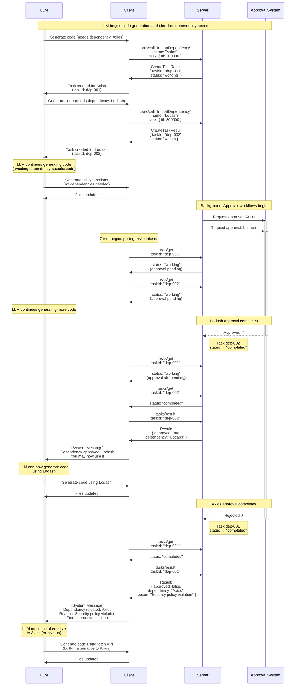

# Enterprise Automation: Concurrent Dependency Approval

## The Use Case

Enterprise code generation platforms often require governance controls around dependencies. Before an LLM can use a third-party library, it must pass through approval workflows:

- Automated security scanning
- License compliance checks
- Policy validation
- Optional human review

These workflows take seconds to minutes. During this time, the LLM should continue generating code rather than waiting idle.

## Mapping to Tasks

### Request Phase

When the LLM identifies needed dependencies, the client creates task-augmented tool calls. The server immediately returns task IDs without waiting for approval workflows to complete. The LLM continues generating code that doesn't depend on these libraries yet.

### Sequence Diagram

### Concurrent Execution

Both approval workflows run in parallel on the backend. The client polls both tasks, not knowing which will complete first. In this example, Lodash (requested second) completes before Axios (requested first).

### Result Delivery

When Lodash approval completes, the client:

1. Calls `tasks/result dep-002` to fetch the approval decision
2. Delivers the approval as a system message to the LLM
3. The LLM can now generate code using Lodash

When Axios approval completes with a rejection:

1. Client fetches the rejection reason via `tasks/result dep-001`
2. Delivers the rejection as a system message to the LLM
3. The LLM adapts by using the built-in `fetch` API instead

## Why This Maps Well to Tasks

**Concurrent workflows**: The approval system naturally processes multiple requests in parallel. Tasks expose this concurrency so that inference can continue.

**Unpredictable timing**: Approval workflows vary widely in duration. Some complete in seconds; others require human review. Tasks accommodate this variability—the client polls until completion, regardless of how long it takes.

**Partial success**: Not all dependencies may be approved. Tasks let the LLM receive results independently and adapt to each decision. Work isn't all-or-nothing.

## Key Takeaway

Tasks enable concurrent execution for operations that naturally take time. The dependency approval scenario demonstrates the pattern: request what you need, continue working, receive results asynchronously as they complete.

This same pattern applies across multiple domains:

**Data analysis**: Submit computational jobs (e.g., molecular analysis, drug interaction modeling) that process for hours while the LLM continues other work.

**Code operations**: Trigger migrations or transformations across repositories that run for minutes to hours, checking results when ready.

**Test execution**: Launch comprehensive test suites that run in the background, checking results when ready rather than blocking until all tests complete.

**Research workflows**: Dispatch multiple research agents that gather and synthesize information over extended periods.

**Multi-agent systems**: Allow agents to delegate time-intensive reasoning or analysis tasks to peer agents without blocking their own execution.

In each case, the core benefit is the same: multiple requests processed in parallel, with varying completion times and outcomes, while the LLM remains productive.
