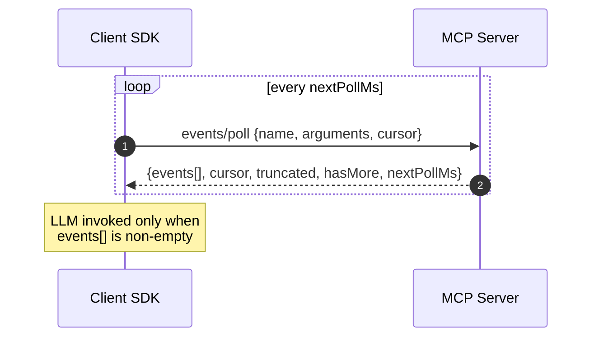
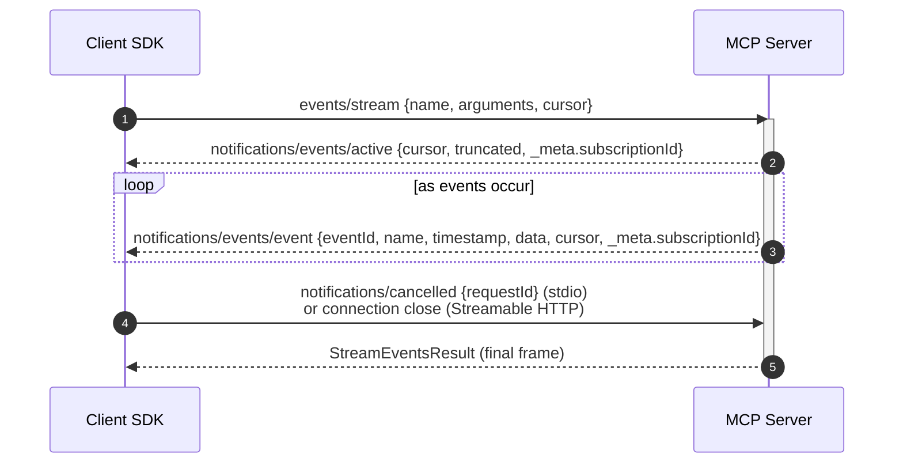
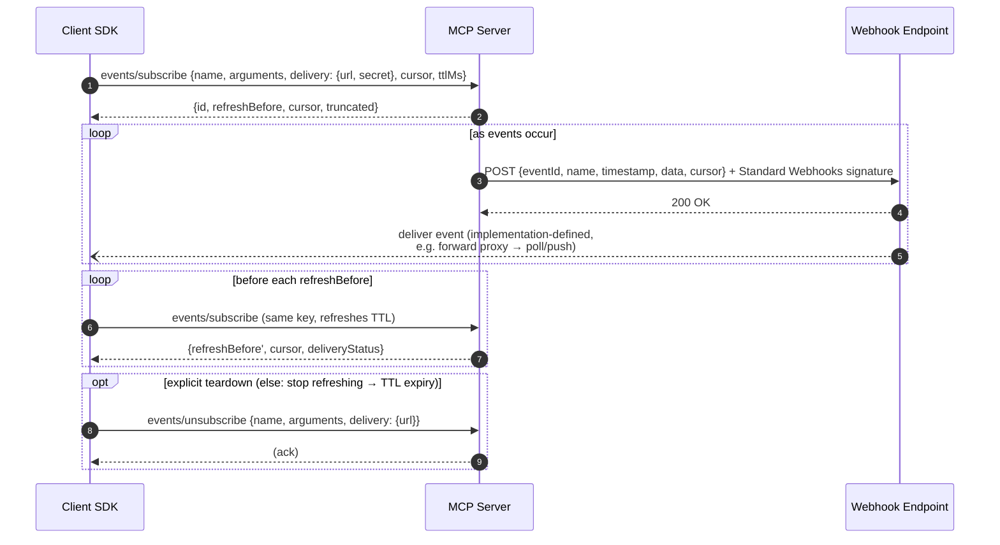
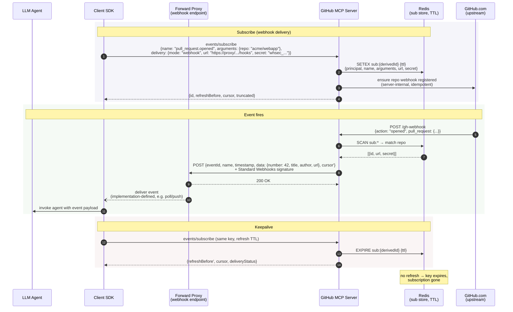

# SEP-3415: Events Extension

- **Status**: Draft
- **Type**: Extensions Track
- **Created**: 2026-10-05
- **Author(s)**: Peter Alexander (@pja-ant)
- **Sponsor**: @pja-ant
- **Extension Identifier**: `io.modelcontextprotocol/events`
- **PR**: https://github.com/modelcontextprotocol/modelcontextprotocol/pull/3415

## Abstract

This SEP defines Events, an extension that lets an MCP client subscribe to things that happen in an upstream system, such as a Slack message, a GitHub push or a PagerDuty incident, and have an agent react when they occur without the user being present.

A server lists its event types with `events/list`. Each event type has a name, an `inputSchema` for subscription arguments, a `payloadSchema`, and the delivery modes it supports. A client subscribes with `(name, arguments)` and receives event occurrences of the form `{eventId, name, timestamp, data, cursor}`.

There are three delivery modes, advertised per event type, and none is mandatory. Poll (`events/poll`) is request/response. Push (`events/stream`) is a long-lived request that delivers events as notifications. Webhook (`events/subscribe`) registers an `https` callback URL, and the server POSTs signed events to it under a TTL that the client refreshes. An opaque, server-defined cursor lets a client resume after a disconnect. Replay is optional per event type, and `truncated: true` signals that events were skipped.

The client owns the canonical list of subscriptions. Authorization uses the same MCP principal as tools, and event payloads are untrusted data, like tool results.

## Motivation

MCP is request-driven: a user or a model asks, and a server answers. Agents increasingly need to act on things that happen when nobody is asking, such as a new email, a push to a repository or a production incident. Today a client learns about server-side changes only by polling or by holding a connection open, and there is no standard way for a server to say what can be watched, with which parameters, and what will be delivered.

The notifications MCP already has do not cover this.

- **They are content-addressed and carry no parameters.** `notifications/resources/updated` says that a URI changed, and the `list_changed` family says that a list changed. Neither can express "a P1 incident was created for service X", because there are no subscription arguments, no payload schema and no payload.
- **They need a live connection.** They are delivered only on an open `subscriptions/listen` stream. A client that is not connected receives nothing, and there is no way to deliver to a client that cannot hold a stream open.
- **They cannot be resumed.** There is no cursor, so whatever happens during a disconnect is lost, and the client cannot tell that it missed anything.

The deployments that need events are also disjoint. A stateless or serverless server cannot hold a connection per subscriber. A client behind NAT has no public endpoint to receive a callback. A battery- or cost-sensitive client should not poll. A single delivery mechanism strands at least one of these, which is why this extension defines three (see [Rationale](#rationale)).

[SEP-1686](./1686-tasks.md) listed webhook-style completion notifications as a future consideration for Tasks. The [Triggers & Events Working Group](https://modelcontextprotocol.io/community/triggers-events/charter) was chartered to define that mechanism in general form: how a server tells a client that something happened, with a defined subscription lifecycle, delivery semantics and ordering guarantees that hold across transports. This SEP is that definition.

## Specification

This extension is defined for protocol revision `2026-07-28` and later. It relies on per-request client capabilities, `server/discover` and `subscriptions/listen`, which earlier revisions do not have.

Two conventions apply throughout:

- Every result this extension defines is a standard `Result` and carries `resultType: "complete"`.
- Error codes are referred to by name. [Error Handling](#error-handling) gives the numeric codes.

### Extension Identifier

This extension is identified as `io.modelcontextprotocol/events`.

### Working Group and Extension Maintainers

The extension is owned by the [Triggers & Events Working Group](https://modelcontextprotocol.io/community/triggers-events/charter). Its Extension Maintainers are the Working Group leads, currently Clare Liguori (@clareliguori) and Peter Alexander (@pja-ant).

The extension is incubated in [`experimental-ext-triggers-events`](https://github.com/modelcontextprotocol/experimental-ext-triggers-events). When this SEP is accepted, the specification is published in an official extension repository as [SEP-2133](./2133-extensions.md) describes.

### Capability Negotiation

Events is declared through [Extension Negotiation](https://modelcontextprotocol.io/specification/2026-07-28/basic/versioning#extension-negotiation): the identifier appears as a key in the `extensions` field of capabilities, mapped to the extension's settings object.

A server advertises event support in the capabilities it returns from `server/discover`:

```jsonc
{
  "result": {
    // Other response fields...
    "capabilities": {
      "extensions": {
        "io.modelcontextprotocol/events": {
          "listChanged": true,
        },
      },
    },
  },
}
```

The server's settings object has one member: `listChanged` (boolean, optional, default `false`), which says whether the server sends `notifications/events/list_changed` (see [Dynamic event types](#dynamic-event-types)). An empty settings object declares event support with no list-change notifications.

A client MAY declare the same identifier with an empty settings object, in its per-request capabilities, to indicate that it understands the extension:

```jsonc
{
  // Other request fields...
  "params": {
    "_meta": {
      "io.modelcontextprotocol/clientCapabilities": {
        "extensions": {
          "io.modelcontextprotocol/events": {},
        },
      },
    },
  },
}
```

**Fallback.** All `events/*` requests are client-initiated. A client MUST NOT send them to a server that has not advertised the extension, and a server that does not offer it answers any `events/*` request with `-32601` (Method not found). The only message this extension adds outside an `events/*` request is `notifications/events/list_changed`, which a client receives only if it opts in on a `subscriptions/listen` stream. Neither party changes its core protocol behavior when the other does not support Events.

### Delivery Modes

There are three delivery modes, with different subscription mechanisms. An event type advertises any non-empty subset of them.

- **Poll.** The client calls `events/poll` with the event name, arguments and cursor. There is no separate subscribe step: the first poll with a `null` cursor bootstraps the subscription. The server holds no protocol-required state.
- **Push.** The client opens a long-lived `events/stream` request per subscription. The server delivers events on the request's response stream (Streamable HTTP) or as notifications on stdout (stdio). Closing or cancelling the request ends the subscription. Server state is scoped to the lifetime of the request.
- **Webhook.** The client calls `events/subscribe` to register a callback URL, and the server POSTs events to that URL as they occur. The subscription has a TTL negotiated at subscribe time: the client suggests a lifetime and the server grants one, possibly with no expiry (see [Subscription TTL](#subscription-ttl)). Unless it was granted no expiry, the client refreshes by calling `events/subscribe` again before the TTL expires. If it stops, the subscription expires and the server reclaims its resources. Webhook is designed for remote servers where a long-lived connection is impractical.

The client SDK chooses the mode and runs the loop. The model sees only the events that arrive.

### Listing Available Events

#### Request: `events/list`

```jsonc
// params (optional)
{ "cursor": "..." } // pagination
```

#### Response

```jsonc
{
  "resultType": "complete",
  "events": [
    {
      "name": "email.received",
      "description": "Fires when a new email arrives in the inbox",
      "delivery": ["poll"],
      "inputSchema": {
        "type": "object",
        "properties": {
          "from": {
            "type": "string",
            "description": "Glob pattern for sender address",
          },
          "subject_contains": { "type": "string" },
          "redact_pii": {
            "type": "boolean",
            "default": false,
            "description": "Strip PII from event payloads",
          },
          "include_body_preview": {
            "type": "boolean",
            "default": true,
            "description": "Include a snippet of the email body",
          },
        },
      },
      "payloadSchema": {
        "type": "object",
        "properties": {
          "messageId": { "type": "string" },
          "from": { "type": "string" },
          "subject": { "type": "string" },
          "receivedAt": { "type": "string", "format": "date-time" },
        },
      },
    },
    {
      "name": "incident.created",
      "description": "Fires when a new PagerDuty incident is created",
      "delivery": ["webhook", "push", "poll"],
      "inputSchema": {
        "type": "object",
        "properties": {
          "severity": { "type": "string", "enum": ["P1", "P2", "P3", "P4"] },
          "service": { "type": "string" },
          "deduplicate_window_seconds": {
            "type": "integer",
            "default": 0,
            "description": "Suppress duplicate alerts within this window",
          },
        },
      },
      "payloadSchema": { "...": "..." },
      "_meta": { "...": "..." }, // optional; same semantics as on Tool/Resource/Prompt
    },
  ],
  "nextCursor": "...", // present when more pages are available; same semantics as tools/list
}
```

- `delivery` lists the delivery modes the event type supports. It is any non-empty subset of `"poll"`, `"push"` and `"webhook"`. No mode is mandatory. A client that cannot use any of the listed modes cannot subscribe to the event type.
- `inputSchema` is a JSON Schema for valid subscription arguments. Arguments may be filters (which narrow the event stream), transforms (which modify payloads) or other server-defined configuration. This mirrors the `inputSchema`/`arguments` pairing on tools.
- `payloadSchema` is a JSON Schema for `data` in delivered events.

**Schema evolution.** A subscription can outlive the `events/list` response it was created from. Servers SHOULD therefore evolve an event type's `inputSchema` and `payloadSchema` additively for the lifetime of its `name`:

- New optional fields MAY be added.
- Existing fields SHOULD NOT be removed, renamed or retyped.
- Enums SHOULD NOT be narrowed.
- `inputSchema` SHOULD NOT be tightened so that previously accepted `arguments` become invalid. A webhook refresh re-sends them, and would fail with `InvalidParams`.

A breaking change SHOULD instead be published under a new event name and served alongside the old one for a migration period, after which the old name is removed (see [Event type removal and breaking changes](#event-type-removal-and-breaking-changes)).

#### Dynamic event types

If the set of available event types changes at runtime, or the descriptor of any of them changes (`description`, `delivery`, `inputSchema`, `payloadSchema`), a server that declared `listChanged: true` sends `notifications/events/list_changed`. Examples are a plugin being loaded, a data source being connected, or a schema gaining a field. The client SHOULD call `events/list` again to refresh its registry of event types. This is consistent with `notifications/tools/list_changed` and `notifications/resources/list_changed`.

Like the core `list_changed` notifications, it is delivered only on a `subscriptions/listen` stream, and only when the client opted in. This extension adds one field to the `notifications` filter of `subscriptions/listen`:

```typescript
export interface SubscriptionFilter {
  // Other existing fields...
  /**
   * If true, receive notifications/events/list_changed.
   */
  eventsListChanged?: boolean;
}
```

The server echoes `eventsListChanged` in `notifications/subscriptions/acknowledged` if it agrees to honor it. A server that did not declare `listChanged: true` omits it from the acknowledged filter.

#### Event type removal and breaking changes

When a server stops offering an event type, or changes its `inputSchema` or `payloadSchema` incompatibly in place (contrary to _Schema evolution_ above), existing subscriptions to that name no longer hold a valid contract. The server SHOULD end them with each mode's termination signal (see [Subscription Termination](#subscription-termination)): `notifications/events/terminated` on push streams, and a `terminated` envelope to webhook subscriptions.

The `error` is:

- `NotFound` with `data: {"kind": "event"}` when the type was removed.
- `Unsupported` with `data: {"feature": "payloadSchema" | "inputSchema", "reason": "schema_changed"}` when it was changed in place.

It is not `Forbidden`, because the principal's access is unchanged. The client SDK therefore fetches `events/list` again and resubscribes against the current descriptor, and does not treat the termination as an authorization failure. Purely additive changes MUST NOT terminate subscriptions.

Poll holds no server-side subscription to terminate. A poll against a removed name already returns `NotFound`. For an in-place change, a server that wants to force rediscovery MAY mint cursors that encode a schema epoch and answer a stale one with the same `Unsupported` error. Otherwise poll clients pick up the change on their next `events/list`.

### Event Occurrences

Each entry in a poll result's `events[]`, the params of `notifications/events/event`, and the body of a webhook event delivery is an `EventOccurrence`. Push notifications additionally carry the stream's subscription ID in `_meta` (see [Push-Based Delivery](#push-based-delivery)). Webhook delivery also sends control bodies that are not events (see [Non-event webhook bodies](#non-event-webhook-bodies)).

| Field       | Type              | Required | Description                                                                                                                                                                                                   |
| ----------- | ----------------- | -------- | ------------------------------------------------------------------------------------------------------------------------------------------------------------------------------------------------------------- |
| `eventId`   | string            | yes      | Stable identifier for deduplication.                                                                                                                                                                          |
| `name`      | string            | yes      | Event type name.                                                                                                                                                                                              |
| `timestamp` | string (ISO 8601) | yes      | When the event occurred.                                                                                                                                                                                      |
| `data`      | object            | yes      | Payload that conforms to the event type's `payloadSchema`.                                                                                                                                                    |
| `cursor`    | string \| null    | no       | Subscription position after this event. Push and webhook only; poll carries the cursor at the response level. `null` when the event type does not support replay (see [Cursor Lifecycle](#cursor-lifecycle)). |
| `_meta`     | object            | no       | Reserved for protocol and extension metadata, consistent with `_meta` on other MCP types. Not governed by `payloadSchema`.                                                                                    |

`eventId` enables client-side deduplication, for example across polls after a crash and restart. It is assigned by the server. When the upstream source provides a stable event identifier (a Stripe `evt_*`, a GitHub delivery GUID, a Kafka offset, a Gmail message ID), the server SHOULD use that value as `eventId`. The same upstream event surfaced by more than one path, such as a webhook emit and a poll backfill, then carries the same `eventId`, and deduplication works. A server SDK generates an `eventId` only when the author supplies none.

### Poll-Based Delivery

The client SDK calls `events/poll` at the interval the server recommends. This is a protocol-level operation, not an LLM tool call.



#### Request: `events/poll`

Each `events/poll` request carries one subscription. A client with several subscriptions runs one poll loop per subscription.

```jsonc
{
  "name": "email.received",
  "arguments": {
    "from": "*@anthropic.com",
    "redact_pii": true,
  },
  "cursor": null, // null = start from now
  "maxAgeMs": 300000, // optional; do not replay events older than this many milliseconds (see Cursor Lifecycle)
  "maxEvents": 50, // optional; cap events returned
}
```

#### Response

```jsonc
{
  "resultType": "complete",
  "events": [
    {
      "eventId": "evt_001",
      "name": "email.received",
      "timestamp": "2026-02-19T15:30:00Z",
      "data": {
        "messageId": "msg_xyz",
        "from": "dsp@anthropic.com",
        "subject": "MCP spec review",
        "receivedAt": "2026-02-19T15:29:58Z",
      },
    },
  ],
  "cursor": "historyId_99842",
  "truncated": false,
  "hasMore": false,
  "nextPollMs": 30000,
}
```

- `cursor` is opaque to the client. The client stores it and passes it back on the next poll. In the request, `null` means "start from now": the server returns no events and a fresh cursor for later polls. In the response, the server MAY return `cursor: null` for an event type that does not support replay. The client then has nothing to persist and always polls with `null` (see [Cursor Lifecycle](#cursor-lifecycle)).
- `maxEvents` is an optional cap on the number of events returned. If more events are available than the cap, the server returns a partial batch with an intermediate cursor and sets `hasMore: true`. If it is omitted, the server uses its own default.
- `hasMore` says whether more events are available beyond the returned batch. When it is `true`, the client SHOULD poll again immediately with the updated cursor, ignoring `nextPollMs`, to drain the backlog. When it is `false`, the client waits `nextPollMs` before the next poll.
- `nextPollMs` lets the server adjust polling frequency, for example to back off when it is rate-limited upstream or to speed up when it sees activity. It is ignored when `hasMore` is `true`. Clients SHOULD apply a configurable floor (default 1000 ms) so that a misbehaving server cannot induce a tight loop.
- An empty `events` array means nothing happened. This is the common case and should be cheap.
- The server holds no protocol-required state per client. Each poll request is self-contained: the client provides the event name, arguments and cursor, and the server does not need to remember earlier polls to answer it. A server SDK MAY hold ephemeral derived state, such as a poll-lease table to drive lifecycle hooks, or a ring buffer of recent events for emit-only event types. Neither is required to answer a poll, both can be rebuilt, and neither is owed to any particular client (see [Appendix A](#appendix-a-sdk-guidance-non-normative)).
- Errors (`NotFound`, `Forbidden`, `InvalidParams`, `Unsupported`) are returned as a standard JSON-RPC error response. There is no partial-success model, because each request carries one subscription.

### Push-Based Delivery

Push delivery uses a long-lived `events/stream` request, one per subscription. The client opens a stream for each subscription, and the server delivers events as they occur. The request is a standard JSON-RPC request with an `id`. The `id` enables cancellation with `notifications/cancelled`, and is echoed in every notification for routing.

The stream follows the same conventions as the core `subscriptions/listen` stream: a confirmation notification comes first, every notification carries the subscription ID in `_meta`, and an empty result closes the stream gracefully. The mechanism differs by transport:

- **Streamable HTTP.** The `events/stream` request is a POST that returns an SSE response stream. The client cancels by aborting the request stream (TCP close on HTTP/1.1, `RST_STREAM` on HTTP/2). No explicit cancellation message is needed.
- **stdio.** The `events/stream` request is written to stdin, and the server delivers events as JSON-RPC notifications on stdout. There is no connection to close, so the client cancels by sending `notifications/cancelled` with the request's `id`.

The stream carries only this subscription's `notifications/events/*` messages. It is not a general server-to-client channel. Other notifications (`notifications/tools/list_changed`, `notifications/resources/updated`, progress, logging) continue to use the mechanisms the core protocol provides, and are unaffected by this extension.



#### Request: `events/stream`

```jsonc
// Streamable HTTP: POST to the MCP endpoint
// stdio: written to stdin
{
  "jsonrpc": "2.0",
  "method": "events/stream",
  "id": 1,
  "params": {
    "name": "email.received",
    "arguments": { "from": "*@anthropic.com", "redact_pii": true },
    "cursor": null,
    "maxAgeMs": 300000,
  },
}
```

#### Event delivery

If the subscription is invalid (`NotFound`, `Forbidden`, `InvalidParams`, `Unsupported`), the server responds immediately with a JSON-RPC error and no stream is opened. Otherwise the server confirms the subscription with `notifications/events/active`, and then delivers events as notifications.

Every `notifications/events/*` message carries the JSON-RPC `id` of the parent `events/stream` request in `params._meta["io.modelcontextprotocol/subscriptionId"]`, the correlation key the core protocol defines for subscription streams. A client with several concurrent streams, especially on stdio where they all share one stdout, uses it to route notifications to the right stream.

```jsonc
// Confirmation
{"jsonrpc":"2.0","method":"notifications/events/active","params":{"cursor":"historyId_99840","truncated":false,"_meta":{"io.modelcontextprotocol/subscriptionId":1}}}

// Events as they occur
{"jsonrpc":"2.0","method":"notifications/events/event","params":{"eventId":"evt_001","name":"email.received","timestamp":"2026-02-19T15:30:00Z","data":{"messageId":"msg_xyz","from":"dsp@anthropic.com","subject":"MCP spec review"},"cursor":"historyId_99842","_meta":{"io.modelcontextprotocol/subscriptionId":1}}}

// Transient per-occurrence error (stream stays open)
{"jsonrpc":"2.0","method":"notifications/events/error","params":{"error":{"code":-32603,"message":"UpstreamError","data":{"reason":"Gmail API 503"}},"_meta":{"io.modelcontextprotocol/subscriptionId":1}}}

// Final frame when the server closes the stream (StreamEventsResult)
{"jsonrpc":"2.0","id":1,"result":{"resultType":"complete","_meta":{"io.modelcontextprotocol/subscriptionId":1}}}
```

`notifications/events/error` reports a recoverable failure, such as a single failed upstream fetch. The subscription stays active, and the server retries and resumes. Only `notifications/events/terminated` ends the subscription (see [Subscription Termination](#subscription-termination)).

A gap, such as a cursor that fell outside the upstream's retention window, is not an error. The server sends a fresh `notifications/events/active` with `truncated: true` and a new cursor, and continues delivering (see [Cursor Lifecycle](#cursor-lifecycle)).

On Streamable HTTP, notifications are SSE `data:` frames. When the server ends the stream it sends the `StreamEventsResult` as the final `data:` frame. When the client ends it by aborting the request stream, no result can be sent. On stdio, notifications are newline-delimited JSON messages on stdout.

#### Lifecycle

- **Stream termination.** The `StreamEventsResult` is an empty result that carries only `resultType` and the subscription ID in `_meta`, mirroring `SubscriptionsListenResult`. It carries no information. It satisfies the JSON-RPC requirement that every request gets a response, and all meaningful content is in the notifications before it. It is sent whenever the server can write a final frame: on Streamable HTTP only when the server initiates the close, and on stdio at the server's discretion. Clients MUST NOT depend on receiving it.
- **Heartbeat.** The server MUST send periodic keepalive messages on the push stream, so that the client can tell "nothing to send" from "the connection is dead". The heartbeat is `{"jsonrpc":"2.0","method":"notifications/events/heartbeat","params":{"cursor":"historyId_99850","_meta":{"io.modelcontextprotocol/subscriptionId":1}}}`. `cursor` is the position the server has checked up to, so the client's persisted cursor advances even when no events match (see [Cursor Lifecycle](#cursor-lifecycle)). It is `null` for event types that do not support replay. On Streamable HTTP the heartbeat is an SSE `data:` frame. The SSE comment form (`: keepalive`) is not used, because it cannot carry cursor state. The server SHOULD send a heartbeat at least every 30 seconds. Clients SHOULD NOT apply their default request timeout to `events/stream`: the heartbeat is the liveness signal. A client that has received neither an event nor a heartbeat for more than twice the heartbeat interval SHOULD treat the stream as dead and reconnect with its cursor.
- **Cancellation.** On Streamable HTTP, the client aborts the request stream. On stdio, the client sends `notifications/cancelled` with the `requestId` of the `events/stream` request. In both cases the server MUST stop delivering events and release the associated resources. On stdio, the server MAY then send the `StreamEventsResult`. The core protocol says servers SHOULD NOT respond to cancelled requests, so omitting it is the expected behavior. On Streamable HTTP, the abort is the terminal signal and no result is sent.
- **Concurrent streams.** A client MAY hold several concurrent `events/stream` requests open, one per subscription. To add a subscription it opens another stream, and to remove one it cancels only that stream. On HTTP/1.1 each stream consumes a TCP connection, so a client with many subscriptions effectively depends on HTTP/2 multiplexing. On stdio, concurrent streams share stdout and are demultiplexed by `_meta["io.modelcontextprotocol/subscriptionId"]`. Server SDKs MUST exempt `events/stream` from any general cap on concurrent requests, because each push subscription is a long-lived request that does not complete until it is cancelled.
- **Reconnection after failure.** If the connection drops (HTTP) or the server stops sending (stdio), the client sends a new `events/stream` with the same subscription and its last known cursor.

#### Cursor advancement

Each event notification on the push stream includes a `cursor` field, which is the subscription's position after this event. The client tracks the latest cursor per subscription for use when it reconnects. The server MAY send `cursor: null` for event types that do not support replay (see [Cursor Lifecycle](#cursor-lifecycle)).

### Webhook-Based Delivery

Webhook delivery is for remote MCP servers where a long-lived connection (push) or frequent polling is impractical. The server POSTs events to a callback URL that the client provides. Webhook subscriptions are TTL-scoped: the client suggests a lifetime, the server grants one, and the subscription expires if the client stops refreshing before the granted expiry. The TTL is the server's resource-control knob. Short grants keep subscriptions as in-memory soft state that expiry cleans up. Long or no-expiry grants shift the durability and cleanup burden onto the server (see [Subscription TTL](#subscription-ttl)).

The callback URL does not need to be the client itself. A common deployment is a forward proxy that receives webhooks and serves events to clients by poll or push:

```
Upstream → MCP Server → webhook POST → Forward Proxy ← Client (poll or push)
```



#### Subscribing: `events/subscribe`

Unlike poll and push, webhook delivery needs an explicit subscribe step, because the server has to know where to POST events. `events/subscribe` is idempotent: calling it again with the same subscription key (see [Subscription identity](#subscription-identity)) refreshes the TTL and updates the mutable fields. This is how clients keep subscriptions alive.

```jsonc
{
  "jsonrpc": "2.0",
  "method": "events/subscribe",
  "id": 2,
  "params": {
    "name": "incident.created",
    "arguments": { "severity": "P1" },
    "delivery": {
      "mode": "webhook",
      "url": "https://proxy.example.com/hooks/client123",
      "secret": "whsec_<base64-of-24-to-64-random-bytes>",
    },
    "cursor": null,
    "maxAgeMs": 300000,
    "ttlMs": 3600000, // suggested TTL; omit = server default, null = request no expiry (see Subscription TTL)
  },
}
```

```jsonc
// Response
{
  "resultType": "complete",
  "id": "sub_a3f1c8e2b0d49f7e", // server-derived; stable for this (principal, url, name, arguments)
  "refreshBefore": "2026-02-19T16:30:00Z", // authoritative grant; SHOULD be ≤ the suggested ttlMs; null = no expiry
  "cursor": "cursor_start_001", // safe-to-persist watermark; advances the client's cursor even if no events arrive before the next refresh
  "truncated": false, // true if delivery started later than the supplied cursor
}
```

- `events/subscribe` is used only for webhook delivery. Poll and push do not need it.
- `delivery.secret` is REQUIRED. The client supplies the HMAC signing secret, and the server never generates one. The value MUST be a Standard Webhooks symmetric secret: the literal prefix `whsec_` followed by the base64 encoding of 24 to 64 random bytes. Servers MUST reject other values with `InvalidParams`. Client SDKs SHOULD generate the secret for the application, and SHOULD NOT expose an interface that encourages hand-picked values.
- `id` (response only) is a server-derived handle for the subscription, deterministic over `(principal, delivery.url, name, arguments)`. The server returns it so that the receiver can route deliveries: it appears in the `X-MCP-Subscription-Id` header on every POST. It is stable across refreshes and server restarts. The client does not generate or send it.
- `cursor` (request) tells the server where to begin delivery. `null` means "start from now". A non-null value requests replay from that position, and is honored when the event type is backed by a durable upstream. The cursor is owned by the client. The server does not persist a cursor position per subscription across restarts. It computes a safe-to-persist watermark, includes it in each delivered payload (see [Webhook event delivery](#webhook-event-delivery)), and returns the same watermark in each subscribe or refresh response, so the client's cursor advances during quiet periods. Both sources carry the same semantics, so the client persists whichever it received most recently and supplies it on every refresh. If the subscription is live, the supplied cursor is at or behind the server's in-flight position, and the server treats it as a no-op: delivery continues uninterrupted. If the subscription has lapsed or the server has restarted, the cursor becomes the replay point. Clients therefore follow a single rule, which is to always pass the last persisted cursor, and the server is idempotent under it.
- `cursor` (response) is the same safe-to-persist watermark that the server includes in delivery payloads: a position at or before which everything has been acknowledged or abandoned. Returning it here lets the client's cursor advance during quiet periods when no event POSTs arrive. Without it, a long quiet stretch could leave the client holding a cursor older than the upstream's retention window. When deliveries are in flight, the response cursor is at or behind the upstream head and does not advance past unacknowledged events, so persisting it never skips anything. It is `null` for event types that do not support replay.
- `ttlMs` (request, optional) is the client's suggested lifetime. `refreshBefore` (response, always present, nullable) is the server's authoritative grant: an ISO 8601 timestamp for when the subscription expires, or `null` for no expiry. Unless it was granted no expiry, the client MUST call `events/subscribe` again with the same subscription key before `refreshBefore` to keep the subscription alive. The server grants a TTL again on each refresh. See [Subscription TTL](#subscription-ttl).
- `events/subscribe` is idempotent within the caller's subscription scope. If a subscription with the same scoped key exists, the server resets the TTL and updates the mutable fields in place. If the subscription has expired, or the server has restarted and lost it, the server creates a fresh subscription using the supplied cursor.
- The server holds subscription state (event name, arguments, callback URL, secret, derived `id`) with a TTL per subscription. How durably it holds that state is its own choice, coupled to the TTLs it grants. A server that grants short TTLs can keep everything in memory. If it restarts, clients resubscribe on their next refresh cycle. For event types backed by a durable upstream, the client's persisted cursor recovers events that occurred during the gap. Emit-only event types lose them (see [Appendix A](#appendix-a-sdk-guidance-non-normative)). A server that grants long or no-expiry TTLs MUST retain subscriptions for the lifetime it granted, including across restarts.

#### Subscription TTL

Every webhook subscription has a lifetime negotiated at subscribe time. The client suggests, the server decides, and the server's answer is authoritative.

- `ttlMs` (request, optional, nullable integer) is the client's suggested lifetime in milliseconds. The client knows best how long it is likely to be around. A short-lived session should suggest minutes. A long-lived tenant that holds many subscriptions can suggest days or more, so that it is not forced to refresh on a cadence the server invented. Omitting the field means "server default". An explicit `ttlMs: null` requests a subscription with **no expiry**.
- `refreshBefore` (response) is the grant. It SHOULD be less than or equal to the suggestion. The client asked for what it can commit to refreshing, and a longer grant risks the server delivering to an endpoint past the client's expected lifetime. The one sanctioned exception is a server-side floor: a server MAY clamp an impractically short suggestion up to its minimum TTL, to protect itself from refresh storms. Clamping in either direction announces itself. The client reads the granted `refreshBefore` and schedules its refresh loop from that, so a clamped grant is not an error, and there is no rejection path for TTL values.
- `refreshBefore: null` grants **no expiry**. The subscription persists until `events/unsubscribe` or server-initiated termination. A server MUST NOT return `null` unless the client suggested `ttlMs: null`, because no expiry exceeds every finite suggestion. A server that is unwilling to grant it returns a finite `refreshBefore`, which the client treats like any other grant.

**Recommended grants.** For finite TTLs, grants from a few minutes up to about a day cover most deployments. The trade-off is asymmetric. The cost of a short TTL is refresh traffic, which scales as O(1/TTL) and is negligible at any reasonable value. The clamp-up floor above exists to exclude unreasonable ones. The cost of a long TTL is subscription storage and slower reclamation of abandoned subscriptions, which scales as O(TTL). Refreshing once a day is not a meaningful burden on clients. Beyond a day, the marginal saving in refresh traffic is close to zero while the retention burden keeps growing. A subscription that needs to outlive that is better modelled as an explicit no-expiry request (`ttlMs: null`, with the obligations below) than as a very long finite TTL. This is guidance about sensible defaults and not a ceiling: a client may still suggest more, and a server MAY honor it. Servers that expect only short-lived subscribers, such as a coding agent following a single CI run, can reasonably cap grants at minutes to an hour.

**TTL is the server's resource-control knob.** A server that wants refresh-driven cleanup and in-memory soft state grants short TTLs. A server that grants long TTLs is choosing to hold subscription state for that long, and should hold it durably enough to honor the grant. There is no sharp boundary to defend. A one-year TTL is unlimited in every practical sense, and excluding `null` from the protocol would only invite "999 years". Offering no expiry explicitly lets this specification attach the real obligations to it. A server that grants no expiry accepts that:

- The client is not expected to refresh or unsubscribe, ever. Keeping the subscription alive is now the server's job.
- Restart recovery through the refresh cycle no longer applies. The server MUST persist no-expiry subscriptions across restarts, because a client that never refreshes will never detect or repair one that was silently dropped.
- TTL expiry no longer collects orphans or dead endpoints. The server MAY drop a no-expiry subscription after sustained delivery failure over a server-defined window, and SHOULD attempt a `terminated` envelope when it does.

Even with no expiry, clients SHOULD still call `events/subscribe` and `events/list` occasionally. The refresh response is where the cursor advances during quiet periods, where `deliveryStatus` surfaces delivery problems, and where suspended delivery reactivates (see [Webhook event delivery](#webhook-event-delivery)). A periodic `events/list` bounds how long a descriptor change can go unnoticed by a client with no live connection. The difference is that correctness no longer depends on these calls.

#### Subscription identity

Webhook subscriptions are keyed by a compound **subscription key**, which determines which `events/subscribe` calls refer to the same logical subscription. The server uses the key for idempotent upsert on subscribe, for lookup on unsubscribe, and to isolate tenants from one another.

**Authentication required.** `events/subscribe` and `events/unsubscribe` MUST be called with an authenticated principal. Servers MUST reject calls without an authorized principal with `Forbidden`. Without a principal in the key, the tuple `(delivery.url, name, arguments)` is guessable, and any caller could unsubscribe another tenant or rotate its secret. Unauthenticated MCP servers may offer poll and push, but not webhook.

**Key composition.** The subscription key is `(principal, delivery.url, name, arguments)`. `principal` is the server's canonical identifier for the authenticated subject, such as an OAuth `sub`, an API key ID or a service-account name. `arguments` is compared by canonical-JSON equality. There is no client-generated `id`: a subscription is fully determined by what it listens for, where it delivers and who asked.

All four components are immutable for the subscription's lifetime. A subscribe call with a different value for any of them addresses a different subscription. To change what a subscription listens for or where it delivers, the client calls `events/unsubscribe` for the old one and `events/subscribe` for a new one. This avoids the case where `name` or `arguments` change in place but an upstream listener that the server provisioned stays bound to the old values.

**Derived `id`.** The server computes a deterministic `id` over the key, for example a truncated SHA-256 of the canonical key serialization, and returns it in the subscribe response. It is a routing handle and not a capability. It appears in `X-MCP-Subscription-Id` on every delivery and MAY be logged. Knowing it does not authorize anything.

On an idempotent subscribe against an existing key, the server updates the remaining fields as follows:

| Field             | Behavior on an existing subscription                                                                                                                                                                                                                                                                                                                              |
| ----------------- | ----------------------------------------------------------------------------------------------------------------------------------------------------------------------------------------------------------------------------------------------------------------------------------------------------------------------------------------------------------------- |
| `delivery.secret` | Replaced. To rotate, the client supplies a new value on refresh. The server SHOULD dual-sign (Standard Webhooks multi-signature) with the old and new secrets for a short grace window, so that in-flight deliveries verify under either.                                                                                                                         |
| `cursor`          | The server treats the supplied value as the client's last persisted position. If the subscription is live and the cursor is at or behind the current in-flight position, this is a no-op. If the subscription has lapsed or the server restarted, delivery starts or restarts from this position. The server does not store the value beyond initiating delivery. |
| TTL               | Granted again. The refresh carries a `ttlMs` suggestion, which may differ, and the server returns a fresh `refreshBefore` under the same rules as the initial subscribe. A client can therefore lengthen or shorten its refresh cadence, or convert a no-expiry subscription back to a finite one by suggesting a finite `ttlMs`.                                 |
| `active`          | Set to `true`. A successful refresh is the client's liveness signal. If delivery had been suspended (`active: false` in `deliveryStatus`) because of repeated failures, the server resumes retrying pending events.                                                                                                                                               |

**Cross-tenant isolation.** Because the key includes `principal` and `delivery.url`, two tenants that subscribe to the same `(name, arguments)` get distinct subscriptions. A caller who learns another tenant's derived `id` gains nothing, because `id` is not accepted as input to any method.

#### Webhook event delivery

The server POSTs events to the callback URL as they occur:

```
POST https://proxy.example.com/hooks/client123
Content-Type: application/json
webhook-id: evt_789
webhook-timestamp: 1739980800
webhook-signature: v1,<base64 HMAC-SHA256(secret, "evt_789.1739980800." + body)>
X-MCP-Subscription-Id: sub_a3f1c8e2b0d49f7e

{
  "eventId": "evt_789",
  "name": "incident.created",
  "timestamp": "2026-02-19T16:00:00Z",
  "data": {
    "incidentId": "INC-1234",
    "title": "Database connection pool exhausted",
    "severity": "P1"
  },
  "cursor": "cursor_xyz"
}
```

- **Headers.** Deliveries follow the [Standard Webhooks](https://github.com/standard-webhooks/standard-webhooks/blob/main/spec/standard-webhooks.md) signature scheme (see [Signature scheme](#webhook-security)). `X-MCP-Subscription-Id` is an MCP-specific header that carries the subscription `id`, so that the receiver can select the correct secret before it parses the body. The receiver MUST verify the signature before processing, SHOULD reject deliveries whose `webhook-timestamp` is more than 5 minutes old, and SHOULD deduplicate on `webhook-id`. Each retry attempt regenerates the timestamp and signature.
- **`eventId`** in the body enables idempotent processing. The receiver SHOULD deduplicate by this value.
- **`cursor`** in the body is a **safe-to-persist watermark**: a position such that every event at or before it has been acknowledged by the endpoint or abandoned by the server. The server computes it from its in-memory retry queue. It does not include `cursor_N` in event N's payload until the events at positions before N have been acknowledged or given up on. Computing this requires the server to hold, per active subscription, the upstream position and acknowledgement status of in-flight events. This is in-memory, TTL-scoped state that is lost on restart and rebuilt by a client refresh, but it is bookkeeping per subscription that a server SDK has to implement. The client persists every cursor it receives, and the most recently received value is always safe to supply on refresh. The server MAY send `cursor: null` for event types that do not support replay, in which case there is no recovery point to persist. The endpoint MUST make `cursor` and `eventId` available to the consuming client by whatever channel it uses to forward events, because cursor-based recovery on resubscribe depends on the client receiving and persisting the value.
- **Delivery model.** The server retries each event independently, with exponential backoff, on non-`2xx` responses. This matches the dominant webhook convention (Stripe, GitHub, Shopify, the Standard Webhooks specification). Concurrent deliveries and retries may therefore arrive out of order. The receiver uses `eventId` for deduplication, and `timestamp` for ordering if it needs it. Because the payload `cursor` is a watermark and not the event's own position, out-of-order arrival does not cause the client to persist an unsafe cursor. Retries are bounded. Servers SHOULD cap both the attempt count and the elapsed retry window, for example 3 to 5 attempts spread over no more than 10 to 15 minutes, and SHOULD NOT retry indefinitely. Time spent with delivery suspended (see below) pauses the window and does not consume it. An event whose retries are exhausted is abandoned for watermark purposes and, where the upstream is durable, can be recovered by cursor replay. A receiver that intentionally rejects a delivery and does not want it retried, for example because it recognizes the event as stale or already processed, responds `410 Gone`. The server MUST treat `410` as a non-retryable failure for that delivery (like `413`, see [Delivery profile](#webhook-security)), without affecting the subscription itself.
- **Acknowledgement semantics.** A `2xx` response from the webhook endpoint signals that the event has been accepted and the server need not retry it. The endpoint SHOULD NOT return `2xx` until the event has been durably persisted or forwarded. An endpoint that acknowledges an event and then loses it leaves recovery dependent on the client's last persisted cursor, which may predate the lost event. At-least-once delivery in webhook mode holds between server and endpoint. End-to-end delivery to the agent depends on the endpoint honoring this contract. How long the server waits for the response before it treats the attempt as failed (`lastError: "timeout"`) and retries is a server implementation detail and not a protocol parameter. A timeout on the order of 5 seconds is common. Endpoints SHOULD therefore respond quickly: durably accept the event by persisting or enqueueing it, return `2xx`, and do heavier processing asynchronously.
- **Subscribe and delivery race.** Because the secret is supplied by the client, the receiver can verify the very first delivery. There is no window in which a delivery arrives before the receiver knows the secret. A receiver that gets a delivery for an `id` it has not yet been told to route, for example because the subscribe response has not propagated to the gateway, SHOULD return a retryable status (`503` or `425 Too Early`). The server's retry and backoff redelivers once the receiver is ready. `eventId` deduplication and cursor replay make this safe.
- **Suspension.** After repeated failures, at a server-defined threshold, the server MAY suspend delivery (`deliveryStatus.active: false`). As implementation guidance, base suspension on a sustained failure rate over a meaningful sample and not on a fixed failure count. An example is a delivery failure rate above 95% over a rolling 60-minute window with a minimum of 100 delivery attempts. A brief endpoint blip then does not suspend a healthy subscription, and a low-traffic subscription is not suspended on a handful of failures. A later successful refresh reactivates the subscription (sets `active: true`), and the server resumes retrying pending events. If the client never refreshes, the subscription expires at its TTL. A no-expiry subscription has no such backstop: the server MAY drop it after sustained delivery failure, and SHOULD attempt a `terminated` envelope when it does (see [Subscription TTL](#subscription-ttl)).

#### Non-event webhook bodies

In addition to `EventOccurrence` bodies, the server POSTs control envelopes to the callback URL. A body with a top-level `type` field is a control envelope, and a body without one is an `EventOccurrence`. Control envelopes are signed and carry the same headers as event deliveries (the Standard Webhooks headers and `X-MCP-Subscription-Id`). The body carries a `type` discriminator in place of `eventId` and `data`. `webhook-id` for a control envelope is a per-message identifier of the form `msg_<type>_<random>`, so that receivers can deduplicate retries. The endpoint MUST forward control envelopes to the consuming client by the same channel it uses to forward events.

| `type`         | Body                                                                  | Sent when                                                                                                                                                                                                                                                     |
| -------------- | --------------------------------------------------------------------- | ------------------------------------------------------------------------------------------------------------------------------------------------------------------------------------------------------------------------------------------------------------- |
| `gap`          | `{"type":"gap","cursor":"<fresh>"}`                                   | A gap is detected between refreshes (see [Cursor Lifecycle](#cursor-lifecycle)). The client persists `cursor` and treats it as `truncated: true`.                                                                                                             |
| `terminated`   | `{"type":"terminated","error":{"code":...,"message":...,"data":...}}` | The subscription has ended, for example because authorization was revoked. The subscription no longer exists on the server.                                                                                                                                   |
| `verification` | `{"type":"verification","challenge":"<nonce>"}`                       | Sent before the server activates delivery to an unverified `(principal, url)` (see [Endpoint verification](#webhook-security)). The endpoint echoes `challenge` in a `2xx` body to prove intent. The server activates delivery only on a constant-time match. |

#### Webhook delivery status

The `events/subscribe` response MAY include a `deliveryStatus` object when it refreshes an existing subscription. This lets the client detect delivery problems without a separate monitoring channel.

```jsonc
// Healthy subscription refresh
{
  "resultType": "complete",
  "id": "sub_a3f1c8e2b0d49f7e",
  "refreshBefore": "2026-02-19T17:00:00Z",
  "cursor": "cursor_xyz",
  "truncated": false,
  "deliveryStatus": {
    "active": true,
    "lastDeliveryAt": "2026-02-19T16:28:00Z",
    "lastError": null,
  },
}
```

```jsonc
// Subscription with delivery failures
{
  "resultType": "complete",
  "id": "sub_a3f1c8e2b0d49f7e",
  "refreshBefore": "2026-02-19T17:00:00Z",
  "cursor": "cursor_xyz",
  "truncated": false,
  "deliveryStatus": {
    "active": false,
    "lastDeliveryAt": "2026-02-19T15:45:00Z",
    "lastError": "http_4xx",
    "failedSince": "2026-02-19T15:50:00Z",
  },
}
```

```jsonc
// Subscription being actively rate-limited (deliveries delayed, not failing)
{
  "resultType": "complete",
  "id": "sub_a3f1c8e2b0d49f7e",
  "refreshBefore": "2026-02-19T17:00:00Z",
  "cursor": "cursor_xyz",
  "truncated": false,
  "deliveryStatus": {
    "active": true,
    "lastDeliveryAt": "2026-02-19T16:28:00Z",
    "lastError": null,
    "throttled": true,
    "retryAfterMs": 60000,
  },
}
```

`deliveryStatus` is OPTIONAL, and servers MAY omit it entirely. When it is present:

- `active` says whether the server is currently delivering events. `false` means it has suspended retries after repeated failures, and the refresh that returned this status has just reactivated it.
- `lastError` MUST be a server-generated category string, one of `connection_refused`, `timeout`, `tls_error`, `http_4xx`, `http_5xx` or `challenge_failed`. It MUST NOT include raw response bodies, headers or status lines from the endpoint, so that it cannot serve as a response oracle for attacker-chosen URLs. The client can use it to diagnose connectivity or authentication problems with the webhook endpoint. The same categories appear as `data.reason` on a `CallbackEndpointError` returned synchronously from `events/subscribe`.
- `throttled` (optional boolean) distinguishes active rate-limiting from failure-driven suspension. `true` means the server is currently limiting outbound deliveries for this subscription. Deliveries are being delayed and are not failing, so the client should not read reduced traffic as "nothing is happening" or as an endpoint problem.
- `retryAfterMs` (optional integer) accompanies `throttled` as a hint for how long the client should expect throttling to last before normal delivery resumes.

`throttled` and `retryAfterMs` are advisory, and servers that do not rate-limit outbound deliveries never send them. A server whose protective throttling goes further and skips events outright signals that as a gap (a `gap` envelope or `truncated: true`), and not through these fields.

#### Webhook security

**SSRF prevention.** The server MUST validate callback URLs. Servers SHOULD reject URLs whose resolved IP is not globally routable per the [IANA IPv4](https://www.iana.org/assignments/iana-ipv4-special-registry/) and [IPv6](https://www.iana.org/assignments/iana-ipv6-special-registry/) Special-Purpose Address Registries, unless they are explicitly configured to allow them. Illustrative examples are `127.0.0.0/8`, `10.0.0.0/8`, `172.16.0.0/12`, `192.168.0.0/16`, `169.254.0.0/16`, `::1`, `fc00::/7` and `fe80::/10`. To prevent DNS rebinding, this validation MUST be performed at delivery time, and not only at subscribe time. The server resolves the hostname, checks the resolved IP against the blocklist, and connects directly to that validated IP, sending the original hostname in the `Host` header and TLS SNI, so that the address cannot change between the check and the connection. Validation at subscribe time alone is insufficient, because a rebinding attacker returns a public IP at subscribe time and a private IP at delivery time. Webhook delivery requests MUST NOT follow HTTP redirects, because a redirect can target an internal address that bypasses the blocklist. Servers MAY additionally maintain an allowlist of permitted callback URL patterns.

**Endpoint verification (anti-flooding).** A client-supplied HMAC secret stops a third party from being _deceived_, because forged deliveries fail verification. It does not stop a third party from being _flooded_: an attacker can subscribe a victim's URL with an attacker-chosen secret, and the victim still receives every POST. A server therefore MUST NOT begin delivering to a callback URL until the endpoint's intent to receive deliveries is confirmed, by **one of**:

1. A **verification handshake**. Before activating, the server POSTs a `verification` control envelope that carries a single-use, short-lived `challenge` nonce, signed and headed like any delivery. The endpoint proves intent by echoing the nonce in a `2xx` body (`{"challenge":"<nonce>"}`), which the server compares in constant time.
2. The URL matching a server-configured **allowlist**.
3. Prior **out-of-band verification** of the URL by the server through its own mechanism, for example registration and confirmation in the server's dashboard.
4. A **receiver-published well-known document**. The callback URL's `https` origin serves `/.well-known/mcp-webhook-receiver.json`, which declares the path prefixes under that origin that accept MCP webhook deliveries (for example `{"receivers": ["/hooks/"]}`). A callback URL covered by it is verified, with control of the origin standing in as the proof of intent. The server fetches the document over the same SSRF-hardened path it uses for deliveries, and MAY cache it per origin for a bounded period, respecting HTTP caching headers. The verification it establishes is still recorded per `(principal, url)` like the other paths. The difference is that no challenge POST is needed, because the origin has already published its consent. This is a standing, self-serve allowlist for receivers that can publish same-origin static content, typically a gateway or integration platform that fronts many subscriptions. Receivers whose delivery origin is not something they can publish documents on use options 1 to 3.

A reachable endpoint that fails to echo the challenge yields `CallbackEndpointError` with `data.reason: "challenge_failed"`. An unreachable one yields the same error with the relevant connection-failure category (`connection_refused`, `timeout` or `tls_error`).

Verification is cached per `(principal, url)`. A successful handshake, allowlist hit or well-known match covers that principal's subscriptions to that URL across refreshes and `arguments`. Varying `arguments` therefore cannot multiply verification POSTs at a victim, and one principal's verification never waives the challenge for another. The cache is in-memory, TTL-scoped soft state like the subscription itself, and after a restart the server verifies again on the next subscribe. A server that persists no-expiry subscriptions across restarts MUST persist their verification status alongside them. A persisted subscription resumes delivery without a resubscribe, so there is no later handshake to lean on, and the stored record exists only because verification succeeded. The verification POST MUST use the same SSRF-hardened path as deliveries (delivery-time IP validation, no redirects) and SHOULD be rate-limited per destination host. Failures surface only through the `lastError` category `challenge_failed`, and never through raw endpoint responses.

**Server identity (optional).** A server MAY additionally sign deliveries and verification POSTs with an asymmetric key (Standard Webhooks `v1a,`, ed25519), appended alongside the `v1,` HMAC. A gateway can then verify _which_ server sent a delivery, enforce an allowlist of known servers, and keep protection if an HMAC secret leaks. The verifying public key MUST be discovered from an origin the client already authenticates, and never from the challenge or delivery body, which the attacker controls and which would make this trust-on-first-use. The discovery mechanism depends on [SEP-2127](https://github.com/modelcontextprotocol/modelcontextprotocol/pull/2127) (server cards) and is to be settled during review of this SEP (see [Open Questions](#open-questions)). If server cards are available, the key is carried inline on the server's card, provisionally as a `webhooks.signingKeys` member that holds an ed25519 JWK set. Otherwise it is published as a standalone JWKS document at a well-known path on the server's origin, `/.well-known/mcp-webhook-jwks.json`. Exactly one of these will be normative in the final SEP. They are not two options offered to implementers. Either way, the key is fetched from the same origin the gateway connects to for MCP. It is distinct from the OAuth `jwks_uri` ([RFC 8414](https://www.rfc-editor.org/rfc/rfc8414)), which carries the authorization server's token-signing keys and not the MCP server's webhook-signing key. Keys carry a `kid`, and rotation publishes the new key alongside the old. Endpoints that do not enforce server identity ignore `v1a,`.

**TLS requirement.** Callback URLs MUST use `https://`. Servers MUST reject `events/subscribe` with a non-`https` `delivery.url` (`InvalidParams`). Event payloads, and the `delivery.secret` sent in the subscribe request, would otherwise transit in cleartext.

**Signature scheme (Standard Webhooks profile).** MCP webhook delivery is a profile of [Standard Webhooks](https://github.com/standard-webhooks/standard-webhooks/blob/main/spec/standard-webhooks.md).

- Every delivery MUST include `webhook-id`, `webhook-timestamp` and `webhook-signature`. `webhook-id` is the `eventId` for event deliveries, and `msg_<type>_<random>` for control envelopes. `webhook-timestamp` is the Unix timestamp of the request in seconds.
- The signature is `HMAC-SHA256(secret, webhook-id + "." + webhook-timestamp + "." + body)`, encoded as base64 with a `v1,` prefix. `body` is the raw HTTP request body bytes exactly as received, before any parsing or re-serialization. The `webhook-id + "." + webhook-timestamp + "."` prefix is UTF-8. `secret` is the base64-decoded bytes of the value after the `whsec_` prefix.
- Receivers MUST compute the HMAC over the raw body, and never over a re-serialized JSON object.
- The header MAY contain several space-delimited signatures (`v1,<sigA> v1,<sigB>`) during secret rotation. The receiver accepts the delivery if any of them verifies.
- Each retry attempt MUST regenerate the timestamp and signature, so that retries are not rejected by the receiver's freshness window. The receiver SHOULD reject deliveries whose `webhook-timestamp` is more than 5 minutes old.
- Deliveries MUST also include `X-MCP-Subscription-Id` (the subscription `id`), so that the receiver can select the correct secret without parsing the body. This is the only MCP-specific header. Everything else conforms to Standard Webhooks, and off-the-shelf Standard Webhooks verifiers work without modification.

**Secret generation.** The signing secret is supplied by the client in `delivery.secret` and is REQUIRED. The server never generates one. This places the secret with the party that verifies deliveries (the gateway or receiver). The receiver is ready to verify the first POST without any coordination after the subscribe, and a subscription pointed at an endpoint that did not originate the secret fails verification by construction. Servers MUST reject a `delivery.secret` that is not `whsec_` followed by base64 that decodes to 24 to 64 bytes. Client SDKs SHOULD generate it from a CSPRNG by default.

**Secret rotation.** The client supplies a new `delivery.secret` on a refresh call, and the idempotent upsert replaces it. The server SHOULD dual-sign deliveries with both the old and new secrets for a short grace window, so that in-flight deliveries verify under either. There is no server-initiated rotation.

**Authentication to the callback endpoint.** HMAC is the only authentication mechanism this extension defines between the MCP server and the callback endpoint. This matches the dominant pattern for product webhooks (Stripe, GitHub, Slack and Twilio all authenticate deliveries with HMAC alone), and keeps the server's credential surface per subscription to a single secret.

HMAC is verified by application code after the request has been routed. It does not help if the callback URL sits behind infrastructure that requires transport-level authentication before routing, such as an API gateway that demands `Authorization: Bearer`, a cloud endpoint that requires a platform-issued identity token, or an mTLS-only mesh. For those deployments, point the callback at a forward proxy under the tenant's control. The proxy presents a public endpoint to the MCP server, terminates HMAC, and re-authenticates to downstream services with whatever mechanism the internal network requires. This extension does not provide a way to pass through bearer tokens, perform an OAuth client-credentials grant, or attach OIDC identity tokens on the tenant's behalf. These may be considered for a future revision if deployment experience warrants it.

**Delivery profile (for WAF and private-cloud deployments).** Gateways are commonly fronted by a WAF, API gateway or ingress controller that needs static rules to admit legitimate deliveries. Such infrastructure can rely on the following invariants:

- **Method.** Deliveries are HTTP `POST` only.
- **Content-Type.** `application/json`.
- **Required headers.** `webhook-id`, `webhook-timestamp`, `webhook-signature` and `X-MCP-Subscription-Id` are present on every delivery. A WAF MAY drop requests that are missing any of them as a cheap pre-filter. HMAC remains the actual security boundary.
- **Body size.** Servers SHOULD keep delivery bodies at or under 256 KiB, consistent with [Payload minimality](#payload-minimality). Receivers and intermediaries MAY reject larger bodies with `413 Payload Too Large`. Servers MUST treat `413` as a non-retryable failure for that event.
- **TLS.** `https` is mandatory for `delivery.url`. Intermediaries MAY terminate TLS. Nothing in the verification path depends on end-to-end TLS, because the HMAC covers the raw body and timestamp.
- **User-Agent.** Not specified by this extension. A standard MCP user-agent format is under discussion in [SEP-1336](https://github.com/modelcontextprotocol/modelcontextprotocol/pull/1336). If it is adopted, webhook deliveries would follow it. WAF rules SHOULD NOT rely on user-agent matching as a security control in any case.
- **Source IP allowlisting.** This is defence in depth and not the security boundary. A discovery mechanism for server egress ranges is deferred to the MCP Server Card work in [SEP-2127](https://github.com/modelcontextprotocol/modelcontextprotocol/pull/2127). Until then, servers SHOULD document their egress ranges out of band. Gateways that cannot obtain stable ranges (serverless, dynamic NAT) rely on HMAC alone, which is sufficient.

#### Unsubscribing: `events/unsubscribe`

`events/unsubscribe` is an eager cleanup mechanism. It is not required for correctness, because subscriptions expire when the client stops refreshing. Calling it frees server resources and stops webhook deliveries immediately, without waiting for TTL expiry. No-expiry subscriptions never lapse, so `events/unsubscribe` is the only client-initiated cleanup for them. A server that grants no expiry MUST NOT count on receiving it (see [Subscription TTL](#subscription-ttl)).

```jsonc
{
  "jsonrpc": "2.0",
  "method": "events/unsubscribe",
  "id": 3,
  "params": {
    "name": "incident.created",
    "arguments": { "severity": "P1" },
    "delivery": { "url": "https://proxy.example.com/hooks/client123" },
  },
}
```

`events/unsubscribe` resolves the subscription with the same key as `events/subscribe`: `(principal, delivery.url, name, arguments)`. The client supplies `name`, `arguments` and `delivery.url`, and `principal` comes from the authorization layer. The derived `id` is not accepted as input. The result is an empty `Result`.

`events/unsubscribe` is used only for webhook delivery. Poll subscriptions are implicit: the client stops polling to unsubscribe. Push subscriptions are scoped to the `events/stream` request: the client closes or cancels it to unsubscribe.

### Cursor Lifecycle

Cursors are opaque strings managed by the server. They represent a position in the event stream.

**Replay is optional per event type.** A server MAY return `cursor: null` in any delivery (a poll result, a push `notifications/events/event` or `notifications/events/active`, a webhook payload) when the event type does not support replay. This is typically because the upstream is push-only and has no addressable history. A client that receives `cursor: null` MUST NOT attempt to persist or replay from it. On reconnect or resubscribe it sends `cursor: null` (start from now), and accepts that events during the gap cannot be recovered. Servers SHOULD be consistent: an event type that ever returns a non-null cursor SHOULD always do so, and one that returns `null` SHOULD always return `null`. Clients can then branch once at subscribe time and not on every delivery.

**Initial cursor.** Passing `cursor: null` in any mode means "start from now". The server returns a fresh cursor for the current position, or `null` if the event type does not support replay. No historical events are replayed.

**Absent means `null`.** `cursor` is optional and nullable everywhere it appears: in requests, responses and delivered payloads. An absent `cursor` field MUST be treated identically to an explicit `cursor: null`. A sender MAY omit the field in place of writing `null`, and a receiver MUST NOT fail because it is missing. This holds in both directions. An emit-only server with no replay history can simply never emit the field, a client with nothing persisted can omit it on subscribe or poll, and both remain conformant.

**Cursor advancement without events.** The client's persisted cursor has to advance during quiet periods, so that it does not fall outside the upstream's retention window when nothing is happening. Poll covers this inherently, because every response carries `cursor`, including when `events` is empty. For push, the heartbeat carries `cursor`. For webhook, each `events/subscribe` refresh response carries `cursor`. In all three the value is safe to persist. For webhook it is the same watermark as in delivery payloads, and is never ahead of unacknowledged events. The client persists it exactly as it would a cursor from a delivered event.

**Bounding replay with `maxAgeMs`.** All three modes accept an optional `maxAgeMs` (integer milliseconds) alongside `cursor`. When it is present, the server begins replay from whichever is _later_: the supplied `cursor`, or `now − maxAgeMs`. A client can therefore resubscribe with a stale cursor without receiving an unbounded backlog. For example, a host that was offline for a week can pass its persisted cursor with `maxAgeMs: 300000` and get at most the last five minutes.

- If the floor advances past the cursor, the server SHOULD set `truncated: true` on the first response (the poll result, `notifications/events/active`, or the webhook subscribe response), so that the client knows older events were skipped.
- Servers whose upstream supports time-addressed reads (Gmail `after:`, Slack `oldest=`, Kafka `offsetsForTimes`) SHOULD seek directly. Others MAY honor `maxAgeMs` by replaying from `cursor` and discarding events whose `timestamp` is older than the floor. If that would be prohibitively expensive, such as a week-old cursor with `maxAgeMs: 300000`, they MAY instead reset to now and return `truncated: true`, which gives the same client-visible outcome without the wasted scan.
- Servers MAY also apply their own replay ceiling independent of `maxAgeMs`, and MUST signal it with `truncated: true` when they do.
- `maxAgeMs` is ignored when `cursor` is `null`, because `null` already means "now" and replay from before the subscription's start is out of scope. It is also ignored for event types that do not support replay.

**Gaps and `truncated`.** `truncated: true` is the single signal that the server started delivery from a position later than the cursor the client supplied, which means events were skipped. Causes are not distinguished on the wire. The supplied cursor may have fallen outside the upstream's retention window, the `maxAgeMs` floor may have advanced past it, or the server may have applied its own replay ceiling. In every case the server resets to a position it can serve from, returns that position as the fresh `cursor` alongside `truncated: true`, and continues. The client never reconnects or resubscribes in response. `truncated: true` always implies a possible gap. Clients SHOULD treat it as one, for example by fetching authoritative state again with tools if it matters, and SHOULD persist the fresh cursor.

| Mode    | Where `truncated` appears                                                                                                                                                                                                                                                           |
| ------- | ----------------------------------------------------------------------------------------------------------------------------------------------------------------------------------------------------------------------------------------------------------------------------------- |
| Poll    | The result body: `{events:[], cursor:<fresh>, truncated:true, hasMore, nextPollMs}`. Never a JSON-RPC error.                                                                                                                                                                        |
| Push    | A `notifications/events/active {cursor:<fresh>, truncated:true, _meta.subscriptionId}` is sent, initially and again mid-stream if a gap occurs. Delivery continues on the same stream.                                                                                              |
| Webhook | The subscribe or refresh response: `{id, refreshBefore, cursor:<fresh>, truncated:true, ...}`. For a gap detected between refreshes, the server POSTs a `{"type":"gap","cursor":"<fresh>"}` control envelope, so that the client learns of it without waiting for the next refresh. |

For event types that do not support replay, where `cursor` is always `null`, `truncated` SHOULD be `false` and clients SHOULD ignore it. There is no position to have advanced past.

### Subscription Termination

A server ends a subscription when the principal's access is revoked (see [Authorization](#authorization)), or when the event type is removed or changed incompatibly (see [Event type removal and breaking changes](#event-type-removal-and-breaking-changes)). The termination signal carries the same nested `error` shape in every mode:

| Mode    | Transport                                                                                                                                                                                                                |
| ------- | ------------------------------------------------------------------------------------------------------------------------------------------------------------------------------------------------------------------------ |
| Push    | `notifications/events/terminated` on the stream.                                                                                                                                                                         |
| Poll    | A JSON-RPC error response to the next `events/poll` request.                                                                                                                                                             |
| Webhook | A signed `{"type":"terminated",...}` envelope POSTed to the callback URL. The subscription no longer exists, so a later refresh is a fresh subscribe, and returns `Forbidden` if the cause of termination still applies. |

```jsonc
// Push
{"jsonrpc":"2.0","method":"notifications/events/terminated","params":{"error":{"code":-32024,"message":"Forbidden","data":{"reason":"Access revoked"}},"_meta":{"io.modelcontextprotocol/subscriptionId":1}}}

// Webhook (POST body)
{"type":"terminated","error":{"code":-32024,"message":"Forbidden","data":{"reason":"Access revoked"}}}
```

`notifications/events/terminated` has the shape `{error: {code: integer, message: string, data?: object}, _meta: {"io.modelcontextprotocol/subscriptionId": string | integer}}`. It is identical to `notifications/events/error`, but indicates that the subscription has ended and not that a single event failed. The client SDK SHOULD remove the subscription and notify the application.

### Ordering and Delivery Guarantees

This extension does not provide protocol-level guarantees of event ordering, exactly-once delivery or transactional consistency. There are no logical clocks, sequence numbers or ordering constraints across subscriptions. What it provides is:

- **Cursors** for resumability. The client can pick up where it left off after a disconnect or a crash.
- **`eventId`** for client-side deduplication. The client can detect and discard duplicates that arise during reconnection.
- **Ordering per subscription.** For poll and push, events within a single subscription are delivered in the order the server produces them. For webhook, delivery order is best-effort: each event is retried independently, so concurrent requests and retries can reorder arrivals. The safe-watermark cursor in each payload makes the cursor safe to persist regardless of arrival order. Clients that need ordering use the `timestamp` field. No ordering is guaranteed across subscriptions in any mode.
- **At-least-once delivery** in all three modes when the cursor is backed by a durable upstream and the client replays from its last known cursor on reconnect or restart. Emit-only event types are at-most-once across server restarts, because the in-memory buffer and its cursors do not survive. Exactly-once requires application-level deduplication by `eventId`.

Servers that need stronger guarantees can implement them, because the cursor is opaque and can encode whatever the server needs (see [Rationale](#rationale)). Clients and agents should be designed to tolerate out-of-order and duplicate events. Agents that need stronger guarantees should use tools to read authoritative state, and should not rely solely on event payloads.

### Client-Owned Subscription State

The client owns all subscription state, in all three delivery modes. There is no method that lists subscriptions on the server. The client maintains its own subscription registry, and can rebuild server-side state at any time through idempotent `events/subscribe` (webhook) or by resuming poll or push with its stored cursors.

For webhook mode, orphaned subscriptions, such as those of a crashed client, are cleaned up by TTL expiry, so no server-side listing is needed. No-expiry subscriptions are the exception. Their cleanup is the granting server's responsibility (failure-based collection, see [Webhook event delivery](#webhook-event-delivery)), which is part of what a server accepts by granting them.

### Error Handling

| Name                    | Code     | Meaning                                                                                                                                                                                                                                             |
| ----------------------- | -------- | --------------------------------------------------------------------------------------------------------------------------------------------------------------------------------------------------------------------------------------------------- |
| `InvalidParams`         | `-32602` | The request is statically invalid: the arguments do not match the event's `inputSchema`, the callback `delivery.url` is malformed or not `https`, or `delivery.secret` is not a valid `whsec_` value. This is the standard JSON-RPC code.           |
| `NotFound`              | `-32023` | A referenced entity does not exist: an unknown event name, or no subscription that matches the key on `events/unsubscribe`. The method implies which. `data.kind` (`"event"` \| `"subscription"`) MAY disambiguate.                                 |
| `Forbidden`             | `-32024` | The authenticated principal is not permitted for this combination of event and arguments, or its access was revoked.                                                                                                                                |
| `ResourceExhausted`     | `-32025` | A server-imposed limit or quota was reached. `data.limit` names it (for example `"subscriptions"`), and `data.max` MAY give the ceiling.                                                                                                            |
| `Unsupported`           | `-32026` | The request is well-formed, but a requested capability or option is not supported here, for example a delivery mode that the event type does not offer. `data` identifies it (for example `{ "feature": "deliveryMode", "value": "push" }`).        |
| `CallbackEndpointError` | `-32027` | A client-supplied callback endpoint failed verification or could not be reached (webhook mode only). `data.reason` is one of the `lastError` categories (`connection_refused`, `timeout`, `tls_error`, `http_4xx`, `http_5xx`, `challenge_failed`). |

The five new codes are **general-purpose**. They are named for reuse across MCP and are not scoped to events. Each conveys its specifics through a typed `data` payload, the same pattern as `UnsupportedProtocolVersionError.data`. One code therefore spans a family of conditions without minting new numbers, and clients can still distinguish every case they branch on, by code, by method or by a typed `data` discriminator.

**Code allocation.** The core specification partitions the JSON-RPC implementation-defined range: `-32000` to `-32019` is left to implementations and is never defined by the specification, and `-32020` to `-32099` is allocated sequentially by the specification. This SEP requests the next five codes in the allocated range. The numbers above assume that `-32020` to `-32022` are the only codes allocated when this SEP is accepted, and are provisional until then. The codes are recorded in the core schema with the others, and future SEPs SHOULD reuse them and not introduce overlapping codes.

### Reservations

- The `events/` method prefix and the `notifications/events/` notification prefix are reserved for this extension.
- The label `io.modelcontextprotocol/events` is reserved for this extension.
- The `eventsListChanged` field of the `subscriptions/listen` notification filter is reserved for this extension.
- The HTTP header `X-MCP-Subscription-Id`, and the well-known paths `/.well-known/mcp-webhook-receiver.json` and `/.well-known/mcp-webhook-jwks.json`, are reserved for this extension.

## Rationale

These are the choices where reasonable alternatives existed. They are recorded so that reviewers can challenge the trade-off without having to derive the option space again.

### Choice of delivery modes

**Three delivery modes: poll, push and webhook.** This goes against MCP's usual stance of offering one way to do a thing, and the cost is real: roughly three times the specification and SDK surface, two cursor placements and two subscription lifecycles. The extension pays it because the deployment topologies that events have to reach are disjoint, and dropping any mode strands a real population.

- **Poll** is the floor. It works for stateless and serverless servers with no outbound HTTP and no long-lived connections, and for clients behind NAT with no public endpoint. Its latency is bounded by the polling interval.
- **Push** gets low latency for stdio servers, local agents and HTTP clients that can hold a stream open. The server has to keep a connection per subscription, which scale-to-zero and connection-capped deployments cannot do.
- **Webhook** gets low latency without a held connection. It requires the server to make outbound HTTP requests, and the client, or a proxy acting for it, to expose a reachable endpoint.

No mode subsumes another. A serverless server cannot push, a client behind NAT cannot receive webhooks, and a battery- or cost-sensitive client should not poll. The alternative, which is to define one mode and let proxies synthesize the rest, was rejected. It forces an always-on, trusted intermediary that holds cursors and webhook secrets into every deployment that does not fit the chosen mode, which is most of them. This may be revisited if real deployments converge on a subset.

**No mandatory delivery mode.** Universal compatibility would be nice, but mandating any single mode places an unacceptable burden on implementers. Poll needs a history or a buffer, push needs a held connection, and webhook needs outbound HTTP and SSRF hardening. The extension is already opt-in. This may be revisited if deployments converge on a common subset in practice.

**One subscription per `events/poll` or `events/stream` request.** Batching is a transport-level concern, and HTTP/2 multiplexing makes a request per subscription cheap. This avoids the protocol complexity that batching introduces: coalescing heterogeneous `nextPollMs` values, partial-failure result shapes, error routing per entry, and duplicate-ID handling. Clients with many subscriptions on HTTP/1.1 should expect to coalesce at the transport and not in the protocol.

**A dedicated `events/stream`, and not a `subscriptions/listen` filter.** The Tasks extension delivers `notifications/tasks` by adding a `taskIds` field to the `subscriptions/listen` filter, and push delivery of events could have done the same. It does not, for the same reason that requests are not batched. A push subscription has its own arguments, cursor, `maxAgeMs`, confirmation, gap signal, heartbeat cursor and termination error. Putting several of them on one shared stream brings back per-entry error routing and partial failure. A dedicated request per subscription keeps each of those scoped to one JSON-RPC request, and lets a client add or remove a subscription without reopening a stream that carries other notifications. The stream still follows the `subscriptions/listen` conventions (confirmation first, `io.modelcontextprotocol/subscriptionId` on every notification, an empty result on graceful close), so SDKs can share the machinery. Only `notifications/events/list_changed`, which has no per-subscription state, rides on `subscriptions/listen`.

**Multimedia and high-throughput streams are out of scope.** Streaming media has fundamentally different transport, framing and backpressure requirements. Designing for event rates at human and automation scale keeps the SDK surface tractable. A media primitive would be a separate proposal.

**A new `events/*` primitive, and not an extension of resource subscriptions.** Resources are content-addressed (a URI maps to a representation) and have no parameters or cursors. Bolting filter arguments, replay and three delivery modes onto them would distort that model more than a parallel primitive costs. Folding resource subscriptions into events later is left as an [open question](#open-questions).

### Cursors, replay and reliability

**Reliable, ordered delivery is supported and not mandated.** Genuine use cases need it, so the cursor abstraction makes at-least-once delivery with replay achievable when the upstream is durable. Many upstreams are push-only and have no history, and mandating reliability would force them to fake it. Servers may return `cursor: null` to opt out.

The protocol connects to many upstream systems (Gmail, Slack, PagerDuty and others), each with its own consistency model. A unified consistency model at the MCP layer would be either too weak to be useful or too strong to implement across such different backends. Servers that need stronger guarantees can implement them. A server that wraps a Kafka topic could expose partition offsets as cursors and provide exactly-once semantics within a partition. A database change-data-capture server could use LSNs as cursors and guarantee causal ordering. The cursor is opaque, so it can encode whatever the server needs: sequence numbers, timestamps or composite positions. For most agent use cases, such as reacting to new emails, triaging alerts and responding to messages, eventual consistency with deduplication is sufficient.

**Replay is bounded by a time floor (`maxAgeMs`) only, with no count bound.** A time-anchored start is the universal primitive across replayable systems: Kinesis `AT_TIMESTAMP`, JetStream `by_start_time`, Kafka `offsetsForTimes`, and seek-to-time in RabbitMQ, Pulsar and Pub/Sub. A count-bounded subscribe ("the newest N") requires a backward seek that many upstreams cannot do cheaply, and it is ambiguous about which end it counts from.

**The cursor advances during quiet periods.** The heartbeat carries the cursor for push, the refresh response carries it for webhook, and poll already returns it on empty results. Without this, a long quiet stretch leaves the client holding a cursor older than the upstream's retention window, which yields a spurious `truncated: true` even though nothing happened. This reuses existing periodic messages and adds no new traffic.

**`eventId` is assigned by the server, and SHOULD be the upstream's stable identifier.** Delivery of the same upstream event by two paths, such as a webhook emit and a poll backfill, has to collapse under client-side deduplication. A server SDK generates one only when the author supplies none.

**No protocol-level flow control.** There is no credit-based or token-based backpressure in this revision. The dominant bottleneck in an MCP event pipeline is LLM inference: processing a single event may take seconds to minutes of model time. Compared with that, event delivery rates from typical upstream sources are negligible. The system is bound by the consumer and not by the producer. What exists today is sufficient:

- **Transport-level backpressure.** TCP flow control throttles the server when the client stops reading from the connection. On stdio, OS pipe buffers have the same effect.
- **Server-controlled frequency.** For push, the server controls how often it checks upstream sources and delivers events. For poll, `nextPollMs` lets the server throttle the client explicitly.
- **Webhook throttling visibility.** A server that rate-limits its outbound webhook deliveries surfaces it through `deliveryStatus.throttled` and `retryAfterMs` on the next refresh. This is a visibility hint for the client and not a backpressure mechanism.
- **Client-side prioritization.** When several events arrive while the LLM is busy, the client SDK can prioritize by event type, severity or recency. Head-of-line blocking, where an event that is slow to process delays the ones after it, is handled the same way: the SDK can keep a queue per subscription and let the agent framework process events concurrently or by priority.

One known gap is **reconnect replay in push mode**. A client that reconnects with a stale cursor may receive a large backlog burst on the stream, with no protocol-level bound equivalent to poll's `maxEvents` and `hasMore`. For now this is left to TCP backpressure and server-side pacing. If future use cases involve high-throughput event streams where producer-side backpressure or bounded replay becomes necessary, a credit-based flow control extension can be added without breaking the existing protocol.

### Webhook design

**Standard Webhooks is adopted as a profile** (`webhook-id`, `webhook-timestamp`, `webhook-signature`, `v1,` HMAC, `whsec_` secrets, multi-signature rotation). This gives off-the-shelf verifier libraries in most languages, and a defined asymmetric path (`v1a,`) for free. The trade-off is a dependency on an external community specification, but it is small, stable and pinnable, and it is not a one-way door.

**The webhook secret is supplied by the client, REQUIRED, and per subscription.** This avoids the write-back race after subscribe that server-generated per-subscription secrets have, and the out-of-band registration step that per-endpoint secrets need. The HMAC proves "this delivery is for a subscription that _this endpoint_ originated", and not merely "this came from the server". That stops third-party _deception_. Third-party _flooding_ is closed separately by mandatory endpoint verification.

**Endpoint verification is mandatory before delivery is activated.** HMAC stops deception but not flooding: an attacker can point a subscription at a victim's URL, and the victim still receives every POST. A consent handshake, which is the pattern WebSub, SNS and Event Grid use, bounds attacker-induced traffic to one POST per `(principal, victim-url)`. Scoping the cache per `(principal, url)` stops one principal's verification from waiving the challenge for another. The allowlist, out-of-band and well-known paths cover receivers for which a runtime handshake is awkward, such as dashboard-registered apps and gateways that can prove control of their origin.

**Server identity to the endpoint is optional asymmetric signing.** Symmetric HMAC cannot prove _which_ server sent a delivery, because the secret is shared with the endpoint, so gateways that allowlist known servers need asymmetric signatures. It is optional, to avoid imposing key management on simple and serverless servers. The key has to come from an origin the client already authenticates and not from the delivery, or the allowlist becomes trust-on-first-use.

**Webhook subscription identity is `(principal, delivery.url, name, arguments)`, webhook requires authentication, and the server-derived `id` is for routing only.** The tuple is everything that semantically defines a subscription, so subscribe is naturally idempotent and there is nothing for the client to generate or persist. The derived `id` is a routing handle that is not a capability. Webhook requires an authenticated principal so that the tuple cannot be guessed by other tenants. Without it, anyone could unsubscribe another tenant or rotate its secret. Server-generated and client-generated `id` schemes were both considered, and both add state or entropy obligations that the tuple makes unnecessary.

**Server-side subscription durability is controlled by the server through the TTL it grants.** Push is scoped to the connection, poll is per request, and webhook durability is coupled to the TTLs the server grants. Clients hold the canonical subscription list and rebuild server state by resubscribing. A server that wants soft in-memory state grants short TTLs: a crash never orphans a client, and a vanished client never leaks resources. A server that grants long or no-expiry TTLs opts into persisting subscriptions for the granted lifetime. The trade-off is that there is no server-side "list all subscriptions" without enumeration per principal.

**The client suggests the webhook TTL and the server's grant is authoritative.** The grant SHOULD only shorten the suggestion, except to clamp it up to a server minimum, and `ttlMs: null` may be granted as no expiry. The client knows its own lifetime best. A long-lived tenant that holds many subscriptions should not be forced into a refresh cadence the server invented, and SIP `Expires` and WebSub `lease_seconds` are precedents. The "less than or equal" rule keeps the server from delivering past the client's expected lifetime, and the floor exception protects servers from refresh storms. No expiry is offered explicitly and not excluded. A one-year TTL is practically unlimited anyway, and being explicit lets the specification attach the real obligations (durable state, failure-based collection, no expectation of an unsubscribe) to the server that grants it.

**`https` is a MUST for webhook callbacks.** Both event payloads and the `delivery.secret` in the subscribe request would otherwise transit in cleartext. No legitimate remote-server deployment lacks TLS in 2026.

### Error codes

**Five general-purpose codes carry their specifics in typed `data`, alongside the base `InvalidParams`.** An earlier draft minted seven codes scoped to events (`EventNotFound`, `TooManySubscriptions`, `EndpointVerificationFailed`, `InvalidCallbackUrl`, `SubscriptionNotFound`, `DeliveryModeUnsupported` and others). Collapsing each family behind one general code with a typed `data` discriminator keeps the shared error range uncluttered, and lets future SEPs reuse codes and not mint new ones. Clients can still distinguish every case they act on, by code, by method or by `data`. Static request errors fold into `InvalidParams`. Whether to allocate new codes at all, or to fold these into `InvalidParams` as the core protocol did for resource-not-found, is an [open question](#open-questions).

### Relationship to existing primitives

- **Resources.** `notifications/resources/updated` is unchanged. Events are a separate primitive for domain-specific occurrences that do not map to a specific resource. Servers MAY implement resource watching through events, but the two mechanisms are independent.
- **Tools.** Events and tools compose at the application layer. An event arrives, the agent reasons about it, and it may call tools in response. This extension does not prescribe how events are wired to tools.
- **Prompts.** Future work may add event-bound prompts, which are prompt templates designed to be instantiated when a specific event fires. They are not in scope here.
- **Sampling.** Events may trigger LLM reasoning. The client decides whether to invoke the model in response to an event, and the server does not control this.

### Related work

[SEP-2495](https://github.com/modelcontextprotocol/modelcontextprotocol/pull/2495) (Event-Driven Tool Invocation) addresses how a server-pushed event re-enters the LLM. That is the application-layer step this extension leaves to the client (see [Delivering events to the model](#delivering-events-to-the-model)), and the two proposals are complementary.

### Out of scope for this revision

- **Durable subscriptions with replay from before the subscription.** There is no mechanism to replay events from before subscription time. Cursors represent "now" and forward.
- **Message queue bindings.** The extension does not define bindings for specific message queue systems (SQS, MQTT, Kafka, Pub/Sub and others). For high-availability delivery through message queues, deploy an MCP proxy that receives events by poll, push or webhook and writes to the organization's queue infrastructure. The client reads from the queue with the queue's native client. This keeps the protocol transport-agnostic while enabling any intermediary.
- **A rich query language for arguments.** Arguments are simple key-value pairs. There is no CEL, JSONPath or complex predicate language. Servers define their own argument semantics through `inputSchema`.
- **Cross-server event routing.** There is no mechanism for one server's events to trigger another server's tools. This is an application and orchestration concern.
- **Event-bound prompts.** Deferred to a future version.
- **Guaranteed delivery.** See [Ordering and Delivery Guarantees](#ordering-and-delivery-guarantees).
- **Event schema versioning.** There is no `schemaVersion` field on event types or occurrences, and no version negotiation at subscribe time. This revision relies on additive schema evolution, plus server-initiated termination on removal or breaking change. An in-band schema fingerprint, such as a `payloadSchema` hash carried in `_meta` on the descriptor and echoed on each `EventOccurrence`, is a possible additive follow-on for clients that want exact drift detection. It is best revisited once the core protocol settles tool naming and versioning.

## Backward Compatibility

This extension is additive. It defines new methods under `events/`, new notifications under `notifications/events/`, one new optional field on the `subscriptions/listen` filter, and five new error codes. It changes no existing message, and `notifications/resources/updated` and the `list_changed` notifications are unchanged.

- A server that does not offer the extension answers `events/*` with `-32601` (Method not found), and a client that does not implement it never sends them.
- The extension is not defined under protocol revision `2025-11-25` or earlier.
- Prototype implementations of the design sketch that preceded this SEP advertised a top-level `events` capability, and at least one deployed client reads it. That key is not part of this extension. Implementations written against the sketch migrate to the `extensions` entry in [Capability Negotiation](#capability-negotiation). The methods and payloads are otherwise as the sketch defined them, apart from the error code numbers and the `resultType` field that the `2026-07-28` revision requires on results.

## Security Implications

### Threat model

The table lists the threats this extension is designed to defend against, and the mechanism that addresses each. Payload and authorization threats apply to all delivery modes. The rest are specific to webhook mode, which is the only mode that makes outbound requests to client-supplied URLs.

| Threat                                                                                                    | How it is addressed                                                                                                                                                                                                                                                           |
| --------------------------------------------------------------------------------------------------------- | ----------------------------------------------------------------------------------------------------------------------------------------------------------------------------------------------------------------------------------------------------------------------------- |
| Prompt injection through event payloads                                                                   | Payloads are untrusted data. Clients sanitize or sandbox them before the LLM, as with tool results, and servers keep payloads minimal to shrink the injection surface. ([Untrusted payloads](#event-payloads-are-untrusted-data), [Payload minimality](#payload-minimality))  |
| Exposure of PII or sensitive data in event infrastructure (logs, queues, buffers)                         | Payload minimality: deliver only triage fields, such as sender, subject and ID, and fetch full content through tools on demand. ([Payload minimality](#payload-minimality))                                                                                                   |
| Unauthorized subscription, or continued delivery after access is revoked                                  | A permission check at subscribe time (`Forbidden`), periodic re-verification at delivery time, and a `terminated` signal that ends the subscription when access is lost. ([Authorization](#authorization))                                                                    |
| Treating event receipt as authority to act                                                                | Action-time authorization: the agent's response to an event goes through normal MCP authorization, and receipt grants no privilege. ([Authorization](#authorization))                                                                                                         |
| SSRF and DNS rebinding (the server coerced into requesting internal hosts)                                | IP validation at delivery time against the IANA special-purpose registries, connecting to the validated IP with the original Host and SNI, and no redirects. Optionally a callback-URL allowlist. ([SSRF prevention](#webhook-security))                                      |
| Reflection and amplification DDoS (an attacker subscribes a victim's URL)                                 | Mandatory endpoint verification before delivery is activated, cached per `(principal, url)`, with subscribe and per-destination rate limits. ([Endpoint verification](#webhook-security))                                                                                     |
| Forged or spoofed deliveries (the endpoint deceived into processing fake events)                          | A per-subscription HMAC (Standard Webhooks `v1,`), which the receiver verifies before processing. ([Signature scheme](#webhook-security))                                                                                                                                     |
| Server impersonation (the endpoint cannot tell which server sent a delivery)                              | Optional asymmetric signing (`v1a,`) with the public key anchored to the server's trusted origin, so that gateways can allowlist known servers. ([Server identity](#webhook-security))                                                                                        |
| Replay of captured deliveries                                                                             | A `webhook-timestamp` freshness window (reject after 5 minutes), `eventId` deduplication, and a single-use, short-lived challenge nonce. ([Signature scheme, Endpoint verification](#webhook-security))                                                                       |
| Leakage of a signing secret                                                                               | Secrets per subscription limit the blast radius. Rotation is client-driven with a dual-sign grace window, and asymmetric signing is optional defence in depth. ([Secret rotation, Server identity](#webhook-security))                                                        |
| Eavesdropping in transit (payloads and `delivery.secret`)                                                 | TLS is required. Callback URLs are `https` only, and a non-`https` subscribe is rejected. ([TLS requirement](#webhook-security))                                                                                                                                              |
| Cross-tenant subscription tampering (guessing the tuple to unsubscribe or rotate another tenant's secret) | Webhook requires an authenticated principal, subscription identity includes `principal`, and the derived `id` is a routing handle that is not a capability. ([Subscription identity](#subscription-identity))                                                                 |
| Response oracle, or probing internal services through error detail                                        | `deliveryStatus.lastError` is a fixed category string only, and never raw endpoint bodies, headers or status lines. ([Webhook delivery status](#webhook-delivery-status))                                                                                                     |
| Server-side resource exhaustion (subscription flooding)                                                   | `ResourceExhausted` limits. Webhook subscriptions expire without a refresh at the TTL the server granted, and a server that grants long or no-expiry TTLs explicitly accepts the retention burden. ([Error Handling](#error-handling), [Subscription TTL](#subscription-ttl)) |

### Event payloads are untrusted data

Event payloads MUST be treated with the same caution as tool results. They originate from external systems and may contain:

- Prompt injection attempts, such as an email subject line that contains "ignore all previous instructions".
- Malformed or malicious data.
- PII that should not be forwarded or logged.

Clients SHOULD sanitize or sandbox event payloads before presenting them to an LLM, following the security model the specification already defines for tool results.

### Payload minimality

Servers SHOULD keep event payloads minimal: enough to identify and triage the event, and not the full content. For example, an email event should include the sender, the subject and a message ID, but not the full body. The client can use tools to fetch full content when it needs it. This reduces PII exposure in event infrastructure (logs, queues, buffers) and limits the injection surface.

### Authorization

**Subscribe time.** When the caller is authenticated, the server MUST verify that the principal has permission to subscribe to the requested event type with the given arguments. For example, a Slack server verifies that the user has access to the specified channel. Unauthenticated servers, which may offer poll and push but not webhook, apply whatever server-side policy they choose, including accepting all subscriptions.

**Delivery time.** The server SHOULD periodically re-verify permissions. If the user's access is revoked, for example because they were removed from a Slack channel, the server terminates the subscription with the signal for its mode (see [Subscription Termination](#subscription-termination)).

**Action time.** Receipt of an event does NOT constitute authorization to act. The agent's response to an event, such as calling a tool, goes through normal MCP authorization.

### Governance

This extension does not mandate specific governance mechanisms, but it is designed to enable them.

- **Audit.** The client owns all subscription state. Enterprise agent runtimes can inspect the client SDK's subscription registry and log all event-triggered actions.
- **Policy.** Clients SHOULD support policy evaluation between event receipt and action execution. The policy language is an application concern and not a protocol concern.
- **Kill switch.** For poll, stop polling. For push, abort the request stream (HTTP) or send `notifications/cancelled` (stdio). For webhook, call `events/unsubscribe` for immediate termination, or stop refreshing and let the subscription expire at its TTL. No-expiry subscriptions have to be unsubscribed explicitly.
- **Rate limiting.** `nextPollMs` lets servers control polling frequency dynamically, and clients SHOULD respect it. Enterprise deployments may impose additional rate limits.

## Reference Implementation

SEP-2133 requires a reference implementation in an official SDK before an Extensions Track SEP is reviewed. That implementation is outstanding. The following exist today:

- **Server, on the official Python SDK.** [`mcp-webhook-events`](https://github.com/s1980amber-commits/mcp-webhook-events) adds `events/list`, `events/subscribe` and signed webhook delivery on top of the Python SDK without forking it. A [field report](https://github.com/modelcontextprotocol/experimental-ext-triggers-events/issues/8) describes it interoperating end to end with a deployed third-party client over webhook delivery, including the verification handshake.
- **Conformance.** A draft conformance suite for the design sketch was started in [conformance#504](https://github.com/modelcontextprotocol/conformance/pull/504). It is closed and will need to be reopened against this SEP.
- **Field report.** A report on stdio restart recovery is in the Working Group repository ([#6](https://github.com/modelcontextprotocol/experimental-ext-triggers-events/issues/6)).

## Open Questions

1. **How should the client SDK expose events to agent frameworks?** As injected context, as a special message type, or as a callback like a tool call? This is an SDK design question and not a protocol question, but guidance would be useful.

2. **Should resource subscriptions and `list_changed` notifications be re-expressed as events?** The existing `resourceSubscriptions` filter and `notifications/resources/updated` flow, and the `notifications/{tools,resources,prompts}/list_changed` family, are effectively a special-cased, push-only event channel. Folding them into this primitive would give them cursors, poll and webhook delivery, and replay for free, and would remove a parallel mechanism from the specification. An example is a reserved `mcp.resource.updated` event type whose arguments are `{uri}`, with `mcp.{tools,resources,prompts}.list_changed` event types. The cost is a migration path for existing clients, and the question of whether the protocol should reserve an `mcp.*` event-name prefix at all.

3. **How should servers publish their egress IP ranges for webhook delivery?** Enterprises that deploy webhook mode behind a WAF will typically want to allowlist source IPs as defence in depth, with HMAC remaining the security boundary. This should ride on the MCP Server Card discovery work in [SEP-2127](https://github.com/modelcontextprotocol/modelcontextprotocol/pull/2127), with egress ranges as a field on the server card, and not on a bespoke mechanism here. Servers that use dynamic egress (cloud NAT, serverless) may omit it.

4. **Where is the server's webhook signing key discovered?** The optional `v1a,` signature needs a key discovered from an origin the client already authenticates. If SEP-2127 server cards are available first, the key is carried on the card. Otherwise it is a standalone `/.well-known/mcp-webhook-jwks.json` document. Exactly one becomes normative before this SEP is Final.

5. **Can a single subscription span several event names with one cursor?** _(Wire-breaking if adopted.)_ Several upstreams expose one ordered change feed that yields several event types. A Kubernetes watch on a namespace produces pod, deployment and event objects, a Kafka consumer on one topic yields heterogeneous message kinds, and a Slack Socket Mode connection delivers messages and reactions. Under the current model, a client that wants both `k8s.pod_phase_changed` and `k8s.oom_killed` opens two subscriptions with two cursors, and the server runs two parallel watches against the same API server. The options are: (a) keep subscriptions per event name and let the server SDK coalesce upstream connections internally, with no protocol change but more SDK complexity; (b) allow a subscription's `name` to be an array, so that one cursor covers a set of event types, which is a protocol change with a simpler server and a client that has to demultiplex; (c) introduce an event-group concept at registration time. A TypeScript SDK stress test hit this with both Slack and Kubernetes.

6. **Should MCP task state changes be exposed as events?** Clients currently learn of task state transitions by polling `tasks/get`, or through `notifications/tasks` on a live `subscriptions/listen` stream. A reserved `mcp.task.updated` event type (arguments `{taskId}`, payload `{status, progress?, result?}`) would let a client that started a task and disconnected receive the completion by poll or webhook. This serves "kick off a long job, close the laptop, get notified when done". The considerations are the same as in question 2: a reserved `mcp.*` prefix, a migration path, and whether one mechanism subsuming another is worth the coupling. A draft is in [experimental-ext-triggers-events#2](https://github.com/modelcontextprotocol/experimental-ext-triggers-events/pull/2).

7. **Should the error codes be new allocations, or `InvalidParams` with typed `data`?** This SEP requests five general-purpose codes. The core protocol has moved the other way for one case: resource-not-found (`-32002`) was replaced by `-32602`, and the Tasks extension uses `-32602` for an unknown task ID. The codes here also travel inside `terminated` signals, where the client branches on them (`NotFound` and `Unsupported` mean rediscover and resubscribe, `Forbidden` means stop), which is the argument for keeping them distinct.

8. **Should `events/*` requests carry `Mcp-Name` on Streamable HTTP?** `Mcp-Method` is set as for any request. The Tasks extension also sets `Mcp-Name` to the task ID so that intermediaries can route by it. Setting `Mcp-Name` to the event name on `events/poll`, `events/stream`, `events/subscribe` and `events/unsubscribe` would let intermediaries route and rate-limit by event type. This SEP does not define it.

## Appendix A: SDK Guidance (non-normative)

### Server SDK guidance

A server SDK should make implementing events as simple as implementing tools. The server author writes one function, which checks for changes since a cursor, and the SDK handles delivery mechanics for all three modes. The same check function backs every delivery mode. The SDK decides how to deliver based on what the client requested.

By default the server author does not declare which delivery modes an event type supports. The SDK infers them from the server's configuration and transport:

- **Poll** is backed by the check function when one is provided, and otherwise by the SDK's emit-fed ring buffer (see _Emit-only event types_ below). The SDK SHOULD enable poll by default, so that it is available unless the author opts out.
- **Push** is available when the transport supports streaming (Streamable HTTP or stdio).
- **Webhook** is available when the server has `webhook_ttl` configured.

The SDK computes the `delivery` array in `events/list` responses from the above, minus any modes the author has explicitly disabled. Servers that call `server.emit()` for an event type additionally enable real-time push and webhook delivery without the SDK running an internal polling loop.

```python
@server.event(
    name="email.received",
    description="New email arrives",
    input_schema={ ... },
    payload_schema={ ... },
)
async def check_email(context, arguments, cursor):
    """Called by the SDK for all delivery modes."""
    if cursor is None:
        # Bootstrap: return current position, no events
        current = await gmail.history().get_current_id()
        return EventResult(events=[], cursor=current)

    history = await gmail.history().list(startHistoryId=cursor)
    events = []
    for msg in history.messages:
        if matches_arguments(arguments, msg):
            data = {"messageId": msg.id, "from": msg.sender, ...}
            if arguments.get("redact_pii"):
                data = redact(data)
            events.append(Event(name="email.received", eventId=msg.id, data=data))
    return EventResult(events=events, cursor=history.historyId)
```

The SDK calls this function in different contexts depending on the delivery mode, but the server author does not need to distinguish between them.

**Poll mode.** The SDK calls the check function for the incoming `events/poll` request and returns the result. The server is stateless.

**Push mode.** The SDK supports two patterns:

- **Poll-driven push (default).** The SDK maintains an internal polling loop per push subscription, calls the check function periodically, and writes events to the stream. This is the simplest path for servers that wrap poll-only APIs, such as Gmail's history endpoint.
- **Direct emit.** Servers with true push sources (webhooks, WebSocket listeners, change streams) emit events directly with `server.emit()`. The SDK routes emitted events to all active push streams with matching subscriptions.

Push state is scoped to the lifetime of the `events/stream` request. When it closes, all loops and listeners stop.

**Webhook mode.** The SDK uses the same two patterns, poll-driven or direct emit, but POSTs events to the subscriber's callback URL with HMAC signatures in place of writing to a stream. The SDK holds webhook subscriptions with a TTL per subscription, granted within the server's configured cap. When the granted TTLs are short, in-memory state is sufficient and no external storage is required. If the server restarts, all webhook subscriptions are lost, and clients resubscribe on their next refresh cycle and pass their last persisted cursor. For event types backed by a durable upstream this resumes without gaps. Emit-only event types lose the events that occurred during the outage. This is the deliberate trade: a short TTL plus refresh substitutes for durable subscription storage. A server configured to grant long or no-expiry TTLs MUST instead persist subscriptions for the lifetime it grants, and SDKs SHOULD refuse a no-expiry cap unless the author has wired up durable storage.

```python
# Short granted TTLs let the SDK keep subscription state in memory.
# Clients refresh before expiry, so nothing needs to survive a restart.
server = MCPServer(
    webhook_ttl=timedelta(minutes=30),  # cap on granted TTL; client suggestions are clamped to at most this
)
```

**Direct emit works across all modes.** When `server.emit()` is called, the SDK routes the event to all active subscriptions with a matching event name. The SDK supports two emit patterns:

- **Broadcast emit.** The server emits an event without specifying a subscription. The SDK fans out per active subscription for that event name, using two hooks that the author supplies:
  - `match(ctx, event, arguments) -> bool` decides whether the subscription receives the event. If it is absent, all subscriptions for that event name receive it.
  - `transform(ctx, event, arguments) -> event` shapes the payload for that subscription, for example to apply `redact_pii`, or to expand or thin the payload per a subscriber's `expand` argument. If it is absent, the event is delivered as emitted.

  `ctx` carries the subscription's principal and request metadata. Argument semantics are defined by the author (filters, globs, transforms), so the SDK cannot evaluate them generically. These hooks let the author own both filtering and shaping. The SDK applies the same hooks when an `events/poll` request reads from the emit-only ring buffer, so poll subscribers see the same filtering and shaping as push and webhook subscribers. This pattern fits upstream sources that deliver all events regardless of subscription arguments. An example is a PagerDuty webhook that fires for every incident: `match` filters by `severity`, and `transform` redacts fields per subscriber.

- **Targeted emit.** The server emits an event to a specific subscription by ID. This is appropriate when the server has set up an upstream listener per subscription and already knows which subscription the event belongs to.

```python
@server.event(name="incident.created", ...)
class IncidentCreated:
    @staticmethod
    def match(ctx: Context, event: Event, arguments: dict) -> bool:
        sev = arguments.get("severity")
        return sev is None or event.data["severity"] == sev

    @staticmethod
    def transform(ctx: Context, event: Event, arguments: dict) -> Event:
        if arguments.get("redact_pii"):
            return event.replace(data={**event.data, "reporter": None})
        return event

# Broadcast emit: the SDK calls match and then transform per active subscription.
async def on_pagerduty_webhook(payload):
    server.emit(Event(
        name="incident.created",
        data={"incidentId": payload["id"], "severity": payload["severity"], ...}
    ))

# Targeted emit: the server already knows the subscription.
async def on_slack_message(subscription_id, message):
    server.emit(Event(
        name="slack.message",
        data={"text": message.text, "channel": message.channel, ...}
    ), subscription_id=subscription_id)
```

**Emit-only event types.** Many upstream sources are push-only and have no cursor-addressable change feed. The server author receives upstream events by webhook, WebSocket, message bus or similar, and has no meaningful check function to write. For these event types the author declares the event with `emit_only=True` and omits the check function:

```python
@server.event(
    name="incident.created",
    description="Fires when a new PagerDuty incident is created",
    emit_only=True,  # no check function; poll is served from the SDK ring buffer
    input_schema={ ... },
    payload_schema={ ... },
)
class IncidentCreated:
    pass

async def on_pagerduty_webhook(payload):
    server.emit(Event(name="incident.created", data={...}))
```

SDKs SHOULD provide an in-memory ring buffer that retains a bounded window of emitted events per event type, configurable by time, by count or by both. `events/poll` for an emit-only event type reads from this buffer. The cursor is a buffer-local sequence number and is scoped to the process. A server restart invalidates all cursors, and clients receive `truncated: true` with a fresh cursor. Events emitted during server downtime cannot be recovered. This matches the upstream's own guarantees for push-only sources, and keeps the author's implementation to a single `emit()` call per upstream event.

```python
server = MCPServer(
    emit_buffer=EmitBuffer(
        max_age=timedelta(minutes=10),   # retain 10 minutes of events
        max_events=10_000,               # cap per event type
    ),
)
```

For servers that wrap upstreams that _do_ offer a durable cursor (Gmail `historyId`, Kubernetes `resourceVersion`, Stripe `/v1/events`, a Kafka offset), authors SHOULD prefer a check function that queries the upstream directly. The MCP cursor is then the upstream cursor, and poll survives a server restart without gaps.

**Subscription lifecycle hooks.** For events where the upstream source has to be configured per subscription, such as "watch this Slack channel", the server needs to know when subscriptions are added and removed. The SDK provides lifecycle hooks:

```python
@server.on_subscribe("slack.message")
async def on_subscribe(context, arguments, subscription_id):
    """Set up the upstream listener for this subscription's arguments."""
    await slack.join_channel(arguments["channel"])

@server.on_unsubscribe("slack.message")
async def on_unsubscribe(context, arguments, subscription_id):
    """Tear down the upstream listener."""
    await slack.leave_channel(arguments["channel"])
```

The SDK calls these hooks in all delivery modes. The server author writes the upstream setup and teardown logic once, and the SDK handles the delivery mechanics. Servers SHOULD enforce the subscription limit (`ResourceExhausted`) before they invoke `on_subscribe`, so that a rejected subscription never provisions upstream resources.

**Unsubscribe timing by mode.** Push and webhook have explicit end-of-life signals. Push fires `on_unsubscribe` when the stream closes, and webhook fires it when `events/unsubscribe` is called or the TTL lapses. Poll does not have one: the client simply stops calling `events/poll`, and the server never sees a goodbye. To prevent upstream resources that were provisioned for poll from leaking, the SDK treats poll subscriptions as leased. The lease is keyed on `(principal-or-null, eventName, canonicalHash(arguments))`. On unauthenticated servers, all callers share one lease per `(name, arguments)`. `on_subscribe` fires the first time a given key appears in a poll request, each later poll for that key renews the lease, and `on_unsubscribe` fires when the lease expires without renewal. The lease table is ephemeral SDK state and not protocol state. It is never persisted, and a server restart simply fires `on_subscribe` again on the next poll. The lease window is configurable in the SDK, and SHOULD default to a small multiple of the server's typical `nextPollMs`, so that a well-behaved client never lapses between polls:

```python
server = MCPServer(
    poll_subscription_ttl=timedelta(minutes=5),
)
```

This lease tracking is soft state that the SDK maintains on the author's behalf. It does not survive a restart. On restart the next poll is "first sight" again and `on_subscribe` fires again, which is the correct behavior, because the upstream listener also needs to be established again. Server authors SHOULD write `on_subscribe` to be idempotent for this reason.

### Client SDK guidance

Event names and arguments are not known at code time. They are discovered at runtime through `events/list`, typically driven by the LLM. The client SDK provides a dynamic subscription API:

```python
client = MCPClient(
    server_url="...",
    webhook=WebhookConfig(                              # optional, global
        url="https://proxy.example.com/hooks/client123",
        # The SDK generates a whsec_ secret per subscription; pass secret_provider=... to supply your own
    ),
)

# Subscribe dynamically (for example, driven by an LLM decision after events/list)
sub = await client.subscribe(
    name="email.received",
    arguments={"from": "*@anthropic.com", "redact_pii": True},
)

# Receive events
async for event in sub:
    # Called regardless of delivery mode (poll, push or webhook)
    details = await client.call_tool("get_email", {"id": event.data["messageId"]})
    # ... process the email

# Unsubscribe
await sub.cancel()
```

The SDK manages delivery mode selection, poll loops, push stream lifecycle, webhook refresh cycles, cursor tracking, deduplication by `eventId`, gap and `truncated` handling, and reconnection, all transparently.

#### Delivery mode selection

The SDK intersects the event type's advertised `delivery` list with the modes the client is configured to use, and picks in this order of preference:

1. **Webhook**, if the client has `WebhookConfig` set and the server lists it. It has low latency and does not tie up a persistent connection.
2. **Push**, if the transport supports streaming (stdio, or HTTP when webhook is not configured) and the server lists it. It has low latency but requires holding a connection open.
3. **Poll**, which needs no server state and no persistent connection.

If none of the modes the server lists for that event type is usable by this client, the SDK raises `NoCompatibleDeliveryMode`. The caller can override the choice per subscription:

```python
# Force poll
sub = await client.subscribe("email.received", arguments={...}, delivery="poll")

# Force push (error if the server does not support it)
sub = await client.subscribe("email.received", arguments={...}, delivery="push")

# Force webhook (error if WebhookConfig is not set or the server does not support it)
sub = await client.subscribe("incident.created", arguments={...}, delivery="webhook")
```

#### How each mode works

**Poll mode.** The SDK runs a background loop per subscription that calls `events/poll` at the interval the server recommends, clamped to a configurable floor (default 1000 ms). Events are yielded to the subscription's async iterator. The caller does not implement or manage the polling loop.

**Push mode.** The SDK opens one `events/stream` per subscription and listens for notifications, routing them by `_meta["io.modelcontextprotocol/subscriptionId"]`. Adding a subscription opens a new stream, and removing one cancels its stream. On HTTP/1.1 each stream is a TCP connection, so SDKs SHOULD prefer HTTP/2 when many subscriptions are active.

**Webhook mode.** The SDK generates a `whsec_` secret, registers it (or its derivation input) with the gateway, and then calls `events/subscribe` with `delivery: {url, secret}`. The response provides the server-derived `id` for routing. The SDK runs a background refresh loop that calls `events/subscribe` again before `refreshBefore`. For a no-expiry grant, the loop drops to an occasional health-check cadence. The SDK monitors `deliveryStatus` on each refresh to detect delivery failures. The webhook receiver, which may be a forward proxy, accepts incoming POSTs, looks up the secret by `X-MCP-Subscription-Id`, verifies the Standard Webhooks signature, checks timestamp freshness, and routes events to the right subscription iterator. On `sub.cancel()`, the SDK calls `events/unsubscribe` for eager cleanup.

#### Delivering events to the model

When an event arrives, by any delivery mode, the client SDK surfaces it to the agent runtime. How this works depends on the agent framework. It might inject the event into the conversation context, trigger a new agent turn, or queue the event for processing. This extension does not prescribe it. It is an application-level concern.

## Appendix B: End-to-End Example, a GitHub MCP Server with Webhook Delivery

This walks one concrete topology from the upstream source to the agent's reaction, using webhook delivery through a forward proxy. The MCP server wraps the GitHub API. It receives pull request activity from GitHub through GitHub's native repository webhooks, which is the _upstream_ channel and is outside this extension, and delivers it to a forward proxy through an MCP webhook (`events/subscribe`). The proxy buffers events and serves them to the client over poll or push. When an event arrives, the client SDK wakes the LLM agent.



The Redis lane is illustrative and not normative. In-memory state with a TTL is sufficient for a single-process server. A horizontally scaled server, with several replicas behind a load balancer, needs _shared_ state, so that any replica can match an incoming upstream event to subscriptions created on another replica. Redis with key TTL is the obvious fit, but any shared store with expiry works. The extension does not require this state to be _durable_ when the granted TTLs are short, as in this example. If it is lost, clients create it again on their next refresh, and the client's persisted cursor covers the gap for event types backed by a durable upstream. A server that grants no-expiry subscriptions would need this state to be durable (see [Subscription TTL](#subscription-ttl)).

There are _two_ webhook hops here, and they are unrelated. GitHub to the MCP server (step 5) is GitHub's native webhook product, configured on the server side and outside this extension. The MCP server to the forward proxy (step 8) is the MCP `events/subscribe` webhook defined above.

**Substituting other delivery modes.** Only the _Subscribe_ and _Event fires_ boxes change. The upstream leg, GitHub to the MCP server, is identical in all three modes.

- **Push.** Step 1 becomes `events/stream`. Drop the forward proxy lane and the Keepalive box. Steps 8 to 10 collapse into a single `notifications/events/event` from the server to the SDK (see [Push-Based Delivery](#push-based-delivery)).
- **Poll.** Drop step 1 and the forward proxy lane. The SDK loops `events/poll` with the subscription inline, and steps 8 to 10 become the poll response (see [Poll-Based Delivery](#poll-based-delivery)).
