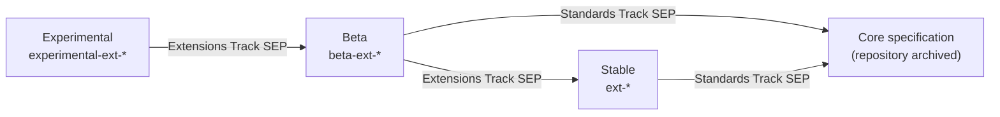

# SEP-0000: Extension Lifecycle

- **Status**: Draft
- **Type**: Process
- **Created**: 2026-09-25
- **Author(s)**: Peter Alexander (@pja-ant)
- **Sponsor**: @pja-ant
- **PR**: https://github.com/modelcontextprotocol/modelcontextprotocol/pull/0000

## Abstract

This SEP gives MCP extensions a maturity lifecycle. An extension starts as Experimental, may advance to Beta, and then either becomes Stable as an extension or is promoted into the core specification. The repository name shows the stage (`experimental-ext-<name>`,
`beta-ext-<name>`, `ext-<name>`). The stage decides which protocol changes are allowed, who approves them, and what stability implementers can expect.

Experimental and Beta extensions iterate with Extension Maintainer approval only, and may make breaking changes. Entering Beta and entering Stable each require an Extensions Track SEP. A Stable extension changes only when a new core protocol revision is released. Promotion to the
core specification requires a Standards Track SEP.

This SEP updates the extension lifecycle defined in [SEP-2133](./2133-extensions.md). It does not change how extensions are negotiated.

## Motivation

SEP-2133 defines two kinds of extension: an experimental extension in an `experimental-ext-` repository with no stability promise, and an official extension in an `ext-` repository that graduated through an Extensions Track SEP. It has no notion of maturity, and two problems
follow.

**Official extensions carry no stability signal.** An Extensions Track SEP is the only gate, and once an extension is official, SEP-2133 lets its maintainers change it at any time without Core Maintainer review. An implementer cannot tell whether an official extension is settled
or still being reworked. Extensions signal maturity in different, undefined words: `ext-auth` uses `specification/stable/` and `specification/draft/`, `ext-tasks` labels its schema snapshots "Stable" and "Development", and `ext-skills` publishes `specification/stable/`.

**Change points for official extensions are undefined.** SEP-2133 lets extension maintainers change an official extension whenever they choose, and requires a new identifier for every breaking change. Implementers need predictable moments when behavior may change. The protocol
already provides one, because every request declares a protocol revision, and [SEP-2663](./2663-tasks-extension.md) already defines extension behavior per protocol revision.

[SEP-2596](./2596-spec-feature-lifecycle-and-deprecation.md) left "feature maturity tiers" as an open question and pointed to the alpha/beta/GA model in Kubernetes. This SEP answers that question for extensions.

## Specification

### Stages

| Stage            | Repository                                              | Protocol changes                                      | Changes approved by  | Entry                                 | What implementers can expect                            |
| ---------------- | ------------------------------------------------------- | ----------------------------------------------------- | -------------------- | ------------------------------------- | ------------------------------------------------------- |
| **Experimental** | `experimental-ext-<name>`                               | Any change, at any time, without notice               | Extension Maintainer | Any Maintainer creates the repository | Nothing. The design may change or disappear.            |
| **Beta**         | `beta-ext-<name>`                                       | Any change, with breaking changes expected to be rare | Extension Maintainer | Extensions Track SEP                  | Real usage is welcome. Breaking changes are documented. |
| **Stable**       | `ext-<name>` or an area repository such as `ext-<area>` | Only with a new core protocol revision                | Extension Maintainer | Second Extensions Track SEP           | Behavior is fixed within a protocol revision.           |
| **Core**         | None (archived)                                         | As for the core specification                         | Core Maintainers     | Standards Track SEP                   | As for the core specification.                          |

An extension MUST NOT skip Beta, unless the Core Maintainers waive the requirement by a recorded vote. Extensions that are official when this SEP is finalized are classified in [Transition](#transition).

### Roles

An **Extension Maintainer** is a maintainer of the extension's repository who is listed in that repository's `MAINTAINERS.md`, as `ext-tasks` already does. As SEP-2133 provides for repository maintainers, the Core Maintainers appoint Extension Maintainers, who are normally the
leads of the associated Working Group or Interest Group. Every extension MUST have at least one Extension Maintainer.

"Extension Maintainer approval" means a pull request approved by at least one Extension Maintainer who is not its author. Extension Maintainers SHOULD coordinate changes through the associated Working Group or Interest Group.

The Core Maintainers keep the authority SEP-2133 gives them over every extension, including the ability to modify, deprecate, archive or remove it. Lead Maintainers retain veto authority over each Core Maintainer decision in this SEP, per the
[governance roles](https://modelcontextprotocol.io/community/governance#roles).

### Repositories

- An Experimental or Beta repository MUST contain exactly one extension. A Stable repository MAY group related extensions in one area, as SEP-2133 allows, but an extension joins a grouped repository only when it becomes Stable.
- The repository name MUST match the extension's stage, and is the only required marker of it. The Core Maintainers rename the repository, using their existing administrator access, when a stage change is approved. GitHub redirects the old URL, and the Extension Maintainers
  update the package names, module paths and links that the rename breaks.
- Every extension MUST stay associated with a Working Group or Interest Group, as SEP-2133 requires.
- The licensing, contributor license grant, trademark and antitrust terms of SEP-2133 apply at every stage.
- Each extension MUST be listed on the extensions page of the MCP website with its current stage.

SDKs keep the autonomy SEP-2133 gives them. Extensions stay disabled by default and require explicit opt-in, at every stage.

### Experimental

An Experimental extension is a prototype. Any Maintainer MAY create an `experimental-ext-<name>` repository, before or after a SEP is drafted.

- Extension Maintainers MAY merge any change, including breaking changes, without notice, deprecation or Core Maintainer review.
- Implementers MUST NOT expect two revisions of the extension to be compatible. They SHOULD pin to a tag or commit.

Core Maintainers retain the ability to archive an Experimental repository at any time.

### Beta

A Beta extension is one the Core Maintainers are willing to have implementers try. The goal is real usage: implementers learn what needs to change, and the design iterates.

**Entry.** An Extension Maintainer, or the Working Group, submits an Extensions Track SEP under SEP-2133 and the [SEP guidelines](https://modelcontextprotocol.io/community/sep-guidelines). It is reviewed like a Standards Track SEP, and SEP-2133 already requires it to identify the
Working Group and Extension Maintainers and to have a reference implementation in an official SDK. When the SEP is accepted, the Core Maintainers rename the repository to `beta-ext-<name>`.

**Iteration.** After entry, Extension Maintainers approve changes without further Core Maintainer review.

- Extensions SHOULD prefer additive changes, such as new optional fields or capability flags, over breaking changes.
- Breaking changes are allowed but SHOULD be infrequent and SHOULD be batched.
- Every breaking change MUST appear in a changelog with the revision that introduces it.
- Extension Maintainers SHOULD announce a breaking change in the Working Group or Interest Group channel before merging it.
- Extension Maintainers SHOULD maintain a public list of known implementations and the feedback received from them. This list is the evidence for the next stage.

**Exit.** A Beta extension advances to Stable or Core, or is archived.

### Stable

A Stable extension is a released, maintained part of the MCP ecosystem that lives outside the core specification.

**Entry.** An Extension Maintainer, or the Working Group, submits a second Extensions Track SEP. It follows the same review and acceptance process as a Standards Track SEP. The SEP MUST:

- Link the Beta SEP and repository, and show that the extension has been in real use, through the known-implementations list.
- Show two independent implementations, at least one client-side and one server-side, that interoperate.
- Carry a conformance scenario that meets the requirements of [SEP-2484](./2484-conformance-tests-required-for-final-seps.md) for a Standards Track SEP, unless the extension has no observable protocol behavior. This SEP extends SEP-2484 to Extensions Track SEPs that move an
  extension to Stable.

When the SEP reaches Final, the Core Maintainers rename the repository to `ext-<name>`, or move the extension into an existing area repository, and the Extension Maintainers publish the first Stable revision.

**Revisions.** A Stable extension is published as revisions keyed to core protocol revisions, for example a `specification/2026-07-28/` snapshot beside a `specification/draft/` directory.

- A published revision is immutable.
- The extension MAY change only by publishing a new revision together with, or after, a new core protocol revision is released as Current. Proposed changes accumulate in `draft/` and are visible to implementers before they take effect.
- Extension Maintainer approval is sufficient for a new revision. The Core Maintainers do not review it.
- Editorial fixes that do not change the requirements on any implementation MAY be made to a published revision at any time.

**Compatibility.** See [Identifiers and compatibility](#identifiers-and-compatibility).

**Exit.** A Stable extension may be promoted to Core or deprecated.

### Core

An extension that belongs in the core protocol is promoted by a Standards Track SEP, reviewed like any other. The proposal MAY come from a Beta or a Stable extension. The SEP MUST cite the extension repository.

The feature becomes part of the core protocol in a specific core protocol revision R, for example `2027-01-01`. Once R is released, the following rules apply:

- **R or later.** For a request that declares R or later, the feature is core behavior. It applies whether or not the extension identifier is advertised, so a server responding under R or later does not need to advertise the extension or respond with it.
- **Earlier than R.** For a request that declares an earlier revision, the extension applies as defined by its final revision. A client that still supports earlier revisions SHOULD keep advertising the extension identifier, so that a server that does not yet support R can fall
  back to the extension behavior.
- **When to stop.** A peer stops advertising the extension when it no longer supports any revision earlier than R. There is no separate sunset period.
- **Differences.** The core behavior MAY differ from the extension. The SEP MUST define the differences, so that each protocol revision has one defined behavior.

When the SEP reaches Final, the specification text lands in the core draft. The extension keeps its current stage until R is released as Current. The Core Maintainers then archive the extension repository, and its README points to the core specification section and the SEP. The
archived repository keeps the extension's final revision, which remains the definition for earlier protocol revisions. From that point every change is a core specification change.

### Ending an extension

- **Withdrawal or inactivity.** An Extension Maintainer MAY withdraw an Experimental or Beta extension, and the Core Maintainers then archive its repository. The Core Maintainers MAY archive an Experimental or Beta repository that has had no merged change and no Working Group or
  Interest Group activity for six months.
- **Deprecation.** A Stable extension is deprecated by an Extensions Track SEP, with the requirements, minimum window and Tier 1 SDK obligations that SEP-2596 sets for a core feature.

Archived repositories keep their name and history.

### Identifiers and compatibility

This section replaces the rule in SEP-2133 that every breaking change MUST use a new identifier.

- An extension's identifier is fixed when the extension is created and does not change when its stage changes.
- **Experimental and Beta.** Extensions SHOULD prefer additive changes, such as new optional fields or capability flags in the settings object, over breaking changes. Breaking changes keep the same identifier, and the identifier carries no compatibility promise between revisions.
  An extension that makes a breaking change SHOULD add or increment a `revision` string in its settings object so that peers can detect a mismatch. An absent `revision` means the initial revision. A peer that receives a `revision` it does not know SHOULD NOT enable the extension.
- **Stable.** Breaking changes appear only in a new revision, keyed to a core protocol revision. The behavior of the extension for a peer pair is the behavior defined for the protocol revision they negotiate. A revision MUST NOT change the behavior already defined for an earlier
  protocol revision. No new identifier is needed. A new identifier is used only when the old and new behavior must coexist under one protocol revision.
- An extension specification MUST state which protocol revisions each of its revisions applies to.
- Implementers of all stages SHOULD treat extension data received from a peer as untrusted, as SEP-2133 requires.

### Transition

When this SEP reaches Final:

- `docs/extensions/overview.mdx` and the Extensions Track description in `docs/community/sep-guidelines.mdx` are updated to match this SEP.
- The extensions page lists each extension with its stage.
- Existing repositories are classified as follows, and renamed if needed.

| Repository                                                                                                                            | Stage at Final                                                   |
| ------------------------------------------------------------------------------------------------------------------------------------- | ---------------------------------------------------------------- |
| `ext-apps`, `ext-auth`                                                                                                                | Stable                                                           |
| `ext-skills`, `ext-tasks`                                                                                                             | Beta (renamed `beta-ext-<name>`)                                 |
| `ext-server-card`                                                                                                                     | Beta (renamed `beta-ext-server-card`), once SEP-2127 is accepted |
| `experimental-ext-interceptors`, `experimental-ext-variants`, `experimental-ext-triggers-events`, `experimental-ext-tool-annotations` | Experimental (no change)                                         |

- The classified extensions need no new SEP. Their existing SEPs count as the SEP for the stage assigned, and they keep their identifiers and wire behavior. `ext-server-card` uses SEP-2127 as its Beta SEP, so its classification takes effect when that SEP is accepted.
- Extensions classified as Stable follow the revision rules from Final. Their next revision is keyed to the next core protocol revision, and their existing published specifications stay as they are.
- `ext-auth` is a Stable area repository and keeps hosting several extensions.
- A repository that hosts several Experimental extensions, such as `experimental-ext-tool-annotations`, keeps its name until one of its extensions requests Beta. That extension moves to its own repository first.

## Rationale

**Why put the stage in the repository name?** The name is visible in every link, package reference and search result, and it cannot be changed without Core Maintainer administrator access. A README banner or label would duplicate the name and could disagree with it. The cost is
renames, which GitHub redirects but which do not update package or module names. This SEP makes the Extension Maintainers responsible for those updates.

**Why does Beta need a SEP, but iteration inside Beta does not?** Beta is the first stage where the project's name stands behind an extension, so it gets the full review that SEP-2133 already requires for official extensions. Iteration after that follows the reasoning in
SEP-2133: routing every change through Core Maintainer review would bottleneck extensions on a process that already takes months.

**Why a second SEP for Stable?** Stable is a stronger promise than Beta: behavior is fixed within a protocol revision. A second review lets the Core Maintainers judge the evidence from Beta (real usage, independent implementations and conformance) before making that promise.

**Why can a Stable extension change only with a core protocol revision?** Implementers need known dates for behavior changes. Because every request declares its protocol revision, tying extension revisions to core revisions gives a change a place to take effect without breaking
peers on an earlier revision. It also matches current practice: `ext-tasks` snapshots its schema by core revision, and `ext-skills` pins its stable specification to `2026-07-28`.

**Why is Beta required before Stable?** The purpose of Beta is real usage before the project commits to a design. The Stable evidence is easier to gather during Beta, and a Beta extension is cheap to change if the evidence shows a problem. The Core Maintainers can still waive the
requirement.

**Why does the extension stay advertised after promotion to Core?** Protocol revisions are negotiated per request, so a client cannot know in advance whether a server supports R. Advertising the extension lets the same client work with servers on either side of R, and the core
behavior needs no negotiation once both sides are on R.

**Alternatives considered.**

- _Beta by Core Maintainer vote instead of a SEP._ Lighter, but it creates a second, unwritten approval path for official extensions and leaves no written record of the design.
- _Give Experimental and Beta extensions a distinct identifier, for example `io.modelcontextprotocol.experimental/<name>`._ It makes the stage visible on the wire, but every stage change would force implementers to change code and identifiers. The `revision` setting gives most of
  the benefit at less cost.
- _Require a new identifier for every Stable breaking change (SEP-2133 as written)._ It leaves old and new behavior coexisting indefinitely and forces both to be implemented. Keying behavior to the negotiated protocol revision reuses a mechanism the protocol already has.

**Prior art.** Kubernetes moves features through [alpha, beta and GA stages](https://kubernetes.io/docs/reference/command-line-tools-reference/feature-gates/) with different stability promises and
[deprecation windows](https://kubernetes.io/docs/reference/using-api/deprecation-policy/), which [SEP-2596](./2596-spec-feature-lifecycle-and-deprecation.md) already cites. OpenTelemetry Collector components carry
[development, alpha, beta and stable stability levels](https://github.com/open-telemetry/opentelemetry-collector/blob/main/docs/component-stability.md). The Node.js [Stability Index](https://nodejs.org/api/documentation.html#stability-index) marks APIs as experimental or stable,
among other levels.

## Backward Compatibility

This SEP changes process only, and changes no message on the wire.

- It replaces the identifier rule and the creation, iteration and promotion steps of SEP-2133 with the rules above.
- Existing Experimental repositories are unchanged.
- `ext-skills` and `ext-tasks` are classified as Beta. Their identifiers and wire behavior do not change, but their repositories are renamed.
- `ext-server-card` is classified as Beta once SEP-2127 is accepted, and is renamed then.
- `ext-apps` and `ext-auth` are classified as Stable. From Final, changes to their published specifications wait for a core protocol revision.

## Security Implications

Experimental and Beta extensions iterate without Core Maintainer review, so an insecure design can be implemented before anyone with security expertise reads it. The controls are:

- Extensions stay disabled by default at every stage, so an implementer opts in deliberately.
- Beta entry requires an Extensions Track SEP, including its Security Implications section, and Stable entry requires a second full SEP review.
- Stable changes take effect only with a core protocol revision, and are visible in `draft/` beforehand.
- Core Maintainers keep the authority to archive an extension at any stage, for example when a vulnerability is reported.

Allowing breaking changes under one identifier at Experimental and Beta stages means two implementations built against different revisions can negotiate the extension and then misparse each other's data. Implementations MUST validate extension data (SEP-2133), and the `revision`
setting, where present, lets a peer refuse a revision it does not know.

## Reference Implementation

This is a Process SEP and has no protocol implementation. On reaching Final it lands the documentation changes and repository renames listed in [Transition](#transition).
