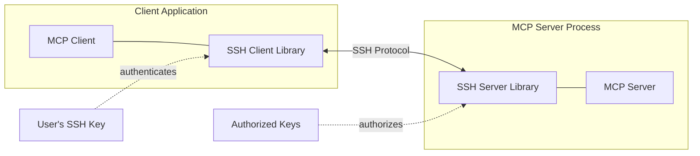
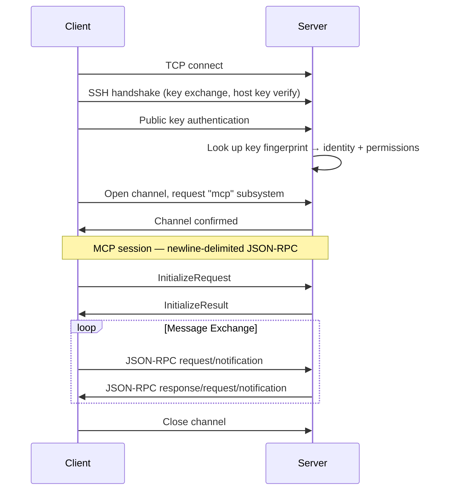

# SEP-0000: SSH Transport

- **Status**: Draft
- **Type**: Informational
- **Created**: 2026-02-28
- **Author(s)**: Amy Tobey <tobert@gmail.com> (@tobert)
- **Sponsor**: None
- **PR**: TBD
- **SDK Prototype**: https://github.com/tobert/go-sdk/tree/ssh-transport
- **App Prototype**: https://github.com/tobert/otlp-mcp/tree/ssh-transport

## Abstract

This SEP documents SSH as a custom transport for MCP, as an alternative to
Streamable HTTP with OAuth for remote connections. The MCP server embeds its
own SSH server and manages key-based authentication directly — the same model
that Git hosting services use for SSH access. Clients connect with their SSH
key, the server maps the key to identity, and JSON-RPC messages flow over the
SSH channel. No TLS certificates, no OAuth infrastructure, no dependency on
system sshd.

## Motivation

Streamable HTTP with OAuth 2.1 is the right choice for multi-tenant web
services, browser-based clients, and environments with existing identity
providers. But it's the *only* option for remote MCP, and it carries
significant infrastructure requirements:

- TLS certificates (issuance, renewal, trust management)
- An OAuth authorization server (or integration with one)
- Protected Resource Metadata and Authorization Server Metadata endpoints
- Dynamic Client Registration or Client ID Metadata Documents
- PKCE flows with browser redirects

For many remote MCP use cases — developer tools, internal services, homelab
automation, CI/CD pipelines, server administration — this is a
disproportionate amount of machinery. These environments typically already have
SSH keys configured and don't need multi-tenant authorization.

Git solved this problem by offering SSH. You can `git clone https://...` with tokens,
or `git clone git@...:...` with keys. Both work; different trade-offs. MCP could offer
the same choice.

The SSH transport makes remote MCP as simple as:

1. Generate a key (or use your existing one)
2. Add the public key to the server's authorized keys (ssh-copy-id)
3. Connect

No certificates to manage. No OAuth dance. No browser redirects. Just keys.

### Why Not stdio Over SSH?

The stdio transport can be used over SSH today by spawning `ssh` as the
subprocess:

```json
{
  "mcpServers": {
    "devbox": {
      "command": "ssh",
      "args": ["-T", "devbox.example.com", "/usr/local/bin/mcp-server"]
    }
  }
}
```

This works for simple cases, but has fundamental limitations:

- **Process lifecycle coupling**: The server process is spawned per connection
  and dies when the SSH connection drops. Any server-side state — caches,
  loaded resources, in-progress work — is lost on disconnect. Network blips
  kill the session and all accumulated context. With an embedded SSH server,
  the MCP server is a persistent process that survives client disconnections.
  Clients reconnect and re-initialize, but server-side state is preserved.

- **No concurrent clients**: Each stdio-over-SSH connection spawns its own
  isolated server process. Multiple clients cannot share a single server
  instance. An embedded SSH server handles multiple concurrent sessions
  naturally.

- **Shell environment contamination**: Without careful configuration (`ssh -T`,
  `ForceCommand`, or subsystem mode in sshd), shell initialization output
  (MOTD, banners, `.bashrc` output) can corrupt the JSON-RPC stream. SSH
  subsystems avoid this entirely.

- **System sshd dependency**: Requires a running sshd with appropriate
  configuration, which may not be available (containers, locked-down systems)
  or may be managed by a different team with different priorities.

For ephemeral, stateless MCP servers, stdio-over-SSH is a reasonable approach.
For servers that benefit from persistence, shared state, or multi-client
access, the embedded SSH transport described here is a better fit.

## Specification

### Architecture

The SSH transport defines an MCP server that embeds an SSH server and an MCP
client that embeds an SSH client. The SSH protocol handles encryption,
authentication, and channel management. JSON-RPC messages flow over the SSH
channel using the same newline-delimited framing as the stdio transport.



Unlike the stdio transport (where the client spawns the server) or system-sshd
approaches (where the server depends on external SSH infrastructure), the SSH
transport server is a single process that handles both SSH and MCP. This is the
same model used by Git hosting services, Gitea, and other applications that
embed SSH servers.

This transport builds on the SSH protocol as defined in:

- [RFC 4251](https://www.rfc-editor.org/rfc/rfc4251) — SSH Protocol Architecture
- [RFC 4252](https://www.rfc-editor.org/rfc/rfc4252) — SSH Authentication Protocol
- [RFC 4253](https://www.rfc-editor.org/rfc/rfc4253) — SSH Transport Layer Protocol
- [RFC 4254](https://www.rfc-editor.org/rfc/rfc4254) — SSH Connection Protocol

### Connection Establishment

1. The server listens for SSH connections on a configured port.
2. The client opens a TCP connection and performs the SSH handshake
   ([RFC 4253](https://www.rfc-editor.org/rfc/rfc4253)).
3. The client authenticates using its SSH key
   ([RFC 4252](https://www.rfc-editor.org/rfc/rfc4252),
   see [Authentication](#authentication)).
4. The client opens an SSH channel and requests the `mcp` subsystem
   ([RFC 4254 §6.5](https://www.rfc-editor.org/rfc/rfc4254#section-6.5)).
5. The MCP lifecycle begins: the client sends `InitializeRequest`, the server
   responds with `InitializeResult`.



Servers **MUST** use the `mcp` subsystem name. Servers **MAY** additionally
support named subsystems (e.g., `mcp-files`, `mcp-db`) to expose multiple MCP
server configurations on a single host.

Servers **MUST** reject the following SSH channel requests:

- `shell` — interactive shell access
- `exec` — arbitrary command execution
- `pty-req` — pseudo-terminal allocation
- `x11-req` — X11 forwarding
- `direct-tcpip` and `tcpip-forward` — port forwarding
- `auth-agent-req@openssh.com` — agent forwarding

Servers **MUST** accept only `subsystem` requests for configured MCP subsystem
names. All other channel and global requests **SHOULD** be rejected.

### Message Framing

Identical to the stdio transport:

- Messages are newline-delimited JSON-RPC, UTF-8 encoded.
- Messages **MUST** be terminated by a single newline (`\n`, 0x0A).
- Implementations **MUST NOT** emit `\r\n` (CRLF) as the line terminator.
  Implementations **SHOULD** accept `\r\n` on input for robustness.
- Messages **MUST NOT** contain embedded newlines.
- The server **MUST NOT** write non-MCP content to the channel.
- Both directions share the same channel. The server **MAY** send JSON-RPC
  requests and notifications to the client (e.g., `sampling/createMessage`,
  `roots/list`) interleaved with responses to client requests. Both sides
  **MUST** be prepared to receive any valid JSON-RPC message at any time.
- The server **MAY** write to the SSH extended data channel (type 1,
  `SSH_EXTENDED_DATA_STDERR`) for logging. The client **SHOULD NOT** interpret
  extended data as an error condition. Note that SSH extended data is defined
  as server-to-client only; clients **MUST NOT** send extended data.

Note that SSH channels are packetized (`SSH_MSG_CHANNEL_DATA`). A single
JSON-RPC message may span multiple SSH packets, and multiple messages may
arrive in a single packet. Implementations **MUST** buffer incoming channel
data and split on newline boundaries to extract complete messages.

### Authentication

The server authenticates clients using SSH protocol version 2 public key
authentication. Implementations **MUST NOT** support SSH protocol version 1.
The MCP authorization specification (OAuth 2.1) **DOES NOT** apply to this
transport.

Servers **MUST** support public key authentication and **SHOULD** support SSH
certificates. The client's identity is determined by the **public key
fingerprint** presented during authentication (or the certificate's Key ID
when using SSH certificates), not by the SSH username. Key fingerprints
**MUST** use SHA-256 and **MUST** be represented in the format
`SHA256:<base64>` (the same format used by OpenSSH).

Clients **MUST** verify the server's host key. On first connection to an
unknown server, interactive clients **SHOULD** prompt the user to verify and
accept the host key (trust-on-first-use). Clients **MUST** reject connections
where the host key has changed from a previously accepted value.

Automated (non-interactive) clients — such as CI/CD pipelines — **MUST** be
pre-provisioned with the expected server host key via the `hostKey`
configuration parameter and **MUST NOT** use trust-on-first-use, as TOFU is
vulnerable to MITM attacks when there is no human to verify the fingerprint.

Clients **MUST** persist accepted host keys for future verification. Clients
**MAY** use the system SSH known hosts database (`~/.ssh/known_hosts`) or a
dedicated MCP-specific store. The storage mechanism is implementation-defined.

Clients **SHOULD** use the local SSH agent when available for key access.
Clients **SHOULD** respect `~/.ssh/config` for connection parameters (hostname
aliases, identity files, proxy jumps) when the system SSH configuration is
accessible.

### Authorization

The server maps each authenticated public key to an identity. How the server
stores and manages this mapping — authorized keys files, databases, LDAP, SSH
certificates — is an implementation detail outside the scope of this document.

Servers should follow established SSH authorization practices:

- **Authorized keys**: The simplest model. The server maintains a list of
  accepted public keys, similar to OpenSSH's `~/.ssh/authorized_keys`. This
  is the "get started in five minutes" path for small teams.

- **SSH certificates**: For organizational deployments, SSH certificates
  ([PROTOCOL.certkeys](https://cvsweb.openbsd.org/src/usr.bin/ssh/PROTOCOL.certkeys?annotate=HEAD))
  encode identity in the certificate itself, signed by a trusted CA. This
  eliminates per-server key distribution — the same model used by Netflix,
  Facebook, and other large organizations for SSH access.

Restricting which tools, resources, or prompts a given key can access is
valuable but is left to implementations. A future SEP may define
transport-independent authorization primitives that apply across all MCP
transports.

### Server Identity

Servers **MUST** have a persistent host key pair used for SSH host
authentication. Servers **SHOULD** use Ed25519 host keys.

The server's host key **SHOULD** be stable across restarts. Changing the host
key will cause clients to reject the connection (host key mismatch), requiring
manual intervention.

For environments with multiple server instances (load balancing, failover),
all instances **MUST** share the same host key.

### Session Lifecycle

- The SSH connection defines the session boundary.
- A session begins when the `InitializeRequest` / `InitializeResult` exchange
  completes.
- A session ends when the SSH channel or connection closes.
- Sessions are not resumable. After disconnection, the client **MUST**
  establish a new connection and re-initialize.

The server **MAY** support multiple concurrent MCP sessions from the same
client over separate SSH channels on a single connection.

Both sides **SHOULD** send SSH keepalive requests
(`keepalive@openssh.com` global requests, or TCP keepalives) to detect dead
peers. Implementations **SHOULD** consider a peer dead after 3 consecutive
missed keepalives.

### Shutdown

1. The client sends EOF on the channel (closes its write end).
2. The server **SHOULD** finish processing any in-flight request, then close
   the channel.
3. If the server does not close the channel within a reasonable timeout, the
   client **MAY** close the SSH connection.

Either side **MAY** close the channel at any time. The other side **SHOULD**
treat unexpected channel closure as session termination.

### Error Handling

- If the client requests an unknown or unauthorized subsystem, the server
  **MUST** reject the channel request with `SSH_MSG_CHANNEL_OPEN_FAILURE`.
- If the MCP server process fails to initialize after the channel is opened,
  the server **MUST** close the channel immediately rather than leaving it
  open indefinitely.
- If SSH authentication fails, the server **MUST** limit retry attempts
  (no more than 6 per connection) and **MUST** rate limit authentication
  attempts per source IP address to mitigate key probing attacks.

### Client Configuration

```json
{
  "mcpServers": {
    "devbox": {
      "transport": "ssh",
      "host": "devbox.example.com"
    },
    "analytics": {
      "transport": "ssh",
      "host": "analytics.internal",
      "subsystem": "mcp-query",
      "username": "readonly",
      "identityFile": "~/.ssh/analytics_ed25519"
    }
  }
}
```

| Parameter      | Required | Default     | Description                            |
| :------------- | :------- | :---------- | :------------------------------------- |
| `host`         | Yes      |             | Hostname or IP address                 |
| `port`         | No       | 2222        | SSH port                               |
| `subsystem`    | No       | `mcp`       | SSH subsystem name                     |
| `username`     | No       | `mcp`        | SSH username (see below)               |
| `identityFile` | No       | SSH default | Path to private key                    |
| `hostKey`      | No       | Known hosts | Server host key fingerprint (`SHA256:<base64>`) |

The `username` field is sent during SSH authentication but is **not** the
primary identity mechanism. Because the MCP server embeds its own SSH server
(not system sshd), there are no Unix user accounts to map to. The server
identifies clients by their **public key fingerprint**, not by username. This
is the same model GitHub uses — all users connect as `git@github.com` and
GitHub identifies them by which SSH key they authenticate with.

Servers **SHOULD** accept any username and **MUST** determine client identity
from the authenticated public key (or certificate Key ID). The default
username of `mcp` is conventional, like Git's `git`.

### Server Configuration

This SEP does not mandate a server configuration format, but a minimal
server needs:

- A host key pair
- A mechanism for authorizing client public keys
- The MCP server capability configuration (tools, resources, prompts)

### Capability Advertisement

The server **SHOULD** include transport metadata in the `InitializeResult`
`serverInfo` to help clients understand the authorization model:

```json
{
  "serverInfo": {
    "name": "my-mcp-server",
    "version": "1.0.0"
  },
  "capabilities": { ... },
  "_meta": {
    "ssh": {
      "keyFingerprint": "SHA256:abcdef123456...",
      "identity": "amy@workstation"
    }
  }
}
```

This is informational and non-normative. It allows clients to display who the
server thinks they are, aiding debugging and transparency.

## Rationale

### Embedded SSH Server, Not System sshd

Depending on system sshd creates operational coupling — sshd configuration
changes can break MCP, MCP security depends on sshd hardening, and deployment
requires SSH access to configure sshd. An embedded SSH server makes the MCP
server self-contained, like how HTTPS servers embed TLS rather than depending
on a system TLS terminator.

This also enables single-binary distribution: download the server, generate a
host key, add authorized keys, run it. No root access or system configuration
needed.

That said, implementations **MAY** also work with system sshd by registering
as a subsystem in `sshd_config`. This is a valid deployment model, especially
in enterprise environments with existing SSH infrastructure and hardening
policies. The embedded model is the primary recommendation because it is
self-contained and does not require system-level configuration.

### Subsystem, Not Exec

SSH subsystems avoid the entire class of problems around shell initialization
output (MOTD, banners, rc files) corrupting the JSON-RPC stream. They also
give the server explicit control over what runs — there's no shell
interpretation, no PATH lookup, no argument injection risk.

### Why Not mTLS?

Mutual TLS (mTLS) with client certificates provides similar properties to SSH
key authentication — mutual authentication, encryption, no passwords. However,
mTLS requires the same certificate infrastructure that makes Streamable HTTP
heavy: a CA, certificate issuance and renewal, trust store configuration, and
TLS-specific tooling (openssl, certbot, etc.). SSH key management is
operationally simpler — `ssh-keygen` generates a key pair, you copy the public
key to the server, done. There is no CA, no expiration by default, no chain of
trust to configure. For the target use cases (developer tooling, internal
services), this simplicity is the point.

### Transport Maintenance Burden

Adding a third transport increases the implementation surface for MCP SDKs.
This is a real cost. The SSH transport mitigates it in two ways: (1) the
message framing is identical to stdio, so the JSON-RPC handling code is fully
reusable — only the connection layer is new, and (2) mature SSH libraries
exist for every major language ecosystem. The incremental implementation effort
is the SSH handshake, authentication, and channel management — not the MCP
protocol logic.

### No Resumability

SSH connections are persistent and reliable. SSH's own keepalive mechanism
maintains connections through NAT and firewalls. When connections do fail, a
clean reconnect with fresh initialization is simpler and more predictable than
resumption state machines. The target use cases (dev tools, internal services,
automation) tolerate brief reconnection.

### Prior Art

- **Git over SSH**: GitHub, GitLab, Gitea all embed SSH servers that
  authenticate with keys, map keys to accounts, and authorize repository
  access. This is the closest prior art and the direct inspiration.
- **SFTP servers**: Often embedded (e.g., in Go, Rust) rather than relying on
  system sftp-server.
- **HashiCorp Vault SSH**: Issues SSH certificates with embedded permissions
  for time-bounded access — the same pattern proposed here for MCP
  authorization.

## Backward Compatibility

This SEP introduces a new transport. It does not modify stdio or Streamable
HTTP. Clients and servers that do not implement the SSH transport are
unaffected.

Servers **MAY** support both SSH and Streamable HTTP transports simultaneously
on different ports.

## Security Implications

### Strengths

- **Encryption**: All traffic encrypted (ChaCha20-Poly1305, AES-GCM, etc.)
  with no option to disable.
- **No credential transmission**: Public key authentication proves key
  possession without transmitting secrets. No passwords, no bearer tokens
  that can be stolen in transit or from logs.
- **Mutual authentication**: The client verifies the server (host key) and the
  server verifies the client (public key). Both directions are mandatory.
- **No DNS rebinding**: Direct TCP connection, no HTTP Origin header concerns.
- **Audit**: Every connection attempt is authenticatable to a specific public
  key.

### Risks and Mitigations

| Risk                      | Mitigation                                             |
| :------------------------ | :----------------------------------------------------- |
| Host key compromise       | Rotate host key, notify clients out of band            |
| Client key compromise     | Remove from authorized keys; use short-lived certs     |
| Overly broad permissions  | Default-deny with explicit restrict options             |
| Resource exhaustion (DoS) | Rate limit connections, max concurrent sessions        |
| Embedded SSH implementation bugs | Use well-audited libraries; fuzz test          |

### Embedded SSH Server Hardening

Implementations should follow established SSH hardening practices. Key
recommendations:

- Disable password authentication (public key only)
- Reject all channel requests except configured subsystems (see
  [Connection Establishment](#connection-establishment))
- Enforce a pre-authentication timeout to prevent resource exhaustion
- Use modern algorithms: Ed25519 keys, curve25519 key exchange, AEAD ciphers
  (ChaCha20-Poly1305 or AES-256-GCM)
- Ensure key exchange algorithms provide forward secrecy
- Limit concurrent connections and rate-limit authentication attempts
- Log authentication attempts for audit

For comprehensive guidance, see the
[Mozilla OpenSSH Security Guidelines](https://infosec.mozilla.org/guidelines/openssh).

## Open Questions

1. **Default port**: This draft uses 2222 as the default since port 22
   requires root privileges, which contradicts the goal of zero-root
   deployment. Should we request an IANA assignment for a dedicated MCP-SSH
   port, or is 2222 (or operator-configured) sufficient?

2. **Key discovery**: Should there be a standard mechanism for clients to
   register their public key with a server (analogous to adding a deploy key
   on GitHub), or is that always out of band?

3. **Server discovery**: How does a client discover that an MCP server
   supports the SSH transport? Should the MCP server registry include SSH
   connection details?

4. **Multiple subsystems**: When a server exposes multiple subsystems
   (`mcp-files`, `mcp-db`), should there be a discovery mechanism to list
   available subsystems, or is this purely a configuration concern?

## Reference Implementation

- **Go SDK**: SSH transport branch at
  [tobert/go-sdk@ssh-transport](https://github.com/tobert/go-sdk/tree/ssh-transport)
- **Example server**: MCP-over-SSH server at
  [tobert/otlp-mcp@ssh-transport](https://github.com/tobert/otlp-mcp/tree/ssh-transport)

Additional implementations in Rust and Python are planned to demonstrate
cross-language interoperability.
