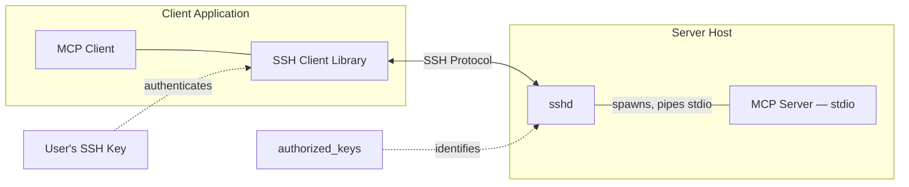
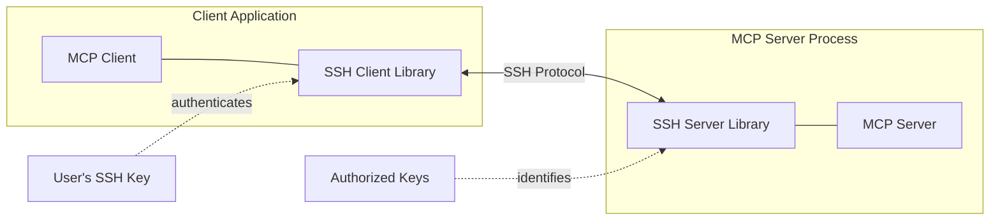
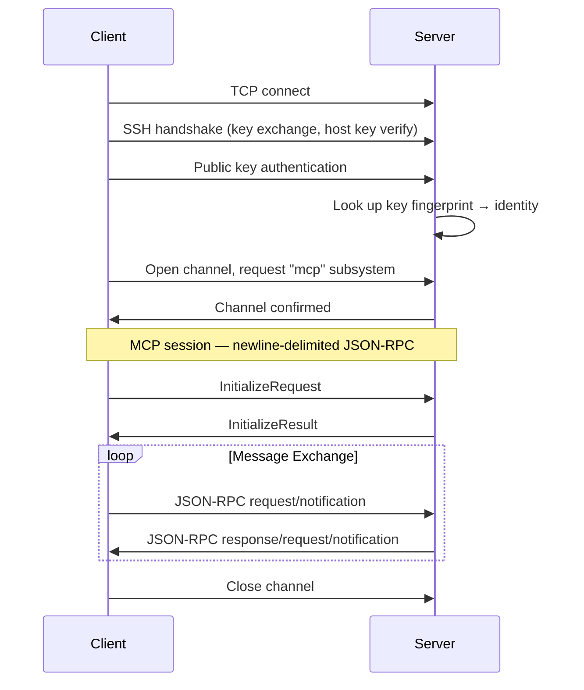

# SEP-0000: SSH Transport

- **Status**: Draft
- **Type**: Informational
- **Created**: 2026-02-28
- **Author(s)**: Amy Tobey <tobert@gmail.com> (@tobert)
- **Sponsor**: None
- **PR**: TBD
- **SDK Prototype**: https://github.com/tobert/go-sdk/tree/ssh-transport
- **App Prototype**: https://github.com/tobert/otlp-mcp/tree/ssh-transport

## Abstract

This SEP documents SSH as a custom transport for MCP, as an alternative to
Streamable HTTP with OAuth for remote connections. MCP servers can support
SSH in two ways: as a subsystem under system sshd (any stdio MCP server works
immediately, no new dependencies) or by embedding their own SSH server for
persistent, self-contained deployment. SSH transport fills the gap between
stdio's simplicity and the complexity of HTTPS with OAuth.

## Motivation

Streamable HTTP with OAuth 2.1 is the right choice for multi-tenant web
services, browser-based clients, and environments with existing identity
providers. But it's the *only* option for remote MCP, and it carries
significant infrastructure requirements:

- TLS certificates (issuance, renewal, trust management)
- An OAuth authorization server (or integration with one)
- Protected Resource Metadata and Authorization Server Metadata endpoints
- Dynamic Client Registration or Client ID Metadata Documents
- PKCE flows with browser redirects

For many remote MCP use cases — developer tools, internal services, homelab
automation, CI/CD pipelines, server administration — this is a
disproportionate amount of machinery. These environments typically already have
SSH keys configured and don't need multi-tenant authorization.

Git solved this problem by offering SSH. You can `git clone https://...` with
tokens, or `git clone git@...:...` with keys. Both work; different trade-offs.
MCP could offer the same choice.

The SSH transport makes remote MCP as simple as:

1. Generate a key (or use your existing one)
2. Add the public key to the server's authorized keys (ssh-copy-id)
3. Connect

Add in ssh-agent support and users get a low-friction way to build secure
network MCPs.

### Why Not stdio Over SSH?

The stdio transport can be used over SSH today by spawning `ssh` as the
subprocess:

```json
{
  "mcpServers": {
    "devbox": {
      "command": "ssh",
      "args": ["-T", "devbox.example.com", "/usr/local/bin/mcp-server"]
    }
  }
}
```

This works for short sessions on reliable networks but falls apart quickly in
the real world:

- **Process lifecycle coupling**: The server process dies when the SSH
  connection drops. Any server-side state — caches, loaded resources,
  in-progress work — is lost. An embedded SSH server is a persistent process
  that survives client disconnections.

- **No concurrent clients**: Each connection spawns an isolated server
  process. An embedded SSH server handles multiple concurrent sessions
  naturally.

- **Shell environment contamination**: Without careful configuration,
  shell initialization output (MOTD, banners, `.bashrc`) can corrupt the
  JSON-RPC stream. SSH subsystems avoid this entirely.

The sshd subsystem deployment model (see [Architecture](#architecture)) shares
the per-connection process lifecycle but avoids shell contamination and is
simpler to set up. It is a distinct approach from spawning `ssh` as a client
subprocess.

## Specification

### Architecture

SSH transport supports two deployment models. Both use the same wire protocol
— newline-delimited JSON-RPC over an SSH channel, requested via the `mcp`
subsystem — and are indistinguishable from the client's perspective. This
builds on the SSH protocol as defined in
[RFC 4251–4254](https://www.rfc-editor.org/rfc/rfc4251).

#### sshd Subsystem

The MCP server is a stdio program registered as a subsystem under system sshd.
Any existing stdio MCP server works with no code changes:

```
# sshd_config
Subsystem mcp /usr/local/bin/my-mcp-server
```

When a client requests the `mcp` subsystem, sshd spawns the server process
with stdin/stdout connected to the SSH channel. sshd handles all SSH protocol,
authentication, and encryption. This is the same model used by sftp-server.

Multiple subsystems can be configured to expose different stdio MCP servers
on a single sshd host — useful for containers, dev environments, or anywhere
multiple servers share infrastructure:

```
# sshd_config
Subsystem mcp       /usr/local/bin/default-mcp-server
Subsystem mcp-files /usr/local/bin/files-mcp-server
Subsystem mcp-db    /usr/local/bin/db-mcp-server
```



#### Embedded SSH Server

The MCP server embeds its own SSH server library, managing connections,
authentication, and host keys directly. This enables persistent processes with
shared state across clients and single-binary distribution — the model used by
GitHub, GitLab, and Gitea for Git over SSH.



### Connection Establishment

1. The server listens for SSH connections on a configured port.
2. The client opens a TCP connection and performs the SSH handshake
   ([RFC 4253](https://www.rfc-editor.org/rfc/rfc4253)).
3. The client authenticates using its SSH key
   ([RFC 4252](https://www.rfc-editor.org/rfc/rfc4252),
   see [Authentication](#authentication)).
4. The client opens an SSH channel and requests the `mcp` subsystem
   ([RFC 4254 §6.5](https://www.rfc-editor.org/rfc/rfc4254#section-6.5)).
5. The MCP lifecycle begins: the client sends `InitializeRequest`, the server
   responds with `InitializeResult`.



Clients **MUST** request the `mcp` subsystem by default. This is the protocol
identifier, analogous to `sftp`. When the client configuration specifies a
different `subsystem` value (e.g., `mcp-db`), the client requests that name
instead.

For the sshd subsystem model, sshd handles subsystem dispatch and channel
security. The requirements below apply to embedded SSH server implementations:

Embedded servers **MUST** reject the following SSH channel requests — this is
the critical security boundary:

- `shell` — interactive shell access
- `exec` — arbitrary command execution
- `pty-req` — pseudo-terminal allocation
- `x11-req` — X11 forwarding
- `direct-tcpip` and `tcpip-forward` — port forwarding
- `auth-agent-req@openssh.com` — agent forwarding

Embedded servers **MUST** accept only `subsystem` requests for the `mcp`
subsystem name. All other channel and global requests **SHOULD** be rejected.

### Message Framing

Message framing is identical to the
[stdio transport](https://modelcontextprotocol.io/specification/draft/basic/transports#stdio):
newline-delimited JSON-RPC, UTF-8 encoded. The server may write to the SSH
extended data channel (stderr equivalent) for logging; note that SSH extended
data is server-to-client only.

Because SSH channels are packetized (`SSH_MSG_CHANNEL_DATA`), a single
JSON-RPC message may span multiple SSH packets and multiple messages may
arrive in a single packet. Implementations must buffer incoming data and split
on newline boundaries to extract complete messages.

### Authentication

The server authenticates clients using SSH protocol version 2 public key
authentication. The MCP authorization specification (OAuth 2.1) does not
apply to this transport.

The client's identity is determined by the **public key fingerprint** (or
certificate Key ID), not by the SSH username. This is the same model GitHub
uses — all users connect as `git@github.com` and GitHub identifies them by
key. The default username `mcp` is conventional.

Clients verify the server's host key following standard SSH practices
(trust-on-first-use for interactive clients, pre-provisioned host keys for
automated environments). Clients use the SSH agent by default (configurable
via `sshAgent`). When multiple keys are loaded, `keyFingerprint` selects the
correct key from the agent; it also serves as a verification check when
loading a key from `identityFile`. Clients should respect `~/.ssh/config`
when available.

Embedded servers **MUST** have a persistent host key pair (Ed25519
recommended). The host key should be stable across restarts. For
load-balanced deployments, all instances must share the same host key. For
the sshd model, sshd manages the host key.

### Authorization

The server maps each authenticated public key to an identity. How the server
stores and manages this mapping — authorized keys files, databases, LDAP, SSH
certificates — is an implementation detail outside the scope of this document.

For organizational deployments, SSH certificates
([PROTOCOL.certkeys](https://cvsweb.openbsd.org/src/usr.bin/ssh/PROTOCOL.certkeys?annotate=HEAD))
encode identity in the certificate itself, signed by a trusted CA. This
eliminates per-server key distribution — the same model used by Netflix,
Facebook, and other large organizations for SSH access.

Restricting which tools, resources, or prompts a given key can access is
valuable but is left to implementations. A future SEP may define
transport-independent authorization primitives that apply across all MCP
transports.

### Session Lifecycle

- The SSH connection defines the session boundary.
- A session begins when the `InitializeRequest` / `InitializeResult` exchange
  completes.
- A session ends when the SSH channel or connection closes.
- Sessions are not resumable. After disconnection, the client must establish
  a new connection and re-initialize.

The server **MAY** support multiple concurrent MCP sessions from the same
client over separate SSH channels on a single connection.

Both sides should send SSH keepalive requests to detect dead peers.

#### Shutdown

1. The client sends EOF on the channel (closes its write end).
2. The server should finish processing any in-flight request, then close
   the channel.
3. If the server does not close the channel within a reasonable timeout, the
   client may close the SSH connection.

Either side may close the channel at any time. The other side should treat
unexpected channel closure as session termination.

### Error Handling

- Unknown or unauthorized subsystem requests: reject with
  `SSH_MSG_CHANNEL_OPEN_FAILURE`.
- Failed server initialization after channel open: close the channel
  immediately.
- Failed authentication: follow standard SSH rate-limiting practices.

### Client Configuration

```json
{
  "mcpServers": {
    "devbox": {
      "transport": "ssh",
      "host": "devbox.example.com"
    },
    "analytics": {
      "transport": "ssh",
      "host": "analytics.internal",
      "port": 2223,
      "subsystem": "mcp-db",
      "sshAgent": true,
      "keyFingerprint": "SHA256:abcdef123456...",
      "identityFile": "~/.ssh/analytics_ed25519"
    }
  }
}
```

| Parameter        | Required | Default     | Description                                                   |
| :--------------- | :------- | :---------- | :------------------------------------------------------------ |
| `host`           | Yes      |             | Hostname or IP address                                        |
| `port`           | No       | 2222        | SSH port                                                      |
| `subsystem`      | No       | `mcp`       | SSH subsystem name (matches sshd_config `Subsystem` directive)|
| `sshAgent`       | No       | `true`      | Use SSH agent for authentication                              |
| `keyFingerprint` | No       |             | Key fingerprint (`SHA256:<base64>`) to select or verify key   |
| `identityFile`   | No       | SSH default | Path to private key                                           |
| `username`       | No       | `mcp`       | SSH username; rarely needed (identity is by key, not username) |
| `hostKey`        | No       | Known hosts | Server host key fingerprint (`SHA256:<base64>`)               |

### Capability Advertisement

The server may include transport metadata in the `InitializeResult` to help
clients understand the connection:

```json
{
  "serverInfo": {
    "name": "my-mcp-server",
    "version": "1.0.0"
  },
  "capabilities": { ... },
  "_meta": {
    "ssh": {
      "keyFingerprint": "SHA256:abcdef123456...",
      "identity": "amy@workstation"
    }
  }
}
```

This is informational and non-normative. The `ssh` key in `_meta` would
need MCP project approval; implementations should use a namespaced key
(e.g., reverse DNS) until then.

## Rationale

### Deployment Model Tradeoffs

**sshd subsystem** is the fastest path to remote MCP. Any existing stdio MCP
server works as an sshd subsystem with no code changes — just configure
`sshd_config`. sshd handles SSH protocol, authentication, host keys, and
hardening. This is ideal when sshd is already running and managed (developer
machines, CI/CD hosts, enterprise environments with existing SSH
infrastructure). It's also a natural fit for containers, where sshd can front
multiple MCP server binaries without each needing its own SSH stack. The
tradeoff is per-connection process lifecycle: each client connection spawns a
server process that exits on disconnect, so there is no shared state across
clients.

**Embedded SSH server** makes the MCP server self-contained — it manages its
own connections, authentication, and host keys. This enables persistent
processes with shared state, single-binary distribution (no root access or
system configuration needed), and application-level control over identity and
authorization. The tradeoff is additional complexity: the server needs an SSH
library and must manage host keys and authorized keys.

The choice depends on the deployment context. Both models use the same wire
protocol and are interchangeable from the client's perspective.

### Subsystem, Not Exec

SSH subsystems avoid the entire class of problems around shell initialization
output (MOTD, banners, rc files) corrupting the JSON-RPC stream. They also
give the server explicit control over what runs — there's no shell
interpretation, no PATH lookup, no argument injection risk.

### Prior Art

- **Git over SSH**: GitHub, GitLab, Gitea all embed SSH servers that
  authenticate with keys, map keys to accounts, and authorize repository
  access. This is the closest prior art and the direct inspiration.
- **SFTP servers**: Often embedded (e.g., in Go, Rust) rather than relying on
  system sftp-server.
- **HashiCorp Vault SSH**: Issues SSH certificates with embedded permissions
  for time-bounded access.

## Security Implications

### Strengths

- **Encryption**: All traffic encrypted with no option to disable.
- **No credential transmission**: Public key authentication proves key
  possession without transmitting secrets.
- **Mutual authentication**: The client verifies the server (host key) and the
  server verifies the client (public key). Both directions are mandatory.
- **No DNS rebinding**: Direct TCP connection, no HTTP Origin header concerns.
- **Audit**: Every connection attempt is authenticatable to a specific public
  key.

### Risks and Mitigations

| Risk                                 | Mitigation                                        |
| :----------------------------------- | :------------------------------------------------ |
| Host key compromise                  | Rotate host key, notify clients out of band       |
| Client key compromise                | Remove from authorized keys; use short-lived certs |
| Resource exhaustion (DoS)            | Rate limit connections, max concurrent sessions   |
| Embedded SSH implementation bugs     | Use well-audited libraries; fuzz test             |

### Embedded SSH Server Hardening

Implementations should follow established SSH hardening practices. Key
recommendations:

- Disable password authentication (public key only)
- Reject all channel requests except the `mcp` subsystem (see
  [Connection Establishment](#connection-establishment))
- Enforce a pre-authentication timeout to prevent resource exhaustion
- Use modern algorithms: Ed25519 keys, curve25519 key exchange, AEAD ciphers
  (ChaCha20-Poly1305 or AES-256-GCM)
- Ensure key exchange algorithms provide forward secrecy
- Rate-limit authentication attempts
- Log authentication attempts for audit

For comprehensive guidance, see the
[Mozilla OpenSSH Security Guidelines](https://infosec.mozilla.org/guidelines/openssh).

## Open Questions

1. **Default port**: This draft uses 2222 as the default since port 22
   requires root privileges. Should we request an IANA assignment, or is
   2222 (or operator-configured) sufficient?

2. **Key discovery**: Should there be a standard mechanism for clients to
   register their public key with a server (analogous to adding a deploy key
   on GitHub), or is that always out of band?

3. **Server discovery**: How does a client discover that an MCP server
   supports the SSH transport? Should the MCP server registry include SSH
   connection details?

4. **Subsystem naming**: The default subsystem is `mcp`. The sshd model
   naturally supports additional subsystem names (e.g., `mcp-db`,
   `mcp-files`) to expose multiple stdio MCP servers on one host. Should
   there be a naming convention or registry, or is this purely an
   operator concern?

## Reference Implementation

- **Go SDK**: SSH transport branch at
  [tobert/go-sdk@ssh-transport](https://github.com/tobert/go-sdk/tree/ssh-transport)
- **Example server**: MCP-over-SSH server at
  [tobert/otlp-mcp@ssh-transport](https://github.com/tobert/otlp-mcp/tree/ssh-transport)

Additional implementations in Rust and Python are planned to demonstrate
cross-language interoperability.
