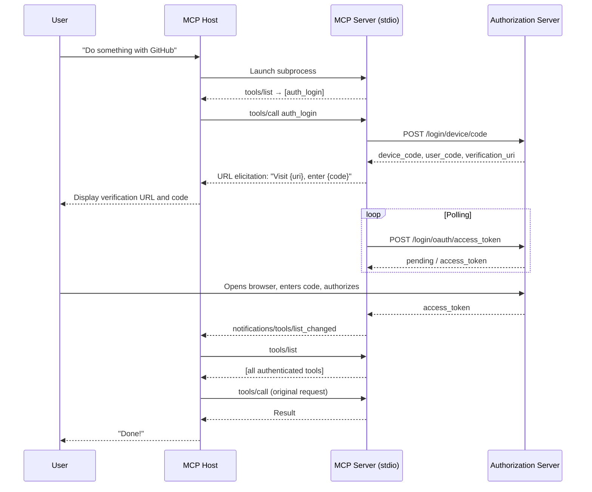
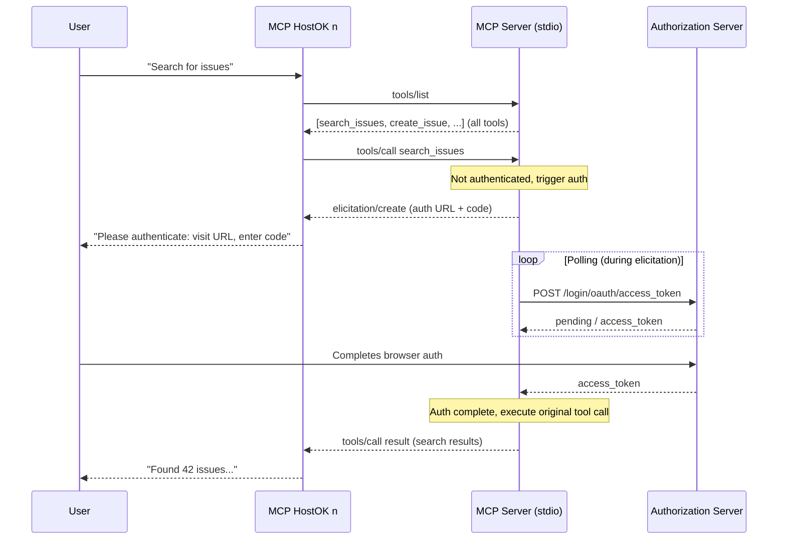

# SEP-0000: OAuth Device Flow for stdio MCP Servers

- **Status**: Draft
- **Type**: Standards Track
- **Created**: 2026-01-07
- **Author(s)**: Sam Morrow (@sammorrowdrums)
- **Sponsor**: None (seeking sponsor)
- **PR**: https://github.com/modelcontextprotocol/modelcontextprotocol/pull/2059

## Abstract

This SEP proposes a standardized mechanism for stdio-based MCP servers to perform OAuth authentication using the OAuth 2.0 Device Authorization Grant (RFC 8628). The approach uses ephemeral tokens issued at runtime—eliminating the need for token storage—combined with MCP primitives (`tools/list_changed`, URL elicitation, and an `auth_login` tool) to provide a seamless authentication experience. This specification also defines optional CIMD (Client ID Metadata Document) passthrough from host applications, enabling servers to authenticate using the host's application identity rather than requiring embedded or user-provided OAuth credentials.

Critically, this specification is designed to be **implementable at the SDK level**, allowing server authors to simply opt-in to OAuth support and provide a default OAuth application—the SDK handles all authentication complexity internally.

## Motivation

### The Problem

The current MCP authorization specification explicitly states that stdio transport implementations "SHOULD NOT follow this specification, and instead retrieve credentials from the environment." In practice, this has led to widespread use of Personal Access Tokens (PATs) stored in plaintext configuration files:

```json
{
  "github": {
    "command": "docker",
    "args": ["run", "--rm", "-e", "GITHUB_PERSONAL_ACCESS_TOKEN", "ghcr.io/github/github-mcp-server"],
    "env": {
      "GITHUB_PERSONAL_ACCESS_TOKEN": "ghp_xxxx"
    }
  }
}
```

This pattern creates several problems:

| Problem | Impact |
|---------|--------|
| **Long-lived tokens** | PATs often have indefinite expiration, increasing exposure window |
| **Over-scoped access** | Users grant more permissions than needed "just in case" |
| **Plaintext storage** | Tokens in config files are vulnerable to theft |
| **Manual lifecycle** | Token rotation, revocation, and scope changes require user action |
| **Context sharing** | Same token used across multiple agents and contexts |
| **Scope rigidity** | No mechanism for progressive authorization or step-up auth |

### Why Device Flow?

The OAuth 2.0 Device Authorization Grant (RFC 8628) is specifically designed for devices with limited input capabilities—a category that includes stdio-based processes. Key benefits:

1. **No browser integration required**: The server process doesn't need to open browsers or handle redirects
2. **Ephemeral tokens**: Tokens are obtained at runtime and held in memory only
3. **Standard OAuth**: Full OAuth 2.1 compliance with PKCE support
4. **Scope challenge compatible**: Can request additional scopes via step-up authorization
5. **User-visible consent**: Users see exactly what they're authorizing in their browser

### Reference Implementation

This SEP is informed by a working implementation in the GitHub MCP Server ([PR #1649](https://github.com/github/github-mcp-server/pull/1649)), which demonstrates the feasibility of this approach in production.

### SDK-Level Implementation

Critically, this specification is designed to be implementable at the **SDK level**, not requiring server authors to implement OAuth flows themselves. The official MCP SDKs (TypeScript, Python, Go, etc.) can provide:

- Built-in `AuthManager` components handling the device flow state machine
- Automatic `auth_login` tool registration when OAuth is enabled
- Token storage, refresh, and lifecycle management
- CIMD passthrough handling

Server implementers would simply **opt-in** to OAuth support and provide a default OAuth application configuration:

```typescript
// TypeScript SDK example
const server = new McpServer({
  name: "my-mcp-server",
  oauth: {
    enabled: true,
    clientId: "Ov23ctTMsnT9LTRdBYYM",  // Default app
    authorizationServer: "https://github.com",
    scopes: ["repo", "read:user"]
  }
});
```

```python
# Python SDK example
server = McpServer(
    name="my-mcp-server",
    oauth=OAuthConfig(
        enabled=True,
        client_id="Ov23ctTMsnT9LTRdBYYM",
        authorization_server="https://github.com",
        scopes=["repo", "read:user"]
    )
)
```

```go
// Go SDK example
server := mcp.NewServer(
    mcp.WithOAuth(mcp.OAuthConfig{
        Enabled:             true,
        ClientID:            "Ov23ctTMsnT9LTRdBYYM",
        AuthorizationServer: "https://github.com",
        Scopes:              []string{"repo", "read:user"},
    }),
)
```

The SDK handles all complexity:
- Detecting unauthenticated state on startup
- Registering/managing the `auth_login` tool
- Executing device flow and polling
- Sending `tools/list_changed` notifications
- Injecting authenticated clients into tool handlers
- Token refresh and re-authentication flows

This dramatically lowers the barrier to adoption—server authors get OAuth "for free" by enabling a flag and providing their OAuth app credentials.

## Specification

### 1. Overview

The device flow for stdio MCP servers operates in three phases:

1. **Unauthenticated startup**: Server starts with a minimal `auth_login` tool
2. **Interactive authentication**: User completes device flow via browser
3. **Authenticated operation**: Full tool set becomes available



### 2. Server Startup Modes

#### 2.1 Unauthenticated Mode

When a stdio MCP server supports device flow authentication and starts without pre-configured credentials, it **MUST**:

1. Start successfully (not fail or exit)
2. Complete MCP initialization normally
3. Advertise only the `auth_login` tool (and optionally `auth_status`)
4. Return appropriate errors for any tool calls requiring authentication

```json
{
  "jsonrpc": "2.0",
  "method": "tools/list",
  "id": 1
}
```

Response in unauthenticated mode:

```json
{
  "jsonrpc": "2.0",
  "result": {
    "tools": [
      {
        "name": "auth_login",
        "description": "Authenticate with the service using OAuth device flow",
        "inputSchema": {
          "type": "object",
          "properties": {},
          "required": []
        }
      }
    ]
  },
  "id": 1
}
```

#### 2.2 Pre-authenticated Mode

If credentials are available (via environment variable, prior token, etc.), the server **MAY** start in authenticated mode with the full tool set immediately available.

### 3. The `auth_login` Tool

#### 3.1 Tool Definition

The `auth_login` tool **MUST** be defined as follows:

```json
{
  "name": "auth_login",
  "description": "Authenticate with {service_name} using OAuth. This will provide a URL and code for browser-based authentication. Once completed, additional tools will become available.",
  "inputSchema": {
    "type": "object",
    "properties": {
      "scopes": {
        "type": "array",
        "items": { "type": "string" },
        "description": "Optional: Specific OAuth scopes to request"
      }
    },
    "required": []
  }
}
```

#### 3.2 Tool Execution Flow

When `auth_login` is called, the server **MUST**:

1. **Initiate Device Authorization Request** (RFC 8628 §3.1):
   ```http
   POST /login/device/code HTTP/1.1
   Host: authorization-server.example.com
   Content-Type: application/x-www-form-urlencoded

   client_id=...&scope=...
   ```

2. **Elicit URL from User** using MCP URL elicitation (if supported by host):
   ```json
   {
     "jsonrpc": "2.0",
     "method": "elicitation/create",
     "params": {
       "message": "Please visit the following URL and enter the code to authenticate:",
       "requestedSchema": {
         "type": "object",
         "properties": {
           "action": {
             "type": "string",
             "enum": ["opened", "cancelled"],
             "title": "Authentication Action",
             "description": "Visit {verification_uri} and enter code: {user_code}"
           }
         }
       }
     },
     "id": 2
   }
   ```

3. **Poll for Token** (RFC 8628 §3.4) with progress notifications:
   ```json
   {
     "jsonrpc": "2.0",
     "method": "notifications/progress",
     "params": {
       "progressToken": "auth_login_progress",
       "progress": 50,
       "total": 100,
       "message": "Waiting for browser authorization..."
     }
   }
   ```

4. **On Success**:
   - Store token in memory (ephemeral)
   - Initialize authenticated clients/services
   - Send `notifications/tools/list_changed`
   - Return success result

5. **On Failure**:
   - Return appropriate error (timeout, denied, etc.)
   - Remain in unauthenticated mode

#### 3.3 Success Response

```json
{
  "jsonrpc": "2.0",
  "result": {
    "content": [
      {
        "type": "text",
        "text": "Successfully authenticated as @username. You now have access to all available tools."
      }
    ]
  },
  "id": 1
}
```

#### 3.4 Error Responses

| Error | Description |
|-------|-------------|
| `authorization_pending` | User hasn't completed authorization yet (internal, not returned to client) |
| `slow_down` | Polling too fast (internal, server adjusts) |
| `access_denied` | User denied the authorization request |
| `expired_token` | Device code expired before user completed authorization |

### 4. Dynamic Tool Registration via `tools/list_changed`

After successful authentication, the server **MUST** send a `notifications/tools/list_changed` notification:

```json
{
  "jsonrpc": "2.0",
  "method": "notifications/tools/list_changed"
}
```

The host **SHOULD** then call `tools/list` to discover the newly available tools. The `auth_login` tool **MAY** be removed from the list or retained (for re-authentication scenarios).

### 4.1 Alternative: Lazy Authentication (On-Demand Auth)

As an alternative to the `tools/list_changed` approach, implementations **MAY** use a "lazy authentication" pattern where:

1. **All tools are advertised immediately** on startup (not just `auth_login`)
2. **Authentication state is tracked internally** by the SDK/server
3. **First unauthenticated tool call triggers auth flow** via elicitation
4. **Tool call completes after auth succeeds**

This approach has several advantages:

| Benefit | Description |
|---------|-------------|
| **Simpler host requirements** | No need to handle `tools/list_changed` notifications |
| **Better discoverability** | Users/agents see all available tools upfront |
| **Seamless UX** | Auth happens transparently when needed |
| **Reduced round-trips** | No need to re-fetch tool list after auth |

#### 4.1.1 Lazy Auth Flow



#### 4.1.2 SDK Implementation

The SDK tracks authentication state and wraps tool handlers:

```typescript
// SDK internal pseudo-code
async function handleToolCall(request: ToolCallRequest): Promise<ToolCallResult> {
  const tool = this.tools.get(request.name);
  
  if (tool.requiresAuth && !this.authManager.isAuthenticated()) {
    // Trigger device flow via elicitation
    await this.authManager.authenticateViaElicitation();
  }
  
  // Now execute the actual tool
  return tool.handler(request, this.authManager.getClient());
}
```

#### 4.1.3 When to Use Each Approach

| Approach | Best For |
|----------|----------|
| **`tools/list_changed`** | Hosts that want explicit auth state, strict tool visibility control |
| **Lazy Auth** | Simpler hosts, better UX, reduced complexity |

Implementations **SHOULD** support lazy auth as the default when the SDK handles OAuth, falling back to explicit `tools/list_changed` for custom implementations or when hosts explicitly request it.

### 5. Ephemeral Token Management

#### 5.1 Token Storage

Tokens obtained via device flow **SHOULD** be:

- Stored in memory only (not persisted to disk)
- Valid only for the lifetime of the server process
- Automatically discarded when the process exits

This provides security benefits:

| Benefit | Description |
|---------|-------------|
| **No persistence risk** | No token files to steal or leak |
| **Session-scoped** | Each container/process run requires fresh auth |
| **Clean revocation** | Stopping the server = revoking access |
| **Reduced exposure** | Short-lived sessions limit breach impact |

#### 5.2 Token Refresh

Servers **MAY** implement refresh token support for longer sessions:

- Store refresh token in memory alongside access token
- Automatically refresh before access token expiry
- Handle refresh failures by prompting re-authentication via `tools/list_changed`

#### 5.3 Optional Token Persistence

Implementations **MAY** provide optional token persistence for improved UX:

- **MUST** use secure storage mechanisms (OS keychain, encrypted file)
- **MUST** document the security implications
- **SHOULD** make persistence opt-in, not default

### 6. CIMD Passthrough from Host Applications

#### 6.1 Motivation

When a host application (e.g., Claude Desktop, VS Code) already has an OAuth identity via CIMD (Client ID Metadata Document), the MCP server can use this identity instead of requiring its own OAuth app credentials. This enables:

- Consistent application identity across the ecosystem
- No need for server-embedded OAuth credentials
- Enterprise policy enforcement via CIMD trust tiers
- Seamless integration with hosts that support OAuth

#### 6.2 Client Identity Configuration

Hosts **MAY** pass CIMD information to stdio servers via environment variables:

```bash
# CIMD URL as client_id (the host's OAuth identity)
MCP_OAUTH_CLIENT_ID="https://claude.ai/oauth/client-metadata.json"
```

> **Note**: The authorization server is **not** passed by the host. The server itself knows which authorization server to use (e.g., the GitHub MCP server knows to use `github.com`). The host only provides its CIMD identity so the server can authenticate on behalf of the host application.

Alternatively, hosts **MAY** pass this information via initialization parameters:

```json
{
  "jsonrpc": "2.0",
  "method": "initialize",
  "params": {
    "protocolVersion": "2025-11-25",
    "capabilities": {
      "auth": {
        "cimd": {
          "clientId": "https://claude.ai/oauth/client-metadata.json"
        }
      }
    },
    "clientInfo": {
      "name": "Claude Desktop",
      "version": "1.0.0"
    }
  },
  "id": 1
}
```

#### 6.3 Server Behavior with CIMD

When a server receives CIMD configuration:

1. **Validate the CIMD URL**: Ensure it's a valid HTTPS URL
2. **Use as `client_id`**: Pass the CIMD URL as the `client_id` in OAuth requests
3. **Device flow still applies**: The authorization flow remains the same
4. **No embedded secrets**: Public client model—no client_secret required

```http
POST /login/device/code HTTP/1.1
Host: github.com
Content-Type: application/x-www-form-urlencoded

client_id=https://claude.ai/oauth/client-metadata.json&scope=repo
```

#### 6.4 Authorization Server Knowledge

The MCP server **already knows** its authorization server—this is intrinsic to the server's purpose:

- GitHub MCP Server → `github.com`
- Slack MCP Server → `slack.com`
- Google MCP Server → `accounts.google.com`

The host does not need to (and should not) configure the authorization server. The server validates that its authorization server supports CIMD by checking for `client_id_metadata_document_supported` in the AS metadata.

### 7. Redirect-Based Flow (Optional Extension)

For hosts that can handle browser redirects, servers **MAY** support the standard Authorization Code flow as an alternative to device flow:

#### 7.1 Host Capability Advertisement

Hosts that support redirect handling **SHOULD** advertise this in initialization:

```json
{
  "jsonrpc": "2.0",
  "method": "initialize",
  "params": {
    "capabilities": {
      "auth": {
        "redirectFlow": {
          "callbackUri": "http://127.0.0.1:{port}/callback",
          "autoOpen": true
        }
      }
    }
  }
}
```

#### 7.2 Flow Selection Priority

When both flows are available, servers **SHOULD** prefer:

1. **Redirect flow with CIMD**: If host supports redirects and provides CIMD identity
2. **Redirect flow without CIMD**: If host supports redirects
3. **Device flow with CIMD**: If host provides CIMD but no redirect support
4. **Device flow standalone**: Fallback for all cases

#### 7.3 Redirect Flow Execution

If using redirect flow:

1. Server generates authorization URL with PKCE
2. Server requests host to open URL (via elicitation or capability)
3. Host opens browser, handles redirect to callback URI
4. Host passes authorization code back to server
5. Server exchanges code for token

This provides a more streamlined experience when the host can handle it.

### 8. Scope Challenge Support

With OAuth tokens (vs static PATs), servers can implement scope challenges per the MCP authorization spec.

#### 8.1 Detecting Insufficient Scope

When an operation fails due to insufficient permissions, the server **SHOULD**:

1. Return an error with scope hint:
   ```json
   {
     "jsonrpc": "2.0",
     "error": {
       "code": -32001,
       "message": "Insufficient scope",
       "data": {
         "required_scopes": ["repo", "admin:org"],
         "current_scopes": ["repo"]
       }
     },
     "id": 1
   }
   ```

2. Provide an `auth_upgrade_scope` tool for step-up authorization

#### 8.2 Step-Up Authorization Tool

```json
{
  "name": "auth_upgrade_scope",
  "description": "Request additional OAuth scopes for operations requiring elevated permissions",
  "inputSchema": {
    "type": "object",
    "properties": {
      "scopes": {
        "type": "array",
        "items": { "type": "string" },
        "description": "Additional scopes to request"
      }
    },
    "required": ["scopes"]
  }
}
```

This tool initiates a new device flow with the expanded scope set.

### 9. Security Considerations

#### 9.1 Device Code Security

Per RFC 8628:
- Device codes **MUST** be cryptographically random
- Device codes **MUST** have limited lifetime (typically 15 minutes)
- User codes **SHOULD** be short and human-readable (e.g., "ABCD-1234")

#### 9.2 Polling Rate Limiting

Servers **MUST** respect the `interval` parameter from the device authorization response and implement exponential backoff on `slow_down` errors.

#### 9.3 CIMD Validation

When using CIMD passthrough:
- Servers **SHOULD NOT** fetch CIMD documents themselves (that's the AS's job)
- Servers **MUST** validate that provided `client_id` is a valid HTTPS URL
- Servers **MAY** reject `client_id` values that don't match expected patterns

#### 9.4 Ephemeral Token Benefits

Ephemeral tokens provide defense-in-depth:
- No token storage = no token theft from disk
- Process exit = automatic token invalidation
- Container `--rm` = guaranteed cleanup
- Short sessions = limited exposure window

#### 9.5 Host Trust

Servers **SHOULD** be cautious about CIMD values passed from hosts:
- Consider allowlisting known CIMD URLs for sensitive servers
- Log CIMD values used for audit purposes
- Display the authenticating identity to users during consent

### 10. Implementation Requirements

#### 10.1 Server Requirements

| Requirement | Level |
|-------------|-------|
| Support unauthenticated startup mode | MUST |
| Implement `auth_login` tool OR lazy auth | MUST |
| Send `tools/list_changed` after auth (if using explicit auth tool) | MUST |
| Support lazy auth pattern | SHOULD |
| Store tokens in memory only (by default) | SHOULD |
| Support CIMD passthrough | SHOULD |
| Support scope challenges | MAY |
| Support redirect flow | MAY |

#### 10.2 SDK Requirements

| Requirement | Level |
|-------------|-------|
| Provide opt-in OAuth configuration | MUST |
| Handle device flow state machine internally | MUST |
| Support both explicit and lazy auth patterns | SHOULD |
| Provide default OAuth app configuration mechanism | SHOULD |
| Support CIMD passthrough from host | SHOULD |
| Abstract token lifecycle from server authors | SHOULD |

#### 10.3 Host Requirements

| Requirement | Level |
|-------------|-------|
| Handle `tools/list_changed` notifications | SHOULD (MUST if not supporting elicitation during tool calls) |
| Support URL elicitation | SHOULD |
| Support elicitation during tool call execution | SHOULD (enables lazy auth) |
| Pass CIMD configuration to servers | MAY |
| Support redirect flow callbacks | MAY |

## Rationale

### Why Device Flow Over Other Approaches?

| Approach | Pros | Cons |
|----------|------|------|
| **Device Flow** | No browser integration needed, standard OAuth, works everywhere | Requires user action in browser |
| **Authorization Code** | Most common OAuth flow | Requires redirect handling, complex for stdio |
| **Client Credentials** | Simple, no user interaction | No user context, not suitable for user-scoped access |
| **PATs** | Simple to implement | Long-lived, over-scoped, stored in plaintext |

Device flow provides the best balance for stdio processes: standard OAuth compliance, user-visible consent, and no need for complex browser integration.

### Why Ephemeral Tokens?

Ephemeral tokens address the core security concerns with PATs:

1. **No storage = no theft**: Tokens exist only in process memory
2. **Session-scoped**: Natural boundaries via process lifecycle
3. **Forced freshness**: Users must re-authenticate for new sessions
4. **Auditability**: Each session is a distinct authorization event

The tradeoff (re-authentication on restart) is acceptable for most use cases and can be mitigated with optional secure persistence.

### Why CIMD Passthrough?

CIMD passthrough solves the "N servers × M apps" problem:

- Without CIMD: Each server needs its own OAuth app registration
- With CIMD: Servers use the host's existing OAuth identity

This aligns with the broader MCP ecosystem direction toward CIMD adoption.

## Backward Compatibility

This proposal is **fully backward compatible**:

1. **Existing servers**: PAT-based authentication continues to work
2. **Existing hosts**: Servers with device flow work even if host doesn't support new capabilities
3. **Gradual adoption**: Servers can support both PAT and device flow simultaneously

Servers implementing this specification **SHOULD** continue supporting environment-based credentials for backward compatibility.

## Security Implications

| Consideration | Mitigation |
|--------------|------------|
| Device code interception | Short-lived codes, rate limiting, user verification in browser |
| Token theft from memory | Defense-in-depth via short sessions, OS memory protections |
| Malicious host CIMD injection | Server-side validation, optional allowlisting |
| Phishing via fake verification URLs | Display full verification URL, use well-known paths |

## Reference Implementation

A reference implementation exists in the GitHub MCP Server:
- [PR #1649: OAuth Device Flow Authentication](https://github.com/github/github-mcp-server/pull/1649)

Key components:
- `AuthManager`: State machine for device flow
- `auth_login` tool: Tool definition and execution
- `tools/list_changed`: Dynamic tool registration
- CIMD support: Planned in follow-up work

## Testing Plan

Implementations should cover:

1. **Unauthenticated startup**: Verify minimal tool set
2. **Device flow completion**: End-to-end authentication
3. **Tool list changes**: Verify notification and tool availability
4. **Token expiry**: Graceful handling of expired tokens
5. **Error cases**: Timeout, denial, network failures
6. **CIMD passthrough**: When host provides client identity
7. **Scope challenges**: Step-up authorization flow

## Open Questions

1. **Auth during initialize**: Should servers be able to trigger authentication during the `initialize` phase rather than waiting for tool calls? This would provide a cleaner flow where auth happens upfront:

   ```json
   {
     "jsonrpc": "2.0",
     "method": "initialize",
     "id": 1
   }
   // Server responds with elicitation request for auth before returning initialize result
   ```

   | Approach | Pros | Cons |
   |----------|------|------|
   | **Auth during initialize** | Cleaner flow, auth state known upfront, no `tools/list_changed` needed | Less back-compatible, delays startup, may auth unnecessarily |
   | **Auth via tools (current)** | Back-compatible, lazy evaluation, works with existing hosts | More complex, requires `tools/list_changed` or lazy auth pattern |

   **Important consideration**: Many host applications initialize servers at app startup, in background processes, or batch-initialize multiple servers at once. At these moments, the user may not be actively engaged with the application, making it a poor time to prompt for authentication. Tool-based auth (whether explicit `auth_login` or lazy auth) naturally triggers when the user is actively trying to do something, which is a better UX moment for auth prompts.

   This could still be a future extension where servers advertise `requiresAuth: true` in their capabilities, but the timing challenges suggest tool-based auth may be the better default.

2. **Lazy auth vs explicit auth default**: Should SDKs default to lazy auth (triggers on first tool call) or explicit auth (separate `auth_login` tool with `tools/list_changed`)? Lazy auth provides better UX but requires hosts to support elicitation during tool call execution.

3. **Token persistence standardization**: Should we standardize how optional token persistence works across platforms?

4. **Scope negotiation**: How should servers communicate available scopes to hosts for UI purposes?

5. **Multi-account support**: How should servers handle multiple authenticated accounts?

6. **Session resumption**: Should there be a standard for resuming sessions across server restarts?

## Prior Art and Related Work

This SEP builds upon and relates to several existing efforts in the MCP ecosystem:

### Why This Needs a SEP

The current MCP Authorization specification ([docs](https://modelcontextprotocol.io/specification/2025-06-18/basic/authorization)) explicitly states:

> "For local transport implementations, such as stdio-based implementations, implementors **SHOULD NOT** follow this specification, and instead retrieve credentials from the environment."

This creates a gap: there is no standardized mechanism for stdio MCP servers to perform OAuth authentication. Server implementers are left to invent their own patterns (split into `create_job`/`get_job` tools, environment variables, etc.), leading to fragmented UX and security practices.

No existing SEP addresses this gap:
- **SEP-1036** (URL Mode Elicitation, [PR #887](https://github.com/modelcontextprotocol/modelcontextprotocol/pull/887), merged) - Provides the elicitation primitive we leverage, but is focused on third-party downstream auth, not MCP server auth
- **SEP-991** (CIMD, [PR #1296](https://github.com/modelcontextprotocol/modelcontextprotocol/pull/1296), merged) - Defines Client ID Metadata Documents for client identity, which we reference for host identity passthrough
- **SEP-646** (Enterprise Managed Authorization, [PR #646](https://github.com/modelcontextprotocol/modelcontextprotocol/pull/646), merged) - Focuses on enterprise IdP integration for HTTP servers
- **SEP-1933** (Workload Identity Federation, [PR #1933](https://github.com/modelcontextprotocol/modelcontextprotocol/pull/1933), draft) - Machine-to-machine auth, different use case

### Related Issues and PRs

| Reference | Description | Status | Relevance |
|-----------|-------------|--------|-----------|
| [github/github-mcp-server#132](https://github.com/github/github-mcp-server/issues/132) | "Non PAT auth method" - 23 upvotes requesting device flow | Open | Demonstrates community demand |
| [github/github-mcp-server#1649](https://github.com/github/github-mcp-server/pull/1649) | Reference implementation of device flow | Open | Proves feasibility |
| [#205](https://github.com/modelcontextprotocol/modelcontextprotocol/issues/205) | "Treat MCP server as OAuth resource server" - 147 reactions | Closed (completed) | Informed the RP-centric auth model |
| [PR #284](https://github.com/modelcontextprotocol/modelcontextprotocol/pull/284) | Major RFC updating Authorization spec | Merged | Foundation for current auth spec |
| [PR #338](https://github.com/modelcontextprotocol/modelcontextprotocol/pull/338) | MCP Servers as Resource Servers, Protected Resource Metadata | Merged | Established MCP auth architecture |
| [#1686](https://github.com/modelcontextprotocol/modelcontextprotocol/issues/1686) | SEP-1686: Tasks for long-running operations | Accepted | Could complement async auth flows |

### Key Distinctions

This SEP fills a specific gap not covered by existing work:

1. **Transport-specific**: Focuses specifically on stdio transport, which cannot use HTTP-based OAuth flows
2. **Device flow**: Uses RFC 8628 Device Authorization Grant, not covered elsewhere in MCP
3. **SDK-implementable**: Designed for SDK authors to provide "auth for free" to server implementers
4. **Ephemeral tokens**: Prioritizes runtime tokens over stored credentials
5. **Lazy auth pattern**: Proposes elicitation-based auth during tool calls as an alternative to explicit auth tools

The closest related work (SEP-1036 URL Mode Elicitation) explicitly focuses on *third-party downstream* authorization—when an MCP server needs to access external APIs on behalf of the user. This SEP addresses the *primary* authorization—authenticating the MCP server itself with its backing service.

## Acknowledgments

- GitHub MCP Server team for the reference implementation
- MCP Core Maintainers for authorization spec guidance
- IETF OAuth Working Group for RFC 8628 and CIMD specifications
- ArcadeAI team for SEP-1036 URL Mode Elicitation work

## References

- [RFC 8628 - OAuth 2.0 Device Authorization Grant](https://datatracker.ietf.org/doc/html/rfc8628)
- [OAuth Client ID Metadata Document](https://datatracker.ietf.org/doc/html/draft-ietf-oauth-client-id-metadata-document)
- [MCP Authorization Specification](https://modelcontextprotocol.io/specification/draft/basic/authorization)
- [GitHub MCP Server Device Flow PR](https://github.com/github/github-mcp-server/pull/1649)
- [RFC 9728 - OAuth 2.0 Protected Resource Metadata](https://datatracker.ietf.org/doc/html/rfc9728)

