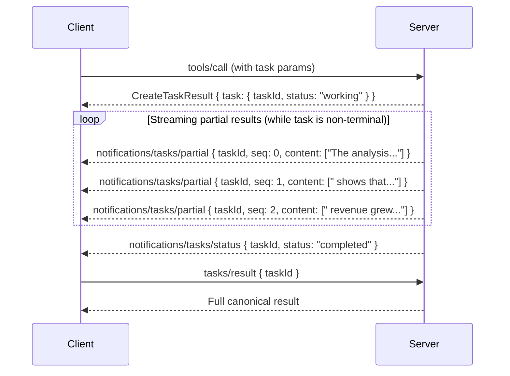

# SEP-0000: Task Streaming — Partial Results for Long-Running Operations

- **Status**: Draft
- **Type**: Standards Track
- **Created**: 2026-05-03
- **Author(s)**: Raman Marozau <raman@stdiobus.com> (https://github.com/morozow)
- **Sponsor**: None (seeking sponsor)
- **PR**: Pending — to be filed against [modelcontextprotocol/modelcontextprotocol](https://github.com/modelcontextprotocol/modelcontextprotocol)

## Abstract

This SEP extends the Tasks primitive ([SEP-1686](https://github.com/modelcontextprotocol/modelcontextprotocol/issues/1686)) with streaming partial results. It introduces a new notification type `notifications/tasks/partial` that allows task receivers to push incremental content chunks to requestors while a task is in progress. This enables real-time streaming of LLM-generated text, progressive analysis results, and other incremental outputs through the existing task lifecycle — without requiring polling, without breaking backward compatibility, and without introducing a separate streaming primitive.

The proposal builds directly on the "Intermediate Results" and "Push Notifications" items identified as future work in [SEP-1686](https://github.com/modelcontextprotocol/modelcontextprotocol/issues/1686).

## Motivation

[SEP-1686](https://github.com/modelcontextprotocol/modelcontextprotocol/issues/1686) introduced Tasks as a "call-now, fetch-later" mechanism for long-running MCP operations. Tasks solve the critical problem of deferred result retrieval and active status polling. However, the current Tasks model has a fundamental gap: **there is no standard way to deliver incremental content while a task is executing**.

This gap creates concrete problems across four categories of MCP deployments.

### 1. Agent-to-Agent Communication Latency

In multi-agent systems, Agent A invokes a tool on Agent B that delegates to an LLM. Without streaming, Agent A receives nothing for 10–30 seconds until the full response is generated. In multi-hop architectures (A → B → C → LLM), this latency compounds at each layer.

With partial results, each layer can begin processing incremental output as it arrives. A planning agent can evaluate the first tokens of a response and decide to cancel or redirect the task early — before waiting for full generation. This is not a theoretical concern: Amazon's multi-agent systems (cited in [SEP-1686](https://github.com/modelcontextprotocol/modelcontextprotocol/issues/1686) Motivation, use case #6) explicitly identified cascading delays as a production problem.

### 2. IDE and User-Facing Application UX

IDE integrations (VS Code, JetBrains, Kiro) and desktop applications (Claude Desktop) already provide streaming UX when calling LLM providers directly. When these same operations are routed through MCP Tasks, the user experience degrades to a spinner with no feedback for the duration of the operation.

This discourages tool developers from adopting Tasks: developers who need streaming UX avoid Tasks even when Tasks would provide better lifecycle management, cancellation, and result retrieval. The absence of streaming in Tasks reduces adoption likelihood for the most common MCP use case — LLM-backed tools.

### 3. Polling Overhead and Tail Latency

The current Tasks model relies on `tasks/get` polling with a server-suggested `pollInterval`. For a task that completes in 15 seconds with a 5-second poll interval, the client discovers completion anywhere from 0 to 5 seconds after the fact — an average of 2.5 seconds of unnecessary latency on every task.

For hosted MCP servers handling thousands of concurrent clients, polling creates significant operational overhead: each client maintains its own polling loop, generating N requests per task where N = duration / pollInterval. Push-based partial results eliminate this overhead entirely for clients that support them, while polling remains available as a fallback.

### 4. Developer Ergonomics and Consistency

MCP currently offers two execution models with incompatible streaming characteristics:

- **Synchronous tool calls**: Support streaming via the request/response cycle (transport-dependent).
- **Task-augmented tool calls**: No streaming. Results available only after completion.

Tool developers who need both long-running lifecycle management (Tasks) and streaming output (real-time UX) are forced to choose one or implement ad-hoc workarounds. A standard mechanism for task streaming eliminates this false choice and provides a consistent developer experience across both execution models.

### 5. Non-LLM Long-Running Operations

The streaming gap is not limited to LLM-backed tools. Build and test pipelines that run for minutes produce log output incrementally — without partial results, the client sees nothing until the entire pipeline completes. ETL processes and code scanners that discover results progressively (e.g., finding vulnerabilities one by one) cannot report findings until the full scan is done. In all these cases, the existing Tasks model forces an all-or-nothing result delivery that does not match the incremental nature of the underlying operation.

## Specification

This SEP extends the Tasks primitive as defined in [SEP-1686](https://github.com/modelcontextprotocol/modelcontextprotocol/issues/1686). All terminology and base semantics are inherited unless explicitly overridden. In particular, "receiver" refers to the party executing the task (typically the server), and "requestor" refers to the party that initiated the task-augmented request (typically the client). These terms are used consistently throughout this document.

### 1. New Notification: `notifications/tasks/partial`

A new JSON-RPC notification type is introduced for delivering incremental content from a task to its requestor.

#### 1.1. Notification Format

```json
{
  "jsonrpc": "2.0",
  "method": "notifications/tasks/partial",
  "params": {
    "taskId": "786512e2-9e0d-44bd-8f29-789f320fe840",
    "content": [
      {
        "type": "text",
        "text": "partial output chunk..."
      }
    ],
    "seq": 0
  }
}
```

#### 1.2. Parameters

```typescript
interface TaskPartialNotificationParams {
  /**
   * The task ID this partial result belongs to.
   * MUST match a task previously created via a task-augmented request.
   */
  taskId: string;

  /**
   * Incremental content produced by the task.
   * Uses the same ContentBlock type as tools/call results,
   * enabling uniform content handling across the protocol.
   */
  content: ContentBlock[];

  /**
   * Monotonically increasing sequence number assigned by the receiver.
   * MUST start at 0 for the first partial of a given task and MUST
   * increment by exactly 1 for each subsequent partial notification.
   */
  seq: number;
}
```

#### 1.3. Behavioral Requirements

1. Receivers **MAY** send zero or more `notifications/tasks/partial` notifications for a given task while the task is in a non-terminal status (`working` or `input_required`).
2. Receivers **MUST NOT** send `notifications/tasks/partial` after the task reaches a terminal status (`completed`, `failed`, `cancelled`).
3. Receivers **SHOULD** send all pending partial notifications before sending a terminal `notifications/tasks/status` notification.
4. The `seq` field **MUST** be a non-negative integer. Receivers **MUST** start at 0 and increment by exactly 1 for each partial notification within a single task. If a requestor receives a `seq` value that is not exactly one greater than the previously received `seq` for the same task, it **SHOULD** treat this as data loss, **MAY** log an error, **MAY** continue processing subsequent partials, but **MUST NOT** attempt to infer or synthesize the missing content.
5. The `content` field **MUST** contain at least one item. Empty `content` arrays are not permitted.
6. Requestors **MUST NOT** rely on `notifications/tasks/partial` for the complete result. The canonical result **MUST** be retrieved via `tasks/result` after the task reaches `completed` status.
7. Requestors **SHOULD** treat partial content as incremental — each notification carries new content, not a replacement of previous content.
8. The concatenation of all partial `content` items is **not** guaranteed to equal the final `tasks/result` content. Partial notifications are hints for incremental consumption and UX, not a canonical record. Receivers **MAY** include content in the final result that was not present in any partial, or omit content that was sent as a partial.
9. This SEP does not define partial semantics for non-text content types (e.g., images, audio, resource links). Receivers **MAY** choose to stream only text content via partials and include other content types only in the final `tasks/result`.
10. If a requestor receives a `notifications/tasks/partial` with a `seq` value lower than or equal to a previously received `seq` for the same task, it **SHOULD** discard the duplicate.
11. Content items within a single `notifications/tasks/partial` notification **SHOULD** be treated as an ordered batch that is logically appended as a group. Two notifications with `content: ["a"]` then `content: ["b"]` are semantically equivalent to one notification with `content: ["a", "b"]`.

### 2. Capability Negotiation

#### 2.1. Server Capabilities

Servers that support sending partial results **MUST** declare this in their `tasks` capability:

```json
{
  "capabilities": {
    "tasks": {
      "list": {},
      "cancel": {},
      "requests": {
        "tools": {
          "call": {}
        }
      },
      "streaming": {
        "partial": {}
      }
    }
  }
}
```

The `tasks.streaming.partial` capability indicates that the server **MAY** send `notifications/tasks/partial` notifications for tasks it creates. The `partial` field uses the presence-based pattern consistent with other task capabilities (`list`, `cancel`): its presence (as an object) indicates support, and the object may contain future extension fields.

#### 2.2. Client Capabilities

Clients that support receiving partial results **SHOULD** declare this in their `tasks` capability:

```json
{
  "capabilities": {
    "tasks": {
      "streaming": {
        "partial": {}
      }
    }
  }
}
```

#### 2.3. Negotiation Rules

1. If a server declares `tasks.streaming.partial` but the client does not, the server **SHOULD NOT** send `notifications/tasks/partial` notifications.
2. If a client declares `tasks.streaming.partial` but the server does not, the client **MUST NOT** expect to receive partial notifications.
3. Clients that declare `tasks.streaming.partial` **MUST** also support the base Tasks capability as defined in [SEP-1686](https://github.com/modelcontextprotocol/modelcontextprotocol/issues/1686). Partial results without task support is not a valid combination.
4. Partial result support is orthogonal to which request types support task augmentation. A server may support tasks for `tools/call` without supporting partial results, but cannot support partial results without supporting tasks.

### 3. Tool-Level Declaration

Tools **MAY** declare streaming support via the `execution` field in `tools/list` responses:

```json
{
  "name": "generate_analysis",
  "description": "Generate a detailed analysis report",
  "inputSchema": { ... },
  "execution": {
    "taskSupport": "optional",
    "streamPartial": true
  }
}
```

The `execution.streamPartial` field is a hint indicating that this specific tool intends to produce partial results when invoked as a task. Clients **SHOULD** treat this as informational for UX decisions (e.g., showing a streaming text area vs. a progress bar) and **MUST NOT** treat it as a guarantee. The absence of `execution.streamPartial` does not prevent a server from sending partial notifications for that tool, but clients should not expect them.

The `execution.taskSupport` field is defined in [SEP-1686](https://github.com/modelcontextprotocol/modelcontextprotocol/issues/1686) and is shown here for context only. Receivers **MAY** stream partial results for tools that do not declare `execution.streamPartial`; clients **SHOULD** treat the field as an optimization hint for UX, not a capability negotiation mechanism.

### 4. Interaction with Existing Task Lifecycle

Partial results integrate with the existing task lifecycle without modification:



Key points:

- `notifications/tasks/partial` is sent **between** task creation and task completion.
- `notifications/tasks/status` continues to report lifecycle changes as defined in [SEP-1686](https://github.com/modelcontextprotocol/modelcontextprotocol/issues/1686).
- `tasks/result` returns the complete, canonical result — identical to what would be returned without streaming.
- Polling via `tasks/get` remains available and unaffected.

### 5. Transport Considerations

#### 5.1. stdio Transport

Over stdio, `notifications/tasks/partial` is delivered as a standard JSON-RPC notification on stdout, one NDJSON line per notification. No transport-level changes are required.

When running behind a message routing layer (such as a process supervisor with session-based routing), implementers **SHOULD** include routing metadata (e.g., `sessionId`) in the notification envelope so that the router can forward partial notifications to the correct client connection. The specific mechanism for including routing metadata is transport-implementation-defined and outside the scope of this specification.

#### 5.2. Streamable HTTP Transport

Over Streamable HTTP, `notifications/tasks/partial` is delivered via the SSE stream associated with the client's session. No transport-level changes are required — the notification is a standard JSON-RPC notification delivered through the existing SSE channel.

#### 5.3. Rate Limiting

Receivers **SHOULD** implement rate limiting on partial notifications to prevent overwhelming clients or transport layers. Recommended practices:

- Batch small chunks into larger notifications when generation rate exceeds transport capacity.
- Respect transport-level backpressure signals (e.g., TCP window exhaustion, SSE buffer limits).
- Consider a minimum interval between notifications (e.g., 50ms) to avoid excessive overhead.
- Avoid excessively large individual partial notifications (e.g., multi-MB payloads). Prefer splitting large outputs into smaller chunks appropriate for the transport.

## Rationale

### Why a Separate Notification Type (`tasks/partial`) Instead of Extending `tasks/status`

We considered extending `notifications/tasks/status` with an optional `streamChunk` field. This was rejected for three reasons:

1. **Semantic clarity.** Status notifications represent lifecycle state transitions — infrequent, significant events. Partial results are high-frequency content delivery. Mixing these concerns in one notification type creates ambiguity: is a `status` notification with `streamChunk` but no state change a status update or a content delivery? A separate notification type eliminates this ambiguity.

2. **Filtering and routing.** Clients and middleware can filter notifications by method name. A client that wants streaming content subscribes to `tasks/partial`. A monitoring system that tracks task lifecycle subscribes to `tasks/status`. With a combined notification, both must parse every message to determine relevance.

3. **Future extensibility.** A dedicated `tasks/partial` notification can evolve independently — adding fields like `contentType`, `encoding`, or `priority` — without affecting the stable `tasks/status` schema.

### Why Not a New Top-Level Streaming Primitive

We considered introducing a general-purpose streaming primitive (e.g., `streams/create`, `streams/chunk`, `streams/close`) independent of Tasks. This was rejected because:

1. **Scope.** The immediate need is streaming within long-running operations — exactly what Tasks model. A general streaming primitive would need to address bidirectional streaming, multiplexing, and lifecycle management for arbitrary data flows. This is significantly more complex and not yet justified by concrete use cases.

2. **Adoption.** Tasks already exist ([SEP-1686](https://github.com/modelcontextprotocol/modelcontextprotocol/issues/1686)). Extending them is an incremental change that builds on existing capability negotiation, lifecycle management, and SDK support. A new primitive requires new capability negotiation, new lifecycle semantics, and new SDK surface area.

3. **Evolution path.** If future use cases require general-purpose streaming beyond Tasks, the `notifications/tasks/partial` pattern can inform the design. The `content` field uses the same `ContentBlock` type as the rest of MCP, making it straightforward to generalize later.

A key design invariant of this proposal is that `tasks/result` remains the single canonical source of truth for the complete result. Partial notifications are never required to reconstruct the final result. This invariant ensures that implementations can safely ignore partials without losing correctness, and that the protocol remains simple for clients that do not need streaming.

Additionally, Tasks already provide routing, authorization, lifecycle management, and cancellation semantics. A new streaming primitive would need to duplicate all of these mechanisms. By extending Tasks, we reuse the existing infrastructure.

### Relationship to [SEP-1686](https://github.com/modelcontextprotocol/modelcontextprotocol/issues/1686) Future Work

[SEP-1686](https://github.com/modelcontextprotocol/modelcontextprotocol/issues/1686) explicitly identified "Intermediate Results" and "Push Notifications" as future work:

> "Future extensions could enable tasks to report intermediate results or progress artifacts during execution. This would support use cases where servers can produce partial outputs before final completion, such as: Streaming analysis results as they become available."

This SEP is the concrete realization of that future work item. The design follows the direction outlined in [SEP-1686](https://github.com/modelcontextprotocol/modelcontextprotocol/issues/1686): using the task ID association mechanism to tie partial results to their originating task throughout its lifecycle.

### Prior Art

- **OpenAI Streaming API**: Uses Server-Sent Events with `delta` objects for incremental content delivery. Our `content` field serves the same purpose but uses MCP's existing `ContentBlock` type.
- **Anthropic Messages API**: Streams `content_block_delta` events with index-based ordering. Our `seq` field provides similar ordering guarantees.
- **Google Gemini Streaming**: Uses `generateContentStream` with chunked responses. Similar incremental delivery pattern.
- **ACP (Agent Communication Protocol)**: Supports streaming via `session/stream_chunk` notifications with session-based routing — directly analogous to our `notifications/tasks/partial` with task-based routing.

All major LLM providers have converged on the pattern of incremental content delivery with sequence ordering. This SEP brings the same pattern to MCP Tasks.

## Backward Compatibility

This SEP introduces **no backward incompatibilities**.

### Additive Changes Only

- A new notification type (`notifications/tasks/partial`) is added. Existing notification types are unchanged.
- A new capability field (`tasks.streaming.partial`) is added. Existing capability fields are unchanged.
- A new tool execution field (`execution.streamPartial`) is added. Existing tool fields are unchanged.

### Graceful Degradation

- **Old clients, new servers**: Server declares `tasks.streaming.partial`. Old client does not declare it. Server should not send partials (per negotiation rules). Even if server sends them, old client ignores unknown notifications per JSON-RPC 2.0 specification. Task lifecycle and `tasks/result` work identically.
- **New clients, old servers**: Client declares `tasks.streaming.partial`. Old server does not. Client does not receive partials. Client falls back to polling via `tasks/get` and retrieves result via `tasks/result`. No behavioral change.
- **Mixed environments**: Partial results are purely additive. The canonical result is always available via `tasks/result`. Partials are a progressive enhancement, not a replacement.

### Behavioral Considerations

1. **Notification frequency**: Servers that send partial results will generate significantly more notifications than servers that only send status updates. Clients and middleware that log or buffer all notifications should be prepared for higher volumes. The specification recommends rate limiting (Section 5.3).
2. **Ordering**: The `seq` field provides strict ordering guarantees with +1 increments. Clients that observe a gap in `seq` values should treat it as data loss.
3. **Middleware filtering**: Intermediaries that perform method-based notification filtering **MUST** be updated to allow `notifications/tasks/partial` if partial results are desired by downstream clients. Intermediaries that do not recognize the method will silently drop these notifications, which is safe but eliminates the streaming benefit.
4. **Non-conformant clients**: Clients that incorrectly assume any task-related notification implies task completion may misbehave when partial results are introduced. Such clients are already non-conformant with [SEP-1686](https://github.com/modelcontextprotocol/modelcontextprotocol/issues/1686), and this SEP does not attempt to accommodate that behavior.

## Security Implications

### Task Isolation

Partial result notifications inherit the same security model as task status notifications ([SEP-1686](https://github.com/modelcontextprotocol/modelcontextprotocol/issues/1686), Section 8.1). Receivers **MUST** ensure that `notifications/tasks/partial` is only delivered to the requestor that created the task. When authorization context is available, receivers **MUST** bind partial notifications to the same context as the task.

### Content Sensitivity

Partial results may contain sensitive content (e.g., partial PII, incomplete code with security implications). Receivers **SHOULD** apply the same content filtering and access controls to partial results as to final results.

### Denial of Service

High-frequency partial notifications could be used to overwhelm clients or transport layers. The rate limiting recommendations in Section 5.3 mitigate this risk. Additionally, clients **SHOULD** implement their own rate limiting on incoming notifications and **MAY** disconnect if a server exceeds reasonable notification rates.

### Timing Side-Channels

The timing and frequency of partial notifications can potentially leak information about underlying processing (e.g., different task types may produce partials at characteristic rates). In high-sensitivity environments, receivers **MAY** choose to normalize or limit partial update frequency to reduce information leakage.

### Interaction with Cancellation

When a task is cancelled, the receiver may still emit a small number of partial notifications before the cancellation takes effect due to the asynchronous nature of notifications. Receivers **SHOULD** stop emitting partial notifications as soon as a task is marked as cancelled. Requestors **SHOULD** discard any partial notifications received after observing a terminal task status.

### Task Identity Validation

Implementations **MUST** treat `taskId` as an opaque identifier and **MUST NOT** infer trust solely from it. Task identity and ownership **MUST** be validated against server-side task state before delivering partial notifications. This is consistent with the task isolation requirements in [SEP-1686](https://github.com/modelcontextprotocol/modelcontextprotocol/issues/1686), Section 8.1.

## Reference Implementation

> The following reference implementation details are non-normative and provided as guidance for implementers.

A reference implementation will be provided in two components:

### 1. Server Implementation: `@stdiobus/mcp-agentic`

The `mcp-agentic` framework ([github.com/stdiobus/mcp-agentic](https://github.com/stdiobus/mcp-agentic)) will implement task streaming for both execution backends:

- **InProcessExecutor**: Agents implementing `stream()` on `AgentHandler` will emit partial results as `notifications/tasks/partial` when invoked as tasks.
- **WorkerExecutor**: External ACP worker processes will send `session/stream_chunk` notifications via stdio Bus, which `McpAgenticServer` translates to `notifications/tasks/partial` on the MCP side.

The stdio Bus kernel ([github.com/stdiobus/stdiobus](https://github.com/stdiobus/stdiobus)) provides the transport layer for worker-based streaming, using its existing session-based notification routing (Specification Section 6.3.2) to deliver partial results from workers to the correct client connection.

### 2. SDK Changes: `@modelcontextprotocol/typescript-sdk` (fork)

A fork of the TypeScript SDK ([https://github.com/modelcontextprotocol/typescript-sdk/pull/2015](https://github.com/modelcontextprotocol/typescript-sdk/pull/2015), branch `sep/task-streaming-partial-results-notifications`) will demonstrate:

- **Server**: `server.experimental.tasks.sendTaskPartial(taskId, content, seq)` and `server.experimental.tasks.createPartialEmitter(taskId)` helpers on `ExperimentalMcpServerTasks` for emitting partial notifications from background work, with automatic `seq` management and Zod-based payload validation.
- **Client**: `client.experimental.tasks.subscribeTaskPartials(taskId, handler)` on `ExperimentalClientTasks` for receiving and processing partial results, with automatic `seq`-based ordering and deduplication.
- **Types**: `TaskPartialNotificationParams`, `TaskPartialNotification` Zod schemas and inferred TypeScript types, extended `ServerCapabilities` / `ClientCapabilities` with `tasks.streaming.partial` (presence-based), and `ToolExecution.streamPartial` boolean hint.

### 3. End-to-End Example

A complete example demonstrating:
- An MCP server with a task-augmented tool that streams LLM output token by token.
- An MCP client that displays streaming text as it arrives, then retrieves the final result.
- Wire-format traces showing the full JSON-RPC message sequence.

## Open Questions

1. **`done` field on the last partial.** The current proposal relies on `notifications/tasks/status` with `completed` status to signal the end of streaming. An explicit `done: true` on the last partial would allow clients to detect stream completion without waiting for the status notification, reducing latency by one notification round-trip. Preliminary assessment is that relying on `tasks/status` is sufficient and `done` would add redundancy without clear benefit at this stage. This can be revisited if implementer feedback indicates otherwise.

2. **Non-text content streaming semantics.** This SEP explicitly defers partial semantics for non-text content types. Future work may define how images, audio, or resource links can be streamed incrementally (e.g., progressive image rendering, audio chunk delivery). Should this be addressed in a follow-up SEP or left to individual implementations?

## Acknowledgments

- [SEP-1686](https://github.com/modelcontextprotocol/modelcontextprotocol/issues/1686) authors (Surbhi Bansal, Luca Chang) for the Tasks primitive and the explicit identification of intermediate results as future work.
- The stdio Bus project ([stdiobus.com](https://stdiobus.com)) for the session-based notification routing model that informed the transport considerations in this proposal.
