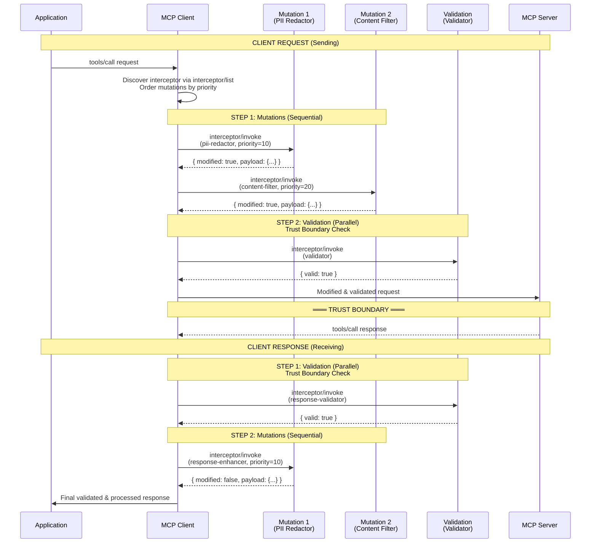
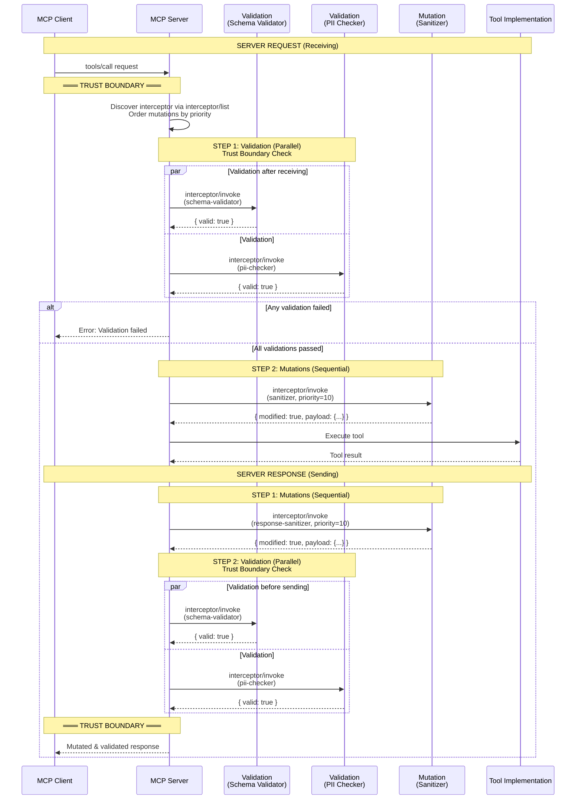
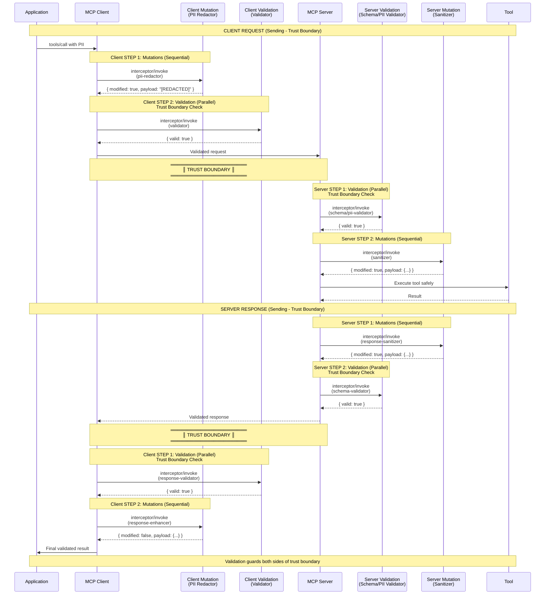

# SEP-1763: Interceptors for Model Context Protocol

- **Status**: Draft
- **Type**: Standards Track
- **Created**: 2025-11-04
- **Author(s)**: Sambhav Kothari (@sambhav), Kurt Degiorgio (@Degiorgio), Peder Holdgaard Pedersen (@PederHP)
- **Sponsor**: Sambhav Kothari (@sambhav)
- **PR**: https://github.com/modelcontextprotocol/modelcontextprotocol/pull/2624

## Abstract

This SEP proposes an interceptor framework for the Model Context Protocol (MCP) that allows context operations to be intercepted, validated, and transformed at key points in the agentic lifecycle. It introduces a new MCP primitive for operations that shape agent context, including MCP-defined operations such as tool invocations, resource access, and prompt handling, as well as other well defined context operations with a standardized interface. Like other MCP primitives, interceptors are deployed as MCP servers and can be invoked by both clients and servers. The framework defines two types of interceptors, validators, which check context and return a pass/fail decision, and mutators, which transform context and return a modified payload. Interceptors follow a deterministic, trust-boundary-aware execution model and are discoverable and invocable through MCP's existing JSON-RPC patterns.

## Motivation

**The Problem: A Sprawling Ecosystem Without Reusability**

The MCP ecosystem is rapidly developing a sprawling landscape of sidecars, proxies, and gateways to address cross-cutting concerns like validation, security, auditing, and rate limiting. However, these implementations are largely:

- **Non-reusable**: Each solution is tightly coupled to specific deployment patterns or languages
- **Non-interoperable**: Different approaches don't work together, creating vendor lock-in
- **Duplicative**: Similar functionality is reimplemented across different tools and servers
- **Fragmented**: No common interface or discovery mechanism exists

This leads to an **M × N problem**: Each of M clients must integrate with each of N middleware solutions, resulting in M × N integration points and configurations.

**The Solution: Standardized Plug-and-Play Interceptors**

This SEP proposes standardizing interceptors in the same plug-and-play fashion that made MCP tools successful. The core goal is to transform the M × N problem into an **M + N problem**:

- **Clients** implement the interceptor call pattern once
- **Servers** expose interceptors through a standardized interface once
- **Platform teams** can deploy interceptors across all compatible clients and servers

### Key Advantages

**1. Plug-and-Play Simplicity**

Just as tools made MCP powerful through discoverability and standardization, interceptors bring the same benefits to cross-cutting concerns:

```
Add gateway-level interceptor → Plug in configuration → All tools and servers gain new capabilities
```

**2. Language-Agnostic Deployment**

Unlike framework-specific middleware (e.g., FastAPI middleware, Express.js middleware), interceptors enable platform teams to:

- Introduce new capabilities company-wide regardless of implementation language
- Guarantee consistent behavior across Python, TypeScript, Go, Rust, or any other server implementation
- Deploy guardrails and policies without requiring code changes to each service

**3. Sidecar and Service-Based Architecture**

While traditional library-based middleware requires code integration, interceptors support:

- **First-party interceptors**: Deployed as code running locally within the server process
- **Third-party interceptors**: Deployed as separate services that servers call out to
- **Hybrid approaches**: Mix local and remote interceptors based on security, performance, and organizational requirements

This flexibility is critical for:

- **Security**: Sensitive validation logic can run in isolated, hardened services
- **Compliance**: Audit logging can be centralized and immutable
- **Performance**: High-throughput operations can use in-process interceptors while complex policies use dedicated services

**4. Well-Defined Invocation Lifecycle**

Interceptors provide a standardized execution model with clear semantics for:

- Life-Cycle Event subscription and filtering
- Request/response phase handling
- Priority-based ordering for mutations
- Validation severity levels (info, warn, error)
- Error handling and propagation

### Technical Gaps Addressed

The current MCP specification lacks a standardized mechanism for:

1. **Input Validation**: No way to validate tool parameters, prompt inputs, resource requests, sampling requests, or elicitation requests before processing
2. **Output Transformation**: No capability to transform or sanitize responses before they reach clients or servers
3. **Cross-cutting Concerns**: No support for logging, rate limiting, or content filtering that applies across multiple protocol operations (both server and client features)
4. **Policy Enforcement**: No mechanism to enforce organizational policies on what prompts can be sent to LLMs, what tool results are returned, what sampling models can be used, or what data can be elicited from users
5. **Security Boundaries**: When MCP servers and clients cross trust boundaries, there's no way to inspect or validate messages in either direction
6. **LLM Interaction Control**: While MCP handles tool/resource/prompt orchestration and sampling requests, there's no hook into these interactions for content filtering or prompt injection detection
7. **Client Feature Protection**: No way to prevent servers from requesting excessive sampling tokens, asking for sensitive information through elicitation, or accessing unauthorized filesystem roots

These limitations become critical in enterprise deployments where:

- Multiple MCP servers with varying trust levels need coordination
- Compliance requirements mandate audit trails and content filtering
- Security policies require validation of inputs and outputs
- Performance monitoring requires instrumentation across protocol operations

### Ecosystem Benefits

**For Platform Teams**

- Deploy interceptors once, gain coverage across all compatible servers and clients
- Enforce company-wide policies without modifying individual services
- Centralize security, compliance, and audit concerns

**For Server Developers**

- Inherit rich ecosystem of interceptors without custom integration work
- Focus on core business logic rather than cross-cutting concerns
- Support both local and remote interceptor patterns

**For Client Developers**

- Discover and utilize interceptors through standard MCP mechanisms
- Consistent behavior across different servers
- Reduced integration complexity

**For the Community**

- Build reusable interceptors that work across the entire ecosystem
- Share best practices through standardized implementations
- Foster innovation in security, auditing, and policy enforcement

An interceptor framework addresses these needs by providing standardized extension points that maintain MCP's design principles while enabling powerful cross-cutting functionality and solving the ecosystem's reusability challenge.

## Specification

The key words "MUST", "MUST NOT", "REQUIRED", "SHALL", "SHALL NOT", "SHOULD", "SHOULD NOT", "RECOMMENDED", "MAY", and "OPTIONAL" in this document are to be interpreted as described in [RFC 2119](https://www.rfc-editor.org/rfc/rfc2119).

### Interceptor

> **Definition:** a **Context Operation** is any operation that shapes, accesses, or modifies agentic context, such as tool invocations (which add results to context), resource access (which add content to context), prompt handling (which provide context templates), and skills (which orchestrate context).

> **Definition**: a **Lifecycle Event** is an occurrence during a Context Operation, a specific moment when a context operation is initiated (request phase) or completed (response phase).
>
> Example of MCP Lifecycle Events include when `tools/call` is invoked, when `resources/read` returns data, or when `sampling/createMessage` is requested.

An **Interceptor** is an MCP primitive that provides governance for context operations through validation or mutation logic. Like tools, prompts, and resources, interceptors are discoverable, and hosted on MCP servers.

Interceptors come in two types: **Validators** (see [Validator](#validator)) and **Mutators** (see [Mutator](#mutator)).

> **Important: How do Interceptors Differ from Tools?**
>
> Tools and interceptors have fundamentally different invocation models:
>
> |                     | **Tools**                          | **Interceptors**                                                                            |
> | ------------------- | ---------------------------------- | ------------------------------------------------------------------------------------------- |
> | **Invoked by**      | LLM (non-deterministic)            | Invoked on specific Lifecycle Events (deterministic)                                        |
> | **Result handling** | Automatically added to LLM context | Returned to invoker (client, server, or agent harness) who then decides what to do with it. |
> | **Purpose**         | Extend agent capabilities          | Govern context operations                                                                   |

#### Interface

```typescript
interface Interceptor {
  /**
   * Unique identifier for the interceptor
   */
  name: string;

  /**
   * Semantic version of this interceptor
   */
  version?: string;

  /**
   * Human-readable description
   */
  description?: string;

  /**
   * Interceptor operation type
   */
  type: "validation" | "mutation";

  /**
   * Hooks: defines which Lifecycle Events and phases trigger this interceptor.
   * Each entry specifies a set of events and a single phase.
   */
  hooks: Array<{
    /**
     * List of Lifecycle Events this interceptor hooks into
     */
    events: InterceptionEvent[];

    /**
     * Execution phase
     */
    phase: "request" | "response";
  }>;

  /**
   * Execution mode (default: "active")
   * - "active": Normal blocking / transforming behavior
   * - "audit": Non-blocking operation
   *   - For validators: logs violations without blocking execution
   *   - For mutators: computes transformations without applying them (shadow mutations)
   */
  mode?: "active" | "audit";

  /**
   * Failure routing policy (default: false - fail-closed)
   *
   * Enforce mode:
   * - false (fail-closed): If the interceptor crashes or times out, block the message
   * - true (fail-open): If the interceptor fails, allow the message to proceed
   *
   * Note: In audit mode, the message itself always proceeds (audit never blocks execution).
   * failOpen controls whether audit failures are treated as errors or warnings.
   */
  failOpen?: boolean;

  /**
   * Priority hint for mutation interceptor ordering (lower executes first).
   *
   * Can be specified as:
   * - A single number: applies to both request and response phases
   * - An object: specify different priorities per phase
   *
   * Range: 32-bit signed integer (-2,147,483,648 to 2,147,483,647)
   * Default: 0 if omitted
   *
   * Tie-breaker: Interceptors with equal priorityHint are ordered alphabetically by name.
   * For validation interceptors, this field is ignored.
   *
   * Examples:
   *   priorityHint: -1000                           // Same priority for both phases
   *   priorityHint: { request: -1000 }              // Request: -1000, Response: 0 (default)
   *   priorityHint: { response: 1000 }              // Request: 0 (default), Response: 1000
   *   priorityHint: { request: -1000, response: 1000 }  // Different per phase
   */
  priorityHint?:
    | number
    | {
        request?: number;
        response?: number;
      };

  /**
   * Protocol version compatibility
   */
  compat?: {
    /**
     * Minimum MCP protocol version required
     */
    minProtocol: string;
    /**
     * Maximum MCP protocol version supported (optional)
     */
    maxProtocol?: string;
  };

  /**
   * Optional JSON Schema for interceptor configuration
   * Documents the expected configuration format
   */
  configSchema?: {
    type: "object";
    properties?: Record<string, unknown>;
    required?: string[];
    additionalProperties?: boolean;
  };
}
```

#### Hooks

**Hooks** define which Lifecycle Events trigger an interceptor's invocation. The `hooks` array in the interceptor definition contains one or more entries, each declaring a set of Lifecycle Events (`events`, e.g., `tools/call`, `resources/read`) and a phase (`phase`: `"request"` or `"response"`) where this interceptor will be invoked. Interceptors that run on both phases use two entries — one per phase.

The following interception events are defined by this specification. This list is NOT exhaustive, implementations MAY define additional interception events for custom or non-MCP context operations.

```typescript
type InterceptionEvent =
  // MCP Server Features
  | "tools/list"
  | "tools/call"
  | "prompts/list"
  | "prompts/get"
  | "resources/list"
  | "resources/read"
  | "resources/subscribe"

  // MCP Client Features
  | "sampling/createMessage"
  | "elicitation/create"
  | "roots/list"

  // LLM Interaction Events (using common format)
  | "llm/completion"

  // Wildcards
  | "*" // Matches all events

  // Implementations MAY define additional events
  | string;
```

**Wildcards:**

- `"*"`: Matches all Lifecycle Events. Interceptors that hook into `"*"` MUST be invoked for every event on the phase specified by the enclosing hook entry.

Implementations MAY support additional wildcard patterns, such as namespace wildcards (e.g., `"tools/*"` to match all tool events, `"resources/*"` to match all resource events). Custom wildcard patterns SHOULD follow glob-style conventions.

Implementations MAY extend the set of interceptable Lifecycle Events beyond those defined in this specification. Custom events SHOULD follow the `namespace/operation` naming convention (e.g., `"custom/myOperation"`).

#### Validator

A **Validator** is defined as strictly non-mutating interceptor that inspects a context operation and returns a structured decision. Validators MUST NOT modify the payload.

Common use cases of Validators include:

- **As Governance Checks (guardrails)**:
  - PII detection,
  - Prompt injection scanning
  - Credential detection
- **As Generic Context decision procedures**
  - JSON schema validation,
  - Code compilation checks,

When invoked a validator receives the event payload and MUST return a `ValidationResult`.

**ValidationResult:**

```typescript
interface ValidationResult {
  // Common Interceptor fields
  interceptor: string; // Name of the interceptor
  type: "validation"; // Interceptor type
  phase: "request" | "response"; // Execution phase
  durationMs?: number; // Execution time in ms
  info?: Record<string, unknown>; // Additional interceptor-specific data

  // Validation-specific fields
  valid: boolean; // Overall validation outcome
  severity?: "info" | "warn" | "error";
  messages?: Array<{
    path?: string; // JSON path to the offending field
    message: string; // Human-readable explanation
    severity: "info" | "warn" | "error";
  }>;
  suggestions?: Array<{
    // Optional corrections
    path: string;
    value: unknown;
  }>;
  signature?: {
    // Future: cryptographic proof of validation
    algorithm: "ed25519";
    publicKey: string;
    value: string;
  };
}
```

See [Execution Model](#execution-model) for validator execution semantics.

#### Mutator

A **Mutator** is a transformation interceptor that modifies context as it flows through the system. Mutators MAY change payloads to enforce policies, sanitize data, or enrich context.

Common use cases include:

- **As Governance Enforcers**:
  - PII redaction,
  - Credential scrubbing,
  - Toxicity filtering
- **As Generic Context Transformers**:
  - Response formatting
  - Context Augmentation
  - Prompt template injection

When invoked a mutator receives the event payload and MUST return a `MutationResult`

**MutationResult:**

```typescript
interface MutationResult {
  // Common Interceptor fields
  interceptor: string; // Name of the interceptor
  type: "mutation"; // Interceptor type
  phase: "request" | "response"; // Execution phase
  durationMs?: number; // Execution time in ms
  info?: Record<string, unknown>; // Additional interceptor-specific data

  // Mutation-specific fields
  modified: boolean; // Whether the payload was changed
  payload: unknown; // Transformed payload (or original if not modified)
}
```

See [Execution Model](#execution-model) for mutator execution semantics.

### JSON-RPC Methods

#### Interceptor Discovery

**Request:**

```typescript
{
  jsonrpc: "2.0",
  id: 1,
  method: "interceptors/list",
  params?: {
    // Optional filter by event
    event?: InterceptionEvent;
  }
}
```

**Response:**

```typescript
{
  jsonrpc: "2.0",
  id: 1,
  result: {
    interceptors: [
      {
        name: "content-filter",
        version: "1.2.0",
        description: "Filters sensitive content from prompts and responses",
        type: "mutation",
        hooks: [
          { events: ["llm/completion", "prompts/get"], phase: "request" },
          { events: ["llm/completion", "prompts/get"], phase: "response" }
        ],
        priorityHint: -500,  // Same priority for both request and response
        compat: {
          minProtocol: "2024-11-05"
        },
        configSchema: {
          type: "object",
          properties: {
            sensitivityLevel: {
              type: "string",
              enum: ["low", "medium", "high"]
            },
            redactPatterns: {
              type: "array",
              items: { type: "string" }
            }
          }
        }
      },
      {
        name: "parameter-validator",
        version: "2.0.1",
        description: "Validates tool call parameters",
        type: "validation",
        hooks: [
          { events: ["tools/call"], phase: "request" }
        ],
        compat: {
          minProtocol: "2024-11-05",
          maxProtocol: "2025-12-31"
        },
        configSchema: {
          type: "object",
          properties: {
            strictMode: { type: "boolean" }
          }
        }
      },
      {
        name: "pii-redactor",
        version: "2.1.0",
        description: "Redacts PII from requests and responses",
        type: "mutation",
        hooks: [
          { events: ["tools/call", "llm/completion"], phase: "request" },
          { events: ["tools/call", "llm/completion"], phase: "response" }
        ],
        failOpen: false,  // Fail-closed: block if interceptor fails (security-critical)
        // Different priorities for request vs response
        priorityHint: {
          request: -1000,  // Redact early when sending
          response: 1000   // Redact late when receiving (after decryption)
        },
        compat: {
          minProtocol: "2024-11-05"
        },
        configSchema: {
          type: "object",
          properties: {
            patterns: {
              type: "array",
              items: { type: "string" }
            }
          }
        }
      },
      {
        name: "sampling-guard",
        version: "1.0.0",
        description: "Enforces token limits and model policies for sampling requests",
        type: "validation",
        hooks: [
          { events: ["sampling/createMessage"], phase: "request" }
        ],
        compat: {
          minProtocol: "2025-06-18"
        },
        configSchema: {
          type: "object",
          properties: {
            maxTokens: { type: "number" },
            allowedModels: {
              type: "array",
              items: { type: "string" }
            }
          }
        }
      },
      {
        name: "elicitation-pii-blocker",
        version: "1.0.0",
        description: "Prevents elicitation requests from asking for sensitive information",
        type: "validation",
        hooks: [
          { events: ["elicitation/create"], phase: "request" }
        ],
        compat: {
          minProtocol: "2025-06-18"
        },
        configSchema: {
          type: "object",
          properties: {
            blockedPatterns: {
              type: "array",
              items: { type: "string" }
            },
            sensitiveFields: {
              type: "array",
              items: { type: "string" }
            }
          }
        }
      },
      {
        name: "audit-logger",
        version: "1.0.0",
        description: "Logs all MCP operations for compliance",
        type: "validation",
        hooks: [
          { events: ["*"], phase: "request" },
          { events: ["*"], phase: "response" }
        ],
        mode: "audit",
        failOpen: true,
        configSchema: {
          type: "object",
          properties: {
            destination: {
              type: "string",
              enum: ["local", "remote", "both"]
            },
            includePayloads: { type: "boolean" }
          },
          required: ["destination"]
        }
      }
    ]
  }
}
```

#### Interceptor Invocation

**Request for Validation:**

```typescript
{
  jsonrpc: "2.0",
  id: 2,
  method: "interceptor/invoke",
  params: {
    name: "parameter-validator",
    event: "tools/call",
    phase: "request",
    payload: {
      // Original request content
      method: "tools/call",
      params: {
        name: "get_weather",
        arguments: {
          location: "malicious_sql_injection"
        }
      }
    },
    config?: {
      // Optional interceptor-specific configuration
    }
  }
}
```

**Response for Validation:**

```typescript
{
  jsonrpc: "2.0",
  id: 2,
  result: {
    valid: false,
    severity: "error",
    messages: [
      {
        path: "params.arguments.location",
        message: "Input contains potentially malicious content",
        severity: "error"
      }
    ],
    // Optional: suggested corrections
    suggestions?: [
      {
        path: "params.arguments.location",
        value: "[REDACTED]"
      }
    ],
    // Future: Cryptographic signature for validation result
    // This enables verification that validation occurred at trust boundary
    signature?: {
      algorithm: "ed25519",
      publicKey: "...",
      value: "..."
    }
  }
}
```

> **Note**: The `signature` field is reserved for future use to enable cryptographic verification of validation results at trust boundaries. This will allow recipients to verify that validations were performed by authorized interceptor before accepting data.

**Request for Mutation:**

```typescript
{
  jsonrpc: "2.0",
  id: 3,
  method: "interceptor/invoke",
  params: {
    name: "content-filter",
    event: "llm/completion",
    phase: "request",
    payload: {
      // LLM completion request (following common format)
      messages: [
        {
          role: "user",
          content: "What is the password for admin@example.com?"
        }
      ],
      model: "gpt-4"
    }
  }
}
```

**Response for Mutation:**

```typescript
{
  jsonrpc: "2.0",
  id: 3,
  result: {
    modified: true,
    payload: {
      messages: [
        {
          role: "user",
          content: "What is the password for [REDACTED_EMAIL]?"
        }
      ],
      model: "gpt-4"
    },
    // Additional information about the mutation
    info: {
      redactions: 1,
      reason: "PII detected and redacted"
    }
  }
}
```

##### Invocation Configuration and Context

Interceptors MAY receive configuration and context:

```typescript
interface InterceptorInvocationParams {
  name: string;
  event: InterceptionEvent;
  phase: "request" | "response";
  payload: unknown;

  // Optional configuration for this invocation
  config?: Record<string, unknown>;

  // Optional timeout in milliseconds
  // If exceeded, interceptor execution is cancelled and returns timeout error
  timeoutMs?: number;

  // Optional context information
  context?: {
    // Identity information
    principal?: {
      type: "user" | "service" | "anonymous";
      id?: string;
      claims?: Record<string, unknown>;
    };

    // Tracing information
    traceId?: string;
    spanId?: string;

    // Timing information
    timestamp: string; // ISO 8601

    // Session information
    sessionId?: string;

    // FUTURE: Interceptor state propagation
    // Allows interceptor to share state through the chain
    // This field is reserved for future enhancement
    interceptorState?: Record<string, unknown>;
  };
}
```

**Timeout and Cancellation:**

When an interceptor is invoked with `timeoutMs` specified:

- The interceptor execution MUST be cancelled if it exceeds the timeout
- A timeout error MUST be returned with code `-32000` (Server error)
- Interceptors in audit mode that timeout MUST be logged but MUST NOT block the main flow
- When `failOpen` is `true`, a timed-out interceptor MUST allow the message to proceed

```typescript
// Timeout error response
{
  jsonrpc: "2.0",
  id: 1,
  error: {
    code: -32000,
    message: "Interceptor execution timeout",
    data: {
      interceptor: "slow-validator",
      timeoutMs: 5000,
      phase: "request"
    }
  }
}
```

#### Error Handling

Interceptor invocation errors follow standard JSON-RPC error format:

```typescript
{
  jsonrpc: "2.0",
  id: 4,
  error: {
    code: -32603,
    message: "Interceptor execution failed",
    data: {
      interceptor: "content-filter",
      reason: "Configuration invalid"
    }
  }
}
```

### Execution Model

> **Execution Model Summary:**
>
> - **Sending**: Mutate → Validate → Send. A mutation error MUST halt the chain before validation runs.
> - **Receiving**: Validate → Mutate → Process. A validation error MUST prevent mutations from running.
> - **Mutations**: Sequential by `priorityHint` (alphabetical tie-break). MUST be atomic — the entire chain succeeds or none apply.
> - **Validations**: Parallel. Only `severity: "error"` blocks; `"warn"` and `"info"` MUST NOT block.
> - **Audit Mode**: Interceptors in audit mode MUST NOT block execution regardless of results.
> - **failOpen: true**: If an interceptor fails (crash/timeout), the message MUST be allowed to proceed.
> - **failOpen: false** (default): If an interceptor fails, the message MUST be blocked.

The execution model follows a **Trust-Boundary-Aware Pattern** where validation acts as a security gate.

**Trust Boundary Execution Pattern**

Execution order depends on data flow direction:

**Sending Data (Client → Server or Server → Client):**

```
Mutate (sequential) → Validate (parallel) → Send
```

- Mutations MUST run sequentially to prepare/sanitize data
- Validations MUST run after mutations to verify before crossing boundary

**Receiving Data (Server ← Client or Client ← Server):**

```
Receive → Validate (parallel) → Mutate (sequential)
```

- Validations MUST run first as a security barrier (can block)
- Mutations MUST run only after all validations pass

Implementations MUST follow this trust-boundary-aware ordering when executing interceptors to ensure validation guards every boundary crossing.

**Interceptor Type Behaviors**

| Type           | Execution  | Failure Behavior                      | Ordering                                          | Audit Mode                                |
| -------------- | ---------- | ------------------------------------- | ------------------------------------------------- | ----------------------------------------- |
| **Mutation**   | Sequential | Chain halts, returns last valid state | By `priorityHint` (low→high), then alphabetically | Shadow mutations: compute but don't apply |
| **Validation** | Parallel   | `severity: "error"` rejects request   | None (parallel)                                   | Log violations without blocking           |

Key semantics:

- Mutations MUST be atomic: the entire chain succeeds or none of the mutations apply
- Validations with `severity: "warn"` or `"info"` MUST NOT block execution
- Only validations with `severity: "error"` MUST block execution
- Interceptors in audit mode MUST NOT block execution regardless of results

#### Priority Resolution

When ordering mutations, the invoker resolves phase-specific priorities:

```typescript
function resolvePriority(
  interceptor: Interceptor,
  phase: "request" | "response",
): number {
  if (interceptor.priorityHint === undefined) return 0;
  if (typeof interceptor.priorityHint === "number")
    return interceptor.priorityHint;
  return interceptor.priorityHint[phase] ?? 0;
}
```

**Recommended Priority Ranges:**

To promote consistency across interceptor implementations, the following priority ranges are RECOMMENDED:

| Priority Range                   | Purpose                         | Example Use Cases                                  |
| -------------------------------- | ------------------------------- | -------------------------------------------------- |
| **-2,000,000,000 to -1,000,000** | System-critical security        | Anti-malware scanning, SQL injection prevention    |
| **-999,999 to -10,000**          | Security sanitization           | PII redaction, credential scrubbing, XSS filtering |
| **-9,999 to -1,000**             | Input/output normalization      | Character encoding, format standardization         |
| **-999 to -1**                   | Content transformation          | Language translation, markdown rendering           |
| **0**                            | Default (no priority specified) | General-purpose interceptor                        |
| **1 to 999**                     | Enrichment                      | Metadata injection, tagging, formatting            |
| **1,000 to 9,999**               | Optimization                    | Compression, caching, batching                     |
| **10,000 to 999,999**            | Low-priority transformations    | Response enrichment, metadata injection            |
| **1,000,000 to 2,000,000,000**   | Low-priority finalization       | Audit stamps, response wrapping                    |

**Phase-Specific Priorities:**

Different interceptors MAY need different priorities for request vs response phases:

```typescript
// PII Redactor: Redact early when sending, late when receiving
{
  name: "pii-redactor",
  priorityHint: {
    request: -50000,   // Before other transforms
    response: 50000    // After decompression, decryption
  }
}

// Compression: Compress late when sending, decompress early when receiving
{
  name: "compressor",
  priorityHint: {
    request: 5000,     // After all transforms
    response: -5000    // Before other processing
  }
}
```

#### Sequence Diagrams

**Client-Side Interceptor Invocation:**



**Server-Side Interceptor Invocation:**



**Cross-Boundary Interceptor (Client + Server):**



#### Chain Execution

Chain execution is a **convenience utility**, provided by SDKs to enforce the execution model defined above. Its purpose is to execute interceptors — potentially hosted across N MCP servers — in a way that enforces the trust-boundary-aware ordering, type-specific execution semantics, and failure behaviors.

> Important: The execution model defined above MUST be followed by all implementations, whether invoking interceptors individually via `interceptor/invoke` or using this convenience utility.

The orchestration pattern is as follows:

1. **Discover:** Call `interceptors/list` on one or more MCP servers to collect all registered interceptors.
2. **Merge & Sort:** Combine all discovered interceptors into a single chain, sorted by `priorityHint` (ascending, with alphabetical tie-breaking by interceptor name).
3. **Order by Trust Boundary:** Apply the trust-boundary-aware execution model — mutations before validations when sending, validations before mutations when receiving.
4. **Execute:** Call `interceptor/invoke` on the appropriate MCP server for each interceptor. Mutations MUST be invoked sequentially (each receiving the output of the previous). Validations MAY be invoked in parallel.
5. **Aggregate:** Collect all results, assembling the final payload and validation summary.

SDK libraries are expected to provide reference implementations of this orchestration logic so that individual applications do not need to implement it from scratch.

##### Interceptor Chain

The chain is constructed from interceptor entries, each describing an interceptor and the server that hosts it:

```typescript
interface InterceptorChain {
  /**
   * All interceptor entries in the chain, collected from one or more servers.
   * Entries are merged and ordered by the chain
   * according to the execution model.
   */
  entries: ChainEntry[];

  /**
   * Execute the chain for a given event and phase.
   */
  execute(params: ChainExecutionParams): ChainExecutionResult;
}

interface ChainEntry {
  /**
   * The interceptor descriptor (as returned by interceptors/list)
   */
  interceptor: {
    name: string;
    type: "mutation" | "validation";
    hooks: Array<{
      events: InterceptionEvent[];
      phase: "request" | "response";
    }>;
    priorityHint?: number | { request?: number; response?: number };
    mode?: "audit";
    failOpen?: boolean;
  };

  /**
   * The MCP server that hosts this interceptor.
   * Used to route interceptor/invoke calls to the correct server.
   * The concrete type is implementation-specific.
   */
  server: MCPServerConnection;
}
```

###### ChainExecutionParams

```typescript
interface ChainExecutionParams {
  /**
   * Lifecycle event (hook) and phase for this chain
   */
  event: InterceptionEvent;
  phase: "request" | "response";

  /**
   * The payload to pass through the interceptor chain
   */
  payload: unknown;

  /**
   * Optional: restrict chain to specific interceptors by name
   */
  interceptors?: string[];

  /**
   * Optional: per-interceptor configuration overrides
   */
  config?: Record<string, Record<string, unknown>>;

  /**
   * Optional: timeout for the entire chain in milliseconds
   * implementations MUST cancel the entire chain if the aggregate timeout is exceeded.
   */
  timeoutMs?: number;

  /**
   * Optional: context passed to all interceptors
   */
  context?: {
    principal?: {
      type: "user" | "service" | "anonymous";
      id?: string;
    };
    traceId?: string;
    timestamp: string;
  };
}
```

###### ChainExecutionResult

```typescript
interface ChainExecutionResult {
  /**
   * Overall chain execution status
   */
  status: "success" | "validation_failed" | "mutation_failed" | "timeout";

  /**
   * Lifecycle event (hook) and phase for this chain
   */
  event: InterceptionEvent;
  phase: "request" | "response";

  /**
   * Results from all executed interceptors
   */
  results: Array<{
    interceptor: string;
    type: "mutation" | "validation";
    phase: "request" | "response";
    // Mutation-specific fields
    modified?: boolean;
    payload?: unknown;
    // Validation-specific fields
    valid?: boolean;
    severity?: "error" | "warn" | "info";
    messages?: Array<{ message: string; severity: "error" | "warn" | "info" }>;
    // Audit mode
    mode?: "audit";
    info?: Record<string, unknown>;
    // Timing
    durationMs: number;
  }>;

  /**
   * Final payload after all mutations (if chain completed)
   */
  finalPayload?: unknown;

  /**
   * Validation summary
   */
  validationSummary: {
    errors: number;
    warnings: number;
    infos: number;
  };

  /**
   * Total execution time
   */
  totalDurationMs: number;

  /**
   * If chain was aborted, details about where and why
   */
  abortedAt?: {
    interceptor: string;
    reason: string;
    type: "validation" | "mutation" | "timeout";
  };
}
```

##### Example Interceptor Chain

For a `tools/call` event, assume the following interceptor are available:

```typescript
// From interceptor/list response:
[
  {
    name: "pii-redactor",
    type: "mutation",
    hooks: [
      { events: ["tools/call", "llm/completion"], phase: "request" },
      { events: ["tools/call", "llm/completion"], phase: "response" },
    ],
    priorityHint: {
      request: -1000, // Run first when sending
      response: 1000, // Run last when receiving
    },
  },
  {
    name: "content-filter",
    type: "mutation",
    hooks: [
      { events: ["llm/completion"], phase: "request" },
      { events: ["llm/completion"], phase: "response" },
    ],
    priorityHint: -500, // Same priority for both phases
  },
  {
    name: "format-normalizer",
    type: "mutation",
    hooks: [
      { events: ["tools/call"], phase: "request" },
      { events: ["tools/call"], phase: "response" },
    ],
    priorityHint: { request: 100 }, // Only applies to requests, response uses default (0)
  },
  {
    name: "schema-validator",
    type: "validation",
    hooks: [{ events: ["tools/call"], phase: "request" }],
    // No priorityHint - runs in parallel with other validators
  },
  {
    name: "parameter-validator",
    type: "validation",
    hooks: [{ events: ["tools/call"], phase: "request" }],
    // No priorityHint - runs in parallel
  },
  {
    name: "audit-logger",
    type: "validation",
    hooks: [
      { events: ["*"], phase: "request" },
      { events: ["*"], phase: "response" },
    ],
    mode: "audit",
    // No priorityHint - runs in parallel with other validators
    // Audit mode means violations logged but don't block
  },
];
```

##### Full Request/Response Cycle

```
CLIENT REQUEST (Sending):
  Original: { email: "john@example.com", ssn: "123-45-6789" }
  → Mutate: pii-redactor (-1000), content-filter (-500), format-normalizer (100)
  → Result: { email: "[EMAIL]", ssn: "[SSN]" }
  → Validate & Observe: client-validator ✓, audit-logger ✓
  → Send across TRUST BOUNDARY

SERVER REQUEST (Receiving):
  Received: { email: "[EMAIL]", ssn: "[SSN]" }
  → Validate & Observe: schema-validator ✓, parameter-validator ✓, audit-logger ✓
  → Mutate: sanitizer (10)
  → Execute Tool → { result: { name: "John", ... } }

SERVER RESPONSE (Sending):
  Original: { name: "John", ... }
  → Mutate: pii-redactor (1000), content-filter (-500)
  → Validate & Observe: response-validator ✓, audit-logger ✓
  → Send across TRUST BOUNDARY

CLIENT RESPONSE (Receiving):
  Received: { name: "John", ... }
  → Validate & Observe: response-validator ✓, audit-logger ✓
  → Mutate: response-enhancer (10)
  → Deliver to Application
```

##### Error Handling

Interceptor chains MUST handle errors based on type:

```typescript
// Mutation failure: Chain MUST halt immediately
{
  error: {
    code: -32603,
    message: "Interceptor mutation failed",
    data: { failedInterceptor: "content-filter", lastValidPayload: {...} }
  }
}
```

```typescript
// Validation failure: All validations MUST complete, then reject if any has severity: "error"
{
  error: {
    code: -32602,
    message: "Interceptor validation failed",
    data: {
      validationErrors: [
        { interceptor: "schema-validator", severity: "error", message: "Required field missing" }
      ]
    }
  }
}
```

### Interceptor Server Capabilities

During initialization, servers declare interceptor support:

```typescript
{
  jsonrpc: "2.0",
  id: 1,
  result: {
    protocolVersion: "2024-11-05",
    capabilities: {
      interceptor?: {
        // Events this server's interceptor can handle
        supportedEvents: InterceptionEvent[];
      },
      // ...existing capabilities
    },
    serverInfo: {
      name: "example-server",
      version: "1.0.0"
    }
  }
}
```

### Future Enhancements

#### Context Propagation and Interceptor State (Future)

**Status**: Reserved for future specification

Inspired by gRPC interceptors and OpenTelemetry context propagation, future versions may support enrichable interceptor state that flows through the entire chain. This would enable:

- **State Sharing**: Early interceptor can enrich context for downstream interceptor
- **Cross-Cutting Data**: Authentication, rate limiting, and audit data flows through chain
- **Trace Correlation**: Distributed tracing baggage propagates automatically
- **Deadline Propagation**: Timeout context flows through nested operations

**Proposed Model:**

```typescript
// FUTURE: Enhanced context with state propagation
interface InterceptorChainContext {
  // Immutable request context (set by initiator, read-only)
  readonly request: {
    principal?: {
      type: "user" | "service" | "anonymous";
      id?: string;
      claims?: Record<string, unknown>;
    };
    traceId: string;
    spanId?: string;
    timestamp: string;
    sessionId?: string;
  };

  // Mutable interceptor state (enriched by interceptor during chain execution)
  // Each interceptor can read and write to this shared state
  interceptorState?: Record<string, unknown>;

  // Deadline for entire operation (inherited and propagated)
  deadline?: string; // ISO 8601 timestamp

  // Distributed tracing baggage (key-value pairs for trace correlation)
  // Follows W3C Baggage specification
  baggage?: Record<string, string>;
}
```

**Interceptor State Enrichment:**

Mutation and validation interceptors could optionally return context updates:

```typescript
// FUTURE: MutationResult extended with context enrichment
interface MutationResult {
  interceptor: string;
  type: "mutation";
  phase: "request" | "response";
  durationMs?: number;
  info?: Record<string, unknown>;
  modified: boolean;
  payload: unknown;

  // Optional: Updates to propagate to downstream interceptors
  contextUpdates?: {
    interceptorState?: Record<string, unknown>;
    baggage?: Record<string, string>;
  };
}
```

**Example Flow:**

```typescript
// Interceptor 1: Authentication enriches context
{
  interceptor: "authenticator",
  type: "mutation",
  modified: false,
  payload: { /* unchanged */ },
  contextUpdates: {
    interceptorState: {
      principal: {
        id: "user-123",
        roles: ["admin"],
        authMethod: "oauth2"
      }
    }
  }
}

// Interceptor 2: Rate limiter reads enriched context
// Has access to context.interceptorState.principal
{
  interceptor: "rate-limiter",
  type: "validation",
  valid: true,
  info: {
    rateLimitUsed: 45,
    rateLimitMax: 100,
    // Used principal.id from context for rate limiting
  },
  contextUpdates: {
    interceptorState: {
      rateLimit: { remaining: 55, resetAt: "2025-11-04T15:30:00Z" }
    }
  }
}

// Interceptor 3: Audit logger has full enriched context
// Logs with principal + rate limit info + original request
// Runs in audit mode (non-blocking)
{
  interceptor: "audit-logger",
  type: "validation",
  mode: "audit",
  valid: true,
  severity: "info",
  info: {
    logEntry: {
      user: "user-123",
      roles: ["admin"],
      rateLimitRemaining: 55,
      action: "tools/call",
      timestamp: "2025-11-04T15:29:00Z"
    }
  }
}
```

**Benefits of State Propagation:**

1. **Loose Coupling**: Interceptor don't need direct dependencies
2. **Composability**: New interceptor can leverage existing enriched state
3. **Audit and Logging**: Full context available for audit interceptors to log and trace
4. **Performance**: Avoid redundant operations (e.g., auth check once, reuse result)

**Design Considerations:**

- **Immutability**: Request context is read-only to prevent tampering
- **Namespace Conflicts**: Interceptor should use namespaced keys (e.g., `auth.principal`, `rateLimit.info`)
- **Size Limits**: Context should have reasonable size limits to prevent abuse
- **Serialization**: Context must be JSON-serializable for transport

This feature would be opt-in and backward compatible, with interceptor that don't support context enrichment working unchanged.

## Rationale

### Design Decisions

**1. Separation of Validation and Mutation**

We explicitly separate validation and mutation interceptor types rather than combining them because:

- **Clear intent**: Users know immediately what an interceptor does
- **Simpler implementation**: Each type has focused logic
- **Better error handling**: Validation failures vs mutation failures have different semantics
- **Performance**: Validations can run in parallel, mutations run sequentially
- **Clear execution model**: Validation guards boundaries, mutations transform data

**Audit Mode for Both Types**

Instead of a separate observability type, both validators and mutators support audit mode:

- **Validators in audit mode**: Log violations without blocking (non-blocking observability)
- **Mutators in audit mode**: Compute transformations without applying them (shadow mutations for testing)

This approach is simpler and more flexible than a separate observability type

**2. Validation as Trust Boundary Guard**

Execution order is trust-boundary-aware:

- **Sending**: Mutate → Validate → Send (prepare data, verify before crossing)
- **Receiving**: Validate → Mutate → Process (security barrier, then process)

This ensures validation guards all boundary crossings, enabling zero-trust architecture and future cryptographic verification. Alternative (same order for all phases) rejected because validation must be first when receiving untrusted data.

**3. Phase-Aware Priority Hints**

Mutations declare `priorityHint` (default: 0) which can differ by phase. Benefits:

- **Flexibility**: PII redaction runs early when sending (-50000), late when receiving (+50000)
- **Simplicity**: Single number for common cases, object for phase-specific needs
- **Determinism**: Alphabetical tie-breaking by `name` ensures consistency
- **Wide range**: 32-bit integers align with Kubernetes standards

Alternative (global fixed ordering) rejected as too rigid for phase-aware operations like compression/decompression.

**4. Other Design Choices**

- **Hook-Based Targeting**: Interceptors declare specific hooks (vs. all traffic) for performance and security
- **Severity Levels** (info/warn/error): Graduated response vs. binary pass/fail enables audit logging without blocking
- **Replace vs. Patch**: Mutations replace entire payloads (vs. JSON Patch) for simplicity and atomicity
- **Method Names**: `interceptor/list` and `interceptor/invoke` mirror MCP patterns (`tools/list`, etc.)
- **"info" Field**: Used instead of "metadata" to avoid confusion with MCP's `_meta` protocol metadata
- **Cross-Boundary Support**: Client and server interceptors enable defense-in-depth and zero-trust architecture

### Related Work and Inspiration

**Inspired By:**

- **Kubernetes Admission Controllers**: Validation/mutation webhooks (MCP uses replace vs. patch for simplicity)
- **gRPC Interceptors**: Client/server-side interception (MCP adds discoverability and dynamic invocation)
- **HTTP Middleware**: Express.js, ASP.NET patterns (MCP is event-specific vs. path-based)
- **Envoy Filters**: Network-level request/response filtering

**Complements Existing MCP:**

- Adds validation/mutation capabilities to sampling, tools, prompts, and resources
- Enables parameter validation, access control, and content filtering across all MCP features

## Backward Compatibility

This SEP is fully backward compatible:

1. **Optional Capability**: Interceptors are an OPTIONAL server capability. Servers without interceptor support MUST continue to work unchanged.

2. **No Protocol Changes**: Existing JSON-RPC methods MUST NOT be modified. Interceptors add new methods (`interceptors/list`, `interceptors/invoke`) without changing existing ones.

3. **Client Compatibility**: Clients that do not support interceptors MUST be able to communicate with interceptor-enabled servers. Interceptors MAY run transparently on the server side.

4. **Graceful Degradation**: If a client calls `interceptors/list` on a server that does not support interceptors, the server MUST return a standard JSON-RPC error.

5. **Version Negotiation**: The existing protocol version negotiation during initialization SHOULD be used to discover interceptor support.

## Security Implications

### Threat Model

**1. Malicious Interceptor**

A compromised interceptor could:

- Exfiltrate sensitive data from requests/responses
- Modify data to inject malicious content
- Cause denial of service by rejecting all requests
- Bypass security controls by approving invalid inputs

**Mitigations:**

- Interceptor runs in the same trust domain as the server/client
- Organizations must vet interceptor before deployment
- Interceptor should be sandboxed where possible
- Audit logging of all interceptor invocations
- Cryptographic signing of interceptor for integrity

**2. Interceptor Bypass**

Attackers might try to bypass interceptor validation:

- Send requests directly to underlying services
- Exploit interceptor chain ordering

**Mitigations:**

- Interceptor enforcement must be at the transport layer
- Server-side interceptor is mandatory for requests entering the trust boundary
- Interceptor chain order must be explicitly configured and immutable

**3. Information Disclosure**

Interceptor error messages might leak sensitive information:

- Internal system details
- Validation rules that could be reverse-engineered
- PII in error messages

**Mitigations:**

- Interceptor should use generic error messages
- Detailed errors should only be logged, not returned to untrusted clients
- Separate internal and external validation messages

**4. Denial of Service**

Interceptor could be exploited for DoS:

- Computationally expensive validation
- Infinite loops in mutation logic
- Memory exhaustion from large payloads

**Mitigations:**

- Timeouts for interceptor execution
- Resource limits (CPU, memory)
- Rate limiting on interceptor invocations
- Circuit breakers for failing interceptor

**5. Privilege Escalation**

Interceptor mutation could be used to inject unauthorized operations:

- Modifying request parameters to access unauthorized resources
- Changing tool invocation targets
- Injecting administrative commands

**Mitigations:**

- Validation interceptor should verify request authorization at trust boundaries
- Immutable fields should be enforced at protocol level
- Audit all mutations that touch security-sensitive fields

### Security Best Practices

1. **Principle of Least Privilege**: Interceptors SHOULD only have access to the data they need to process

2. **Defense in Depth**: Interceptors SHOULD be deployed at both client and server boundaries

3. **Audit Everything**: Implementations SHOULD log all interceptor invocations, including payloads (with PII redaction)

4. **Fail Secure**: Interceptors MUST default to `failOpen: false` (fail-closed). Implementations MUST reject requests when interceptors fail unless explicitly configured otherwise.

5. **Input Validation**: Interceptor configuration and payloads MUST be validated before processing

6. **Cryptographic Integrity**: Implementations SHOULD consider signing interceptor responses to prevent tampering

7. **Isolation**: Untrusted interceptors SHOULD be run in sandboxed environments

### Compliance Considerations

Interceptors enable compliance with:

- **GDPR**: PII detection and redaction
- **HIPAA**: PHI filtering in healthcare contexts
- **SOC 2**: Audit logging and access control
- **PCI DSS**: Sensitive data masking

However, organizations MUST ensure:

- Interceptors do not create new compliance violations (e.g., storing PII in logs)
- Audit trails are tamper-proof
- Data retention policies apply to interceptor logs

## Reference Implementation

The reference implementation will provide:

### Multi-Language SDKs

SDK libraries for writing and running interceptors in various languages, including Python, TypeScript/JavaScript, Go and other community-contributed languages. These SDKs will provide base classes, helpers, and patterns for building validation and mutation interceptors, with built-in support for audit mode operation.

### Common Interceptor Sidecar

A universal interceptor runtime that enables teams to deploy and manage interceptors without modifying individual MCP servers. The sidecar acts as an MCP proxy that loads custom interceptors (both local and remote) via configuration and injects interceptor invocations transparently.

**Example Configuration:**

```yaml
# interceptor-config.yaml
interceptors:
  # Local interceptor: runs in-process
  - name: pii-redactor
    type: mutation
    transport: local
    command: ./interceptors/pii-redactor.py
    args: []
    config:
      patterns: ["email", "ssn", "phone"]

  # Remote interceptor: calls external service
  - name: security-scanner
    type: validation
    transport: remote
    endpoint: https://security.example.com/scan
    timeout: 5s
    headers:
      Authorization: "Bearer ${SECURITY_TOKEN}"

  # Local TypeScript interceptor
  - name: rate-limiter
    type: validation
    transport: local
    command: ./interceptors/rate-limiter.js
    args: []
    config:
      requests_per_minute: 100

routing:
  # Apply interceptors to specific lifecycle event types
  tools.call:
    request: [rate-limiter, security-scanner]
    response: [pii-redactor]

  llm.completion:
    request: [security-scanner]
    response: [pii-redactor]
```

This approach enables platform teams to deploy guardrails across all services from a central control plane without code changes to existing MCP servers.

## Acknowledgments

This proposal draws inspiration from:

- [Kubernetes Admission Controllers](https://kubernetes.io/docs/reference/access-authn-authz/admission-controllers/)
- [gRPC interceptors](https://grpc.io/docs/guides/interceptors/) - particularly context propagation concepts ([Context Propagation](#context-propagation-and-interceptor-state-future))
- [W3C Trace Context](https://www.w3.org/TR/trace-context/) and [W3C Baggage](https://www.w3.org/TR/baggage/) specifications for distributed tracing
- The MCP community's discussions on extensibility and security
