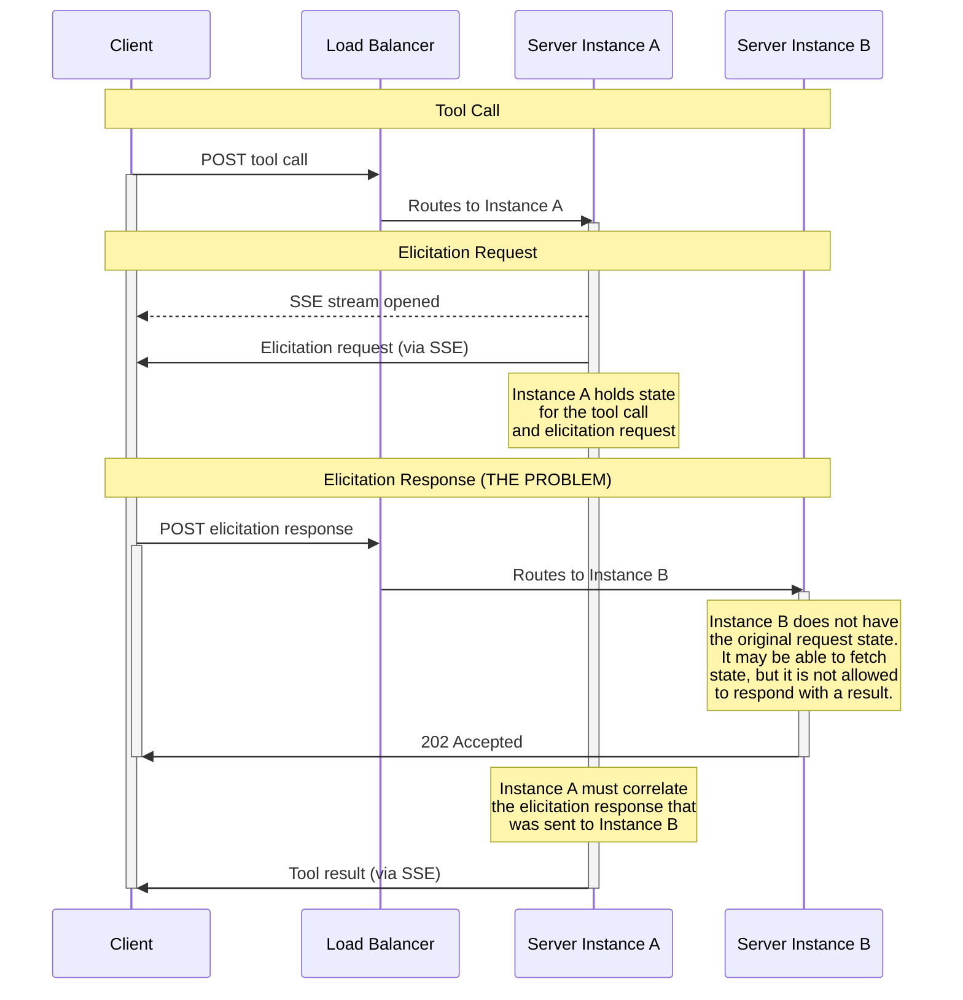
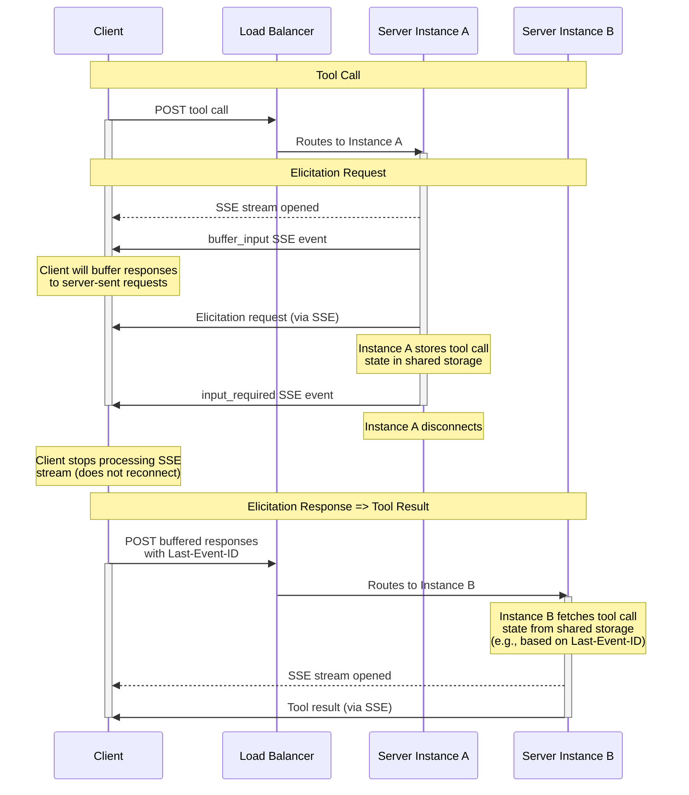

# SEP-1858: Multi-turn SSE (using custom events)

**Status**: Draft
**Type**: Standards Track
**Created**: 2025-11-20
**Author(s)**: Jonathan Hefner <jonathan@hefner.pro> (@jonathanhefner)
**Sponsor**: @jonathanhefner
**PR**: https://github.com/modelcontextprotocol/modelcontextprotocol/pull/1858

## Abstract

This SEP proposes a backward compatible mechanism to break up SSE flows into a multi-turn interaction when a server requires additional input from a client (e.g., elicitation, sampling).

## Motivation

The current MCP HTTP transport presents scalability challenges when handling multi-round-trip requests, where the server needs additional information from the client (such as elicitation or sampling requests) before completing a tool call.

In the existing implementation, when a client sends a tool call request, the server responds by opening an SSE stream. If the server needs more information to complete the tool call, it sends an elicitation request on that SSE stream. The client then responds by sending a separate, independent HTTP request with its response. Because this response is not tied to the original SSE stream, load balancers in horizontally scaled deployments will typically route it to a different server instance than the one that initiated the request. The instance receiving the elicitation response does not have the original request context and is not permitted by the protocol to respond with the tool result—it can only return a `202 Accepted` response. Meanwhile, the original server instance, which holds the SSE stream, must somehow correlate the elicitation response that was sent to a different instance in order to complete the tool call and send the result back through its SSE stream.

This architecture necessitates either sticky session routing (to ensure all requests in a sequence reach the same instance) or complex state correlation mechanisms across instances (even when shared storage is available). Both approaches add significant infrastructure complexity to what could otherwise be straightforward horizontally scaled deployments.



## Specification

This proposal introduces two [custom SSE events](https://html.spec.whatwg.org/multipage/server-sent-events.html#:~:text=field%20name%20is%20%22event%22) — `buffer_input` and `input_required` — which the server may send when the negotiated protocol version is >= $NEXT_PROTOCOL_VERSION. These events are data-less events, having just an event ID:

```
event: buffer_input
id: 2

event: input_required
id: 4
```

When a server needs to send one or more requests to the client, such as elicitation or sampling requests, it should first send a `buffer_input` SSE event. The `buffer_input` event tells the client to buffer its responses to server-sent requests instead of immediately POSTing them.

The server then sends its requests (as standard SSE events) followed by an `input_required` SSE event, and disconnects. The `input_required` event tells the client to (1) exit the SSE event processing loop without attempting to reconnect, and (2) POST a JSON array of its buffered responses, **including** a `Last-Event-ID` header.

When a server instance receives the POST request with the `Last-Event-ID` header, it responds with an SSE stream (or JSON object for a non-streaming response) instead of the `202 Accepted` currently mandated by the MCP specification.

If there is server-side state associated with the initial request, the initial server instance should save the state in a shared store before sending `input_required`, and the subsequent server instance should load the state (e.g., based on `Last-Event-ID`).

This interaction pattern can repeat as many times as necessary.



## Rationale

Breaking up the flow into a multi-turn interaction allows the server to (1) stop execution when waiting for a response from the client, and (2) respond directly to the client when resuming execution. This simplifies infrastructure when operating multiple server instances behind a load balancer.

## Backward Compatibility

- **New Client + Old Server**: No change — client behavior should only change based on new custom SSE events. No backward incompatibility.
- **Old Client + New Server**: Client will send old `MCP-Protocol-Version`. Server behavior will be same as before. No backward incompatibility.
