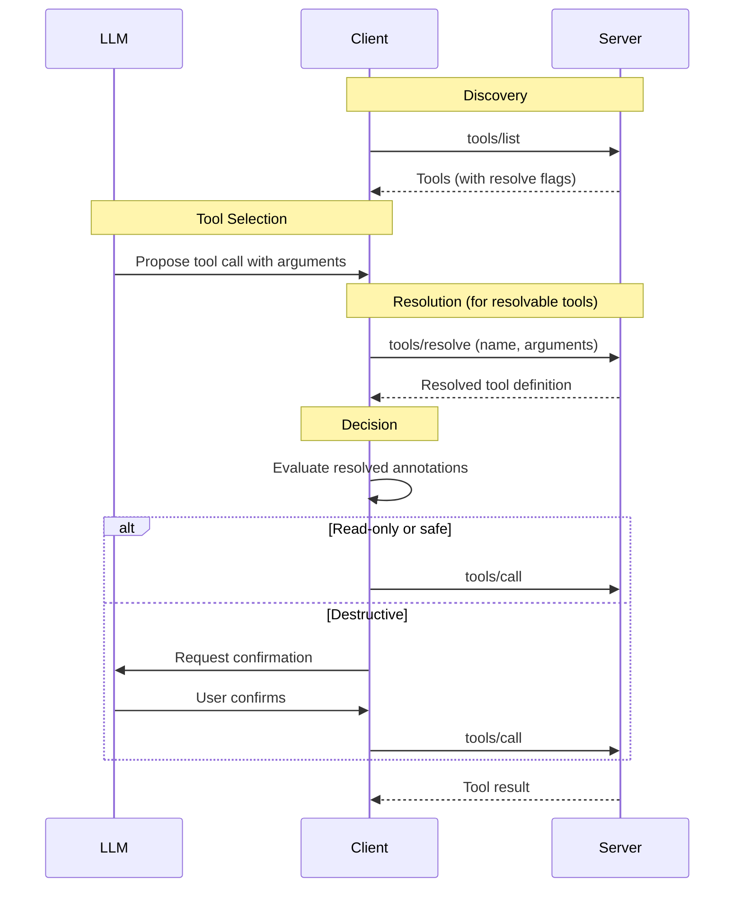

# SEP: Tool Resolution

| Status  | Draft                                                                           |
| :------ | :------------------------------------------------------------------------------ |
| Type    | Standards Track                                                                 |
| Created | 2025-11-21                                                                      |
| Authors | @sammorrowdrums                                                                 |
| Sponsor | TBD                                                                             |
| PR      | [#1862](https://github.com/modelcontextprotocol/modelcontextprotocol/pull/1862) |

## Abstract

This SEP proposes a **tool resolution** mechanism that takes inspiration from LSP's resolve pattern while adapting it for MCP's unique requirements. When a server declares a tool during `tools/list`, it provides a definition with conservative (worst-case) annotations. Before invocation, clients can request the server to **resolve** the tool with specific arguments, receiving a tool definition with refined annotations tailored to the actual operation.

The proposal introduces:

1. A `resolve` field in the `Tool` definition indicating the tool supports resolution
2. A new `tools/resolve` request that accepts tool name and arguments, returning refined metadata

This pattern:

- Enables **argument-specific annotations** (e.g., a file tool's `read` action is read-only while `delete` is destructive)
- Consolidates multiple preflight concerns into a **single exchange**
- Provides an **extensible foundation** for future metadata (scope requirements, cost estimates, etc.)

> **Note**: While this design draws inspiration from LSP's resolve pattern, it is adapted specifically for MCP's tool invocation model. Unlike LSP where stubs are incomplete objects filled in later, MCP tools are fully functional from `tools/list`—resolution refines metadata based on intended arguments.

## Motivation

### The Problem with Static Tool Definitions

Tool definitions provided during `tools/list` are static. This creates several challenges:

**1. Annotation Accuracy**

Tool annotations provide hints about behavior:

- `readOnlyHint`: Whether the tool modifies its environment
- `destructiveHint`: Whether modifications are destructive vs. additive
- `idempotentHint`: Whether repeated calls have no additional effect
- `openWorldHint`: Whether the tool interacts with external systems

However, many tools have behavior that **depends on their arguments**. A `manage_files` tool must declare `destructiveHint: true` even though `read` operations are safe, causing unnecessary confirmation dialogs.

**2. Future Metadata Requirements**

Static definitions cannot express:

- **Scope requirements**: OAuth scopes needed for specific operations (see [scope challenges](https://docs.github.com/en/apps/oauth-apps/building-oauth-apps/scopes-for-oauth-apps))
- **Cost estimates**: Token/credit costs that vary by arguments

**3. Scope Over-Requesting**

[SEP-1488](https://github.com/modelcontextprotocol/modelcontextprotocol/issues/1488) proposes `securitySchemes` per tool, but static declarations lead to over-scoping. Consider a GitHub tool that accesses repositories:

- **Static declaration** requires `repo` scope (access to all public and private repos)
- **Reality**: Accessing a public repo needs no authentication at all

Users are prompted for unnecessary permissions, violating the principle of least privilege. With argument-specific resolution, the server can indicate that a specific operation needs no auth or reduced scopes.

**4. Multiple Preflight Checks**

Without a unified resolution mechanism, we risk a future where multiple separate preflight requests are needed for different metadata types—annotations, scopes, costs, etc.

### Inspiration from LSP

The Language Server Protocol solves a similar problem with its "resolve" pattern. For example, [`codeAction/resolve`](https://microsoft.github.io/language-server-protocol/specifications/lsp/3.17/specification/#codeAction_resolve) allows servers to return lightweight stubs during listing, then fill in expensive details on demand.

Key lessons from LSP:

- **Single resolve request**: One method handles all deferred metadata
- **Returns complete objects**: The resolved item replaces the stub entirely
- **Extensible**: New fields can be added without new methods

### Adapting for MCP

MCP's tool model differs from LSP in important ways:

| Aspect          | LSP                      | MCP Tool Resolution                                |
| :-------------- | :----------------------- | :------------------------------------------------- |
| Initial state   | Incomplete stubs         | Fully functional tools with worst-case annotations |
| Resolve trigger | Client needs full object | Client needs argument-specific metadata            |
| Input           | The stub object itself   | Tool name + intended arguments                     |
| Purpose         | Complete missing data    | Refine metadata for specific operation             |

Our approach adapts the useful parts of LSP's pattern:

1. **`tools/list`**: Returns complete, usable tool definitions with conservative annotations
2. **`tools/resolve`**: Client provides tool name + arguments, receives refined metadata

This gives us:

- **Single method** for all preflight metadata needs
- **Extensibility** for future metadata without protocol changes
- **Familiarity** for developers who know LSP, while fitting MCP's model

### Example: Multi-Action Tool

Consider a `manage_files` tool that supports multiple operations:

| Action    | Annotation Impact                                          |
| :-------- | :--------------------------------------------------------- |
| `read`    | `readOnlyHint: true`, `destructiveHint: false`             |
| `append`  | `readOnlyHint: false`, `destructiveHint: false` (additive) |
| `replace` | `readOnlyHint: false`, `destructiveHint: true`             |
| `delete`  | `readOnlyHint: false`, `destructiveHint: true`             |

With static annotations, the server must declare the worst-case scenario (`destructiveHint: true`), causing clients to present unnecessary confirmation dialogs for safe read operations.

### Consequences of Static Definitions

When tools must declare their worst-case behavior:

1. **Over-prompting**: Users see confirmation dialogs for safe operations
2. **Reduced trust**: LLMs may avoid tools marked as destructive even for safe uses
3. **Poor UX**: Every invocation of a versatile tool triggers warnings
4. **Loss of precision**: Clients cannot make nuanced decisions based on actual intent
5. **Scope over-requesting**: OAuth flows must request all possible scopes upfront

### Why Not Separate Tools?

One workaround is to split tools by behavior (e.g., `file_read`, `file_write`, `file_delete`). This approach has significant drawbacks:

1. **Tool explosion**: Complex tools fragment into many variants
2. **Context pollution**: LLM context windows fill with near-duplicate tool definitions
3. **Lost semantics**: The unified concept of the tool is lost
4. **Maintenance burden**: Servers must duplicate logic across tools

## Specification

### Capability Declaration

Servers that support tool resolution **MUST** declare the capability:

```json
{
  "capabilities": {
    "tools": {
      "listChanged": true,
      "resolve": true
    }
  }
}
```

### Tool Definition Extension

Tools that support resolution **MUST** include the `resolve` field:

```typescript
interface Tool extends BaseMetadata {
  name: string;
  description?: string;
  inputSchema: {
    /* ... */
  };
  annotations?: ToolAnnotations;

  /**
   * If true, this tool supports the `tools/resolve` request to provide
   * argument-specific metadata. Clients SHOULD resolve tools with specific
   * arguments before invoking them when metadata accuracy matters for
   * user experience or safety decisions.
   *
   * Default: false
   */
  resolve?: boolean;
}
```

When `resolve: true`, the `annotations` field **SHOULD** represent the worst-case (most conservative) behavior across all possible arguments, providing a safe default when resolution is not supported or desired by the client.

### Protocol Messages

#### Request: `tools/resolve`

Clients send this request to resolve a tool with specific arguments:

**Request:**

```json
{
  "jsonrpc": "2.0",
  "id": 1,
  "method": "tools/resolve",
  "params": {
    "name": "manage_files",
    "arguments": {
      "path": "/home/user/notes.txt",
      "action": "read"
    }
  }
}
```

**Parameters:**

| Field     | Type   | Required | Description                                   |
| :-------- | :----- | :------- | :-------------------------------------------- |
| name      | string | Yes      | The name of the tool                          |
| arguments | object | Yes      | The arguments that will be passed to the tool |

#### Response: `tools/resolve`

The server returns a **complete tool definition** with resolved metadata:

**Response:**

```json
{
  "jsonrpc": "2.0",
  "id": 1,
  "result": {
    "tool": {
      "name": "manage_files",
      "description": "Read, append, replace, or delete file contents",
      "inputSchema": {
        "type": "object",
        "properties": {
          "path": { "type": "string" },
          "action": {
            "type": "string",
            "enum": ["read", "append", "replace", "delete"]
          }
        },
        "required": ["path", "action"]
      },
      "annotations": {
        "readOnlyHint": true,
        "destructiveHint": false,
        "idempotentHint": true,
        "openWorldHint": false
      },
      "resolve": true
    }
  }
}
```

**Result:**

| Field | Type | Required | Description                                           |
| :---- | :--- | :------- | :---------------------------------------------------- |
| tool  | Tool | Yes      | The resolved tool definition with refined annotations |

### Schema Definitions

#### ResolveToolRequest

```typescript
/**
 * Request to resolve a tool with specific arguments, returning
 * refined metadata based on the intended operation.
 *
 * @category `tools/resolve`
 */
export interface ResolveToolRequest extends JSONRPCRequest {
  method: "tools/resolve";
  params: {
    /**
     * The name of the tool to resolve.
     */
    name: string;

    /**
     * The arguments that will be passed to the tool. These arguments
     * allow the server to provide more precise metadata based on the
     * specific operation being performed.
     */
    arguments: { [key: string]: unknown };
  };
}
```

#### ResolveToolResult

```typescript
/**
 * Result of a tools/resolve request.
 *
 * @category `tools/resolve`
 */
export interface ResolveToolResult extends Result {
  /**
   * The resolved tool definition with refined metadata for the
   * provided arguments.
   */
  tool: Tool;
}
```

### JSON Schema Additions

Add to `schema.json`:

```json
{
  "ResolveToolRequest": {
    "description": "Request to resolve a tool with specific arguments, returning refined metadata.",
    "properties": {
      "method": {
        "const": "tools/resolve",
        "type": "string"
      },
      "params": {
        "properties": {
          "name": {
            "description": "The name of the tool to resolve.",
            "type": "string"
          },
          "arguments": {
            "additionalProperties": {},
            "description": "The arguments that will be passed to the tool.",
            "type": "object"
          }
        },
        "required": ["name", "arguments"],
        "type": "object"
      }
    },
    "required": ["method", "params"],
    "type": "object"
  },
  "ResolveToolResult": {
    "description": "Result of a tools/resolve request.",
    "properties": {
      "tool": {
        "$ref": "#/definitions/Tool"
      }
    },
    "required": ["tool"],
    "type": "object"
  }
}
```

### Behavior Requirements

#### Server Requirements

1. Servers **MUST** return a tool definition that accurately reflects behavior for the given arguments
2. Servers **MUST** return the same resolved tool for identical (name, arguments) pairs within a session (determinism)
3. Servers **SHOULD** implement efficient resolution (avoid expensive computation)
4. Servers **MAY** return a resolved tool with only annotation fields changed; other fields may match the original
5. Servers **MAY** provide worst-case annotations in `tools/list` as a fallback for error cases

#### Client Requirements

1. Clients **SHOULD** call `tools/resolve` before invoking tools with `resolve: true` when:
   - Making user-facing decisions (e.g., showing confirmation dialogs)
   - Providing context to LLMs about tool safety
2. Clients **SHOULD NOT** cache `tools/resolve` results across different argument values
3. Clients **MAY** skip resolution for tools where static metadata is acceptable
4. If the server returns an error for `tools/resolve`:
   - Clients **MUST** fall back to the tool definition from `tools/list`
   - If the original tool has no `annotations`, clients **MUST** surface the error to the user
   - Clients **SHOULD** prefer retrying the `tools/resolve` request
   - Clients **MAY** proceed with the tool call using static metadata

#### Error Handling

Servers **SHOULD** return standard JSON-RPC errors:

| Code   | Message        | When                                   |
| :----- | :------------- | :------------------------------------- |
| -32602 | Invalid params | Unknown tool name or invalid arguments |
| -32603 | Internal error | Server failed to resolve tool          |

### Message Flow



### Future Extensibility

The `tools/resolve` pattern is designed to support future metadata beyond annotations. Potential extensions include:

#### Dynamic Security Schemes (Future)

[SEP-1488](https://github.com/modelcontextprotocol/modelcontextprotocol/issues/1488) proposes static `securitySchemes` per tool. Tool resolution can enhance this with **argument-specific scope requirements**, solving the over-scoping problem inherent in static declarations.

**Example: GitHub Repository Access**

Consider a `get_repo_contents` tool. With static `securitySchemes`:

```json
{
  "name": "get_repo_contents",
  "securitySchemes": [{ "type": "oauth2", "scopes": ["repo"] }]
}
```

This requires the `repo` scope for **all** calls, even when accessing public repositories that need no authentication. The user is prompted for unnecessary permissions.

With tool resolution, the server can return argument-specific requirements:

```json
// tools/resolve for public repo
{
  "tool": {
    "name": "get_repo_contents",
    "securitySchemes": [
      { "type": "noauth" }
    ],
    "annotations": { "openWorldHint": true }
  }
}

// tools/resolve for private repo
{
  "tool": {
    "name": "get_repo_contents",
    "securitySchemes": [
      { "type": "oauth2", "scopes": ["repo"] }
    ],
    "annotations": { "privateHint": true }
  }
}
```

This enables:

- **Minimal privilege**: Users only authenticate when accessing private resources
- **Better UX**: No unnecessary OAuth prompts for public data
- **Accurate metadata**: `privateHint` and `openWorldHint` reflect the actual data being accessed

> **Note**: Dynamic security schemes are mentioned as a motivating use case but the full integration is **out of scope** for this SEP. They would require separate consideration of authorization flows, particularly given challenges with forwarding 403 errors during tool calls (see [SEP-1699](https://github.com/modelcontextprotocol/modelcontextprotocol/issues/1699)).

#### Cost Estimates (Future)

```json
{
  "tool": {
    "name": "llm_query",
    "annotations": { "openWorldHint": true },
    "estimatedCost": { "tokens": 1500, "currency": "USD", "amount": 0.003 }
  }
}
```

These extensions would be specified in future SEPs but can leverage the same `tools/resolve` mechanism.

#### Trust Annotations (Future)

Integration with [SEP Trust Annotations](https://github.com/modelcontextprotocol/modelcontextprotocol/issues/711) would allow servers to return argument-specific sensitivity metadata:

```json
{
  "tool": {
    "name": "read_file",
    "_meta": {
      "annotations": {
        "sensitiveHint": "high",
        "privateHint": true,
        "attribution": ["mcp://file-server.acme.local/hr/salaries.xlsx"]
      }
    }
  }
}
```

This enables pre-execution policy decisions based on the sensitivity of the data that would be returned.

## Rationale

### Design Decisions

#### Why Draw from LSP's Resolve Pattern?

LSP's resolve pattern provides useful precedent, though we adapt it for MCP:

1. **Proven concept**: LSP demonstrates that lazy resolution works at scale
2. **Single exchange**: One request for all metadata needs
3. **Extensible**: New fields can be added to the response without new methods

However, we intentionally diverge where MCP's model differs:

- **MCP tools are complete from `tools/list`**—they're not stubs that need filling
- **Resolution is argument-driven**—we refine based on what the client intends to do
- **The primary purpose is metadata refinement**, not completing missing data

#### Why Return the Full Tool (Not Just Annotations)?

@findleyr [raised this point](https://github.com/modelcontextprotocol/modelcontextprotocol/pull/1862#issuecomment-3573029197):

> "we probably want to avoid a future where there are a bunch of separate preflight checks for a single tool call--it would be better to consolidate them into a single exchange"

Returning the complete `Tool` object:

1. **Prevents proliferation** of preflight methods (`tools/annotations`, `tools/scopes`, `tools/costs`)
2. **Enables future extensions** without protocol changes
3. **Provides consistency** with `tools/list` response structure

#### Why "resolve" vs. "preflight" or "annotations"?

| Term        | Pros                                  | Cons                                       |
| :---------- | :------------------------------------ | :----------------------------------------- |
| resolve     | Implies refinement, familiar from LSP | May suggest incompleteness                 |
| preflight   | CORS precedent, web-familiar          | Implies permission check, not data filling |
| annotations | Direct mapping to primary use case    | Limits future extensions                   |

We chose `resolve` for its implication of refinement and extensibility, while being clear in documentation that MCP tools are always complete and functional.

#### Why Not Stream During Execution?

An alternative could stream updated metadata during `tools/call`:

**Why preflight resolution is better:**

- Cannot cancel based on metadata without starting execution
- Keeps concerns separated (metadata vs. execution)
- Most tools know their metadata before execution begins
- Simpler protocol

#### Why Require Determinism?

Determinism (same arguments → same resolved tool) ensures:

- Resolution results are valid when the tool is subsequently called
- Potential for safe response caching within a session
- Testable server implementations

### Alternatives Considered

#### Alternative 1: Annotations-Only Response

Return only `ToolAnnotations` instead of the full `Tool`:

```json
{
  "annotations": {
    "readOnlyHint": true
  }
}
```

**Why rejected:**

- Requires new methods for each future metadata type (scopes, costs, etc.)
- Less extensible for future needs
- Misses the opportunity to consolidate all preflight concerns

#### Alternative 2: Per-Argument Annotation Schema

Annotate which arguments affect which hints in the tool definition:

```json
{
  "name": "manage_files",
  "annotations": {
    "argumentEffects": {
      "action": {
        "pattern": "^read$",
        "annotations": { "readOnlyHint": true }
      }
    }
  }
}
```

**Why rejected:**

- Cannot express complex logic (semantic analysis, state-dependent behavior)
- Verbose for many cases
- Pattern matching is limited
- Cannot support future metadata like scopes that may require server-side evaluation

## Backward Compatibility

This proposal is **fully backward compatible**:

### For Existing Servers

- No changes required
- Servers without `resolve` capability continue working
- Static `annotations` field remains authoritative

### For Existing Clients

- No changes required
- Clients can ignore `resolve: true` and use static tool definitions
- Tools remain fully functional without resolution

### Graceful Degradation

- Clients fall back to `tools/list` definitions if `tools/resolve` fails
- Static annotations represent worst-case behavior, ensuring safety

## Security Implications

### Trust Model

Tool annotations are already marked as **untrusted** in the specification:

> For trust & safety and security, clients **MUST** consider tool annotations to be untrusted unless they come from trusted servers.

This trust model extends to resolved tool metadata:

1. **Malicious servers** could return misleading metadata
   - Marking destructive operations as read-only
   - Marking data-exfiltrating tools as closed-world

2. **Mitigation**: Clients must apply the same trust evaluation to resolved tools as static ones

### Determinism and Side Effects

1. Servers **MUST NOT** perform side effects during `tools/resolve`
2. The request is for metadata evaluation only, not execution
3. Implementations should be computationally efficient to prevent DoS

### Argument Validation

Servers **SHOULD** validate arguments in `tools/resolve` against the tool's `inputSchema`:

- Invalid arguments should return an error
- This provides consistent behavior between resolution and tool calls

## Reference Implementation

### Server Implementation (TypeScript)

```typescript
import { Server } from "@modelcontextprotocol/sdk/server/index.js";

const server = new Server(
  {
    name: "file-server",
    version: "1.0.0",
  },
  {
    capabilities: {
      tools: {
        listChanged: false,
        resolve: true,
      },
    },
  },
);

// Base tool definition (used in both list and resolve)
const manageFilesTool = {
  name: "manage_files",
  description: "Read, append, replace, or delete file contents",
  inputSchema: {
    type: "object",
    properties: {
      path: { type: "string", description: "File path to operate on" },
      action: {
        type: "string",
        enum: ["read", "append", "replace", "delete"],
        description: "Operation to perform",
      },
      content: {
        type: "string",
        description: "Content for append/replace operations",
      },
    },
    required: ["path", "action"],
  },
  // Conservative default annotations (worst-case)
  annotations: {
    readOnlyHint: false,
    destructiveHint: true,
    idempotentHint: false,
    openWorldHint: false,
  },
  resolve: true,
};

// Tool listing
server.setRequestHandler(ListToolsRequestSchema, async () => {
  return { tools: [manageFilesTool] };
});

// Tool resolution handler
server.setRequestHandler(ResolveToolRequestSchema, async (request) => {
  const { name, arguments: args } = request.params;

  if (name !== "manage_files") {
    throw new McpError(ErrorCode.InvalidParams, `Unknown tool: ${name}`);
  }

  const action = args.action as string;

  // Return full tool with refined annotations
  const resolvedTool = {
    ...manageFilesTool,
    annotations: getAnnotationsForAction(action),
  };

  return { tool: resolvedTool };
});

function getAnnotationsForAction(action: string) {
  switch (action) {
    case "read":
      return {
        readOnlyHint: true,
        destructiveHint: false,
        idempotentHint: true,
        openWorldHint: false,
      };

    case "append":
      return {
        readOnlyHint: false,
        destructiveHint: false, // Additive only
        idempotentHint: false,
        openWorldHint: false,
      };

    case "replace":
      return {
        readOnlyHint: false,
        destructiveHint: true,
        idempotentHint: true, // Same content = same result
        openWorldHint: false,
      };

    case "delete":
      return {
        readOnlyHint: false,
        destructiveHint: true,
        idempotentHint: true, // Deleting twice = same result
        openWorldHint: false,
      };

    default:
      // Default to conservative for unknown actions
      return manageFilesTool.annotations;
  }
}
```

### Client Implementation (TypeScript)

```typescript
import { Client } from "@modelcontextprotocol/sdk/client/index.js";

async function invokeToolSafely(
  client: Client,
  toolName: string,
  args: Record<string, unknown>,
): Promise<CallToolResult> {
  // Get tool definition from list
  const { tools } = await client.listTools();
  let tool = tools.find((t) => t.name === toolName);

  if (!tool) {
    throw new Error(`Unknown tool: ${toolName}`);
  }

  // Resolve tool if supported
  if (tool.resolve) {
    try {
      const result = await client.request({
        method: "tools/resolve",
        params: { name: toolName, arguments: args },
      });
      tool = result.tool;
    } catch (error) {
      // Fall back to static tool definition
      console.warn("Failed to resolve tool, using static definition:", error);
    }
  }

  // Make safety decisions based on resolved annotations
  const annotations = tool.annotations ?? {};

  if (annotations.destructiveHint) {
    const confirmed = await requestUserConfirmation(
      `This operation may be destructive. Proceed?`,
    );
    if (!confirmed) {
      throw new Error("User cancelled destructive operation");
    }
  }

  // Invoke the tool
  return client.callTool({ name: toolName, arguments: args });
}
```

## Related Work

- **LSP Resolve Pattern**: This design takes inspiration from LSP's resolve methods ([`codeAction/resolve`](https://microsoft.github.io/language-server-protocol/specifications/lsp/3.17/specification/#codeAction_resolve), [`completionItem/resolve`](https://microsoft.github.io/language-server-protocol/specifications/lsp/3.17/specification/#completionItem_resolve)), adapting the concept of lazy metadata resolution for MCP's argument-driven tool model.
- **[SEP-1488 (securitySchemes)](https://github.com/modelcontextprotocol/modelcontextprotocol/issues/1488)**: OpenAI's proposal for per-tool OAuth scope declarations. Tool resolution can enhance this with argument-specific scope requirements, solving the over-scoping problem where static declarations require maximum permissions even for operations that need less (e.g., accessing public vs. private repositories).
- **[SEP-711 (Trust Annotations)](https://github.com/modelcontextprotocol/modelcontextprotocol/issues/711)**: Proposes sensitivity and provenance annotations for data flowing through MCP. Tool resolution can return argument-specific trust metadata before execution.
- **SEP-1076 (Dependency Annotations)**: Proposes additional annotations for network, filesystem, environment dependencies. Tool resolution can provide argument-specific refinement of any annotation field.
- **SEP-1300 (Tool Filtering)**: Addresses context window pressure through tool grouping. Tool resolution provides finer-grained information without requiring tool explosion.
- **SEP-1699 (Error Forwarding)**: Discusses challenges with forwarding HTTP errors (like 403) during tool calls, which motivates preflight checks for scope requirements.
- **OAuth Scope Challenges**: GitHub's [scope challenge pattern](https://docs.github.com/en/apps/oauth-apps/building-oauth-apps/scopes-for-oauth-apps) allows servers to indicate additional permissions needed—a potential future use case for tool resolution.

## Open Questions

1. **Partial arguments**: Should `tools/resolve` accept partial arguments and return metadata for a partially-specified operation? This could enable progressive disclosure of tool behavior.

2. **Caching semantics**: Should clients be allowed to cache results for identical (name, arguments) pairs within a session? The current proposal emphasizes determinism but doesn't mandate caching.

3. **Metadata confidence**: Should servers express confidence in their metadata evaluation (e.g., heuristic vs. certain)?

4. **Scope challenge integration**: How should `tools/resolve` integrate with authorization flows? Should scope requirements trigger re-authentication, or simply inform the user? This is explicitly out of scope for this SEP but should be considered for future work.

5. **Resolve timing**: Should clients always resolve before calling, or only when they need metadata for decisions? The current proposal says "SHOULD" for safety-relevant decisions.
