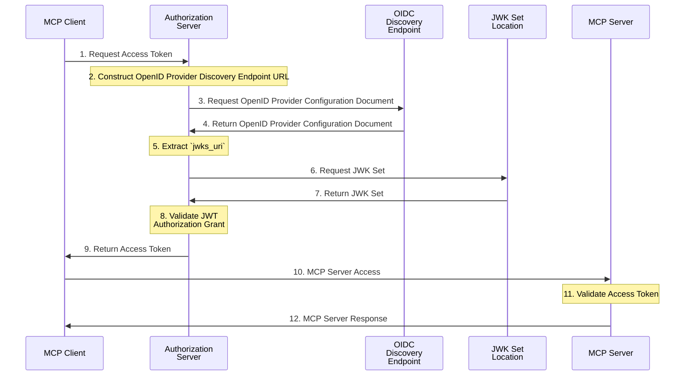

# SEP-1933: Workload Identity Federation

- **Status**: Draft
- **Type**: Standards Track
- **Created**: 2025-12-05
- **Author(s)**: Pieter Kasselman
- **Sponsor**: Darin McAdams
- **PR**: https://github.com/modelcontextprotocol/modelcontextprotocol/pull/1933

## Abstract

This SEP defines Workload Identity Federation as an optional extension for the Model Context Protocol, enabling autonomous MCP clients to access MCP servers using existing workload identity credentials without requiring separate client registration or long-lived credentials. The proposal combines the OAuth 2.0 JWT Bearer grant type ([RFC7523](https://datatracker.ietf.org/doc/html/rfc7523)) with [OpenID Connect Discovery 1.0](https://openid.net/specs/openid-connect-discovery-1_0.html) to allow MCP clients operating as workloads, such as those deployed in Kubernetes or cloud environments, to present platform-issued JWT credentials directly to authorization servers. This eliminates the need for client secrets, client identifiers, or separate credential management while maintaining security through issuer trust relationships and claim-based authorization. This docuemnt formalize a pattern that is broadly adopted in industry to increase interoperability and allow for scaled deployments while improving the overall security profile of deployments.

## Motivation

Current MCP authorization mechanisms require clients to either participate in interactive OAuth flows or manage client credentials (secrets or private keys) for machine-to-machine authentication. For autonomous workloads, such as MCP clients running in Kubernetes, cloud platforms, or SPIFFE-enabled environments, this creates several operational challenges:

1. **Credential Management Overhead**: Each MCP client deployment requires provisioning, storing, and rotating separate credentials for every MCP server it needs to access
2. **Security Surface Expansion**: Long-lived client secrets or private keys represent additional attack surfaces that must be protected
3. **Platform Integration Gaps**: Modern workload platforms already provide robust identity mechanisms (Kubernetes service accounts, cloud instance identities, SPIFFE identities), but MCP cannot leverage these existing credentials
4. **Operational Complexity**: Separate credential lifecycles for platform identity and MCP access create coordination challenges and increase operational burden

Workloads in modern deployment environments already possess cryptographically verifiable identity credentials issued by their platforms. The current MCP specification provides no mechanism to leverage these existing identities, forcing operators to implement parallel credential management systems. This SEP addresses this gap by defining how workloads can federate their existing platform identities to access MCP servers through trust relationships configured at the authorization server level.

## Specification

Workload Identity Federation combines using a JWT from a trusted issuer as an authorization grant as defined in
[RFC7523](https://datatracker.ietf.org/doc/html/rfc7523) with automated issuer
discovery as described in [OpenID Connect Discovery 1.0](https://openid.net/specs/openid-connect-discovery-1_0.html)
to obtain the [RFC7517](https://datatracker.ietf.org/doc/html/rfc7517) JWK
Key set of the trusted issuer which is used to validate the JWT authorization grant before the authorization server issues an access token.

As a prerequisite for this flow, the authorization server is configured with a set of issuers (defined by a URL), which are considered 'trusted issuers'. The nature of that trusted relationship and the mechanism by which the set is populated or maintained is out of scope of this document and left up to the implementer. JWTs not issued by these trusted issuers can be safely rejected by the authorization server.

The complete Workload Identity Federation flow proceeds as follows:

### Flow Steps

1. **Request Access Token**: The MCP client requests an access token through a
   POST request to the authorization server's token endpoint using the JWT Bearer
   grant type as specified in
   [RFC 7523 Section 2.1](https://datatracker.ietf.org/doc/html/rfc7523#section-2.1).
   The request includes:
   - `grant_type`: `urn:ietf:params:oauth:grant-type:jwt-bearer`
   - `assertion`: The client's workload JWT credential
   - `resource`: The canonical URI of the target MCP server (as defined in the
     baseline MCP Authorization specification)

2. **Construct OpenID Provider Discovery Endpoint URL**: The authorization server extracts the `iss` (issuer)
   claim from the JWT and determines if it is a trusted issuer. If the issuer is
   trusted, the authorization server constructs the OpenID Provider Discovery Endpoint URL from the issuer
   claim as described in [OpenID Connect Discovery 1.0, Section 4](https://openid.net/specs/openid-connect-discovery-1_0.html#ProviderConfig).

3. **Request OpenID Provider Configuration Document**: The authorization server requests the OpenID Provider Configuration Document
   as described in Section 4.1 of [OpenID Connect Discovery 1.0](https://openid.net/specs/openid-connect-discovery-1_0.html#ProviderConfigurationRequest).

4. **Return OpenID Provider Configuration Document** The OpenID Provider Configuration Document is returned as described in Section 4.2 of [OpenID Connect Discovery 1.0](https://openid.net/specs/openid-connect-discovery-1_0.html#ProviderConfigurationResponse).

5. **Extract `jwks_uri`**: The authorization server validates the OpenID Provider Configuration Document as
   described in Section 4.3 of [OpenID Connect Discovery 1.0](https://openid.net/specs/openid-connect-discovery-1_0.html#ProviderConfigurationValidation) and extracts the `jwks_uri` configuration information.

6. **Request JWK Set**: The authorization server retrieves the
   [RFC7517](https://datatracker.ietf.org/doc/html/rfc7517) JWK set
   containing the issuer's public keys from the TLS protected location specified by
   `jwks_uri` configuration information (the jwks_uri MUST use the https scheme).

7. **Return JWK Set**: The JWK set is returned from the TLS protected location.

8. **Validate JWT Authorization Grant**: The authorization server validates the
   JWT authorization grant according to
   [RFC 7523 Section 3](https://datatracker.ietf.org/doc/html/rfc7523#section-3),
   with considerations specified in this document. This includes verifying the
   signature using the retrieved public keys and validating that the JWT claims
   meet the authorization server's configured trust and authorization
   requirements.

9. **Return Access Token**: If JWT validation succeeds, the authorization server
   issues an access token suitable for accessing the specified MCP server and
   returns it to the MCP client per
   [RFC 7523 Section 2.1](https://datatracker.ietf.org/doc/html/rfc7523#section-2.1).

10. **MCP Server Access**: The MCP client makes a JSON-RPC request to the MCP
    server, including the access token rerieved in Step 9. The accesstoken is included
    in the `Authorization` header using the `Bearer` authentication scheme as specified
    in the baseline [MCP Authorization](https://modelcontextprotocol.io/specification/draft/basic/authorization) specification.

12. **Validate Access Token**: The MCP server validates the access token according to
    the baseline [MCP Authorization](https://modelcontextprotocol.io/specification/draft/basic/authorization) specification, including
    verifying the token was issued for the MCP server as the intended audience.

13. **MCP Server Response**: If the token is valid and the MCP client is authorized, the
    MCP server processes the request and returns the JSON-RPC response.

## Rationale

The design leverages established OAuth and OpenID Connect standards (RFC 7523 JWT Bearer grants and OIDC Discovery) rather than creating MCP-specific mechanisms, ensuring broad interoperability with existing identity infrastructure and authorization servers. By using platform-issued JWTs directly, this approach leverages installed infrastrucutre and eliminates operational overhead while maintaining strong security through cryptographic verification, and the use of automated issuer discovery supports key rotation and reduces manual configuration burden in dynamic workload environments.

### Design Decisions

**Why JWT Bearer Grant Type?**

The JWT Bearer grant type (RFC 7523) is a well-established OAuth 2.0 extension specifically designed for workload-to-service authentication scenarios. It provides:

- Standardized protocol
- Clear validation requirements
- Broad implementation support across authorization servers
- Natural alignment with existing workload identity systems

**Why OpenID Connect Discovery?**

OpenID Connect Discovery provides a standardized mechanism for:

- Automatic discovery of issuer configuration
- Dynamic retrieval of signing keys via `jwks_uri`
- Reduced manual configuration burden
- Support for key rotation without service disruption

This automation is critical for operational simplicity in dynamic workload environments where issuers may rotate keys frequently.

OpenID Connect Discovery is chosen over OAuth 2.0 Authorization Metadata Discovery since it is already broadly supported by workload identity issuance infrastructurem, specifically Kubernetes and SPIFFE based systems (neither support OAuth 2.0 Authorization Metadata Discovery).

**Additional Details**
A detailed proposal is described at https://github.com/modelcontextprotocol/ext-auth/blob/pieterkas-wif-extension/specification/draft/workload-identity-federation.mdx

### Alternatives Considered

**Client Credentials Flow with Dynamic Registration**

We considered extending the Client Credentials extension with dynamic client registration. This was rejected because:

- It still requires managing per-client credentials (client secrets or private keys)
- Dynamic registration adds complexity without solving the credential management problem
- Workloads already have cryptographically verifiable identities that would be unused

## Backward Compatibility

There are no backward compatibility concerns. This SEP introduces a new optional authorization extension and does not modify existing MCP authorization mechanisms. Implementation of this extension is entirely optional. Systems not requiring workload identity federation can continue using existing authorization mechanisms without modification.

## Security Implications

Workload Identity Federation relies on **platform-provisioned, short-lived workload credentials** (such as Kubernetes service account tokens, SPIFFE SVID-JWTs, or cloud-issued workload tokens). These credentials typically have strong issuance guarantees and tight lifetimes, reducing the window in which a compromised token can be misused. Because these JWTs act as authorization grants, implementations MUST treat them as highly sensitive.

When exchanging tokens, both MCP clients and authorization servers MUST ensure that workload JWTs are handled securely:

- Workload JWTs MUST be transmitted only over authenticated, TLS protected channels (https) when presented to the authorization server.
- Implementations SHOULD avoid logging, storing, or otherwise persisting either JWT assertions or exchanged access tokens.
- The mapping between workload identity and MCP access token forms a critical trust boundary; misconfiguration can result in privilege escalation. It is the responsibility of the authorization server administrator to ensure the correct configuration of issuance policies and trusted issuers.
- Administrators MUST configure issuer allowlists, claim-based authorization rules, and tenant isolation controls carefully.

This SEP builds on established security models from OAuth 2.0, OIDC Discovery, and JWK-based key distribution. **Detailed and authoritative security guidance** is available in:

- [RFC 7523, Section 6](https://datatracker.ietf.org/doc/html/rfc7523#section-6) (Security Considerations for JWT Authorization Grants)
- [RFC 7517, Section 9](https://datatracker.ietf.org/doc/html/rfc7517#section-9) (Security Considerations for JWK)
- [OpenID Connect Discovery 1.0, Section 7](https://openid.net/specs/openid-connect-discovery-1_0.html#Security) (Security Considerations)
- The baseline [MCP Authorization](https://modelcontextprotocol.io/specification/draft/basic/authorization) security requirements

Implementers MUST review these documents when deploying Workload Identity Federation.

The detailed proposal contains a complete list of security considerations (see https://github.com/modelcontextprotocol/ext-auth/blob/pieterkas-wif-extension/specification/draft/workload-identity-federation.mdx)

## Reference Implementation

A reference implementation is required before this SEP can achieve "Final" status. The reference implementation should demonstrate:

1. **Authorization Server**: Token endpoint accepting JWT bearer grants with:
   - OpenID Connect Discovery integration
   - JWT validation using retrieved JWKs
   - Configurable issuer and workload trust policies
2. **MCP Client**: Workload client that:
   - Obtains platform-issued JWT credentials
   - Use this specification to present a JWT and receive an access token
   - Uses access token for MCP server requests

3. **Test Cases**: Including:
   - Successful token issuence when a valid JWT is presented
   - Rejection of untrusted issuers
   - Rejection of unauthorized workloads
   - JWT signature validation
   - Replay attack prevention
   - Multi-tenant isolation

## Performance Implications

The OpenID Connect Discovery process adds latency to the first token request for each issuer. However:

- Issuer configurations and JWKs SHOULD be cached to minimize repeated discovery
- Discovery overhead is incurred once per issuer, not per workload
- The cost is comparable to other federated authentication mechanisms

For high-throughput scenarios, authorization servers should implement:

- Aggressive caching of issuer metadata and JWKs with appropriate TTLs
- Connection pooling for issuer discovery requests
- Pre-warming of cache for known trusted issuers

## Open Questions

1. **Token Refresh**: Should workload clients be allowed to obtain refresh tokens, or should they always present fresh workload JWTs for new access tokens?

2. **Issuer Metadata Caching**: Should the specification provide guidance on cache TTLs for issuer configurations and JWKs ([OpenID Connect Discovery 1.0](https://openid.net/specs/openid-connect-discovery-1_0.html) does not define caching limits)?

3. **Error Response Detail**: How much detail should authorization servers provide in error responses when JWT validation fails (for security vs. debuggability tradeoffs)? Is there anything we should add beyond ([RFC7523](https://datatracker.ietf.org/doc/html/rfc7523))?

4. **Additional freshness and replay requirements** Should authorization servers imposed additional token freshness (`exp`, `iat`, `jti`) and enforce strict replay protection for JWTs accepted as assertion grants? 

5. **Guidance on Token Logging** Should this specification give guidance to avoid logging, storing, or otherwise persisting JWT assertions (acces token logging is discouraged in existing RFCs, but not JWT assertion logging)?

## Acknowledgments

This proposal draws on established OAuth 2.0 and OpenID Connect standards and incorporates established patterns from:

- **Kubernetes**: Service account token projection provides JWTs that can be used for workload identity federation to cloud providers.
- **SPIFFE**: The SPIFFE Verifiable Identity Document (SVID) format uses JWTs for workload identity in zero-trust environments.
- **Cloud Providers**: AWS, Azure, and GCP all support workload identity federation using JWT bearer grants.

The proposal has been refined based on input from Brian Campbell, Den Delimarsky, Wills Dawson and Darin McAdams.
