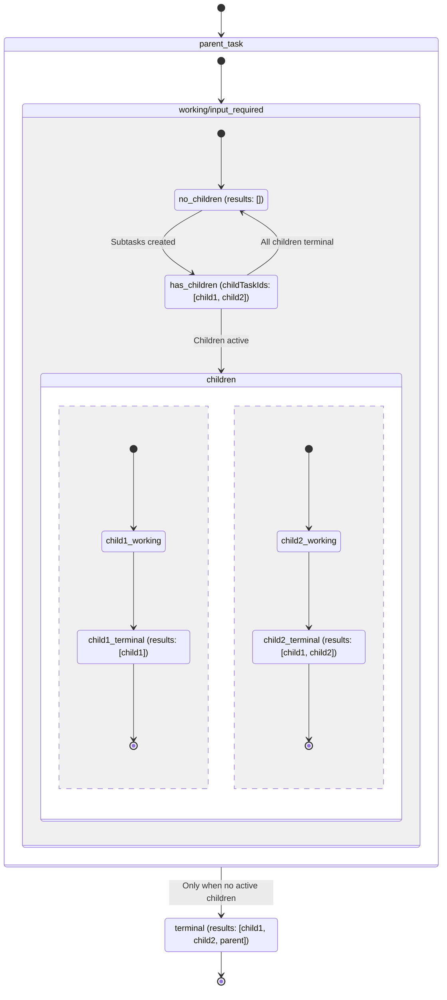

# SEP-2268: Subtasks

- **Status**: Draft
- **Type**: Standards Track
- **Created**: 2026-02-16
- **Author(s)**: Luca Chang (@LucaButBoring)
- **Sponsor**: None
- **PR**: https://github.com/modelcontextprotocol/modelcontextprotocol/pull/2268

## Abstract

This proposal extends the experimental [tasks](https://modelcontextprotocol.io/specification/2025-11-25/basic/utilities/tasks) specification to support subtasks as a form of task nesting. Tasks will become recursive and doubly-linked via optional `parentTaskId` and `childTaskIds` properties. This enables logical subdivisions of complex work and partial results, as each subtask will produce its own result value independently of its siblings and parent. Subtask result values must share a shape with that of their parent task, simplifying application integration.

## Motivation

Tasks are designed to enable applications to work with workflow-based services in a deterministic way, rather than relying on LLMs to poll those services themselves through tool calls, which is both unreliable and wastes tokens. However, tasks are a coarse-grained unit of execution that does not enable actually communicating the full extent of the work being done to requestors (and particularly to the LLM itself). The protocol does offer progress notifications and log messages to be streamed to requestors, but these events may be both frequent and small, and there do not appear to be any public use cases that involve directing these notifications to LLMs.

By introducing a notion of subtasks that builds on the semantics of the existing request types that tasks can already augment, we enable work to be deliberately chunked according to the designs of individual MCP servers, which can then choose specific work distributions according to what will be semantically-relevant to the requestor for a task of a given type.

## Specification

Tasks that a receiver wishes to subdivide into smaller logical units with their own results can be represented with **subtasks**. Subtasks are tasks with a `parentTaskId` pointing to another task, which in turn has an ordered `childTaskIds` list pointing to each of its subtasks. For most purposes, subtasks are independent tasks that can be operated on without knowledge of their parents, but their lifecycles are strictly constrained to that of their parents. The relationship between a task and its subtasks is as follows:

1. A task's `parentTaskId` **MUST NOT** change over its lifetime.
1. A task's `parentTaskId` **MUST NOT** point to itself.
1. A task's `childTaskIds` list **MAY** be created and have task IDs appended to it over its lifetime.
1. A task's `childTaskIds` list **MUST NOT** be removed or have task IDs removed from it over its lifetime.
1. A task's `childTaskIds` list **MUST NOT** contain its own task ID.

### Creating Subtasks

Unlike parent tasks, subtasks are created by the receiver without any additional action from the requestor of the parent task. This means that the receiver of the parent task does not send additional `CreateTaskResult` messages after dispatching subtasks. The requestor is expected to detect the creation of subtasks during the task polling lifecycle by monitoring the `childTaskIds` list.

### Getting Subtasks

The following new behavior requirements apply to task retrieval via `tasks/get`:

1. A task's `parentTaskId` **MUST** only point to a task accessible via `tasks/get` at any given time.
1. A task's `childTaskIds` list **MUST** only point to tasks accessible via `tasks/get` at any given time.

Requestors **SHOULD** process any subtask that it encounters in `childTaskIds` recursively.

### Retrieving Subtask Results

The result shape of a subtask **MUST** match that of its parent. Task requestors **MUST** consider the results of each subtask to be ordered according to `childTaskIds`.

The result shape of a parent task **SHOULD** represent data produced after the end of all tasks described in `childTaskIds`. For the purpose of semantic data such as tool results or resources, that means task results **SHOULD** be processed by host applications according to the order of `childTaskIds` followed by the parent task's result.

**Subtask State Diagram (High-Level):**

### Associating Task-Related Messages

The `io.modelcontextprotocol/related-task` metadata property gain an optional `parentTaskId` field. If a task's `parentTaskId` is defined, its related-task metadata **MUST** include the same value in this field as well.

### Task Notifications

Task notifications gain an optional `parentTaskId` field. If a task's `parentTaskId` is defined, its notifications **MUST** include the same value in this field as well.

### Task Termination

The following new behavior requirements apply to tasks during termination:

1. A task **MAY** generate subtasks at any time if it is not in a terminal status.
1. A task **MUST NOT** transition into a terminal status until all of its subtasks have entered terminal statuses.
1. A task **MUST** only be successfully cancelled after all of its subtasks are successfully cancelled. Note that a task's subtasks **MAY** be successfully cancelled independently of the parent task.
1. A task that is successfully cancelled **MAY** cause the implicit termination of its parent task.
1. A `tasks/cancel` request **MUST** be propagated to its children by the receiver if the request is accepted.

### Input Required Status

A task's transition into the `input_required` status **MUST NOT** be the only cause of its parent's `input_required` status; that is, a subtask may be in the `input_required` status without its parent being in the same state. This avoids cases where a task and a subtask each depend on the other's state, which would introduce potential deadlocks.

### TTL and Resource Management

The following new behavior requirements apply to tasks regarding resource management:

1. A task's `pollInterval` **MAY** differ from that of its parent.
1. A task's `ttl` **MAY** differ from that of its parent, but **MUST NOT** cause a task to be deleted after its parent, as this would imply a scenario where that task's `parentTaskId` is not accessible via `tasks/get`.

## Rationale

### Receiver-Controlled Decomposition

Not allowing the receiver to determine when subtasks are dispatched was a deliberate choice. Allowing this would have created more synchronization points between the client and server and would also have allowed requestors to spin out subtasks indefinitely for trivial things. Keeping the choice of when to create a subtask on the receiver end also allows MCP servers using tasks for tool execution to make their own choices about how large a subtask should be, both for data storage purposes and to control exactly how much context information an LLM receives at a time.

### Subtask Lifecycle Constraints

Subtasks cannot outlive their parents, and parent tasks cannot transition to a terminal status before all of their children have done so. This is loosely inspired by structured concurrency and is intended to simplify task-tracking on the requestor end. If subtasks could outlive their parents, it would become unclear how to present this information to both end-users and LLMs, as the result chunk order would have to be unpredictable and depend on execution time.

### Doubly-Linked Task Relationships

In the polling flow, subtasks are only really expected to be accessed in a "downwards" pattern, with subtasks being progressively discovered as they are added and the requestor traversing them deeply. In this flow, there's no need for a subtask to also have a pointer to its parent. However, for displaying tasks to end-users or traversing the full task list breadthwise, the parent pointer is informative, as that structure would otherwise not be encoded without iterating the entire task list all at once. Having a parent pointer enables a UX that looks something like this:

1. The application requests the first page of tasks with `tasks/list`.
1. The end-user clicks on a task to see its information
1. That task has a parent task which hasn't yet been iterated, so the application invokes `tasks/get` to retrieve that task directly.

## Backward Compatibility

While tasks are experimental, we would still like to minimize breaking changes for developers building on tasks if possible. However, this proposal does represent a partial breaking change for client implementations in a few specific cases. If a server adopts subtasks and those subtasks leverage the `input_required` status, a client unaware of subtasks will not be monitoring them, and will time out if it attempts to invoke one.

## Security Implications

By implementing recursive task processing, we introduce additional an burden on the requestor to verify that task graphs have no cycles. While disallowed by the specification, a malicious or otherwise incorrect implementation may allow this case to occur.

## Reference Implementation

To be provided.
