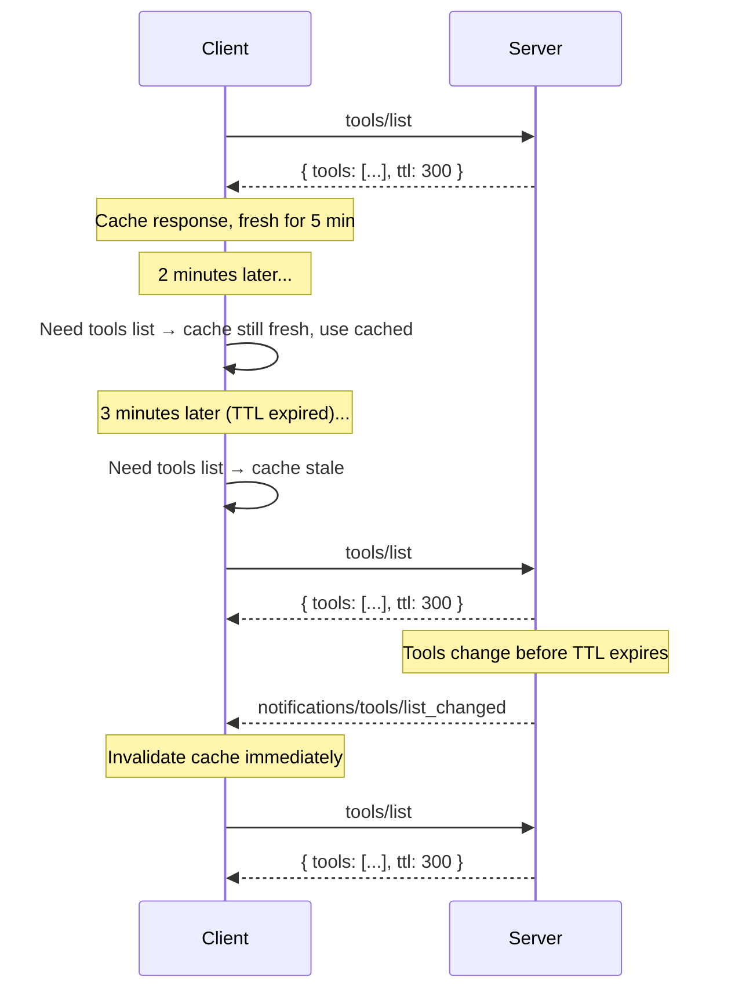

# SEP-2549: TTL for List Results

- **Status**: Accepted with Changes
- **Type**: Standards Track
- **Created**: 2026-04-09
- **Author(s)**: Caitie McCaffrey (@CaitieM20)
- **Sponsor**: @CaitieM20 
- **PR**: https://github.com/modelcontextprotocol/specification/pull/2549

## Abstract

This SEP proposes adding an optional `ttl` (time-to-live) field to the result objects returned by `tools/list`, `prompts/list`, `resources/list`, `resources/read`, and `resources/templates/list`. The TTL tells clients how long the response may be considered fresh before re-fetching. This allows clients to cache feature lists and reduce reliance on server-push notifications while remaining fully backward compatible. TTL supplements rather than replaces the existing notification mechanism — both can coexist.

## Motivation

Today, MCP clients discover server features by invoking methods on the server. These calls return the current set of features. To learn about changes, clients rely on push notifications from the server. The below table maps the Server Method to Notification Type. 

| Server Methods | Notification Type |
|--------------- |-------------------|
| `tools/list`   | `notifications/tools/list_changed` |
| `prompts/list` | `notifications/prompts/list_changed` |
| `resources/list` | `notifications/resources/list_changed` |
| `resources/templates/list` | `notifications/resources/list_changed` |
| `resources/read` | `notifications/resources/updated` |


This approach has several limitations:

1. **HTTP-based transports require SSE Streams**: Many clients and servers have challenges supporting long lived SSE streams which are necessary for notifications. The goal is to make SSE streams and optional optimization, but support protocol functionality without them. A TTL allows clients to poll on a predictable schedule without relying on server-push notifications.

2. **Implementation complexity**: Both clients and servers must implement notification subscription and delivery infrastructure. Many simple servers have feature lists that change infrequently (or never), yet must still support the notification machinery if they want clients to stay current.

3. **No freshness signal**: Even clients that can receive notifications have no indication of how "stable" a list is. A server whose tool list changes once a day and one whose list changes every second look identical to the client — both simply send notifications when changes occur. A TTL provides an explicit freshness hint.

4. **Alignment with web standards**: HTTP caching (`Cache-Control: max-age`) and DNS TTLs have long demonstrated that time-based freshness hints are a simple, well-understood mechanism for reducing unnecessary refetches. MCP can benefit from the same pattern.

Adding a TTL field to list responses solves all of these problems with a minimal, backward-compatible protocol change.

## Specification

### New interface: `TTLResult`

A new `TTLResult` interface is introduced as a standalone type extending `Result`. It owns the `ttl` field.

#### Schema change (TypeScript)

```typescript
/**
 * A result that supports a time-to-live (TTL) hint for client-side caching.
 *
 * @internal
 */
export interface TTLResult extends Result {
  /**
   * A hint from the server indicating how long (in seconds) the
   * client MAY cache this response before re-fetching. Semantics are
   * analogous to HTTP Cache-Control max-age.
   *
   * - If 0, The response SHOULD be considered immediately stale, The client
   *   MAY re-fetch every time the result is needed. 
   * - If positive, the client SHOULD consider the result fresh for this many
   *   seconds after receiving the response.
   */
  ttl: number & { readonly minimum: 0 };
}
```


> **Open Question — TTL format**: An alternative representation is an ISO 8601 duration string (e.g., `"PT5M"` for 5 minutes). Integer seconds are simpler, consistent with HTTP `max-age`, and easier to compare arithmetically. ISO 8601 durations are more human-readable and used in some Azure/AWS APIs. Community input is welcome on which format to adopt. The remainder of this specification uses integer seconds for illustration.

### Semantics
A TTL is a freshness estimate, not a guarantee. Servers MAY change the underlying list before the TTL expires; servers that do so and have advertised listChanged SHOULD send the corresponding notification.

Servers MUST provide a `ttl` on `Results` returned by `tools/list`, `prompts/list`, `resources/list`, `resources/read`, and `resources/templates/list`. 

`ttl` MUST be >= 0. If a server returns a negative value, clients SHOULD ignore it and treat it as 0 (immediately stale).


| Condition                                                    | Client behavior                                                                                      |
| ------------------------------------------------------------ | ---------------------------------------------------------------------------------------------------- |
| `ttl` = 0                                                    | The response SHOULD be considered immediately stale, The Client MAY re-fetch every time the result is needed. |
| `ttl` > 0                                                    | Client SHOULD consider the response fresh for `ttl` seconds from receipt. |
| Relevant notification received while TTL is active           | The notification invalidates the cached response. Client SHOULD re-fetch regardless of remaining TTL. |

#### Freshness calculation

A client records the local time at which the response was received (`t_received`). The response is considered **fresh** while `now < t_received + ttl`. Once the TTL expires the response is **stale** and the client SHOULD re-fetch on next access.

Clients SHOULD NOT treat TTL as a polling interval that triggers automatic background refetches. The TTL is a **freshness hint**: the client checks freshness when it needs the list, and re-fetches only if stale. Implementations that do choose to poll SHOULD apply jitter and backoff.

Clients MAY re-fetch if they have reason to believe the data has changed, even if the TTL has not yet expired. Examples include receiving an unexpected error on a tool call indicating that the the method was not found or the parameters were invalid.

Clients MAY serve stale responses if errors occur in re-fetching results(e.g., network issues, server downtime). The TTL is a hint for how long the client can safely rely on the data, but real-world conditions may require flexibility.

### Interaction with notifications
TTL and server-push notifications are complementary:

- A server MAY provide `ttl` without advertising `listChanged: true` in its capabilities. In this case the client relies entirely on TTL. 
- A server MAY advertise `listChanged: true` **and** provide `ttl`. In this case the client can use the TTL to avoid unnecessary refetches between notifications, and the notification acts as an immediate invalidation signal.



### Interaction with pagination

When a list result includes `nextCursor` (indicating more pages), the `ttl` applies to the **entire paginated list**, not to individual pages. Specifically:

- The TTL SHOULD only appear on every page with the same value. Clients SHOULD use the TTL from the last page they fetched to determine freshness.
- When the TTL expires, the client SHOULD re-fetch from the beginning (without a cursor) to get the full updated list.

### Error handling

- If `ttl` is present but is a negative integer, the client SHOULD ignore it and behave as if it were 0 (immediately stale).


## Rationale

### Why not replace `list_changed` notifications?

Notifications provide immediate invalidation which is valuable for long-lived connections. TTL provides a complementary mechanism optimized for stateless transports and for reducing unnecessary polling. Both mechanisms serve different use cases and coexist naturally.

### Prior art

| System                         | Mechanism              | Notes                                                              |
| ------------------------------ | ---------------------- | ------------------------------------------------------------------ |
| HTTP `Cache-Control: max-age`  | Integer seconds        | The most widely deployed freshness hint in web infrastructure      |
| DNS TTL                        | Integer seconds        | Controls how long resolvers cache DNS records                      |
| GraphQL `@cacheControl`        | `maxAge` integer secs  | Per-field cache hints in GraphQL responses                         |
| gRPC `grpc-retry-pushback-ms`  | Milliseconds           | Server-provided retry hint (different use case, similar pattern)   |

Integer seconds is the most common representation across these systems.

### Why not use HTTP caching directly?

MCP is transport-agnostic. While HTTP-based transports could theoretically use `Cache-Control` headers, MCP also operates over stdio,  and supports pluggable transports where HTTP headers may not be available. Embedding the TTL in the JSON response body ensures it works uniformly across all transports.

## Backward Compatibility

This change is fully backward compatible:

- Existing servers that do not provide it continue to work unchanged. If a `ttl` field is missing, clients SHOULD assume a default ttl of 0 (immediately stale) and rely on their own caching heuristincs or notifications, which is the current behavior.
- Existing clients that do not understand the field will ignore it, as MCP result objects permit additional properties via `[key: string]: unknown` on the `Result` base type.
- No existing fields or behaviors are modified or removed.
- No capability negotiation is required.

## Reference Implementation

_No reference implementation yet._

---

## Open Questions

1. **TTL format — integer seconds vs. ISO 8601 duration**:
   - Integer seconds (e.g., `300`) are simpler, consistent with HTTP `max-age` and DNS TTLs, and trivial to compare.
   - ISO 8601 duration strings (e.g., `"PT5M"`) are more human-readable and self-documenting.
   - Current recommendation: integer seconds, but community feedback is welcome.

