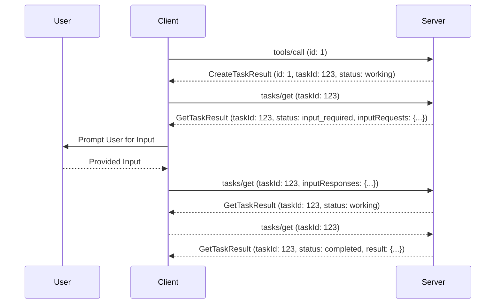

# SEP-2557: Stabilizing Tasks

- **Status**: Draft
- **Type**: Standards Track
- **Created**: 2026-04-12
- **Author(s)**: Luca Chang (@LucaButBoring), Caitie McCaffrey (@CaitieM20)
- **Sponsor**: Caitie McCaffrey (@CaitieM20)
- **PR**: https://github.com/modelcontextprotocol/modelcontextprotocol/pull/2557

## Abstract

This proposal builds on [tasks](https://modelcontextprotocol.io/specification/2025-11-25/basic/utilities/tasks) by introducing several simplifications to the original functionality to prepare the feature for stabilization, following implementation and usage feedback since the initial experimental release. In particular, this proposal allows tasks to be returned in response to non-task requests to remove unneeded stateful handshakes, and it collapses `tasks/result` into `tasks/get`, removing the error-prone interaction between the `input_required` task status and the `tasks/result` method.

This SEP also incorporates changes into `Tasks` necessary following the acceptance of:

- [SEP-2260: Require Server requests to be associated with a Client request](./2260-Require-Server-requests-to-be-associated-with-Client-requests.md)
- [SEP-2322: Multi Round-Trip Requests](https://github.com/modelcontextprotocol/modelcontextprotocol/pull/2322)
- [SEP-2243: Http Standardization](https://github.com/modelcontextprotocol/modelcontextprotocol/pull/2243)

## Motivation

**Tasks** were introduced in an experimental state in the `2025-11-25` specification release, serving as an alternate execution mode for certain request types (tool calls, elicitation, and sampling) to enable polling for the result of a task-augmented operation. This is done according to the following process, using tool calls as an example:

1. Check the receiver's task capabilities for the request type. If the capability is not present, the receiver does not support tasks.
1. Invoke `tools/list` to retrieve the tool list, then check `execution.taskSupport` on the appropriate tool to determine if the tool supports tasks.
1. The client issues a `tools/call` request to the server, declaring the `task` parameter with a desired task TTL to indicate that the server should create a task to represent that work.
1. The server returns a `CreateTaskResult` with the task info for the client to look up the result later. This contains a suggested polling interval that the client should follow to avoid overwhelming the server.
1. The client polls `tasks/get` repeatedly according to the suggested polling interval.
1. If the task status is ever `input_required` during this phase, the client prematurely issues a `tasks/result` call to the server, which is expected to block until the task result is available:
   1. The server sends some request message to the client concurrently with this premature request. In stdio, this is effectively meaningless, but in Streamable HTTP, this allows the server to open an SSE side channel to send that pending request on.
   1. The client receives the request and sends a response, according to the standard conventions of the transport in use. This is completely disconnected from the (still-ongoing) `tasks/result` call.
   1. Once the server receives the result it needs, it transitions the task back to the `working` status.
1. Once the task status is `completed`, the client issues a `tasks/result` call to retrieve the final result.
   1. If the client still has an active `tasks/result` call from a prior `input_required` status, it will receive the result as the result to that open request.

The task-polling flow as currently-defined has several problems, most of which are related to the `input_required` status transition:

1. Prematurely invoking `tasks/result` is unintuitive and it only done to accommodate the possibility of no other SSE streams being open in Streamable HTTP.
1. The fact that `tasks/result` blocks until completion is [even less intuitive](https://github.com/modelcontextprotocol/java-sdk/pull/755#issuecomment-3806079033).
1. Clients need to issue an additional request after encountering the `completed` status just to retrieve the final task result.
1. When a task reaches the `completed` status after this point, the server needs to identify all open `tasks/result` requests for that task to appropriately close them with the final task result, introducing unnecessary architectural complexity by mandating some sort of internal push-based messaging, which defies the intent of tasks' polling-based design.

Tasks also require their requestor to be cooperative, in the sense that the requestor of a task must explicitly opt into task-augmented execution on a request. While this contract ensures that both the requestor and receiver understand their peer's capabilities and safely agree on the request and response formats in advance, it also has a few conceptual flaws:

1. It requires requestors to explicitly check the capabilities of receivers. This introduces an unnecessary state contract that may be violated during mid-session deployments under the Streamable HTTP transport, and also raises concerns about the capability exchange growing in payload size indefinitely as more methods are supported.
1. It requires a tool-specific behavior carveout which gets pushed onto the client to navigate. Related to this, it forces clients to cache a `tools/list` call prior to making any task-augmented tool call.
1. It requires host application developers to explicitly choose to opt into task support from request to request, rather than relying on a single, consistent request construction path for all protocol operations.

In practical terms, these flaws imply that an MCP server cannot make a clean break from non-task to task-augmented execution on its tools, even if clients have implemented support for tasks already; the server must wait for all host applications to additionally opt into tasks as well and sit in an awkward in-between state in the meantime, where it must choose to either break compatibility with host applications (even if those host applications have an updated client SDK) or accept the costs of task-optional execution and internally poll on tasks sometimes. The requirement that task support be declared ahead of time makes task execution predictable, but also prematurely removes the possibility of only dispatching a task when there is real work to be done, along the lines of the .NET [ValueTask](https://learn.microsoft.com/en-us/dotNet/api/system.threading.tasks.valuetask?view=net-10.0). Allowing the requestor to dictate whether or not a task will be created similarly eliminates the possibility of caching results or sending early return values, requiring the creation of a task on every request if tasks are supported by the requestor at all.

Furthermore, in [SEP-2322](https://github.com/modelcontextprotocol/modelcontextprotocol/pull/2322), we identified that we would need to make a breaking change to `tasks/result` for these changes anyways, but that redesigning the flow within SEP-2322 would be a scope expansion that would derail MRTR discussion. Regardless, MRTR relies heavily on tasks as a solution for "persistent" requests that require server-side state, so these two proposals are somewhat interdependent.

To both improve the adoption of tasks and to reduce their upfront messaging overhead, this proposal simplifies their execution model by allowing peers to raise unsolicited tasks to each other and consolidating the polling lifecycle entirely into the `tasks/get` method.

## Specification

The following changes will be made to the tasks specification:

1. With respect to task creation
   1. We will deprecate the following capability declarations:
      1. Client capabilities:
         1. `tasks` (the entire capability, and all sub-capabilities, given that all supported client methods are now invalid, per [SEP-2260](./2260-Require-Server-requests-to-be-associated-with-Client-requests.md))
      1. Server capabilities:
         1. `tasks.cancel` (only the capability declaration is deprecated; _not_ the `tasks/cancel` method itself)
         1. `tasks.requests.tools.call`
   1. We will deprecate the `execution.taskSupport` field from the `Tool` shape.
   1. We will allow `CreateTaskResult` to be returned in response to `CallToolRequest` when no `task` field is present in the request.
   1. We will allow `CallToolResult` to be returned in response to `CallToolRequest` even when the `task` field is present in the request.
1. With respect to the task polling lifecycle:
   1. We will consolidate the entire polling lifecycle into the `tasks/get` method. This single method will handle retrieving task statuses and results simultaneously, and will additionally act as the carrier for receiver-to-requestor requests for the purposes of [SEP-2322: Multi Round-Trip Requests](https://github.com/modelcontextprotocol/modelcontextprotocol/pull/2322).
   1. We will remove the requirement that requestors react to the `input_required` status by prematurely invoking `tasks/result` to side-channel requests on an SSE stream in the Streamable HTTP transport.
   1. We will inline the final task result or error into the `Task` shape, bringing that into `tasks/get` and all notifications by extension.
   1. We will inline outstanding server-to-client requests into a new `inputRequests` field on `GetTaskResult`, akin to the field of the same name used in [SEP-2322](https://github.com/modelcontextprotocol/modelcontextprotocol/pull/2322).
   1. We will inline mid-task client-to-server results into a new `inputResponses` field on `GetTaskRequest`, akin to the field of the same name used in [SEP-2322](https://github.com/modelcontextprotocol/modelcontextprotocol/pull/2322).
   1. We will remove the `tasks/result` method.
1. With respect to tasks in general:
   1. We will remove the concept of client-hosted tasks, as [SEP-2260](./2260-Require-Server-requests-to-be-associated-with-Client-requests.md) renders them conceptually invalid.
   1. We may expand task support to additional client-to-server request types in the future, and implementors are still advised against implementing tasks as a tool-specific protocol operation.
   1. We will require `tasks/cancel` to be supported even if a server is incapabable or unwillling of offering actual task cancellation, similar to `notifications/cancelled` (it should instead return an error).

### Task Capabilities Changes Summary

The below table summarizes the changes to the task-related capabiliteis:

| Role   | Capability                              | Status          | Description                  |
| ------ | --------------------------------------- | --------------- | ---------------------------- |
| Server | `tasks.requests.tools.call`             | removed         |
| Server | `tasks.cancel`                          | removed         |                              |
| Server | `tasks.list`                            | still supported |                              |
| Client | `tasks.requests.sampling.createMessage` | removed         | no longer supported SEP-2260 |
| Client | `tasks.requests.elicitation.create`     | removed         | no longer supported SEP-2260 |
| Client | `tasks.cancel`                          | removed         | no longer needed             |
| Client | `tasks.list`                            | removed         | no longer needed             |

### Task Methods Changes Summary

The below table summarizes the changes to the task-related methods:

| Method                            | Status          | Description                                                             |
| --------------------------------- | --------------- | ----------------------------------------------------------------------- |
| `tasks/get`                       | still supported | Consolidates the entire polling lifecycle into a single method.         |
| `tasks/result`                    | removed         | No longer needed; results are inlined into `tasks/get`.                 |
| `tasks/input_response` (SEP-2322) | removed         | No longer needed; results are inlined into `tasks/get`.                 |
| `tasks/cancel`                    | still supported | Required to be supported even if actual cancellation is not possible.   |
| `tasks/list`                      | still supported | Some open questions on how this should be implemented without sessions. |

### Task Schema Changes

The `Task` schema defining the task metadata remains unchanged. However, we introduce new derived types that inline `result`/`error`/`inputRequests`, to be used by `tasks/get` and `notifications/tasks/status`. This allows us to avoid introducing redundant/bloated fields in `CreateTaskResult` and in `ListTasksResult`.

```typescript
interface InputRequiredTask extends Task {
  status: "input_required";
  /**
   * Field containing the InputRequests that specify the additional information needed from the client. Present
   * only when task status is `input_required` (see SEP-2322).
   */
  inputRequests: InputRequests;
}

interface CompletedTask extends Task {
  status: "completed";
  /**
   * The final result of the task. Present only when status is "completed".
   * The structure matches the result type of the original request.
   * For example, a {@link CallToolRequest | tools/call} task would return the {@link CallToolResult} structure.
   */
  result: JSONObject;
}

interface FailedTask extends Task {
  status: "failed";
  /**
   * The error that caused the task to fail. Present only when status is "failed".
   */
  error: JSONObject;
}

type DetailedTask = Task | InputRequiredTask | CompletedTask | FailedTask;
```

### Client Requests for `task/get`

```typescript
interface GetTaskRequest extends JSONRPCRequest {
  method "tasks/get";
  params: {
    /**
     * The task identifier to query.
     */
    taskId: string;
    /**
     * Optional field to allow the client to respond to a server's request for more information
     * when the task is in `input_required` state.
     */
    inputResponses?: InputResponses;
  };
}
```

### Server Response for `task/get`

```typescript
type GetTaskResult = Result &
  DetailedTask & {
    /**
     * Optional field containing request state passed back from the server to the client (see SEP-2322).
     */
    requestState?: string;
  };

type TaskStatusNotificationParams = NotificationParams & DetailedTask;
```

### `ResultType`

The ResultType field was introduced in [SEP-2322: Multi Round-Trip Requests](https://github.com/modelcontextprotocol/modelcontextprotocol/pull/2322) to handle polymorphic results. `Tasks` has the same issue where a server may return a `CallToolResult` or a `CreateTaskResult`. To address this, we propose the addition of the `task` ResultType to indicate that a Response contains a `Task` object.

```typescript
type ResultType = "complete" | "incomplete" | "task";
```

For backwards compatibility ResultType is inferred by default to be `complete`. Therefore all calls which return a `Task` (i.e.`task/get`, `task/cancel`) calls must set `task` as the ResultType moving forward.

### Example Task Flow



Below (collapsed) is the full JSON example of a tool call with an unsolicited task-augmentation that matches the diagram above:

<details>

Consider a simple tool call, `hello_world`, requiring an elicitation for the user to provide their name. The tool itself takes no arguments.

To invoke this tool, the client makes a `CallToolRequest` as follows:

```json
{
  "jsonrpc": "2.0",
  "id": 2,
  "method": "tools/call",
  "params": {
    "name": "hello_world",
    "arguments": {}
  }
}
```

The server determines (via bespoke logic) that it wants to create a task to represent this work, and it immediately returns a `CreateTaskResult`:

```json
{
  "jsonrpc": "2.0",
  "id": 2,
  "resultType": "task",
  "result": {
    "task": {
      "taskId": "786512e2-9e0d-44bd-8f29-789f320fe840",
      "status": "working",
      "createdAt": "2025-11-25T10:30:00Z",
      "lastUpdatedAt": "2025-11-25T10:50:00Z",
      "ttl": 30000,
      "pollInterval": 5000
    }
  }
}
```

Once the client receives the `CreateTaskResult`, it begins polling `tasks/get`:

```json
{
  "jsonrpc": "2.0",
  "id": 3,
  "method": "tasks/get",
  "params": {
    "taskId": "786512e2-9e0d-44bd-8f29-789f320fe840"
  }
}
```

On each request while the task is in a `"working"` status, the server returns a regular task response:

```json
{
  "jsonrpc": "2.0",
  "id": 3,
  "resultType": "task",
  "result": {
    "taskId": "786512e2-9e0d-44bd-8f29-789f320fe840",
    "status": "working",
    "createdAt": "2025-11-25T10:30:00Z",
    "lastUpdatedAt": "2025-11-25T10:50:00Z",
    "ttl": 30000,
    "pollInterval": 5000
  }
}
```

Eventually, the server reaches the point at which it needs to send an elicitation to the user. It sets the task status to `"input_required"` to signal this, and may additionally provide a `requestState` if it so chooses. On the next `tasks/get` request from the client, the server sends the elicitation payload via the `inputRequests` field. Note that, unlike in [SEP-2322](https://github.com/modelcontextprotocol/modelcontextprotocol/pull/2322), the standard task status result is still returned. The updated task polling flow should be thought of as distinct from the MRTR flow, despite sharing many characteristics.

```json
{
  "jsonrpc": "2.0",
  "id": 4,
  "method": "tasks/get",
  "params": {
    "taskId": "786512e2-9e0d-44bd-8f29-789f320fe840"
  }
}
```

```json
{
  "id": 4,
  "jsonrpc": "2.0",
  "resultType": "task",
  "result": {
    "taskId": "786512e2-9e0d-44bd-8f29-789f320fe840",
    "status": "input_required",
    "createdAt": "2025-11-25T10:30:00Z",
    "lastUpdatedAt": "2025-11-25T10:50:00Z",
    "ttl": 30000,
    "pollInterval": 5000,
    "inputRequests": {
      "name": {
        "method": "elicitation/create",
        "params": {
          "mode": "form",
          "message": "Please enter your name.",
          "requestedSchema": {
            "type": "object",
            "properties": {
              "name": { "type": "string" }
            },
            "required": ["name"]
          }
        }
      }
    },
    "requestState": "foo"
  }
}
```

For thoroughness, let's consider a case where the client happens to poll `tasks/get` again _before_ the user has fulfilled the elicitation request. As `inputRequests` is effectively a point-in-time snapshot of all outstanding server-to-client requests associated with the task, the server includes the same request again, despite the client having already seen this information (the client is advised to deduplicate `inputRequests` with the same key for UX purposes):

```json
{
  "jsonrpc": "2.0",
  "id": 5,
  "method": "tasks/get",
  "params": {
    "taskId": "786512e2-9e0d-44bd-8f29-789f320fe840",
    "requestState": "foo"
  }
}
```

```json
{
  "id": 5,
  "jsonrpc": "2.0",
  "resultType": "task",
  "result": {
    "taskId": "786512e2-9e0d-44bd-8f29-789f320fe840",
    "status": "input_required",
    "createdAt": "2025-11-25T10:30:00Z",
    "lastUpdatedAt": "2025-11-25T10:50:00Z",
    "ttl": 30000,
    "pollInterval": 5000,
    "inputRequests": {
      "name": {
        "method": "elicitation/create",
        "params": {
          "mode": "form",
          "message": "Please enter your name.",
          "requestedSchema": {
            "type": "object",
            "properties": {
              "name": { "type": "string" }
            },
            "required": ["name"]
          }
        }
      }
    },
    "requestState": "foo"
  }
}
```

The user enters their name, and the client makes a new `tasks/get` request with the satisfied information:

```json
{
  "jsonrpc": "2.0",
  "id": 6,
  "method": "tasks/get",
  "params": {
    "taskId": "786512e2-9e0d-44bd-8f29-789f320fe840",
    "inputResponses": {
      "name": {
        "action": "accept",
        "content": {
          "input": "Luca"
        }
      }
    },
    "requestState": "foo"
  }
}
```

With the elicitation fulfilled and no other outstanding requests to send, the server moves the task back into the `"working"` status:

```json
{
  "jsonrpc": "2.0",
  "id": 6,
  "result": {
    "taskId": "786512e2-9e0d-44bd-8f29-789f320fe840",
    "status": "working",
    "createdAt": "2025-11-25T10:30:00Z",
    "lastUpdatedAt": "2025-11-25T10:50:00Z",
    "ttl": 30000,
    "pollInterval": 5000
  }
}
```

Eventually, the server completes the request, so it stores the final `CallToolResult` and moves the task into the `"completed"` status. On the next `tasks/get` request, the server sends the final tool result inlined into the task object:

```json
{
  "jsonrpc": "2.0",
  "id": 7,
  "method": "tasks/get",
  "params": {
    "taskId": "786512e2-9e0d-44bd-8f29-789f320fe840"
  }
}
```

```json
{
  "jsonrpc": "2.0",
  "id": 7,
  "resultType": "task",
  "result": {
    "taskId": "786512e2-9e0d-44bd-8f29-789f320fe840",
    "status": "completed",
    "createdAt": "2025-11-25T10:30:00Z",
    "lastUpdatedAt": "2025-11-25T10:50:00Z",
    "ttl": 30000,
    "pollInterval": 5000,
    "result": {
      "content": [
        {
          "type": "text",
          "text": "Hello, Luca!"
        }
      ],
      "isError": false
    }
  }
}
```

</details>

### `tasks/get` Behavior by Task State

A `Task` can be in one of the following states: `working`, `completed`, `failed`, `cancelled`, or `input_required`. This section defines the expected behavior of a call to `tasks/get` when in each state.

#### Working

The response MUST include the `working` status.

<details>

```json
{
  "jsonrpc": "2.0",
  "id": 1,
  "resultType": "task",
  "result": {
    "taskId": "786512e2-9e0d-44bd-8f29-789f320fe840",
    "status": "working",
    "statusMessage": "The operation is in progress.",
    "createdAt": "2025-11-25T10:30:00Z",
    "lastUpdatedAt": "2025-11-25T10:40:00Z",
    "ttl": 60000,
    "pollInterval": 5000
  }
}
```

</details>

#### Completed

When a task is in the `completed` state, a call to `tasks/get` MUST return the `Task` with status `completed` and include the final result of the task.

<details>

```json
{
  "jsonrpc": "2.0",
  "id": 1,
  "resultType": "task",
  "result": {
    "taskId": "786512e2-9e0d-44bd-8f29-789f320fe840",
    "status": "completed",
    "statusMessage": "The operation has completed successfully.",
    "createdAt": "2025-11-25T10:30:00Z",
    "lastUpdatedAt": "2025-11-25T10:40:00Z",
    "ttl": 60000,
    "pollInterval": 5000,
    "result": {
      "content": [
        {
          "type": "text",
          "text": "Current weather in New York:\nTemperature: 72°F\nConditions: Partly cloudy"
        }
      ],
      "isError": false
    }
  }
}
```

</details>

#### Failed

When a task is in the `failed` state, a call to `tasks/get` should return an error in the `result` field indicating the reason for the failure.

To maintain a strong separation between the handling of protocol faults and application-level faults, we will revise prior language suggesting that the `failed` state may be used for tool call errors. Specifically, in error-handling paths for tasks, we will make the following change to the "Result Retrieval" section of the existing specification:

```diff
### Result Retrieval

When a task reaches a terminal status (`completed`, `failed`, or `cancelled`), servers **MUST** inline the final result or error into the `Task` object returned by `tasks/get`.

For successful completion, the `result` field **MUST** contain what the underlying request would have returned (e.g., `CallToolResult` for `tools/call`).

-For failures, the `error` field **MUST** contain the JSON-RPC error that occurred during execution, or the task **MAY** use `status: "failed"` with a `statusMessage` for tool results with `isError: true`.
+For failures, the `error` field **MUST** contain the JSON-RPC error that occurred during execution. The `failed` status **MUST NOT** be used to represent non-JSON-RPC errors, such as a tool result that completed with with `isError: true`.

Servers **MUST** include the `result` or `error` field in `notifications/tasks/status` notifications when notifying about terminal status transitions.
```

<details>

```json
{
  "jsonrpc": "2.0",
  "id": 1,
  "resultType": "task",
  "result": {
    "taskId": "786512e2-9e0d-44bd-8f29-789f320fe840",
    "status": "failed",
    "statusMessage": "Tool execution failed: API rate limit exceeded",
    "createdAt": "2025-11-25T10:30:00Z",
    "lastUpdatedAt": "2025-11-25T10:40:00Z",
    "ttl": 30000,
    "error": {
      "code": -32603,
      "message": "API rate limit exceeded"
    }
  }
}
```

</details>

#### Cancelled

When a task is in the `cancelled` state, a call to `tasks/get` MUST return the `Task` with status `cancelled`.

<details>

```json
{
  "jsonrpc": "2.0",
  "id": 6,
  "resultType": "task",
  "result": {
    "taskId": "786512e2-9e0d-44bd-8f29-789f320fe840",
    "status": "cancelled",
    "statusMessage": "The task was cancelled by request.",
    "createdAt": "2025-11-25T10:30:00Z",
    "lastUpdatedAt": "2025-11-25T10:40:00Z",
    "ttl": 30000,
    "pollInterval": 5000
  }
}
```

</details>

#### `input_required`

If the task status is `input_required`, this indicates that the `Task` requires additional input from the client before it can proceed. The server MUST return the `Task` with status set to `input_required` and an `IncompleteResult` from [SEP-2322: Multi Round-Trip Requests](https://github.com/modelcontextprotocol/modelcontextprotocol/pull/2322).

<details>

```json
{
  "jsonrpc": "2.0",
  "id": 1,
  "resultType": "task",
  "result": {
    "taskId": "786512e2-9e0d-44bd-8f29-789f320fe840",
    "status": "input_required",
    "statusMessage": "The operation requires additional input.",
    "createdAt": "2025-11-25T10:30:00Z",
    "lastUpdatedAt": "2025-11-25T10:40:00Z",
    "ttl": 60000,
    "pollInterval": 5000,
    "inputRequests": {
      "github_login": {
        "method": "elicitation/create",
        "params": {
          "mode": "form",
          "message": "Please provide your GitHub username",
          "requestedSchema": {
            "type": "object",
            "properties": {
              "name": {
                "type": "string"
              }
            },
            "required": ["name"]
          }
        }
      }
    }
  }
}
```

</details>

### HTTP Streamable Transport Headers

[SEP-2243](https://github.com/modelcontextprotocol/modelcontextprotocol/pull/2243) introduces standard headers in the Streamable HTTP Transport to facilitate more efficient routing. Routing on `TaskId` is also desirable since there is often state associated with a specific Task that needs to be consistently routed to the same server instance. SEP-2243 requires that all requests and notifications declare an `Mcp-Method` header.

We will extend this with semantics for the `tasks/get` and `tasks/cancel` requests, requiring that the `Mcp-Name` header MUST be set to the value of `params.taskId` by the client when making `tasks/get` and `tasks/cancel` requests over the Streamable HTTP Transport.

## Rationale

### Removing `tasks/result`

Removing methods is not done lightly, but was the logical conclusion of this proposal after inlining the result/error into `tasks/get`. As an alternative, we could have left `tasks/get` unchanged and left `tasks/result` in solely as a method for late result retrieval. This would have incentivized using `tasks/get` as a general method of retrieving the task state and result simultaneously, rendering `tasks/result` obsolete regardless.

Furthermore, the greatest flaw of `tasks/result` today is its blocking requirement, and leaving that in place would leave the general implementation headache of dealing with that unsolved. If we chose to instead remove the blocking requirement in favor of an "incomplete" error, we could get away with leaving `tasks/result` in place in a deprecated state, but then we would have been making a breaking change to it anyways.

### Removing Client-Hosted Tasks

Under [SEP-1686](./1686-tasks.md), clients could optionally offer their own task-hosting support on elicitation and sampling operations; this was not foreseen as particularly useful in its own right, but rather was intended to avoid coupling tasks to the assumptions imposed by tool calls (specifically, to remove any incentive to adding tool-specific requirements to tasks themselves). However, as of [SEP-2260](./2260-Require-Server-requests-to-be-associated-with-Client-requests.md), task-augmented elicitation and sampling are conceptually invalid. Put simply, SEP-2260 disallows unsolicited server-to-client requests; any server-to-client request must be bounded by a client-to-server request with a longer request lifetime to facilitate scalable deployment of SSE streams. Tasks explicitly decouple the _operation lifetime_ from the _request lifetime_, meaning that it is not possible for a server to poll a client under the updated specification language; _every_ polling request is unsolicited.

As a direct consequence of that change, all server-to-client task requests are rendered invalid, hence the removal of client-hosted tasks altogether. We could have chosen to maintain that functionality for possible future use, but this would have created a maintenance burden with no corresponding benefits for the ecosystem at large.

### Unsolicited Tasks vs. Immediate Results

An [alternative proposal](https://github.com/modelcontextprotocol/modelcontextprotocol/pull/1905) would have handled the immediate result case individually, and with slightly different preconditions: _If_ tasks are supported, _and_ the client supports immediate task results, _then_ servers may return a regular result in response to a task-augmented request. That version of immediate results looked like a better option at the time, as it implied no breaking changes on top of the initial tasks specification.

However, as we look to [move away](https://blog.modelcontextprotocol.io/posts/2025-12-19-mcp-transport-future/) from stateful protocol interactions and given the current experimental state of tasks in general, it seems worth proposing a somewhat more radical change that reduces the complexity of the overall specification and makes tasks more "native" to MCP at this time. In particular, the choice to allow unsolicited tasks (in _addition_ to immediate results) means promoting tasks to a first-class concept intended for all persistent operations, as opposed to being a parallel and somewhat specialized concept.

This happens to align with the proposed [SEP-2322](https://github.com/modelcontextprotocol/modelcontextprotocol/pull/2322), but the two are not coupled with one another.

### Waiting for Consistency

In the updated "Task Support and Handling" section under "​Behavior Requirements", the following new requirement is introduced:

> Receivers **MUST NOT** return a `CreateTaskResult` unless and until a `tasks/get` request would return that task; that is, in eventually-consistent systems, receivers **MUST** wait for consistency.

This addition is intended to avoid speculative `tasks/get` requests from requestors that would otherwise not know if a task has silently been dropped or if it simply has not been created yet. While this does increase latency costs in distributed systems that did not already behave this way, explicitly introducing this requirement simplifies client implementations and eliminates a source of undefined behavior.

## Backward Compatibility

### `tasks/result`

The removal of `tasks/result` is not backwards-compatible. At a protocol level, this is handled according to the protocol version. Under the `2025-11-25` protocol version, `tasks/result` **MUST** be supported if the `tasks` capability is advertised, but under subsequent protocol versions, requests **MUST** be rejected with a `-32601` (Method Not Found) error.

### Unsolicited Tasks

The following adjustments related to unsolicited tasks are breaking changes:

1. We will allow `CreateTaskResult` to be returned in response to `CallToolRequest` when no `task` field is present in the client request.
1. We will allow `CallToolResult` to be returned in response to `CallToolRequest` even when the `task` field is present in the request.

At a protocol level, this should be handled according to the protocol version. Under the `2025-11-25` protocol version, these cases **SHOULD** be handled as malformed responses, but under subsequent protocol versions, they **MUST** be treated as valid per the updated specification language.

### On Polymorphism

In [SEP-1686](./1686-tasks.md), we explicitly chose not to introduce support for unsolicitated task creation, as this would have required all implementations to break all method contracts by allowing `CreateTaskResult` to be returned in addition to the non-task result shape. This proposal explicitly rejects that argument, opting to consider `CreateTaskResult` as something akin to a JSON-RPC error, which already needed to be handled in the standard result path. Implementations already needed to branch response handling for error response shapes - `CreateTaskResult` is different in that rather than being a different JSON-RPC envelope shape, it is a different subset shape of a JSON-RPC result.

Fortunately for the proposal author, `CreateTaskResult` also happens to be a unique result shape, as it is the only MCP result with a single `result.task` key. This enables implementations to predictably handle this difference internally at the deserialization layer without necessarily exposing it to SDK consumers. The following (non-binding) implementation approach is suggested to support this:

1. All existing API surfaces should remain unchanged - that is, if a `client.callTool()` method is written to return `CallToolResult`, that method contract should not be altered to return a union of `CallToolResult` and `CreateTaskResult`.
1. Internally, if such a request returns `CreateTaskResult`, follow the standard task polling semantics of the current specification.
1. Gradually introduce new methods that surface the polling flow to SDK consumers as needed.

## Security Implications

This change does not introduce any new security implications.

## Reference Implementation

To be provided.
