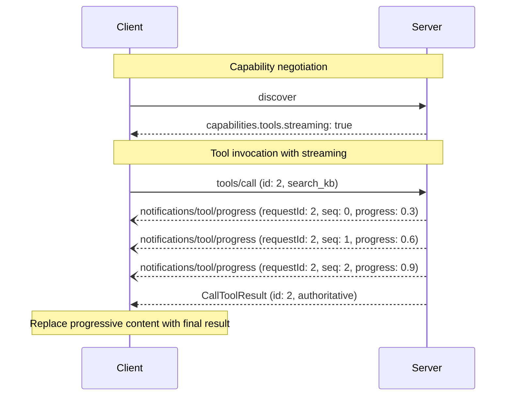

# SEP-2664: Streaming Tool Results

- **Status**: Draft
- **Type**: Standards Track
- **Created**: 2026-07-01
- **Author(s)**: fy2ne (@fy2ne), lizzyly7 (@lizzyly7)
- **Sponsor**: None (seeking sponsor)
- **PR**: TBD

## Abstract

This SEP defines a mechanism for servers to stream incremental tool results during a
single `tools/call` execution. It introduces a new notification,
`notifications/tool/progress`, that servers emit out-of-band while the tool is running,
carrying an optional `contentChunk` field (reusing the existing `ContentBlock` type) and
a monotonic `seq` number for ordering. The final `CallToolResult` remains the
authoritative response. The change is fully backward compatible: existing clients ignore
the new notification, and servers that never emit it behave exactly as before.

## Motivation

The current `tools/call` flow is strictly request-response. A client sends a
`tools/call` request and waits for the full `CallToolResult` response. For long-running
tools — search queries, report generation, API aggregation, web scraping — the client
sees nothing until execution completes completely. In production deployments this means:

- **Time to first byte** is 2–5 seconds or more, during which the user sees a blank
  loading state (lizzyly7, production data from 6+ months of MCP gateway traffic).
- **Progressive rendering is impossible**: UI iframes (MCP Apps, A2UI renderers) are
  starved of the incremental data they were designed to consume.
- **Polling workarounds are expensive**: the only alternative today is a separate status
  tool polled repeatedly, which burns tokens and requires explicit LLM cooperation to
  keep wired into the call graph (kuwatly, MCP Apps use case).

MCP already defines `notifications/progress` with a `progressToken` mechanism, but it is
limited to numeric progress, totals, and human-readable messages — it has no facility for
carrying structured intermediate results. The protocol also has `tool-input-partial` for
streaming LLM-generated arguments into a tool, but no equivalent `tool-output-partial`
for streaming results back out.

The Tasks extension (SEP-2663) solves a different problem — durable, asynchronous
background jobs with status polling, pause, resume, and out-of-band lifecycle management.
Spinning up a full task state machine for a 5–15 second synchronous tool call is
overkill. What is needed is a lightweight, synchronous streaming channel that keeps
execution bound to a single `tools/call` loop while giving clients incremental visibility
into results as they arrive.

## Specification

### Overview

A server that supports streaming tool results declares the `streaming` capability.
During execution of a `tools/call`, the server MAY emit zero or more
`notifications/tool/progress` notifications before sending the final `CallToolResult`
response. Each notification MAY carry a `contentChunk` — a partial result using the
existing `ContentBlock` type — and a `seq` number that establishes a total order across
chunks within the same tool call.

### Capability Negotiation

Servers that support streaming tool results MUST include `streaming: true` in their
`tools` capability:

```json
{
  "capabilities": {
    "tools": {
      "listChanged": true,
      "streaming": true
    }
  }
}
```

Clients MAY use this flag to determine whether to render progressive UI during tool
calls. The absence of `streaming: true` means the server will never emit
`notifications/tool/progress` for any tool call.

This mechanism is intentionally not per-tool: streaming capability is a server-wide
property. Individual tools within a server MAY choose not to stream (e.g., for
fast-executing tools where streaming overhead would dominate), in which case the server
simply omits the notification and sends a normal `CallToolResult`.

### Notification

#### `notifications/tool/progress`

Sent by the server during a `tools/call` to report progress and optionally stream
intermediate results.

**Parameters:**

| Field          | Type               | Required | Description                                                                                                                                                        |
| -------------- | ------------------ | -------- | ------------------------------------------------------------------------------------------------------------------------------------------------------------------ |
| `requestId`    | `string \| number` | Yes      | JSON-RPC `id` from the originating `tools/call` request. Primary correlation key.                                                                                  |
| `toolName`     | `string`           | Yes      | The name of the tool being executed (informational).                                                                                                               |
| `progress`     | `number`           | Yes      | Progress thus far. MUST be in range 0–1 (normalized) when `total` is absent. When `total` is present, both share the same unit (e.g., `progress: 3`, `total: 10`). |
| `total`        | `number`           | No       | Total number of items to process, if known. When present, `progress` is an absolute count against this total.                                                      |
| `message`      | `string`           | No       | Optional human-readable status message.                                                                                                                            |
| `seq`          | `number`           | Yes      | Monotonic sequence number (0-based). Each notification for the same `requestId` MUST increment by exactly 1.                                                       |
| `contentChunk` | `ContentBlock`     | No       | An optional intermediate result chunk.                                                                                                                             |

**Example — search tool streaming results:**

```json
{
  "jsonrpc": "2.0",
  "method": "notifications/tool/progress",
  "params": {
    "requestId": 2,
    "toolName": "search_kb",
    "progress": 0.3,
    "message": "Querying primary index...",
    "seq": 0,
    "contentChunk": {
      "type": "text",
      "text": "Found 3 documents matching query in primary index."
    }
  }
}
```

**Example — second chunk arriving:**

```json
{
  "jsonrpc": "2.0",
  "method": "notifications/tool/progress",
  "params": {
    "requestId": 2,
    "toolName": "search_kb",
    "progress": 0.7,
    "message": "Querying secondary index...",
    "seq": 1,
    "contentChunk": {
      "type": "text",
      "text": "Secondary index returned 2 additional results."
    }
  }
}
```

**Rules:**

- `requestId` MUST match the `id` field of an in-flight `tools/call` request. Clients
  MUST discard notifications whose `requestId` does not correspond to an active call.
- The `progress` field semantics depend on `total`: if `total` is absent, `progress`
  is a normalized 0–1 value; if `total` is present, both are absolute counts (e.g.,
  `progress: 3, total: 10` means 3 of 10 items completed). `progress` SHOULD increase
  monotonically across notifications for the same `requestId`.
- `seq` MUST be present and MUST be a non-negative integer that increases by exactly 1
  between consecutive notifications for the same `requestId`. This is required even on
  inherently ordered transports to provide a universal ordering contract.
- The `contentChunk` field, when present, uses the same `ContentBlock` type as the
  `content` array in `CallToolResult`. Any `ContentBlock` variant (text, image, audio,
  resource link, embedded resource) is valid. If a server needs to emit multiple content
  blocks at the same progress point, it sends multiple notifications with consecutive
  `seq` values.
- Individual `contentChunk` values are NOT required to be semantically meaningful on
  their own. Clients SHOULD treat them as incremental additions to a growing result.
- The server MUST send the final `CallToolResult` after all progress notifications are
  complete. The `CallToolResult` is the authoritative result and MAY contain content
  that includes, supersedes, or differs from the chunks streamed during progress
  notifications.
- **Cancellation**: If a server receives a `notifications/cancelled` for the
  `tools/call` request, it SHOULD cease emitting `notifications/tool/progress` for that
  `requestId`. Clients MUST discard any progress notifications received after
  cancellation is acknowledged.

### Client Handling

Clients that do not recognize the `notifications/tool/progress` method will silently
ignore it (standard JSON-RPC behavior for unrecognized notification methods). This
ensures full backward compatibility.

Clients that recognize the notification MUST:

1. **Correlate** the notification to an active `tools/call` using `requestId`.
   Notifications whose `requestId` does not match an in-flight call MUST be discarded.
2. **Order** chunks by `seq` (strictly monotonic per `requestId`). Clients MUST buffer
   chunks and apply them in sequence order for deterministic progressive rendering.
3. **Render progressively** by appending or applying each `contentChunk` as it arrives.
   The mechanism for rendering is implementation-specific (e.g., appending text to a
   growing document, feeding chunks to an A2UI renderer as surfaceUpdate events).
4. **Replace on final result**: When the `CallToolResult` arrives, the client MUST
   replace any progressively rendered content with the authoritative result.

### Schema

The following TypeScript interfaces capture the notification shape (see
`schema/draft/schema.ts` for the full schema):

```typescript
export interface ToolProgressNotificationParams extends NotificationParams {
  /** The JSON-RPC request ID of the originating tools/call. */
  requestId: RequestId;
  /** The name of the tool being executed (informational). */
  toolName: string;
  /** Progress thus far. Normalized 0-1, or absolute with {@link total}. */
  progress: number;
  /** Total progress, if known. When present, progress is an absolute count. */
  total?: number;
  /** Optional human-readable status message. */
  message?: string;
  /** Monotonic sequence number (0-based, required, per requestId). */
  seq: number;
  /** Optional intermediate result chunk using the existing ContentBlock type. */
  contentChunk?: ContentBlock;
}

export interface ToolProgressNotification extends JSONRPCNotification {
  method: "notifications/tool/progress";
  params: ToolProgressNotificationParams;
}
```

The `streaming` capability is added to the existing `tools` capability object in
`ServerCapabilities`:

```typescript
tools?: {
  listChanged?: boolean;
  /** Whether this server supports streaming tool results via
   *  notifications/tool/progress. */
  streaming?: boolean;
};
```

### Message Flow



### Cancellation

If a server receives a `notifications/cancelled` notification targeting an in-flight
`tools/call` that is actively streaming, it SHOULD cease emitting
`notifications/tool/progress` for that `requestId` and halt tool execution as soon as
practicable. Clients MUST discard any `notifications/tool/progress` notifications whose
`requestId` matches a cancelled call received after the cancellation is sent, in case
notifications already in-flight cross on the wire.

### SDK API

SDKs SHOULD provide an async iterator variant of `call_tool` that yields progress events
as they arrive:

```python
async for event in client.call_tool_streaming("search_kb", {"query": "MCP"}):
    if isinstance(event, ToolProgressEvent):
        ui.show_progress(event.progress, event.message)
        if event.content_chunk:
            ui.append_result(event.content_chunk)
    elif isinstance(event, CallToolResult):
        ui.set_final_result(event.content)
```

This mirrors the existing `progress_callback` pattern but uses an async iterator, which
composes naturally with `async for` and avoids callback ergonomics.

## Rationale

### Why `requestId` instead of `toolName` for correlation?

Two concurrent `tools/call` requests to the same tool (both valid) produce ambiguous
progress events when correlated by `toolName` alone. Using the JSON-RPC `requestId`
(the `id` field from the originating request) gives each tool call a unique,
unforgeable correlation key. `toolName` is retained as an informational field for
debugging and display purposes but MUST NOT be used for correlation.

### Why a new notification instead of extending `notifications/progress`?

The existing `notifications/progress` is a generic progress channel keyed by
`progressToken`. It requires the client to opt-in by setting `_meta.progressToken` on
every request. Adding `contentChunk` and `seq` would overload its semantics — any
server that sends progress for any reason (tool calls, resource reads, prompts) could
potentially inject content chunks, creating ambiguity about the type and shape of the
payload. Furthermore, the `progressToken` indirection adds unnecessary complexity for
a tool-specific channel: the `requestId` of the `tools/call` is already known to both
parties. A scoped `notifications/tool/progress` notification makes the intent explicit
and allows servers to stream without requiring clients to pre-register a progress token.

### Why is `seq` required (not optional)?

arsalanhashmi-path raised that out-of-order delivery — through proxies, load balancers,
or multiplexed transports — breaks progressive rendering without an ordering contract.
Making `seq` optional would mean some servers send it and some don't, forcing clients
to guess whether ordering guarantees apply. This dissolves interoperability into
implementation-specific behavior, which the SEP explicitly aims to avoid.
Requiring `seq` universally (even on ordered transports) establishes a single,
unambiguous contract: every client can rely on it, every server must provide it.

### Why `ContentBlock` (single) instead of `ContentBlock[]`?

If a server produces multiple content blocks at the same progress point (e.g., a search
tool returning 3 results simultaneously), it sends multiple progress notifications with
consecutive `seq` values. This keeps each chunk independently orderable and avoids
introducing a nested array type. The overhead of an extra notification per batch is
negligible compared to the tool execution time.

### Why is the final `CallToolResult` authoritative?

Keeping the `CallToolResult` as the single source of truth avoids complex merge
semantics. The server may refine, deduplicate, or restructure results between streaming
chunks and the final response. Clients render chunks progressively for UX, then replace
with the authoritative result when it arrives. This is the same pattern used by
progressive enhancement in web applications.

### Relationship to Tasks (SEP-2663)

| Dimension           | Streaming (this SEP)  | Tasks (SEP-2663)           |
| ------------------- | --------------------- | -------------------------- |
| Execution model     | Synchronous           | Asynchronous               |
| Duration            | Seconds               | Minutes/hours              |
| Result delivery     | In-band notifications | Out-of-band polling        |
| Lifecycle           | None (single call)    | Full (get, update, cancel) |
| UX during execution | Progressive chunks    | Status polling             |

The two are complementary. A server could stream progress chunks during a synchronous
phase, then hand off to a task for the asynchronous tail. This SEP focuses on the
synchronous case, which covers the vast majority of long-but-not-very-long tool calls.

## Backward Compatibility

This change is fully backward compatible:

- **Clients** that do not recognize `notifications/tool/progress` will silently ignore it
  per standard JSON-RPC notification handling. Their behavior is unchanged.
- **Servers** that do not declare `streaming: true` in capabilities will never emit the
  notification. Their behavior is unchanged.
- **The `CallToolResult` format does not change.** The final response is identical
  regardless of whether streaming notifications were emitted.
- **Existing transports** (stdio, SSE, Streamable HTTP) all support out-of-band
  notifications and require no changes.

## Security Implications

- **Content injection**: A malicious server could stream misleading content chunks. This
  is no different from a malicious server returning misleading content in the final
  `CallToolResult`. Clients SHOULD apply the same trust decisions to streamed chunks as
  to the final result.
- **Resource exhaustion**: An unlimited stream of notifications could overwhelm a client.
  Servers SHOULD limit the rate and number of progress notifications. Clients MAY
  buffer or discard notifications after a reasonable limit.
- **Side-channel via timing**: The timing and content of progress notifications could
  leak information about internal server state. Servers handling sensitive data SHOULD
  consider whether progress notifications reveal information beyond what the final
  result would disclose.

## Reference Implementation

lizzyly7 has operated a production MCP gateway with streaming tool results for 6+ months,
processing real traffic. The approach:

1. Bypasses `call_tool()` and reads the raw SSE stream directly
2. Sends standard `tools/call` JSON-RPC over HTTP POST with SSE `Accept` header
3. Reads `data:` lines as they arrive — each line may be a progress notification, an
   intermediate content chunk, or the final JSON-RPC response
4. Forwards chunks to a per-request `asyncio.Queue` (via `ContextVar` sink) for real-time
   frontend delivery
5. Accumulates the final result and returns it as a standard result dict

Key metrics from production (issue #2932):

| Metric                      | Non-streaming (`call_tool`) | Streaming                  |
| --------------------------- | --------------------------- | -------------------------- |
| Time to first byte          | 2–5 s (full tool execution) | ~200 ms (first SSE chunk)  |
| Frontend progressive render | No (blank until complete)   | Yes (incremental reveal)   |
| Long-running tool UX        | Blocking spinner            | Progressive content reveal |

A reference SDK implementation of `call_tool_streaming()` will be contributed alongside
the final specification.

---

## Additional Optional Sections

### Performance Implications

Streaming adds negligible overhead: each `notifications/tool/progress` is a small JSON-RPC
notification. The TTFB improvement (2–5 s → ~200 ms) dramatically improves perceived
performance for end users. Servers that do not stream incur zero cost.

### Testing Plan

Implementations SHOULD verify:

1. Client without streaming support ignores `notifications/tool/progress` notifications
   and returns the final `CallToolResult` as usual.
2. Client with streaming support receives all notifications, in sequence order (when
   `seq` is present), before the final result.
3. Server without `streaming: true` capability never emits the notification.
4. Concurrent tool calls to the same server correctly correlate progress notifications
   to the right call.
5. Out-of-order delivery (simulated) is correctly re-ordered using `seq`.

### Alternatives Considered

1. **Reusing `notifications/progress` with an extended schema.** Rejected because it
   would overload a generic notification with tool-specific semantics and break clients
   that validate the existing schema strictly.

2. **Adding a new `resultType` discriminator (like Tasks' `"task"`).** Rejected because
   streaming does not change the result semantics — the final result is still a
   `CallToolResult` with `resultType: "complete"`. Streaming is a delivery mechanism,
   not a new result type.

3. **Server-sent events as a separate stream.** Rejected because it requires a second
   connection and complicates correlation. In-band notifications on the existing
   transport are simpler and sufficient.

4. **Extending `CallToolResult` with an optional streaming URL.** Rejected because it
   introduces an additional round-trip and out-of-band resource management without
   meaningful benefit over in-band notifications.

### Open Questions

1. Should there be a client-side capability to indicate that the client _wants_ to
   receive streaming notifications (allowing the server to skip them for legacy
   clients)? The current design assumes all clients receive all notifications and
   ignore what they don't understand, which is the standard JSON-RPC pattern.

2. How should the `content` array in the final `CallToolResult` relate to streamed
   `contentChunk` values? Options: (a) final content is the concatenation of all chunks,
   (b) final content is independent and replaces chunks, (c) server chooses. This SEP
   currently specifies option (b) to keep semantics simple, but option (c) may be more
   flexible.

### Acknowledgments

- kuwatly for the MCP Apps iframe-UI use case and framing the scoping questions.
- arsalanhashmi-path for raising the out-of-order delivery concern and the sequence
  number requirement.
- lizzyly7 for 6+ months of production data, the concrete protocol proposal, and the
  measured TTFB impact.
- The participants of issue #2932 for shaping the consensus.
