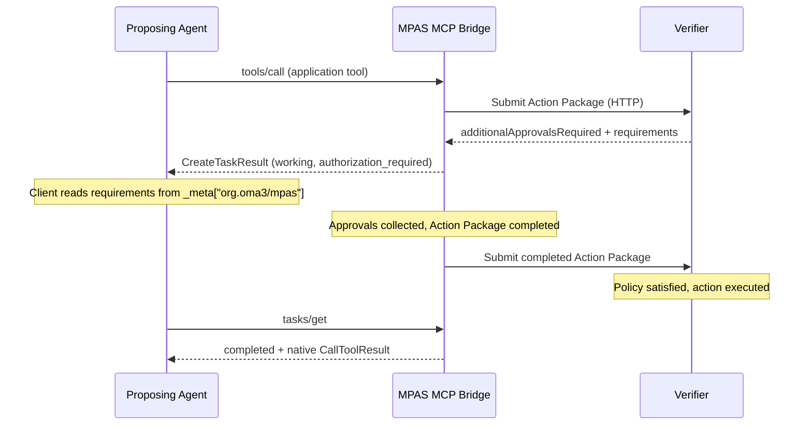

# SEP-3263: Multi-Party Action Security (MPAS) for MCP

- **Status**: Draft
- **Type**: Extensions Track
- **Created**: 2026-08-14
- **Author(s)**: OMA3 DAO (@oma3dao)
- **Sponsor**: None (seeking sponsor)
- **Extension Identifier**: `org.oma3/mpas`
- **PR**: https://github.com/modelcontextprotocol/modelcontextprotocol/pull/3263

### Governance

OMA3 maintains this extension under a third-party namespace (`org.oma3/mpas`).
OMA3 is a Swiss non-profit consortium and is applying to become an Associate
Member of AAIF.

## Abstract

Agent security systems are becoming more prevalent in autonomous workflows.
Such systems evaluate an MCP tool call and determine if the call requires 
additional approvals.  These approvals can take a considerable amount of time,
sometime blocking the calling agent from further work.  Currently there is no way 
for an agent to understand why a tool call is not returning.  This SEP introduces
an MCP Tasks extension that standardizes how an MCP server communicates back to
the agent 1. that the tool call is waiting for approvals and optionally 
2. what kind of approvals the tool call is waiting for.  The SEP also enables 
asychronous behavior so an agent can do other work and check in on the 
approvals later.

This SEP defines the `org.oma3/mpas` extension. It layers multi-party
authorization metadata on top of the official `io.modelcontextprotocol/tasks`
extension so that a server can tell a client: this action is pending approval,
here is what is required, and here is how to check back. The extension is
general enough to support any multi-party approval protocol, including simple
human-in-the-loop approval, though it uses the MPAS protocol as its
reference architecture.

MPAS (Multi-Party Action Security) is a primitive that brings flexible and 
fine-grained controls to any kind of digital action.  MPAS allows an operator
to specify which commands and arguments require approvals, and allows any
policy engine to specify the types of approvals required for the action. 
MPAS is an open-source project incubated and governed by OMA3, a Swiss non-
profit consortium.

The extension does not modify core MCP, does not modify the Tasks extension,
and does not prescribe a policy language.

## Motivation

### The authorization gap

Agents increasingly propose high-consequence actions: merging code, deploying
infrastructure, transferring assets. When these actions require multi-party
approval before execution, the server needs a standard way to tell the client
"not yet" and describe what is needed.

OAuth authenticates clients and connections. Server-side policy engines
(AuthZEN, OPA, Cedar, etc.) evaluate authorization decisions internally.
Neither provides a client-facing MCP primitive for expressing:

> This specific proposed action cannot execute yet because additional
> independent authorization is required.

Without a standard signal, each deployment invents a bespoke mechanism.
Agents cannot handle authorization-pending states generically across servers.

### What is MPAS

MPAS (Multi-Party Action Security) is an open protocol that brings
configurable multi-party approval workflows to any digital action. It is
incubated and governed by OMA3.

What MPAS provides:

- **Credential isolation** — agents propose actions but never hold the
  execution credential. A Verifier dispatches only after policy is satisfied.
- **Cryptographic proof of each approval** — signed, independently
  verifiable, and auditable.
- **Exact-action binding** — approvals apply to the specific operation,
  target, and parameters proposed. A modified action cannot be substituted.
- **Selective enforcement** — only configured governed actions require
  approvals. Read operations and low-risk actions can pass through.
- **Policy-framework agnostic** — the Verifier may use AuthZEN, OPA, Cedar,
  or any custom engine. MPAS does not prescribe a policy language.
- **Role separation** — proposer, maintainer, credential holder, and executor
  are independent roles. The proposing agent is not assumed to be an eligible
  maintainer and cannot approve its own action.

The MPAS protocol is defined independently of MCP. This SEP standardizes only
the MCP-facing client contract for servers that implement MPAS or a compatible
multi-party authorization protocol.

Full protocol description:
https://github.com/oma3dao/oma3-projects/blob/main/mpas.md

Specifications and reference implementation:
https://github.com/oma3dao/mpas

### Why an extension

The extension is narrow: authorization metadata on a Task. The approval
topology varies by deployment. The architectural separation of proposer,
maintainer, and executor is domain-specific. An extension lets this evolve
independently of core MCP without imposing multi-party authorization on
servers that do not need it.

### Generality

While this SEP uses MPAS as its reference architecture, the wire format is
usable by any system that needs to communicate "this action requires
additional approvals before execution." A server implementing pure
human-in-the-loop approval or any other multi-party authorization scheme
can adopt the same extension identifier and metadata structure.

## Specification

The key words MUST, MUST NOT, REQUIRED, SHALL, SHALL NOT, SHOULD, SHOULD NOT,
RECOMMENDED, MAY, and OPTIONAL are to be interpreted as described in RFC 2119.

### 1. Extension Identifier

This extension is identified as: `org.oma3/mpas`.

This extension REQUIRES co-negotiation of `io.modelcontextprotocol/tasks`
(SEP-2663).

### 2. Capability Negotiation

#### 2.1 Server Discovery

A conforming server advertises both extensions in its `server/discover`
response:

```json
{
  "resultType": "complete",
  "supportedVersions": ["2026-07-28"],
  "capabilities": {
    "tools": {},
    "extensions": {
      "io.modelcontextprotocol/tasks": {},
      "org.oma3/mpas": {
        "version": "2",
        "disclosure": "transparent"
      }
    }
  }
}
```

The `org.oma3/mpas` settings object:

| Field | Type | Required | Description |
|-------|------|----------|-------------|
| `version` | `string` | Yes | Extension version. This specification defines `"2"`. Version `"1"` refers to a prior OMA3 bridge interface that predates the official MCP Tasks extension and is not part of this SEP. |
| `disclosure` | `string` | Yes | Authorization disclosure mode. This specification defines `"transparent"` only. |

#### 2.2 Per-Request Client Capabilities

The client MUST declare both extensions in `params._meta` on every
`tools/call`, `tasks/get`, `tasks/update`, and `tasks/cancel` request:

```json
{
  "jsonrpc": "2.0",
  "id": 1,
  "method": "tools/call",
  "params": {
    "name": "merge_pull_request",
    "arguments": {
      "owner": "oma3dao",
      "repo": "example",
      "pullNumber": 42
    },
    "_meta": {
      "io.modelcontextprotocol/protocolVersion": "2026-07-28",
      "io.modelcontextprotocol/clientCapabilities": {
        "extensions": {
          "io.modelcontextprotocol/tasks": {},
          "org.oma3/mpas": { "version": "2" }
        }
      }
    }
  }
}
```

#### 2.3 Missing Capability Error

If either required extension capability is absent from a protected request,
the server MUST return JSON-RPC error `-32021` (Missing Required Client
Capability):

```json
{
  "jsonrpc": "2.0",
  "id": 1,
  "error": {
    "code": -32021,
    "message": "Missing required client capability",
    "data": {
      "requiredCapabilities": {
        "extensions": {
          "io.modelcontextprotocol/tasks": {},
          "org.oma3/mpas": { "version": "2" }
        }
      }
    }
  }
}
```

### 3. Tool Surface

A conforming server MUST expose application tools unchanged:

- Tool names, descriptions, input schemas, output schemas, and annotations
  MUST be identical to the application tools being governed.
- The server MUST NOT add `execution.taskSupport` to tool definitions.

Clients discover MPAS support through the `org.oma3/mpas` extension
capability in `server/discover`, not through tool names or descriptions.

### 4. Task Lifecycle

#### 4.1 Task Creation

Every accepted application `tools/call` MUST return a flat `CreateTaskResult`
with `resultType: "task"`:

```json
{
  "jsonrpc": "2.0",
  "id": 1,
  "result": {
    "resultType": "task",
    "taskId": "urn:uuid:786512e2-9e0d-44bd-8f29-789f320fe840",
    "status": "working",
    "statusMessage": "Awaiting authorization.",
    "createdAt": "2026-08-14T10:00:00Z",
    "lastUpdatedAt": "2026-08-14T10:00:00Z",
    "ttlMs": 1800000,
    "pollIntervalMs": 5000,
    "_meta": {
      "org.oma3/mpas": {
        "version": "2",
        "actionId": "urn:uuid:786512e2-9e0d-44bd-8f29-789f320fe840",
        "actionEnvelopeHash": {
          "alg": "sha-256",
          "value": "base64url-encoded-digest"
        },
        "authorizationState": "authorization_required",
        "disclosure": "transparent",
        "requirements": {
          "anyOf": [
            {
              "type": "threshold",
              "threshold": 2,
              "eligibleSigners": [
                "did:key:z6MkhaXgBZDvotDkL5257faiztiGiC2QtKLGpbnnEGta2doK",
                "did:key:z6Mkw1KSvGWNR7dyB3caY8jQh4RgfbS2QddShiCCfxUbLq7V"
              ]
            }
          ]
        },
        "expiresAt": "2026-08-14T10:30:00Z"
      }
    }
  }
}
```

The `taskId` is generated by the server. In the MPAS reference
implementation, `taskId` equals the MPAS Action ID (`urn:uuid:...`), which is
a cryptographically random UUID satisfying the Tasks extension entropy
requirement. The client uses `taskId` for all subsequent task operations.

Task creation is server-directed. The client MUST NOT send a `task` request
field.

The server MUST NOT return `CreateTaskResult` until the task is durably
created per the Tasks extension requirement.

#### 4.2 Task Polling

The client polls `tasks/get` to observe progress. `tasks/get` is read-only
and MUST NOT advance the authorization workflow.

#### 4.3 Task Status Mapping

| Task status | Meaning |
|-------------|---------|
| `working` | Authorization is in progress. MPAS metadata may be present. |
| `completed` | A `CallToolResult` is available in `result`. May have `isError: true` for authorization failures. |
| `cancelled` | The client requested cancellation and it was accepted. |
| `failed` | A JSON-RPC execution error occurred. |

`input_required` is not used by this version. The bridge abstracts the
approval collection process from the proposing client.

#### 4.4 Terminal Results

A native `CallToolResult` from successful execution is inlined unchanged in
the completed Task's `result` field.

A terminal authorization outcome without a native application result (e.g.,
rejected, expired) is represented as a completed Task with
`result.isError: true`:

```json
{
  "resultType": "complete",
  "taskId": "urn:uuid:786512e2-9e0d-44bd-8f29-789f320fe840",
  "status": "completed",
  "createdAt": "2026-08-14T10:00:00Z",
  "lastUpdatedAt": "2026-08-14T10:10:00Z",
  "ttlMs": 88200000,
  "result": {
    "content": [
      {
        "type": "text",
        "text": "Action rejected: policy denied the operation."
      }
    ],
    "isError": true
  }
}
```

Task `failed` MUST be used only for stored JSON-RPC execution errors, per
the Tasks extension specification.

### 5. MPAS Task Metadata

#### 5.1 Location

MPAS authorization metadata MUST be placed at `_meta["org.oma3/mpas"]` on
the Task object. It MUST be present while the Task status is `working`. It
MUST be omitted on terminal Tasks (`completed`, `cancelled`, `failed`).

#### 5.2 Schema

```typescript
interface MpasTaskMeta {
  /** Extension version. */
  version: "2";

  /** MPAS Action ID. */
  actionId: string;

  /** Hash of the signed Action Envelope. */
  actionEnvelopeHash: {
    alg: "sha-256";
    value: string;
  };

  /** Current authorization state. */
  authorizationState:
    | "submitted"
    | "authorization_required"
    | "pending"
    | "approvals_collected";

  /** Disclosure mode. */
  disclosure: "transparent";

  /** Approval requirements. Present when authorizationState is
      "authorization_required" and the verifier supplied requirements. */
  requirements?: ApprovalRequirements;

  /** ISO 8601 expiration of the action. */
  expiresAt: string;
}
```

#### 5.3 Authorization States

| State | Meaning |
|-------|---------|
| `submitted` | The action has been submitted to the verifier but no response has been received yet. |
| `authorization_required` | The verifier determined that additional approvals are required. Requirements are available. |
| `pending` | The verifier accepted the action and execution is pending. |
| `approvals_collected` | All required approvals have been collected and the action is being resubmitted for execution. |

#### 5.4 Approval Requirements (Transparent Disclosure)

When `authorizationState` is `authorization_required` and the verifier
supplied authorization requirements, the `requirements` field MUST be
present. The structure describes the approval conditions:

```typescript
interface ApprovalRequirements {
  /** One or more requirement groups. The action is satisfiable when any
      one group is fully satisfied. */
  anyOf: RequirementGroup[];
}

interface RequirementGroup {
  /** Requirement type. */
  type: "threshold";

  /** Number of approvals required from eligible signers. */
  threshold: number;

  /** DIDs of maintainers eligible to satisfy this requirement. */
  eligibleSigners: string[];

  /** The decision required. Default: "approve". */
  decision?: string;

  /** Human-readable description. */
  description?: string;
}
```

The client MAY use this information to contact eligible maintainers, display
approval status to a user, or take any other action appropriate to the
deployment. The extension does not prescribe how the client uses this
information.

### 6. Task Operations

#### 6.1 `tasks/get`

Returns a `DetailedTask` with `resultType: "complete"`. The response includes
MPAS metadata at `_meta["org.oma3/mpas"]` while the task is `working`.

An unknown task ID MUST return JSON-RPC `-32602` (Invalid params) with
message "Task not found".

#### 6.2 `tasks/update`

This extension does not use `input_required`. For a known task,
`tasks/update` MUST accept `inputResponses`, ignore them, and return:

```json
{ "resultType": "complete" }
```

An unknown task ID MUST return `-32602`.

#### 6.3 `tasks/cancel`

Cancellation is cooperative:

1. The server marks an active workflow as cancelled when possible.
2. The server stops future processing for the action.
3. Cancellation cannot undo an action already dispatched for execution.
4. Cancellation of an already-terminal task is an acknowledged no-op.

Response:

```json
{ "resultType": "complete" }
```

An unknown task ID MUST return `-32602`.

#### 6.4 Operations Not Supported

This extension does not define `tasks/list`, `notifications/tasks`, or task
subscriptions. These MAY be defined in a future version.

### 7. Architecture

#### 7.1 Role Separation

```
proposer != maintainer != credential holder != executor
```

The proposing agent does not hold the execution credential and is not
assumed to be an eligible maintainer. A Verifier evaluates authorization
policy and, when satisfied, executes the action (directly or through a
Credential Adapter that holds the execution credential).

In MPAS, both proposers and maintainers are *signers* — they hold private
keys and produce cryptographic signatures. The distinction is their role:
the proposer initiates the action, maintainers approve it.

#### 7.2 Sequence



The bridge abstracts the approval collection process. How approvals are
gathered and how the completed Action Package is assembled and resubmitted
to the Verifier is outside the scope of this extension.

#### 7.3 Relationship to OAuth

OAuth authenticates clients and authorizes access to MCP servers. MPAS
addresses a different question:

> Does this specific proposed action have the independent approvals required
> for credentialed execution?

MPAS does not replace OAuth. They operate at different layers and are
complementary.

#### 7.4 Relationship to Policy Engines

An MPAS Verifier MAY use AuthZEN, OPA, Cedar, or any custom policy engine
internally. MPAS is policy-framework agnostic. This SEP does not propose or
require a policy language.

The relevant layering:

```
MCP Client
    |
    | tools/call
    v
MPAS MCP Bridge (org.oma3/mpas extension)
    |
    v
MPAS Verifier
    |
    +-- AuthZEN
    +-- OPA
    +-- Cedar
    +-- custom policy engine
    |
    v
Action Execution
```

### 8. TTL and Retention

`ttlMs` is a duration in milliseconds measured from Task creation. It
mirrors the server's actual retention boundary for the action:

```
keepUntil = max(actionExpiration, resolvedAt + resultRetention)
ttlMs     = keepUntil - createdAt
```

`ttlMs` MAY increase when a task resolves (to cover post-resolution result
retention). `pollIntervalMs` is a client polling hint and is independent of
the server's internal processing interval.

## Rationale

### Tasks as the async primitive

The official Tasks extension already provides durable handles, client polling,
terminal result inlining, and cooperative cancellation. Using Tasks means any
Tasks-capable client gets a functional (if authorization-unaware) experience
by default — it sees a working task, polls, and eventually gets a result.
MPAS-aware clients read the `_meta` block for richer authorization context.

### Namespaced `_meta` for authorization metadata

The Tasks extension defines the Task shape but does not restrict additional
properties. Placing MPAS data under `_meta["org.oma3/mpas"]` keeps
authorization metadata cleanly separated from the Task lifecycle. Clients
that do not understand MPAS still see a valid working Task and can poll it
normally.

### Every call returns a Task

Simplifies client logic to one code path. The Verifier determines whether an
action can execute immediately or requires additional authorization. Even
immediately-executed actions return a completed Task. The client always
follows the same flow: receive task, poll if working, read result when
completed.

### Transparent disclosure

Returning approval requirements to the client enables it to assist in the
approval process — by contacting eligible maintainers, displaying status to a
user, or providing context to approvers. This is the primary use case for
agent-driven multi-party workflows. Opaque disclosure (where maintainer
identities are hidden) is architecturally valid but deferred to a future
version.

### `input_required` not used

This version does not use `input_required`. The bridge abstracts approval
collection from the proposing client. Future versions of this extension MAY
use `input_required` for alternative approval flows.

## Backward Compatibility

This is a new third-party extension. It does not modify core MCP behavior,
the Tasks extension, or tool schemas.

Clients that do not declare `org.oma3/mpas` receive `-32021` and may choose
not to connect to the server. Servers that do not implement this extension
are unaffected.

The extension targets MCP protocol version `2026-07-28` and the official
`io.modelcontextprotocol/tasks` extension (SEP-2663). It MUST NOT be
implemented with the removed 2025-11-25 experimental Tasks API.

## Security Implications

### Credential isolation

The proposing client never holds the execution credential. The Verifier (or
its Credential Adapter) holds execution credentials and dispatches only after
policy is satisfied. The client cannot extract, observe, or misuse them.

### Task visibility

Tasks are scoped to the bridge's configured identity context. Possession of
a task ID alone does not grant access to a different bridge instance's tasks.
Task IDs MUST be generated with sufficient entropy per the Tasks extension
requirement.

### Cooperative cancellation limitations

Once an action is dispatched for execution, cancellation cannot revoke it.
The `tasks/cancel` operation stops future processing but cannot recall an
already-executed operation. This is an inherent property of the architecture,
not a vulnerability.

### Authorization metadata exposure

Transparent disclosure reveals eligible maintainer DIDs to the proposing
client. Deployments where maintainer identities are sensitive should implement
opaque disclosure (future version) or restrict transparent metadata at the
policy layer.

### Action integrity

The Action Envelope binds the proposed action to a cryptographic hash of the
execution payload. Approvals sign over this hash. A modified action cannot
be substituted after approval because the hash would not match. This
integrity guarantee holds regardless of which party transports the approval.

## Reference Implementation

The OMA3 MPAS implementation serves as the reference:

- **MPAS SDK and bridge runtime:** https://github.com/oma3dao/mpas
- **Application bridges:** https://github.com/oma3dao/mpas-applications

The implementation demonstrates:

- Extension capability negotiation (`org.oma3/mpas` + Tasks)
- Ordinary MCP tool invocation returning `CreateTaskResult`
- `authorization_required` metadata with transparent approval requirements
- Approval collection without exposing execution credentials to the agent
- Successful execution and native result delivery via `tasks/get`
- Cooperative cancellation

An official SDK prototype (in a Tier 1 MCP SDK) is a later SEP-process
requirement per the SEP guidelines. The OMA3 implementation is the current
working prototype.

## Out of Scope

The following are explicitly out of scope for this SEP:

- **Maintainer MCP tool API.** A separate MCP server interface for
  maintainers (listing pending actions, reviewing, approving, rejecting) is
  planned as a future extension. This SEP addresses only the proposer-facing
  contract.
- **Opaque authorization disclosure.** A mode where maintainer identities are
  withheld from the proposing client.
- **Approval-count progress.** Real-time collected-vs-required counts.
- **Task notifications.** `notifications/tasks` and subscriptions.
- **Multi-tenant bridges.** Multiplexed bridges serving multiple independent
  clients through one instance.
- **MPAS Core protocol changes.** This SEP does not modify MPAS itself, its
  HTTP Profile, or execution-payload hashing.
- **Policy language.** This SEP does not propose, require, or prefer any
  specific policy engine or language.
