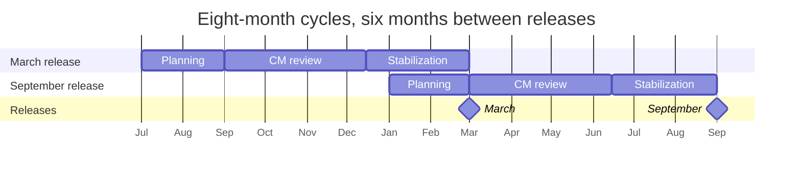

# SEP-3398: Release Cycle Updates

- **Status**: Draft
- **Type**: Process
- **Created**: 2026-09-17
- **Author(s)**: Kurtis Van Gent (@kurtisvg)
- **Sponsor**: Kurtis Van Gent (@kurtisvg), on behalf of the Core Maintainers
- **PR**: https://github.com/modelcontextprotocol/modelcontextprotocol/pull/3398

## Abstract

This proposal establishes a predictable release cycle for the Model Context Protocol (MCP). Specification releases occur every six months, in March and September. Each release has an eight-month cycle: two months of planning, a defined Core Maintainer review window, and stabilization before publication. Successive cycles overlap by two months.

A Working Group or the Core Maintainer group sponsors each SEP. Proposal development continues year-round, and all SEP types use the scheduled Core Maintainer review window. Release-bound proposals must be Final and merged by soft freeze. SDK implementation begins after acceptance. Unfinished proposals move to a later cycle without moving the release date.

A primary and secondary release manager coordinate each cycle, with the secondary becoming primary for the following release. The proposed transition moves the December 2026 release target to March 2027, followed by the recurring March/September cadence.

## Motivation

Contributors need to know when priorities are set, when proposals can receive a decision, and when implementations must be ready. Core Maintainers have limited review capacity, while Working Groups and SDK maintainers need enough time to develop proposals, test implementations, and resolve ambiguities before a specification is released.

The current [SEP guidelines](https://modelcontextprotocol.io/community/sep-guidelines) define sponsorship, review, acceptance, and finalization, but do not connect those stages to a recurring release calendar. The [SDK tiering policy](https://modelcontextprotocol.io/community/sdk-tiers) expects Tier 1 support before a specification release, with timelines agreed per release. Explicit milestones make that coordination predictable.

The Core Maintainers established this proposed process during the latest Core Maintainer Day at MCPCon Europe. This SEP formalizes that proposal. Unfinished proposals move to the next release.

## Specification

### Release Cadence Overview

MCP publishes specification releases in March and September. Each cycle begins eight calendar months before its target release date. The first two months are dedicated to planning, and the final two months overlap planning for the following release.

All release milestones are expressed in calendar months before release, including half-month intervals. These offsets set the planning targets; the published release calendar defines the exact dates and deadlines.

| Milestone           | Timing before release | Outcome                                                           |
| ------------------- | --------------------- | ----------------------------------------------------------------- |
| Planning begins     | 8 months              | Propose a roadmap and gather maintainer and WG feedback.          |
| CM review opens     | 6 months              | Publish priorities and begin scheduled SEP reviews.               |
| Soft freeze         | 2.5 months            | Close review and freeze scope to Final, merged SEPs.              |
| Next-cycle planning | 2 months              | Begin planning the following release.                             |
| SDK beta            | 1.5 months            | Publish Tier 1 SDK betas for ecosystem testing.                   |
| Hard freeze         | 1 month               | Restrict specification changes to emergencies.                    |
| Release             | 0 months              | Publish the specification, release notes, and readiness guidance. |

The two cycles below share one month axis. **January–March is the two-month overlap:** the March release is stabilizing while planning for the September release is underway. The diagram illustrates the recurring cadence; its dates are schematic, and the published release calendar supplies exact deadlines.

The following cycle's planning ends and its CM review window opens on the current release day. For a September release, the same overlap occurs in July–September while the following March cycle begins planning. SDK beta and freeze timings are listed in the milestone table above.

### Release Management

Each release has a primary and secondary release manager. Release managers are Maintainers who self-nominate and are selected by affirmative votes from more than half of all eligible Core Maintainers (CMs). Voter eligibility follows [Voting and Recorded Outcomes](#voting-and-recorded-outcomes).

A manager serves as secondary for one cycle and primary for the next. CMs select an incoming secondary before planning for the following release begins.

The primary is accountable for the release calendar, review scheduling, scope tracking, freeze coordination, SDK readiness, publication, and communication. The secondary participates in that work, maintains the queue and handoff notes with the primary, and learns the release procedures. Release managers coordinate and escalate decisions; SEP acceptance and exception authority remain with the roles specified in this SEP.

If a manager becomes unavailable, CMs select a replacement through the same nomination and voting process and record the revised assignments.

After the first release under this process, release managers publish a retrospective covering queue wait times, readiness at soft freeze, SDK beta availability, emergency changes, and manager workload during overlap. Substantive changes to this process follow the SEP workflow.

### Planning — 8 Months Before Release

Planning begins 8 months before release and runs until the CM review window opens at 6 months before release. At the start of planning, release managers publish exact milestone dates and cutoff times for the cycle.

During planning, Core Maintainers propose a roadmap, gather feedback from maintainers and Working Groups (WGs), and publish priorities covering a six-to-twelve-month horizon. Planning identifies dependencies across WGs and SDKs. Roadmap inclusion establishes review priority without guaranteeing acceptance or inclusion in a particular release.

### CM SEP Review — 6 to 2.5 Months Before Release

The CM review window opens six months before release and closes at soft freeze. It applies to Standards Track, Extensions Track, Process, and Informational SEPs. Scheduled pre-reviews and formal reviews take place within this window. Queue submissions can be made throughout the year.

WGs continue drafting, prototyping, gathering community feedback, and conducting internal reviews throughout the cycle. Specification changes for later releases remain in proposal branches or PRs until the current release is published.

Process and Informational SEPs can take effect after acceptance and completion of their implementation requirements. Extensions retain their own publication lifecycle. Their CM review timing follows this SEP, while specification freezes apply to the scope of the specification release being prepared.

#### Sponsorship and Submission

SEPs require sponsorship from a Working Group or the Core Maintainer group before formal review. A named representative acts on the sponsoring group's behalf. Sponsorship supports bringing the proposal to review; formal acceptance requires a separate decision.

- **WG sponsorship:** Develop the proposal in a publicly readable WG-designated repository or fork and obtain approval through the existing [WG decision-making process](https://modelcontextprotocol.io/community/working-interest-groups#decision-making-process). The WG lead records the decision and unresolved concerns, then submits the ready SEP to the [SEP review queue](https://voting.modelcontextprotocol.io/seps).
- **Core Maintainer group sponsorship:** The Core Maintainers agree to sponsor the proposal and designate a CM to represent the group. That representative records the sponsorship decision, consults relevant WGs, and submits the ready SEP to the same queue. No separate WG approval is required.

Before queue submission for formal review, both paths require a canonical SEP PR in the main MCP repository. Use a placeholder number until that PR supplies the SEP number, following [SEP-1850](https://modelcontextprotocol.io/seps/1850-pr-based-sep-workflow). WG-sponsored PRs link to the WG review and approval; proposals sponsored by the Core Maintainer group may start directly in the main repository. Record the sponsoring group's decision and consultation with affected WGs in the PR.

The SEP's Sponsor field names the Maintainer or Core Maintainer acting on the sponsoring group's behalf and responsible for status, labels, and implementation tracking. A qualified WG lead may fill this role; for Core Maintainer group sponsorship, the designated CM does so.

Both paths follow the same queue, review schedule, and acceptance requirements. When a SEP is selected for discussion, the release manager invites the WG lead or designated CM, as applicable, and all SEP authors to the CM meeting.

#### Review Queue and Scheduling

Release managers maintain the public [SEP review queue](https://voting.modelcontextprotocol.io/seps). Each entry records a link to the proposal, sponsoring group and representative, named maintainer sponsor when assigned, requested review type, readiness date, roadmap alignment, and target review cycle. Formal review entries link to the canonical upstream SEP PR. Pre-review entries may link to an initial proposal without an upstream SEP number or completed group approval.

A WG lead or designated CM may request optional pre-review to discuss direction, dependencies, and major concerns before investing in a complete proposal. Pre-review provides guidance and does not grant acceptance or reserve release scope.

For each agenda, release managers prioritize ready formal reviews, then pre-reviews. Within each category, roadmap-aligned proposals come first, followed by readiness date, oldest first. Record the reason for any scheduling exception in the queue. A proposal returned for substantive revision receives a new readiness date when resubmitted; a ready proposal deferred solely for lack of agenda time retains its readiness date.

Core Maintainers continue meeting every two weeks. For each formal review:

1. **Two weeks before the meeting:** Release managers select ready proposals with Core Maintainers and publish the agenda and proposal links.
2. **During the preceding week:** Reviewers leave asynchronous comments. Authors and sponsors respond and identify questions requiring discussion.
3. **At the meeting:** The author, WG lead, or designated CM presents the proposal, remaining questions, and available implementation feedback.
4. **After the presentation:** Open the recorded vote described below, then publish the outcome and required follow-up on the SEP PR and in the queue.

Formal reviews must be scheduled early enough for the full voting period to finish before the window closes. Release-bound proposals also need time to satisfy finalization and merge requirements before soft freeze. Queue placement guarantees neither review time nor release inclusion.

#### Voting and Recorded Outcomes

After presentation, the named maintainer sponsor opens a recorded seven-calendar-day vote in the maintainer Discord server and links the voting record from the SEP PR. The record identifies the proposal revision being voted on, the closing time, and eligible voters: the current Core Maintainer group, including Lead Maintainers and excluding emeritus members, as recorded when voting opens.

Acceptance requires affirmative votes from more than half of all eligible voters. Abstentions and absences do not count as approval, and a majority of those attending a meeting alone is insufficient. A majority voting to reject produces a rejection; otherwise a proposal that does not reach the acceptance threshold returns for revision or later review. The sponsor records the tally, decision, rationale, and follow-up on the SEP PR and updates its status under the existing guidelines.

The voting period remains open for all seven days. A material change to the proposal during that period returns it for review rather than being accepted under votes cast on the earlier revision. A vote that cannot conclude before the review window closes is deferred to the next window without a partial result counting as acceptance.

Existing [Lead Maintainer authority](https://modelcontextprotocol.io/community/governance#roles) remains in effect. Where a proposal amends governance, the stricter proposal, comment-period, and approval requirements of [SEP-2085](https://modelcontextprotocol.io/seps/2085-governance-succession-and-amendment) apply.

#### Implementation After Acceptance

SDK maintainers should begin implementation as soon as a SEP is accepted. Early implementations and prereleases should feed ambiguities and interoperability findings back to the author, sponsor, relevant WGs, and Core Maintainers while changes can still be made.

SDK implementations are not required for a SEP to reach Final.

### Soft Freeze — 2.5 Months Before Release

At soft freeze, every SEP included in the specification release must be Final and its changes merged. This includes the specification text, applicable schema changes, changelog entry, completed reference implementation, and any conformance tests required by [SEP-2484](https://modelcontextprotocol.io/seps/2484-conformance-tests-required-for-final-seps). Acceptance alone does not meet the cutoff.

Release managers publish the frozen scope and deferred proposals. From soft freeze until hard freeze, changes are limited to bug fixes, polish, and clarifications within that scope. New features and substantial redesign move to a later cycle. Corrective changes follow normal review and applicable testing requirements.

An accepted proposal that misses finalization remains Accepted and is tracked for a later release. A proposal still awaiting a decision retains its existing status and returns to the queue. Deferral alone does not require repeating an acceptance vote, but a material redesign requires renewed review. Rejected proposals follow the existing rejection and resubmission process.

Release inclusion in a later cycle still depends on readiness and that cycle's scope. The release date does not move to accommodate unfinished proposals.

### Next-Cycle Planning — 2 Months Before Release

Planning for the following release begins 2 months before the current release, while the current release remains in stabilization. This is 8 months before the following release. The next cycle follows the planning process above, ending planning and opening its CM review window on the current release day.

During this two-month overlap, the current secondary release manager also serves as primary for the following cycle. They support current-release stabilization while leading next-cycle planning with the incoming secondary. The outgoing primary remains accountable for the current release through publication.

### SDK Beta — 1.5 Months Before Release

Tier 1 SDKs publish beta versions supporting the frozen specification scope 1.5 months before release, giving client and server developers half a month to report issues before hard freeze. Beta release notes identify the target specification release, available functionality, known gaps, and where to report feedback. SDK maintainers provide conformance results and outstanding blockers to the release managers.

This milestone covers features required by the SDK tiering policy; it does not make experimental features or extensions mandatory for Tier 1. Other SDKs are encouraged to join the beta milestone and continue to follow their existing tier commitments.

Release managers maintain a public readiness summary with SDK versions, conformance results, gaps, owners, and expected resolution dates. Missed beta or stable milestones are escalated to Core Maintainers and the SDK WG and disclosed in release guidance. An individual SDK delay does not postpone specification publication or automatically change that SDK's tier; tier decisions remain under the existing tiering policy.

### Hard Freeze — 1 Month Before Release

Hard freeze begins 1 month before release. Every change to the frozen specification requires approval through a full Core Maintainer vote. Only changes addressing critical security vulnerabilities or release-blocking correctness or interoperability defects are eligible for a vote. Feature additions and discretionary redesign do not qualify.

The primary release manager coordinates each exception through the normal PR workflow:

1. Confirm that the proposed change meets the emergency criteria above. Document the qualifying defect, why it cannot wait, the smallest proposed correction, and its effect on SDKs and release artifacts. Changes that do not meet the criteria must not be submitted for a vote.
2. The primary release manager opens a recorded vote for the corrective PR to the full Core Maintainer group. A separate SEP, SEP sponsor, or meeting presentation is not required.
3. Obtain review from affected implementation maintainers and run relevant regression and conformance checks before merging. Where observable protocol behavior changes, update applicable conformance coverage.
4. Record the vote, decision, validation results, and any changed implementation guidance. Notify affected SDK maintainers and update the readiness summary and release notes.

Emergency votes may take place and conclude outside the CM review window. The voter eligibility, approval thresholds, voting period, and Lead Maintainer authority in [Voting and Recorded Outcomes](#voting-and-recorded-outcomes) still apply. Approval and validation must be complete before merging. If a defect cannot be corrected safely in time, removing the affected new feature and its dependent changes also requires a qualifying emergency and approval through the same full CM vote. The remaining specification proceeds on schedule.

Security-sensitive details follow the existing [security reporting and disclosure process](https://modelcontextprotocol.io/community/security). Keep the decision and validation record in the restricted channel during an embargo and publish it when disclosure permits.

### Release — 0 Months Before Release

Tier 1 SDKs publish stable support before specification publication, consistent with their existing feature-support commitments.

On release day, publish the dated specification, release notes, implementation and migration guidance, and SDK readiness summary using the existing release procedures. Protocol versions retain their date-based format. Complete the handoff notes with outstanding issues and follow-up owners. The incoming primary continues leading the next cycle, whose review window now opens.

### Transition and Adoption

This SEP proposes moving the release previously targeted for December 2026 to March 2027. The last specification release was July 28, 2026. The first cycle uses the planning completed in August 2026.

Within two weeks of adoption, Core Maintainers select the initial primary and secondary through the nomination and voting process above, and those managers publish the transition calendar, review meetings, and exact freeze, beta, and release deadlines. The first primary need not have served a preceding secondary cycle. The transition calendar opens the first review window when the process becomes operational and closes it at the March release's calculated soft freeze. Only meetings that allow the full agenda lead time and voting period are scheduled.

Planning for September 2027 begins in January 2027. Planning for March 2028 begins in July 2027. Subsequent cycles follow the full recurring calendar.

Existing upstream SEP PRs remain valid and retain their numbers, discussions, and completed decisions. Before their next formal review, proposals obtain sponsorship from a WG or the Core Maintainer group and enter the queue; authors do not need to close and recreate their PRs in a WG repository. Already accepted proposals retain acceptance and must meet release-readiness requirements. This SEP itself is considered under the process in force before its adoption.

## Rationale

### Predictable Dates with Flexible Scope

A six-month release cadence gives implementers a regular planning horizon. Eight-month cycles allow roadmap planning to overlap stabilization, so one release can finish while priorities for the next are prepared. Expressing every release milestone in months makes the timeline easier to compare, while the published calendar provides exact deadlines.

Delaying releases for unfinished proposals would make the next release harder to plan. Deferring scope instead gives unfinished work another opportunity without treating a missed deadline as rejection.

### Review Capacity and Sponsorship

WG review brings domain feedback and prototypes into proposals before they consume CM agenda time. A public queue makes priorities and deferrals visible. Applying the same CM window to every SEP type simplifies scheduling, although it can delay process and extension proposals that are ready outside the window. Continuous WG development and optional pre-review help contributors prepare for the next opportunity.

Sponsorship by the Core Maintainer group provides a direct path for process changes, proposals spanning multiple groups, and topics without an established WG. Consultation with relevant WGs preserves domain feedback, and the same review and acceptance requirements apply to both paths. The named sponsor preserves accountability for status and implementation duties.

### Readiness Before Stabilization

Requiring Final, merged SEPs at soft freeze gives SDK maintainers a concrete specification to implement and test. Allowing merely accepted designs to enter stabilization would leave specification text or conformance work competing with bug fixes. Early SDK implementation reduces that risk without making every SDK implementation a condition of SEP finalization.

### Recorded Votes and Emergency Review

A seven-day vote allows participation across time zones and gives absent meeting attendees a defined opportunity to vote. Requiring a majority of the eligible group avoids acceptance based on a small meeting turnout, at the cost of needing enough participation before each deadline.

Full Core Maintainer votes keep changes to frozen release scope accountable to the group.

### Rotation and Transition

Serving as secondary prepares a release manager to lead the next cycle. Naming responsibility for each overlapping cycle avoids an ambiguous handoff. Moving the upcoming target to March 2027 creates time to introduce the calendar and readiness milestones while crediting planning already performed.

## Backward Compatibility

This SEP changes contribution and release processes. It introduces no protocol messages, schema changes, version-negotiation changes, or new requirements for deployed clients and servers. Existing date-based specification versions remain valid.

WG-sponsored proposals gain a group approval stage, while proposals sponsored by the Core Maintainer group may proceed directly to upstream submission. Both paths use a seasonal CM review window. Existing proposal history and acceptance decisions are preserved as described in the transition procedure. This SEP updates the sponsorship and scheduling portions of SEP-1850 while retaining canonical upstream PRs, PR-based numbering, sponsor-managed statuses, and existing finalization requirements.

SDK beta and stable milestones make release expectations explicit while preserving tier assignment procedures and the existing exclusion of experimental features and extensions from mandatory tier coverage. Final SEPs remain historical records; process adoption updates the current contributor guidance rather than rewriting those records.

## Security Implications

No new protocol attack surface, authentication behavior, or handling of user data is introduced. A fixed calendar must still allow critical security corrections during freezes. The emergency process requires a full Core Maintainer vote, implementation review, and relevant validation while preserving coordinated disclosure. Public queue entries and release notes must not disclose embargoed vulnerability details prematurely.

## Reference Implementation

For this Process SEP, implementation consists of contributor documentation and operational setup. The work required before Final status is:

1. Update the current SEP guidelines and WG guidance to explain sponsorship, upstream submission, review scheduling, voting, and transition handling.
2. Publish release-cycle documentation and the first calendar, including exact UTC deadlines and review meetings.
3. Set up the public [SEP review queue](https://voting.modelcontextprotocol.io/seps), publish the SDK readiness summary, assign their maintainers, and record the initial release-manager appointments.
4. Publish a release checklist covering freeze scope, emergency approvals, SDK milestones, publication, and handoff.

Link the documentation changes, calendar, queue, and assignments here as they become available. Process SEPs are exempt from protocol conformance-test requirements; existing release tooling can continue to perform publication.

## Open Questions

- **Next release date:** What exact date should we target for the next specification release, and how should it align with AgentCon NA 2027? March 2027 remains the proposed target month; the release date and corresponding milestones still need to be confirmed.
- **Emergency votes close to release:** How should qualifying emergencies be handled when fewer than seven days remain before release? Can the voting period be shortened while retaining a full Core Maintainer vote, and what happens if a safe change cannot be approved in time?
